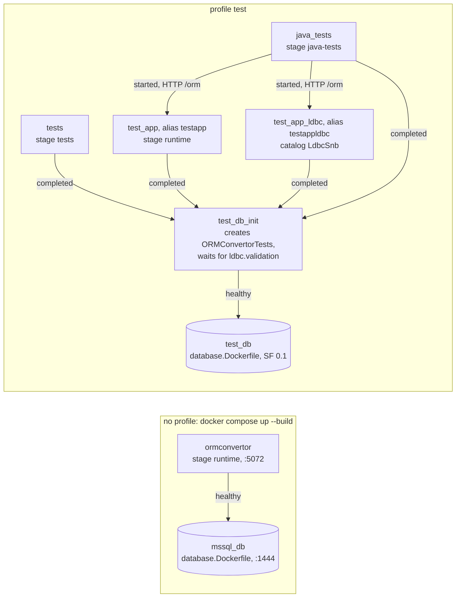
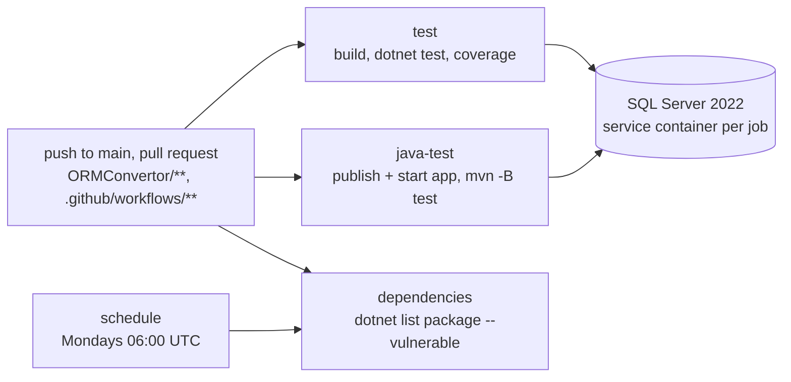

A web-based tool for translating between ORM frameworks. This operating manual says how it is run, deployed, configured and tested, and how each path was verified — the operational half of the deployment view (decision [058](../docs/decisions/058-only-the-operational-half-of-the-deployment-view-moves.md)); the tool itself is described in [`docs/architecture.md`](../docs/architecture.md). **Last verified against the code: 2026-09-21.**

# Deployment

One ASP.NET Core process, `ORMConvertorAPI`, serves the REST API and the static frontend under the path base `/orm`. The connection strings in `appsettings.json` are empty (S4, decision [029](../docs/decisions/029-database-connection-is-the-consumer-projects-fact.md)); see [Configuration](#configuration). **No endpoint requires a login**: a trusted network or an access-controlling proxy is assumed ([`threat-model.md`](../docs/threat-model.md)).

| Path | Environment | Verified by running it, on two machines |
|---|---|---|
| [Visual Studio](#visual-studio), [.NET CLI](#net-cli) | `Development` | profiles `http`, `https`: frontend served, `CatalogState = Reached` |
| [Docker](#docker-application--database) | `Development` | 2026-08-23, 2026-08-24; see below |
| [PM2](#pm2) | `Development` | `CatalogState = Reached`, version in the run record |
| [Real instance](#deploying-a-real-instance) | `Production` | Windows only; see below |

## Visual Studio

Open `ORMConvertor.sln`, startup project `ORMConvertorAPI`. The profiles in `ORMConvertorAPI/Properties/launchSettings.json` set `Development` (Swagger UI, user secrets) and open the relative `orm/` on their `applicationUrl`: `http` on `http://localhost:5072`, `https` on `https://localhost:7124` and `http://localhost:5072` (needs `dotnet dev-certs https`). `IIS Express` is an unverified template leftover. Only Visual Studio opens a browser.

## .NET CLI

```sh
dotnet run --configuration Release --launch-profile http --project ORMConvertorAPI/ORMConvertorAPI.csproj
```

The URL is printed to the console (typically [http://localhost:5072/orm/](http://localhost:5072/orm/)).

## Docker (application + database)

`docker-compose.yml` holds the system and, under the profile `test`, the test suites (decision [039](../docs/decisions/039-container-configuration-of-the-environment.md)); `docker compose up --build` starts only `ormconvertor` and `mssql_db`. Arrows are `depends_on` with its condition.



`ORMConvertorAPI/Dockerfile`: `advisor-native` builds `libadvisor.so`, `dotnet-build` publishes, `tests` builds on it, `java-tests` on `maven:3.9.11-eclipse-temurin-25-noble`, `runtime` on `aspnet:10.0` with `libglpk40`. **`dotnet-build` copies every `.csproj` by name: a new project needs a line in that `COPY` list.** `java-tests` copies all of `Tests/Database/` and `database/ldbc/updates/`; the pom's `<testResources>` selects from them.

- **`ormconvertor`** — [http://localhost:5072/orm/](http://localhost:5072/orm/), Swagger UI at `/orm/swagger`; gets `ConnectionStrings__AdvisorDatabase` and `ConnectionStrings__CatalogDatabase`.
- **`mssql_db`** — SQL Server 2022 on `localhost,1444`, `SA` / `Testingorms123` (development only), with `WideWorldImporters` and `LdbcSnb`: LDBC SNB Interactive v1, scale factor 1 (decision [110](../docs/decisions/110-ldbc-snb-as-a-second-reference-domain.md)), downloaded at build (222 MB) and loaded by `database/ldbc/load-ldbc.sh` on the first start in about a minute; beside it the validation set of LDBC Interactive v1 for the same scale factor, the judge of the LDBC catalog (decision [117](../docs/decisions/117-the-interactive-v1-validation-set-judges-the-ldbc-catalog-at-the-fourth-level.md); the image keeps its scale factor's file of the 205 MB archive), in the table `ValidationOperation`. A database whose extended property `ldbc.dataset` is missing or names another archive is reloaded; one that has the data and lacks `ldbc.validation` gets the set alone; a failed load leaves the server up without it.
- Port 1444 is also bound by the inherited benchmarks: run one at a time.

**Verified** on the same Docker Desktop version: `POST /convert` from Dapper completed `Sales.Customers` (table, schema, types, length, nullability) from the catalog — F6 through the interface; `POST /advisor/run` solved the model through `libadvisor.so` (outside the guarantees, [`architecture.md`](../docs/architecture.md) §9). On a fresh volume (release `2.1.0`) `LdbcSnb` loaded in about 40 s — 17 tables, 29 foreign keys, 9 892 persons, 3 055 774 messages — and an infeasible model sent to `/advisor-test` logged its message with that call.

## PM2

`ecosystem.config.js`, inherited from the original prototype, defines the [PM2](https://pm2.keymetrics.io/) app `orm`, which runs the [.NET CLI](#net-cli) command: `pm2 start ecosystem.config.js`, `pm2 delete orm` to stop. `cwd: __dirname` makes the relative `--project` path work; the `env` block blanks `version` and `Version`, which `dotnet run` would turn into an MSBuild property overriding the assembly version. Needs Node.js with PM2 (`npm install -g pm2`) and the .NET SDK; listens on `localhost:5072` only.

## Deploying a real instance

**1. Publish**; the server needs only the ASP.NET Core runtime:

```sh
dotnet publish ORMConvertorAPI/ORMConvertorAPI.csproj --configuration Release --output /srv/ormconvertor
cd /srv/ormconvertor && dotnet ORMConvertorAPI.dll
```

**The `cd` matters:** the working directory is the content root, where `wwwroot` and `appsettings.json` are looked for. Started elsewhere, the API answers but `/orm/` returns an empty 404; the only trace is `Request reached the end of the middleware pipeline without being handled by application code`. Otherwise name it:

```sh
dotnet /srv/ormconvertor/ORMConvertorAPI.dll --contentRoot /srv/ormconvertor
```

**2. `Production` is the default:** no Swagger UI and no user secrets, so configuration arrives as environment variables.

**3. Proxy.** The app listens on `ASPNETCORE_URLS` without TLS; `UsePathBase` strips `/orm` without requiring it. A public instance belongs behind a reverse proxy that terminates HTTPS and keeps the prefix.

**4. `AllowedHosts` is `*`:** narrow it when exposed directly.

**Verified** on two Windows machines: `/orm/swagger` 404, `/orm/` 200; the catalog variable moved `CatalogState` from `NotConfigured` to `Reached`; `/advisor-test` 400 with the `libadvisor.so` load error; `--contentRoot` cured the content-root failure. **Not covered:** a Linux host, a real reverse proxy, the Advisor with its native library.

# Configuration

No connection string has a value in the repository, except the disposable credentials of servers that compose and CI create ([`threat-model.md`](../docs/threat-model.md)). Keys use `:` in user secrets and `appsettings.json`, `__` in environment variables. The application reads user secrets only in `Development`; the test project always.

| Key | Used by | Purpose; when unset | Set in |
|---|---|---|---|
| `ConnectionStrings:CatalogDatabase` | API | Catalog completion. Unset: conventions only, reported in `CatalogState`; F4 and F6 do not hold through the interface. | secret, env; compose `ormconvertor`, `test_app`; CI |
| `ConnectionStrings:AdvisorDatabase` or `Advisor:ConnectionString` | API | Advisor benchmarking. Unset: the Advisor names the key and stops. | secret, env; compose `ormconvertor` |
| `ConnectionStrings:TestDatabase` | .NET suite | Database tests. Unset: they skip with a reason. | secret, env; compose `tests`; CI |
| `ORMCONVERTOR_REQUIRE_TEST_DATABASE` | .NET suite | `1`: a missing database fails. | env; compose `tests`; CI |
| `ORMCONVERTOR_TEST_SCHEMA` | both suites | Plain SQL identifier. Unset: `ormconvertor_test`, `ormconvertor_java_test`. | env |
| `ORMCONVERTOR_TEST_JDBC_URL` | Java suite | JDBC URL with user and password. | env; compose `java_tests`; CI |
| `ORMCONVERTOR_API_URL` | Java suite | Running instance with `/orm`: `http://testapp:5072/orm`, in CI `http://localhost:5072/orm`. | env; compose `java_tests`; CI |
| `ORMCONVERTOR_RECORD_DIFFERENTIAL` | both suites | Path where a recording run writes canonical results. | env, by hand |
| `ASPNETCORE_ENVIRONMENT` | API | `Development`: Swagger UI, user secrets. Unset: `Production`. | launch profiles, compose, CI |
| `ASPNETCORE_URLS` | API | Listening address. | image `runtime`, CI |
| `Parsing:MaxNestingDepth` | API | Parser nesting cap (decision [092](../docs/decisions/092-input-nesting-depth-capped-before-the-descent.md)); `0` is off. Unset: 128. | `appsettings.json`, env |
| `ORMCONVERTOR_CATALOG_DATABASE` | compose | Catalog of `ormconvertor`. Unset: `WideWorldImporters`; `LdbcSnb` for the LDBC queries. | shell |
| `LDBC_SCALE_FACTOR` | compose | `1`, another Interactive v1 scale factor (`0.1`, `0.3`, `3`, `10`, …) or `none` (no `LdbcSnb`). | shell |

**The nesting cap is the operator's alone**: read at startup, absent from `/convert`. Deeper input overflows the stack, which .NET cannot catch, and kills the process ([`threat-model.md`](../docs/threat-model.md), threat 2). Each response reports it in `maxNestingDepth`.

# Advisor prerequisites

Translation works anywhere. The Advisor also needs SQL Server with WideWorldImporters (`ConnectionStrings:AdvisorDatabase`) and `libadvisor.so`, built only in the Docker image — elsewhere its endpoints fail. The ILP model: [`architecture.md`](../docs/architecture.md) §8.

# Tests

## In a container

```sh
docker compose --profile test build tests java_tests test_app test_app_ldbc test_db
docker compose --profile test run --rm tests         # the .NET suite
docker compose --profile test run --rm java_tests    # the Java suite
```

S5's "one main command" per suite: the host needs only Docker. Each `run` starts SQL Server, creates the database once it is healthy and runs the whole suite in its own schema (decision [076](../docs/decisions/076-java-wrappers-in-csharp-jvm-in-containers.md)). `test_app` is the tool the Java suite translates against (decision [078](../docs/decisions/078-java-suite-as-a-client-of-a-running-instance.md)), its catalog on the test database, aliased `testapp` because the JDK's `HttpClient` refuses `_` in a host name. The SQL Server of the profile is the image of `mssql_db` at scale factor 0.1 (`LDBC_TEST_SCALE_FACTOR`), so its first start restores WideWorldImporters and loads `LdbcSnb` with its validation set before `test_db_init` lets the suites run; both suites then run [the LDBC judge](#the-ldbc-judge) as well, `test_app_ldbc` serving the Java one.

> **`run` does not rebuild.** Without `build` it measures the tree the images were built from — green, with nothing to say so; it has silently reported a stale tree twice. **The only tell is the test count** against [the size of the suite](#how-large-the-suite-is-and-what-it-covers).

## On the host

```sh
dotnet test Tests/Tests.csproj --configuration Release
```

Database tests need `ConnectionStrings:TestDatabase`, e.g. `Server=(localdb)\MSSQLLocalDB;Database=ORMConvertorTests;Trusted_Connection=True;TrustServerCertificate=True`.

## The test database

The tests **create their schema themselves** in any reachable SQL Server (decision [016](../docs/decisions/016-generated-artifact-verification-levels.md)), from `Tests/Database/`.

- **Schema** `ormconvertor_test` from `Database/TestSchema.sql` (`{{schema}}` for the name), the expected answer F4 measures against: single-part keys by `IDENTITY` (`Customers`, `Suppliers`) and assigned (`Products`); composite keys of two (`Orders`, `ProductSuppliers`), three (`OrderLines`) and four parts (`OrderLineAllocations`); one- to three-column foreign keys; 1:1 over a shared key (`CustomerProfiles`); a junction table (`ProductSuppliers`); length, precision/scale, nullability. `TestSchemaFixtureTest` guards it.
- **Lifetime.** `TestSchemaFixture` serves the collection `TestDatabaseSchema`: dropped, created once, dropped after. A writing test (level 4: `DapperToNHibernatePersistenceTest`, `DapperToEFCorePersistenceTest`) rolls back its own transaction over `OpenConnection()`.
- **Skip or fail.** `SkipIfUnavailable()` skips with a reason, since the tool must translate without a database; with `ORMCONVERTOR_REQUIRE_TEST_DATABASE` it fails.
- **LDBC:** schema `<schema>_ldbc` from `database/ldbc/schema.sql`, `constraints.sql` and `indexes.sql`, empty tables for `Combined/LdbcCatalogTest`.

## The LDBC judge

The validation set of LDBC Interactive v1 judges the Interactive queries of the LDBC catalog at level 4 (decision [117](../docs/decisions/117-the-interactive-v1-validation-set-judges-the-ldbc-catalog-at-the-fourth-level.md); [`architecture.md`](../docs/architecture.md) §6.2): both suites replay it in order over `LdbcSnb` - the inserts from `database/ldbc/updates`, every read against the generated artifact of each framework - and return the database to its loaded state before and after.

| Setting | .NET suite | Java suite |
|---|---|---|
| `LdbcSnb` with the data set and the validation set | `ConnectionStrings:LdbcDatabase` (user secret or `ConnectionStrings__LdbcDatabase`) | `ORMCONVERTOR_TEST_LDBC_JDBC_URL` |
| an instance of the tool whose catalog is `LdbcSnb` | — (translates in process) | `ORMCONVERTOR_LDBC_API_URL`, e.g. `http://localhost:5080/orm` |
| a missing judge fails instead of skipping | `ORMCONVERTOR_REQUIRE_LDBC_DATABASE=1` | the same |
| replay only the first n lines | `ORMCONVERTOR_LDBC_VALIDATION_ROWS` | the same |

- **Without the settings** the judge skips with the reason; the rest of the suite does not need `LdbcSnb`.
- **The compose profile** sets everything and replays the first 1000 lines of the SF 0.1 set - a check.
- **The whole set over SF 1 is a run of its own**, about a day per suite (2026-10-10, after decision [121](../docs/decisions/121-the-text-of-a-catalog-query-takes-the-shape-its-planner-needs-and-ldbcsnb-carries-the-indexes-its-reads-need.md): 86 lines a minute in the .NET suite), the two suites one after the other because they share the lock. It runs against `mssql_db` of the system profile, started with `docker compose up -d --build mssql_db`, and for the Java suite an instance over the LDBC catalog, `ORMCONVERTOR_CATALOG_DATABASE=LdbcSnb docker compose up -d ormconvertor`. Start each suite detached, named and without `--rm`, so that `docker logs <name>` keeps the result whatever happens to the shell that started it:

  ```sh
  docker compose --profile test run -d -T --no-deps --name ldbc_judge_dotnet \
    -e "ConnectionStrings__LdbcDatabase=Server=mssql_db,1433;Database=LdbcSnb;User ID=sa;Password=Testingorms123;TrustServerCertificate=true;" \
    -e ORMCONVERTOR_LDBC_VALIDATION_ROWS= \
    tests --filter "FullyQualifiedName~LdbcValidationTest" --logger "console;verbosity=detailed"
  docker compose --profile test run -d -T --no-deps --name ldbc_judge_java \
    -e "ORMCONVERTOR_TEST_LDBC_JDBC_URL=jdbc:sqlserver://mssql_db:1433;databaseName=LdbcSnb;user=sa;password=Testingorms123;encrypt=true;trustServerCertificate=true" \
    -e ORMCONVERTOR_LDBC_API_URL=http://ormconvertor:5072/orm -e ORMCONVERTOR_LDBC_VALIDATION_ROWS= \
    java_tests -Dtest=LdbcValidationTest
  ```

  A run stopped in the middle leaves the inserts of the lines it replayed in `LdbcSnb`; the next replay removes them first, and `database/ldbc/updates/undo.sql` does the same by hand.
- **Loading the set elsewhere:** take `validation_params-sf<N>.csv` of the scale factor the data has from `validation_params-interactive-v1.0.0-sf0.1-to-sf10.tar.zst` at `datasets.ldbcouncil.org/interactive-v1/`, run `database/ldbc/validation.sql` with `{{schema}}` replaced by `dbo` and `-v ValidationFile=<path the server can read>`, then add the extended property `ldbc.validation` with the file's name. After a change to `database/ldbc/indexes.sql` (decision [121](../docs/decisions/121-the-text-of-a-catalog-query-takes-the-shape-its-planner-needs-and-ldbcsnb-carries-the-indexes-its-reads-need.md)) run that script the same way; it is rerunnable, and the container does it by itself on the next start.
- **One replay at a time:** a replay holds the application lock `ldbc.validation` on its connection, so the other suite waits; the lock dies with the connection.

## The Java test suite

`JavaTests/`, Maven and JUnit outside `ORMConvertor.sln`, the suite of F12 (decision [076](../docs/decisions/076-java-wrappers-in-csharp-jvm-in-containers.md)); what each test verifies is in [`architecture.md`](../docs/architecture.md) §6.2.

- **Verdict** only from the `java-tests` stage and the `java-test` job. A host with JDK 25 and Maven (e.g. those bundled with IntelliJ) can `mvn test-compile`, or run the suite against its own database and an instance whose catalog names that same database, as a check.
- **Versions** of Hibernate, EclipseLink, MyBatis, `mssql-jdbc` and JUnit live only in `JavaTests/pom.xml`; `TargetFrameworkDescriptorTest.JavaSuiteDependenciesMatchTheJavaDescriptors` binds the three framework versions to the descriptors.
- **Inputs:** `ORMCONVERTOR_TEST_JDBC_URL`, e.g. `jdbc:sqlserver://localhost:1433;databaseName=ORMConvertorTests;user=sa;password=...;encrypt=true;trustServerCertificate=true`, the schema built from the same `TestSchema.sql`; `ORMCONVERTOR_API_URL`, polled at `/required-content`.
- **No skip**: where it runs, a database and an instance were started for it - but for [the LDBC judge](#the-ldbc-judge), which needs `LdbcSnb` and an instance over it and skips without them. `mvn test -Dgroups=integration` runs the integration tests alone (decision [087](../docs/decisions/087-an-integration-test-is-a-run-against-the-database.md)).

Framework behaviour asserted as measured: decisions [078](../docs/decisions/078-java-suite-as-a-client-of-a-running-instance.md), [079](../docs/decisions/079-fractional-second-precision-as-second-precision.md), [080](../docs/decisions/080-eclipselink-as-the-second-profile-over-the-jpa-layer.md).

## Continuous integration

`.github/workflows/ormconvertor-tests.yml`, permissions `contents: read`:



| Job | What it does | Uploads |
|---|---|---|
| `test` | build (Release), `dotnet test` with `--collect:"XPlat Code Coverage"`, the database required | `test-results` |
| `java-test` | Temurin 25; starts the published app on `http://localhost:5072` in `Production`, not waited for; `mvn -B test` | `java-test-results`; `java-test-app-log` on failure |
| `dependencies` | `dotnet list ORMConvertor.sln package --vulnerable --include-transitive`, judged by `grep` (it exits 0 either way) under `set -o pipefail` | — |

`dependencies` alone also runs weekly (decision [098](../docs/decisions/098-the-number-is-decided-once-per-release.md)). CI proves the suites against SQL Server of the stated version, compose that they run where nothing is installed. Coverage is never gated; `dotnet test Tests/Tests.csproj --collect:"XPlat Code Coverage"` writes `coverage.cobertura.xml` under `Tests/TestResults/`.

## How large the suite is, and what it covers

The only place that records it; a record names the commit it measured (decision [095](../docs/decisions/095-a-dated-run-record-names-its-commit.md)). All runs 0 failed, 0 skipped; *pinned* = the `build` + `run` pairs; integration counted by `-Dgroups=integration`.

| Date | Tree | .NET | Java (integration) | Note |
|---|---|---|---|---|
| 2026-09-21 | `2571694` | 1442, pinned | 146 (97), pinned | F7–F10, F12 and F13 enter the guarantees |
| 2026-09-21 | `3e8a286` | 1551, pinned | 146 (97), pinned | **release `2.0.0`**; later release commits touch no code; `/advisor-test` solved |
| 2026-09-30 | `b756535` + next commit ([104](../docs/decisions/104-a-projection-into-a-sql-target-materializes-as-an-untyped-row.md)) | 4273, pinned | 1076 (760), pinned | |
| 2026-09-30 | `2257bfd` + next commit ([107](../docs/decisions/107-an-expression-is-the-sixth-operand-shape-and-stands-wherever-an-operand-stands.md)) | 5185, host | 1367 (961), pinned | container out of memory |
| 2026-10-03 | `c32948b` + next commit | 7746, pinned | 2082 (1527), pinned | **release `2.1.0`** |
| 2026-10-03 | `a1e3a1e` + next commit ([117](../docs/decisions/117-the-interactive-v1-validation-set-judges-the-ldbc-catalog-at-the-fourth-level.md)) | 7878, pinned | 2163 (1608), pinned | the LDBC judge over 1000 lines of SF 0.1 in both; integration of the Java suite as 1527 + the judge's 81, not recounted |

**Coverage** is measured, never a threshold. Over `36d688d`, the same 1551 tests: **80.0 % of lines** (12 650 / 15 801), **69.1 % of branches** (8 047 / 11 642). By project: `SampleData`, `EclipseLinkWrappers` 100; `CSharpEntityParsing` 99.1; `DapperWrappers` 97.6; `HibernateWrappers` 97.0; `OrmConvertor` 95.8; `Model` 94.2; `DatabaseCatalog` 90.2; `NHibernateWrappers` 89.3; `AbstractWrappers` 89.2; `EFCoreWrappers` 87.1; `Common` 83.2; `TransactSql` 81.3; `JakartaPersistence` 80.3; `MyBatisWrappers` 78.5 (branches 53.7); `JavaEntityParsing` 75.8; `LinqParsing` 74.6; `ORMConvertorAPI` 45.1; `Advisor`, `AdvisorBenchmarking` **0.0** — the measured basis of area 1 in [`architecture.md`](../docs/architecture.md) §9. No coverage is measured for the Java suite.

**The Java suite counts itself:** `SuiteSizeTest` fails below F12's 60 tests or 20 integration tests and reports what it cannot count as *uncountable* (decision [087](../docs/decisions/087-an-integration-test-is-a-run-against-the-database.md)).

**A count belongs to the tree**, not the machine. A different total means a different tree, usually a stale image; the environment moves only the split into passed and skipped, and skipped tests prove nothing about F4 and F6.

## Translation performance (S3)

Bound: 30 s for 100 entities and 100 queries through `ConversionHandler.Convert`, EF Core → NHibernate; artifact counts are asserted. Release builds, 16 GB RAM:

| Test | Machine | Measured |
|---|---|---|
| `TranslationPerformanceTest`, no catalog | Intel Core i9-9900 (8 cores), Windows 10 Pro | ~0.2 s (2026-08-21) |
| `TranslationPerformanceTest`, no catalog | Intel Core i7-1065G7 (4 cores), Windows 11 Pro | 0.4–0.7 s (2026-08-24) |
| `CatalogTranslationPerformanceTest`, local SQL Server | Intel Core i9-9900 (8 cores), Windows 10 Pro | 0.4–0.5 s, catalog read (`CatalogReadMilliseconds`) 210–330 ms (2026-08-26) |

The margin is at least fortyfold. In the catalog variant three entities match the test schema and `OrderLine` exists only through the key the catalog supplies.

# API

Paths are relative to `http://<host>/orm`; the interface and its decisions are in [`architecture.md`](../docs/architecture.md) §6.5. `/orm/openapi/v1.json` is served in every environment and is authoritative; the committed snapshot [`ORMConvertorAPI/openapi.json`](ORMConvertorAPI/openapi.json) is refreshed from it as below; the Swagger UI at `/orm/swagger` renders it in `Development` only.

```sh
curl http://localhost:5072/orm/openapi/v1.json -o ORMConvertorAPI/openapi.json
```

| Method | Path | Purpose | Request → response |
|---|---|---|---|
| `GET` | `/required-content` | Languages each source reads | → `List<RequiredContentDefinition>` |
| `GET` | `/required-content-advisor` | The same for the Advisor | → `List<AdvisorRequiredContentDefinition>` |
| `GET` | `/samples`, `/samples-advisor` | A sample per unit | → `Dictionary<int, string>` |
| `GET` | `/examples` | Examples as whole inputs | → `List<ExampleDefinition>` |
| `GET` | `/ldbc` | 41 LDBC read queries | → `LdbcCatalogDefinition` |
| `POST` | `/convert` | Translation | `ConvertRequest` → `ConvertResponse` |
| `POST` | `/archive` | ZIP of client-named files | `ArchiveRequest` → `application/zip` |
| `POST` | `/advisor/run` | Advisor run with its translations ([059](../docs/decisions/059-advisor-response-carries-the-measured-translations.md)) | `AdvisorRunRequest` → `AdvisorRunResult` |
| `POST` | `/advisor-test` | Bare ILP solver | `AdvisorSolveRequest` → `AdvisorSolveResponse` |

A failing `POST` answers `400` with RFC 9457 `ProblemDetails`. Types live in `ORMConvertorAPI/Dtos/`; `ConvertResponse` carries the S6 run record.

# Frontend

Static pages in `ORMConvertorAPI/wwwroot` — HTML, ES modules, CSS, no build step (decision [032](../docs/decisions/032-frontend-as-static-pages-without-a-build.md)); Pico CSS and highlight.js are vendored in `wwwroot/vendor/`. `comparison.html` is **a mockup** (decision [100](../docs/decisions/100-interactive-comparison-as-a-frozen-mockup.md)) over a recorded run (`js/comparison-run.js`) and hand-written connections (`js/comparison-links.js`). A connection points at literal text, so a typo silently lights up nothing: the page logs every unmatched span to the browser console on load — check it after editing the data.
