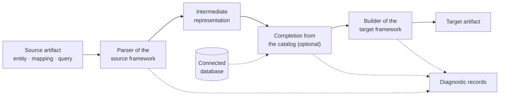

# ORMConvertor

A tool for translating entities, mappings, and queries between ORM frameworks — Dapper, NHibernate and EF Core on .NET, Hibernate, EclipseLink and MyBatis on Java — through a framework-agnostic intermediate representation, with a performance-aware advisor that recommends the best framework (or combination of frameworks) for a query workload using ILP optimization over real benchmark measurements.

It continues a prototype created by Milan Abrahám for his master thesis (see [Origin and attribution](#origin-and-attribution)), completed and extended well beyond it — see [What the tool does](#what-the-tool-does) and [Beyond this version](#beyond-this-version).

## Repository structure

| Directory | Contents |
|---|---|
| `ORMConvertor/` | The tool: a .NET 10 solution — ASP.NET Core REST API serving a hand-written static web frontend (no framework, no build step). Build and run: [`ORMConvertor/README.md`](ORMConvertor/README.md). |
| `docs/` | Documentation ([index](docs/README.md)): [how the tool works today](docs/architecture.md), [what remains](docs/open-items.md), [design decisions](docs/decisions/), [who uses it and for what](docs/use-cases.md), [where each requirement is met](docs/traceability.md), [what the tool is exposed to](docs/threat-model.md), [dated state reviews](docs/audits/), [framework analyses](docs/analysis/), [state at takeover](docs/baseline.md). |
| `benchmarks/` | Comparison of seven .NET ORMs (unit tests and performance benchmarks) inherited from the original research. |
| `diagrams/` | Diagrams made with [draw.io](https://www.drawio.com/). |
| `notes/` | Czech research notes inherited with the fork, kept as written: per-framework notes against a shared questionnaire (`comparison-research/`; `Template CZ.md` is the blank questionnaire) and the differences the intermediate representation has to carry (`abstrakce.md`). |

## What the tool does

Parsers read framework source (C# via Roslyn, NHibernate XML via LINQ to XML) into one intermediate representation, builders write the target's code from it; the Java side is read and written by wrappers in C#, with no JVM in the translation path.

| Framework | Entities and mappings | Queries read from | Queries written as |
|---|---|---|---|
| Dapper | C# class | SQL | SQL |
| EF Core | C# class with data annotations | LINQ, native SQL in code | LINQ |
| NHibernate | C# class + `hbm.xml` | LINQ, bare HQL, native SQL and HQL in code | HQL |
| Hibernate | `jakarta.persistence` annotations (`orm.xml` read too) | JPQL and Hibernate's HQL, native SQL in code | JPQL |
| EclipseLink | the same, EclipseLink profile | JPQL, native SQL in code | JPQL |
| MyBatis | domain class + `<resultMap>` | mapper document (SQL) | mapper document (SQL) |

- **Entities and mappings** translate in any direction between Dapper, NHibernate and EF Core — composite primary keys, multi-column foreign keys and many-to-many relationships as explicit junction entities included — and Hibernate, EclipseLink and MyBatis join the same matrix. Hibernate and EclipseLink are two profiles over one Jakarta Persistence layer, differing in the defaults behind the same annotations (`AUTO` is a sequence for one, a counter table for the other; only Hibernate annotates national character data). MyBatis stands on two layers of *language*, Java and T-SQL, and its mapping belongs to a statement: a `<resultMap>` is read as column–property pairs, its `<id>` as a result row's identity, not a primary key.
- **Queries** translate in all thirty-six directions: each yields a query artifact, none drops a query silently, and NHibernate → NHibernate round-trips over bare HQL. Categories: projection (`DISTINCT`), filtering (`IN` over a list), joins, aggregation, ordering, paging, subqueries in conditions (`IN (SELECT …)`, `EXISTS`, scalar-aggregate comparison), set operations (`UNION`, `UNION ALL`, `INTERSECT`, `EXCEPT`), a query over another's result (a common table expression or derived table, read from SQL, Hibernate's HQL and an EF Core chain composed past a projection or kept in a variable, written as `WITH`, HQL's `with` or a LINQ local variable) and a recursive one with the `OPTION (MAXRECURSION n)` it may carry (read from SQL and Hibernate's HQL, written by Dapper, MyBatis and Hibernate) — each measured across the matrix from every source that can state it, the Java targets over the same inputs by the Java suite (compiled by `javac`, translated by Hibernate, parsed by EclipseLink, bound by MyBatis); sources that cannot state a category, and expected refusals: [`docs/traceability.md`](docs/traceability.md), T2. What a target's language cannot say, EF Core, NHibernate, Hibernate and EclipseLink write as the whole query in their declared dialect's native SQL — the Dapper target's text — via `SqlQuery`/`FromSql`, `CreateSQLQuery` or `createNativeQuery`, with a `Fallback` record naming construct and dialect. Native SQL handed over in code, and HQL in NHibernate's `CreateQuery`, is read; a query handed over by name is reported, as it is read where its mapping defines it. Parameters (`@id`, `:id`, `?1`, a captured C# value, a collection bound to `IN`, a value in an `IN` list) are one operand shape, written as each target's placeholder with a typed method parameter and its binding (positional only in JPQL) and typed from the comparison's other side through the mapping — for Dapper from a connected catalog the query asks itself, one read per conversion, so into every target alike. A paging row count is a parameter typed `Int` by its clause, reaching the text as a placeholder or the query object as an argument. Refused: a comparison that types nothing, a Dapper parameter without a catalog (the record names the missing catalog, not the table), a collection parameter inside an `IN` list. Paging that cannot be carried is never dropped silently, and a query that would return a different set of rows is not emitted: a filter, join, source or grouping a parser cannot read, or what no target renders faithfully, refuses the artifact.
- **Completion from the database catalog**: mapping facts the source does not state (typical for micro-ORMs like Dapper) — columns and types, primary and foreign keys, junction tables — come from a connected database, each one reported.
- **Structured diagnostics** for every conversion: facts the target cannot express, applied conventions, conflicts between sources and incomplete input come back as records beside the artifacts, never lost silently.
- **Advisor**: translates a workload's queries into candidate frameworks, compiles and benchmarks them against a live database (Roslyn dynamic compilation) and solves an ILP model (GLPK) for a framework assignment under user constraints (framework count, memory budget, query weights). Dapper and EF Core only; outside the guarantees.

## Guarantees

The authoritative boundary between what the tool vouches for and what merely ships in the repository, as it stands on `main`; a release freezes it with the version number in `ORMConvertor/Directory.Build.props`, so a tag carries its version's boundary. [`docs/architecture.md`](docs/architecture.md) §9 carries it in Czech with the reasoning and is corrected against this section if they differ. Construct by construct — translated, refused, dropped with a record or written in native SQL, and the decision behind it — it is catalogued in [`docs/subset.md`](docs/subset.md) (Czech); where the two differ, this section holds.

**Query translation is complete within its catalog** (F7–F10, F13): no query parser drops a construct it knows without a record; every construct of the query vocabulary is bounded by a decision — carried in every direction, or refused, dropped with a record or written in native SQL as that decision says, never left to what happened not to come up; and the subset, with every case that has no complete or unambiguous translation, stands whole in [`docs/subset.md`](docs/subset.md).

**Covered:** entity, mapping and query translation as described above, including the following within stated limits, each refused, dropped with a record naming it or written in native SQL, never guessed at:

| Covered | Stated limits |
|---|---|
| expressions wherever an operand stands — arithmetic, concatenation, a closed vocabulary of 17 scalar functions (date arithmetic, rounding, square root and conversion into five scalar types among them), `CASE`, an aggregate over an expression, ordering by an aggregate; a constant projected under an alias | a function outside the vocabulary; an expression among `IN` values or as a row count; a `+` neither side of which the mapping types; an aggregate over an aggregate; a projected expression without an alias |
| a query as a source of rows (a common table expression or derived table) wherever the target's language has one; an aggregate over an aggregate written through it | one reading the query around it: refused in every target |
| a recursive common table expression with the limit of recursion a query sets on it | refused in every target: SQL Server's rules for a recursive member; HQL's `search` and `cycle`; a recursive member adding a `COUNT` to an anchor starting at a constant, although SQL Server would run it (the representation types a count as a 64-bit integer). The depth bound is the query's content, not the tool's |
| grouping by an expression, ranking functions over a window in a projection, an aggregate into a list — each target spelling admitted only after a probe against the pinned framework version | not read: window aggregates, window frames, a window without ordering, a conversion with a length or into a type other than the five, date units outside year to second, a three-argument `ROUND`, a non-literal list separator; LINQ's `string.Join` only over a group's elements. Refused: a window outside a projection. What a target says only differently goes to native SQL (NHibernate and Hibernate convert text into a narrower or non-Unicode type, EclipseLink binds a literal grouping key as a parameter, EF Core joins a list over a nullable column with empty strings) |
| a join whose condition says more than key equalities, written in EF Core's LINQ too (a filter of the joined sequence, or the joined rows meeting the whole condition row by row) and read back | a right or full join with such a condition: EF Core in native SQL; LINQ's group join (`join … into`) is not read |
| what the target's query language cannot say, in the declared dialect's native SQL through the framework's native-query API, always with a `Fallback` record, measured by differential verification like any translation — among them NHibernate's set operations and full outer joins, intermediate results in NHibernate and EclipseLink, recursion in EF Core, NHibernate and EclipseLink and in Hibernate under a limit, EF Core's aggregate over the whole result, a slice inside a subquery in HQL and JPQL, an entity name the target's JPQL parser refuses (EclipseLink; Hibernate for `true`, `false`, `null`), and an HQL keyword as an entity name where the entity has no namespace to qualify it. Native SQL handed over in code reads back as the same query | refused: a collection parameter in EF Core's or EclipseLink's native SQL; a set operation over two different entities where the API materializes one; LINQ composed over native SQL; a query composed at run time (`QueryOver`, `CreateCriteria`) |

**Also covered:** Hibernate, EclipseLink and MyBatis (F7–F9); translation across the ecosystem boundary both ways (F10); a Java test suite compiling the generated code and running it against a real database (F12); differential verification running both halves of a translated query and comparing the rows with one canonical answer recorded in the repository (F13); multi-file input merged into one conversion with per-file input and output, a whole source file being one unit whose entities and querying code the source framework reads out (F14); completion from the database catalog (F4–F6); structured diagnostics of every conversion, stamped with a run identifier and the versions of the tool and both frameworks (F11, S6); deterministic output (S2); artifacts never carrying database credentials (S4); translation performance measured against a stated limit (S3); an architecture in which a new framework is a new self-contained wrapper (S1); a web interface taking a translation from input to result in at most five steps, reporting each reading error against its unit (S7); a documented container configuration that runs the system and reproduces both suites, .NET and Java, on a machine with nothing but Docker (S5).

**Narrower than the words suggest:**

| Req. | Holds in this sense |
|---|---|
| F7–F9 | three frameworks, not the Java ecosystem: for each, the Java suite compiles generated artifacts with `javac`, has the framework accept them and runs them against SQL Server, in three source directions; no other Java ORM. A Java target enters only once its artifacts were compiled and accepted in the pinned environment — no formality: that run refuted one assumption about Hibernate, corrected three about EclipseLink, showed MyBatis itself refusing a project stating one statement twice (the finding its reading side rests on) and caught a test image missing files a checkout had |
| F8 | a **dynamic statement** (a `<select>` with `<if>`, `<choose>` or `<bind>`) is a family of statements returning different rows, none standing for the rest: refused with a record naming the tag. A canonical `<foreach>` is a collection parameter and translates |
| F9 | EclipseLink lazy loading of a reference: `fetch = LAZY` on `@ManyToOne` or `@OneToOne` is silently eager unless the consumer project weaves bytecode; the representation carries no loading strategy, so the artifact states none and a source that did gets a record |
| F14 | a record born from reading a unit points at it, by the name the client sent or by position; completion and generation records name entity and property, deliberately, since several units may declare an entity. Displaying the intermediate representation is not claimed |
| F14 | a unit is one source file declaring its one language. The source framework sorts its classes — one whose own members hand a query over is the code around its queries, the EF Core context the framework's API, a static C# class nothing to materialize — leaving each out of the entities with a record naming it. Every other class is an entity, so code handing no query over itself (a service calling a repository, a projection DTO) is read as one. Finding a project's files is the user's work: no repository walk, no archive |
| F11 | syntactic correctness of generated files is proven by the test suite, not at run time: the translation path never compiles foreign code; every conversion checks the representation's completeness |
| S7 | client-side validation is a helper, not a gate (empty or mistyped input, malformed XML); the server decides. Unreadable text comes back, in every input language, as a record about that unit rather than a failed request, with line and column for SQL, Java, HQL, JPQL and XML. Not for C#: Roslyn knows the position, the parser does not ask, so a broken C# unit gets only the general record that nothing came of it |
| F13 | the comparison's scale is stated, not a setting: decimal places and significant digits per query, a null always the bare word `NULL` — unambiguous, strings being quoted, and fixed because two suites in two languages must agree on one canonical form |
| S5 | containers cover what the repository contains: the system, the database, the .NET and Java test projects and the tool instance the Java suite translates against — not the experimental pipeline, which does not exist |

**Exempt from guarantees:** four areas, each excluded as a whole, not case by case (numbered as in §9). Exempt is not absent: an area may ship and run, the version promises nothing about it, and input touching it is reported in the conversion records rather than silently degraded.

| Area | Exempt | Detail |
|---|---|---|
| 1 | the Advisor and its benchmarking infrastructure | untested; the native ILP library builds only inside Docker |
| 2 | inheritance, components, `<join>` and all else beyond a flat class in NHibernate mappings (`<natural-id>`, `<idbag>`, `<array>` among them); what inheritance should mean for the representation | a hierarchy in an entity class is reported in both ecosystems: a class deriving from another entity of the conversion (table per hierarchy by EF Core's convention, JPA's default strategy, with no word in the source) does not pass in silence, and a Java mapped superclass says in its own record that it is not an entity and its extending entities do not receive its attributes |
| 5 | dialects other than SQL Server 2022 — stated, not assumed, on both sides; with them `CHECK` constraints and column defaults, literal SQL the representation does not carry (unique constraints are not here: carried and written by both annotation targets) | each target descriptor declares its dialect, each run record reports it, and a claim the target's type vocabulary cannot carry is written as the dialect's literal column type. A source may declare its literal SQL's dialect; another system's declaration stops that reading — the query is not emitted, the literal column type not read, both reported. Catalog facts are all such a source still gets (a catalog is a live schema, not text), and the run says once that they came from a system the source disowned |
| 6 | the experimental part of the assignment, not claimed at all: the experimental pipeline does not exist | all the area still holds: cross-ecosystem translation, the Java suite and differential verification left it when both suites ran green in the pinned environment, failing and skipping nothing (counts and commit only in [`ORMConvertor/README.md`](ORMConvertor/README.md#how-large-the-suite-is-and-what-it-covers): a count repeated in five places went stale in five). The Java suite states its own size: it marks the tests reaching the database and refuses to build if too few do |

The remaining work is tracked in [`docs/open-items.md`](docs/open-items.md).

## Versioning and releases

Numbers say **what the tool can do**, not what breaks on upgrade ([decision 098](docs/decisions/098-the-number-is-decided-once-per-release.md)) — a deliberate departure from semantic versioning, on a stated condition: the tool is not published (no registry package, no released artifact besides the git tag, no consumer outside this repository), and a promise not to break a consumer needs a consumer.

| Position | Moves when |
|---|---|
| MAJOR | a milestone of the assignment closes: a whole new ecosystem, or the Advisor across all frameworks with the experimental part. `2.0.0` was the Java ecosystem; the next is `3.0.0` |
| MINOR | a capability arrives within a milestone: a query category, a kind of diagnostic record, an endpoint, an area entering the guarantees |
| PATCH | anything else: a fix, or a public-surface change with no new capability (a differently shaped artifact for the same input, a field leaving the REST contract, an error body changing shape) |

A release carries the highest position its changes moved, so PATCH changes ride inside larger releases. It is an annotated git tag on a commit already carrying the number in `ORMConvertor/Directory.Build.props` and `CITATION.cff`; tags never move, numbers are never reused, a wrong release is corrected by the next number. Pinned dependencies move only for a published advisory or ongoing work; CI checks advisories on every run and weekly. **Release notes — the project's history — live in the tag annotation, not a changelog:** `git tag -n99 <version>` shows what a release changed in the artifacts' shape, the REST contract and the guarantees — a public-surface break shows there, not in the leading digit, so read it before upgrading a consumer. Should the tool ever be published, this policy is replaced, not reinterpreted. The tag `1.0` predates it and carries a two-part number it would not issue.

## Getting started

From `ORMConvertor/`, run `dotnet run --configuration Release --launch-profile http --project ORMConvertorAPI/ORMConvertorAPI.csproj` and open `http://localhost:5072/orm/` (the frontend is served as-is from `ORMConvertorAPI/wwwroot`). With Docker, `docker compose up --build` starts the application with a SQL Server holding the sample database, and `docker compose --profile test build tests` then `docker compose --profile test run --rm tests` runs the whole suite with no .NET SDK or database of your own. **Do not skip the `build`:** `run` alone reuses the existing image and so measures the tree it was built from — it has silently reported a stale suite twice. Details: [`ORMConvertor/README.md`](ORMConvertor/README.md) ([*Tests*](ORMConvertor/README.md#tests)).

## Benchmarks

`benchmarks/` holds the comparison of seven .NET data-access frameworks that preceded the tool — [Dapper](https://github.com/DapperLib/Dapper), [PetaPoco](https://github.com/CollaboratingPlatypus/PetaPoco), [RepoDB](https://github.com/mikependon/RepoDB), [linq2db](https://github.com/linq2db/linq2db), [NHibernate](https://github.com/nhibernate), [Entity Framework Core](https://github.com/dotnet/efcore), [Entity Framework 6](https://github.com/dotnet/ef6) — against the SQL Server [WideWorldImporters](https://learn.microsoft.com/en-us/sql/samples/wide-world-importers-what-is) sample database ([setup](benchmarks/README.md)). Its measured output, a single run from March 2025, is **not versioned** ([decision 042](docs/decisions/042-measured-benchmark-output-out-of-git.md)) — measurements, R script and charts alike; earlier revisions hold it (`git show <commit>:benchmarks/results/…`).

## Beyond this version

What remains is tracked in [`docs/open-items.md`](docs/open-items.md), where the marker of the item being worked on sits with the item. Beyond this version:

- **The experiments** — the translation matrix across ecosystems with its correctness metrics (T2, T3) as a pipeline run from the container configuration, the reference data behind it (T1), displaying the intermediate representation, which F14 names and this version does not claim, and the groundwork for comparing the tool with translation by a large language model (T4–T6); exempt above. Together with the Advisor below, the milestone reserved for the next MAJOR, `3.0.0`; what exactly closes it is an open decision.
- **The Advisor** — across every framework and compared with simple baselines (F15, T7); by the approved specification a secondary goal pursued as time allows; exempt above.
- **The interface** — the translation direction as one control, input beside output, line numbers in the unit editor.
- **Useful, not required** — a second dialect; a reproducible build (dependency lock file, base images and CI actions pinned by digest, style rules enforced by CI); a persistent identifier for a release.
- **Leftovers** — documented gaps and open questions nobody is working on, recorded so that what the tool does not claim about its frameworks is on the record.

## License

Released under the [MIT License](LICENSE) — use, modify and redistribute it freely, commercially included, as long as the licence text and the copyright notice travel with it. The licence covers the contents of this repository; third-party assets vendored under `ORMConvertor/ORMConvertorAPI/wwwroot/vendor/` keep their own terms, stated in the licence file shipped beside each of them.

## How to cite

Machine-readable citation metadata is in [`CITATION.cff`](CITATION.cff), which GitHub renders as the *Cite this repository* button. Please cite the version you used rather than `main`, which moves under the reader. The file also lists the publications describing the original prototype (see below), which is what to cite for the design of the approach itself.

## Origin and attribution

This repository is a fork of [`milan252525/orm-convertor`](https://github.com/milan252525/orm-convertor), which was created by **Milan Abrahám** as part of his [master thesis](https://is.cuni.cz/studium/dipl_st/index.php?id=&tid=&do=main&doo=detail&did=277574) at the Faculty of Mathematics and Physics, Charles University:

> Milan Abrahám: *Framework-Agnostic Query Adaptation: Ensuring SQL Compatibility Across .NET Database Frameworks*. Master thesis, Charles University, Prague, 2025.

The LaTeX sources of the thesis are available in the [`thesis` folder of the original repository](https://github.com/milan252525/orm-convertor/tree/main/thesis) (removed from this fork). The approach is also described in two papers by Milan Abrahám and Pavel Koupil:

> *ORMorpher: An Interactive Framework for ORM Translation and Optimization.* 40th International Conference on Automated Software Engineering (ASE 2025), Seoul, South Korea, 2025.
>
> *A Unified Framework for Object-Relational Mapping Translation and Performance-Aware Selection.* (Extended journal version.)

The tool is referred to as **ORMorpher** in the publications. Note that the papers describe the design and the state of the original prototype; where this repository has since diverged, [`docs/`](docs/) reflects the actual implementation.
