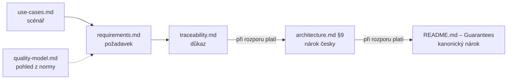

# Dokumentace

Autoritativní popis projektu, **členěný podle žánru, ne podle času** (rozh. [007](decisions/007-documentation-structure.md)); changelog nahrazuje git historie.

| Dokument | Odpovídá na otázku | Cyklus |
|---|---|---|
| [`architecture.md`](architecture.md) | Jak nástroj funguje **dnes**. | živé |
| [`subset.md`](subset.md) | **Co se přeloží a co ne**, konstrukce po konstrukci (žánr `architecture.md`). | živé |
| [`../ORMConvertor/README.md`](../ORMConvertor/README.md) | Jak se nástroj **spouští, nasazuje a testuje** (rozh. [058](decisions/058-only-the-operational-half-of-the-deployment-view-moves.md)); jediný živý dokument mimo `docs/`, proto anglicky. | živé |
| [`open-items.md`](open-items.md) | Co **zbývá**; `Na řadě` říká, kde se pokračuje. | živé; hotové mizí |
| [`decisions/`](decisions/README.md) | **Proč** je nástroj takový; jedno rozhodnutí = jeden soubor. | neměnné kromě `Stav` |
| [`audits/`](audits/README.md) | Co jsme **kdy věděli**. | neměnné |
| [`analysis/`](analysis/README.md) | Jak se chovají **frameworky samotné**. | přibývá |
| [`threat-model.md`](threat-model.md) | Čemu je nástroj **vystavený**. | živé |
| [`use-cases.md`](use-cases.md) | **Kdo** nástroj používá a proč. | živé |
| [`requirements.md`](requirements.md) | Co **zadal vedoucí** (F1–F15, S1–S7, T1–T7). | zmražené |
| [`traceability.md`](traceability.md) | **Kde** je požadavek splněný a čím je to doložené. | živé |
| [`quality-model.md`](quality-model.md) | Jak S1–S7 sedí na **ISO/IEC 25010:2023**. | živé |
| [`baseline.md`](baseline.md) | Stav **při převzetí**. | zmražené |
| [`zamer.tex`](zamer.tex) ([PDF](zamer.pdf)) | Schválený **záměr projektu**: úkoly řešitele, očekávané výsledky, harmonogram. | zmražené |
| [`specifikace.tex`](specifikace.tex) ([PDF](specifikace.pdf)) | Schválená **specifikace**: požadavky, milníky 1–5, harmonogram. | zmražené |

Scénář → požadavek → důkaz drží `use-cases.md`, `requirements.md` a `traceability.md`, vedle nich model kvality jako pohled z normy. Nárok verze má dvě patra a při rozporu platí vyšší: `traceability.md` ustoupí §9 a §9 ustoupí sekci *Guarantees* kořenového [`README.md`](../README.md).

## Pravidla

- **Volba se nejdřív zapíše** do `decisions/` (a rejstříku), pak se programuje. Provedení rozhodnutého, oprava ani test volbou nejsou — zkouška: zeptá se čtenář *proč tohle a ne jiné*?
- **Rozhodnutí se nepřepisují:** změna = nový soubor a `nahrazeno NNN`; `revidováno` jen pro nepředvídaný případ před implementací ([`decisions/README.md`](decisions/README.md)).
- **Změna chování končí v `architecture.md`**; běh a testy v `ORMConvertor/README.md`, posun hranice v `subset.md`, změna nároku či důkazu v `traceability.md`; hotová položka mizí z `open-items.md`.
- **Zmražené se nepřepisuje:** `requirements.md`, `baseline.md`, audity, schválený záměr a specifikace.
- **Živé dokumenty popisují jen současnost, stručně:** žádná historie („od data", „do té doby", jak se co našlo — to nese git a anotace značek), žádné odůvodnění (odkaz na rozhodnutí), každý fakt na jednom místě; tabulky a schémata (`mermaid`) mají přednost před odstavci.
- **Žánr se nemíchá:** odůvodnění jen v `decisions/`, stav v `architecture.md` a `subset.md`, zbývající práce jen v `open-items.md` (nálezy auditu tím seznamem nejsou). Mezera v kódu není automaticky chyba.
- **`docs/` je česky**, zbytek repozitáře anglicky; zafixované verze kanonicky v `architecture.md`, „Zafixované verze".
