# Architektura aplikace – současný stav

**Účel:** popis architektury tak, jak je dnes implementovaná — „jak to teď funguje". Proč jsme co zvolili, je v [`decisions/`](./decisions/README.md), co zbývá udělat, v [`open-items.md`](./open-items.md), co se přeloží a co ne, v [`subset.md`](./subset.md).

---

## Obsah

| Kapitola | O čem je | Kdo se ptá |
|---|---|---|
| [1. Přehled](#1-přehled) | pipeline, zafixované verze | každý |
| [2. Struktura řešení (.NET solution)](#2-struktura-řešení-net-solution) | projekty a závislosti | kdo přidává framework (modulový pohled §2–§4, §7) |
| [3. Použité návrhové vzory](#3-použité-návrhové-vzory) | kde který vzor | dtto |
| [4. Mezireprezentace](#4-mezireprezentace) | entity, klíč, vztahy, dotazy | kdo sahá na model |
| [5. Parsery a buildery – jak fungují dnes](#5-parsery-a-buildery--jak-fungují-dnes) | chování po frameworcích, diagnostika (5.1), katalog (5.2) | kdo hledá ztracený fakt (běhový pohled) |
| [6. Ověření artefaktů, frontend a rozhraní](#6-ověření-artefaktů-frontend-a-rozhraní) | ověření (6.2), frontend (6.3), REST a OpenAPI (6.5) | kdo nasazuje; provoz v [`ORMConvertor/README.md`](../ORMConvertor/README.md) (rozh. [058](./decisions/058-only-the-operational-half-of-the-deployment-view-moves.md)) |
| [7. Rozhraní parserů a builderů](#7-rozhraní-parserů-a-builderů) | abstraktní buildery, šablonový `Build()` | kdo píše wrapper |
| [8. Advisor – implementační detaily](#8-advisor--implementační-detaily) | ILP, `libadvisor.so`, koncové body | kdo sahá na Advisor |
| [9. Co tahle verze nárokuje a co je vyňaté ze záruk](#9-co-tahle-verze-nárokuje-a-co-je-vyňaté-ze-záruk) | nárok a hranice záruk | uživatel, oponent; kanonicky *Guarantees* v [`README.md`](../README.md), důkazy v [`traceability.md`](./traceability.md) |

*Kdo se ptá* = pohledy podle ISO/IEC/IEEE 42010. Mimo tento dokument: [`subset.md`](./subset.md) (přeloží se konstrukce?) a [`threat-model.md`](./threat-model.md) (čemu je instance vystavená).

## 1. Přehled

Aplikace překládá entity, mapování a dotazy mezi šesti ORM přes frameworkově nezávislou mezireprezentaci (§4): .NET Dapper, EF Core, NHibernate; javové Hibernate a EclipseLink jako tenké profily nad sdílenou vrstvou Jakarta Persistence (rozh. [077](./decisions/077-hibernate-wrapper-over-the-shared-jpa-layer.md), [080](./decisions/080-eclipselink-as-the-second-profile-over-the-jpa-layer.md)) a MyBatis nad dvěma vrstvami *jazyka*, Javy a T-SQL (rozh. [084](./decisions/084-mybatis-wrapper-over-the-shared-sql-reading.md)). Javové wrappery jsou v C#, JVM do procesu aplikace nevstupuje (rozh. [076](./decisions/076-java-wrappers-in-csharp-jvm-in-containers.md)). Advisor doporučí pro sadu dotazů framework nebo kombinaci podle naměřeného výkonu (§8).

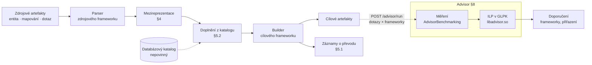
```mermaid
flowchart LR
    S["Zdrojové artefakty<br/>entita · mapování · dotaz"] --> P["Parser<br/>zdrojového frameworku"]
    P --> IR["Mezireprezentace<br/>§4"]
    IR --> C["Doplnění z katalogu<br/>§5.2"]
    KAT[("Databázový katalog<br/>nepovinný")] -.-> C
    C --> B["Builder<br/>cílového frameworku"]
    B --> A["Cílové artefakty"]
    B --> Z["Záznamy o převodu<br/>§5.1"]
    subgraph ADV["Advisor §8"]
        M["Měření<br/>AdvisorBenchmarking"] --> ILP["ILP v GLPK<br/>libadvisor.so"]
    end
    A -.->|"POST /advisor/run<br/>dotazy × frameworky"| M
    ILP --> R["Doporučení<br/>frameworky, přiřazení"]
```

Diagramy draw.io v `diagrams/` jsou obraz prototypu z července 2025, před všemi rozhodnutími; dnešní stav nepopisují.

### Zafixované verze

Kanonické místo verzí, proti kterým platí tvrzení o frameworcích zde i v `docs/analysis/` (rozh. [013](./decisions/013-target-framework-versions.md)). Strojově je píše vždy jediné místo (rozh. [034](./decisions/034-central-version-management.md)): `ORMConvertor/Directory.Packages.props` (všechny přímé balíčky, tabulka jen ty, o nichž něco tvrdíme; `.csproj` verze nenesou, `CentralPackageVersionOverrideEnabled` vypnuté), `Directory.Build.props` (`TargetFramework`) a `global.json` (SDK `10.0.100`, `rollForward: latestFeature`), `JavaTests/pom.xml` (vlastnosti `*.version`), obraz stupně `java-tests` (Maven, JDK).

| Komponenta | Verze |
|---|---|
| .NET | 10 (`net10.0`) |
| NHibernate | 5.7.0 |
| Microsoft.EntityFrameworkCore(.SqlServer) | 10.0.10 |
| Dapper | 2.1.79 |
| Microsoft.Data.SqlClient | 7.0.2 |
| Microsoft.CodeAnalysis.CSharp (Roslyn) | 5.6.0 |
| Microsoft.SqlServer.TransactSql.ScriptDom | 180.78.1 (gramatika `TSql160Parser`) |
| xUnit | v3 (3.2.2) |
| JDK | 25 (LTS) |
| Jakarta Persistence | 3.2 |
| Hibernate ORM | 7.4.5.Final |
| EclipseLink | 5.0.0 |
| MyBatis | 3.5.19 |
| `mssql-jdbc` | 13.4.0.jre11 |
| Maven a JDK javové sady (obraz stupně `java-tests`) | `maven:3.9.11-eclipse-temurin-25-noble` — Maven 3.9.11, Temurin 25 |
| JUnit (javová sada) | 6.1.3 (Jupiter, Surefire 3.6.0) |
| Jackson (javová sada) | 2.22.2 (`jackson-databind`) |
| SQL Server | 2022 |
| Pico CSS (vendorovaná ve `wwwroot/vendor/`) | 2.1.1 (classless) |
| highlight.js (vendorovaná ve `wwwroot/vendor/`) | 11.12.0 (jádro + gramatiky C#, XML, SQL) |

- **Deskriptor** každého wrapperu (`TargetFrameworkDescriptor`) nese `Version` a `Dialect` (rozh. [086](./decisions/086-target-database-dialect-declared-by-the-descriptor.md)) a jen odtud je vydává záznam běhu (S6, §5.1). Jinou verzi zvolit nelze. Javové deskriptory nesou i `JpaImplementationProfile` (§5).
- **Shodu hlídají** `DeclaredVersionsMatchTheVerificationPackages` (deskriptor ↔ balíček ověřovací úrovně, rozh. [016](./decisions/016-generated-artifact-verification-levels.md)), `JavaSuiteDependenciesMatchTheJavaDescriptors` (deskriptor ↔ vlastnost `pom.xml` a závislost na ní; text, bez JVM) a `EveryDescriptorDeclaresTheOnlyDialectThisVersionTargets`.
- **Verze nástroje** je `<Version>` v `Directory.Build.props` — **jediné místo, kde se číslo píše jako současný stav**; nadpisy ani nárok ho nenesou. Protějškem je `version` v [`CITATION.cff`](../CITATION.cff), posouvaný při vydání (rozh. [098](./decisions/098-the-number-is-decided-once-per-release.md)). Čte ji `ToolRelease.Version` do záznamu běhu; `ecosystem.config.js` vyprazdňuje proměnnou prostředí `Version`, jinak by ji v `dotnet run` přepsala ([`README`](../ORMConvertor/README.md#pm2)).

## 2. Struktura řešení (.NET solution)

`ORMConvertor.sln` (.NET 10) má jednadvacet projektů:

- **`ORMConvertorAPI`** — spouštěcí ASP.NET projekt: REST API a statický frontend z `wwwroot` bez buildu (rozh. [032](./decisions/032-frontend-as-static-pages-without-a-build.md), obrazovky [099](./decisions/099-examples-are-content-not-a-choice.md); §6.3); OpenAPI a Swagger UI v §6.5.
- **`Tests`** (xUnit v3) — složka na wrapper (javové jen 1. stupeň), `Combined/` (matice `ORMEnum` × `ORMEnum`: 36 směrů, 18 napříč ekosystémy, vstupy z `CrossFrameworkInputs.cs`; řádky na framework rukou jen `EnforcedMembersTest`, rozh. [037](./decisions/037-enforced-member-binding-held-by-the-test.md)), `Catalog/`, `Verification/` (2.–3. stupeň), `Differential/` (4. stupeň), `Database/`, `Api/`.
- **devatenáct knihoven**, jen jako reference (níž).

Mimo `.sln` je **`JavaTests/`** (Maven, JUnit), v adresáři řešení kvůli triggeru CI; staví ji stupeň `java-tests` obrazu a job `java-test` (rozh. 076), obsah §6.2.

### Knihovní projekty a jejich zodpovědnost

Závislosti bez tranzitivních (`Tests` odkazuje skoro na vše):

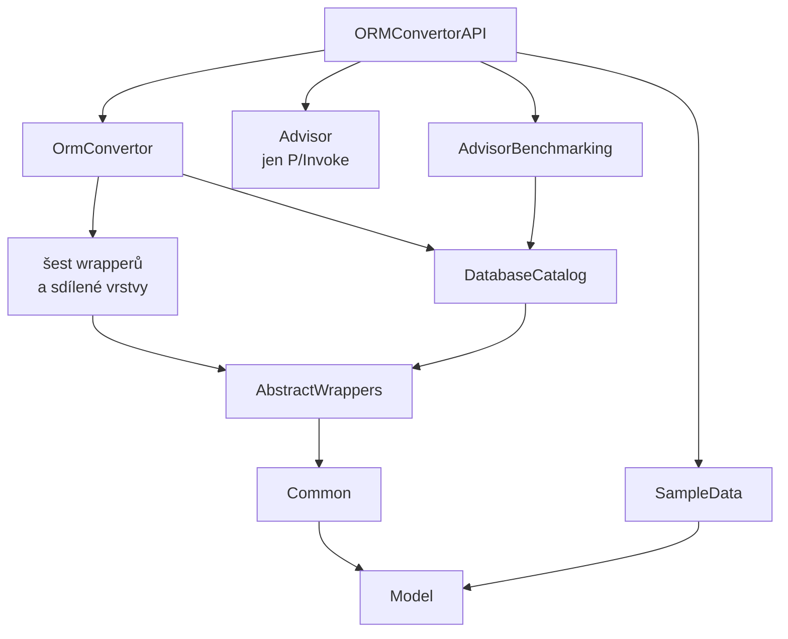
```mermaid
flowchart TD
    API["ORMConvertorAPI"] --> ORM["OrmConvertor"]
    API --> ADV["Advisor<br/>jen P/Invoke"]
    API --> BEN["AdvisorBenchmarking"]
    API --> SD["SampleData"]
    ORM --> WR["šest wrapperů<br/>a sdílené vrstvy"]
    ORM --> CAT["DatabaseCatalog"]
    BEN --> CAT
    CAT --> AW["AbstractWrappers"]
    WR --> AW
    AW --> COM["Common"]
    COM --> MOD["Model"]
    SD --> MOD
```

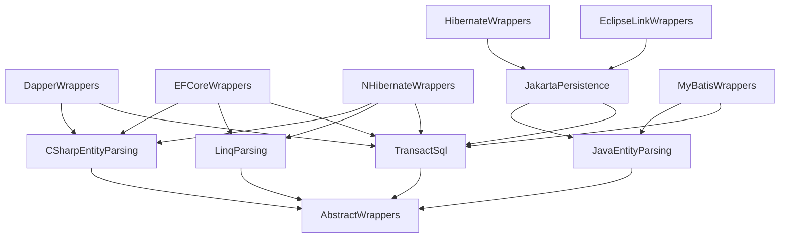
```mermaid
flowchart TD
    DAP["DapperWrappers"] & EF["EFCoreWrappers"] & NH["NHibernateWrappers"] --> CS["CSharpEntityParsing"]
    EF & NH --> LQ["LinqParsing"]
    DAP & EF & NH --> TS["TransactSql"]
    HIB["HibernateWrappers"] & ECL["EclipseLinkWrappers"] --> JPA["JakartaPersistence"]
    JPA --> JE["JavaEntityParsing"]
    JPA --> TS
    MB["MyBatisWrappers"] --> JE
    MB --> TS
    CS & LQ & JE & TS --> AW["AbstractWrappers"]
```

| Projekt | Zodpovědnost | Závisí na |
|---|---|---|
| `Model` | mezireprezentace (§4); typ výjimky nenese — ten žije, kde se háže i chytá (`JavaSyntaxError`, `JavaInputTooDeep`, `JpqlParseError`, `HqlParseError`; rozh. [097](./decisions/097-an-exception-type-lives-where-it-is-thrown.md)), očekávaný stav je záznam (rozh. [010](./decisions/010-diagnostics-as-returned-data.md)) | — |
| `Common` | `AccessModifierConvertor`, `CSharpTypeConvertor`; `Common.Compilation` (jediná kompilace Roslynem: `CSharpSourceCompiler`, `MetadataReferenceProvider`), `Common.Xml` (rozh. [046](./decisions/046-xml-mapping-written-through-an-element-writer.md)), `Common.Naming` (entita ↔ tabulka, rozh. [050](./decisions/050-one-home-for-the-singular-plural-heuristic.md)), `Common.Sql` (hláskování typové rodiny dialektem: `SqlTypeReading`, `SqlTypeSpelling` s `Read`, `Name`, `Literal`; rozh. 086). Tabulka jazykový ↔ databázový typ je ve wrapperech (rozh. [014](./decisions/014-language-type-model.md)) | `Model` |
| `AbstractWrappers` | `IParser`, `IEntityParser`, `IQueryParser`, abstraktní buildery (§7), deskriptor, `Diagnostics/ConversionRecord` (§5.1), `ParseLimits`, `NestingDepthGuard` (rozh. [092](./decisions/092-input-nesting-depth-capped-before-the-descent.md)) | `Common` |
| `DapperWrappers`, `EFCoreWrappers`, `NHibernateWrappers` | .NET parsery a buildery, každý framework zvlášť; `TransactSql` je projekt jazyka, ne cizí wrapper (rozh. [082](./decisions/082-t-sql-read-and-written-by-a-shared-project.md)); Dapper čte Roslynem literál z každého volání `SqlMapper` | `CSharpEntityParsing`, `TransactSql`; EF Core a NHibernate i `LinqParsing` |
| `LinqParsing` | sdílené čtení LINQ, dědí EF Core a NHibernate (rozh. [026](./decisions/026-home-of-shared-query-reading.md)) | `AbstractWrappers` |
| `CSharpEntityParsing` | sdílené čtení entitní třídy v C#, dědí všechny tři .NET wrappery (EF Core a NHibernate přes zásuvné body) | `AbstractWrappers` |
| `JavaEntityParsing` | `JavaLexer`, `JavaClassReader` (podmnožina: třídy a rozhraní, pole, hlavičky metod; těla přeskakuje), `JavaTypeConvertor`, `JavaEntityParser`; bez JVM a ANTLR, neznámý tvar je `Failure` s řádkem a sloupcem | `AbstractWrappers` |
| `JakartaPersistence` | JPA vrstva: `JpaAnnotationReader` a `JpaOrmXmlParser` → `JpaEntityFacts` → `JpaMappingWriter`; `JpaEntityParser`, `AbstractJpaEntityBuilder`, `AbstractJpaQueryBuilder`, `JpqlQueryParser`, `JpaColumnPrecision` (rozh. [079](./decisions/079-fractional-second-precision-as-second-precision.md)), `JpaSqlTypeWriting` (doslovný typ čte `Common.Sql.SqlTypeSpelling.Read`), `JpaImplementationProfile` s `JpaCounterTable`, `JakartaPersistenceDescriptor`; „JPA" jako cíl nevzniká | `JavaEntityParsing`, `TransactSql` |
| `TransactSql` | T-SQL nad ScriptDom, sdílený kompozicí: `SqlText`, `SqlQueryReader`, `SqlParameterFacts`, `SqlQueryVisitor`, `AbstractSqlQueryBuilder` (frameworkově specifická jen `Emit`), `SqlPlaceholders` (§5, §7) | `AbstractWrappers` |
| `HibernateWrappers` | profil Hibernate (háček 1: defaulty implementace, `AUTO` → sekvence) a háčky 2–4 rozh. 076: `@Nationalized` při zápisu, vendor anotace při čtení, HQL `limit`/`offset` | `JakartaPersistence` |
| `EclipseLinkWrappers` | profil EclipseLink, nationalizace doslovným typem, líná reference | `JakartaPersistence` |
| `MyBatisWrappers` | bez vrstvy frameworku: doménová třída, rozhraní a XML mapperu, `MyBatisStatementText`, `jdbcType`, buildery | `JavaEntityParsing`, `TransactSql` |
| `OrmConvertor` | `ConversionHandler`: přes `Factories/` vybere parser a builder, nabídne jednotku oběma průchodům (rozh. [081](./decisions/081-a-unit-may-be-a-mapping-and-a-query-at-once.md)), spustí doplnění z katalogu, vrátí `ConversionResult` (artefakty, záznamy, čas katalogu — S3); wrappery zná jen přes rozhraní | šest wrapperů, `DatabaseCatalog` |
| `SampleData` | vstupy pro `/samples`, `/samples-advisor`, `/examples` a katalog LDBC SNB (`LdbcSnbSample`) pro `/ldbc` (rozh. [110](./decisions/110-ldbc-snb-as-a-second-reference-domain.md)); i testy | `Model` |
| `Advisor` | ILP v GLPK přes P/Invoke (§8) | — |
| `AdvisorBenchmarking` | spuštění a měření vygenerovaného kódu: `Common.Compilation`, kolektibilní `AssemblyLoadContext`, názvy tabulek z `DatabaseCatalog` | `DatabaseCatalog` |
| `DatabaseCatalog` | jediné čtení metadat databáze (rozh. [015](./decisions/015-mapping-fact-completion-from-the-catalog.md)): `SqlServerCatalogReader`, `CatalogCompletion`, `LanguageTypeInference`; wrappery na něm nezávisejí (S1) | `AbstractWrappers` |

## 3. Použité návrhové vzory

| Vzor | Kde | K čemu |
|---|---|---|
| Adapter | každý wrapper | rozhraní ORM ↔ mezireprezentace |
| Visitor | `IQueryVisitor`: `SqlQueryVisitor`, `EFCoreLinqQueryVisitor`, `NHibernateHqlQueryVisitor`, `JpqlQueryVisitor` | dotaz z instrukcí a podmínek |
| Builder | entitní a dotazové buildery | výstup skládaný přes `StringBuilder` |
| Factory | `OrmConvertor/Factories/` | parser, builder a deskriptor podle ORM |
| Šablonová metoda | `AbstractEntityBuilder.Build()`, `AbstractQueryBuilder` (§7, rozh. [023](./decisions/023-query-builder-template-method.md)) | pevné pořadí kroků; krok bez výstupu je prázdný override |

## 4. Mezireprezentace

Dvě části: entity a mapování (`Model.AbstractRepresentation`), dotazové instrukce (`Model.QueryInstructions`). **Mezireprezentace nevaliduje** — unese i kombinaci, kterou databáze odmítne; validace patří builderu nebo bráně úplnosti (§5.1). **Entity se odkazují jménem**, ne referencí (rozh. [001](./decisions/001-entity-reference-by-name.md)). Typy s pravidly vznikají továrnami, takže neplatná kombinace polí není zapsatelná.

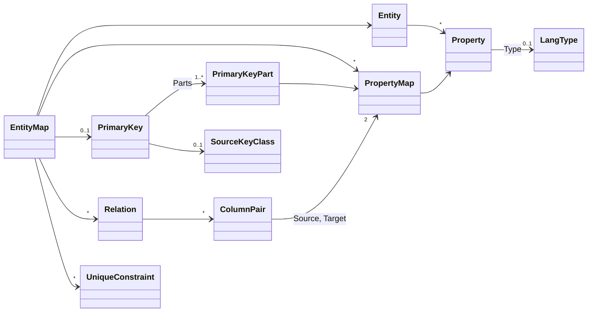
```mermaid
classDiagram
    direction LR
    EntityMap --> Entity
    Entity --> "*" Property
    Property --> "0..1" LangType : Type
    EntityMap --> "*" PropertyMap
    PropertyMap --> Property
    EntityMap --> "0..1" PrimaryKey
    PrimaryKey --> "1..*" PrimaryKeyPart : Parts
    PrimaryKey --> "0..1" SourceKeyClass
    PrimaryKeyPart --> PropertyMap
    EntityMap --> "*" Relation
    EntityMap --> "*" UniqueConstraint
    Relation --> "*" ColumnPair
    ColumnPair --> "2" PropertyMap : Source, Target
```

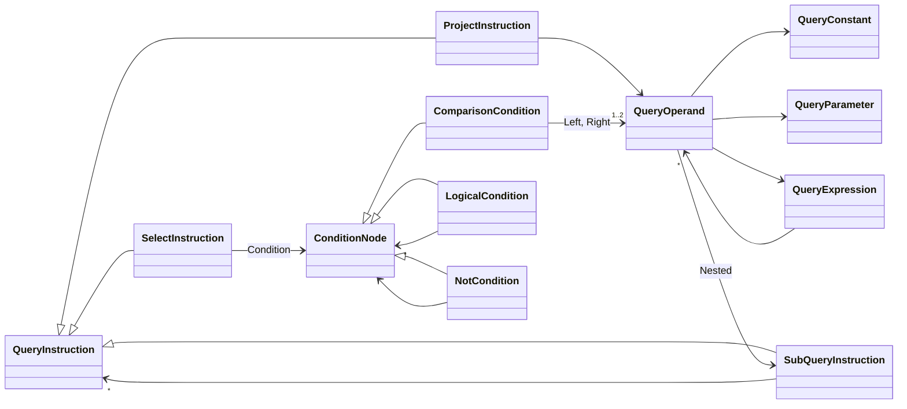
```mermaid
classDiagram
    direction LR
    QueryInstruction <|-- SelectInstruction
    QueryInstruction <|-- ProjectInstruction
    QueryInstruction <|-- SubQueryInstruction
    SelectInstruction --> ConditionNode : Condition
    ProjectInstruction --> QueryOperand
    SubQueryInstruction --> "*" QueryInstruction
    ConditionNode <|-- ComparisonCondition
    ConditionNode <|-- LogicalCondition
    ConditionNode <|-- NotCondition
    LogicalCondition --> "*" ConditionNode
    NotCondition --> ConditionNode
    ComparisonCondition --> "1..2" QueryOperand : Left, Right
    QueryOperand --> QueryConstant
    QueryOperand --> QueryParameter
    QueryOperand --> QueryExpression
    QueryOperand --> SubQueryInstruction : Nested
    QueryExpression --> "*" QueryOperand
```

### 4.1 Entity a mapování

`Entity` a `Property` jsou aplikační strana (název, jmenný prostor, modifikátory, přístupové metody, inicializátor, `LangType`); `EntityMap` přidává `Table`, `Schema` a fakta níž.

| `PropertyMap` | Význam |
|---|---|
| `ColumnName` | prázdný = výchozí sloupec, nikdy „žádný sloupec" |
| `Type` (`DatabaseType?`) | typová rodina; „fakt chybí" je jedině `null` (`None` neexistuje) — stojí na tom brána úplnosti i doplnění |
| `IsUnicode`, `Length`, `Precision`, `Scale` | facety; `IsUnicode` dělí `nvarchar`/`varchar` (NHibernate `Char`/`AnsiChar`), `null` = cíl doplní konvenci (EF Core i NHibernate unicode); `Precision` nese i zlomky vteřin |
| `IsNullable` | databázová strana; jazyková je na `LangType` (pravidlo E4) |
| `SourceSqlType` | doslovný typ zdroje **vedle** rodiny; neznámý typ = rodina `null` + `SourceSqlType` + záznam o neúplnosti, ne výjimka |
| `IsVersion` | token optimistické souběžnosti — mapovací fakt, ne typ (rozh. [030](./decisions/030-scope-of-version-1-0.md)) |
| `IsTransient` | zdroj vyslovil nepersistovanost: `[NotMapped]`, vlastnost chybějící v `hbm.xml`, `@Transient` (rozh. [072](./decisions/072-a-transient-property-is-a-carried-mapping-fact.md)); vlastnost zůstává v `Entity.Properties`, `false` = nikdo netvrdil |

- **Vztah na `PropertyMap` není**, žije na entitě (§4.3). Mapovací fakt bez pole se neukládá a hlásí `Loss` (rozh. [048](./decisions/048-a-fact-with-no-place-in-the-model-is-a-loss.md)).
- Typ, unicode a `SourceSqlType` předává parser typovanou `SetPropertyDatabaseType`; slovník `SetPropertyDatabaseMapping` nese jen sloupec a číselné či pravdivostní fakty.
- **`DatabaseType`** (rozh. [019](./decisions/019-neutral-database-type-vocabulary.md)) — dvacet rodin, termín SQL standardu, kde ho má; typ jediného systému hodnotu nemá: `Boolean`, `TinyInt`, `SmallInt`, `Integer`, `BigInt`, `Decimal`, `Real`, `DoublePrecision`, `Date`, `Time`, `Timestamp`, `TimestampWithTimeZone`, `Char`, `VarChar`, `Text`, `Binary`, `VarBinary`, `Blob`, `Uuid`, `Xml`. `datetime`, `datetime2`, `smalldatetime` jsou `Timestamp` ve třech přesnostech, `money` je `Decimal(19,4)`.
- **`UniqueConstraint`** (rozh. [055](./decisions/055-unique-constraint-as-a-carried-mapping-fact.md)) — na entitě: `Name?`, `PropertyNames` (jména vlastností v pořadí zdroje); prázdné a s duplicitou odmítnuto; totožnost dává množina vlastností (`CoversSameAs`). Primární klíč mezi ně nepatří; `check`, `default` a neunikátní index jsou `Loss`.

**`LangType`** (rozh. [014](./decisions/014-language-type-model.md)) vzniká jen továrnami `Scalar/Reference/Collection/Unknown`; nese `IsNullable`, takže ji má i prvek kolekce. `Property.Type == null` = jazykový typ nikdo neuvedl.

| Kategorie | Nese |
|---|---|
| `Scalar` | `ScalarType`: `Bool`, `Byte`, `Short`, `Int`, `Long`, `Float`, `Double`, `Decimal`, `Char`, `String`, `DateTime`, `Guid`, `Object` (zdroj napsal `object`), `Date`, `TimeOfDay`, `DateTimeOffset`, `Duration`, `ByteArray` — posledních pět je C# `DateOnly`, `TimeOnly`, `DateTimeOffset`, `TimeSpan`, `byte[]` a Java `LocalDate`, `LocalTime`, `OffsetDateTime`, `Duration`, `byte[]` (rozh. [071](./decisions/071-five-scalars-with-a-counterpart-in-both-ecosystems.md)) |
| `Reference` | jméno cílové entity; vzniká, když to zdroj tvrdí (`AddForeignKey` povýší navigaci, zachová nullabilitu a druh kolekce), nebo při rozresolvování jmen (§4.3) |
| `Collection` | `LangType` prvku, `CollectionKind` (`Unspecified`, `List`, `Set`); mapy mimo rozsah |
| `Unknown` | název ze zdroje; builder ho tak vypíše, nikdy výjimka; po rozresolvování jmen `Incompleteness` (rozh. [075](./decisions/075-unknown-language-type-is-a-reported-incompleteness.md)) |

### 4.2 Primární klíč

| Pole | Význam |
|---|---|
| `PrimaryKey.Parts` | `PrimaryKeyPart` seřazené podle `Order` (řadí setter); jednoduchý klíč = jedna část. Prázdný klíč a duplicitní pořadí odmítne výjimkou (S2); souvislost číslování se nevyžaduje |
| `.Order` | explicitní, od 1 (EF Core pořadí v `[PrimaryKey(...)]`, NHibernate pořadí `<key-property>`) |
| `.Strategy` | `PrimaryKeyStrategy`, per part |
| `.SourceStrategyName` | co zdroj napsal a slovník nezachytil (vlastní generátor, `foreign`, `guid.comb` vedle `Uuid`); kanonický název se nekopíruje |
| `.StrategyParameters` | `GeneratorParameter` → hodnota |
| `.SourceStrategyParameters` | doslovně: u únikové cesty (`Unspecified` se jménem generátoru) všechny, jinak slova lokální generátoru (`where` u `hilo`) |
| `PrimaryKey.SourceKeyClass` | záznam o klíčové třídě zdroje: `ClassName`, `Form` (`KeyClassForm`), `PropertyName` (jen `Embedded`); dvojici hlídá konstruktor |
| `EntityMap.HasNoKey` | vyslovené popření klíče (EF Core `[Keyless]`, `MarkNoKey`; rozh. [063](./decisions/063-stated-keylessness-as-a-carried-fact.md)) — jiné než prázdný `PrimaryKey`: konvenční klíč EF Core se neodvodí, katalog ho nedodá |

- **`PrimaryKeyStrategy`** jmenuje mechanismus, ne generátor (rozh. [011](./decisions/011-key-generation-strategy-vocabulary.md)): `Unspecified` (nikdo neřekl), `Assigned` (dodá aplikace), `Auto` (vybere framework podle dialektu; `native` i `AUTO`), `Identity`, `Sequence`, `HiLo`, `Uuid`, `Increment` (jen NHibernate).
- **`GeneratorParameter`** (rozh. [020](./decisions/020-canonical-generator-parameter-vocabulary.md)): `SequenceName`, `Schema`, `BlockSize`, `InitialValue`, `CounterTable`, `CounterValueColumn`, `CounterKeyColumn`, `CounterKeyValue`. Fixuje význam a jednotku, ne pravopis: `BlockSize` je počet hodnot v bloku (NHibernate `max_lo` + 1, JPA `allocationSize` beze změny). Neuvedený se nematerializuje. Pořadí deklarace = pořadí emise (S2). Kanonizuje parser, zpět překládá builder.
- **Model je permisivní:** unese dvě části `Identity` (hlídá builder nebo databáze) i `HasNoKey` s vyplněným klíčem; ten rozpor odmítá brána úplnosti (§5.1), stejně jako část klíče s `IsTransient` (`Failure` kategorie `TransientProperty`).
- **Vynucené členy** kompozitního klíče (NHibernate `Equals`, `GetHashCode`, `[Serializable]`; JPA ID třída) v modelu nejsou, generuje je builder (rozh. [006](./decisions/006-flat-composite-key-rendering.md)).

**Klíčová třída se zaznamenává, ne převádí** — cíle vykreslují klíč ploše.

| `KeyClassForm` | Cesta k části | Zdroj |
|---|---|---|
| `Embedded` | přes vlastnost entity (`o.Id.OrderID`) | `<composite-id name= class=>`; `@EmbeddedId` — odložená `AddEmbeddedPrimaryKey`, před rozpuštěním zhmotněná nad všemi vlastnostmi třídy, `Assigned` |
| `Mirrored` | vlastnosti na entitě, třída je zrcadlí (`o.OrderID`) | `<composite-id class=>` bez `name`; `@IdClass` |

**Rozpuštění klíčové třídy** (`DissolveKeyClasses`, rozh. [031](./decisions/031-key-class-as-declaration-of-key-parts.md)) — co třída deklaruje, jsou části klíče:

| Situace | Výsledek |
|---|---|
| člen je částí klíče | přenese jazykový typ (i nullabilitu), modifikátor, přístupové metody, inicializátor; jen do prázdného, sloupce zůstávají z mapování (rozh. [017](./decisions/017-source-precedence-for-mapping-facts.md)) |
| forma `Embedded` | držící vlastnost z entity zmizí — `Loss` |
| třída bez vlastní tabulky, schématu, klíče a vztahu | vyjme se z `EntityMaps` (pravidlo E1); s nimi zůstane entitou — `Conflict` |
| člen, který mapování nejmenuje jako část klíče | nepersistuje se — `Loss` |
| třídu nikdo nedeklaruje | `Incompleteness`, jen u `Embedded` nebo chybí-li části jazykový typ |

Fáze je idempotentní a nezávislá na pořadí jednotek (S2), signál po ní zůstává. .NET buildery ho nečtou; JPA builder jím pojmenuje klíčovou třídu, bez něj `<Entita>Id` se záznamem `Convention`.

### 4.3 Vztahy

**`Relation` žije na `EntityMap`, nikdy na `PropertyMap`** — strana „mnoho" nemá sloupec. Vztah je vlastnost odkazující na entitu nebo kolekce entit (pravidlo E6).

| Pole | Význam |
|---|---|
| `Cardinality` | `OneToOne`, `OneToMany`, `ManyToMany`, `ManyToOne`; jediný nositel násobnosti |
| `Role` | `Owning` = drží fyzický FK, `Inverse` = navigace bez sloupce (pravidlo E7). **FK i tvar značky určuje role, ne kardinalita:** NHibernate vlastnící 1:1 je `<many-to-one unique="true">`, `<one-to-one>` strana bez sloupce nebo sdílený klíč s generátorem `foreign` (rozh. [012](./decisions/012-foreign-key-rendering.md)) |
| `SourceEntity`, `TargetEntity` | jména entit |
| `ColumnPairs` | uspořádané `ColumnPair(Source, Target)` (třída, ne tuple — kvůli System.Text.Json). `Source` je sloupec na straně s FK (`Owning`: zdroj, `Inverse`: cíl), `Target` odkazovaná část klíče (`<many-to-one>` i `<key>` vypisují `Source`, EF Core bere z `Target` typ a jméno dogenerované vlastnosti). Pořadí je autoritativní, buildery nepřeskládávají; rozpor s pořadím klíče je `Incompleteness`. **Prázdný = nerozresolvováno** |
| `SourceNavigationProperty` | navigace zdrojové entity |
| `InverseRelationName` | navigace protější strany (`[InverseProperty]`, `mappedBy`); plní EF Core parser, JPA builder jí určí `mappedBy` dřív než odvozením z párů; nedeklarované jméno se nevypíše |
| `Name` | nikdo neplní ani nečte; místo pro víc vztahů mezi touž dvojicí |

**N:M nemá vlastní typ** (rozh. [005](./decisions/005-many-to-many-as-explicit-junction-entity.md)): spojovací entita s `IsJunctionTable = true` a dvěma `Owning` relacemi `ManyToOne`. „Bohatá" spojovací tabulka je běžná entita; `IsJunctionTable` buildery nepotřebují.

```
StudentCourse (IsJunctionTable = true)
 ├─ Relation(Owning, ManyToOne) → Student   (ColumnPairs: [StudentId ↔ Id])
 └─ Relation(Owning, ManyToOne) → Course    (ColumnPairs: [CourseId ↔ Id])
```

**Fáze mezi parsováním a generováním** (`AbstractEntityBuilder`) v pevném pořadí; první dvě spouští i doplnění z katalogu jako úvodní kroky (§5.2), jinak `Build()`:

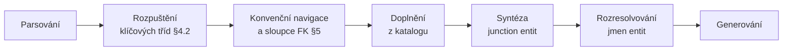
```mermaid
flowchart LR
    P["Parsování"] --> K["Rozpuštění<br/>klíčových tříd §4.2"]
    K --> N["Konvenční navigace<br/>a sloupce FK §5"]
    N --> C["Doplnění<br/>z katalogu"]
    C --> J["Syntéza<br/>junction entit"]
    J --> R["Rozresolvování<br/>jmen entit"]
    R --> G["Generování"]
```

**Syntéza** (`SynthesizeJunctionEntities`) — N:M ze zdroje (`<many-to-many>`) i z katalogu:

- Z `JunctionFacts` (NHibernate `table`, `schema`, sloupce `<key>` a `<many-to-many>`) postaví entitu: vlastnosti po sloupcích s typy odkazovaných částí klíčů, složený klíč `Assigned`, dvě `Owning` N:1, název z tabulky (heuristika koncového „s") se záznamem `Convention`. Obě strany si fakta doplní; jejich kolekce se přesměrují na entitu jako inverzní 1:N.
- Bez tabulky či sloupců zůstane N:M a NHibernate builder vypíše `<many-to-many>` s fakty zdroje. Nesoulad sloupců s klíčem a kolize jmen jsou `Incompleteness`. Sebereference se nesyntetizuje.

**Rozresolvování jmen** (`ResolveEntityNames`):

| Případ | Výsledek |
|---|---|
| cíl vztahu je v převodu | sloupce z `AddForeignKey` se spárují s klíčem cíle; mimo převod je věc katalogu (rozh. [015](./decisions/015-mapping-fact-completion-from-the-catalog.md)) |
| sloupec bez vlastnosti | odpojená `PropertyMap` jen v páru |
| nesouhlasí počet sloupců, cíl chybí, N:M bez spojovací entity | `Incompleteness` (rozh. [010](./decisions/010-diagnostics-as-returned-data.md)); N:M se nepáruje nikdy |
| netypovaná vlastnost FK (`<key-many-to-one>`) | typ a sloupcová fakta z odkazované části klíče — `Convention` |
| `Unknown` se jménem entity převodu | → `Reference` (u kolekce prvek) |
| co zůstane `Unknown` | jeden `Incompleteness` na vlastnost, bez kategorie a jednotky; překlep od třídy mimo převod nerozezná |

### 4.4 Dotazové instrukce a podmínkový strom

Dotaz je seznam instrukcí a vedle něj seznam definic (`WithInstruction`). Co se nevykresluje přes visitor, čtou kroky builderu (§7).

| Instrukce | Nese | Visitor | Rozh. |
|---|---|---|---|
| `FromInstruction` | `Table` (i jméno definice), `Alias?` | ano | |
| `ProjectInstruction` | operand, `Alias?`; celá entita = `*` | ano | [107](./decisions/107-an-expression-is-the-sixth-operand-shape-and-stands-wherever-an-operand-stands.md) |
| `SelectInstruction` | jeden `ConditionNode` | ano | |
| `JoinInstruction` | `JoinKind` (`Inner`, `Left`, `Right`, `Full`), `LeftTable`, `RightTable`, `RightTableAlias?`, `OnCondition` (Q6) | ano | |
| `GroupByInstruction` | `Key`: sloupec nebo výraz, ne agregát ani okenní funkce | ano | [113](./decisions/113-native-sql-as-the-escape-path-and-the-vocabulary-ldbc-needs.md) |
| `HavingInstruction` | jeden `ConditionNode` (Q9) | ano | |
| `OrderByInstruction` | operand (i agregát bez aliasu), `Asc`; alias = sloupec bez tabulky | ano | 107 |
| `SetOperationInstruction` | `Union`, `UnionAll`, `Intersect`, `Except`, `ExceptAll`; `Left`, `Right` | ano | |
| `PaginationInstruction` | `Offset?`, `Limit?` jako `RowCount` (`Literal` ≥ 0, `Bound` parametr); nejvýš jedna na (pod)dotaz | ne | [060](./decisions/060-pagination-as-a-query-instruction.md), [085](./decisions/085-a-row-count-is-a-number-or-a-parameter.md) |
| `DistinctInstruction` | značka scope (Q3), idempotentní; `Normalize()` → `QueryClauses.Distinct` | ne | [073](./decisions/073-distinct-as-a-flag-of-the-query-scope.md) |
| `SubQueryInstruction` | vnořený rozsah; visitor volá zpět builder | ne | [061](./decisions/061-subquery-as-a-condition-operand.md) |
| `WithInstruction` | `Name`, `Body` (`AbstractQueryBuilder.Define`) | ne | [112](./decisions/112-a-query-as-a-row-source-is-a-named-intermediate-result.md) |

- Stránkování a `DISTINCT` rozšiřují normalizovanou sadu článku (jeho §5.4 to připouští). Q7 (implicitní join z metadat vztahu) se vyrábí do téhož stromu (rozh. [101](./decisions/101-a-join-along-an-association-path-is-derived-from-the-relation.md)).
- **Seskupený dotaz** čte v projekci, `HAVING` a řazení jen klíče a agregáty; brána (§7) porovnává strukturně (`OperandStructure.Same`).
- **`ExceptAll`** bez protějšku v cíli je `Failure`, artefakt nevzniká (rozh. [053](./decisions/053-a-query-that-would-return-other-rows-is-not-emitted.md)); `TSql160Parser` ho přijme, SQL Server odmítne až za běhu. `INTERSECT ALL` slovník nemá — `Failure` při čtení.
- **Definice:** `WITH` i odvozená tabulka (pojmenovaná aliasem a **vyzdvižená na úroveň dotazu**); tělo je `SELECT` nebo množinová operace, jejíž sloupce jmenuje levý operand; syntaxi zdroje model nepamatuje; definice čte jen definice před sebou, jméno je jedno na dotaz; sloupce jsou její projekce a šablona ji popíše jako entitu platnou v dotazu. **Rekurzivní** definice nemá vlastní instrukci; limit `MAXRECURSION` je fakt dotazu (`AbstractQueryBuilder.LimitRecursion`: 0 = bez limitu, chybí = výchozí dialektu).

**Operand** (`QueryOperand`, rozh. [024](./decisions/024-typed-query-operand.md)) stojí v porovnání, projekci, řazení i seskupení:

| # | Tvar | Továrna | Pravidla |
|---|---|---|---|
| 1 | sloupec | `Column` | agregační funkce a její `Distinct` (`COUNT(DISTINCT x)`; bez funkce odmítne továrna, nad `*` brána — rozh. [102](./decisions/102-aggregate-distinct-like-escape-and-a-parameter-among-listed-values-are-carried.md)) |
| 2 | konstanta | `Value` | `QueryConstant`: text **bez zdobení** + `ScalarType?` (`Foo`, `2000`, ne `"Foo"`, `2000m`); neznámý typ: bez skaláru, vypíše se doslova, záznam |
| 3 | poddotaz | `Nested` | rozh. 061 |
| 4 | výčet hodnot | `ValueList` | neprázdný; konstanty nebo skalární parametry; jen vpravo od `IN` (rozh. [074](./decisions/074-a-list-of-values-as-the-fourth-operand-shape.md)) |
| 5 | parametr | `Bound` | `QueryParameter` (rozh. [083](./decisions/083-parameter-as-the-fifth-operand-shape.md)) |
| 6 | výraz | `Computed` | `QueryExpression`, s funkcí a `Distinct` jako sloupec (`SUM(Price * Quantity)`) |

- **Výčet hodnot:** společný skalár, nebo jedna číselná rodina (celá čísla s `Decimal`, nebo s `Float`/`Double`; `Decimal` s plovoucí čárkou ne) — brána v `Normalize()`. `null` (rozh. [002](./decisions/002-is-null-as-comparison-operator.md)), sloupec či funkce ve výčtu: `Failure` `Filtering`; kolekční parametr ve výčtu: `Failure` `QueryParameter`. Parametr ve výčtu bere skalár z levé strany `IN`.
- **`QueryParameter`** (`Named`/`Positional`): jméno bez zdobení (`id`, ne `@id`, `:id`, `#{id}`), **nebo** pořadí od 1 (holý `?` v HQL bere pořadí výskytu), nikdy obojí ani nic (rozh. [028](./decisions/028-assembly-name-is-not-ours-to-invent.md)); `Type?` (`null` doplní brána); `IsCollection` (`in (:ids)`, `ids.Contains(c.Id)`; skalár typuje prvky). Hodnotu nenese. Kolekční stojí jen vpravo od `IN`.
- **`QueryExpression`** — listy jsou operandy (poddotaz smí být listem, výčet a kolekční parametr ne); skalár výrazu model nenese, odvodí ho brána do `ExpressionTyping` (§7):
  - `Binary`: `Concat`, `Add`, `Subtract`, `Multiply`, `Divide`, `Modulo` (`ExpressionOperator`); `Add` nad řetězcem rozhodne brána jako konkatenaci.
  - `Call` (`QueryFunction`): `Upper`, `Lower`, `Trim`, `Substring`, `Length`, `Coalesce`, `Abs`, `Year`, `Month`, `Day`, `CurrentTimestamp`, `EscapePattern` (doslovné zástupné znaky), `DateAdd`, `DateDiff` (s `DateUnit` `Year`…`Second`; `DateDiff` počítá hranice jako T-SQL `DATEDIFF`), `Round`, `Sqrt`, `Cast` (`CastTo` z `QueryExpression.Castable`: `Int`, `Long`, `Float`, `Double`, `String`). Aritu, jednotku a cíl hlídá továrna; funkce vstoupí, až má hláskování v T-SQL.
  - `Case` jen *searched* (`CaseBranch`; *simple* se čte jako searched s rovností); `Window` s `RowNumber`, `Rank`, `DenseRank` (rozdělení smí chybět, řazení ne; bez rámce; jen v projekci mimo agregát); `ListAggregate` = `STRING_AGG … WITHIN GROUP`, agregát.

**Podmínky jsou strom**, ne plochý seznam spojený AND; `SelectInstruction`, `HavingInstruction` i `OnCondition` nesou jeden kořen:

| Uzel | Nese |
|---|---|
| `ComparisonCondition` | `Left`, `ComparisonOperator`, `Right?`, `Escape?` |
| `LogicalCondition` | `And` / `Or` nad seznamem uzlů |
| `NotCondition` | jeden uzel |

- `ComparisonOperator`: `Equal`, `NotEqual`, `GreaterThan`, `GreaterThanOrEqual`, `LessThan`, `LessThanOrEqual`, `Like`, `In`, `IsNull`, `IsNotNull`, `Exists`. `IsNull`/`IsNotNull` a `Exists` (poddotaz vlevo) mají nevyužitou pravou stranu (rozh. 002); `NOT EXISTS` a `NOT IN` jsou `NotCondition`.
- `Escape` jen u `Like`, jeden znak bez zdobení, na porovnání, ne na vzorku; jinak odmítne brána (rozh. 102). EF Core `StartsWith(p)` je `Like(col, Concat(EscapePattern(p), '%'))`.
- Vícesloupcový equi-join je `And` rovností. **`IQueryVisitor` musí závorkovat** vnořený `LogicalCondition` s jiným operátorem (AND s OR uvnitř), jinak vznikne jiný dotaz.

## 5. Parsery a buildery – jak fungují dnes

Kapitola popisuje mechanismus: které třídy co čtou a zapisují a podle jakých pravidel. **Co se překládá a co ne, konstrukce po konstrukci, vede katalog [`subset.md`](./subset.md)** — co který framework přečte a vydá (část 1) a co nástroj odmítne, vypustí nebo napíše nativním SQL (část 2). Záznamy převodu popisuje §5.1.

#### Společná pravidla čtení

- **Strop hloubky zanoření** (rozh. [092](./decisions/092-input-nesting-depth-capped-before-the-descent.md)) se počítá nad tokeny (`(`, `{`) *před* rekurzivním sestupem, protože přetečení zásobníku shodí celý proces: HQL, JPQL a `JavaClassReader` (i generika, `ReadTypeArguments`) nad vlastními tokeny, `SqlQueryReader` nad `TSql160Parser.GetTokenStream`, C# nad `SyntaxFactory.ParseTokens`; XML se netýká. Překročení je `Failure` s řádkem a sloupcem, jednotka nevydá nic, ostatní pokračují (rozh. [045](./decisions/045-a-conversion-that-produced-nothing-says-so.md)).
- Mez `ParseLimits.DefaultMaxNestingDepth` = 128 dá `ParserFactory.Create` každému parseru (`IParser.Limits`); `ConversionHandler.Convert` ji bere nepovinně, API při startu (`ParseLimitsConfiguration`, klíč `Parsing:MaxNestingDepth`, `0` vypíná). `ConvertRequest` ji změnit nemůže.

**Čtení C# tříd** dědí .NET entitní parsery ze `CSharpEntityParser` (projekt `CSharpEntityParsing`, Roslyn; rozh. [026](./decisions/026-home-of-shared-query-reading.md)).

- Z hlavičky jen přístupový modifikátor (bez tokenu `internal`); `sealed`, `partial`, `abstract` model nenese.
- **Bázový seznam jde do builderu, ač ho model nenese** (rozh. [048](./decisions/048-a-fact-with-no-place-in-the-model-is-a-loss.md)): `AddStatedBaseType` ho podrží, `ReportStatedBaseTypes` (§7) vydá `Loss` u typu, který jmenuje entitu převodu, jiné jméno zahodí mlčky. Dědičnost je vyňatá oblast 2 (§9); Java posílá týmž kanálem `extends`.
- **Každá deklarace třídy je entita**, vnořená vedle obalující (F14), kromě tří, které dostanou záznam (rozh. [111](./decisions/111-a-unit-is-a-whole-source-file-that-declares-only-its-language.md)): kód kolem předání dotazu (rozh. [109](./decisions/109-a-code-unit-carries-every-query-it-hands-over.md)), API frameworku (kontext EF Core: `DbContext` v bázovém seznamu nebo `DbSet<T>`, `EFCoreContext`) a statické třídy. Poznají je háčky `FindHandovers` a `FrameworkApi` rozpoznávačem dotazového parseru, u Javy přes `JavaClass.Start`/`End` a `JavaMemberSpan`. **Mez:** aplikační kód bez předání (služba, DTO) se čte jako entita.
- **Totožnost entity je jmenný prostor + název** (rozh. [094](./decisions/094-entity-identity-inside-a-conversion.md)): `DeclareEntity` najde nebo založí, takže druhá jednotka s toutéž třídou (`partial`) entitu obohatí; nevyslovený jmenný prostor nerozlišuje, obalující třída ano (`Customer.Key` ≠ `Order.Key`).
- EF Core přidává atributové mapování přes háčky, NHibernate jen `DeferredModifiers` = `virtual` (rozh. [076](./decisions/076-java-wrappers-in-csharp-jvm-in-containers.md)): vynucený člen do modelu nevstupuje (`virtual` z EF Core cestuje dál) a NHibernate builder ho vrací jako první modifikátor; vazbu drží `NHibernateDeferredModifierTest` (rozh. [037](./decisions/037-enforced-member-binding-held-by-the-test.md)).
- NHibernate má tři parsery: entitní, `NHibernateXMLMappingParser` a dotazový nad týmž XML (rozh. [081](./decisions/081-a-unit-may-be-a-mapping-and-a-query-at-once.md)). Booleovské atributy čte v celém `xs:boolean` (`true`/`false`/`1`/`0`), nullabilitu trojstavově — chybějící atribut netvrdí nic.

**Priorita zdrojů** (rozh. [017](./decisions/017-source-precedence-for-mapping-facts.md)) dává pořadí čtení. Nese ho seznam v `ParserFactory`; orchestrace projede každý parser přes všechny jednotky, než začne další, takže „tvrzeno výš" = „fakt je už neprázdný".

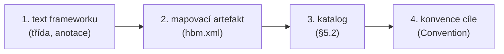
```mermaid
flowchart LR
  T["1. text frameworku<br/>(třída, anotace)"] --> M["2. mapovací artefakt<br/>(hbm.xml)"] --> K["3. katalog<br/>(§5.2)"] --> C["4. konvence cíle<br/>(Convention)"]
```

Framework, který precedenci svých artefaktů dokumentuje, se čte od nejsilnějšího a konvence materializuje na konci (rozh. [068](./decisions/068-source-framework-precedence-orders-the-reading.md)): JPA `orm.xml` před třídou, MyBatis souběh odmítá.

| Zápisová cesta builderu | Pravidlo |
|---|---|
| `AddTable`, `AddSchema`, `AddNamespace`, `SetPropertyDatabaseMapping`, `SetPropertyDatabaseType`, `MarkTransient` | vyplní jen prázdný fakt; shodné opakování nic, odlišné `Conflict` a platí první (S2) |
| `AddProperty` (= `GetOrCreatePropertyMap`) | najdi-nebo-založ, doplní jazykový typ, modifikátor, inicializátor (typy hodnotou); `HasGetter`/`HasSetter` jen přidávají, `OtherModifiers` se sjednocují (rozh. [049](./decisions/049-language-facts-under-source-precedence.md)) |
| `AddRelation` | najdi-nebo-přidej, navigace nese jeden vztah; jiný cíl či kardinalita `Conflict` |
| `AddPrimaryKey`, `SetKeyStrategyDetails` | identita = uspořádaný seznam částí; nad týmiž částmi doplní jen `Unspecified` strategii, klíčovou třídu a parametry; jiný seznam `Conflict` `PrimaryKey` (platí první klíč vcelku, vlastnosti zahozeného se nezakládají), jiná strategie části `Conflict` `PrimaryKeyStrategy` (rozh. [036](./decisions/036-primary-key-under-source-precedence.md)) |
| `MarkTransient` × persistovaná vlastnost | `Conflict` `TransientProperty` oběma směry; `[Key]` + `[NotMapped]` v jednom artefaktu vstoupí obojí a odmítne je brána (rozh. [072](./decisions/072-a-transient-property-is-a-carried-mapping-fact.md)) |

Bez konfliktu: facety z názvu typu (délka `Char` 1, přesnost `money`), `sql-type` vedle `type` mimo slovník (vyhrává `sql-type`), jméno typu a reference z `AddForeignKey` (rozh. [014](./decisions/014-language-type-model.md)). Důkaz: `SourcePrecedenceTest`.

**Konvence zdroje se materializuje podle rozh. [067](./decisions/067-a-derived-convention-is-a-statement-a-default-is-not.md)**: dokumentované odvození z tvrzení artefaktu, jen kde by prázdný fakt putoval jinam, bez záznamu; absenční výchozí hodnota (název sloupce a tabulky, NHibernate `not-null` a `<generator>`) nikdy. Instance: čtyři konvence EF Core (klíč, strategie z typu, nullabilita, navigace), u JPA primitiv → NOT NULL a výchozí sloupec cizího klíče. E4 aplikuje NHibernate builder jen jako zálohu 3. stupně (katalog ji přebije).

#### Entity a mapování: čtení

| Fakt | EF Core parser | NHibernate XML parser |
|---|---|---|
| klíč | `[Key]`, `[PrimaryKey]`, jinak `Id`, pak `<Entita>Id` bez ohledu na velikost písmen (rozh. [015](./decisions/015-mapping-fact-completion-from-the-catalog.md)). `[Keyless]` = `MarkNoKey` (rozh. [063](./decisions/063-stated-keylessness-as-a-carried-fact.md)); `[Key]` u něj → `Conflict`, `[PrimaryKey]` u něj → `Failure` brány | `<id>`; `<composite-id>` z `<key-property>` a `<key-many-to-one>` v pořadí dokumentu, `class`/`name` → `SourceKeyClass` (rozh. [006](./decisions/006-flat-composite-key-rendering.md)); `<key-many-to-one>` = části `Assigned` + vlastnící N:1 |
| strategie | `[DatabaseGenerated]` (`Identity`/`Computed` → `Auto`, `None` → `Assigned`); jinak celočíselný jednodílný `Auto`, `Guid` `Uuid`, jinak `Assigned` | `<generator>`, `<param>` kanonicky (rozh. [020](./decisions/020-canonical-generator-parameter-vocabulary.md)): `sequence` → `SequenceName` (+ `Schema`), `max_lo` → `BlockSize` + 1, `hilo` `table`/`column` → `CounterTable`/`CounterValueColumn`; ostatní doslovně do `SourceStrategyParameters` |
| cizí klíč | `[ForeignKey("A,B")]` na navigaci (pořadí = cílový klíč) = N:1 `Owning` (1:1 nevyjádří); na skaláru **se nečte** | `column`/`<column>` u `<many-to-one>` a `<key>`; `<many-to-many>` s `table`, `schema` → `JunctionFacts` (§4.3) |
| kolekce | konvenční navigace (níž); prvek skalár slovníku či klíčové slovo C# (`List<string>`, `List<uint>`) = primitivní kolekce: vlastnost bez vztahu a `Loss` (rozh. [048](./decisions/048-a-fact-with-no-place-in-the-model-is-a-loss.md)) | `SetCollectionKind` do `Unspecified`: `<set>` `Set`, `<list>` `List`, `<bag>` nic |
| nullabilita | sloupec nullable = bez `[Required]` a s otazníkem | `not-null` |
| verze | `[Timestamp]`; `[ConcurrencyCheck]` **se nečte**; nad `ulong` nebinární (rozh. [075](./decisions/075-unknown-language-type-is-a-reported-incompleteness.md)) | `<version>` (`unsaved-value`, `generated`, `access` mlčky), `<timestamp>` = rodina `Timestamp` (rozh. [030](./decisions/030-scope-of-version-1-0.md)) |
| unikátnost | `[Index(…, IsUnique = true, Name)]`, `nameof` i řetězec | `unique`, `unique-key` na `<property>` i `<column>`, sdílený klíč slévá, čárka = víc skupin (rozh. [055](./decisions/055-unique-constraint-as-a-carried-mapping-fact.md)) |
| transience | `[NotMapped]`: jen jazyk a příznak, nic dalšího | vlastnost třídy, kterou mapování nejmenuje (`name` pod `<class>` i vnořené, sloupec `<many-to-one>`/`<key-many-to-one>`; ne `<column>`, `<param>`, `<meta>`); bez mapování nic |
| sloupec | `[Column]`, `[MaxLength]`, `[StringLength]`, `[Unicode]` (po `TypeName`); druhá odlišná hodnota `Conflict` | `column` nebo první `<column>` (přednost), `sql-type` → `SourceSqlType` |

- **`Loss` při čtení** (výčty v [`subset.md`, 2.1 a 2.2](./subset.md#22-mapování)): EF Core neznámá anotace, `[Index]` bez `IsUnique`, `[InverseProperty]` na skaláru, primitivní kolekce a `[ForeignKey]` či `[InverseProperty]` na ní; NHibernate `property-ref`, forma `<key-many-to-one>` (bez sloupců `Incompleteness`), index `<list>`, `<map>`, `inverse`, `cascade`, druhý `<column>` vlastnosti a bez kategorie `check`, `default`, `index` (doslovný SQL je vyňatá oblast 5).
- **Hranice plochého čtení NHibernate** (vyňatá oblast 2): dědičnost, komponenty, `<join>`, `<natural-id>`, `<idbag>`, `<array>` a kolekce hodnot vydají `Loss`, stejně jako jmenný seznam atributů `<property>` a `<class>`, jehož záznam říká cenu (`formula`, `where`). Ostatní atributy `<class>`, `<id>`, `<version>` a vztahů se přeskakují mlčky.

**Konvenční navigace EF Core** (rozh. 015, 067): vlastnost s nescalárním typem čeká v builderu (`AddConventionNavigation`) a rozhodne ji `ResolveConventionNavigations`, které volá fáze katalogu po rozpuštění klíčových tříd (§4.2), bez katalogu `Build()`.

| Kandidát | Výsledek |
|---|---|
| reference | na entitu převodu N:1 `Owning`, jinak mlčky odpadne; vlastnost v klíči se přeskočí |
| kolekce (`List`, `IList`, `IReadOnlyList`, `HashSet`, `ISet`, `IReadOnlySet`, `ICollection`, `IEnumerable`, `IReadOnlyCollection`) | `CollectionCardinality`: proti kolekci N:M, proti referenci či ničemu 1:N; prvek mimo převod 1:N; s `[ForeignKey]` 1:N hned |
| víc kandidátů | páruje `[InverseProperty]`, jinak jen jediný na každé straně, jinak `Incompleteness` |

Spojovací tabulku parser nevymýšlí (syntéza rozh. [005](./decisions/005-many-to-many-as-explicit-junction-entity.md) z katalogu). Vlastnost cizího klíče hledá jako `{Navigace}{Klíč}`, `{Navigace}Id`, `{TypCíle}{Klíč}`, `{TypCíle}Id` (bez ohledu na velikost písmen, se shodou typu) jen nad jednodílným klíčem; bez ní jde vztah bez sloupců a cíl vynechání hlásí `Convention`.

#### Entity a mapování: zápis

Entity buildery skládají string šablony; NHibernate builder plní dva `StringBuilder`y (C# a XML). **XML se neskládá interpolací**: `XmlEmitter` v `Common.Xml` (rozh. [046](./decisions/046-xml-mapping-written-through-an-element-writer.md)) bere název a dvojice název–hodnota a escapuje minimální množinu na jednom místě; používá ho i `orm.xml` a mapper MyBatisu. Dapper builder má `BuildPrimaryKey` a `BuildForeignKey` prázdné; zahozené hlásí mechanický `Loss` z deskriptoru (rozh. [004](./decisions/004-unexpressible-facts-as-warnings.md)).

| Fakt | EF Core builder | NHibernate builder |
|---|---|---|
| strategie | anotace jen tam, kde mění chování EF Core; `Unspecified` nad celočíselným či `Guid` klíčem nic + `Convention` (rozh. [064](./decisions/064-absence-of-generation-as-a-catalog-fact.md)); `Identity`, `Sequence`, `HiLo`, `Uuid`, `Increment` `Loss` | generátor (rozh. [021](./decisions/021-generator-name-selection.md)) z kanonických faktů (`seqhilo`, `hilo`), jinak název zdroje se stejným mechanismem, je-li v `PrimaryKeyStrategyConvertor.Knows` (`guid.comb`, `foreign` → `SharesPrimaryKeyThrough`), jinak kanonický + `Loss`; `max_lo` = `BlockSize` − 1, `CounterKeyColumn`/`CounterKeyValue` `Loss`; `Unspecified` → `assigned` + `Convention` |
| složený klíč | `[PrimaryKey]` | `<composite-id>` + `[Serializable]`, `Equals`/`GetHashCode`; strategie části jiná než `Assigned` či `Unspecified` `Loss` |
| nullabilita | otazník; `required` bez inicializátoru (jen jazyk); `[Required]` jen nad nullable typem; nullable sloupec za nenullovatelnou vlastností `Loss` | `not-null`, u klíče nikdy |
| část klíče `int?` | zploštění + `Loss` `Nullability` (pomocná metoda `AbstractEntityBuilder`, rozh. [054](./decisions/054-nullable-key-part-is-a-reported-loss.md)); Dapper `?` drží | totéž |
| vztah | `[ForeignKey]` jen na vlastnící straně; chybějící vlastnost FK dogeneruje (`OrderLineOrderID`, typ z části klíče, `[Column]`) | `<many-to-one>` (N:1), `unique="true"` (vlastnící 1:1), `<one-to-one constrained="true">` (sdílený klíč), `<one-to-one property-ref>` odvozené z protistrany (bez ní `Incompleteness`) (rozh. [012](./decisions/012-foreign-key-rendering.md)) |
| verze | `[Timestamp]` jen binární (či `byte[]`), bez `TypeName`; číselná a datočasová → `[ConcurrencyCheck]` + `Loss` (inkrementuje aplikace) | `<version>` za `<id>`, binární `generated="always"`, `<timestamp>` → `<version>` `DateTime`; druhá či mimo běžnou vlastnost `Loss` |
| unikátnost | `[Index]` přes `nameof`; nad nedeklarovanou vlastností `Incompleteness` | `unique`/`unique-key`, nikdy na `<many-to-one>` (`Loss`); bez jména `UQ_{entita}_{vlastnosti}` + `Convention` |
| transience | `[NotMapped]` a deklarace | ve třídě, v mapování vynechaná |
| unicode bez rodiny | `[Unicode(false)]` bez `TypeName`; vyslovené unicode nic | `AnsiString`/`AnsiChar` (jediný `type` na `<property>` bez rodiny) |
| importy | `Microsoft.EntityFrameworkCore` jen pro `[Keyless]`, `[PrimaryKey]`, `[Precision]`, `[Index]`, `[Unicode]` (rozh. [009](./decisions/009-target-framework-descriptor.md)) | `using System;` u složeného klíče; `<class name>` holým jménem, `assembly` nikdy a bez záznamu (rozh. [028](./decisions/028-assembly-name-is-not-ours-to-invent.md)) |

NHibernate builder navíc:

- **Sloupce** z `ColumnPairs` (jeden `column`, víc `<column>`); bez párů `<many-to-one>` atribut vynechá. `<key>` kolekce bere nespárované sloupce zdroje, pak páry vlastnící N:1 protistrany (víc protistran → `InverseRelationName`), jinak klíč vlastníka ve všech částech + `Convention` (výchozí `id`, `Collection.DefaultKeyColumnName`, nad složeným klíčem selže `FKUnmatchingColumnsException`). Sloupec je zapisovatelný jednou: skalár nad sloupcem vztahu i `<many-to-one>` nad sloupci klíče dostane `insert="false" update="false"`.
- **Kolekce:** `Set` → `<set>`, jinak `<bag>`; `inverse="true"` jen u 1:N, jehož cíl v převodu nese vlastnící N:1 zpět přes tytéž sloupce; `cascade` nikdy; bez vztahu v mapování chybí + `Incompleteness`. Třída `IList<T>`/`ISet<T>`, inicializátor `new List<T>()`/`new HashSet<T>()`, jiný obsah `Loss` (rozh. [035](./decisions/035-nhibernate-collections-declared-by-interface.md); zakázané značky `virtual List<`, `virtual HashSet<`).
- **`<column>`** jen má-li co nést: délku a přesnost klíče, `sql-type` (rozh. [019](./decisions/019-neutral-database-type-vocabulary.md), i z dialektu), fakty `<version>`; precision < 1 (XSD) `Loss`.

Unicode bez rodiny MyBatis nevyjádří (`Loss`). Unikátnost nad transientní vlastností je `Loss` `UniqueConstraint`; vztah na transientní navigaci zůstává vztahem.

**Fakt konzumentského projektu se nevypisuje** (rozh. [040](./decisions/040-boundary-of-the-handed-over-artifact.md), [029](./decisions/029-database-connection-is-the-consumer-projects-fact.md)) — sestavení, připojení, soubor projektu, konfigurace, registrace v kontejneru; jmenný prostor projde, chybějící se nedoplňuje. Drží to `ConsumerProjectFactsTest` ve všech 36 směrech `ORMEnum`. Generovaný C# předpokládá C# 10+ a verzi frameworku z deskriptoru (rozh. [013](./decisions/013-target-framework-versions.md)).

#### Dotazy: čtení a zápis

Dotazový parser zapíše instrukce (§4.4) do builderu z továrny orchestrace, mezi čtením a zápisem běží doplnění map z katalogu (§5.2) a `AbstractQueryBuilder.Build()` je vykreslí visitorem cíle. **Co se konstrukci po konstrukci přeloží, odmítne nebo napíše nativním SQL, vede [subset.md](./subset.md), části 2.3–2.12.** Tady je mechanismus: kdo čte, kdo píše a které brány rozhodují.

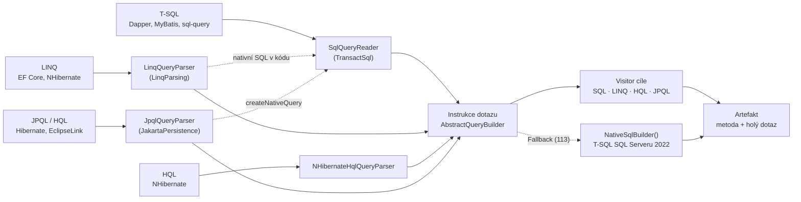
```mermaid
flowchart LR
  TS["T-SQL<br/>Dapper, MyBatis, sql-query"] --> SR["SqlQueryReader<br/>(TransactSql)"]
  LQ["LINQ<br/>EF Core, NHibernate"] --> LP["LinqQueryParser<br/>(LinqParsing)"]
  HQ["HQL<br/>NHibernate"] --> HP["NHibernateHqlQueryParser"]
  JQ["JPQL / HQL<br/>Hibernate, EclipseLink"] --> JP["JpqlQueryParser<br/>(JakartaPersistence)"]
  LP -.->|"nativní SQL v kódu"| SR
  JP -.->|"createNativeQuery"| SR
  SR & LP & HP & JP --> IR["Instrukce dotazu<br/>AbstractQueryBuilder"]
  IR --> V["Visitor cíle<br/>SQL · LINQ · HQL · JPQL"]
  IR -.->|"Fallback (113)"| NS["NativeSqlBuilder()<br/>T-SQL SQL Serveru 2022"]
  V --> A["Artefakt<br/>metoda + holý dotaz"]
  NS --> A
```

| Co se drží | Test | Rozsah |
|---|---|---|
| každý směr vydá neprázdný dotazový artefakt, žádný dotaz nezmizí mlčky | `Combined/QueryMatrixTest` nad `CrossFrameworkInputs.Directions` (součin `ORMEnum` × `ORMEnum`) | 36 směrů, z výčtu, ne ze seznamu |
| kategorie dotazů ze všech zdrojů do všech cílů; `Fallback` jen u artefaktu únikové cesty, a u něj vždy | `Combined/QueryShapeMatrixTest` (vstupy `Tests/Database/QueryShapes`) | kategorie a stupně §6.2; co běží v celé matici a co jen na devíti .NET směrech, §9 |

#### Kdo čte

| Jazyk | Čtenář | Co přidává wrapper |
|---|---|---|
| T-SQL | sdílený `SqlQueryReader` nad `SqlText` v `TransactSql` (rozh. [082](./decisions/082-t-sql-read-and-written-by-a-shared-project.md)); `TSql160Parser` (SQL Server 2022), `initialQuotedIdentifiers: true` | cestu k textu a fakta, která T-SQL nezná: Dapper (`DapperSqlQueryParser`) `IN @ids` (rozh. [106](./decisions/106-a-bare-parameter-after-in-is-dappers-collection-parameter.md)) a `isScript` (rozh. [108](./decisions/108-a-sql-unit-carries-a-query-per-select-numbered-by-position.md)); NHibernate přepis `NHibernateNativeSql`; MyBatis `#{}` a `<foreach>` (rozh. [084](./decisions/084-mybatis-wrapper-over-the-shared-sql-reading.md), *Javový ekosystém*) |
| LINQ | `LinqQueryParser` v `LinqParsing` (rozh. [026](./decisions/026-home-of-shared-query-reading.md)), potomci `EFCoreLinqQueryParser`, `NHibernateLinqQueryParser` | kořen (`ctx.Set<T>()`, `ctx.Customers` proti `session.Query<T>()`; `TryReadQueryRoot`), dva fakty provideru o `LIKE` (níž), háčky `ProviderStepChangesTheRowSet`, `TryReadForeignQuery`, `TryReadProviderFunction`, `IsProviderQuerySource`; `ReadsIntermediateResults` jen EF Core |
| HQL | `NHibernateHqlQueryParser`: vlastní tokenizer a rekurzivní sestup nad podmnožinou modelu (rozh. [062](./decisions/062-hql-read-by-a-hand-written-parser.md)); gramatiku drží round trip proti vlastnímu HQL builderu; srovnání jednohodnotové asociace s řádkem (`o.Customer = c`, `<>`) a test asociace na `NULL` čte stejně jako parser JPQL (řádek níž) | — |
| JPQL | `JpqlQueryParser` v `JakartaPersistence`; profily `HibernateJpqlQueryParser` (`TryReadDialectClause` pro `limit`/`offset`, `ImplementationCalls`, `ReadsIntermediateResults`, `ReadsHqlFunctions`) a `EclipseLinkJpqlQueryParser` (`ImplementationHints`); srovnání jednohodnotové asociace s řádkem (`p.customer = c`, `<>`) čte jako rovnosti sloupců cizího klíče s klíčem, odvozené ze vztahu jako join po cestě (`TryReadEntityComparison`, rozh. [101](./decisions/101-a-join-along-an-association-path-is-derived-from-the-relation.md)), jiné srovnání celé entity se nečte; `is null` / `is not null` nad celou entitou čtou parsery JPQL i HQL (`EntityNullness`) nad vlastnící jednohodnotovou asociací se známými sloupci jako nulovost sloupců cizího klíče (každý `IS NULL`, resp. `IS NOT NULL`, nad složeným klíčem konjunkce); kolekce, inverzní reference, celý řádek (`c is null`) a reference bez sloupců se odmítnou | — |

- **Fázi volí deklarovaný typ obsahu** (rozh. [047](./decisions/047-content-type-reaches-the-query-parser.md)), proto ho `IQueryParser.Parse` bere v podpisu; společné je `CanParse`, entitní `Parse(source)` je na `IEntityParser`. Na jazyk připadá ve frameworku jeden dotazový parser (rozh. [025](./decisions/025-query-language-as-content-type.md)).
- SQL v C#, které není řetězcovým literálem, se nečte (`Incompleteness`, rozh. 026). Řetěz LINQ se rozkládá explicitně od hlavy k patě; `HAVING` je `Where` hned za `GroupBy`. Po `Failure` parser čte dál, aby jmenoval všechny důvody.
- HQL parser je přesný invert visitoru (entita → tabulka, vlastnost → sloupec podle map, neznámé jméno doslova); syntaktická chyba je `Failure` s řádkem a sloupcem, `between` dvě porovnání se `Convention` (Q14). NHibernate → NHibernate je textový round trip nad holým HQL, bez stránkování, které žije na `IQuery` (rozh. [060](./decisions/060-pagination-as-a-query-instruction.md)).
- Týž text z Dapper jednotky i z `<sql-query>` dá tutéž mezireprezentaci (`Combined/SharedSqlReadingTest`).

**Pojmenované dotazy `hbm.xml`** (rozh. [081](./decisions/081-a-unit-may-be-a-mapping-and-a-query-at-once.md)). `NHibernateXmlQueryParser` si nárokuje typ obsahu `XML` jako mapovací parser, takže dokument čtou oba průchody a parsuje se dvakrát (mezi nimi stojí doplnění z katalogu). `<sql-query>` jde přes `NHibernateNativeSql`: `{alias}` a `@x` v textu jsou `Failure`, `:name` se přepíše na `@name`. `<query-param>` je vyslovený skalár (`ScalarTypeConvertor`, rozh. [083](./decisions/083-parameter-as-the-fifth-operand-shape.md)) a brána ho drží před odvozeným, rozdíl je `Conflict`. Dotaz bez atributu `name` je `Failure`. Ostatní: subset.md 2.3 (`NHibernate/NHibernateNamedQueryDeclarationTest`).

#### Kdo píše

| Cíl | Builder a visitor | Jazyk a obal | Artefakty |
|---|---|---|---|
| Dapper | `DapperSqlQueryBuilder` nad `AbstractSqlQueryBuilder` (`TransactSql`), `SqlQueryVisitor` | T-SQL v `connection.Query…` | C# metoda + `SqlQuery` |
| MyBatis | `MyBatisSqlQueryBuilder` nad týmž základem | T-SQL s `#{}` v `<select>` | metoda rozhraní + mapper `XML` |
| EF Core | `EFCoreLinqQueryBuilder`, `EFCoreLinqQueryVisitor` | LINQ nad `ctx.Set<T>()`; metoda bere `DbContext` a vrací `IQueryable` (ověřitelné bez databáze, §6.2) | C# metoda |
| NHibernate | `NHibernateHqlQueryBuilder`, `NHibernateHqlQueryVisitor` | HQL v `session.CreateQuery(…)` | C# metoda + `HqlQuery` |
| Hibernate, EclipseLink | `HibernateJpqlQueryBuilder`, `EclipseLinkJpqlQueryBuilder` nad `AbstractJpaQueryBuilder`, `JpqlQueryVisitor` | JPQL (Hibernate s rozšířeními HQL) v `em.createQuery(…)` | Java metoda + `JpqlQuery` |

Cíl píše nativní syntaxí (rozh. [022](./decisions/022-native-query-syntax-in-builders.md)) a holý dotaz vydává vedle metody (rozh. 025).

- **Projekce do SQL cíle je netypovaný řádek** (rozh. [104](./decisions/104-a-projection-into-a-sql-target-materializes-as-an-untyped-row.md)): Dapper `connection.Query(…)` a `List<dynamic>`, MyBatis `resultType="map"` a `List<Map<String, Object>>`; ostatní cíle anonymní typ, `object[]`, `Object[]`. Typ z tabulky `FROM` (entita převodu, jinak jméno tabulky v jednotném čísle se `Convention`) dostává jen dotaz bez projekce (Q3).
- **Jméno metody** (rozh. 081): `QueryName` nese jméno ze zdroje, `MethodName` ho vysloví přes `Common.Naming.QueryMethodNaming` — PascalCase pro .NET, camelCase pro JPA (`AbstractJpaQueryBuilder`), slova dělená na znacích mimo identifikátor (`rich-customers` → `RichCustomers`). Jediný nepojmenovaný dotaz je `Query`/`query`, víc jich čísluje parser pořadím v textu (`Query01`, …, `QueryMethodNaming.Positional`; nad 99 tři číslice) jako fakt textu (rozh. [028](./decisions/028-assembly-name-is-not-ours-to-invent.md)). Kolize s vyhrazeným slovem cíle se neřeší.

#### Brány a pravidla

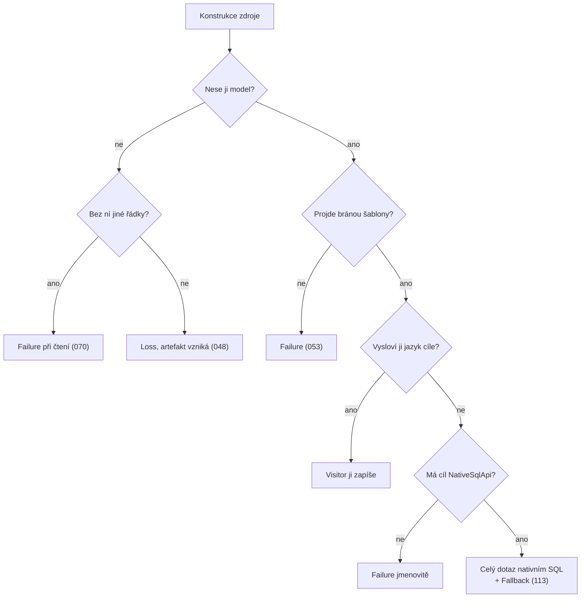
```mermaid
flowchart TD
  K["Konstrukce zdroje"] --> M{"Nese ji model?"}
  M -- ne --> R{"Bez ní jiné řádky?"}
  R -- ano --> F1["Failure při čtení (070)"]
  R -- ne --> L["Loss, artefakt vzniká (048)"]
  M -- ano --> G{"Projde bránou šablony?"}
  G -- ne --> F2["Failure (053)"]
  G -- ano --> E{"Vysloví ji jazyk cíle?"}
  E -- ano --> W["Visitor ji zapíše"]
  E -- ne --> API{"Má cíl NativeSqlApi?"}
  API -- ne --> F3["Failure jmenovitě"]
  API -- ano --> N["Celý dotaz nativním SQL<br/>+ Fallback (113)"]
```

- **Dotaz s jinými řádky se nevydá** (rozh. [053](./decisions/053-a-query-that-would-return-other-rows-is-not-emitted.md)). `Failure` znamená žádný artefakt jako u entit (rozh. [010](./decisions/010-diagnostics-as-returned-data.md)) a drží to kanál: `Report` nastaví `refused`, `Build()` vrátí prázdný seznam. `Normalize()` před osmi kroky šablony odmítne porovnání bez povinného pravého operandu (`IsNull`/`IsNotNull` ho nemají, rozh. [002](./decisions/002-is-null-as-comparison-operator.md)) a logický uzel bez operandů. Převodní tabulky operátorů a množinových operací nemají větev `_ =>`. Hranicí je množina řádků, ne podmínka (rozh. [065](./decisions/065-row-set-as-the-boundary-of-rule-053.md)), takže pravidlo platí i pro joiny.
- **Totéž při čtení** (rozh. [070](./decisions/070-a-parser-refuses-what-would-change-the-row-set.md)): konstrukce mimo model, bez níž by artefakt vrátil jiné řádky, je `Failure` v místě čtení; bez níž je výstup jen chudší, je `Loss` s artefaktem (rozh. [048](./decisions/048-a-fact-with-no-place-in-the-model-is-a-loss.md)). Výčet: subset.md 2.12.
- **Úniková cesta** (rozh. [113](./decisions/113-native-sql-as-the-escape-path-and-the-vocabulary-ldbc-needs.md), naplňuje rozh. 022) — rozhoduje šablona. Nevyslovenost se zjistí **deklarací** (`QueryFeature` vedená v `TargetFrameworkDescriptor.QuerySupport` jako `NotExpressible` — `ReportUnspokenFeatures`; mezivýsledek, který cíl neuvádí — `GateDefinitions`; funkce mimo `Functions` — `GateExpression`; množinová operace bez přepsaného `BuildSetOperation`), nebo **v místě emise**, kde krok či visitor narazí na tvar, který jeho jazyk nemá (subset.md 2.6–2.11). Obojí hlásí `ReportUnspoken`: záznam `Fallback`, který `Report` nezapíše, ale podrží (`unspoken`); brána deklarace pokus rovnou ukončí.
- **Po pokusu** cíl bez `TargetFrameworkDescriptor.NativeSqlApi` změní každý `Fallback` na `Failure` — i sedmý framework bez takového API, bez zásahu do `AbstractWrappers` (S1). Cíl s API zahodí záznamy pokusu (parserové zůstanou) a předá `NativeSqlBuilder()` wrapperu tytéž instrukce, definice, mapy, jméno a limit rekurze. Ten je potomkem `AbstractSqlQueryBuilder`, píše celý dotaz týmž textem jako Dapper, nese deskriptor cíle a značku `writesNativeSql`, pod kterou deklarace jazyka cíle neplatí. Před jeho záznamy jde `Fallback` za každou konstrukci se jménem dialektu (`SqlServer2022`) a API; odmítnutí únikové cesty odmítá dotaz.

| Cíl | Builder | Volání | Parametry | Řádek výsledku |
|---|---|---|---|---|
| EF Core | `EFCoreNativeSqlQueryBuilder` | `ctx.Database.SqlQuery<TRow>($"""…""")`, celá entita `ctx.Set<T>().FromSql($"""…""")`; vrací `IQueryable` | díry interpolace (o `$` víc, než je nejdelší běh `{`); kolekce `Failure` — EF Core 10.0.10 ji naváže jako jednu hodnotu JSON | třída `{Metoda}Row`: vlastnost na sloupec, typ z brány, vždy nullovatelná, `COUNT` jako `int`; sloupec bez jména či skaláru, dvě stejná jména (bez ohledu na velikost písmen) a jméno mimo identifikátor C# `Failure` (`Projection`) |
| NHibernate | `NHibernateNativeSqlQueryBuilder` | `session.CreateSQLQuery("""…""")`; vrací `IQuery` | `:name`, kolekce `IN (:ids)` a `SetParameterList` | `AddEntity(typeof(T))`, jinak `AddScalar` s typem `NHibernateUtil`; sloupec bez jména či typu bez `AddScalar`, `Incompleteness` |
| Hibernate, EclipseLink | `JpaNativeSqlQueryBuilder` (deskriptor a profil od builderu JPQL) | `em.createNativeQuery("""…"""[, T.class])`; vrací vždy `Query` (Jakarta Persistence 3.2.0) | `?n` v pořadí signatury a `setParameter(n, …)`; kolekce jen s `JpaImplementationProfile.NativeQueryExpandsCollection` (Hibernate 7.4.5 ano, EclipseLink 5.0.0 ne) | s `T.class` jedna entita |

Všechny obaly vydávají i holé `SqlQuery`; parametry přepisuje `SqlPlaceholders.Respell` (i pro MyBatis), textový blok Javy escapuje `JpaQueryMethod.TextBlock` (i pro JPQL). Množinovou operaci nad různými entitami odmítají, kde API materializuje jednu entitu (`RefusesAnEntityOverDifferentRows`). EF Core 10.0.10 bere přes `SqlQuery` i text s `WITH` a `OPTION`, nic-li se nad ním neskládá (ověřeno `ToQueryString()` i spuštěním).

**Kroky LINQ, které mění řádky** (`ChangesTheRowSet`; neznámý krok mimo výčet je `Loss`, aby se neodmítl i `Include`):

| Krok | Zachází se s ním |
|---|---|
| `Where`, `Join`, `GroupBy`, `Skip`, `Take`, `OfType`, `SkipWhile`, `TakeWhile`, `DefaultIfEmpty`, `Last`, `LastOrDefault`, `GroupJoin`, `Zip`; koncové `Count`, `Sum`, `Average`, `Min`, `Max`, `Any`, `All`, `Contains`, i `…Async` | kde se nečte, `Failure` |
| EF Core `FromSql`, `FromSqlRaw`, `FromSqlInterpolated` se skládáním; `TemporalAll`, `TemporalAsOf`, `TemporalFromTo`, `TemporalBetween`, `TemporalContainedIn` | `Failure` (`Filtering`) z háčku `ProviderStepChangesTheRowSet`; `FromSql…` bez skládání je nativní SQL |
| `First`, `Single`, `ElementAt` a `…OrDefault`, `…Async` | výřez rozepsaný před čtením — `First(p)` = `Where(p)` + `Take(1)`, `ElementAt(n)` = `Skip(n)` + `Take(1)` — s jedním `Convention` (`Pagination`) (rozh. [103](./decisions/103-a-query-expression-is-read-as-its-rewrite-and-a-single-row-terminal-as-a-slice.md), `Combined/LinqSingleRowTerminalTest`) |
| `SelectMany` | join po asociační cestě nebo podmínkou (tabulka níž), jinak `Failure` |
| `Include`, `Cast`, jiný neznámý krok | `Loss` |

**Hranice textu SQL** (rozh. 108). Nad celým textem (`SqlText.Selects`) je příkaz, který není čtecí `SELECT`, i syntaktická chyba `Failure` celého textu, dřív než se čte kterýkoli dotaz. Holá jednotka `SqlQuery` je skript: každý `SELECT` je dotaz s vlastním builderem (i přes `GO`), pojmenovaný pořadím před čtením (`Combined/SqlScriptTest`). Text ve volání Dapperu, v `<select>` a v `<sql-query>` je jeden příkaz a druhý `SELECT` je `Failure`, kromě `QueryMultiple` (rozh. [109](./decisions/109-a-code-unit-carries-every-query-it-hands-over.md)); rozlišení předává wrapper údajem `isScript` (S1). Uvnitř `SELECT`u (`SqlQueryReader.Read`) jsou nápovědy `Loss`, kromě `OPTION (MAXRECURSION n)`, který jde do builderu (`LimitRecursion`).

#### Jednotka v kódu nese každé předání dotazu (rozh. 109)

Jednotka `CSharp` nebo `Java` je celý soubor nebo fragment (rozh. [111](./decisions/111-a-unit-is-a-whole-source-file-that-declares-only-its-language.md)); fragment obalí třídou `Common.Reading.CSharpUnit`. Tvar textu rozhoduje o parsování, nikdy o roli.

| Jazyk | Parser | Místo předání |
|---|---|---|
| C#, Dapper | `DapperSqlQueryParser` | každé volání `SqlMapper`, které posílá SQL (`Query…`, `QueryMultiple`, `QueryUnbufferedAsync`, `Execute…` i asynchronní); SQL z argumentu `sql` jménem nebo pozicí v přetížení Dapperu 2.1.79; volání bez argumentu se přeskočí |
| C#, LINQ | `LinqQueryParser` | každý řetěz nad kořenem, který neleží uvnitř jiného (poddotaz v lambdě zůstává poddotazem); explicitní načtení EF Core (rozh. [115](./decisions/115-explicit-loading-is-the-query-the-provider-composes.md)) |
| C#, jiný jazyk | háček `TryReadForeignQuery` | EF Core `Database.SqlQuery<T>`, `SqlQueryRaw<T>`, `FromSql…`; NHibernate `CreateSQLQuery`, `CreateQuery` |
| Java, JPA | `JpqlQueryParser` | každé `createQuery`, `createSelectionQuery`, `createNativeQuery`, `createNamedQuery` |
| Java, MyBatis | parsery anotací a rozhraní mapperu | *Javový ekosystém* |

- **Jednotka bez místa předání chybou není**: dotazový parser nic nevydá ani nehlásí; jalovou jednotku hlásí obecný záznam (§5.1). Text, který entitní průchod odmítl jako nečitelný či příliš zanořený, nechají dotazové parsery bez slova.
- **Každý dotaz má vlastní builder** z továrny orchestrace, takže odmítnutý odmítá jen sebe; víc dotazů parser pojmenuje pořadím dřív, než je čte. Odmítnutí `let` nese řetěz jako anotaci (`QueryExpressionRewriter.Refusals`).
- **Argumenty volání Dapperu** pozná `ParametersOf` jménem nebo pozicí v přetížení; co z nich je `Loss` a co `Failure` (`commandType`), subset.md 2.3 (`Dapper/DapperCallArgumentTest`).

**Hlava řetězu LINQ** (`LinqParsing/QueryVariables`). Rozhoduje sémantický model Roslynu nad samotnou jednotkou bez referencí (`QueryVariables.StatementAbout`), stavěný jen nad jménem, které jednotka přiřazuje nebo deklaruje; oba průchody tak odpovídají stejně.

| Hlava | Čte se jako |
|---|---|
| proměnná přiřazená jedinkrát s dotazem, který se nevykonal (nekončí `ToList`, `AsEnumerable`, `First`, `Count` …, není `await`) | řetěz, který drží; jen prodlužovaná dotazem není, prodloužená dvakrát jsou dva dotazy, použitá i jinak je dotazem i ona; přiřazená víckrát či podmíněně a prodlužovaná `Failure` |
| volání (`Set<T>()`, `Query<T>()`) | kořen |
| člen parametru lambdy, proměnné `foreach` nebo vlastní instance | navigace v paměti; uvnitř kontextu EF Core je člen instance jeho `DbSet` (rozh. 111) |
| `x.M` (rozh. [114](./decisions/114-what-the-unit-states-about-a-name-decides-an-ef-core-root.md)) | první odpověď: `x` je proměnná prvku, nebo lokální proměnná s vykonaným dotazem (i `Find`, `await`) → navigace; jednotka deklaruje typ `x` i člen `M` → `DbSet<T>` kořen (`IsProviderQuerySource`), `IQueryable<T>`/`IOrderedQueryable<T>` `Failure`, jinak navigace; jinak rozhoduje místo; nedeklarovaný typ `x`, který převod mapuje jako entitu, `Failure` (`Combined/LoadedEntityNavigationTest`) |
| `X.Entry(e).Collection/Reference/Navigation(…)` + `Query()`, `Load()`, `LoadAsync()` (rozh. 115) | kořen dotazu, který skládá poskytovatel |

**Explicitní načtení** pozná wrapper EF Core (`TryReadQueryRoot`, `LinqQueryRoot.Load`) a `EmitExplicitLoad` z něj odvodí tabulku cílové entity s podmínkou *cizí klíč = parametr* pojmenovaný po vlastnosti klíče entity v paměti (`SalesOrderID`). Entitu dá `Entry<T>`, jinak `QueryVariables.EntityStatementAbout`, jinak jediná entita s navigací toho jména; páry vztah nebo jeho protějšek (`ColumnPairsOf`). Záznam `Convention`; builder EF Core vydá řetěz nad `Set<T>()` (`Combined/ExplicitLoadingTest`). Celek drží `Combined/CodeQueryUnitTest` a `Combined/QueryFaithfulnessTest`.

#### Nativní SQL v kódu (rozh. 113)

Rozpoznání je tvrzení wrapperu o API frameworku (S1): `LinqQueryParser` se u vnějšího volání výrazu nejdřív zeptá `TryReadForeignQuery`. Co wrapper pozná, je dotaz s vlastním místem a třída kolem je kód (rozh. 111); výstup únikové cesty se tak čte zpátky.

| Framework | Čte | Mechanismus |
|---|---|---|
| EF Core | `Database.SqlQuery<T>`, `SqlQueryRaw<T>`, `FromSql…` nad kořenem bez skládání | `EFCoreNativeSqlReading`: díra interpolace = parametr toho jména, `{n}` = parametr pojmenovaný po předané hodnotě |
| NHibernate | `CreateSQLQuery`, `CreateQuery`, volání na objektu dotazu | `NHibernateNativeSql` jako u `<sql-query>`, `SetParameterList` = kolekce; HQL parserem; `SetFirstResult`/`SetMaxResults` = výřez; `AddScalar`, `AddEntity`, `AddJoin`, `SetResultTransformer` jeden `Loss`, `List`/`Future` nic, jiné volání (`UniqueResult`, `SetTimeout` …) `Loss` |
| JPA | `createNativeQuery`, `createNamedQuery` | sdílená čtečka: `?1` → `@p1` (`SqlParameterFacts.Position`), `:name` → `@name` (`SqlPlaceholders.FromHost`), kolekce podle `setParameter` na kolekci či pole nebo `setParameterList`; `createNamedQuery` je `Incompleteness` |

Co se odmítá, subset.md 2.3 a 2.11. Objekt dotazu, se kterým další příkaz dělá víc než neškodné volání, je `Failure` (`ContinuedElsewhere`). Výřez z objektu dotazu jde do uzavřeného rozsahu (`AbstractQueryBuilder.PaginateReadQuery`). Deklarovaný cizí dialekt čtení zastaví (rozh. [088](./decisions/088-a-declared-foreign-source-dialect-is-not-read.md)), proto dialekt dostávají i čtečky LINQ a JPQL. Drží řádek `NativeSqlInCode` matic kategorií a `Combined/NativeSqlTest`.

#### Čtení LINQ: přepis a spojený řádek

- **Dotazový výraz** přepíše `QueryExpressionRewriter` (rozh. 103), vnořený dřív než obalující, na řetěz metod podle tabulky specifikace C# (`join` jinde než před `select` dává `(p, o) => new { p, o }` a průhledný identifikátor `t`, druhé `from` `SelectMany`, `join … into` `GroupJoin`). Záznamy citují přepsaný text; `let` je `Failure` (`Projection`) (`Combined/LinqQueryExpressionTest`).
- **Spojený řádek** se čte ze čtvrtého argumentu `Join`, `LeftJoin`, `RightJoin`: `(ol, o) => new { ol, o }` i zploštělé `new { x.ol, x.o, a }` je celý řádek bez záznamu, sloupce jsou projekce, vynechaný řádek nebo jedna strana `Loss` (`Projection`). Alias spojené tabulky dá selektor, alias zdroje vnější klíčový selektor; kroky za joinem sahají na sloupec přes člen (`x.o.CustomerId`) (`Combined/LinqJoinResultSelectorTest`). Parametr jiného kroku stojí za alias zdroje (`aliasSubstitutions` v `EmitStep`), dokud rozsah neseskupil a řádek není spojený. Navigace v operandu (`o.Customer.Name`, `x.o.Customer.Name`) se nečte (ve filtru `Failure`, v projekci `Loss`); join po cestě se v LINQ píše jen druhým `from` nad kolekcí. Člen, který mapování aliasu vede jako navigaci vztahu, se jako sloupec nečte ani sám (`o.Customer != null` ve filtru `Failure`, v agregátu či projekci `Loss`; `ColumnUnlessNavigation`).

#### Mechanismus po konstrukcích

Tvar v modelu §4.4, brány šablony §7, pokrytí po frameworcích subset.md.

| Konstrukce | IR | Čtení | Zápis | Rozh. |
|---|---|---|---|---|
| množinová operace (Q12) | `SetOperationInstruction` | T-SQL `BinaryQueryExpression` přeskupený podle precedence SQL Serveru (`INTERSECT` váže první; změna závorek = `Convention`); LINQ `Union`, `Concat`, `Intersect`, `Except`, argument rekurzivně | Dapper závorkuje vnořenou operaci; EF Core skládá dva úplné řetězy a hlídá typ prvku; `Push()`/`Pop()` sledují hloubku, `SetOperation` řetězí | 053, 060 |
| join po asociační cestě (Q7) | `JoinInstruction` s odvozenou podmínkou | HQL `join o.Customer c`, JPQL `join o.customer c`, LINQ `SelectMany(c => c.Orders, …)`: cesta ↔ `Relation.SourceNavigationProperty` v mapách po §4.3 a §5.2; podmínka z `ColumnPairs` `FK(levá) = PK(pravá)`, stranu dá `Role`, víc párů `And`; inverzní strana bez párů bere páry vlastnící protistrany (`ColumnPairsOf`, `InverseRelationName`, rozh. [012](./decisions/012-foreign-key-rendering.md)) | cestu nevydává nikdo: SQL `ON`, LINQ `Join` s klíčovými selektory, JPA entity join s podmínkou | [101](./decisions/101-a-join-along-an-association-path-is-derived-from-the-relation.md), 065 |
| podmínka joinu nad rámec klíčů | `JoinInstruction` | LINQ: `Where` na spojované posloupnosti (`TryReadFilteredSequence`, `ReadFilters`); `SelectMany` nad filtrovaným řetězem kořene, s `DefaultIfEmpty()` levý (`HandleCorrelatedSelectMany`) | EF Core `SplitJoinCondition`: rovnosti klíčů → selektory, konjunkty bez řádku řetězu → `Where` posloupnosti, zbytek → korelovaný `SelectMany`; EF Core 10.0.10 z toho dělá `JOIN` bez `APPLY` (`Combined/LinqJoinConditionTest`); plný vnější join skládá jako `LeftJoin` + `Concat` pravého joinu zúženého na řádky bez levého protějšku, bez záznamu (drží 3. stupeň) | 113, 065, [061](./decisions/061-subquery-as-a-condition-operand.md) |
| stránkování | `PaginationInstruction` (offset, pak limit; `RowCount` číslo nebo parametr) | LINQ `Skip`/`Take` při zavření scope; T-SQL `TOP`, `OFFSET/FETCH`; Hibernate `limit`/`offset`; objekt dotazu `setFirstResult`/`setMaxResults` | osmý krok `BuildPagination`: Dapper `TOP (n)` / `OFFSET … FETCH NEXT …`, bez řazení `ORDER BY (SELECT NULL)` se `Convention`; EF Core `.Skip()`/`.Take()`; NHibernate a JPA na objektu dotazu, vázaný počet tam nevážou jménem (`BoundParameters`) | 060, [085](./decisions/085-a-row-count-is-a-number-or-a-parameter.md) |
| `DISTINCT` | `DistinctInstruction` → `QueryClauses.Distinct` | T-SQL `UniqueRowFilter.Distinct` každé `QuerySpecification`, HQL `select distinct`, LINQ `Distinct()` | projekční krok: `SELECT DISTINCT [TOP (n)]`, EF Core řazení až za `Distinct()`; `Normalize()` drží klíče řazení v projekci a za množinovou operací relační identity; nad projekcí jen z neseskupených agregátů se značka vypustí s `Convention` | [073](./decisions/073-distinct-as-a-flag-of-the-query-scope.md) |
| agregační `DISTINCT` | příznak `Distinct` na `ProjectInstruction` a sloupcovém operandu | `UniqueRowFilter` ve `FunctionCall`, `distinct` v agregátu HQL/JPQL, LINQ `g.Select(…).Distinct().Count()` | `COUNT(DISTINCT c.X)`, `count(distinct c.X)`, týž řetěz LINQ (`Combined/AggregateDistinctTest`) | [102](./decisions/102-aggregate-distinct-like-escape-and-a-parameter-among-listed-values-are-carried.md) |
| seskupení a agregát | `GroupByInstruction`, `HavingInstruction` | LINQ `g.Key`, `g.Key.Část` proti klíčům rozsahu (`GroupingKey`); selektor prvků `GroupBy` (`group l by o.X`, `GroupElement`): strana spojeného řádku — lambdy nad prvky čtou její sloupce —, hodnota — nad ni jde agregát bez argumentu (`g.Max()`) —, jiný tvar `Loss` a krok, který prvky čte, `Failure` (`Grouping`); result selector `Loss` (`Combined/LinqQueryExpressionTest`) | `COUNT(*)` nikdo nekvalifikuje aliasem; EF Core píše `COUNT(sloupec)` přesně: nad členem, který entita deklaruje jako nenulovatelný hodnotový typ (i část klíče), `g.Count()`, jinak `g.Count(e => e.Sloupec != null)` (EF Core 10.0.10: `COUNT(CASE WHEN … IS NOT NULL …)`), a sdílené čtení LINQ ten tvar čte zpět jako `COUNT(Sloupec)`; nad sloupcem řádku, který stojí na straně vnějšího joinu bez nalezené shody (levý: připojený řádek, pravý: dosavadní řádky, plný: oba; `LinqScope.OptionalAliases`), testuje existenci řádku `g.Count(e => e.l != null)` a konstantu počítá `g.Count()` (`Combined/CountOverANullableColumnTest`, i 4. stupeň s rodičem bez dětí); agregát bez seskupení EF Core nativním SQL (`Combined/GroupedQueryTest`) | 113 |
| poddotaz (Q11) | `QueryOperand.Nested` | T-SQL `ExistsPredicate`, `InPredicate`, `ScalarSubquery`; LINQ `Contains`, `Any`, `Count(p)`, koncový agregát; alias z první lambdy | vnořený `SELECT` týmiž kroky; EF Core vnořený řetěz, korelace řetězem scope; `NormalizeSubQueryOperand` | 061 |
| výčet `IN` | `QueryOperand.ValueList` | T-SQL literály, LINQ `Contains` nad inline kolekcí, HQL `in (`; příjemce `Contains` rozhoduje: řetěz kořene = poddotaz, sloupec = `LIKE`, identifikátor = kolekční parametr | `IN (…)`, EF Core `new[] { … }.Contains(x)`, nad nullable sloupcem `new int?[]` (proti kolekčnímu parametru a poddotazu `x.Value`); smíšené rodiny odmítá `Normalize()` (`Combined/InValueListTest`) | [074](./decisions/074-a-list-of-values-as-the-fourth-operand-shape.md) |
| okamžik | `QueryConstant` skaláru `DateTime`, ISO vždy s časem | LINQ `new DateTime(…)`: tři hláskování typu, tři arity, nezáporné literály | T-SQL a HQL čtou okamžik jako `QueryConstant` skaláru `String`; `Build()` ho přetypuje podle porovnaného sloupce (§7), do LINQ `DateTime.Parse("…")` | [024](./decisions/024-typed-query-operand.md) |

**Parametr** (`QueryOperand.Bound`, rozh. 083). Čtečky odstraní zdobení: `@id`, LINQ holý identifikátor (skalár) a příjemce `Contains` (kolekce), HQL `:id` a `?`, JPQL `:id`, `?1`, `in :ids`, MyBatis `#{id}` a kanonický `<foreach>`. Dapper wrapper pozná `IN @ids` nad tokeny lexeru ScriptDomu, ozávorkuje ho a předá `SqlParameterFacts(IsCollection: true)` (`DapperCollectionParameters`); čtečka každého `SELECT`u dostane jen fakta ze svého rozsahu (`SqlSelect.Offset`, `Length`). Skalár doplní brána šablony z mapování (§7). Kolekci zapíše Dapper `IN @ids`, NHibernate `in (:ids)` se `SetParameterList`, JPA `in :ids`, MyBatis `<foreach>`; EF Core zachytí parametr metody. Poziční tvar přežije jen do JPQL, jinde `p1`, `p2` se `Convention` (`Dapper/DapperCollectionParameterTest`).

**`LIKE`** (`ComparisonCondition` s `Like` a `Escape`; rozh. [051](./decisions/051-like-pattern-translated-not-carried-over.md), 102). Do LINQ se vzorek překládá: `%x%` → `Contains`, `x%` → `StartsWith`, `%x` → `EndsWith`, bez zástupných znaků rovnost, jinak `EF.Functions.Like`; ostatní cíle píšou `ESCAPE` zpět. LINQ parser čte opačně a jádro řetězcové metody escapuje znakem `!`, protože provider EF Core argument escapuje sám (`ProviderEscapesStringMethodArguments`); NHibernate čte jádro doslova. Argument, který není literál, je `Like` nad `Concat` s `EscapePattern` (rozh. 107), do SQL, HQL a JPQL řetězem `REPLACE` s `ESCAPE '!'`. Přetížení se `StringComparison` se nečte, filtr je `Failure` (`Filtering`) (`Combined/LikeEscapeTest`, `Combined/LinqStringMethodTest`).

**Výraz** (`QueryOperand.Computed`, `QueryExpression`, rozh. [107](./decisions/107-an-expression-is-the-sixth-operand-shape-and-stands-wherever-an-operand-stands.md)). Čtečky čtou slovník `QueryFunction` svým pravopisem; T-SQL `+` je `Concat`, je-li strana řetězcová už tvarem, jinak `Add`; LINQ `Substring` posouvá pozici o jedna a visitor ji vrací; HQL a JPQL čtou `select` až po `from` a joinech. Závorkování podle precedence drží `ExpressionSpelling`; `CASE` bez `ELSE` píše LINQ `(T?)null`, JPQL `else null`. NHibernate dostává u aritmetiky desetinného a celého čísla `cast(… as decimal)` se `Convention`. Agregát přímo nad agregátem (`MAX(SUM(x))`, `MAX(COUNT(*))`) odmítnou čtečky T-SQL, JPQL a HQL už při čtení, slovy brány, která vidí jen agregát uvnitř výrazu (`Combined/ExpressionOperandTest`). `TargetFrameworkDescriptor.Functions` uvádí funkce, které sonda potvrdila proti připnuté verzi: NHibernate a Jakarta Persistence bez `DateAdd` a `DateDiff`, EclipseLink navíc bez `Cast` (`QueryFunctionVocabulary.AllBut`), ostatní vše (`EachDescriptorSpeaksWhatItsProbeFound`).

**Seskupení podle výrazu, okenní funkce, agregace do seznamu** (rozh. 113). Funkce provideru čte háček `TryReadProviderFunction` (EF Core `EF.Functions.DateDiff…`), HQL funkce Hibernatu profil `ReadsHqlFunctions`. EclipseLink váže literál klíče seskupení jako parametr (`JpaImplementationProfile.BindsLiterals`), takže ho `BuildGrouping` ohlásí jako nevyslovený (`ComputedGrouping`). EF Core píše klíč jako anonymní typ pojmenovaný aliasem projekce, `.Value` u nullovatelného sloupce mimo část klíče (`Receiver`, `Unwrapped`, `IsKeyPart`), `string.Join` jen nad sloupcem bez `NULL` (`HoldsNoNull`) a `EF.Functions.DateDiff…` jen nad dvěma hodnotami téhož skaláru — datum proti okamžiku přetížení nemá (EF Core 10.0.10) a jde nativním SQL. Drží `Combined/ExpressionVocabularyTest` a katalog LDBC.

**Mezivýsledek** (`WithInstruction(Name, Body)`, rozh. [112](./decisions/112-a-query-as-a-row-source-is-a-named-intermediate-result.md)). Čtení: T-SQL `ReadCommonTableExpression` a `ReadDerivedTable` (jména čtených tabulek předem, `StatementTableNames`); Hibernate `with` a poddotaz ve `from` háčkem `ReadsIntermediateResults`, který EclipseLink nezapíná. LINQ zavře rozsah jako tělo definice (`SplitScope` v `EmitChainCore`), když řetěz pokračuje krokem nad projekcí, výřezem nebo `Distinct()`; jménem je proměnná (`ChainSteps.EndsWithVariable`), jinak parametr dalšího kroku; proměnná ve vnitřní posloupnosti joinu je jedna definice (`DefineVariable`, `IsJoinedSequence`). Zápis: Dapper a MyBatis `WITH a AS (…)` (`WithClause`), Hibernate `with a as (…)`, EF Core lokální proměnné metody (`DefinitionStatements`, `FreshName`), NHibernate a EclipseLink nativní SQL. EF Core řadí za projekcí podle všech klíčů, když některý jmenuje alias projekce; klíč mimo projekci se stránkováním vede k nativnímu SQL, bez něj k `Loss`.

**Rekurze** (rozh. 113). Tělo definice je množinová operace kotvy a členu, který jmenuje definici; limit z `OPTION (MAXRECURSION n)` nese builder (`LimitRecursion`, `RecursionLimit`; 0 bez limitu, chybějící = výchozí limit dialektu). Čtečky T-SQL a JPQL Hibernatu čtou jméno definice v jejím těle jako zdroj řádků; o rekurzi a jejích pravidlech rozhodne šablona (§7), která dá rekurzivnímu členu jména sloupců kotvy (`Named`, `NamedAs`). Konstanta s aliasem v projekci (`0 AS Depth`) se čte, bez aliasu je `Loss`. Zápis: Dapper a MyBatis `WITH … OPTION (MAXRECURSION n)` (`RecursionOption`, `WritesRecursionLimit`), Hibernate `with x as (… union all …)` a s limitem nativní SQL; EF Core, NHibernate a EclipseLink vždy nativní SQL (`Fallback`, `Recursion`). Cyklus hlídá text dotazu (`RecursiveWalkOfACyclicGraph`). Katalog LDBC tak přeložil IC 12, IC 13, IC 14, BI 15, BI 19 a BI 20 (§9).

#### Jména entit, ne tabulky

HQL, JPQL i LINQ jmenují entity a vlastnosti, takže buildery mapují sloupce zpět přes `EntityMaps`, které jim předá orchestrace (`ColumnMember` v `AbstractWrappers`); Dapper také, protože `Query<T>` jmenuje entitu. Mezireprezentace nese sloupec, ne vlastnost: parsery HQL a JPQL přeloží vlastnost podle map (`ColumnFor`), LINQ podle mapy řádku, k němuž alias patří, i u připojované tabulky před výběrem výsledku (`ColumnOf`), takže vlastnost nad přejmenovaným sloupcem dojde do SQL jako sloupec a parametr porovnaný s ní dostane jeho skalár (`Combined/LinqColumnNameTest`). Kde se k tabulce žádná entita nemapuje, i u cíle joinu, odvodí se jméno se `Convention`. Alias se k entitě přiřadí i tam, kde zdroj tabulku nevyslovil (`AliasedEntities`; u Dapperu a MyBatisu podle rozh. [050](./decisions/050-one-home-for-the-singular-plural-heuristic.md)). Odvození drží jen `Common.Naming.EntityTableNaming`: `EntityNameFor` ubere koncové `s` (bez ohledu na velikost písmen, u názvu delšího než jeden znak), `TableCandidatesFor` nabídne název, jak je, a pak druhé číslo (páruje na ně i `LinqQueryParser.ResolveTable`), `TableNameFor` dá jediný název pro benchmarking (§5.2).

**Sloupec cizího klíče bez skalární vlastnosti** (obvyklý tvar JPA) píší jazyky nad entitami přes referenci, která ho nese:

| Místo | HQL, JPQL | LINQ (EF Core) |
|---|---|---|
| podmínka joinu, jejíž rovnosti pokrývají všechny páry vlastnící reference (i nad složeným klíčem) | reference porovnaná s řádkem: `p.customer = c` (HQL `with`, JPQL `on`) | vlastnost cizího klíče, kterou deklaruje entitní builder (navigace + jméno klíče, `EFCoreColumnMember`) |
| jinde | cesta přes referenci ke klíči: `p.customer.CustomerID` | totéž |
| kde by cesta stála join — EclipseLink vždy (profil `KeyThroughReferenceJoins`; jeho `p.customer.id` je vnitřní join, který ztratí řádky s `NULL`), NHibernate u části složeného klíče | nativní SQL se záznamem `Fallback` (rozh. [113](./decisions/113-native-sql-as-the-escape-path-and-the-vocabulary-ldbc-needs.md)) | — |

Složený klíč joinu píše EF Core jako anonymní typ se jmenovanými členy; člen, jehož nullabilita se liší od protějšku, přetypuje na nullable, a typy členů bere z entity, kterou rozsah přiřadil aliasu (i konvencí pojmenování, rozh. [050](./decisions/050-one-home-for-the-singular-plural-heuristic.md)). Drží to `Combined/ForeignKeyColumnWithoutPropertyTest` a javové `hibernate/ReferenceKeyClaimsTest`, `eclipselink/ReferenceKeyClaimsTest`.

**Jméno entity a alias, které jsou klíčovým slovem cílového jazyka**, se píšou tak, aby je parser cíle přijal; jiná jména zůstávají bajtově stejná. Co který parser nebere, je změřené proti připnutým verzím (`Combined/KeywordNameTest`, javové `hibernate/KeywordNameClaimsTest`, `eclipselink/KeywordNameClaimsTest`):

| Cíl | Jméno entity | Alias |
|---|---|---|
| NHibernate (HQL 5.7.0, `HqlNames`) | jako cíl entitního joinu kvalifikované jmenným prostorem z `<hibernate-mapping>` (`inner join Shop.Order o with …`); v čele `from` (i v poddotazu) jen u sedmi slov, která parser nebere nikde (`ascending`, `descending`, `cross`, `left`, `right`, `skip`, `take`); bez jmenného prostoru nativní SQL s `Fallback` | podtržítko na konci (`order_`) v deklaraci i ve všech cestách; alias projekce se nemění |
| Hibernate, EclipseLink (JPQL, `JpqlNames`) | JPQL jméno kvalifikovat neumí: co implementace nebere (profil `EntityNamesRefused`, `EntityNamesRefusedAsJoinTarget` — Hibernate 7.4.5 `true`, `false`, `null`; EclipseLink 5.0.0 čtrnáct slov všude, mj. `from`, `where`, `table`, `union`, `left`, `set`, a dalších dvacet pět jako cíl joinu, mj. `select`, `member`, `case`, `date`), jde nativním SQL s `Fallback` | vyhrazený identifikátor JPQL dostane v obou implementacích podtržítko na konci — proměnná řádku, výsledková proměnná projekce (`count(o) as count_`, `order by value_`) i sloupce mezivýsledku; EclipseLink 5.0.0 ho jako výsledkovou proměnnou odmítá (mj. `count`, `value`, `size`, `key`, `sum`, `max`, `date`, `new`), Hibernate 7.4.5 ne |

#### Deskriptory, typy a dialekt

**Co cíl vyžaduje a co nevyjádří, deklaruje deskriptor** `TargetFrameworkDescriptor` (`AbstractWrappers.Descriptors`, instance ve wrapperech; rozh. 009); zdrojový dostane orchestrace přes `DescriptorFactory`, bez builderu.

| Pole | Obsah |
|---|---|
| `Version` | cílová verze (rozh. 013), jediná zafixovaná (§1), builder podle ní nevětví; čte ji záznam běhu (§5.1) |
| `Dialect` | `DatabaseDialect`, jen `SqlServer2022` (rozh. [086](./decisions/086-target-database-dialect-declared-by-the-descriptor.md)); má ho i Dapper |
| `Ecosystem` | `DotNet` / `Java` (`Model`, rozh. [090](./decisions/090-the-cross-ecosystem-matrix-counts-itself.md)); čte ho jen ověření F10 |
| vynucené členy | co builder přidá mimo doménu; import mezi ně nepatří |
| `FactSupport` | *vyžaduji* ⊂ *umím vyjádřit* / *neumím vyjádřit* pro třináct `MappingFactCategory`: `TableName`, `SchemaName`, `ColumnName`, `DatabaseType`, `Length`, `PrecisionAndScale`, `Nullability`, `PrimaryKey`, `PrimaryKeyStrategy`, `ForeignKeyColumns`, `VersionColumn`, `UniqueConstraint`, `TransientProperty` |

*Vyžaduji* čte brána úplnosti (`Failure`), *vyžaduji* a *umím* poptávka do katalogu, *neumím* mechanický `Loss` (§5.1); po frameworcích [`subset.md`, 1.5](./subset.md#15-slovník-mapování) — Dapper všech třináct *neumím*, MyBatis devět, klíč vyžadují NHibernate a JPA.

**Deskriptor deklaruje, builder implementuje, test váže** (rozh. 037): builder vyhodnocuje podmínku sám (`NHibernateEntityBuilder.HasCompositeKey`), `EnforcedMembersTest` hledá člen výskytem řetězce (pozná `virtual` chybějící všude, ne u jedné vlastnosti) i jeho nepřítomnost, v matici přes každou hodnotu `ORMEnum` a obě hodnoty každé podmínky (kromě `Always` a NHibernate + JPA bez klíče).

**Dialekt zdroje** (rozh. [088](./decisions/088-a-declared-foreign-source-dialect-is-not-read.md)) smí deklarovat požadavek (`ConvertRequest`, nepovinně `ConversionHandler.Convert`): `SourceSqlDialect` v `Model` (`SqlServer2022`, `AnotherSystem`), záměrně ne `DatabaseDialect`; `null` je dnešní chování. Pravidlo `Common.Sql.ForeignDialect` platí ve `SqlQueryReader` (`TransactSql`), `SqlTypeSpelling.Read` (`Common.Sql`) a u `sql-type` v `NHibernateXMLMappingParser`; deklarace teče konstruktory parserů (`ParserFactory.Create`, u JPA `JpaReadingContext`), ne builderem. Cizí dialekt zastaví doslovné SQL (`Failure` bez kategorie; u dvojaké jednotky jen dotazová půlka, rozh. [066](./decisions/066-records-attributed-to-the-input-unit.md)) a doslovný typ (`Loss` `DatabaseType`, ani na únikovou cestu); LINQ, HQL, JPQL, `jdbcType` a katalog ne — katalog, který fakt dodal, nese jeden `Conflict` (rozh. [091](./decisions/091-the-catalog-completes-a-foreign-source-and-says-so.md)). Výčet v [`subset.md`, 2.1](./subset.md#21-vyňaté-oblasti).

**Převodní tabulky** .NET wrapperů překládají rodiny (rozh. 019) a nikdy nehází výjimku: neznámý typ jde do `SourceSqlType` bez rodiny s `Incompleteness`.

- EF Core parser čte argumenty (`varchar(50)`, `decimal(18,2)`, `datetime2(3)`) a únikové typy s rodinou: `money`/`smallmoney` (`Decimal` 19/10, 4), `datetime`/`smalldatetime` (`Timestamp` 3/0), `image`, `rowversion`. NHibernate `Currency` → `Decimal(19,4)` + `Loss`.
- **Doslovný typ má přednost před rodinou** (rozh. [052](./decisions/052-literal-sql-type-reaches-the-ef-core-annotation.md)) v `[Column(TypeName)]` i `sql-type`; převod tam a zpět není bijekce, kritériem není rovnost řetězců.
- NHibernate čte z názvu typu jen rodinu (`Timestamp` je datočasový, ne `rowversion`; `LocalDate` → `Date`, `LocalDateTime`/`UtcDateTime` → `Timestamp`, i `Byte[]`); `DateOnly` a `TimeOnly` `TypeFactory` neregistruje. Emitovaná jména jsou ověřená proti `TypeFactory` 5.7.0 (`binary`, `XmlDoc`); neregistrovaná (`AnsiStringClob`, pevná délka ≠ 1) nahradí nejbližší jako `Narrowing`.
- **Doslovný typ z dialektu** (rozh. 086) doplní, co slovník cíle neunese — jen bez doslovného typu zdroje, s příznakem řádku `RestoredByColumnType` a facetami, které dialekt vyhláskuje: `nchar(n)`, `char(n)`, `text` + `Convention`. Temporální ústup a pevná délka bez délky zůstávají `Loss`. SQL Server 2022 je deklarovaná mez.

**Atribut `type` NHibernate** (`<id>`, `<key-property>`): `VarChar` → `String`/`AnsiString` podle unicode (neuvedené = unicode), `Char` 1 → `Char`/`AnsiChar`, jiná délka `String`/`AnsiString`. U temporálních rodin a `BigInt` rozhoduje i skalár (rozh. [071](./decisions/071-five-scalars-with-a-counterpart-in-both-ecosystems.md)):

| Sloupec | `DateTime` | `DateOnly` | `TimeOnly` | `TimeSpan` |
|---|---|---|---|---|
| `date` | `Date` | `DateOnlyAsDate` | | |
| `time` | `Time` | | `TimeOnlyAsTime` | `TimeAsTimeSpan` |
| `datetime2` | `DateTime` | předpoklad NHibernate + `Loss` | `TimeOnlyAsDateTime` | |
| `bigint` | | | `TimeOnlyAsTicks` | `TimeSpan` |

`datetimeoffset` → `DateTimeOffset`. Bez databázového typu odhadne `GuessFromScalarType` (`NHibernateUtil.GuessType` 5.7.0; `TimeSpan` → **`bigint` s ticky**, ne `time` jako EF Core); u reference, kolekce a `Object` atribut vynechá.

#### Javové frameworky

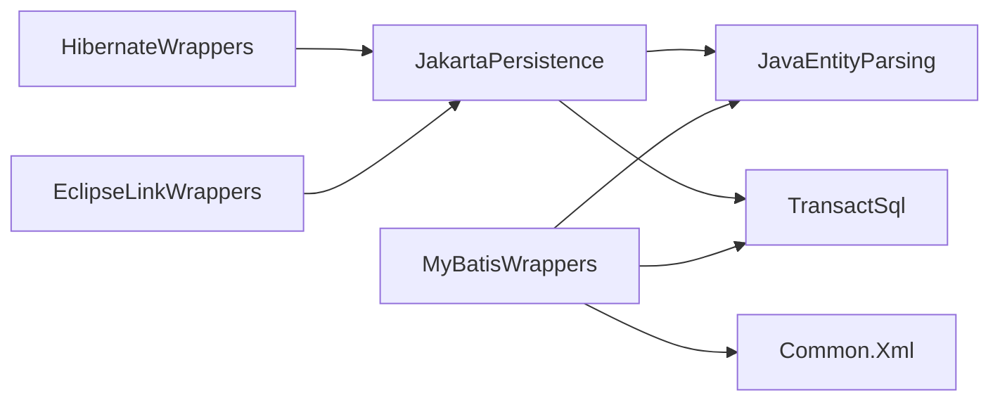
```mermaid
flowchart LR
  H["HibernateWrappers"] --> JP["JakartaPersistence"]
  E["EclipseLinkWrappers"] --> JP
  JP --> JEP["JavaEntityParsing"]
  JP --> TS["TransactSql"]
  MB["MyBatisWrappers"] --> JEP
  MB --> TS
  MB --> CX["Common.Xml"]
```

**Hibernate a EclipseLink jsou dva profily nad sdílenou JPA vrstvou** (rozh. [077](./decisions/077-hibernate-wrapper-over-the-shared-jpa-layer.md), [080](./decisions/080-eclipselink-as-the-second-profile-over-the-jpa-layer.md), stavba 076); konstrukce po konstrukcích v [`subset.md`, 1.6 a 2](./subset.md#16-po-frameworcích).

- **Čtení:** `JavaClassReader` → `JpaEntityParser` (přístup z `@Access`, jinak z umístění `@Id`) → `JpaAnnotationReader` → `JpaEntityFacts` → `JpaMappingWriter`, týmiž cestami jako `JpaOrmXmlParser`. `orm.xml` se čte první (rozh. 068): odlišná anotace je `Conflict`, `metadata-complete` anotace vypne (`JpaReadingContext`). Temporální přesnost nese `secondPrecision` (rozh. [079](./decisions/079-fractional-second-precision-as-second-precision.md)). Reference bez `@JoinColumn` dostane **výchozí sloupec `<atribut>_<sloupec klíče>`** jako tvrzení zdroje (rozh. 067) zpětným voláním `AddForeignKey(conventionalColumns)` před katalogem — ne nad složeným klíčem, `@JoinTable`, `@MapsId`, jiným `referencedColumnName` a cílem mimo převod. `@MappedSuperclass` má vlastní záznam: třída není entita.
- **Jazyková osa** (076): primitiv je nenullovatelný a dává NOT NULL, reference nullovatelná, ledaže `nullable`/`optional = false`; obal na `@Id` nenullovatelný; pole bez přístupových metod je veřejná vlastnost s oběma; `final`, `volatile` `Loss`; inicializátor jen jako literál shodný v obou jazycích; `Instant`, `java.util.Date` jsou `Unknown` (075); databázový typ se z javového neodvozuje.
- **Zápis** (`AbstractJpaEntityBuilder`, „explicitní JPA"): `@Table(name)` a `@Column(name)` vždy (chybějící tabulka = jméno entity + `Convention`), `nullable` jen tvrzené, `@GeneratedValue` vždy konkrétní: `Auto` podle profilu, `Identity`/`Uuid` doslova, `Sequence` a `HiLo` se `SequenceName` jako `SEQUENCE` s `@SequenceGenerator`, jiné `HiLo` jako `TABLE` s `@TableGenerator`; nevyslovené jméno sekvence (`<Entita>_SEQ`), `allocationSize` (krok profilu) i přejmenování hi/lo nesou `Convention`; `Assigned` nic, `Unspecified` nic + `Convention`, `Increment` `Loss`, `foreign` → `@MapsId`; složený klíč `@IdClass` s vnořenou `public static class … implements Serializable` (jméno ze `SourceKeyClass`, jinak `<Entita>Id` + `Convention`), bez párů `@JoinColumn(<navigace>_<sloupec klíče>)` + `Convention`; inverzní 1:1 `@OneToOne(mappedBy)` z vlastnící protistrany, bez ní člen `@Transient` + `Incompleteness`; 1:N `@OneToMany(mappedBy)`, jinak jednosměrně s `@JoinColumn`. C# `virtual`, `override`, `sealed`, `new`, `required` odpadnou mlčky, literál se překládá (`1.5m` → `new BigDecimal("1.5")`). Vynucené členy: `JakartaPersistenceDescriptor`.
- **Dotazy:** `JpqlQueryParser` (ruční sestup, rozh. [062](./decisions/062-hql-read-by-a-hand-written-parser.md)) čte podmnožinu JPQL, kterou model unese, včetně joinu po asociační cestě (rozh. [101](./decisions/101-a-join-along-an-association-path-is-derived-from-the-relation.md)), `between` (`Convention`), `{d '…'}` a množinových operací; `new Dto(…)` je `Loss`, nerozresolvovaná cesta, join bez `on`, čárka a syntaktická chyba `Failure` (rozh. [070](./decisions/070-a-parser-refuses-what-would-change-the-row-set.md)). Z jednotky `Java` bere řetězec každého `createQuery`/`createSelectionQuery` (rozh. 109; nativní a pojmenovaný rozh. [113](./decisions/113-native-sql-as-the-escape-path-and-the-vocabulary-ldbc-needs.md)), složený za běhu je `Incompleteness`. `setFirstResult`/`setMaxResults` s literálem či identifikátorem → `PaginationInstruction` (rozh. [060](./decisions/060-pagination-as-a-query-instruction.md), [085](./decisions/085-a-row-count-is-a-number-or-a-parameter.md)), nečitelné `Failure` `Pagination`; objekt, který jednotku opustí, se nesleduje. Ostatní volání na objektu rozdělí `ReadQueryObject` ([`subset.md`, 2.3](./subset.md#23-jednotka-a-předání-dotazu)). `AbstractJpaQueryBuilder` vydá metodu nad `EntityManager` (`TypedQuery<Entita>` či `Query`, JPQL v textovém bloku, výřez na objektu) a holé `JpqlQuery`; vícečlennou podmínku joinu závorkuje kvůli EclipseLinku 5.0.
- **Rozhraní:** `ORMEnum.Hibernate`/`EclipseLink`, obsah `Java`, `JpqlQuery`, `XML` (i `orm.xml`); `/required-content` jednotky 11–14 a 15–18, vzorky `CustomerSampleHibernate`/`CustomerSampleEclipseLink`.

| Profil (`…Descriptor.Profile`) | Hibernate | EclipseLink 5.0.0 ([tutoriál](./analysis/tutorials/eclipselink-getting-started.md)) |
|---|---|---|
| `AUTO` (čtení nematerializuje) | `SEQUENCE` `<Entita>_SEQ`, krok 50 + `Convention` | `TABLE` `SEQUENCE(SEQ_NAME, SEQ_COUNT)`, řádek `SEQ_GEN`, krok 50 + `Convention` |
| implicitní jména | malými | velkými — builder píše každé jméno, katalog páruje bez ohledu na velikost (`TableImage.FindColumn`) |
| nationalizace (háček 2) | `@Nationalized` | `columnDefinition` `nchar(n)`/`nvarchar(n)`/`ntext` (`JpaSqlTypeWriting`), délka 255 a rodina z jazyka + `Convention`, jinak `Loss` |
| vendor anotace (háček 3) | `@Nationalized`, ostatní `Loss` | prázdný; `fetch = LAZY` na referenci `Loss` (weaving) |
| dotaz (háček 4 `TryReadDialectClause`, `ImplementationCalls`, `ImplementationHints`) | HQL `limit`/`offset`; `setPage`, `getKeyedResultList`, `getResultCount` | `FUNC`, `OPERATOR`, `SQL`, `COLUMN`, poddotaz za čárkou ve `FROM` se nečtou, `limit` `Failure`; nápovědy `eclipselink.jdbc.max-rows` aj. |

**F7 a F9 jsou nárokované** (§9): 1. stupeň v xUnit, 2.–4. stupeň javová sada (§6.2); shodu deskriptorů mimo profil drží `TargetFrameworkDescriptorTest`.

**MyBatis stojí na dvou jazykových vrstvách a žádné frameworkové** (rozh. [084](./decisions/084-mybatis-wrapper-over-the-shared-sql-reading.md)).

- **Čtení:** třída a rozhraní mapperu jsou jednotka `Java`, mapper `XML` (rozh. 081, 111); parsery `MyBatisEntityParser`, `MyBatisMapperInterfaceParser` (`@Results`, `@One`, `@Many`, podpisy) a `MyBatisAnnotationQueryParser` (`@Select`). Týž `<namespace, id>` v anotaci i XML je `Failure` (rozh. 068), poznaný sdíleným čtecím kontextem. `<resultMap>` (i pro víc entit) dá sloupce, `javaType`, `jdbcType`; `<id>` není klíč tabulky (`Incompleteness`), klíč, tabulka, facety, nullabilita, strategie klíče ani verze se z mapperu nečtou, `<association>`/`<collection>` jsou navigace bez sloupců, odporující si `<resultMap>` dají `Conflict`, `autoMapping="false"` dělá ostatní vlastnosti transientní, alias `type="Author"` se rozřeší jménem entity. `mybatis-config.xml` se nečte ani nevydává, artefakt na něm nezávisí.
- **Příkaz** připraví `MyBatisStatementText`: statické značky rozvine, OGNL značky odmítne (rozh. [053](./decisions/053-a-query-that-would-return-other-rows-is-not-emitted.md)), kanonický `<foreach>` je kolekční parametr, `#{name}` → `@name`; `${}`, `@` už ve zdroji a `{call …}` odmítne. Zápisové příkazy a jiný jazykový ovladač jsou `Failure`, volby příkazu (`MyBatisQueryParser.ReadOptions`) `Loss`; skalár parametru dá `javaType`, `parameterType` nebo podpis metody (rozh. [083](./decisions/083-parameter-as-the-fifth-operand-shape.md)).
- **Zápis:** POJO bez importu z frameworku a bez konstruktoru (jediný, negativní vynucený člen) + mapper s jedním `<resultMap autoMapping="false">`; dotaz jako metoda rozhraní s `@Param` + `<select id resultType>` (SQL jen v XML); jmenný prostor `<balík>.<Entita>Mapper`. Kolekční vlastnost bez vztahu do `<resultMap>` nepíše (MyBatis 3.5 pro ni nemá type handler a mapper by odmítl) a hlásí `Incompleteness`; člen na třídě zůstává. Profil deskriptor nemá.

**Překladová cesta cizí kód nekompiluje ani nespouští a artefakt nenese přihlašovací údaje** (rozh. 029, S4). `/convert` jen parsuje a skládá; Roslyn kompilace (`Common.Compilation`, §2) běží jen v testech a v `AdvisorBenchmarking`. Připojení žádný builder nevypisuje (EF Core bere `DbContext` parametrem, `hibernate.cfg.xml` ani `persistence.xml` nevznikají); `OnConfiguring` s `UseSqlServer(…)` ve vstupu se nečte a `Loss` nevydá. Drží to `ArtifactCarriesNoCredentialsTest`.

### 5.1 Diagnostika převodu

Převod vrací vedle artefaktů diagnostické záznamy (rozh. [010](./decisions/010-diagnostics-as-returned-data.md)): `ConversionHandler.Convert` vrací `ConversionResult` (`Sources`, `Records`, `CatalogState`, `CatalogReadTime` — §5.2) a `/convert` ho propisuje do `ConvertResponse`. Záznam běhu (S6) nese navíc:

| Pole | Obsah | rozh. |
|---|---|---|
| `RunId` | nový pro každý běh | |
| `SourceFrameworkVersion`, `TargetFrameworkVersion` | z deskriptorů | [013](./decisions/013-target-framework-versions.md) |
| `TargetDatabaseDialect` | systém, pro který platí doslovné typy sloupců | [086](./decisions/086-target-database-dialect-declared-by-the-descriptor.md) |
| `DeclaredSourceDialect` | dialekt vyslovený zdrojem; `null` = nic | [088](./decisions/088-a-declared-foreign-source-dialect-is-not-read.md) |
| `MaxNestingDepth` | strop hloubky čtení; `0` = vypnutý | [092](./decisions/092-input-nesting-depth-capped-before-the-descent.md) |
| `ToolVersion` | `ToolRelease.Version` z `<Version>` v `Directory.Build.props`, bez `+commit` | [034](./decisions/034-central-version-management.md) |

Frontend ukazuje fakta běhu v pásu nad výstupem a záznamy pod ním, po entitách s `Failure` první (§6.3). Výjimka je vyhrazená chybě programu; neparsovatelný vstup je záznam (rozh. [093](./decisions/093-unreadable-input-is-a-unit-failure.md)).

Záznam `ConversionRecord` (`AbstractWrappers.Diagnostics`) nese podle F11 `Kind`, `Framework`, `Artifact`, `Entity`, `Property`, `Category`, `Feature`, `Unit`, `Query` a `Reason`. `ConversionRecordKind` je výčet událostí, ne stupnice závažnosti; seznam konstrukcí po druzích je v [subset.md](./subset.md).

| Druh | Kdy vzniká | Artefakt | rozh. |
|---|---|---|---|
| `Failure` | chybí kategorie *vyžaduji*; vlastnost bez jazykového typu; klíč i jeho popření; vstup hlubší než strop; nečitelný text jednotky; parser nepřečte konstrukci měnící řádky; orchestrace (níž) | nevznikne | [063](./decisions/063-stated-keylessness-as-a-carried-fact.md), [070](./decisions/070-a-parser-refuses-what-would-change-the-row-set.md) |
| `Loss` | fakt zdroje, který cíl nevyjádří: kategorie *neumím vyjádřit* (celý Dapper), zúžení v místě emise, nečitelná hodnota (`length="MAX"`, `nullable="ano"`), fakt bez místa v modelu (bez kategorie), kontext EF Core v jednotce | platný, chudší | [048](./decisions/048-a-fact-with-no-place-in-the-model-is-a-loss.md), [111](./decisions/111-a-unit-is-a-whole-source-file-that-declares-only-its-language.md) |
| `Convention` | výstup tvrdí, co zdroj neřekl: konvence cíle za mlčení zdroje (`assigned`, explicitní styl JPA), konvence třetího stupně, doslovný typ z dialektu, třída jednotky nečtená jako entita | vznikne | [012](./decisions/012-foreign-key-rendering.md), [064](./decisions/064-absence-of-generation-as-a-catalog-fact.md) |
| `Incompleteness` | modelu chybí fakt: neznámá cílová entita, sloupce neodpovídají klíči, N:M bez spojovací entity, typ `Unknown`; stavy fáze doplnění | z toho, co je | [015](./decisions/015-mapping-fact-completion-from-the-catalog.md), [075](./decisions/075-unknown-language-type-is-a-reported-incompleteness.md) |
| `Supplied` | fakt dodal katalog (jediný nosič původu) | s faktem | 015 |
| `Conflict` | zdroj × katalog nebo dva vstupy; dvě entity se stejným prostým jménem; `[Key]` vedle `[Keyless]` | vítězí zdroj, resp. dříve přečtené | [017](./decisions/017-source-precedence-for-mapping-facts.md), [094](./decisions/094-entity-identity-inside-a-conversion.md) |
| `Fallback` | cíl napsal celý dotaz nativním SQL přes API svého frameworku | vázaný na dialekt | [113](./decisions/113-native-sql-as-the-escape-path-and-the-vocabulary-ldbc-needs.md) |

**Vyžadovaný primární klíč** mají NHibernate a obě implementace JPA; EF Core píše bezklíčovou entitu jako `[Keyless]`, Dapper a MyBatis jako prostou třídu. Důvod rozliší chybějící klíč od popřeného (`HasNoKey`); vazbu drží `TargetFrameworkDescriptorTest`.

#### Tři zdroje záznamů

1. **Buildery a parsery**: kanál `Records` s veřejnou `Report`. Před generováním brána `CheckCompleteness`, při emisi `ReportLosses` (fakty modelu × *neumím vyjádřit*) a zúžení z builderů.
2. **Fáze doplnění** z katalogu (§5.2).
3. **Orchestrace** `ConversionHandler` (rozh. [045](./decisions/045-a-conversion-that-produced-nothing-says-so.md)), vždy `Failure`: jednotka v jazyce, který zdroj nečte (u hodnoty s rolí, např. `CSharpEntity`, důvod jmenuje správnou z `ConversionContentTypes.LanguageOf`); jednotka, ze které nic nevzešlo; převod bez artefaktu (HTTP 200). První dvě platí napříč oběma průchody (rozh. [081](./decisions/081-a-unit-may-be-a-mapping-and-a-query-at-once.md)). Prázdná jednotka se přeskočí bez záznamu.

Nečitelné XML hlásí `XmlSource` jednou větou s řádkem a sloupcem v textu klienta; u dokumentu obou průchodů (`hbm.xml`, mapper MyBatisu) jen mapovací parser.

**Atribuce** (rozh. [066](./decisions/066-records-attributed-to-the-input-unit.md)): `Unit` = `ConversionSource.Name`, jinak `unit N`. Entitní záznamy vzniklé při `Parse` jednotky připíše orchestrace (`AttributeRecords`); záznamy doplnění a generování jednotku nenesou. Dotazové záznamy nesou jednotku vždy a `Query` se jménem ze zdroje, u více nepojmenovaných `Query01` atd.

#### Dotazová větev

Tentýž kanál (rozh. [022](./decisions/022-native-query-syntax-in-builders.md)): `AbstractQueryBuilder` má `Records`, `Report` a `Descriptor`, `ConversionHandler` seznamy slévá. `QueryFeature` má 18 hodnot (12 kategorií T2 a `Expression`, `IntermediateResult`, `Recursion`, `ComputedGrouping`, `WindowFunction`, `ListAggregation`). Nevyjádřitelnou hlásí mechanicky `ReportUnspokenFeatures` jako `Fallback`, u cíle bez API pro nativní SQL jako `Failure`. `Failure` znamená, že dotaz nevznikne; drží to `Report` sám (rozh. [053](./decisions/053-a-query-that-would-return-other-rows-is-not-emitted.md)).

| `QueryFeature` | Nevyjádří |
|---|---|
| `SetOperation` | NHibernate |
| `IntermediateResult`, `ListAggregation` | NHibernate, EclipseLink |
| `Recursion`, `WindowFunction` | EF Core, NHibernate, EclipseLink |
| `ComputedGrouping` | sdílený deskriptor JPA (oba profily ho přebíjejí) |

### 5.2 Doplňování mapovacích faktů z katalogu

Projekt `DatabaseCatalog` (rozh. [015](./decisions/015-mapping-fact-completion-from-the-catalog.md)) dělí mechanismus (`ICatalogReader`) od řízení (`CatalogCompletion.Complete` v `ConversionHandler.Convert`).

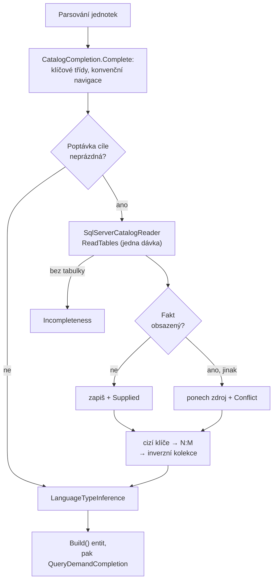
```mermaid
flowchart TD
  A["Parsování jednotek"] --> B["CatalogCompletion.Complete:<br/>klíčové třídy, konvenční navigace"]
  B --> C{"Poptávka cíle<br/>neprázdná?"}
  C -->|ne| L
  C -->|ano| R["SqlServerCatalogReader<br/>ReadTables (jedna dávka)"]
  R -->|"bez tabulky"| N["Incompleteness"]
  R --> F{"Fakt<br/>obsazený?"}
  F -->|ne| S["zapiš + Supplied"]
  F -->|"ano, jinak"| K["ponech zdroj + Conflict"]
  S --> V["cizí klíče → N:M<br/>→ inverzní kolekce"]
  K --> V
  V --> L["LanguageTypeInference"]
  L --> G["Build() entit,<br/>pak QueryDemandCompletion"]
```

**Poptávka** = kategorie deskriptoru *vyžaduji* a *umím vyjádřit*; prázdná (Dapper) znamená nulový dotaz. Zápis je přírůstkový a idempotentní. Transientní vlastnost fáze přeskakuje celou (rozh. [072](./decisions/072-a-transient-property-is-a-carried-mapping-fact.md)).

#### Čtečka

- **`SqlServerCatalogReader`** obslouží dávku jedním připojením a čtyřmi dotazy do `sys.*` (sloupce, primární a cizí klíče, unikátní omezení); připojení otevírá líně a drží po dobu života. Jména tabulek jdou jako `nvarchar(128)`; každá velikost dávky stojí ~1,2–1,4 MB plan cache (měřeno 2026-08-26).
- **`TableImage`**: sloupce (rodina, unicode faceta, délka ve znacích, precision/scale, nullabilita, IDENTITY, rowversion, default constraint), části PK v pořadí, cizí klíče s páry, `UniqueConstraintImage`. Hrubší rodina nese i `SourceSqlType` (rozh. [019](./decisions/019-neutral-database-type-vocabulary.md)).
- **Kandidáti**: uvedená tabulka, jinak jméno entity s/bez `s` (`EntityTableNaming.TableCandidatesFor`, rozh. [050](./decisions/050-one-home-for-the-singular-plural-heuristic.md)); víc schémat → `dbo`, jiná víceznačnost se hlásí.
- **`CachingCatalogReader`** pamatuje odpovědi (i záporné) po dobu života, kterou volí vlastník (běh Advisoru, testovací kolekce).

#### Co katalog dodává

| Fakt | Dodá se | Jinak |
|---|---|---|
| sloupec, `DatabaseType`, facety | prázdný fakt | rozdíl → `Conflict` |
| `VersionColumn` | jen kladně (rowversion) | — |
| primární klíč | nepopřený, každý sloupec má vlastnost | popřený → `Conflict`, vítězí zdroj |
| strategie části klíče | `Unspecified`: IDENTITY → `Identity`, bez defaultu → `Assigned` | default constraint → `Incompleteness`; tvrzená `Identity`/`Auto` nad sloupcem bez IDENTITY či `Assigned` nad IDENTITY → `Conflict` |
| unikátní omezení | nová množina vlastností; název bezejmenné | jiný název → `Conflict` |
| cizí klíč | cíl v převodu, navigace existuje (celý PK → 1:1, jinak N:1) | bez navigace → záznam |
| inverzní kolekce | 1:N bez sloupců, kolekce bez vztahu; nic, nese-li sloupce (vyslovené či spárované) její vlastnící protistrana — vlastnící many-to-one či one-to-one s navigací, určená jako v builderech: `InverseRelationName`, jinak jediný kandidát; dvě bez jména nechají kolekci katalogu —, klíč pak builder i join po cestě berou z ní | jiné sloupce → `Conflict` |
| jazykový typ | jen z mapování, i bez připojení: `date` → `Date`, `time` → `TimeOfDay`, binární → `ByteArray` | `Convention` |

**N:M** (rozh. [005](./decisions/005-many-to-many-as-explicit-junction-entity.md)): spojovací tabulka (`JunctionShape`) má celý PK ze sloupců právě dvou cizích klíčů. Entita na ní dostane `IsJunctionTable` se záznamem `Supplied`; tabulky mimo převod najde `FindJunctionTables`; nevyužitá spojovací tabulka a sloupce nad rámec obou klíčů jsou `Incompleteness`. Vztah N:M bez tabulky dostane `JunctionFacts`, kolekční navigace bez vztahu nový vztah N:M; dvojznačnost s přímým cizím klíčem se hlásí.

#### Připojení a stav

Připojení je nepovinné: `/convert` ho čte z `ConnectionStrings:CatalogDatabase`; chybějící i nedostupné končí `Incompleteness` a konvencemi. Stav nese `CatalogPhaseResult` (`CatalogConnectionState`):

| Stav | Význam |
|---|---|
| `NotConfigured` | připojení není nastavené |
| `Unused` | prázdná poptávka nebo žádná pojmenovaná entita |
| `Reached` | katalog přečten |
| `Unreachable` | čtení selhalo |

Čas: `CatalogReadTime`, `null` = nezkoušeno. Měření S3: [`README`](../ORMConvertor/README.md#translation-performance-s3).

#### Poptávka dotazu

Rozh. [105](./decisions/105-a-query-formulates-its-own-demand-on-the-catalog.md): `CatalogDemand()` (§7) vydá tabulky, ze kterých se typuje parametr a které neváže mapování. Orchestrace přečte všechny dotazové jednotky, předá poptávky `QueryDemandCompletion.Complete` a pak volá `Build()` — jedno čtení na převod. Zapíše se jen `Table` a `Schema` entity, až po entitních artefaktech; `Supplied` (`TableName`, `QueryParameter`) nese první dotaz. Jinak `Incompleteness` a brána vydá `Failure`. `CatalogPhaseResult.Then` bere nejsilnější stav (`Unreachable` > `Reached` > `Unused` > `NotConfigured`) a sčítá časy.

#### Cizí deklarovaný zdroj

Rozh. [091](./decisions/091-the-catalog-completes-a-foreign-source-and-says-so.md): zdroj s `AnotherSystem` se doplní taky; běh nese jediný `Conflict` bez kategorie, pokud fáze vydala aspoň jeden `Supplied` nebo `Conflict` (`ForeignDialect.ContradictsTheCatalog`).

Čtečku sdílí i benchmarking (`QualifyEntityTableNames`, jeden `CachingCatalogReader` na běh Advisoru) a `LinqQueryParser.ResolveTable` čte tabulky, které fáze zapsala do `EntityMaps` (S1).

## 6. Ověření artefaktů, frontend a rozhraní

Nasazovací pohled (spouštění, konfigurace, testy, testovací databáze, velikost sady) je v [`ORMConvertor/README.md`](../ORMConvertor/README.md) (rozh. [058](./decisions/058-only-the-operational-half-of-the-deployment-view-moves.md)), proto tu §6.1 a §6.4 chybějí. Jediný proces ASP.NET Core nese REST API i frontend pod `/orm`, bez přihlášení. Připojovací řetězce jsou v repozitáři prázdné (S4, rozh. [029](./decisions/029-database-connection-is-the-consumer-projects-fact.md)); bez katalogu F4 a F6 přes rozhraní neplatí (§5.2). S3 je změřený s víc než čtyřicetinásobnou rezervou proti 30 s; S5 platí v rozsahu, který v repozitáři existuje (§9): jeden `docker-compose.yml` spouští systém i obě sady.

### 6.2 Ověření generovaných artefaktů

Čtyři stupně rozh. [016](./decisions/016-generated-artifact-verification-levels.md), všechny implementované; dotazy podle rozh. [027](./decisions/027-query-artifact-verification.md), čtvrtý stupeň nad dotazem je diferenční ověření (rozh. [089](./decisions/089-differential-verification-as-the-fourth-level-over-a-query.md)). Každý stupeň má negativní polovinu.

| Stupeň | Co se ověřuje | .NET cíle (EF Core, NHibernate, Dapper) | Java cíle (Hibernate, EclipseLink, MyBatis) | Kde |
|---|---|---|---|---|
| 1. tvar | jak je artefakt zapsán (S2) | řetězcové aserce | totéž | testy parserů a builderů |
| 2. překlad | přeloží se / rozparsuje | `CSharpSourceCompiler`; `hbm.xml` proti XSD z balíku NHibernate; SQL Dapperu parserem | `javac` nad classpath sady | `Tests/Verification/`, `GeneratedArtifactTest` |
| 3. přijetí | framework přijme bez provedení | `BuildSessionFactory`, `CreateQuery`; model EF Core, `ToQueryString()`; Dapper splývá s 2. | továrna Hibernate / EclipseLink / MyBatis, JPQL `createSelectionQuery` / `createQuery` | totéž |
| 4. běh | entita se uloží a načte s touž identitou; dotaz vrátí kanonické řádky | `Dapper*PersistenceTest`, `DifferentialVerificationTest` | `*/GeneratedArtifactTest`, `differential/` | kolekce `TestDatabaseSchema`; `@Tag("integration")` |

#### Entitní větev .NET

- **2. stupeň** — `GeneratedEntityCompiler` dodá implicitní usings SDK a reference balíku cíle (příspěvek projektu, ne artefaktu).
- **3. stupeň NHibernate** — `MsSql2012Dialect`, explicitní `MicrosoftDataSqlClientDriver`, vypnuté `hbm2ddl.keywords` (jinak by otevíralo spojení); atribut `assembly` dodá harness (rozh. [028](./decisions/028-assembly-name-is-not-ours-to-invent.md)); handler `AssemblyResolve` je procesně globální a páruje se jménem, proto souběh ověření vylučuje sdílený zámek kolem celého kroku (`AssemblyResolveGate`).
- **3. stupeň EF Core** — `UseSqlServer()` bez řetězce, `EnableServiceProviderCaching(false)` (jinak cache modelu podle typu kontextu); model se ptá zpět na tabulku, schéma, klíč, cizí klíč.
- **Negativní** — neexistující vlastnost, `<composite-id>` bez `Equals`/`GetHashCode` (rozh. [006](./decisions/006-flat-composite-key-rendering.md)), entita EF Core bez klíče; kolekci deklarovanou konkrétním typem (rozh. [035](./decisions/035-nhibernate-collections-declared-by-interface.md)) odhalí až 4. stupeň (`PropertyAccessException` „Invalid Cast…"), 1. stupeň ji hlídá v `EnforcedMembersTest`.
- **Verze** — tvrzení platí pro verzi z `Directory.Packages.props` (rozh. [034](./decisions/034-central-version-management.md)); vazbu drží `DeclaredVersionsMatchTheVerificationPackages` (§1).
- **F6 se zdrojem Dapper** — `DapperToNHibernateVerificationTest`, `DapperToEFCoreVerificationTest`: `ConversionHandler.Convert` s připojením, pak 2. a 3. stupeň nad fakty jen z katalogu (pořadí částí klíče, cizí klíče, `<key>` inverzních `<bag>`). `DapperManyToManyVerificationTest`: N:M ze schématu jako junction entita; `Products` jako `ValueGenerated.Never` (rozh. [064](./decisions/064-absence-of-generation-as-a-catalog-fact.md)). Bez databáze se přeskakují ([README](../ORMConvertor/README.md#the-test-database)); F4 dokládá `SqlServerCatalogReaderTest`.

**4. stupeň** zapisuje do schématu fixture v transakci nad `OpenConnection()` s rollbackem; typy jsou dostupné přes `dynamic`. Tím je naplněné F3:

| Vztah | Test | NHibernate | EF Core |
|---|---|---|---|
| 1:N | `DapperToNHibernatePersistenceTest`, `DapperToEFCorePersistenceTest` | objednávka plochým composite-id (rozh. 006) | cizí klíč z navigace |
| 1:1 | `DapperOneToOnePersistenceTest` (rozh. [012](./decisions/012-foreign-key-rendering.md), [015](./decisions/015-mapping-fact-completion-from-the-catalog.md)) | sdílený klíč ručně | klíč propíše `SaveChanges` |
| M:N | `DapperManyToManyPersistenceTest` (rozh. [005](./decisions/005-many-to-many-as-explicit-junction-entity.md)) | obě půlky klíče ručně | obě půlky z navigací |

#### Dotazová větev .NET

Nasucho v `QueryVerificationTest`; záměrně špatný dotaz v `DeeplyNestedQueryVerificationTest`, 2. stupeň každé kategorie v `Combined/QueryShapeMatrixTest`.

| Cíl | 2. stupeň | 3. stupeň |
|---|---|---|
| EF Core | `GeneratedQueryCompiler` | `ToQueryString()` (`EFCoreQueryAcceptance`) |
| NHibernate | kompilace C# | `CreateQuery(hql)` (`NHibernateQueryAcceptance`) — odmítne i nenamapované, tedy Q13 frameworkem |
| Dapper | kompilace a parsování SQL | splývá; tabulky a sloupce v mezireprezentaci (`TSqlAcceptance`) |
| úniková cesta (rozh. [113](./decisions/113-native-sql-as-the-escape-path-and-the-vocabulary-ldbc-needs.md)) | metoda nad API nativního SQL (`NativeSqlTest`, Java `shapes/QueryCategoryTest`) | SQL týž jako u cíle Dapper (`AFallbackEmitsTheStatementTheDapperTargetWrites`); framework ho neposuzuje |

Artefakt EF Core je veřejná statická metoda s **prvním** parametrem `DbContext`, vracející `IQueryable` z `ctx.Set<T>()`; harness váže parametry (rozh. [083](./decisions/083-parameter-as-the-fifth-operand-shape.md)) kolekcí o jednom prvku a číslem 1, protože `Take(0)` dá `WHERE 0 = 1` (rozh. [085](./decisions/085-a-row-count-is-a-number-or-a-parameter.md)). `AdvisorBenchmarking` parametrizovaný dotaz nenajde ([`open-items.md`](./open-items.md)). Negativní: nepřeložitelný LINQ, HQL a SQL se syntaktickou chybou či neznámým členem.

#### Javová sada `JavaTests/`

Maven + JUnit mimo řešení (rozh. [076](./decisions/076-java-wrappers-in-csharp-jvm-in-containers.md)): stupeň `java-tests` v `ORMConvertorAPI/Dockerfile`, služba `java_tests`, job `java-test` ([README](../ORMConvertor/README.md#tests)). Artefakty bere jako HTTP klient běžící instance (rozh. [078](./decisions/078-java-suite-as-a-client-of-a-running-instance.md)):

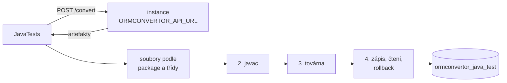
```mermaid
flowchart LR
  T["JavaTests"] -- "POST /convert" --> I["instance<br/>ORMCONVERTOR_API_URL"]
  I -- "artefakty" --> T
  T --> F["soubory podle<br/>package a třídy"]
  F --> S2["2. javac"]
  S2 --> S3["3. továrna"]
  S3 --> S4["4. zápis, čtení,<br/>rollback"]
  S4 --> DB[("ormconvertor_java_test")]
```

- **Prostředí** — `ORMCONVERTOR_TEST_JDBC_URL`, schéma `ormconvertor_java_test` (`ORMCONVERTOR_TEST_SCHEMA`) z téhož `TestSchema.sql`; obraz kopíruje celý `Tests/Database`, výběr dělá `<testResources>`. **Bez přeskočení**: chybějící databáze či instance je selhání.
- **Vstupy** `src/test/resources/inputs` nad tabulkami fixture, schéma přes `{{schema}}`, typ podle přípony (rozh. [111](./decisions/111-a-unit-is-a-whole-source-file-that-declares-only-its-language.md)); tvrdí se `targetFrameworkVersion` = `org.hibernate.Version`; `Failure` shodí scénář. Dotazová metoda dostane obal s importy `jakarta.persistence` (rozh. [040](./decisions/040-boundary-of-the-handed-over-artifact.md)).
- **Směry** — Hibernate, EF Core, NHibernate → každý javový cíl; Dapper ne (nevysloví tabulku ani schéma, a tím nenasměruje katalog).

| Cíl | Bootstrap | Tvrzení profilu (`*ClaimsTest`) | Negativní |
|---|---|---|---|
| Hibernate (rozh. [077](./decisions/077-hibernate-wrapper-over-the-shared-jpa-layer.md)) | `HibernateBootstrap`, bez dialektu, `hibernate.default_schema` | entity join s `on` v každé pozici; `precision` na `LocalDateTime` → `datetime2(7)`, `secondPrecision = 3` → `datetime2(3)` (rozh. [079](./decisions/079-fractional-second-precision-as-second-precision.md)) | bez identifikátoru odmítne továrna; bez konstruktoru až čtení; `@IdClass` ani `equals` 7.4.5 nevyžaduje |
| EclipseLink (rozh. [080](./decisions/080-eclipselink-as-the-second-profile-over-the-jpa-layer.md)) | `PersistenceUnitInfo` v kódu, `eclipselink.weaving = false` | bez připojení: `@GeneratedValue` → tabulka `SEQUENCE`; `String` → `VARCHAR`. Líná reference bez weavingu netestována (hranice záruk) | bez identifikátoru |
| MyBatis (rozh. [084](./decisions/084-mybatis-wrapper-over-the-shared-sql-reading.md)) | `Configuration` v kódu, kontextový zavaděč vlákna; řádky vrací vynucený `rollback(true)` | konstruktor vynucený, `autoMapping="false"` uzavře, `<foreach>` naváže kolekci | příkaz v anotaci i XML (rozh. [068](./decisions/068-source-framework-precedence-orders-the-reading.md)) |

- **4. stupeň navíc** — `CustomerOrder` se najde podle obou částí klíče; stránkovaný dotaz z EF Core vrátí vázaný počet řádků (`setMaxResults(take)`, `#{take}`; `BoundParameters`, §7).
- **Kategorie** — `shapes/DeeplyNestedQueryTest` a `shapes/QueryCategoryTest`: do JPA jen ze zdrojů s klíčem (rozh. [063](./decisions/063-stated-keylessness-as-a-carried-fact.md)), do MyBatisu ze všech; bez databáze.
- **Velikost** (rozh. [087](./decisions/087-an-integration-test-is-a-run-against-the-database.md)) — 4. stupeň nese `@Tag("integration")`; `SuiteSizeTest` počítá invokace proti F12 (60, z toho 20 integračních), nespočitatelnou parametrizaci ohlásí jménem.

#### Diferenční ověření

Artefakt každého cíle se spustí nad fixturou a řádky se porovnají s **kanonickým výsledkem dotazu**. Sady se potkávají nad souborem; přímé porovnání by žádalo spouštět cizí kód (§9, oblast 1).

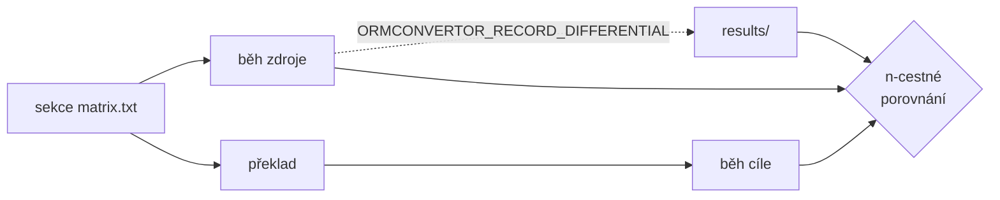
```mermaid
flowchart LR
  M["sekce matrix.txt"] --> SV["běh zdroje"]
  M --> TR["překlad"] --> RT["běh cíle"]
  SV -. "ORMCONVERTOR_RECORD_DIFFERENTIAL" .-> K["results/"]
  SV --> C{"n-cestné<br/>porovnání"}
  RT --> C
  K --> C
```

- **Měřítko patří dotazu, ne směru**; zapisuje ho jen běh zdroje.
- **Kanonický řádek** — tabulátorem oddělená pole v pořadí projekce; desetinná na `decimalScale`, plovoucí na `floatDigits`, ISO 8601, escapované řetězce, `NULL`; neznámý typ zastaví běh. Bez řazení se řádky před porovnáním seřadí. Hodnoty, ne typy (rozh. [014](./decisions/014-language-type-model.md)); shodu rendererů hlídá `RendererConformanceTest`.
- **Projekce** — HQL a JPQL pozičně, Dapper a MyBatis jako netypovaný řádek (rozh. [104](./decisions/104-a-projection-into-a-sql-target-materializes-as-an-untyped-row.md)); chybějící sloupec v mapě MyBatisu čte `JavaQueryRunner` jako `NULL`.
- **Fixtura** nic nezapisuje; tabulky s předponou kvůli rozh. [050](./decisions/050-one-home-for-the-singular-plural-heuristic.md). Žádný dotaz neřadí jen podle clusterovaného klíče, každé řazení je úplné.

| Soubor (`Tests/Database/`) | Obsah |
|---|---|
| `TestSchema.sql` | schéma fixture pro obě sady |
| `Differential/matrix.txt` | 6 vlastních dotazů a 40 kategorií T2; `mutations` |
| `*/FixtureData.sql` | `DifferentialProducts`, doména `Shop*` |
| `QueryShapes/categories.txt` | zdroje kategorie, `refusedBy`, `fallbackBy`, `*WithoutCatalog` |

- **Buňka** — přeloženo; odmítnuto (`refusedBy`, není dvojicí; dnes nic); nativní SQL (`fallbackBy`, dvojice + povinný `Fallback`, `AFallbackDirectionFallsBackAsStated`). Rozpis je v [`subset.md`](./subset.md); Dapper pod `refusedWithoutCatalog` je zdrojem (rozh. [105](./decisions/105-a-query-formulates-its-own-demand-on-the-catalog.md)).
- **Velikost** — 1105 dvojic, 73 s nativním SQL (2026-10-01); `DifferentialMatrixTest` tvrdí ≥ 30 dvojic a každou kategorii manifestu.

**Mutace** (vydaného artefaktu, ne překladače; `DifferentialMutationTest`), odhalené jinými řádky nebo nepoužitelným artefaktem:

- `filter` — vypuštěný filtr.
- `operator` — obrácené porovnání (i `>=` ↔ `<=`).
- `ordering` — vypuštěné řazení (i `.ThenBy`).
- `rowCount` — počet řádků o jeden jiný (literál i vázaný `take`).
- `projection` — prohozená dvě pole.

Kategorie bez mutace (`DISTINCT`, `COUNT(DISTINCT …)`) nese kladná polovina — fixtura má duplicity.

**Cross-ecosystem** (rozh. [090](./decisions/090-the-cross-ecosystem-matrix-counts-itself.md), `Combined/CrossEcosystemMatrixTest`): překlad = celý převod scénáře přes hranici, jednou za (scénář, zdroj, cíl); end-to-end = na 4. stupni. 15 celých převodů `CrossFrameworkInputs` (18 směrů) + dvojice diferenční matice přes hranici; test tvrdí součet **≥ 30** a scénář v každé ze čtyř dvojic ekosystémů (F10). Dapper → Hibernate / EclipseLink a MyBatis → NHibernate předají nasucho jen dotaz (zdroj nevysloví klíč, F6); test tvrdí celý převod, nebo důvod.

**LDBC SNB** (rozh. [110](./decisions/110-ldbc-snb-as-a-second-reference-domain.md)) — `SampleData/LdbcSnbSample.cs`: 41 čtecích dotazů (`LdbcQuery`), 35 `AsSpecified`, 6 `Simplified` (IC 7 přes `DATEDIFF`; IC 13, IC 14, BI 15, BI 19, BI 20 s rekurzí do tří kroků), žádný `NotTranslated`. Odmítá jen EclipseLink BI 12; nativní SQL (`FallbackBy`): EF Core 10 dotazů, NHibernate 14, EclipseLink 14, Hibernate IC 12. `Combined/LdbcCatalogTest` převádí z Dapperu do pěti cílů nad prázdným schématem `<schéma>_ldbc` (`database/ldbc/schema.sql`, `constraints.sql`), tvrdí `Failure` / `Fallback` podle katalogu a každý text spustí; 4. stupeň neběží (data SF 1 sady nenačítají). Texty jsou ověřené proti referenčním implementacím LDBC.

**Nárok** F7–F10, F12 a F13 stojí na stupních 2–4 javové sady a na maticích (§9, [`traceability.md`](./traceability.md)). Záznamy běhů s commitem nese [README](../ORMConvertor/README.md#how-large-the-suite-is-and-what-it-covers) (rozh. [095](./decisions/095-a-dated-run-record-names-its-commit.md)); poslední běhy předcházely commitu:

| Sada | Datum | Prostředí | Výsledek |
|---|---|---|---|
| javová | 2026-10-01 | compose `test` (Temurin 25, SQL Server 2022) | 1943, zelená |
| .NET | 2026-10-01 | LocalDB na hostiteli | 7196, zelená (kontejner 2026-09-30: 4273) |

### 6.3 Frontend

Statické soubory ve `wwwroot` bez frameworku, npm a buildu (rozh. [032](./decisions/032-frontend-as-static-pages-without-a-build.md)); šest dokumentů, podoba podle rozh. [100](./decisions/100-interactive-comparison-as-a-frozen-mockup.md).

| Stránka | K čemu | Rozh. |
|---|---|---|
| `index.html` | rozcestník | 100 |
| `translation.html` | překlad: dialekt zdrojového SQL (nevysloveno se neposílá); jednotka = soubor v jednom jazyce z `/required-content`, jazyk podle přípony, jinak ho žádá validace; pás záznamů s větou ke každému druhu, sloupci *Unit*, *Query* a *Artifact* | [088](./decisions/088-a-declared-foreign-source-dialect-is-not-read.md), [111](./decisions/111-a-unit-is-a-whole-source-file-that-declares-only-its-language.md), [066](./decisions/066-records-attributed-to-the-input-unit.md), [081](./decisions/081-a-unit-may-be-a-mapping-and-a-query-at-once.md) |
| `advisor.html` | všichni změření kandidáti (`measurements`) s poměrem k nejrychlejšímu; panely z `translations` — přesně změřený kód, bez katalogu | [059](./decisions/059-advisor-response-carries-the-measured-translations.md) |
| `examples.html` | živé příklady z `/examples`, dnes deset: sedm podle hranice, kterou překlad přechází, tři o dotazech (tytéž reporty do EF Core a NHibernatu, repozitář EF Core do EclipseLinku); spodní hranici drží `ExampleCatalogTest` | [099](./decisions/099-examples-are-content-not-a-choice.md) |
| `ldbc.html` | katalog z `/ldbc` se stavy, tabulkou dotaz × cíl (jazyk cíle, nativní SQL, odmítnutí; z katalogu, ne ručně) a převodem dotazu; výčty dotazů v kartách jsou ruční text | 110 |
| `comparison.html` | maketa: zmrazené artefakty (`js/comparison-run.js`), **ručně psané** spoje (`js/comparison-links.js`) — nástroj původ slov nehlásí; nevolá nic | 100 |

- **Servírování** — `UseDefaultFiles` před `UseRouting`, `MapStaticAssets` s `.br`/`.gz` z manifestu sestavení: **nový soubor se servíruje až po sestavení**. Adresy jsou relativní, `/orm` nenese žádný soubor.
- **Kód** — tvar API zná jen `js/api.js`; stav je obyčejný objekt, oblasti z `<template>`. Pico CSS a highlight.js (C#, XML, SQL; ostatní jazyky nejbližší gramatikou) leží ve `wwwroot/vendor/` s licencí a verzí; instance běží bez sítě.
- **Vstup** — rozpracovaný stav v `localStorage` (rozh. [056](./decisions/056-work-in-progress-input-stays-in-the-browser.md)); selhání úložiště chybou není.
- **Výstup** — *Copy* a *Download* u panelu, ZIP balí server (`/archive`); odkaz *Artifact* je shoda odvozených jmen, ne párování serveru.
- **Rozvržení** — mřížky `minmax(0, …)`, řádky `flex` se zalomením; motiv přes `data-theme`.
- **Testy** — žádné automatické (rozh. 032); kontrakt hlídá server, rozhraní projití scénáře S7.

### 6.5 Rozhraní REST a dokument OpenAPI

Deset bodů v `ORMConvertorAPI/Endpoints.cs` pod `/orm` (tvar v [README](../ORMConvertor/README.md)).

| Metoda a cesta | K čemu | Odpověď |
|---|---|---|
| `POST /convert` | překlad celou pipeline (§5); nepovinné `declaredSourceDialect` (rozh. 088) | `ConvertResponse`: artefakty, záznamy, záznam běhu (S6) s `targetDatabaseDialect` (rozh. [086](./decisions/086-target-database-dialect-declared-by-the-descriptor.md)) a `maxNestingDepth` (rozh. [092](./decisions/092-input-nesting-depth-capped-before-the-descent.md); určuje instance, v požadavku být nesmí); 400 |
| `GET /required-content`, `/required-content-advisor` | jazyky, které zdroj čte (rozh. [025](./decisions/025-query-language-as-content-type.md), 111) | definice; u Advisoru `required` a `queries` |
| `GET /samples`, `/samples-advisor` | ukázka ke každé jednotce (`ApiContentContractTest`) | slovník podle klíče jednotky |
| `GET /examples` | příklady jako celé vstupy převodu | `List<ExampleDefinition>` |
| `GET /ldbc` | katalog LDBC | `LdbcCatalogDefinition` (výčty jako čísla, `refusedBy`, `fallbackBy`) |
| `POST /archive` | ZIP pojmenovaných dvojic, nepřekládá (rozh. [033](./decisions/033-shape-of-the-static-frontend-screens.md)) | `application/zip`; 400 |
| `POST /advisor/run`, `/advisor-test` | Advisor (§8), vyňatý ze záruk | `AdvisorRunResult`, `AdvisorSolveResponse`; 400 |

- **Typ obsahu** na vstupu říká jen jazyk: `CSharp` (90), `Java` (100); hodnoty s rolí (`CSharpEntity`, `JavaQuery`, …) nese jen artefakt.
- **Selhání** je `ProblemDetails` (RFC 9457, rozh. [044](./decisions/044-error-response-as-problem-details.md)): `application/problem+json`, 400, zpráva výjimky v `detail` (hrozba 4, [`threat-model.md`](./threat-model.md)). Vadné či chybějící tělo dostane prázdnou 400 z rámce.
- **Dokument OpenAPI** generuje `Microsoft.AspNetCore.OpenApi` ve všech prostředích na `/orm/openapi/v1.json` (rozh. [098](./decisions/098-the-number-is-decided-once-per-release.md)), s verzí `ToolRelease.Version`. Swagger UI jen v `Development`, nad týmž dokumentem s cestou `../openapi/v1.json` ([README](../ORMConvertor/README.md#deploying-a-real-instance)). Hlídá ho `Tests/Api/OpenApiDocumentTest`: mimo `Development`, verze sestavení, vypsaný seznam cest, server pod `/orm`.
- **`ORMConvertorAPI/openapi.json`** je odvozený čtecí snímek stažený z běžící instance; autoritativní je běžící dokument a `servers[0].url` se liší vždy, proto není očekávanou odpovědí testu.
- **Kontrakt přes HTTP** (rozh. [043](./decisions/043-rest-contract-guarded-over-http.md), `Tests/Api/`, `WebApplicationFactory`) v `Production` s prázdným katalogem (`CatalogState = NotConfigured`): JSON pod `/orm`, výčty jako čísla, 400 / 415, vstup bez výstupu 200 se záznamy (rozh. [045](./decisions/045-a-conversion-that-produced-nothing-says-so.md)), `unit` a `query` u záznamu, artefakt po drátě bajtově týž jako z `ConversionHandler`. Netvrdí Advisor ani frontend.

## 7. Rozhraní parserů a builderů

| Rozhraní | Člen | Smysl |
|---|---|---|
| `IParser` | `CanParse(ConversionContentType)` | umí parser tento vstupní formát |
| `IEntityParser` | `IReadOnlyCollection<EntityMap> Parse(string source)` | plní model voláními na `AbstractEntityBuilder`; vrací mapy, které jednotka založila nebo obohatila, prázdná = nic nevzešlo (rozh. [066](./decisions/066-records-attributed-to-the-input-unit.md)) |
| `IQueryParser` | `IReadOnlyCollection<AbstractQueryBuilder> Parse(contentType, source, entityMaps?)` | jazyk deklaruje jednotka (rozh. [047](./decisions/047-content-type-reaches-the-query-parser.md)); jeden builder na dotaz, prázdná není chyba (rozh. [081](./decisions/081-a-unit-may-be-a-mapping-and-a-query-at-once.md)) |

Dotazový parser builder nevyrábí: dostává `Func<AbstractQueryBuilder>` od orchestrace, která nastaví `EntityMaps` (S1). Orchestrace vybírá entitní parsery přes `OfType<IEntityParser>`.

#### Entitní builder

**Naplnění** (veřejné, framework-nezávislé metody `AbstractEntityBuilder`):

| Metoda | Chování |
|---|---|
| `BeginEntity` / `DeclareEntity` | další entita (mapovací parsery) / najdi-nebo-založ podle jmenného prostoru, názvu a obalující třídy (rozh. [094](./decisions/094-entity-identity-inside-a-conversion.md)) |
| `AddNamespace`, `AddClassHeader`, `AddSchema`, `AddTable` | hlavička entity |
| `AddProperty`, `SetPropertyDatabaseMapping` | najdi-nebo-založ, jen prázdný fakt (rozh. [017](./decisions/017-source-precedence-for-mapping-facts.md)); neznámý klíč → `Loss` |
| `MarkTransient` | nepersistovanost; proti namapované vlastnosti `Conflict` |
| `AddPrimaryKey` | trojice `(PropertyName, Order, Strategy)` nebo zkratka; další volání porovná (rozh. [036](./decisions/036-primary-key-under-source-precedence.md)), odlišné → `Conflict` |
| `AddEmbeddedPrimaryKey` | `@EmbeddedId`, odložená registrace (§4.2) |
| `SetKeyStrategyDetails` | název strategie a parametry generátoru části klíče |
| `SetCollectionKind` | druh kolekce, jen prázdný fakt |
| `AddForeignKey` | registrace vztahu, povýší typ navigace; sloupce zdroje páruje fáze rozresolvování (§4.3) |
| `AddRelation` | najdi-nebo-přidej podle navigace, vrací vztah |

**Generování** je šablonová metoda `Build()`:

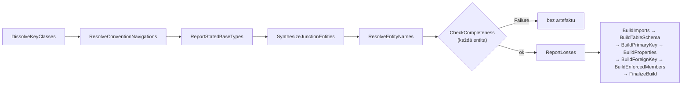
```mermaid
flowchart LR
  A[DissolveKeyClasses] --> B[ResolveConventionNavigations]
  B --> C[ReportStatedBaseTypes]
  C --> D[SynthesizeJunctionEntities]
  D --> E[ResolveEntityNames]
  E --> F{"CheckCompleteness<br/>(každá entita)"}
  F -->|Failure| X["bez artefaktu"]
  F -->|ok| G[ReportLosses]
  G --> H["BuildImports → BuildTableSchema<br/>→ BuildPrimaryKey → BuildProperties<br/>→ BuildForeignKey → BuildEnforcedMembers<br/>→ FinalizeBuild"]
```

- Brána `CheckCompleteness` odmítne entitu bez vyžadované kategorie, s vlastností bez jazykového typu, s klíčem i jeho popřením nebo s nepersistovanou částí klíče.
- Sedm kroků je `protected abstract (EntityMap, EntityArtifact)`; `FinalizeBuild` vrací výstupy. `EntityArtifact` drží `Code`, `Mapping` a `ClassOpened`; NHibernate plní oba.
- Klíč se píše před vlastnostmi, v pořadí klíče. Prázdné kroky: Dapper `BuildPrimaryKey`, `BuildForeignKey`, `BuildEnforcedMembers`; EF Core `BuildEnforcedMembers`.

#### Dotazový builder

**Naplnění** je fluentní: `From`, `Project`, `Where(ConditionNode)`, `Join(JoinKind, left, right, ConditionNode, alias?)`, `GroupBy`, `OrderBy`, `Having`, `Paginate`, `Distinct`, `SetOperation`, `Push()`/`Pop()` (`Pop()` obalí rozsah do `SubQueryInstruction`) a `PopOperand()` pro poddotaz v operandu (rozh. [061](./decisions/061-subquery-as-a-condition-operand.md)). `SetOperation` bere za levý operand poslední uzavřený poddotaz nebo operaci a dokončí ji `Pop` na zapamatované hloubce. `Define(name, body)` zapisuje mezivýsledek mimo zásobník (rozh. [112](./decisions/112-a-query-as-a-row-source-is-a-named-intermediate-result.md)). Virtuální `MethodArtifact` (`CSharpQuery`/`JavaQuery`), `MethodName` a `QueryName`.

**Generování** je šablonová metoda (rozh. [023](./decisions/023-query-builder-template-method.md)):

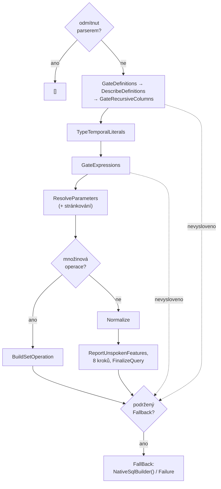
```mermaid
flowchart TD
  R{"odmítnut<br/>parserem?"} -->|ano| E0["[]"]
  R -->|ne| D["GateDefinitions → DescribeDefinitions<br/>→ GateRecursiveColumns"]
  D --> T[TypeTemporalLiterals]
  T --> X[GateExpressions]
  X --> P["ResolveParameters<br/>(+ stránkování)"]
  P --> S{"množinová<br/>operace?"}
  S -->|ano| SO[BuildSetOperation]
  S -->|ne| N[Normalize]
  N --> C["ReportUnspokenFeatures,<br/>8 kroků, FinalizeQuery"]
  SO --> U{"podržený<br/>Fallback?"}
  C --> U
  D -.->|nevysloveno| U
  X -.->|nevysloveno| U
  U -->|ano| FB["FallBack:<br/>NativeSqlBuilder() / Failure"]
```

| Krok | Drží | Záznam |
|---|---|---|
| `GateDefinitions` | jméno jedno na dotaz, žádný dopředný ani laterální odkaz, pojmenované sloupce; rekurzivní definice podle rekurzivního `WITH` SQL Serveru; cíl bez mezivýsledku či rekurze ukončí pokus; limit bez rekurze → `Convention` | `Failure` `IntermediateResult` |
| `GateRecursiveColumns` | sloupce rekurzivního členu proti kotvě (počet, skalár); `COUNT` je `Long`, takže odmítne i člen, který by SQL Server přijal | `Failure` `IntermediateResult` |
| `TypeTemporalLiterals` | řetězec ISO 8601 u časového sloupce či poddotazu → časový skalár | `Failure` `Filtering` |
| `GateExpressions` | skalár výrazů (`ExpressionTyping`, rozh. [107](./decisions/107-an-expression-is-the-sixth-operand-shape-and-stands-wherever-an-operand-stands.md)); `+` bez typované strany, nesjednotitelné strany, agregát nad agregátem, okenní funkce mimo projekci; funkce, kterou deskriptor cíle neuvádí v `Functions`, a okenní funkce, agregace do seznamu či klíč-výraz, které cíl nevysloví, ukončí pokus (`ReportUnspoken`) | `Failure` `Expression` (`WindowFunction`, `ListAggregation`); nevyslovené → `Fallback`, bez `NativeSqlApi` `Failure` |
| `ResolveParameters` | skalár z druhé strany porovnání, vazba jen přes uvedené mapování (`EntityFor`) | `Failure` `QueryParameter`: skalár neodvozen, dva skaláry jednoho názvu, pojmenovaný s pozičním, seznam i hodnota, jméno není identifikátor |
| `Normalize` | `QueryClauses`, Q2, Q4, Q8, pravidlo seskupení (`GroupingRuleHolds`), `DISTINCT`, vykreslitelnost stromů (rozh. [053](./decisions/053-a-query-that-would-return-other-rows-is-not-emitted.md)) | `Failure` |

**Parametry** (rozh. [083](./decisions/083-parameter-as-the-fifth-operand-shape.md)) se řeší jednou nad celým tělem, takže signatura nezávisí na pořadí skládání (S2). Skalár dává sloupec, `COUNT` (`Long`), vzorek `Like` (`String`), konstanta i jediná projekce poddotazu, v nenulovatelném tvaru; uvedený skalár (MyBatis) má přednost, rozdíl je `Conflict`. Výsledkem je `Parameters` v pořadí prvního výskytu. Stránkování (rozh. [085](./decisions/085-a-row-count-is-a-number-or-a-parameter.md)): skalár `Int`, offset před limitem; širší celočíselný uvedený skalár je `Loss`, neceločíselný `Failure`. Název jen pro počet řádků jde do `BoundParameters` (`WritesRowCountsIntoQueryText`).

**`CatalogDemand()`** (rozh. [105](./decisions/105-a-query-formulates-its-own-demand-on-the-catalog.md)) vrací `QueryTableDemand` tabulek, ze kterých se typuje parametr a které mapování neváže (§5.2).

**Kroky** běží v pořadí relačního vyhodnocení: `BuildSource → BuildJoins → BuildFilter → BuildGrouping → BuildPostFilter → BuildOrdering → BuildProjection → BuildPagination`. Každý píše do přihrádky `QueryArtifact` a `FinalizeQuery` je skládá v pořadí cíle; přihrádka stránkování může nést volání API (NHibernate `SetFirstResult`/`SetMaxResults`). `DISTINCT` píše `BuildProjection`. Výchozí `BuildSetOperation` hlásí nevyslovenou konstrukci; cíle s množinovými operacemi ho přepisují.

**Úniková cesta** (rozh. [113](./decisions/113-native-sql-as-the-escape-path-and-the-vocabulary-ldbc-needs.md)): `ReportUnspoken(reason, feature)` podrží záznam `Fallback`. `FallBack` bez `Descriptor.NativeSqlApi` vydá `Failure`; jinak zahodí záznamy pokusu a postaví `NativeSqlBuilder()` (přepisují `EFCoreLinqQueryBuilder`, `NHibernateHqlQueryBuilder`, `AbstractJpaQueryBuilder`), potomka `AbstractSqlQueryBuilder`, a předá mu instrukce, definice, mapy a jméno dotazu pod `writesNativeSql`. Samostatné `BuildSQL()` neexistuje (rozh. [022](./decisions/022-native-query-syntax-in-builders.md)).

`IQueryVisitor` nemá `Visit(SubQueryInstruction)`: poddotaz vykresluje builder přes delegáta.

## 8. Advisor – implementační detaily

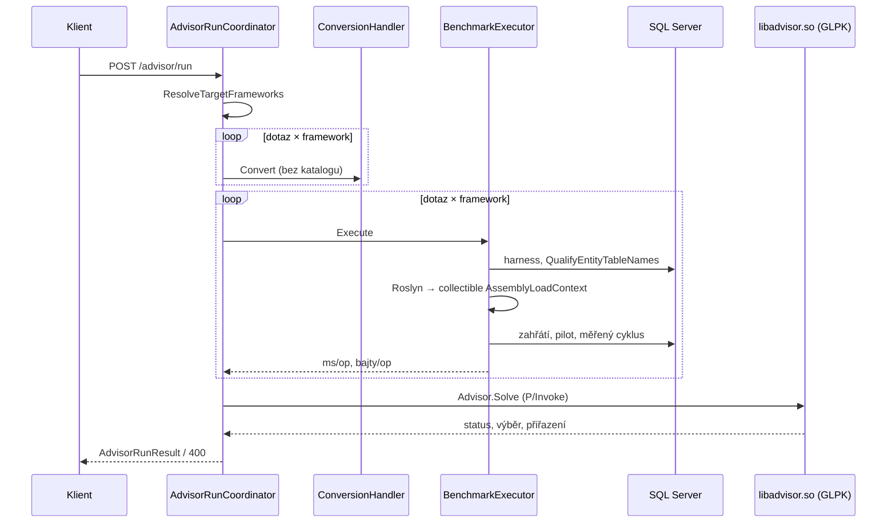
```mermaid
sequenceDiagram
  participant K as Klient
  participant C as AdvisorRunCoordinator
  participant H as ConversionHandler
  participant B as BenchmarkExecutor
  participant DB as SQL Server
  participant G as libadvisor.so (GLPK)
  K->>C: POST /advisor/run
  C->>C: ResolveTargetFrameworks
  loop dotaz × framework
    C->>H: Convert (bez katalogu)
  end
  loop dotaz × framework
    C->>B: Execute
    B->>DB: harness, QualifyEntityTableNames
    B->>B: Roslyn → collectible AssemblyLoadContext
    B->>DB: zahřátí, pilot, měřený cyklus
    B-->>C: ms/op, bajty/op
  end
  C->>G: Advisor.Solve (P/Invoke)
  G-->>C: status, výběr, přiřazení
  C-->>K: AdvisorRunResult / 400
```

**ILP model** (`Advisor/ilp.c`, přímo GLPK C API): binární $x_{q,f}$ (dotaz $q$ na framework $f$) a $y_f$ (výběr).

- účel: $\min \sum_{q,f} z_q \, c_{q,f} \, x_{q,f}$, kde $c$ je průměrná doba (ms) a $z_q$ váha dotazu (nejméně 1);
- (1) $\sum_f y_f \le N$; (2) $\sum_f x_{q,f} = 1$; (3) $x_{q,f} \le y_f$; (4) $\sum_{q,f} m_{q,f} \, x_{q,f} \le MEM$ (alokace v bajtech).

Řeší `glp_intopt()` s presolverem. `[LibraryImport("libadvisor.so")]` znamená, že knihovna vzniká jen v Docker stage `advisor-native` (gcc + `libglpk-dev`); verze pro Windows není (rozh. [076](./decisions/076-java-wrappers-in-csharp-jvm-in-containers.md)).

| Koncový bod | Co dělá | Neúspěch |
|---|---|---|
| `POST /advisor/run` | přeloží, zkompiluje, změří, řeší ILP | status ≠ 0 → 400 `ProblemDetails` „Advisor solver failed with status code {status}." |
| `POST /advisor-test` | volá ILP přímo (`Memory`, `Cost`, `Z`, `MEM`, `N`, `Q`, `F`); diagnostika, nic ho nevolá | 200 se `status`, výstupní pole nepřepsaná (nuly) |

Bez `libadvisor.so` oba vracejí hlášku z P/Invoke.

**Běh:**

- Měří jen Dapper a EF Core (`SupportedFrameworks`); NHibernate z `KnownFrameworks` vypadne bez záznamu i na výslovné vyžádání.
- Překlad (`BuildTranslations`) běží bez katalogu, stav `NotConfigured`. Měření vyžaduje `ConnectionStrings:AdvisorDatabase` a drží jeden `CachingCatalogReader` na běh.
- `BenchmarkExecutor`: 2 zahřívací iterace, pilot, pak 3–20 iterací (cíl ~500 ms). Výsledek je `MeanDurationMilliseconds` a `AllocatedBytes` na operaci.
- Odpověď nese výběr, přiřazení, měření a `translations`, tedy změřené artefakty (rozh. [059](./decisions/059-advisor-response-carries-the-measured-translations.md)).
- Paměťový strop `MaxMemoryBytes <= 0` znamená `long.MaxValue`.

**Známá omezení:**

- Parametrizovaný dotaz se nezměří: `EFCoreBenchmarkHarnessBuilder` hledá metodu s jediným parametrem `DbContext` („EF Core query method not found").
- Z jednotky s více dotazy se změří jediný (Dapper první `SqlQuery`, EF Core první metoda).
- Neřešitelná úloha (strop `MEM` pod nejúspornějším přiřazením, `N = 0`) i porucha GLPK vracejí `ilp_solve` = −1, kód GLPK se ztrácí. Obrazovka drží `N` ≥ 1, `/advisor-test` meze nekontroluje. Hláška `No feasible solution found.` se hned vyprázdní (`fflush(stdout)`), takže v `docker compose logs` stojí včas vedle logu GLPK `PROBLEM HAS NO PRIMAL FEASIBLE SOLUTION`.
- Celý Advisor je vyňatý ze záruk (§9, oblast 1) a nemá test.

## 9. Co tahle verze nárokuje a co je vyňaté ze záruk

**Kanonické znění nároku je sekce *Guarantees* kořenového [`README.md`](../README.md)**; tady je totéž česky s odkazy na důvody a na rozpor platí README. Důkazy vede [`traceability.md`](./traceability.md), konstrukce [`subset.md`](./subset.md), zbývající práci [`open-items.md`](./open-items.md), výchozí stav [`baseline.md`](./baseline.md). Hranici stanovilo rozh. [030](./decisions/030-scope-of-version-1-0.md) a posunulo [039](./decisions/039-container-configuration-of-the-environment.md).

**Verze.** Číslo nese jen `Directory.Build.props` (rozh. [034](./decisions/034-central-version-management.md)), význam mu dává rozh. [098](./decisions/098-the-number-is-decided-once-per-release.md) (nahradilo [069](./decisions/069-major-marks-a-milestone-not-a-break.md)). Nárok popisuje `main`; vydání ho zmrazí s číslem, změny po vydání se sem zapisují hned. Poslední vydání **`2.0.0`** zavřelo javový ekosystém, příští MAJOR **`3.0.0`** patří Advisoru nad všemi frameworky a experimentům (F15, T1–T7). Co vydání změnilo, nese anotace značky (`git tag -n99`).

### Co verze nárokuje

**Překlad dotazů je hotový v rozsahu katalogu** (F7–F10, F13): žádný dotazový parser nevynechá konstrukci, kterou zná, beze slova; každá konstrukce slovníku je vymezená rozhodnutím — nese se ve všech směrech, nebo je její odmítnutí, ztráta či zápis nativním SQL rozhodnuté a zapsané, ne zděděné z toho, že na ni nedošlo; podmnožina i se všemi případy bez úplného nebo jednoznačného překladu stojí celá v [`subset.md`](./subset.md).

| Požadavek | Stav | Co přesně se tvrdí | Zúžení |
|---|---|---|---|
| F1–F6 | nárokované | komplexní identifikátory v IR i ve frameworcích, cizí klíče na složené klíče, čtení katalogu, slučování zdrojů, úplné mapování z neúplného vstupu | — |
| F7, F8, F9 | nárokované v užším rozsahu | Hibernate, MyBatis, EclipseLink: kritérium doložené celé — 20 testů entit a 15 dotazů v xUnit (F9 i 7 překladů mezi implementacemi JPA); javová sada artefakty přeloží `javac`em, předloží frameworku a jeden spustí proti SQL Serveru, ve třech zdrojových směrech (§6.2) | tři frameworky, ne javový ekosystém (jiný javový ORM); vztahy v rozsahu IR (§4.3), dědičnost, komponenty a spojené tabulky vyňaté i v Javě (oblast 2) |
| F8 | | | **dynamický příkaz** (`<select>` s `<if>`, `<choose>`, `<bind>`) je rodina příkazů s různými řádky, IR ji nenese a jeden člen ji nezastoupí → `Failure` se jménem značky; kanonický `<foreach>` je kolekční parametr a překládá se. Jediné místo, kde je MyBatis jako zdroj výrazně chudší (rozh. [084](./decisions/084-mybatis-wrapper-over-the-shared-sql-reading.md)) |
| F9 | | | **líné načtení reference** se netvrdí: `fetch = LAZY` na `@ManyToOne` a `@OneToOne` je bez weavingu tiše eager (fakt o nasazení), IR strategii načítání nenese, artefakt ji nevyslovuje a zdroj, který ji vyslovil, dostane záznam (rozh. [076](./decisions/076-java-wrappers-in-csharp-jvm-in-containers.md), [080](./decisions/080-eclipselink-as-the-second-profile-over-the-jpa-layer.md)) |
| F10 | nárokované | překlad scénáře přes hranici vyslovenou deskriptorem a end-to-end scénář dovedený k běhu proti databázi (rozh. [090](./decisions/090-the-cross-ecosystem-matrix-counts-itself.md)); sada tvrdí nejméně 30 překladů přes hranici a scénář v každé ze čtyř uspořádaných dvojic ekosystémů | — |
| F11 | nárokované v užším rozsahu | za běhu kontrola úplnosti IR před generováním a strukturovaná diagnostika každého převodu (§5.1) — ověřovací kritérium F11 | syntaktickou správnost souborů ověřují testy (stupně rozh. [016](./decisions/016-generated-artifact-verification-levels.md)), ne `/convert`: překladová cesta cizí kód nekompiluje (2. věta S4) |
| F12 | nárokované | javová sada; integrační test = běh proti databázi (rozh. [087](./decisions/087-an-integration-test-is-a-run-against-the-database.md)), obě meze kritéria tvrdí `SuiteSizeTest` | — |
| F13 | nárokované v užším rozsahu | 4. stupeň nad dotazem: obě varianty proti jednomu kanonickému výsledku v repozitáři (rozh. [089](./decisions/089-differential-verification-as-the-fourth-level-over-a-query.md)); 6 vlastních dotazů a 40 kategorií T2, 1105 dvojic (73 s nativním SQL), zdrojem všech šest frameworků, negativní polovina 5 mutací artefaktu; kritérium hlídají sady samy | „konfigurovatelná" přesnost a null jen z poloviny: měřítko a platné číslice volí matice u dotazu (`decimalScale`, `floatDigits`), null je vždy holé `NULL` — jednoznačné (řetězec je v uvozovkách), ale pevné, aby se shodly dvě sady ve dvou jazycích |
| F14 | nárokované v užším rozsahu | vícesouborový vstup, výstup po souborech; jednotka je celý zdrojový soubor (rozh. [111](./decisions/111-a-unit-is-a-whole-source-file-that-declares-only-its-language.md)): framework z něj čte entity i každé předání dotazu a nevzatou třídu jmenuje záznamem; dokument, který je mapováním i dotazem (`<query>` v `hbm.xml`), projde oběma průchody (rozh. [081](./decisions/081-a-unit-may-be-a-mapping-and-a-query-at-once.md)) | záznam ze čtení jednotky na ni ukazuje polem `unit` (jméno, nebo `unit N`; rozh. [066](./decisions/066-records-attributed-to-the-input-unit.md)), dotaz polem `query`; záznamy doplnění a generování nesou jen entitu a vlastnost, protože entitu smí vyslovit víc jednotek, i téhož jazyka (rozh. [094](./decisions/094-entity-identity-inside-a-conversion.md): týž jmenný prostor a název dá jeden artefakt); výstupní artefakty jméno nenesou (otevřená položka); kód, který dotaz sám nepředává (služba, DTO projekce), se čte jako entita; nenárokuje se procházení repozitáře, archiv projektu ani zobrazení IR |
| F15 | vyňaté | — | oblast 1 |
| S1–S3 | nárokované | modulární rozšiřitelnost, determinismus, výkon překladu ([README](../ORMConvertor/README.md#translation-performance-s3)) | — |
| S4 | 1. věta vyňatá, 2. nárokovaná | předávaný artefakt nenese přihlašovací údaje (§5) | izolace spouštění: oblast 1 |
| S5 | nárokované v užším rozsahu | kontejnery pro systém, databázi, .NET i javovou sadu (`java-tests`, `java_tests`, job `java-test`) a instanci `test_app`, proti které javová sada překládá (rozh. [078](./decisions/078-java-suite-as-a-client-of-a-running-instance.md)); každou sadu reprodukuje jeden příkaz tam, kde je jen Docker ([README](../ORMConvertor/README.md#tests)) | experimentální pipeline neexistuje (oblast 6) |
| S6 | nárokované | identifikátor běhu a záznam včetně verzí (§5.1) | — |
| S7 | nárokované v užším rozsahu | nečitelný text jednotky je ve všech jazycích záznam o jednotce, ne čtyřistovka (rozh. [093](./decisions/093-unreadable-input-is-a-unit-failure.md)), s řádkem a sloupcem u SQL, Javy, HQL, JPQL a XML | validace na klientovi (prázdný vstup, typ mimo nabídku, XML přes `DOMParser`; C# a SQL ne, rozh. [033](./decisions/033-shape-of-the-static-frontend-screens.md)) je pomocník, ne brána; **C#** pozici nedostane (Roslyn ji zná, parser se neptá; otevřená položka), takže chyba na úrovni souboru a řádku platí pro všechny jazyky kromě C#; záznamy překladu se vážou k jednotce, vzešly-li z jejího čtení, jinak k entitě |
| T1–T7 | vyňaté | — | oblast 6 (T7 i oblast 1) |

**Javový nárok stojí na běhu v zafixovaném prostředí.** F7–F10, F12 a F13 vstoupily do nároku až zeleným během obou sad (profil `test` v compose, Maven s Temurinem 25, SQL Server 2022, bez selhání a přeskočení); počty a commit nese [README](../ORMConvertor/README.md#how-large-the-suite-is-and-what-it-covers) (rozh. [095](./decisions/095-a-dated-run-record-names-its-commit.md)).

### Hranice záruk

Vyňaté oblasti jsou čtyři a vyjímají se vcelku (rozh. 030). Vyňato neznamená chybějící: oblast smí v repozitáři být a běžet, verze na ni jen neslibuje spoleh a vstup, který na ni sáhne, dostane záznam. Vedle oblastí stojí zúžení výš a vyslovené meze uvnitř nároku; všechny tři druhy vede [`subset.md`](./subset.md). Čísla 3 a 4 (oblasti vystoupily) se nepřidělují znovu.

| # | Oblast | Co platí | Rozh. |
|---|---|---|---|
| 1 | **Benchmarking a Advisor** | bez testu; `HarnessGenerationUtilities` stojí na tvaru generovaného textu, nativní knihovna se staví jen v Dockeru (§8). Nenárokuje se F15, T7 ani 1. věta S4 — jediné místo, kde nástroj kompiluje a spouští cizí kód. Bez `libadvisor.so` vrací `AdvisorRunHandler` hlášku, ne pětistovku | [029](./decisions/029-database-connection-is-the-consumer-projects-fact.md) |
| 2 | **Dědičnost, komponenty, spojené tabulky** | NHibernate `<subclass>`, `<joined-subclass>`, `<union-subclass>`, `<component>`, `<join>` a další prvky mimo plochou třídu (`<natural-id>`, `<idbag>`, `<array>`) → `Loss` u každého; týž záznam dostane C# třída odvozená od jiné entity převodu (EF Core: table per hierarchy), JPA `@Inheritance` i holé `extends` mezi dvěma `@Entity`; `@MappedSuperclass` má záznam vlastní (třída není entita, dědící entity její pole nedostanou). Co dědičnost znamená pro IR, zodpovězené není | 030, [048](./decisions/048-a-fact-with-no-place-in-the-model-is-a-loss.md) |
| 3 | *vystoupila:* poddotazy | poddotaz v podmínce se překládá, tvar, který cíl věrně nevyjádří, odmítá `Failure`; množinové operace a stránkování vystoupily dřív | [061](./decisions/061-subquery-as-a-condition-operand.md), [060](./decisions/060-pagination-as-a-query-instruction.md) |
| 4 | *vystoupila:* round-trip NHibernate → NHibernate | holé HQL čte vlastní parser, převod vrací týž text | [062](./decisions/062-hql-read-by-a-hand-written-parser.md) |
| 5 | **Databázový dialekt** | jediný je SQL Server 2022, **deklarovaný** deskriptorem cíle a vydaný záznamem běhu; kde typový slovník NHibernatu tvrzení neunese, píše doslovný typ dialektu (`sql-type`). Souměrně: deklarace jiného systému ve zdroji zastaví čtení doslovného SQL (dotaz se nevydá, typ sloupce se nepřečte, obojí se záznamem) a záznam běhu nese i dialekt zdroje; fakta z katalogu takový zdroj dostane s jediným záznamem o rozporu (§5.2). Patří sem `CHECK` a výchozí hodnota sloupce (`Loss`, jako neunikátní index), ne unikátní omezení, které IR nese a oba anotační cíle píšou. Druhý dialekt je otevřená položka | [086](./decisions/086-target-database-dialect-declared-by-the-descriptor.md), [088](./decisions/088-a-declared-foreign-source-dialect-is-not-read.md), [091](./decisions/091-the-catalog-completes-a-foreign-source-and-says-so.md), [055](./decisions/055-unique-constraint-as-a-carried-mapping-fact.md) |
| 6 | **Experimentální část zadání** | T1–T7 se netvrdí, experimentální pipeline neexistuje. Javový ekosystém (F7–F10, F12, F13) z oblasti vyšel celý | 078, 080, 084, 087, 089, 090 |

### Rozsah implementace ve zkratce

Šest frameworků, tři .NET a tři javové; konstrukci po konstrukci vede [`subset.md`](./subset.md) (1.x co se čte a píše, 2.x meze). Rozhodnutí jsou tu jen čísla, odkazy nese subset.

| Oblast | Co je implementované | Meze (subset) |
|---|---|---|
| Směry | 36 z `ORMEnum`, 18 napříč ekosystémy; každý vydá dotazový artefakt, žádný dotaz se neztratí mlčky (`Combined/QueryMatrixTest`) | dotaz s jinými řádky se nevydá (070; 2.12) |
| Javové frameworky | Hibernate (077) a EclipseLink (080) nad vrstvou JPA: čtou anotace a `orm.xml`, píšou anotace, JPQL oběma směry; MyBatis (084) bez vrstvy frameworku | F7–F9 výš |
| Kategorie (T2) | 40 tvarů nad doménou sedmi entit (projekce, filtrace, join, agregace, řazení, stránkování, poddotazy, množinové operace a další) každým směrem, který zdroj vysloví (`Combined/QueryShapeMatrixTest`, manifest `Tests/Database/QueryShapes/categories.txt`); každá i na 4. stupni, javové cíle na 2. a 3. (`shapes/QueryCategoryTest`); záměrně špatný dotaz 6 × 6 (`Combined/DeeplyNestedQueryTest`) | 1.3–1.4; parametr zdroje Dapper se typuje jen s katalogem (105, 106) |
| Parametry, výrazy | parametr jako pátý tvar operandu (083, 085, 102), výraz jako šestý (107): aritmetika, konkatenace, 17 funkcí slovníku, `CASE`, všude, kde stojí operand; konstanta pod aliasem v projekci | 2.4, 2.8 — mj. funkce mimo slovník (`CONVERT`, `LEFT`, `SYSDATETIME()` …), `+` bez typované strany, agregát nad agregátem, výraz v projekci bez aliasu |
| Mezivýsledek, rekurze | `WITH` a odvozená tabulka (112), rekurze s `OPTION (MAXRECURSION n)` (113) | 2.10 — mj. laterální odkaz, pravidla rekurzivního `WITH` SQL Serveru, `COUNT` přičítaný ke konstantní kotvě (model `Long`, T-SQL `int`); mez hloubky je obsah dotazu |
| Seskupení, okna, seznamy | seskupení podle výrazu, `ROW_NUMBER`, `RANK`, `DENSE_RANK` v projekci, `STRING_AGG`, `DateAdd`, `DateDiff`, `Round`, `Sqrt`, `Cast` (113); zápis cíle až po sondě proti připnuté verzi | okenní agregát, rámec okna a okno bez řazení se nečtou, okenní funkce mimo projekci se odmítá; převod s délkou či mimo pět typů, jednotka data mimo rok až sekundu, `ROUND` se třemi argumenty a nedoslovný oddělovač se nečtou, `string.Join` jen nad prvky skupiny; co cíl vysloví jen jinak, jde nativním SQL (2.8–2.9) |
| Join nad rámec rovností | EF Core filtrem spojované posloupnosti nebo korelovaným `SelectMany`, čte se zpět do `ON` | pravý a plný → nativní SQL, `GroupJoin` se nečte (2.6) |
| Úniková cesta | EF Core, NHibernate, Hibernate a EclipseLink píšou, co jejich jazyk nevysloví, celým dotazem v nativním SQL deklarovaného dialektu, vždy se záznamem `Fallback`, a měří se na 4. stupni; Dapper a MyBatis ji nemají. Nativní SQL předané v kódu se čte zpět jako týž dotaz | odmítá se kolekční parametr (EF Core, EclipseLink), množinová operace nad dvěma entitami, kde API materializuje jednu, LINQ nad nativním SQL a dotaz skládaný za běhu (1.2, 2.3, 2.11) |
| Katalog | `ColumnPairs` mezi entitami i z katalogu (015, §5.2); bez připojení konvence se záznamem; dotaz poptává vazbu tabulky jednou dávkou za převod (105) | — |
| Typy | `LangType` (014), rodiny `DatabaseType` s facetami (019) | — |
| Advisor | jen Dapper a EF Core | oblast 1 |
