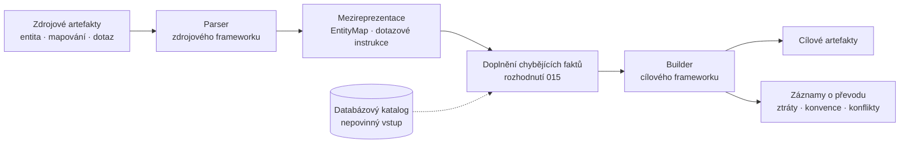

# Architektura aplikace – současný stav

**Účel:** referenční popis architektury tak, jak je dnes implementovaná, nezávisle na akademickém textu diplomky, ze které projekt vzešel. Odpovídá na otázku „jak to teď funguje"; proč jsme co zvolili, je v [`decisions/`](./decisions/README.md), co zbývá udělat, v [`open-items.md`](./open-items.md).
**Zdroj faktů:** vlastní čtení zdrojového kódu + kapitola *Architecture and Implementation* z původní diplomky (fakta přepsaná vlastními slovy, ne citace). Naposledy ověřeno proti kódu: 2026-09-21.

---

## Obsah

| Kapitola | O čem je |
|---|---|
| [1. Přehled](#1-přehled) | Co aplikace dělá, zafixované verze frameworků a verze nástroje. |
| [2. Struktura řešení (.NET solution)](#2-struktura-řešení-net-solution) | Jednadvacet projektů a zodpovědnost každého z nich. |
| [3. Použité návrhové vzory](#3-použité-návrhové-vzory) | Adapter, Visitor, Builder, Factory — kde na ně v pipeline narazíte. |
| [4. Mezireprezentace](#4-mezireprezentace) | Datový model: entity a mapování (4.1), primární klíč (4.2), vztahy (4.3), dotazové instrukce a podmínkový strom (4.4). |
| [5. Parsery a buildery – jak fungují dnes](#5-parsery-a-buildery--jak-fungují-dnes) | Chování po frameworcích, priorita zdrojů, diagnostika převodu (5.1) a doplňování faktů z katalogu (5.2). |
| [6. Ověření artefaktů, frontend a rozhraní](#6-ověření-artefaktů-frontend-a-rozhraní) | Stupně ověření generovaných artefaktů (6.2), frontend (6.3), rozhraní REST a dokument OpenAPI (6.5); spuštění, nasazení a testovací prostředí nese `ORMConvertor/README.md`. |
| [7. Rozhraní parserů a builderů](#7-rozhraní-parserů-a-builderů) | Co abstraktní buildery nabízejí wrapperům a šablonový `Build()` obou větví. |
| [8. Advisor – implementační detaily](#8-advisor--implementační-detaily) | ILP model v GLPK, P/Invoke na `libadvisor.so`, dva koncové body Advisoru a chování při neřešitelné úloze. |
| [9. Co tahle verze nárokuje a co je vyňaté ze záruk](#9-co-tahle-verze-nárokuje-a-co-je-vyňaté-ze-záruk) | Nárok verze, hranice záruk a rozsah implementace ve zkratce. |

### Pohledy a jejich adresáti

Kapitoly nejsou jen kusy textu za sebou — každá odpovídá na zájem někoho jiného, a když se to nevysloví, čte se dokument jako jeden nerozlišený celek (ISO/IEC/IEEE 42010 tomu říká *pohledy*):

| Zájem | Kdo se ptá | Kde je odpověď |
|---|---|---|
| Z čeho se systém skládá a co smí na čem záviset | ten, kdo přidává framework nebo sahá na mezireprezentaci | **modulový pohled** — §2, §3, §4, §7 |
| Co se s daty děje za běhu jednoho převodu | ten, kdo hledá, kde se ztratil fakt | **běhový pohled** — §5 včetně diagnostiky (§5.1) a doplňování z katalogu (§5.2) |
| Kde to běží, s čím a jak se to spustí | ten, kdo instanci nasazuje nebo reprodukuje testy | **nasazovací pohled** — [`ORMConvertor/README.md`](../ORMConvertor/README.md), který nese příkazy i důvody voleb (rozhodnutí 058); §6 na něj odkazuje a sám drží, co popisuje nástroj, ne jeho provoz |
| Co si na to smím vsadit | uživatel a oponent | **hranice záruk** — kanonicky anglická sekce v kořenovém [`README.md`](../README.md), česky a s odůvodněním §9, a k ní [`traceability.md`](./traceability.md) |
| Přeloží se tahle konstrukce, a když ne, co se s ní stane | uživatel před překladem, oponent | **katalog podmnožiny** — [`subset.md`](./subset.md), konstrukce po konstrukci s odkazy sem a do rozhodnutí; samostatně, protože se do §5 nevejde |
| Čemu je nástroj vystavený | ten, kdo instanci vystaví ven | [`threat-model.md`](./threat-model.md) |

## 1. Přehled

Aplikace překládá entity, mapování a dotazy mezi třemi .NET ORM frameworky – Dapper, NHibernate a EF Core – a od rozhodnutí [077](./decisions/077-hibernate-wrapper-over-the-shared-jpa-layer.md) i mezi třemi javovými: Hibernate a od rozhodnutí [080](./decisions/080-eclipselink-as-the-second-profile-over-the-jpa-layer.md) EclipseLink, oba jako tenké profily nad jednou sdílenou vrstvou Jakarta Persistence, a od rozhodnutí [084](./decisions/084-mybatis-wrapper-over-the-shared-sql-reading.md) MyBatis, který na žádné vrstvě frameworku nestojí, protože není implementací žádné specifikace — jeho wrapper stojí nad dvěma vrstvami *jazyka*. Vše přes společnou frameworko-nezávislou mezireprezentaci. Pipeline má dvě fáze: parser převede zdrojový kód do mezireprezentace, builder z ní vygeneruje kód pro cílový framework. Nad tím běží ještě Advisor – optimalizační modul, který pro danou sadu dotazů doporučí nejvhodnější framework (nebo kombinaci frameworků) na základě reálně naměřeného výkonu.


```mermaid
flowchart LR
    S["Zdrojové artefakty<br/>entita · mapování · dotaz"] --> P["Parser<br/>zdrojového frameworku"]
    P --> IR["Mezireprezentace<br/>EntityMap · dotazové instrukce"]
    IR --> C["Doplnění chybějících faktů<br/>rozhodnutí 015"]
    KAT[("Databázový katalog<br/>nepovinný vstup")] -.-> C
    C --> B["Builder<br/>cílového frameworku"]
    B --> A["Cílové artefakty"]
    B --> Z["Záznamy o převodu<br/>ztráty · konvence · konflikty"]
```

Nakreslené diagramy leží v `diagrams/` jako soubory [draw.io](https://www.drawio.com/) — `thesis_diagrams.drawio`, `design_notes_diagrams.drawio` a `advisor.drawio` — a slouží textu práce. Zdrojem pravdy o dnešním chování zůstává tenhle dokument; diagram je obraz ke dni, kdy vznikl. **U těchhle tří je ten den z července 2025**, tedy z původního prototypu a před všemi rozhodnutími v [`decisions/`](./decisions/README.md); ve forku se žádný z nich nezměnil. Číst je jako obraz dnešního stavu tedy nelze.

### Zafixované verze

Veškerá tvrzení o chování frameworků v tomto dokumentu i v `docs/analysis/` platí proti těmto verzím. Tabulka je jejich kanonické místo; audity uvádějí verze jen jako snímek k datu svého vzniku. Proč právě tyhle, říká rozhodnutí [013](./decisions/013-target-framework-versions.md). Verze se od zavedení centrální správy (rozhodnutí [034](./decisions/034-central-version-management.md)) píší jediným místem v adresáři řešení: .NET řádky tabulky se čtou jako záznam toho, co nese `ORMConvertor/Directory.Packages.props` — soubor jmenuje **všechny** přímo referencované balíčky, tabulka z nich jen ty, o jejichž chování něco tvrdíme; kolik jich je, se tady schválně nepíše, aby dvě místa nemusela počítat stejně —, řádek „.NET 10" nesou `Directory.Build.props` (`TargetFramework`) a `global.json` (pásmo SDK `10.0.100` s `rollForward: latestFeature`). Soubory `.csproj` žádné číslo verze neobsahují a lokální přebití je vypnuté (`CentralPackageVersionOverrideEnabled`).

Vedle cizích verzí nese `Directory.Build.props` i **verzi samotného nástroje** — `<Version>`, jedním zápisem pro všechna sestavení řešení. **Tohle je jediné místo, kde se číslo verze píše jako současný stav**; jinam se neopisuje, aby dvě místa netvrdila každé jiné číslo — nadpisy ani text nároku ho proto nenesou a strojově čitelným protějškem je jen pole `version` v [`CITATION.cff`](../CITATION.cff), které se posouvá při vydání (rozhodnutí [098](./decisions/098-the-number-is-decided-once-per-release.md)). Odsud ji čte `ToolRelease.Version` a vydává v záznamu běhu (§5.1); tabulka níž ji neuvádí, protože není tvrzením o cizím frameworku. Právě kvůli ní má `ecosystem.config.js` blok, který vyprazdňuje proměnnou prostředí `Version` — zděděná proměnná by se uvnitř `dotnet run` povýšila na vlastnost MSBuildu a verzi sestavení by přepsala (viz [`README`](../ORMConvertor/README.md#pm2)).

| Komponenta | Verze |
|---|---|
| .NET | 10 (`net10.0`) |
| NHibernate | 5.7.0 |
| Microsoft.EntityFrameworkCore(.SqlServer) | 10.0.10 |
| Dapper | 2.1.79 |
| Microsoft.Data.SqlClient | 7.0.2 |
| Microsoft.CodeAnalysis.CSharp (Roslyn) | 5.6.0 |
| Microsoft.SqlServer.TransactSql.ScriptDom | 180.78.1 (gramatika `TSql160Parser`) |
| xUnit | v3 (3.2.2) |
| JDK | 25 (LTS) |
| Jakarta Persistence | 3.2 |
| Hibernate ORM | 7.4.5.Final |
| EclipseLink | 5.0.0 |
| MyBatis | 3.5.19 |
| `mssql-jdbc` | 13.4.0.jre11 |
| Maven a JDK javové sady (obraz stupně `java-tests`) | `maven:3.9.11-eclipse-temurin-25-noble` — Maven 3.9.11, Temurin 25 |
| JUnit (javová sada) | 6.1.3 (Jupiter, Surefire 3.6.0) |
| Jackson (javová sada) | 2.22.2 (`jackson-databind`) |
| SQL Server | 2022 |
| Pico CSS (vendorovaná ve `wwwroot/vendor/`) | 2.1.1 (classless) |
| highlight.js (vendorovaná ve `wwwroot/vendor/`) | 11.12.0 (jádro + gramatiky C#, XML, SQL) |

Verze tří .NET ORM nese vedle téhle tabulky i deskriptor příslušného wrapperu (`TargetFrameworkDescriptor.Version`, rozhodnutí [013](./decisions/013-target-framework-versions.md)). Je to jediné místo, ze kterého se verze vydává za běhu — záznam běhu podle S6 ji bere odsud, takže nemůže tvrdit nic jiného než generátor (viz §5.1) — a test `DeclaredVersionsMatchTheVerificationPackages` ji váže na balíčky, které načítá ověřovací úroveň (rozhodnutí [016](./decisions/016-generated-artifact-verification-levels.md)). Explicitní volba jiné verze zatím neexistuje, takže vždy platí zafixovaná hodnota, jak s tím rozhodnutí 013 počítá. **Řádek SQL Serveru nese deskriptor stejně** (`TargetFrameworkDescriptor.Dialect`, rozhodnutí [086](./decisions/086-target-database-dialect-declared-by-the-descriptor.md)): všech šest ho deklaruje, shodu mezi nimi hlídá test `EveryDescriptorDeclaresTheOnlyDialectThisVersionTargets`, a záznam běhu ho vydává vedle verze, takže ani o databázi nemůže tvrdit nic jiného než generátor.

Javová část vstoupila do řešení podle rozhodnutí [076](./decisions/076-java-wrappers-in-csharp-jvm-in-containers.md) jako wrappery v C# nad sdílenými projekty ekosystému, s JVM jedině v kontejneru a na runneru CI; první z nich je Hibernate (rozhodnutí [077](./decisions/077-hibernate-wrapper-over-the-shared-jpa-layer.md), viz §5). Řádek Hibernate v tabulce nese od té doby i deskriptor `HibernateDescriptor` (`7.4.5.Final`) a vedle něj profil implementace (`JpaImplementationProfile`: úroveň specifikace 3.2, rozklad `AUTO` na sekvenci s krokem 50, pojmenovací strategie a nationalizační režim); **řádek EclipseLink nese totéž** (`EclipseLinkDescriptor`, `5.0.0`, a profil s rozkladem `AUTO` na tabulku čítače `SEQUENCE`, implicitními názvy velkými písmeny a nationalizací jedině doslovným typem — rozhodnutí 080, viz §5). Javové řádky jsou závislostí, ne deklarací: nese je `ORMConvertor/JavaTests/pom.xml` jako vlastnosti (`hibernate.version`, `eclipselink.version`, `mybatis.version`, `mssql-jdbc.version`, `junit.version` a `jackson.version`) — **jediné místo, kde se javová verze píše strojově čitelně**, protějšek `Directory.Packages.props` —, obraz stupně `java-tests` je jediným místem verze Mavenu a JDK (§6.2, [`README`](../ORMConvertor/README.md#tests)) a vazbu deskriptoru na skutečně načtený balík drží za `DeclaredVersionsMatchTheVerificationPackages` test `JavaSuiteDependenciesMatchTheJavaDescriptors`, který `pom.xml` čte jako text bez JVM a hlídá, že hodnota vlastnosti je verze deskriptoru a že závislost na tu vlastnost opravdu odkazuje.

## 2. Struktura řešení (.NET solution)

Aplikace je .NET 10 solution (povýšená z .NET 8) rozdělená na projekty tří typů:

- **ASP.NET web projekt** – `ORMConvertorAPI`, poskytuje REST API a servíruje frontend z `wwwroot` — ručně psané statické stránky bez buildu (rozhodnutí [032](./decisions/032-frontend-as-static-pages-without-a-build.md), podoba obrazovek v [099](./decisions/099-examples-are-content-not-a-choice.md), které nahradilo [033](./decisions/033-shape-of-the-static-frontend-screens.md); viz §6.3). API dokumentace je automaticky generovaná přes Swagger; UI je zapnuté jen v Development prostředí, pak je dostupné na `/orm/swagger`.
- **Testovací projekt (xUnit v3)** – `Tests`, testy parserů a builderů pro všechny tři ORM (převod do mezireprezentace a z ní, identity testy), kombinované end-to-end testy pro dvojice EF Core ↔ NHibernate a křížové testy přes `ConversionHandler` — dotazová matice (`Combined/QueryMatrixTest.cs`), hranice předávaného artefaktu (`ConsumerProjectFactsTest`) a přihlašovací údaje (`ArtifactCarriesNoCredentialsTest`) —, které směry skládají z výčtu `ORMEnum` jako součin zdroj × cíl (dnes šestatřicet, z toho osmnáct napříč ekosystémy) a vzorové vstupy každého zdrojového frameworku berou z jediného místa, `Combined/CrossFrameworkInputs.cs`: framework bez řádku tam shodí výjimkou každý směr, který se ho týká, takže nová hodnota výčtu vstoupí do matice tím, že existuje, a matice nemůže tiše zůstat u devíti. Řádek na framework píše rukou jedině `EnforcedMembersTest`, protože jeho matice případů je kontraktem rozhodnutí [037](./decisions/037-enforced-member-binding-held-by-the-test.md) a řádek patří k wrapperu (viz §5). Podsložky `Hibernate/`, `EclipseLink/` a `MyBatis/` drží testy javových wrapperů (rozhodnutí [077](./decisions/077-hibernate-wrapper-over-the-shared-jpa-layer.md), [080](./decisions/080-eclipselink-as-the-second-profile-over-the-jpa-layer.md) a [084](./decisions/084-mybatis-wrapper-over-the-shared-sql-reading.md)) — jen 1. stupeň, protože 2. až 4. stupeň javových cílů patří javové sadě `JavaTests/` (viz §6.2); druhá z nich nese jen to, co je EclipseLink samotné, protože sdílenou vrstvu má odzkoušenou první z nich, kdežto třetí nese celý wrapper, protože MyBatis žádnou vrstvu frameworku nesdílí —, podsložka `Database/` drží prostředí s testovací databází (viz [`README`](../ORMConvertor/README.md#the-test-database)), podsložka `Catalog/` testy čtečky katalogu a fáze doplnění (viz §5.2), podsložka `Verification/` 2. a 3. stupeň ověření generovaných artefaktů (viz §6.2) a podsložka `Api/` testy REST kontraktu přes HTTP (viz §6.5).
- **Javová testovací sada (Maven, JUnit)** – `JavaTests/`, uvnitř adresáře řešení kvůli triggeru CI a **mimo `ORMConvertor.sln`**: .NET ji nesestaví, staví ji jedině stupeň `java-tests` obrazu a job `java-test` workflow (rozhodnutí [076](./decisions/076-java-wrappers-in-csharp-jvm-in-containers.md)); na vývojovém hostiteli není JDK. Co dnes obsahuje a co tvrdí, říká §6.2.
- **Class library projekty** – zbytek, nejsou samostatně spustitelné, používají se jen jako reference.

### Knihovní projekty a jejich zodpovědnost

| Projekt | Zodpovědnost |
|---|---|
| `Model` | centrální doménové modely – entity/mapování mezireprezentace i instrukce pro dotazy; referencovaný téměř všude. **Typ výjimky nenese žádný** (rozhodnutí [097](./decisions/097-an-exception-type-lives-where-it-is-thrown.md)): vlastní typ vzniká jedině tam, kde ho někdo háží a chytá — `JavaSyntaxError` a `JavaInputTooDeep` u lexeru, `JpqlParseError` a `HqlParseError` uvnitř svých parserů —, a stav, se kterým návrh počítá, výjimku nemá vůbec, nýbrž záznam (rozhodnutí [010](./decisions/010-diagnostics-as-returned-data.md)) |
| `Common` | sdílené konvertory nezávislé na frameworku – `AccessModifierConvertor`, `CSharpTypeConvertor` (název typu v C# ↔ `LangType`); používají je všechny buildery. Tabulka jazykový typ ↔ databázový typ sem záměrně nepatří — je to výchozí předpoklad konkrétního frameworku a žije ve wrapperech (rozhodnutí [014](./decisions/014-language-type-model.md)). Dále `Common.Compilation` – jediný krok kompilace přes Roslyn v řešení (`CSharpSourceCompiler` vrací diagnostiky a sestavení, nezavádí a nevyhazuje) a `MetadataReferenceProvider` pro skládání referencí; spotřebiteli jsou ověření artefaktů v testech a benchmarking (rozhodnutí [016](./decisions/016-generated-artifact-verification-levels.md)). K tomu `Common.Xml` – zapisovač XML mapování, který escapuje na jediném místě, takže žádné místo emise neumí vydat nesprávně utvořený dokument (rozhodnutí [046](./decisions/046-xml-mapping-written-through-an-element-writer.md)), a `Common.Naming` – konvence mezi názvem entity a názvem tabulky v obou směrech, jediné místo té heuristiky pro wrappery i pro `DatabaseCatalog` (rozhodnutí [050](./decisions/050-one-home-for-the-singular-plural-heuristic.md)). K tomu `Common.Sql` – jak databázový dialekt hláskuje typovou rodinu, v obou směrech (rozhodnutí [086](./decisions/086-target-database-dialect-declared-by-the-descriptor.md)): `SqlTypeReading`, `SqlTypeSpelling.Read` (dialekt nebere — jediné SQL, které nástroj čte, je T-SQL, rozhodnutí [082](./decisions/082-t-sql-read-and-written-by-a-shared-project.md)), `Name` (holé jméno pro cíl, který facety nese vlastními kanály) a `Literal` (úplný doslovný typ; `null`, když model postrádá facetu, kterou by název potřeboval). Bydlí to tady, a ne v `TransactSql`, protože tabulka dvaceti jmen s gramatikou nesouvisí a druhý dialekt by jinak bydlel uvnitř projektu pojmenovaného po gramatice toho prvního; tabulka jazykový typ ↔ databázový typ zůstává ve wrapperech, jak žádá rozhodnutí 014, protože ta je výchozím předpokladem frameworku, kdežto tahle je faktem systému |
| `AbstractWrappers` | rozhraní pro parsery a buildery, deskriptor cílového frameworku a typy diagnostických záznamů (`Diagnostics/ConversionRecord`, viz §5.1); buildery mají společnou funkcionalitu řešenou jako abstraktní třídy, parsery jsou čistá rozhraní — `IParser` se společným `CanParse` a s `Limits`, nad ním `IEntityParser` a `IQueryParser` (viz §7). Bydlí tu i jazykově neutrální polovina stropu hloubky zanoření: `ParseLimits` s výchozí hodnotou a `NestingDepthGuard` nad `SourceToken`, které si každá čtecí vrstva vyrobí ze svých vlastních tokenů (rozhodnutí [092](./decisions/092-input-nesting-depth-capped-before-the-descent.md), viz §5) |
| `DapperWrappers` / `EFCoreWrappers` / `NHibernateWrappers` | konkrétní implementace parserů/builderů pro jednotlivé ORM, každý framework izolovaný ve vlastním projektu. `DapperWrappers` a `NHibernateWrappers` k tomu referencují `TransactSql` (rozhodnutí [082](./decisions/082-t-sql-read-and-written-by-a-shared-project.md)) — projekt *jazyka*, ne závislost na cizím wrapperu ani na frameworku, pro který se generuje. Roslyn v Dapper wrapperu zůstává, protože jím se z volání `Query<T>` vytahuje řetězcový literál (rozhodnutí [026](./decisions/026-home-of-shared-query-reading.md) a [047](./decisions/047-content-type-reaches-the-query-parser.md)) |
| `LinqParsing` | sdílené čtení dotazů v LINQ, ze kterého dědí parsery EF Core i NHibernate; liší se rozpoznáním kořene dotazu a dvěma fakty o provideru u vzorku `LIKE` (§5). Vrstva ekosystému, ne jádra — proto ne v `AbstractWrappers`, kterému by přinesla Roslyn i pro budoucí javový wrapper (rozhodnutí [026](./decisions/026-home-of-shared-query-reading.md)) |
| `CSharpEntityParsing` | sdílené čtení entitní třídy v C# — jmenný prostor, hlavička třídy, jazyková fakta vlastností —, ze kterého dědí entitní parsery všech tří .NET wrapperů. Dapper a NHibernate nepřidávají nic; EF Core přes zásuvné body (třídní atributy, smyčka vlastností) čte navíc anotace a konvence; NHibernate přes třetí zásuvný bod odkládá při čtení `virtual`, svůj vynucený člen (rozhodnutí [076](./decisions/076-java-wrappers-in-csharp-jvm-in-containers.md), viz §5). Táž vrstva ekosystému a týž tvar řešení jako `LinqParsing` (rozhodnutí [026](./decisions/026-home-of-shared-query-reading.md), které duplicitu entitních parserů vytklo jako otevřenou položku) |
| `JavaEntityParsing` | javová strana téže vrstvy (rozhodnutí [076](./decisions/076-java-wrappers-in-csharp-jvm-in-containers.md)): `JavaLexer` nad celou lexikální gramatikou Javy (komentáře, řetězcové a znakové literály, textové bloky, unicode escapy, číselné literály), `JavaClassReader` nad podmnožinou syntaxe — balík, importy, hlavička třídy s anotacemi a modifikátory, pole a hlavičky metod s anotacemi a od rozhodnutí [084](./decisions/084-mybatis-wrapper-over-the-shared-sql-reading.md) i s deklarovanými parametry, vnořené třídy a od téhož rozhodnutí i rozhraní s hlavičkami svých metod, protože mapper MyBatisu je rozhraní a jeho podpis je jediné místo, kde typ parametru dotazu vůbec žije; těla metod, konstruktory a inicializační bloky se přeskakují párováním závorek —, `JavaTypeConvertor` (javový název typu ↔ `LangType`, protějšek `CSharpTypeConvertor`, tady a ne v `Common`, které se kvůli javové straně nemění) a abstraktní `JavaEntityParser`, ze kterého dědí entitní parsery javových wrapperů. Žádný JVM, žádný ANTLR: neznámý tvar je `Failure` s řádkem a sloupcem |
| `JakartaPersistence` | sdílená JPA vrstva (rozhodnutí [077](./decisions/077-hibernate-wrapper-over-the-shared-jpa-layer.md)) pro Hibernate a EclipseLink: čtení anotací `jakarta.persistence.*` (`JpaAnnotationReader`) i `orm.xml` (`JpaOrmXmlParser`) do týchž faktů (`JpaEntityFacts`), jediný zapisovač do builderu (`JpaMappingWriter`), abstraktní `JpaEntityParser`, abstraktní entitní builder (`AbstractJpaEntityBuilder`) a dotazový builder (`AbstractJpaQueryBuilder`) s visitorem JPQL, parser JPQL (`JpqlQueryParser`), predikát rodiny sloupce, kterým se obě strany ptají na hláskování přesnosti (`JpaColumnPrecision`, rozhodnutí [079](./decisions/079-fractional-second-precision-as-second-precision.md)), čtení a zápis doslovného typu T-SQL (`JpaSqlTypeReading`, `JpaSqlTypeWriting` — druhý z nich pro nationalizaci bez anotace, rozhodnutí 080), profil implementace (`JpaImplementationProfile` s tabulkou čítače `JpaCounterTable`) a to, co deskriptor specifikace deklaruje jednou (`JakartaPersistenceDescriptor`). Vrstva je implementací parametrizovaná — profilem je wrapper —, ne implementačně nezávislá; „JPA" jako cíl nevzniká |
| `TransactSql` | sdílené čtení i zápis T-SQL (rozhodnutí [082](./decisions/082-t-sql-read-and-written-by-a-shared-project.md)) — pátá vrstva ekosystému a první, která hranici ekosystémů překračuje: referencují ji `DapperWrappers`, `NHibernateWrappers` a javový `MyBatisWrappers`, nikdo jiný ji nevidí. Nese balíček `Microsoft.SqlServer.TransactSql.ScriptDom` a vydává čtyři věci: `SqlText`, krok nad celým textem — obě stráže, gramatika a odmítnutí příkazu, který nečte —, jehož výstupem jsou `SELECT`y textu v pořadí, v jakém stojí (každý se svým rozsahem v textu, podle kterého wrapper přidělí dotazu fakta odloupnutá před gramatikou, viz §5), a který podle údaje od wrapperu buď připustí víc `SELECT`ů, nebo druhý odmítne (rozhodnutí [108](./decisions/108-a-sql-unit-carries-a-query-per-select-numbered-by-position.md), viz §5), `SqlQueryReader`, který přečte jeden takový `SELECT` do builderu a hlásicího kanálu, které dostal v konstruktoru, a jehož `Read(string)` udělá oba kroky za wrapper, jehož text smí nést jediný `SELECT` — `IQueryParser` to není, protože co si který parser nárokuje a odkud text bere, zůstává tvrzením wrapperu (rozhodnutí [025](./decisions/025-query-language-as-content-type.md), [047](./decisions/047-content-type-reaches-the-query-parser.md) a [081](./decisions/081-a-unit-may-be-a-mapping-and-a-query-at-once.md)) —, `SqlQueryVisitor` pro zápis instrukcí do SQL a `AbstractSqlQueryBuilder` s kroky šablony (§7), skládáním klauzulí, umístěním `TOP` a `OFFSET/FETCH`, množinovými operacemi, poddotazy a odvozením výsledného typu z tabulky. Frameworkově specifická je jediná metoda — `Emit`, která hotový `SELECT` zabalí do artefaktů —, takže tvar je týž jako u `AbstractJpaQueryBuilder`. Od rozhodnutí 084 bere `SqlQueryReader` v konstruktoru ještě jeden nepovinný argument: mapu vyslovených faktů o parametrech (`SqlParameterFacts` — skalár a kolekčnost). Není to zásuvný bod gramatiky, který 082 odmítlo jako zbytečný, nýbrž fakt o textu, který wrapper ze zdroje odloupl dřív, než ho gramatika uvidí: T-SQL sám netvrdí ani jedno, takže mapu plní wrappery, jejichž zdroj říká víc než T-SQL: MyBatis obojí — skalár z podpisu metody rozhraní a kolekčnost z `<foreach>`, který se do textu propsal jako `IN (@ids)`, tedy jako jednoprvkový výčet hodnot, za který by ho každý jiný čtenář vzal —, a od rozhodnutí [106](./decisions/106-a-bare-parameter-after-in-is-dappers-collection-parameter.md) Dapper kolekčnost samu, z vlastního hláskování seznamu, holého parametru za `IN`, který wrapper před gramatikou ozávorkuje (viz §5). Sdílí se **kompozicí**, ne dědičností jako u `LinqParsing`: gramatika nemá co parametrizovat a `NHibernateXmlQueryParser` by sdílený parser stejně zdědit nemohl, protože dědí se jednou a on už je čtenářem dvou jazyků naráz |
| `HibernateWrappers` | první javový wrapper: deskriptor s profilem Hibernate 7.4.5, entitní parser s vendor anotacemi (`@Nationalized`), builder s háčkem nationalizace, parser JPQL s háčkem dialektu (`limit`/`offset` HQL, v obou číslo i parametr) a builder JPQL; dohromady čtyři háčky rozhodnutí 076 a nic víc |
| `EclipseLinkWrappers` | druhý javový wrapper nad touž vrstvou (rozhodnutí [080](./decisions/080-eclipselink-as-the-second-profile-over-the-jpa-layer.md)): deskriptor s profilem EclipseLink 5.0.0, builder s háčkem nationalizace (doslovný typ místo anotace), entitní parser, který hlásí línou referenci, a prázdné háčky vendor anotací a dialektu — prázdné proto, že tak zní odpověď. Pět souborů; doklad, že druhý profil nad vrstvou je skutečně tenký |
| `MyBatisWrappers` | třetí javový wrapper a jediný z šestice, který na žádné vrstvě frameworku nestojí (rozhodnutí [084](./decisions/084-mybatis-wrapper-over-the-shared-sql-reading.md)): stojí nad dvěma vrstvami *jazyka* — `JavaEntityParsing` pro Javu a `TransactSql` pro SQL —, protože MyBatis není implementací žádné specifikace. Deskriptor bez profilu implementace (není co od čeho odlišit), entitní parser doménové třídy, parser rozhraní mapperu a parser XML mapperu na entitním průchodu, dotazové parsery obou forem na dotazovém, sdílený čtecí kontext, čtyřkrokové získání prostého T-SQL z příkazu (`MyBatisStatementText`), slovník `jdbcType` v obou směrech, entitní builder (POJO + mapper) a dotazový builder nad `AbstractSqlQueryBuilder`. Patnáct souborů — třikrát víc než pět EclipseLinku, a je to tvrzení o tom, co MyBatis sdílí, ne o tom, jak dobře drží S1 |
| `OrmConvertor` | orchestrace – třída `ConversionHandler` přijímá zdrojový vstup a nepovinný připojovací řetězec ke katalogu, přes factory třídy najde správný parser/builder, nabídne každou neprázdnou jednotku oběma průchodům (rozhodnutí [081](./decisions/081-a-unit-may-be-a-mapping-and-a-query-at-once.md), viz §5), mezi parsováním a generováním spustí fázi doplnění z katalogu (viz §5.2) a vrátí `ConversionResult`, tedy artefakty spolu s diagnostickými záznamy (viz §5.1) a časem čtení katalogu (S3); s konkrétními implementacemi pracuje jen přes rozhraní |
| `SampleData` | ukázkové vstupy (entity, mapování, dotazy) pro frontend – servírované přes endpointy `/samples` a `/samples-advisor` a od rozhodnutí [099](./decisions/099-examples-are-content-not-a-choice.md) i přes `/examples`, který z nich a ze dvou rozsáhlých domén (kniha objednávek v EF Core, výpůjční knihovna v Hibernate) skládá příklady výkladové stránky; zároveň se používají v testech |
| `Advisor` | ILP optimalizátor (GLPK), vybírá framework/kombinaci frameworků podle naměřených nákladů – detaily v §8 |
| `AdvisorBenchmarking` | spuštění vygenerovaného kódu pro reálné změření běhu a paměti; kompilaci bere ze společného kroku v `Common.Compilation` a přidává k ní zavedení do kolektibilního `AssemblyLoadContext`; kvalifikaci názvů tabulek bere z jediné čtečky katalogu v `DatabaseCatalog` a selhání spojení nechá propadnout (dřívější prázdný `catch` zmizel s rozhodnutím [015](./decisions/015-mapping-fact-completion-from-the-catalog.md)) |
| `DatabaseCatalog` | jediné místo, které čte databázová metadata (rozhodnutí [015](./decisions/015-mapping-fact-completion-from-the-catalog.md)): `SqlServerCatalogReader` (mechanismus – dotazy do katalogu, dávkování), `CatalogCompletion` (řízení – fáze doplnění mezireprezentace podle poptávky deskriptoru, viz §5.2) a `LanguageTypeInference` (odvození jazykového skaláru z databázového typu). Wrappery na něm nezávisejí (S1) |

## 3. Použité návrhové vzory

- **Adapter** – každý wrapper (parser i builder) adaptuje rozhraní konkrétního ORM na společnou mezireprezentaci.
- **Visitor** – generování výstupního kódu z instrukcí dotazu (`IQueryVisitor` a jeho implementace).
- **Builder** – entity/query buildery skládají výstupní kód postupně přes `StringBuilder`.
- **Factory** – výběr správné konkrétní implementace parseru/builderu podle zvoleného ORM.

## 4. Mezireprezentace

Mezireprezentace má dvě části: entitní a mapovací model (`Model.AbstractRepresentation`) a dotazové instrukce (`Model.QueryInstructions`).

### 4.1 Entity a mapování

`Entity` a `Property` popisují aplikační vrstvu – název, jmenný prostor, přístupové modifikátory, jazykový typ. `EntityMap` k entitě přidává databázová fakta:

```csharp
public class EntityMap
{
    public required Entity Entity { get; set; }
    public string? Table { get; set; }
    public string? Schema { get; set; }
    public List<PropertyMap> PropertyMaps { get; set; } = [];
    public PrimaryKey? PrimaryKey { get; set; }
    public bool HasNoKey { get; set; }
    public List<Relation> Relations { get; set; } = [];
    public List<UniqueConstraint> UniqueConstraints { get; set; } = [];
    public bool IsJunctionTable { get; set; } = false;
}
```

`PropertyMap` nese název sloupce, databázový typ, facety typu (unicode, délku, precision, scale), nullabilitu, příznak sloupce verze `IsVersion` — token optimistické souběžnosti je vlastní mapovací fakt, ne typ (rozhodnutí [030](./decisions/030-scope-of-version-1-0.md), navazující na [019](./decisions/019-neutral-database-type-vocabulary.md), které `RowVersion` vyňalo ze slovníku typů) —, únikovou cestu `SourceSqlType` a příznak `IsTransient` — zdroj vyslovil, že vlastnost není persistovaná (rozhodnutí [072](./decisions/072-a-transient-property-is-a-carried-mapping-fact.md)): `[NotMapped]` v EF Core, vlastnost třídy, kterou `hbm.xml` nejmenuje, v NHibernate, `@Transient` v JPA. Vlastnost přitom zůstává v `Entity.Properties` se všemi jazykovými fakty, mění se jen to, co o ní říká mapa; příznak je kladný jako `IsVersion` (`false` = nikdo netvrdil) a prázdný `ColumnName` znamená dál výchozí sloupec, nikdy „žádný sloupec". Mapovací fakt, pro který `PropertyMap` žádné pole nemá, se **nikam neukládá a hlásí se záznamem `Loss`** (rozhodnutí [048](./decisions/048-a-fact-with-no-place-in-the-model-is-a-loss.md)): volný slovník `OtherDatabaseProperties`, který tu takové fakty dřív sbíral, nikdo nečetl, takže se do modelu dostaly a při emisi mizely beze slova. Vztah na `PropertyMap` **není** – žije výhradně na entitě, viz §4.3.

`UniqueConstraint` nese **unikátní omezení** entity (rozhodnutí [055](./decisions/055-unique-constraint-as-a-carried-mapping-fact.md)): nepovinný `Name` a `PropertyNames`, seznam **jmen vlastností** v pořadí, v jakém je uvádí zdroj. Sedí na entitě, ne na `PropertyMap`, protože omezení může pokrývat několik sloupců — týž důvod, jakým tam sedí `Relation`. Jmenuje vlastnosti proto, že o ně žádají oba cíle (`nameof(Sku)` v EF Core, atribut na elementu `<property name="Sku">` v NHibernate), kdežto sloupec zná katalog a fáze doplňování ho na vlastnost přeloží; a jmény, ne odkazy, protože mezi čtením a emisí běží rozpouštění klíčových tříd, syntéza spojovacích entit a překlad jmen. Invarianty hlídá inicializátor: prázdné omezení a tatáž vlastnost dvakrát jsou odmítnuty. Totožnost dvou omezení rozhoduje **množina vlastností**, ne název (`CoversSameAs`) — zdroj a katalog nesou tentýž fakt pod dvěma zápisy. Primární klíč mezi ně nepatří, ten má vlastní kategorii; `check`, `default` a neunikátní index do modelu nevstupují vůbec a hlásí se záznamem `Loss` (rozhodnutí 055).

Databázový typ nese uzavřený slovník **typových rodin** `DatabaseType` (rozhodnutí [019](./decisions/019-neutral-database-type-vocabulary.md)): dvacet hodnot pojmenovaných termínem SQL standardu, kde ho standard má (`Integer`, `DoublePrecision`, `Timestamp`), a obecně srozumitelným termínem jinde (`TinyInt`, `Blob`, `Uuid`); typ jediného systému hodnotu nemá. Co dřív rozlišovaly hodnoty výčtu, nesou facety na `PropertyMap`: `IsUnicode` odděluje `nvarchar` od `varchar` (a `Char` od `AnsiChar` u NHibernate — `null` znamená, že zdroj netvrdil nic, a cíl doplní vlastní konvenci, u obou frameworků unicode), zlomkové vteřiny nese `Precision`, takže `datetime`, `datetime2` i `smalldatetime` jsou jedna rodina `Timestamp` ve třech přesnostech, a `money` je `Decimal(19,4)`. Co se do slovníku nevejde nebo je hrubší než tvrzení zdroje, drží `SourceSqlType` — doslovný typ, jak ho napsal zdroj — jako záznam vedle definice, ne místo ní; táž role, jakou má `SourceStrategyName` u strategie klíče. Neznámý typ tedy není výjimka: rodina zůstane `null`, doslovný zápis se uloží a parser to ohlásí záznamem o neúplnosti (rozhodnutí [010](./decisions/010-diagnostics-as-returned-data.md)). Hodnota `None` neexistuje — „fakt chybí" je jedině `Type is null`, na čemž stojí brána úplnosti i fáze doplnění. Typ, unicode i úniková cesta cestují mezi parserem a modelem typovanou metodou `SetPropertyDatabaseType` — stringifikovaný ordinál výčtu ve slovníkovém kanálu `SetPropertyDatabaseMapping`, kterým změna hodnot výčtu prošla bez varování překladače, zmizel; slovník nese už jen sloupec a číselné či pravdivostní fakty.

Jazykový typ vlastnosti nese ekosystémově neutrální `LangType` (rozhodnutí [014](./decisions/014-language-type-model.md)) se čtyřmi kategoriemi: `Scalar` s hodnotou uzavřeného výčtu `ScalarType` (`Bool`, `Byte`, `Short`, `Int`, `Long`, `Float`, `Double`, `Decimal`, `Char`, `String`, `DateTime`, `Guid`, `Object` a od rozhodnutí [071](./decisions/071-five-scalars-with-a-counterpart-in-both-ecosystems.md) `Date`, `TimeOfDay`, `DateTimeOffset`, `Duration` a `ByteArray` — v C# `DateOnly`, `TimeOnly`, `DateTimeOffset`, `TimeSpan` a `byte[]`, v Javě `LocalDate`, `LocalTime`, `OffsetDateTime`, `Duration` a `byte[]`; jména jsou neutrální a `ByteArray` se jmenuje jinak než rodina `Binary` databázové strany), `Reference` s názvem cílové entity (jménem, ne referencí — rozhodnutí [001](./decisions/001-entity-reference-by-name.md)), `Collection` s rekurzivním `LangType` prvku a druhem `CollectionKind` (`Unspecified`, `List`, `Set`; mapy jsou mimo rozsah, potřebovaly by i typ klíče) a `Unknown` s názvem přesně tak, jak ho napsal zdroj. Instance vznikají výhradně továrními metodami `LangType.Scalar/Reference/Collection/Unknown`, takže neplatná kombinace polí není zapsatelná. `IsNullable` sedí na `LangType`, tedy na jazykové straně vedle databázové na `PropertyMap` (pravidlo E4 má co porovnávat), a protože je na typu, nese ji i prvek kolekce. `Property.Type` je nullable: `null` znamená, že jazykový typ nikdo neuvedl — vlastnost známá jen z mapovacího deskriptoru.

`Unknown` se nikdy neprojeví výjimkou: parser ho zaznamená a builder vypíše jménem ze zdroje — mlčení by znamenalo neúplný artefakt místo neúplného tvrzení. Neúplné tvrzení se přitom vyslovuje (rozhodnutí [075](./decisions/075-unknown-language-type-is-a-reported-incompleteness.md)): vlastnost, jejíž typ — nebo typ prvku kolekce — zůstane po fázi rozresolvování jmen entit `Unknown`, dostává záznam `Incompleteness` bez kategorie (jazykový typ je mimo slovník deskriptoru) a bez odkazu na jednotku (viz §4.3 a §5.1); artefakt vzniká dál a jméno v něm stojí, jak ho zdroj napsal. `Reference` vzniká, když to zdroj tvrdí: `AddForeignKey` při registraci vztahu povýší typ navigační vlastnosti na `Reference` (u kolekcí na `Collection` s referenčním prvkem), přičemž zachová nullabilitu i druh kolekce, který deklarovala jazyková strana. Druhou polovinu pravidla — rozresolvování názvu typu proti entitám téhož převodu — dokončuje fáze rozresolvování jmen entit (viz §4.3). `Object` je skalár a znamená, že zdroj napsal `object`; je to jiné tvrzení než `Unknown`.

### 4.2 Primární klíč

```csharp
public sealed class PrimaryKey
{
    public required IReadOnlyList<PrimaryKeyPart> Parts { get; init; }   // vždy seřazené podle Order
    public SourceKeyClass? SourceKeyClass { get; init; }                 // nepovinný záznam o zdroji
}

public sealed class PrimaryKeyPart
{
    public required PropertyMap PropertyMap { get; init; }
    public required int Order { get; init; }                             // explicitní, 1-based
    public PrimaryKeyStrategy Strategy { get; init; } = PrimaryKeyStrategy.Unspecified;   // per-part
    public string? SourceStrategyName { get; init; }                     // co zdroj řekl navíc
    public IReadOnlyDictionary<GeneratorParameter, string> StrategyParameters { get; init; }   // kanonické parametry generátoru
    public Dictionary<string, string> SourceStrategyParameters { get; init; } = [];            // parametry doslova, kde je slovník nezachytil
}

public sealed class SourceKeyClass          // konstruktor validuje dvojici Form / PropertyName
{
    public string ClassName { get; }
    public KeyClassForm Form { get; }        // Embedded | Mirrored
    public string? PropertyName { get; }     // jen u Embedded
}
```

Klíč je seřazený seznam částí; jednoduchý klíč je degenerovaný případ o jedné části. Pořadí je explicitní hodnota, ne pozice v seznamu: zdroje ho samy nečíslují – EF Core je dané pořadím argumentů v `[PrimaryKey(...)]`, NHibernate pořadím prvků `<key-property>` – a bez explicitního čísla by se pořadí částí dalo splést s pořadím parsování.

Řazení podle `Order` vynucuje setter vlastnosti `Parts`, takže invariant platí na každé konstrukční cestě včetně přímé inicializace objektu a buildery mohou seznam iterovat tak, jak je. Prázdný klíč je odmítnut výjimkou a stejně tak klíč se dvěma částmi téhož pořadí: při duplicitě by výsledné pořadí určil vstup, ne model, a to je nedeterminismus, kterému brání S2. Souvislé číslování od jedničky se naopak nevyžaduje, protože čísla vznikají až v parseru (rozhodnutí [011](./decisions/011-key-generation-strategy-vocabulary.md)).

Strategie generování je per-part a výčet `PrimaryKeyStrategy` pojmenovává mechanismus, ne generátor konkrétního frameworku: `Unspecified` (nikdo neřekl), `Assigned` (hodnotu dodá aplikace), `Auto` (mechanismus vybere framework podle dialektu), `Identity`, `Sequence`, `HiLo`, `Uuid` a `Increment`. Neutrální název volíme tam, kde tentýž záměr vyjadřuje víc ekosystémů, a slovo zdroje tam, kde mechanismus umí jediný framework – proto `Auto` pro `native` i `AUTO`, ale `Increment` pro generátor, který má jen NHibernate (rozhodnutí [011](./decisions/011-key-generation-strategy-vocabulary.md)).

Co se do výčtu nevejde, se zaznamená vedle něj, ne místo něj. `SourceStrategyName` nese, co zdroj napsal, když to slovník nezachytil – vlastní generátorovou třídu, `foreign`, ale i variantu `guid.comb` vedle rozpoznaného `Uuid`; kanonický název, který bychom stejně vypsali zpátky, se nekopíruje, jinak by každý klíč nesl opis vlastní strategie.

Parametry generátoru pojmenovává uzavřený výčet `GeneratorParameter` (rozhodnutí [020](./decisions/020-canonical-generator-parameter-vocabulary.md)) o osmi hodnotách: `SequenceName`, `Schema`, `BlockSize`, `InitialValue`, `CounterTable`, `CounterValueColumn`, `CounterKeyColumn`, `CounterKeyValue`. Výčet fixuje **význam a jednotku**, ne pravopis zdroje — `BlockSize` je počet hodnot v jednom přiděleném bloku, takže NHibernate `max_lo` (nejvyšší nízká hodnota) se na něj mapuje o jedničku vyšší, kdežto JPA `allocationSize` beze změny. Bez parametrů vzniká mapování, které se přeloží a nepoběží, protože ukazuje na sekvenci, kterou cílová databáze mít nemusí. Neuvedený parametr zůstává neuvedený — výchozí hodnoty zdroje se nematerializují, cíl použije vlastní konvenci. Vedle kanonického slovníku (`StrategyParameters`) nese část klíče i doslovný záznam `SourceStrategyParameters` — táž dvojice, jakou tvoří `Strategy` a `SourceStrategyName`: strategie, která skončila na únikové cestě (`Unspecified` se jménem generátoru), si tam bere **všechny** své parametry, protože pro nás nejsou interpretovatelné, a u rozpoznaného mechanismu tam končí slova lokální jednomu generátoru (`where` u `hilo`). Pořadí deklarace hodnot výčtu je zároveň pořadím emise v builderech — stabilní vlastnost modelu, ne vstupu (S2). Kanonizuje parser (jen on ví, co jeho framework kterým slovem myslí, a musí to vědět per generátor), builder překládá zpět do svého názvosloví.

Vedle klíče nese `EntityMap` i jeho **vyslovené popření**: `HasNoKey` říká, že zdroj výslovně tvrdí, že entita klíč nemá (EF Core `[Keyless]`, rozhodnutí [063](./decisions/063-stated-keylessness-as-a-carried-fact.md)) — jiné tvrzení než prázdný `PrimaryKey`, který zaznamenává jen, že klíč nikdo neuvedl. Rozdíl je nosný na dvou místech: konvenční klíč EF Core se nad popřením neodvozuje a fáze doplnění popřený klíč z katalogu nedodává (viz §5 a §5.2). Zapisuje ho metoda builderu `MarkNoKey`.

Model je záměrně permisivní – dovolí i kombinaci, kterou konkrétní databáze nepřijme (například dvě `Identity` části), a unese i `HasNoKey` vedle vyplněného `PrimaryKey`; validace typu „tabulka smí mít jen jednu IDENTITY" patří cílovému builderu nebo databázi, ne abstraktnímu modelu — rozpornou entitu s klíčem i jeho popřením odmítá až brána úplnosti (viz §5.1), stejně jako entitu, jejíž část klíče zdroj označil za nepersistovanou (`IsTransient`, rozhodnutí [072](./decisions/072-a-transient-property-is-a-carried-mapping-fact.md)) — identifikátor bez sloupce nevykreslí žádný cíl a záznam `Failure` kategorie `TransientProperty` jmenuje vlastnost.

Členy, které si kompozitní klíč v cílovém frameworku vynucuje – u NHibernate `Equals`, `GetHashCode` a `[Serializable]`, u JPA celá ID třída – v mezireprezentaci nejsou; generuje je builder (rozhodnutí [006](./decisions/006-flat-composite-key-rendering.md)).

Klíčová třída zdroje se zaznamenává, ne převádí. Protože všechny cíle vykreslují klíč ploše, ztratil by se při překladu její název i forma; `SourceKeyClass` je proto nepovinný signál vedle klíče, obdobně jako `IsJunctionTable` u spojovací tabulky – klíč sám zůstává seřazeným seznamem částí. Formy jsou dvě a liší se cestou k části klíče: u `Embedded` vede přes vlastnost entity (`<composite-id name= class=>`, `@EmbeddedId`, `o.Id.OrderID`), u `Mirrored` klíčové vlastnosti zůstávají na entitě a třída je jen zrcadlí (`<composite-id class=>` bez `name`, `@IdClass`, `o.OrderID`). Dvojici formy a názvu vlastnosti kontroluje konstruktor, takže nekonzistentní záznam v mezireprezentaci nevznikne. Signál vyplňuje NHibernate XML parser z atributů `<composite-id>`: samotný `class` znamená `Mirrored`, `class` spolu s `name` znamená `Embedded`. JPA parser (rozhodnutí [077](./decisions/077-hibernate-wrapper-over-the-shared-jpa-layer.md)) ho vyplňuje z `@IdClass` jako `Mirrored`; `@EmbeddedId` části klíče nejmenuje — jsou to členy třídy, která smí ležet v jiné jednotce —, takže parser zapíše **odloženou registraci** (`AddEmbeddedPrimaryKey`: držící vlastnost a jméno třídy) a fáze rozpuštění ji před vlastním rozpuštěním zhmotní jako klíč formy `Embedded` nad všemi vlastnostmi té třídy v pořadí deklarace, se strategií `Assigned`; třídu, kterou v převodu nikdo nedeklaruje, hlásí touž neúplností jako chybějící `Embedded` třídu. Na pořadí jednotek nezáleží (S2).

Co ze signálu plyne pro entitu, řeší **fáze rozpuštění klíčové třídy** (`DissolveKeyClasses` v `AbstractEntityBuilder`, rozhodnutí [031](./decisions/031-key-class-as-declaration-of-key-parts.md)): jméno v `SourceKeyClass` je odkaz na třídu téhož převodu a to, co ta třída deklaruje, jsou části klíče, ne vlastnosti další entity. Fáze přenese na části klíče, co klíčová třída o svých členech deklaruje — jazykový typ včetně jazykové nullability, přístupový modifikátor, přístupové metody a inicializátor; vyplňuje se jen prázdný fakt a sloupcová strana zůstává, jak ji přečetlo mapování (rozhodnutí [017](./decisions/017-source-precedence-for-mapping-facts.md)) —, u formy `Embedded` odstraní z entity držící vlastnost, kterou `SourceKeyClass` jmenuje, protože ploché vykreslení ji nahrazuje samotnými částmi, a třídu vyjme z `EntityMaps`, protože není entitou převodu (pravidlo E1: nemá a nemůže mít tabulku). Vyjme ale jen třídu bez vlastního mapování — bez tabulky, schématu, klíče a vztahu; třídu, která je nese, nechá entitou a rozpor dvou zdrojů prvního stupně hlásí záznamem `Conflict`. Člen klíčové třídy, který mapování nejmenuje jako část klíče, se nepersistuje — nestává se částí klíče ani vlastností entity — a hlásí se záznamem `Loss`; u formy `Embedded` je záznamem `Loss` i sama změna formy, protože plochý výstup ztrácí název třídy i cestu k části klíče (`o.Id.OrderID` se stává `o.OrderID`). Třídu, kterou v převodu nikdo nedeklaruje, hlásí fáze záznamem `Incompleteness` — ale jen tam, kde na jejích deklaracích něco stojí: u formy `Embedded`, kde části klíče nedeklaruje nikdo jiný, a u kterékoli formy, jejíž část klíče nemá jazykový typ. Typ části pak může ještě dodat fáze doplnění z katalogu a jinak entitu odmítne brána úplnosti; záznam je tu proto, aby to odmítnutí vysvětlil. Forma `Mirrored` nad částmi, které entita deklaruje sama, proto zůstává bez záznamu — nic se neztrácí a žádné odmítnutí nenásleduje. Fáze běží jako úplně první mezi parsováním a generováním — před materializací konvenčních navigací, syntézou junction entit, rozresolvováním jmen i čtením katalogu, aby žádná z nich nevzala klíčovou třídu za entitu — spouští ji fáze doplnění z katalogu jako svůj první krok a `Build()` pro převody, které katalog nepotkají; jednou obsloužený `SourceKeyClass` se podruhé nezpracovává, takže dvojí spuštění ani pořadí vstupních zdrojů výsledek nemění (S2). Signál sám zůstává po rozpuštění zapsaný. Žádný .NET builder ho nečte a číst nemá; testy ověřují, že generovaný artefakt je s ním i bez něj shodný a že z výstupního `<composite-id>` název třídy zmizí. Prvním čtenářem je JPA builder (rozhodnutí [077](./decisions/077-hibernate-wrapper-over-the-shared-jpa-layer.md)): vnořenou klíčovou třídu pojmenuje podle něj, a bez něj `<Entita>Id` se záznamem `Convention`.

### 4.3 Vztahy

```csharp
public sealed class Relation
{
    public string? Name { get; set; }
    public required Cardinality Cardinality { get; set; }        // OneToOne, OneToMany, ManyToMany, ManyToOne
    public required RelationRole Role { get; set; }              // Owning, Inverse
    public required string SourceEntity { get; set; }            // název entity, ne reference
    public required string TargetEntity { get; set; }
    public IReadOnlyList<ColumnPair> ColumnPairs { get; set; } = [];
    public string? SourceNavigationProperty { get; set; }
    public string? InverseRelationName { get; set; }
}
```

**`Name` zatím nikdo nečte, `InverseRelationName` už ano.** `Name` mezireprezentace nese, ale žádný parser ho neplní a žádný builder ho nečte — je to místo připravené pro případ, kdy mezi touž dvojicí entit povede víc vztahů a bude je potřeba rozlišit. Vypisujeme ho tady i s tou poznámkou, protože kód sám to nerozliší a čtenář jinak předpokládá, že celý blok nese pipeline; odstraněné není (týž případ jako u nepoužitých položek slovníků v §4.4). `InverseRelationName` je proti tomu **jméno navigace na protější entitě, které tvoří druhý konec téhož vztahu** — to, co EF Core píše anotací `[InverseProperty]` a JPA atributem `mappedBy`. Plní ho EF Core parser z té anotace, na obou stranách vztahu, a čte ho JPA builder: kde ho zdroj vyslovil, rozhoduje o `mappedBy` dřív než odvození z párů sloupců, protože právě tam odvození selhává — mezi touž dvojicí entit vedou dvě dvojice navigací a konvence nemá podle čeho vybrat. Jméno, které cílová entita nedeklaruje, se nevypisuje a rozhodne odvození: `mappedBy` na neexistující člen by se nepřeložilo. Mezireprezentace nevaliduje, builder ano.

**Co vztahem je, vyslovuje článek pravidlem E6:** vlastnost je vztahem právě tehdy, odkazuje-li na jinou entitu nebo je-li kolekcí jinou entitou parametrizovanou, a nese k tomu kardinalitu. Model to čte doslova — `Cardinality` je táž trojice, jakou pravidlo jmenuje — a liší se jedině místem, kde vztah bydlí. Vztah žije na `EntityMap`, ne na `PropertyMap` – u 1:N a N:M neexistuje na straně „mnoho" žádný sloupec, na který by šlo vztah pověsit. Násobnost nese jedině `Cardinality`; samostatný příznak pro 1:1 model nemá, protože by říkal totéž jinými slovy a dvě místa pro jeden fakt se dřív nebo později rozejdou.

`Role` rozlišuje stranu s fyzickým cizím klíčem (`Owning`) od strany s navigační kolekcí nebo referencí bez sloupce (`Inverse`) — je to pravidlo **E7** článku, tedy určení vlastnící strany odpovědné za emisi cizího klíče, nesené v modelu jediným polem, a zároveň invariant řešení. Builder podle role generuje buď vlastnost s cizím klíčem, nebo navigaci — a role, ne kardinalita, rozhoduje i o tvaru značky: u NHibernate je vlastnící strana vztahu 1:1 `<many-to-one unique="true">`, kdežto `<one-to-one>` je strana bez sloupce, tedy buď protistrana, nebo vztah přes sdílený primární klíč, který se pozná podle generátoru `foreign` u vlastního klíče entity (rozhodnutí [012](./decisions/012-foreign-key-rendering.md)).

`ColumnPairs` je uspořádaný seznam dvojic sloupců, který zaručuje správné párování u kompozitního cizího klíče. `ColumnPair` je záměrně třída, ne tuple – System.Text.Json položky tuple neserializuje. Strany páru sledují klíč, ne směr vztahu: **`Source` je sloupec na straně, která fyzický cizí klíč drží** (u `Owning` vztahu zdrojová entita, u `Inverse` cílová), **`Target` je odkazovaná část klíče** — u `Owning` primární klíč cílové entity, u `Inverse` vlastní klíč zdrojové. Tak to čtou oba buildery: `<many-to-one>` i `<key>` vypisují `Source`, EF Core builder bere z `Target` typ a jméno dogenerované vlastnosti. **Prázdný seznam znamená, že sloupce nejsou rozresolvované.** Pořadí párů je autoritativní a buildery je nepřeskládávají: rozpor s pořadím klíče, na který míří, hlásí fáze rozresolvování záznamem o neúplnosti (viz §5.1) a páry se vypíšou tak, jak jsou uložené — potichu spravovat je při emisi by zakrylo vadu producenta.

Páry plní fáze rozresolvování jmen entit, kterou `Build()` spouští po naparsování všech entit převodu a před generováním (`ResolveEntityNames` v `AbstractEntityBuilder`; slíbena v důsledcích rozhodnutí [001](./decisions/001-entity-reference-by-name.md)). Parsery předávají přes `AddForeignKey` sloupce cizího klíče tak, jak je zdroj uvedl, a fáze je spáruje s odkazovaným klíčem, jakmile se název cílové entity rozresolvuje proti `EntityMaps` — párování je tedy jen mezi entitami téhož převodu; odkaz mimo převod je případ databázového katalogu (rozhodnutí [015](./decisions/015-mapping-fact-completion-from-the-catalog.md)). Sloupec, za kterým nestojí žádná deklarovaná vlastnost, dostane odpojenou `PropertyMap` jen uvnitř páru — do `PropertyMaps` entity nepatří, sloupec není vlastnost. Nespáruje se nic, kde počet sloupců nesouhlasí s počtem částí klíče nebo kde se cíl nenajde — obojí fáze hlásí záznamem o neúplnosti podle rozhodnutí [010](./decisions/010-diagnostics-as-returned-data.md) (viz §5.1) — a N:M vůbec — jeho sloupce patří spojovací tabulce (rozhodnutí [005](./decisions/005-many-to-many-as-explicit-junction-entity.md)); N:M vztah bez spojovací entity v převodu dostává rovněž záznam. Táž fáze dokončuje druhou polovinu pravidla o referencích z rozhodnutí [014](./decisions/014-language-type-model.md): typ `Unknown`, jehož jméno je přesně jménem entity téhož převodu, se povýší na `Reference`, u kolekcí totéž pro typ prvku. Co po tom zůstane `Unknown` — jméno mimo uzavřený seznam skalárů, složený typ, který převod jmen nečte, nebo třída, kterou v převodu nikdo nedeklaruje —, hlásí táž fáze záznamem `Incompleteness` u vlastnosti (rozhodnutí [075](./decisions/075-unknown-language-type-is-a-reported-incompleteness.md)): jeden záznam na vlastnost i tam, kde je neznámý jen prvek kolekce, bez kategorie a bez jednotky, s jménem tak, jak ho zdroj napsal. Překlep od legitimní třídy mimo převod nástroj nerozezná, stejně jako u nenalezeného cíle vztahu; reference na entitu mimo převod druhý záznam nedostává, protože ji hlásí právě záznam o cíli vztahu. A při spárování doplní vlastnosti sloupce cizího klíče, kterou zdroj nikdy netypoval — část klíče z `<key-many-to-one>`, kde třída drží jen navigaci a sloupce žijí jen v mapování — jazykový typ a sloupcové fakty z odkazované části klíče; doplňuje jen vlastnosti entity, odpojená mapa uvnitř páru zůstává, jak je, a odvození nese záznam o konvenci (rozhodnutí [010](./decisions/010-diagnostics-as-returned-data.md)).

Entity se ve vztahu odkazují jménem, ne referencí (rozhodnutí [001](./decisions/001-entity-reference-by-name.md)).

N:M nemá vlastní typ vztahu. Skládá se ze spojovací entity s `IsJunctionTable = true` a dvou `Owning` relací s kardinalitou `ManyToOne`, které z ní míří k oběma stranám:

```
StudentCourse (IsJunctionTable = true)
 ├─ Relation(Owning, ManyToOne) → Student   (ColumnPairs: [StudentId ↔ Id])
 └─ Relation(Owning, ManyToOne) → Course    (ColumnPairs: [CourseId ↔ Id])
```

„Bohatá" spojovací tabulka s vlastními sloupci navíc je z pohledu modelu prostě normální entita se dvěma cizími klíči. `IsJunctionTable` je volitelný signál, že tabulka je „čistá" – dnešní buildery ho k ničemu nepotřebují (rozhodnutí [005](./decisions/005-many-to-many-as-explicit-junction-entity.md)).

Do tohoto tvaru převádí N:M vztahy modelu **fáze syntézy junction entit** (`SynthesizeJunctionEntities` v `AbstractEntityBuilder`), kterou `Build()` spouští před rozresolvováním — ať vztah uvedl zdroj (`<many-to-many>` u NHibernate), nebo ho z detekované spojovací tabulky doplnila fáze doplnění z katalogu (viz §5.2). Z faktů, které zdroj o spojovací tabulce uvedl — u NHibernate `table` a `schema` atribut kolekce, sloupce jejího `<key>` a sloupce `<many-to-many>` prvku, předané parserem jako `JunctionFacts` — postaví spojovací entitu: vlastnosti pojmenované po sloupcích s typy zkopírovanými z odkazovaných částí klíčů, složený klíč přes všechny tyto sloupce (`Assigned`), dvě `Owning` relace N:1 s navigacemi pojmenovanými po cílových entitách a `IsJunctionTable = true`. Obě strany popisují touž tabulku z opačných konců, takže si fakta doplní navzájem a jednosměrné N:M stačí popsat z jedné strany. Kolekce obou stran se přesměrují na junction entitu jako inverzní 1:N — typ prvku kolekce se změní na junction entitu, což je tvar varianty B z rozhodnutí 005. Jediné, co zdroj netvrdí, je název třídy: odvozuje se z názvu tabulky (heuristika koncového „s") a hlásí se záznamem o konvenci. Chybí-li název tabulky nebo sloupce některé strany, syntéza se zdrží, vztah zůstane N:M — NHibernate builder pak vypíše kolekci s `<many-to-many>` a vrátí do ní fakta, která zdroj o spojovací tabulce uvedl (atributy `table` a `schema`, sloupce `<key>` i `<many-to-many>` prvku), protože bez atributu `table` by mapování bylo neplatné, ne jen chudší — a chybějící spojovací entitu ohlásí fáze rozresolvování jako dosud; nesoulad počtu sloupců s klíčem nebo kolize jmen dostanou vlastní záznam o neúplnosti. Sebereference (N:M entity na sebe samu) se nesyntetizuje.

Fáze mezi parsováním a generováním tak běží v pevném pořadí: rozpuštění klíčových tříd (§4.2, rozhodnutí [031](./decisions/031-key-class-as-declaration-of-key-parts.md)), materializace konvenčních navigací (§5), syntéza junction entit a rozresolvování jmen entit. První dvě spouští i fáze doplnění z katalogu jako své úvodní kroky (§5.2), aby tvrzení zdroje stála dřív, než se s nimi katalog porovná. Rozpuštění klíčové třídy je mezi nimi jediná fáze, která z modelu odebírá — vlastnost z entity a entitu ze seznamu —, proto je omezená podmínkou „jen třída bez vlastního mapování" a každé odebrání nese záznam.

### 4.4 Dotazové instrukce a podmínkový strom

Dotaz je seznam instrukcí (`FromInstruction`, `ProjectInstruction`, `SelectInstruction`, `JoinInstruction`, `GroupByInstruction`, `HavingInstruction`, `OrderByInstruction`, `PaginationInstruction`, `DistinctInstruction`, `SubQueryInstruction`, `SetOperationInstruction`) a vedle něj uspořádaný seznam definic (`WithInstruction`, níž), každá s metodou `Accept(IQueryVisitor)`. `PaginationInstruction` (rozhodnutí [060](./decisions/060-pagination-as-a-query-instruction.md)) nese stránkování (pod)dotazu v normálním tvaru offset-pak-limit — dva počty řádků, každý smí chybět, nejvýš jedna instrukce na (pod)dotaz — a nevykresluje se přes visitor: kam počty patří, je vlastnost cíle (u NHibernate dokonce jiného jazyka, než visitor vydává), takže je čtou kroky builderů přímo z `QueryClauses`. Počet řádků je od rozhodnutí [085](./decisions/085-a-row-count-is-a-number-or-a-parameter.md) vlastní uzavřený typ `RowCount` se dvěma továrnami: `Literal` (nezáporné číslo, zápornou hodnotu odmítá továrna) a `Bound` (`QueryParameter`, tedy počet, který dodá volající). Dva tvary, protože právě dva existují — operand podmínky by v téhle pozici zpřístupnil sloupec, poddotaz, výčet i agregační funkci, které do ní nezapíše žádný ze šesti cílů, a konstanta by z čísla udělala řetězec se skalárem, který smí chybět. Rozšiřuje slovník instrukcí nad normalizovanou sadu článku, což §5.4 článku výslovně připouští. `DistinctInstruction` (rozhodnutí [073](./decisions/073-distinct-as-a-flag-of-the-query-scope.md)) je značka bez hodnot: (pod)dotaz zhroutí duplicity své výsledné projekce. Je vlastností scope, ne projekční instrukce — `DISTINCT` platí pro celou projekci a při projekci celé entity žádná projekční instrukce není (pravidlo Q3) —, je idempotentní, a stejně jako stránkování se nevykresluje přes visitor: `Normalize()` ji roztřídí do `QueryClauses.Distinct` a vypíše ji projekční krok každého builderu (viz §5). **`ProjectInstruction` je od rozhodnutí [107](./decisions/107-an-expression-is-the-sixth-operand-shape-and-stands-wherever-an-operand-stands.md) operand s nepovinným aliasem a `OrderByInstruction` operand se směrem** — týž `QueryOperand`, který stojí na obou stranách porovnání (níž), takže projekce i klíč řazení unesou sloupec, sloupec pod agregační funkcí, celou entitu jako sloupec `*`, a výraz; volná pětice, kterou projekce nesla do 2026-09-30, byla přesně ten tvar, který rozhodnutí 024 odstranilo z porovnání, a výraz do ní nešel vložit. Příznak `Distinct` **funkce** (`COUNT(DISTINCT x)`, rozhodnutí [102](./decisions/102-aggregate-distinct-like-escape-and-a-parameter-among-listed-values-are-carried.md)) sedí u funkce na operandu — modifikátor agregátu, ne scope, takže `SELECT DISTINCT COUNT(DISTINCT x)` nese obojí; bez funkce ho továrna odmítá a nad `*` brána (viz §7). Řazení podle aliasu projekce je sloupcový operand bez tabulky, jehož vlastnost je alias (rozhodnutí [073](./decisions/073-distinct-as-a-flag-of-the-query-scope.md)); řazení podle agregátu bez aliasu (`ORDER BY COUNT(*) DESC`) se od 2026-09-30 nese, do té doby padalo jako ztráta. Slovník tím vystupuje nad normalizovanou sadu článku podruhé; tabulka 2 článku vede *distinct projection* mezi dotazovými aspekty hned pod stránkováním. **`GroupByInstruction` je od rozhodnutí [113](./decisions/113-native-sql-as-the-escape-path-and-the-vocabulary-ldbc-needs.md) operand** (`GroupByInstruction(Key)`, oddíl „Seskupení podle výrazu", od 2026-10-01): sloupec, nebo výraz — `GROUP BY YEAR(o.OrderDate)` —, takže seskupení, do toho dne jediná pozice, kterou výraz nedostal, stojí jako projekce a klíč řazení. Klíčem nesmí být agregát ani okenní funkce, a že projekce, `HAVING` a řazení seskupeného dotazu čtou jen klíče a agregáty, drží brána šablony (§7) strukturní shodou operandů (`OperandStructure.Same`), ne shodou textu.

**Výraz je šestý tvar operandu** (rozhodnutí [107](./decisions/107-an-expression-is-the-sixth-operand-shape-and-stands-wherever-an-operand-stands.md), od 2026-09-30): `QueryOperand.Computed(QueryExpression, function, distinct)` — továrna se jmenuje jinak než pole `Expression`, ze stejného důvodu, z jakého je továrna parametru `Bound` — s agregační funkcí a jejím příznakem jako u sloupce, takže `SUM(Price * Quantity)` má místo. `QueryExpression` je uzavřený typ s pěti továrnami: **`Binary(ExpressionOperator, left, right)`** s operátory `Concat`, `Add`, `Subtract`, `Multiply`, `Divide`, `Modulo` — konkatenace je vlastní operátor, protože HQL, JPQL i C# ji vyslovují vlastním slovem; binární, ne n-ární, `concat(a, b, c)` se čte jako vnoření a visitor s n-árním zápisem ho zase zploští —, **`Call(QueryFunction, arguments)`** nad uzavřeným výčtem `QueryFunction` (`Upper`, `Lower`, `Trim`, `Substring` o třech argumentech s pozicí od jedné, `Length`, `Coalesce` o dvou a víc, `Abs`, `Year`, `Month`, `Day`, `CurrentTimestamp` bez argumentu a `EscapePattern`, jediná funkce, kterou žádný jazyk nemá jako slovo — hodnota, jejíž zástupné znaky jsou doslovné, tedy to, co provider EF Core dělá s argumentem řetězcové metody za běhu; od rozhodnutí [113](./decisions/113-native-sql-as-the-escape-path-and-the-vocabulary-ldbc-needs.md), oddíl „Funkce", přibyly `DateAdd(počet, datum)` a `DateDiff(od, do)` s jednotkou `DateUnit` (`Year`, `Month`, `Day`, `Hour`, `Minute`, `Second`) mimo argumenty — `DateDiff` počítá překročené hranice jednotky jako T-SQL `DATEDIFF`, ne uplynulé celé jednotky —, `Round(hodnota, místa)`, `Sqrt` a `Cast` s cílovým skalárem `CastTo` z pěti (`QueryExpression.Castable`: `Int`, `Long`, `Float`, `Double`, `String`, tedy skaláry, které Jakarta Persistence 3.2 v `cast` jmenuje), funkce do slovníku vstupuje, až když má hláskování v T-SQL), s aritou a povinnou jednotkou či cílem hlídanými továrnou, **`Case(branches, else)`** jen v *searched* tvaru s podmínkami větví jako `ConditionNode`; *simple* `CASE x WHEN v` čtou parsery jako searched s rovností —, **`Window(RankingFunction, partitions, ordering)`** — okenní funkce řazení `RowNumber`, `Rank` a `DenseRank` nad rozdělením, které smí chybět, a řazením, které chybět nesmí, protože ho SQL Server u všech tří vyžaduje; klíč řazení je `OrderingKey` (operand a směr), rámec okna slovník nenese a kde funkce smí stát (jen v projekci, mimo agregát), drží brána, ne model — a **`ListAggregate(value, separator, ordering)`**, agregace do seznamu `STRING_AGG(x, ', ') WITHIN GROUP (ORDER BY …)`: agregát stejně jako `COUNT`, takže pro něj platí pravidla seskupení, ale vlastní továrna, ne řetězec agregační funkce na operandu, protože nese oddělovač a řazení a každý jazyk ho jmenuje jinak. Listy jsou zase operandy, takže vnoření je rekurze a poddotaz smí být listem; výčet hodnot a kolekční parametr listem být nesmějí (továrna). **Model skalár výrazu nenese:** plyne z mapovací mezireprezentace, kterou má jen builder, a brána v šabloně ho odvozuje zdola nahoru do typovaného pohledu `ExpressionTyping` vedle stromu, jako u parametru (viz §7). `Add` nad řetězcovým operandem je zápis konkatenace, o kterém rozhoduje tatáž brána, protože T-SQL i C# přetěžují `+` a čtečka typy nezná. Přes visitor se nevykresluje ani `SubQueryInstruction` (rozhodnutí [061](./decisions/061-subquery-as-a-condition-operand.md)): složit vnořený rozsah znamená normalizaci, osm kroků a pořadí textu cíle, což je práce builderu — `Accept` vrací prázdný řetězec a visitor při setkání s poddotazovým operandem volá zpět do svého builderu (viz §5).

**Dotaz jako zdroj řádků je pojmenovaný mezivýsledek celého dotazu** (rozhodnutí [112](./decisions/112-a-query-as-a-row-source-is-a-named-intermediate-result.md), od 2026-10-01): `WithInstruction(Name, Body)`, kde tělo je `SubQueryInstruction` — `SELECT`, nebo množinová operace, jejíž sloupce jmenuje levý operand. Definice nestojí mezi instrukcemi rozsahu, ale v seznamu dotazu vedle nich (`AbstractQueryBuilder.Define`), v pořadí čtení, které je pořadím závislostí: definice smí číst definice před sebou. Zdroj řádků — `FromInstruction` i pravá strana `JoinInstruction` — na ni ukazuje jménem tam, kde by stálo jméno tabulky; tvar instrukcí se tím nemění. `WITH` se čte do definice přímo, odvozená tabulka do definice pojmenované svým aliasem a **vyzdvižené na úroveň dotazu**, ať stojí kdekoli — v těle jiné definice, v poddotazu operandu, v operandu množinové operace —, což je přesné, protože definice nevidí dotaz kolem sebe; model si nepamatuje, kterou syntaxí zdroj mezivýsledek napsal. Jméno je jedno na dotaz. **Sloupce definice jsou její projekce** a šablona builderu je popíše jako entitu platnou jen uvnitř dotazu (§7), takže brána parametrů, typování časových literálů, brána výrazů, poptávka po katalogu i buildery, které mapují zpět přes `EntityMaps`, pracují se sloupcem definice jako se sloupcem entity. `WithInstruction.Accept` vrací prázdný řetězec jako `SubQueryInstruction.Accept`: složit tělo je práce builderu a `IQueryVisitor` se nemění. **Rekurzivní definice nemá instrukci vlastní** (rozhodnutí [113](./decisions/113-native-sql-as-the-escape-path-and-the-vocabulary-ldbc-needs.md), od 2026-10-01): je to definice, jejíž tělo je množinová operace kotevního a rekurzivního členu a rekurzivní člen jmenuje samu definici; nové je jen to, že tělo smí jmenovat sebe. **Limit rekurze je fakt dotazu, ne definice** — `OPTION (MAXRECURSION n)` stojí v T-SQL jednou na konci příkazu —, a dotaz ho nese vedle seznamu definic jako číslo (`AbstractQueryBuilder.LimitRecursion`): nula znamená bez limitu, chybějící hodnota výchozí limit dialektu. Pravidla, která rekurzivní tělo drží, jsou pravidla dialektu a drží je šablona (§7).

Filtrační a spojovací podmínky jsou strom (`Model.QueryInstructions.Conditions`):

- `ComparisonCondition` – levý operand, `ComparisonOperator`, pravý operand a u operátoru `Like` nepovinný **únikový znak** `Escape` (rozhodnutí [102](./decisions/102-aggregate-distinct-like-escape-and-a-parameter-among-listed-values-are-carried.md)): znak bez zdobení (`!`, ne `'!'`), na porovnání a ne na operandu vzorku, protože vzorek smí být parametr a únikový znak platí i tak; u jiného operátoru nebo delší než jeden znak ho odmítá brána (viz §7). Operand je vlastní typ `QueryOperand` (rozhodnutí [024](./decisions/024-typed-query-operand.md)): odkaz na sloupec (tabulka a vlastnost) s volitelnou agregační funkcí (`COUNT`, `SUM`, …) a jejím příznakem `Distinct` (`COUNT(DISTINCT x)`, rozhodnutí [102](./decisions/102-aggregate-distinct-like-escape-and-a-parameter-among-listed-values-are-carried.md); bez funkce ho továrna odmítá), konstanta, vnořený poddotaz (`QueryOperand.Nested`, rozhodnutí [061](./decisions/061-subquery-as-a-condition-operand.md)) — třetí tvar operandu, který gramatika podmínek článku (§5.3) jmenuje výslovně —, výčet hodnot (`QueryOperand.ValueList`, rozhodnutí [074](./decisions/074-a-list-of-values-as-the-fourth-operand-shape.md)): neprázdný seznam operandů, z nichž každý je konstanta se skalárem, jak ji parser přečetl, nebo — od rozhodnutí [102](./decisions/102-aggregate-distinct-like-escape-and-a-parameter-among-listed-values-are-carried.md) — skalární parametr, bez vlastního skaláru seznamu (jiný prvek továrna odmítá), nebo parametr (`QueryOperand.Bound`, rozhodnutí [083](./decisions/083-parameter-as-the-fifth-operand-shape.md)) — pátý tvar, hodnota, kterou dotaz jmenuje a dodá ji volající. Obě strany jsou tentýž tvar a vznikají továrními metodami, takže neplatná kombinace není zapsatelná. `EXISTS` je operátor `Exists` s poddotazem jako levým operandem a nevyužitou pravou stranou — týž tvar, jaký rozhodnutí 002 dalo `IS NULL` — a `NOT EXISTS` je `NotCondition` nad ním; `IN` má dvě nesené pravé strany, poddotaz a výčet hodnot, a `NOT IN` je `NotCondition` nad ním. Výčet stojí jedině jako pravá strana `IN` a jeho hodnoty musí sdílet skalár, nebo ležet v jedné číselné rodině — celočíselné skaláry s `Decimal`, nebo celočíselné s `Float` a `Double`; `Decimal` s plovoucí čárkou se nesjednotí —, obojí hlídá brána úplnosti v `Normalize()` (viz §7). Prvkem výčtu je literál nebo skalární parametr: `null` (rozhodnutí 002), sloupec i funkce ve výčtu odmítají artefakt záznamem `Failure` kategorie `Filtering` už při čtení a kolekční parametr uvnitř výčtu kategorie `QueryParameter`; parametr mezi hodnotami bere skalár z levé strany `IN`, nikdy ze sousedních konstant (rozhodnutí [102](./decisions/102-aggregate-distinct-like-escape-and-a-parameter-among-listed-values-are-carried.md)); kolekce z okolního C# scope (`ids.Contains(c.Id)`) od rozhodnutí 083 výčtem není, nýbrž kolekčním parametrem (viz níž). Konstantu nese `QueryConstant` **bez zdobení** spolu se skalárem z `ScalarType`: v modelu je `Foo` a `2000`, nikoli `"Foo"` a `2000m` — uvozování a přípony jsou vlastnost cílového jazyka a přidává je až builder. Neznámý typ konstanty zůstane bez skaláru, vypíše se doslova a parser to ohlásí záznamem. **Parametr nese vlastní typ `QueryParameter`** (rozhodnutí [083](./decisions/083-parameter-as-the-fifth-operand-shape.md)) vedle konstanty, protože obojí je týž druh faktu — hodnota —, jen jednu dotaz vyslovil a druhou jmenoval. Nese **jméno bez zdobení** (v modelu je `id`, ne `@id`, `:id` ani `#{id}` — zdobení je vlastnost jazyka a přidává ho builder), **nebo pořadí** u pozičního tvaru, počítané od jedné (`?1` je 1, holý `?` v HQL bere pořadí svého výskytu); jedno z obojího, nikdy obojí a nikdy nic, protože jméno pozičního parametru zdroj neřekl a vymýšlet ho v parseru by dalo do modelu fakt, který ve zdroji není (rozhodnutí [028](./decisions/028-assembly-name-is-not-ours-to-invent.md)). Dál nese **nepovinný `ScalarType`** — `null` znamená „zdroj typ neuvedl" a doplní ho brána v šabloně (viz §7) — a **příznak kolekčnosti**, protože `in (:ids)` je pořád parametr a liší se jen tím, že hodnotou je seznam; skalár kolekčního parametru typuje jeho *prvky*, jako u výčtu hodnot. Hodnotu parametr nenese nikdy: ta je vlastností volání, ne dotazu. Skalární parametr stojí všude, kde stojí konstanta, kolekční jedině jako pravá strana `IN`. **Šestým tvarem je výraz** (`QueryOperand.Computed`, rozhodnutí [107](./decisions/107-an-expression-is-the-sixth-operand-shape-and-stands-wherever-an-operand-stands.md), popsaný výš): stojí na obou stranách porovnání včetně vzorku `LIKE` — `Like(col, Concat(EscapePattern(x), '%'))` je tvar, do kterého se čte `StartsWith(prefix)` z EF Core —, v `ON` i v `HAVING`, a únikový znak porovnání platí i nad ním
- `LogicalCondition` – `And` nebo `Or` nad seznamem operandů
- `NotCondition` – negace jednoho operandu

Test na `NULL` je operátor `IsNull`/`IsNotNull` s nevyužitou pravou stranou, ne samostatný uzel ani porovnání s konstantou (rozhodnutí [002](./decisions/002-is-null-as-comparison-operator.md)).

`SelectInstruction` i `HavingInstruction` nesou právě jeden `ConditionNode`; místo seznamu plochých instrukcí spojovaných builderem přes AND je celá podmínka včetně vnoření ve stromu. `JoinInstruction` má ON klauzuli rovněž jako `ConditionNode`, takže vícesloupcový equi-join je jen `And` několika rovností a nepotřebuje vlastní mechanismus — je to čtveřice pravidla **Q6** (levá strana, pravá strana, druh joinu, podmínkový strom), jen s podmínkou jako stromem místo seznamu. Pravidlo **Q7** — podmínka implicitního joinu odvozená z metadat vztahu — se do téhož stromu vyrábí při čtení asociační cesty (§5, rozhodnutí [101](./decisions/101-a-join-along-an-association-path-is-derived-from-the-relation.md)), ne jako další tvar instrukce. `HavingInstruction` je stejně doslovně pravidlo **Q9**: filtrace po agregaci má vlastní instrukci, ne příznak na filtru.

`IQueryVisitor` má kromě metod pro instrukce i `Visit` pro všechny tři typy podmínkových uzlů. Implementace musí hlídat závorkování – vnořený `LogicalCondition` s odlišným operátorem (AND obsahující OR) se musí obalit, jinak vznikne sémanticky jiný dotaz.

**Části slovníku, které dnes nemají výrobce.** Model je slovník pro cílový stav, ne jen pro to, co už projde, takže některé jeho položky zatím žádný parser nevyrábí. Patří sem z parametrů generátoru `InitialValue` a `CounterKeyValue` — poslední z nich vědomě, protože ho zavedlo rozhodnutí [020](./decisions/020-canonical-generator-parameter-vocabulary.md) pro javovou stranu. Nechává se to tak: přidat položku slovníku je levné a zpětné doplňování slovníku po jednom producentovi je přesně to, čemu rozhodnutí 020 předcházelo. `ComparisonOperator.In` z téhle skupiny vystoupil 2026-08-25: prvního výrobce mu dala poddotazová pravá strana (rozhodnutí [061](./decisions/061-subquery-as-a-condition-operand.md)), druhého 2026-09-16 výčet hodnot (rozhodnutí [074](./decisions/074-a-list-of-values-as-the-fourth-operand-shape.md)).

Jeden důsledek je potřeba znát, protože se nedá odvodit z kódu. **Množinové operace mají výrobce i spotřebitele** — oba dotazové parsery je vyrábějí a Dapper s EF Core je vykreslují (viz §5) —, **stránkování také** (rozhodnutí [060](./decisions/060-pagination-as-a-query-instruction.md), viz §5) a **poddotazy v pozici operandu podmínky rovněž** (rozhodnutí [061](./decisions/061-subquery-as-a-condition-operand.md), viz §5), takže dotazová matice T2 nemá prázdnou kategorii a z hranice záruk tahle oblast vystoupila celá (§9). **`ExceptAll` by se ale dřív vykreslil jako `Except`**, protože větve `_ =>` v obou vykreslovacích tabulkách neměly pro `ALL` protějšek — tichá sémantická změna místo záznamu, tedy přesně to, co zakazuje rozhodnutí [004](./decisions/004-unexpressible-facts-as-warnings.md). Dnes jsou obě tabulky úplné a hodnota bez protějšku končí záznamem `Failure`, po kterém artefakt nevzniká (rozhodnutí [053](./decisions/053-a-query-that-would-return-other-rows-is-not-emitted.md)); a není to mrtvá větev, protože gramatika `TSql160Parser` `EXCEPT ALL` přijme, ačkoli SQL Server sám ho za běhu odmítá, takže hodnota do modelu skutečně může přijít. `INTERSECT ALL` slovník nemá vůbec a parser ho hlásí záznamem `Failure` už při čtení.

## 5. Parsery a buildery – jak fungují dnes

Tahle část popisuje, jak čtení a zápis fungují. **Co se z toho překládá a co ne, konstrukce po konstrukci, vede katalog [`subset.md`](./subset.md)** — kladnou půlku (co každý framework přečte a vydá) i zápornou (co nástroj odmítne, vypustí nebo napíše nativním SQL a které rozhodnutí to zvolilo) — a do téhle části odkazuje.

- **Strop hloubky zanoření platí pro všechny parsery a vynucuje se před sestupem** (rozhodnutí [092](./decisions/092-input-nesting-depth-capped-before-the-descent.md)). U rekurzivního čtení je hloubka zanoření vstupu hloubkou rekurze a přetečení zásobníku se v .NET zachytit nedá — proces skončí i se všemi souběžnými požadavky, což je jediná třída vstupu s takovým následkem. Každý parser proto svůj tokenový proud nejdřív projde smyčkou a sestup spustí, až když projde: HQL, JPQL a `JavaClassReader` nad tokeny, které stejně už mají v ruce, `SqlQueryReader` nad `TSql160Parser.GetTokenStream` a obě čtení C# nad `SyntaxFactory.ParseTokens`. Nad tokeny, protože lexikální fáze je jediné místo, kde se všech pět jazyků chová stejně — u dvou z nich rekurzi nevlastníme —, a zábranu položenou před sestup nemůže obejít tvar sestupu. Počítají se kulaté a složené závorky, jednoznačné ve všech pěti jazycích; hloubku javových generických typů počítá `JavaClassReader.ReadTypeArguments` sama proti témuž číslu, protože `<` je v inicializátoru porovnání a v deklaraci typový argument. Překročení je `Failure` s řádkem a sloupcem (§5.1), jednotka nevydá nic a ostatní se překládají dál (rozhodnutí [045](./decisions/045-a-conversion-that-produced-nothing-says-so.md)). Mapovací XML do téhle třídy nepatří: `XDocument.Parse` čte smyčkou a 65 536 vnořených prvků přečte bez zaváhání. Číslo je jedno pro celý nástroj — `ParseLimits.DefaultMaxNestingDepth` = 128 v `AbstractWrappers` —, `ConversionHandler.Convert` ho bere jako nepovinný parametr a `ParserFactory.Create` ho nastaví každému postavenému parseru (`IParser.Limits`), takže žádný wrapper ho nemusí protahovat konstruktorem a žádný na něj nemůže zapomenout. API ho čte jednou při startu (`ParseLimitsConfiguration`, klíč `Parsing:MaxNestingDepth`), hodnota `0` strop vypíná — a **požadavek ho změnit nemůže**, pole v `ConvertRequest` nemá: vstup, proti kterému strop chrání, by si jinak nesl i svolení ho překročit.
- Všechny entity parsery používají Roslyn syntax analyzer a strukturní čtení třídy — jmenný prostor, hlavičku, jazyková fakta vlastností — dědí ze společného `CSharpEntityParser` v projektu `CSharpEntityParsing`, tedy týž tvar jako sdílené čtení LINQ na dotazové straně (rozhodnutí [026](./decisions/026-home-of-shared-query-reading.md)). Z hlavičky se přitom bere jen přístupový modifikátor — `sealed`, `partial` ani `abstract` model nenese —, a bere se týmž filtrem přístupových tokenů, jakým se čte vlastnost: model drží jeden modifikátor, takže spojené „public sealed" by neodpovídalo žádnému a třída by se zapsala jako `internal`. Třída bez přístupového tokenu `internal` zůstává, protože to C# tvrdí sám. **Seznam bázových typů se předává builderu, ačkoli ho model nenese** (rozhodnutí [048](./decisions/048-a-fact-with-no-place-in-the-model-is-a-loss.md)): bázový typ, který jmenuje jinou entitu převodu, je hierarchie, kterou zdroj mapuje — EF Core ji mapuje konvencí jako table per hierarchy —, a mezireprezentace pro ni nemá místo vůbec, takže jediné, co se s ní dá udělat, je vydat o ní záznam `Loss` (§5.1). Rozhodnout ho nelze dřív, než je známý celý seznam entit převodu, takže tvrzení čeká v builderu (`AddStatedBaseType`) stejně jako konvenční navigace a vydává ho krok mezi parsováním a generováním (`ReportStatedBaseTypes`, §7). Totéž tvrzení dvakrát je jedno tvrzení — parciální třída smí bázový typ uvést i v druhé části a dvě jednotky mohou být tentýž soubor (rozhodnutí [094](./decisions/094-entity-identity-inside-a-conversion.md)) —, a jméno, které na žádnou entitu převodu nesedne, se zahazuje beze slova: hlavička neříká, který z bázových typů je třída a které jsou rozhraní, a o typu, který v převodu nikdo nedeklaruje, parser neví nic, takže záznam by tvrdil víc, než ví. Co dědičnost znamená pro mezireprezentaci, tím zodpovězené není — zůstává vyňatou oblastí 2 (§9). Týž kanál používá od téhož dne i sdílené čtení Javy, jen s `extends` místo celého bázového seznamu (viz javový ekosystém níž), takže soud je jeden a v obou ekosystémech týž. **Každá deklarace třídy v jednom zdroji je samostatná entita** — vícesouborový i vícetřídní vstup je hotová část F14 —, a vnořená třída se tak stává entitou vedle své obalující, ne jejím členem. **Od rozhodnutí [111](./decisions/111-a-unit-is-a-whole-source-file-that-declares-only-its-language.md) kromě tří, protože jednotka je celý soubor:** třída, v jejíchž vlastních členech (ne ve členech třídy do ní vnořené) leží místo předání dotazu podle rozhodnutí 109, je kód kolem dotazů (repozitář, služba), třída, kterou zdrojový framework jmenuje jako své API, je to API (dnes jediný případ, kontext EF Core: `DbContext` v bázovém seznamu nebo vlastnost typu `DbSet<T>`, `EFCoreContext`), a statická třída C# nemůže mít instanci. Sdílené čtení C# k tomu má dva háčky, `FindHandovers` a `FrameworkApi`, javové jeden, `FindHandovers`; wrapper v nich vrací týž rozpoznávač, kterým hledá dotazy jeho dotazový parser (`LinqQueryParser.FindHandovers`, `DapperSqlQueryParser.FindHandovers`, `JpqlQueryParser.FindHandovers`), takže co dotazový průchod čte jako předání, entitní nečte jako entitu. Třídu k místu předání přiřazuje u C# nejbližší obalující třída a její totožnost (jmenný prostor, obalující třídy, jméno), u Javy rozsahy, které `JavaClassReader` nově zapisuje ke každé třídě a každému jejímu členu (`JavaClass.Start`/`End`, `JavaMemberSpan`). Každá vyloučená třída dostane jeden záznam s odkazem na jednotku (§5.1) a důvod jmenuje třídu a u kódu kolem dotazů i člen prvního předání. Rozpoznávač je syntaktický a na mapách entit nezávislý, takže entitní průchod běží první jako dosud. MyBatis takovou třídu nemá — jeho dotazy bydlí v rozhraní a v mapperu —, a aplikační kód bez předání (služba volající repozitář, třída DTO projekce) se od entity nerozezná a čte se jako entita; to je vyslovená mez rozhodnutí 111. **Totožnost entity uvnitř převodu je přitom dvojice jmenný prostor a název** (rozhodnutí [094](./decisions/094-entity-identity-inside-a-conversion.md)): sdílené čtení C# i javové volá `DeclareEntity`, tedy najdi-nebo-založ, takže druhá jednotka, která deklaruje tutéž třídu — druhá polovina `partial` třídy, tentýž soubor vložený dvakrát —, entitu obohatí podle priority zdrojů, místo aby vedle ní postavila druhou stejnojmennou. Jmenný prostor, který nikdo nevyslovil, nerozlišuje (nejdřív se hledá přesná shoda dvojice, pak shoda jména tam, kde jedna strana mlčí), a u vnořené třídy vstupuje do hledání i třída obalující — `Customer.Key` a `Order.Key` jsou dva typy —, aniž by ji model kdekoli nesl. Dvě entity, kterým zbylo společné prosté jméno, hlásí převod záznamem (§5.1). Dapper a NHibernate parser nepřidávají nic — Dapper mapování v třídě nenese a u NHibernate ho nese XML artefakt —, EF Core parser přes zásuvné body (třídní atributy a smyčku vlastností) navíc interpretuje atributové mapování. NHibernate má tři samostatné parsery – jeden pro entitu, druhý pro XML mapování (LINQ to XML) a třetí, dotazový, nad týmž XML dokumentem (rozhodnutí [081](./decisions/081-a-unit-may-be-a-mapping-and-a-query-at-once.md), viz níž). **Vynucený člen zdroje se odkládá při čtení** (rozhodnutí [076](./decisions/076-java-wrappers-in-csharp-jvm-in-containers.md)): sdílený parser dostává od potomka seznam odkládaných modifikátorů (`DeferredModifiers`) a NHibernate parser v něm uvádí `virtual`, které jeho deskriptor deklaruje jako vynucený člen — je to požadavek frameworku, ne fakt o doméně, takže do modelu nevstupuje a `virtual` z EF Core zdroje, které nikdo nevynucuje, cestuje dál. Parser zná jen svůj deskriptor; kdyby cizí vynucené členy odkládal builder cíle, musel by znát deskriptory všech zdrojů (S1). NHibernate builder si `virtual` přidá zpět a vypisuje ho vždy jako první modifikátor (`public virtual required …`), takže NHibernate → NHibernate se nemění, kdežto EF Core a Dapper ze zdroje v NHibernate `virtual` nevypisují; vazbu deklarace a odložení drží `NHibernateDeferredModifierTest` po vzoru rozhodnutí [037](./decisions/037-enforced-member-binding-held-by-the-test.md).
- Artefakty jednoho vstupu se čtou v pořadí daném prioritou zdrojů (rozhodnutí [017](./decisions/017-source-precedence-for-mapping-facts.md)): nejdřív vstupní text frameworku, pak jeho pomocné mapovací artefakty, pak databázový katalog (viz §5.2), a co nikdo neřekl, doplní konvence cíle. Uvnitř prvního stupně je to pořadí výchozí, ne jediné: framework, který si precedenci mezi svými artefakty sám dokumentuje, se čte v jejím pořadí od nejsilnějšího artefaktu a jeho odvozené konvence se materializují až na konci jeho čtení (rozhodnutí [068](./decisions/068-source-framework-precedence-orders-the-reading.md)) — dnešních seznamů parserů se to netýká, dopadne to na první parser fluent konfigurace EF Core (fluent API nad anotacemi) a na MyBatis (F8). U NHibernate to znamená entitní parser před XML parserem — `NHibernateXMLMappingParser` si entitu vyhledá podle jména třídy mezi už rozparsovanými a novou zakládá jen tehdy, když žádnou nenajde, a jmenný prostor z mapování zapíše jen tam, kde ho třída neuvedla. Pořadí je vysloveným faktem frameworku: seznam v `ParserFactory` ho nese s komentářem a orchestrace projede každý parser přes všechny jeho jednotky, než začne další, takže úrovně jsou uspořádané v čase a „už tvrzeno výš" znamená „fakt je při příchodu nižší úrovně neprázdný" — rovnost, o kterou se rozhodnutí 017 opírá místo evidence původu v modelu. Zápisové cesty builderu (`AddTable`, `AddSchema`, `AddNamespace`, `AddProperty`, `SetPropertyDatabaseMapping`, `SetPropertyDatabaseType`, `MarkTransient`) proto vyplňují jen prázdný fakt, stejně jako fáze doplnění z katalogu: obsazený fakt se nepřepíše, shodné opakování není událost a odlišné pozdější tvrzení skončí záznamem `Conflict` se zachovanou první hodnotou — mezi artefakty téže úrovně tak deterministicky vítězí hodnota zapsaná jako první (S2). Otázka „má vlastnost sloupec?" je pod tímhle pravidlem jeden fakt s dvěma odpověďmi (rozhodnutí [072](./decisions/072-a-transient-property-is-a-carried-mapping-fact.md)): `MarkTransient` nad vlastností, o které dřívější zdroj řekl, že se persistuje — nese fakt sloupce, příznak verze, je částí klíče nebo navigací vztahu —, vydá `Conflict` kategorie `TransientProperty` a mapování zůstane, a fakt sloupce či typu přicházející k vlastnosti už označené za transientní vydá týž záznam a vlastnost zůstane transientní; jedinou výjimkou je `[Key]` vedle `[NotMapped]` v jednom artefaktu, kde obě tvrzení vstoupí do modelu a odmítá je brána úplnosti (§5.1). Facety, které tvrdí sám název typu (délka jednoznakového `Char`, přesnost `money`), zůstávají doplňkem bez konfliktu, protože nejsou druhým zdrojem; dvě doslovné podoby typu z téhož elementu — `sql-type` vedle atributu `type` mimo slovník — skládá NHibernate XML parser do jediného tvrzení, kde `sql-type` jako databázová podoba vítězí. Primární klíč spadá pod totéž pravidlo jako jeden složený fakt (rozhodnutí [036](./decisions/036-primary-key-under-source-precedence.md)): identitou klíče je uspořádaný seznam jeho částí — první volání `AddPrimaryKey` klíč definuje, shodné opakování není událost, tvrzení nad týmiž částmi doplní jen strategii, kterou první nechalo `Unspecified`, a chybějící záznam klíčové třídy, a odlišný seznam částí je záznam `Conflict` (kategorie `PrimaryKey`) se zachovaným prvním klíčem vcelku, včetně detailů strategie; odlišná vyslovená strategie téže části je `Conflict` kategorie `PrimaryKeyStrategy`. Detaily strategie (`SetKeyStrategyDetails`) drží týž režim — název ze zdroje i parametry generátoru vyplňují jen prázdný fakt, parametry po jednotlivých klíčích slovníku, a rozdíl je `Conflict` — a detail zahozeného tvrzení padá s ním: builder si u posledního `AddPrimaryKey` nad entitou pamatuje, čí tvrzení o kterých částech zahodil, a jejich detaily mlčky pouští, protože rozpor je už zaznamenaný u klíče. Vlastnosti, které nese jen zahozené tvrzení, se do entity nezakládají. **Totéž pravidlo platí i pro jazyková fakta vlastnosti** (rozhodnutí [049](./decisions/049-language-facts-under-source-precedence.md)): `AddProperty` je najdi-nebo-založ jako `GetOrCreatePropertyMap`, takže druhá deklarace téže vlastnosti nezakládá duplikát, ale doplňuje po jednotlivých faktech — jazykový typ (a s ním jazykovou nullabilitu, která na něm podle rozhodnutí [014](./decisions/014-language-type-model.md) sedí), přístupový modifikátor a inicializátor, kde jsou prázdné —, kdežto odlišné tvrzení nechává `Conflict` se zachovanou první hodnotou. Typy se přitom porovnávají hodnotou, ne referencí, aby dvě shodné deklarace nevyrobily falešný konflikt. `HasGetter` a `HasSetter` jsou kladné jen: `false` znamená „nikdo netvrdil", takže druhá deklarace přístupovou metodu přidá, ale neodebere, a `OtherModifiers` se jako seznam sjednocují místo porovnávání. Dnes to nikde nenastane — každý framework čte tutéž vlastnost z jediného artefaktu —, ale nastane u prvního parseru fluent konfigurace nebo `orm.xml` a duplicitní vlastnost by prošla branou úplnosti a vypsala se dvakrát. **Od rozhodnutí [094](./decisions/094-entity-identity-inside-a-conversion.md) pod totéž pravidlo spadá i celá entita, ne jen její fakty:** dvě jednotky téhož jazyka, které deklarují tutéž třídu, obohacují jednu entitu (§5, `DeclareEntity`), takže se pravidlo priority zdrojů poprvé uplatní tam, kde ho opravdu potkává vstup od uživatele. Z toho plynou dvě doplnění zápisových cest. `AddNamespace` vyplní jen prázdný fakt a jiný jmenný prostor je `Conflict` — jmenný prostor je půlka totožnosti, takže tiché přepsání je tu horší než jinde. `AddRelation` je najdi-nebo-přidej: navigační vlastnost nese právě jeden vztah, shodné zopakování není událost a jiný cíl či kardinalita jsou `Conflict` s platným prvním vztahem; bez toho by druhá deklarace téže třídy vydala cizí klíč dvakrát a u N:M spustila syntézu spojovací entity dvakrát. Porovnání jazykového typu přitom zná dvě podoby jednoho tvrzení: jméno tak, jak ho zdroj napsal (`Unknown`), a referenci, na kterou ho povýšilo `AddForeignKey`, jsou totéž a `Conflict` z nich nevzniká (rozhodnutí [014](./decisions/014-language-type-model.md)). Čtyři konfliktní scénáře, které jmenuje ověřovací kritérium F5 — nullabilita, název sloupce, datový typ a primární klíč — drží pohromadě `SourcePrecedenceTest` v `Tests/Combined`, vedle názvu tabulky, strategie klíče a parametrů generátoru; jazykovou půlku drží `LanguageFactPrecedenceTest` a totožnost entity `EntityIdentityTest` tamtéž.
- EF Core parser kromě atributů čte i konvenci primárního klíče: nemá-li entita `[Key]` ani třídní `[PrimaryKey]`, klíčem se stane skalární vlastnost `Id`, jinak `<název entity>Id`, a to bez ohledu na velikost písmen. Klíč z konvence je tvrzení zdroje, ne domněnka, takže má v prioritě zdrojů první stupeň (rozhodnutí [015](./decisions/015-mapping-fact-completion-from-the-catalog.md)) a v cílovém artefaktu se stává explicitním. Bez toho by entity s konvenčním klíčem — v EF Core běžné — vycházely z převodu jako bezklíčové. Konvence ale mlčí, kde zdroj promluvil opačně: třídní `[Keyless]` parser čte jako vyslovené popření klíče (`MarkNoKey`, rozhodnutí [063](./decisions/063-stated-keylessness-as-a-carried-fact.md)), konvenční klíč se nad takovou třídou neodvozuje a `[Keyless]` typ s vlastností `Id` tak projde round-tripem zase jako `[Keyless]` typ. Rozpor popření s klíčem dopadá tak, jak dopadá v EF Core samotném: `[Key]` na vlastnosti třídy s `[Keyless]` EF Core ignoruje s varováním, takže parser klíčové tvrzení zahodí se záznamem `Conflict` a entita zůstává bezklíčová, kdežto třídní `[PrimaryKey]` vedle `[Keyless]` EF Core odmítá výjimkou už při stavbě modelu — parser zapíše obě tvrzení a entitu odmítne brána úplnosti záznamem `Failure` (viz §5.1). Týmž postupem dopadá `[Key]` vedle `[NotMapped]` na jedné vlastnosti (rozhodnutí [072](./decisions/072-a-transient-property-is-a-carried-mapping-fact.md)): klíčové tvrzení i příznak vstoupí do modelu a brána entitu odmítne, protože identifikátor bez sloupce nevykreslí žádný cíl. Touž logikou se čte strategie klíče: parser bere `[DatabaseGenerated]`, kde je, a jinde ji odvodí z typu klíče, protože EF Core generuje hodnotu sám u jednosloupcového celočíselného klíče a u `Guid`, jinde ne; části kompozitního klíče proto dostávají `Assigned`. Anotace `Identity` netvrdí sloupec IDENTITY, ale „hodnotu vytvoří úložiště při vložení", takže se mapuje na `Auto`. Opačným směrem builder anotaci vypíše jen tam, kde mění, co by EF Core udělalo samo: zopakovat konvenci cíle je šum, kdežto řetězcový klíč označený `Auto` by bez ní generování tiše ztratil. Kde strategie zůstala `Unspecified` a konvence cíle klíč generuje — jednodílný celočíselný nebo `Guid` —, builder nic nevypisuje, ale od rozhodnutí [064](./decisions/064-absence-of-generation-as-a-catalog-fact.md) vydá záznam `Convention`: výstup se bude chovat jako generovaný, a je to konvence cíle, ne fakt zdroje — zrcadlo záznamu, který NHibernate vydává ke svému vypsanému `assigned`. Mechanismy `Identity`, `Sequence`, `HiLo`, `Uuid` a `Increment` anotace nevyjádří vůbec — jsou dostupné jen fluent API, takže je builder zahazuje a hlásí záznamem o ztrátě (viz §5.1). **Kterou konvenci zdroje parser materializuje, určuje kritérium rozhodnutí [067](./decisions/067-a-derived-convention-is-a-statement-a-default-is-not.md):** materializuje se dokumentované odvození z toho, co přečtený artefakt tvrdí, a jen tam, kde by prázdný fakt putoval jinak — k jiné hodnotě u katalogu či konvence cíle, nebo k jinému osudu entity. Absenční výchozí hodnota se nematerializuje nikdy (prázdné místo je, kde mluví katalog a konvence cíle) a záznam při materializaci nevzniká, protože jde o tvrzení zdroje prvního stupně. Dnešní čtyři konvenční čtení EF Core parseru — klíč, strategie z typu klíče, databázová nullabilita z jazykového typu (konjunkce „bez `[Required]` a s otazníkem", jinak NOT NULL), konvenční navigace s dohledáním vlastnosti cizího klíče — jsou instance toho kritéria; název sloupce a název tabulky jím neprocházejí a zůstávají prázdné, stejně jako absenční výchozí NHibernate (`not-null`, chybějící `<generator>`). Touž implikaci E4, kterou EF Core parser materializuje jako výrok zdroje, aplikuje NHibernate builder při emisi jen jako zálohu třetího stupně nad mlčícím modelem (atribut `not-null` z jazykové nenullovatelnosti, bez záznamu — z tvrzeného jen vyvozuje) a katalogem dodaná hodnota ji přebije.
- NHibernate XML parser čte u `<id>` nejen třídu generátoru, ale i jeho `<param>` prvky a název, který slovník strategií nezachytil. Parametry kanonizuje podle třídy generátoru (rozhodnutí [020](./decisions/020-canonical-generator-parameter-vocabulary.md)): `sequence` znamená `SequenceName` u `sequence` i `seqhilo` (kvalifikovaný název se rozdělí na `Schema` a název; citovaný identifikátor se nedělí), `max_lo` se ukládá jako `BlockSize` o jedničku větší, `table` a `column` u `hilo` jako `CounterTable` a `CounterValueColumn`; parametry strategie na únikové cestě a slova mimo slovník jdou doslova do `SourceStrategyParameters`. Builder vybírá název generátoru třemi kroky rozhodnutí [021](./decisions/021-generator-name-selection.md): nejdřív z kanonických faktů (`HiLo` se `SequenceName` je `seqhilo`, s `CounterTable` nebo bez parametrů `hilo`), pak název ze zdroje, pokud ho NHibernate registruje (seznam `Knows` v `PrimaryKeyStrategyConvertor`) **a** znamená týž mechanismus — tak se vrací `guid.comb` i `foreign`, čímž se sdílený primární klíč z rozhodnutí [012](./decisions/012-foreign-key-rendering.md) uzavírá i na výstupu —, a teprve nakonec kanonický název se záznamem o ztrátě, který říká proč (cíl název nezná / název znamená jiný mechanismus / název vybraly fakty). Kanonické parametry překládá zpět pod názvy vybraného generátoru (`BlockSize` jako `max_lo` o jedničku menší, `Schema` kvalifikuje název sekvence či tabulky); strategie z únikové cesty vypíše doslovné parametry beze změny, takže `foreign` si nese `property` a `SharesPrimaryKeyThrough` ho čte z doslovné cesty. Parametr, který vybraný generátor nevyjádří (`CounterKeyColumn`, `CounterKeyValue`, doslovný parametr mimo únikovou cestu), je záznam o ztrátě. `<composite-id>` generátor nepřipouští, takže části kompozitního klíče jsou `Assigned` a per-part strategii jinou než `Assigned`/`Unspecified` builder zahazuje a hlásí záznamem o ztrátě. Strategii, kterou nikdo neuvedl, builder vypisuje jako `assigned` — konvence cíle, ne tvrzení zdroje (rozhodnutí [015](./decisions/015-mapping-fact-completion-from-the-catalog.md)) — a hlásí ji záznamem o konvenci. Hodnotu `property-ref`, kterou model neudrží, hlásí už XML parser při čtení.
- U `<composite-id>` čte parser navíc atributy `class` a `name` a ukládá je jako `SourceKeyClass`; do výstupu se nevracejí, protože vykreslení je ploché (rozhodnutí [006](./decisions/006-flat-composite-key-rendering.md)). Části klíče bere z prvků `<key-property>` i `<key-many-to-one>` v pořadí dokumentu. `<key-many-to-one>` — část klíče, která je zároveň odkazem na jinou entitu — se čte plochým modelem jako jeho sloupce (každý je skalární částí klíče se strategií `Assigned`) plus vlastnící vztah N:1; jazykový typ sloupcových částí, které třída nedeklaruje, doplní fáze rozresolvování z odkazovaného klíče (viz §4.3). Změna formy se hlásí záznamem o ztrátě — referenční podoba části klíče se ve výstupu nezopakuje, NHibernate cíl ji dostane jako `<key-property>` plus `<many-to-one insert="false" update="false">` — a `<key-many-to-one>` bez uvedených sloupců záznamem o neúplnosti: plochý klíč nemá část na čem postavit, klíč vyjde kratší a vztah se zaregistruje aspoň bez sloupců (dřív taková část mizela beze stopy).
- Sloupce cizího klíče čtou parsery a předávají je fázi rozresolvování (viz §4.3): NHibernate XML parser bere `column` atribut nebo vnořené `<column>` prvky z `<many-to-one>` i z `<key>` uvnitř kolekce (vnořená forma má přednost, stejně jako u vlastností); u `<many-to-many>` navíc čte `table` a `schema` atribut kolekce a sloupce `<many-to-many>` prvku a předává je jako `JunctionFacts` fázi syntézy junction entit (viz §4.3). EF Core parser čte `[ForeignKey("A,B")]` na navigační vlastnosti — jména dělí čárkou a pořadí zachovává, protože odpovídá pořadí klíče, na který anotace míří. Vlastnost s `[ForeignKey]`, jejíž typ není skalár, je tím prohlášená za navigaci (N:1, `Owning`; 1:1 anotace vyjádřit neumí). Skalární typ vedle `[ForeignKey]` znamená druhou zákonnou formu anotace — na klíčové vlastnosti jmenuje navigaci — a ta se zatím nečte. **Navigaci bez anotace** čte EF Core parser jako konvenci zdroje (rozhodnutí [015](./decisions/015-mapping-fact-completion-from-the-catalog.md)): vlastnost, jejíž zapsaný typ není skalár jazykového modelu, je kandidát na navigaci, ale od skaláru mimo slovník (`uint`, klíčová třída) ji odliší až jména entit celého převodu — kandidát proto čeká v builderu (`AddConventionNavigation`) a materializuje se po doparsování všech zdrojů (`ResolveConventionNavigations`): jmenuje-li typ entitu převodu, vznikne vztah N:1 `Owning` stejného tvaru, jaký by tvrdila anotace, jinak kandidát mlčky odpadne, přesně jako každé jiné neznámé jméno typu; vlastnost sedící v primárním klíči se přeskočí, protože navigace nemůže být částí klíče. Kolekční navigaci pozná parser podle téhož seznamu jmen, jaký kolekci čte sdílený typový slovník (`List`, `IList`, `IReadOnlyList`, `HashSet`, `ISet`, `IReadOnlySet`, `ICollection`, `IEnumerable`, `IReadOnlyCollection`; rozhodnutí [014](./decisions/014-language-type-model.md)) — jméno mimo něj by se četlo jako kandidát na skalár a kolekce by odpadla mlčky, což je pro `IList<T>` a `ISet<T>` cesta, kterou generuje vlastní NHibernate výstup tohohle nástroje (rozhodnutí [035](./decisions/035-nhibernate-collections-declared-by-interface.md)). **Kolekční navigace čeká na témže místě a tvar jí dává až protistrana** (rozhodnutí [067](./decisions/067-a-derived-convention-is-a-statement-a-default-is-not.md)): dvojice kolekčních navigací, které míří na sebe navzájem, je v EF Core od verze 5 vztah N:M přes implicitní spojovací tabulku, ne dvě 1:N, a která z obou konvencí platí, se pozná až podle toho, co druhá entita deklaruje zpátky. Kandidát proto čeká v témže seznamu a tvar mu přiřadí zpětné volání wrapperu (`CollectionCardinality`), jakmile jsou entity převodu známé: kolekce proti kolekci je N:M, kolekce proti referenci nebo proti ničemu zůstává 1:N — u jednosměrné kolekce zakládá EF Core cizí klíč jako stínovou vlastnost protistrany, kterou model nemá jak zapsat. Dvojici jmenuje `[InverseProperty]`, kde je; bez něj páruje konvence jen tam, kde na obou stranách stojí jediný kandidát, protože nad víc kandidáty EF Core sám žádný model nepostaví — tvar se pak neodvodí, kolekce zůstane bez vztahu a stav nese záznam `Incompleteness`, čímž prostor zůstává katalogu (§5.2). Kolekce s `[ForeignKey]` nečeká vůbec: anotace jmenuje klíčové vlastnosti protistrany, a tím vztah 1:N vyslovuje sama. Spojovací tabulku parser nevymýšlí — její jméno je fakt schématu, takže `JunctionFacts` zůstávají prázdné, junction entitu postaví syntéza podle rozhodnutí [005](./decisions/005-many-to-many-as-explicit-junction-entity.md) až z doplněných faktů a bez katalogu vydá fáze rozresolvování záznam o chybějící spojovací entitě. Kolekce, jejíž prvek nejmenuje entitu převodu, zůstává 1:N, jak byla: jednotkou převodu je jeden artefakt, takže cizí třída bývá prostě v jiném souboru, a EF Core čte kolekci jako 1:N tak jako tak — zpětné volání se proto ptá i na ten případ a materializace kandidáta nezahodí, na rozdíl od referenční navigace téhož osudu; nerozresolvovaný cíl hlásí fáze rozresolvování jako dosud. Materializaci spouští fáze doplnění z katalogu jako svůj úvodní krok hned po rozpuštění klíčových tříd (§4.2) — tvrzení zdroje z konvence má první stupeň priority a katalog se s ním teprve porovnává — a `Build()` pro převody, které katalog nepotkají. Vlastnost cizího klíče k takové navigaci hledá parser konvencí EF Core: `{Navigace}{NázevKlíče}`, `{Navigace}Id`, `{TypCíle}{NázevKlíče}`, `{TypCíle}Id` v tomto pořadí, bez ohledu na velikost písmen a se shodou skalárního typu s částí klíče, jen nad jednodílným klíčem — kompozitní cizí klíč EF Core páruje jedině explicitní konfigurací. Kde se žádná nenajde, sáhl by EF Core po stínové vlastnosti, tedy sloupci, který žádný člen třídy nenese a model nemá jak zapsat; vztah pak jde bez sloupců a cílový builder vynechání ohlásí záznamem o konvenci (viz §5.1).
- NHibernate builder volí značku vztahu podle role a strategie klíče: `<many-to-one>` u N:1, `<many-to-one unique="true">` u vlastnící strany 1:1, `<one-to-one constrained="true">` u entity se sdíleným primárním klíčem a `<one-to-one>` na straně bez cizího klíče. Inverzní strana 1:1 přes cizí klíč k tomu dostává `property-ref` se jménem navigační vlastnosti, kterou vlastnící protistrana drží klíč: model tu hodnotu nenese (entity se odkazují jen jménem, rozhodnutí [001](./decisions/001-entity-reference-by-name.md)), takže ji builder odvozuje z protistrany, jakmile je po rozresolvování dosažitelná (rozhodnutí [012](./decisions/012-foreign-key-rendering.md)). Protistrana, která odsud přebírá identitu (generátor `foreign`), je sdílený klíč — tam se atribut nevypisuje, protože holý `<one-to-one>` tvrdí právě spojení přes identifikátory. Cíl, který je součástí převodu, ale nenese vlastnící 1:1 zpět, dostává záznam o neúplnosti: vynechání tu není mlčení, holý element by tvrdil sdílený klíč, který inverzní role neřekla; hodnotu `property-ref` ze vstupu, kterou model neudrží, hlásí dál parser záznamem o ztrátě a výstup ji odvozuje znovu. Sloupce bere z `ColumnPairs` — jeden atributem `column`, víc vnořenými `<column>` v uloženém pořadí. Bez známých párů atribut u `<many-to-one>` vynechá, protože NHibernate doplní sloupec podle názvu vlastnosti; u `<key>` uvnitř kolekce sáhne nejdřív po sloupcích, které zdroj uvedl a které se nespárovaly (cíl mimo převod, N:M — jeho sloupce patří spojovací tabulce), a teprve když zdroj žádné neuvedl, vypíše sloupec klíče vlastníka: tam je výchozí jméno pevné `id` (`Collection.DefaultKeyColumnName`), takže mlčení význam mění, místo aby ho jen neuvádělo. Sloupec smí být v mapování zapisovatelný jen jednou, jinak NHibernate mapování odmítne jako opakovaný sloupec; kde tentýž sloupec nese skalární vlastnost i vztah — typický tvar Dapper třídy se sloupcem cizího klíče vedle navigace — dostane `<property>` atributy `insert="false" update="false"` a zápis vlastní vztah, a kde jsou sloupce vztahu částmi primárního klíče, dostane tytéž atributy `<many-to-one>`, protože zápis vlastní identifikátor.
- NHibernate XML parser propisuje tvar kolekčního elementu do druhu kolekce v modelu (`SetCollectionKind`): `<set>` je `Set`, `<list>` je `List`, `<bag>` netvrdí nic nad rámec výchozího tvaru a druh nemění. Zapisuje se jen prázdný fakt (`Unspecified`), protože vstupní text frameworku — deklarovaný C# typ — má před mapovacím artefaktem přednost (rozhodnutí [017](./decisions/017-source-precedence-for-mapping-facts.md)). Co model neudrží, hlásí parser záznamem o ztrátě, stejně jako u `property-ref` (rozhodnutí [010](./decisions/010-diagnostics-as-returned-data.md)): indexový sloupec `<list>` (pořadí se do výstupu nepřenese), tvar `<map>` (potřeboval by typ klíče, rozhodnutí [014](./decisions/014-language-type-model.md)) a atributy `inverse` a `cascade` kolekce.
- Kolekci vypisuje NHibernate builder podle druhu z modelu (rozhodnutí [014](./decisions/014-language-type-model.md)): `Set` jako `<set>`, všechno ostatní jako `<bag>` — `<list>` by potřeboval indexový sloupec, který model nenese, a `<bag>` je vlastní tvar NHibernate pro vlastnost typu seznam bez indexu, takže se jím nic netvrdí navíc a záznam nevzniká; ztrátu pořadí u vstupního `<list>` ohlásil už parser. Atributy nese jen tvrzené: `inverse="true"` builder odvozuje, ne předpokládá — vypíše ho jen u vztahu 1:N, jehož cílová entita je součástí převodu a nese vlastnící N:1 zpět přes tytéž sloupce; bez takové protistrany by kolekce s `inverse="true"` asociaci nikdy nezapsala, takže atribut zůstane nevypsaný a klíč zapisuje kolekce. `cascade` se nevypisuje vůbec: zdroj žádné kaskádové chování netvrdil, takže platí výchozí `none` cíle. Dřívější natvrdo vypisované `<bag inverse="true" cascade="all-delete-orphan">` tvrdilo fakty, které nikdo neřekl, a kaskádové mazání sirotků měnilo chování. Kolekční vlastnost, za kterou nestojí žádný vztah, se do mapování nevypisuje — `<property>` s kolekčním typem by NHibernate odmítl — třída člen podrží, mapování ho vynechá a stav se hlásí záznamem o neúplnosti. Na jazykové straně deklaruje builder kolekční vlastnost rozhraním — `IList<T>` pro druh `List` i `Unspecified`, `ISet<T>` pro `Set` —, protože NHibernate při načtení entity nahrazuje hodnotu vlastní implementací, která se do konkrétního `List<T>`/`HashSet<T>` přiřadit nedá (rozhodnutí [035](./decisions/035-nhibernate-collections-declared-by-interface.md)); sdílený převod typů se přitom nemění, mění se jen hlava generického jména. Uvedený inicializátor se přepisuje na prázdnou konkrétní instanci (`= new List<T>();`, resp. `= new HashSet<T>();`), protože cílově typované tvary zdroje se nad rozhraním nepřeloží (`= new()` vůbec, `= []` nad `ISet<T>`); prázdné tvary se nahrazují mlčky, inicializátor jiného tvaru ztrácí náhradou obsah a hlásí se záznamem o ztrátě. Požadavek deklaruje deskriptor zakázanými značkami `virtual List<` a `virtual HashSet<` a váže ho `EnforcedMembersTest` — 1. stupeň, protože 3. stupeň vazbu kolekce na CLR typ vlastnosti neprovádí (viz §6.2).
- EF Core builder vypisuje `[ForeignKey]` na navigační vlastnosti, a to jen na vlastnící straně; anotace jmenuje vlastnosti třídy, ne sloupce. Chybí-li vlastnost pro sloupec cizího klíče, builder ji dogeneruje: jméno složí z navigace a názvu části cílového klíče (`OrderLineOrderID`), typ převezme z části klíče, na kterou pár míří, jméno sloupce vypíše jako `[Column]` a nullabilitu přebírá po navigaci. Bez známých párů anotaci nevypíše a odvození nechá konvenci EF Core.
- Nullabilitu vypisuje EF Core builder dvoukanálově. Otazník za typem je jazykový fakt vlastnosti a modifikátor `required` jazyková pomůcka: doplní se z jazykové nenullovatelnosti tam, kde vlastnost nemá inicializátor, protože bez něj by generovaná třída nešla přeložit bez varování — o sloupci netvrdí nic. Databázovou nullabilitu z `PropertyMap.IsNullable` nese anotace `[Required]` a vypisuje se jen tam, kde mění, co by EF Core přečetl z typu sám: tvrzené NOT NULL nad nullable typem. Kde typ tvrdí totéž, anotace by opisovala konvenci cíle (pravidlo E4: nenullovatelná vlastnost implikuje nenullovatelný sloupec); klíčový sloupec nullabilitu nenese nikdy, stejně jako v mapování NHibernate. **Jazykovou nullabilitu části klíče zplošťují oba C# buildery** — zdrojové `public int? Id`, které se stane klíčem, vyjde jako `public int Id`, protože nullable identifikátor neunese ani jeden cíl — a od rozhodnutí [054](./decisions/054-nullable-key-part-is-a-reported-loss.md) to hlásí záznamem `Loss` kategorie `Nullability`: chování je správné, ale zdroj o té vlastnosti něco tvrdil a artefakt to nenese, takže to není konvence cíle, nýbrž ztráta. Znění nese pomocná metoda na `AbstractEntityBuilder`, aby se dvě formulace téhož faktu nerozešly; volá ji každý builder, který klíč zplošťuje — Dapper o klíčích neví a otazník zachovává, takže tam by záznam nebyl pravdivý. Opačný rozpor — nullable sloupec za nenullovatelnou vlastností — anotační forma vyjádřit neumí (`IsRequired(false)` existuje jen ve fluent API), takže se fakt zahazuje se záznamem o ztrátě. Parser drží oba kanály oddělené: otazník jde do jazykové nullability typu a sloupcový fakt je konjunkce „bez `[Required]` a s otazníkem", takže `[Required]` nad nullable typem projde převodem tam i zpět a otazník se přitom neztratí.
- **Sloupec verze** nese příznak `PropertyMap.IsVersion` a kategorie `MappingFactCategory.VersionColumn` (rozhodnutí [030](./decisions/030-scope-of-version-1-0.md)). EF Core parser ho čte z anotace `[Timestamp]` a builder ji vypisuje zpět; u binární rodiny přitom nevypisuje `TypeName` ani `[MaxLength]`, protože typ rowversion tvrdí sama anotace a doslovný `varbinary` by její mapování přepsal jiným typem sloupce. NHibernate builder vypisuje element `<version>` mezi identifikátor a vlastnosti, jak žádá schéma mapování; element nemá vlastní atributy pro délku, přesnost ani nullabilitu, takže tyhle fakty vynucují vnořený `<column>`, stejně jako `sql-type` u `<property>`. Binární verzi — tvar sloupce rowversion — NHibernate sám inkrementovat neumí, takže dostává `generated="always"` (vynucení frameworku téhož druhu jako `virtual`: hodnotu tvoří databáze a NHibernate ji čte zpět), kdežto číselná či datočasová verze zůstává na výchozím režimu, kdy ji spravuje framework. Element smí být jediný a jen na běžné mapované vlastnosti; příznak kdekoli jinde — druhá označená vlastnost, část klíče, navigace — se zahazuje se záznamem o ztrátě. U Dapperu je kategorie nevyjádřitelná a ztrátu vydává mechanický záznam z deskriptoru — tvrzení o Dapperu, ne o nástroji (rozhodnutí 030). NHibernate XML parser element `<version>` čte jako dorovnání k builderu: příznak, sloupcové fakty (atributy elementu i vnořený `<column>`) a typový atribut typovaným kanálem; atributy bez protějšku v modelu — `unsaved-value`, `generated`, `access` — se přeskakují stejně jako neznámé atributy `<property>` a `generated="always"` si builder odvodí z binární rodiny sám, takže se převodem neztrácí. Zkratku `<timestamp>` — NHibernate ji dokumentuje jako `<version type="timestamp">` — čte parser jako týž příznak, přičemž rodinu `Timestamp` tvrdí sám název elementu; zpět se vypisuje elementem `<version>` s typem `DateTime`, což je totéž tvrzení, takže záznam nevzniká. Z katalogu příznak dodává fáze doplnění (viz §5.2).
- **Unikátní omezení** nese `EntityMap.UniqueConstraints` a kategorie `MappingFactCategory.UniqueConstraint` (rozhodnutí [055](./decisions/055-unique-constraint-as-a-carried-mapping-fact.md)). **EF Core parser** ho čte z třídní anotace `[Index(nameof(A), …, IsUnique = true, Name = "…")]`, v obou zápisech částí (`nameof` i řetězec); index bez `IsUnique` je výkonnostní artefakt, ne mapovací fakt, a hlásí se ztrátou. **EF Core builder** vypisuje `[Index]` mezi třídní anotace vedle `[Table]` a `[PrimaryKey]`, s částmi přes `nameof`, takže přejmenovaná vlastnost artefakt rozbije při překladu; import `Microsoft.EntityFrameworkCore` následuje anotaci. Omezení jmenující vlastnost, kterou entita nedeklaruje, se nevypíše a hlásí se jako neúplnost. **NHibernate parser** čte `unique` a `unique-key` z elementu `<property>` i z vnořeného `<column>`, přičemž sdílená hodnota `unique-key` slévá sloupce do jednoho omezení a čárkou oddělený seznam znamená členství ve víc skupinách. **NHibernate builder** vypisuje `unique="true"` u jednosloupcového a `unique-key` u vícesloupcového omezení — obojí na `<property>`, resp. na vnořeném `<column>` tam, kde ho vynutil `sql-type`. Na `<many-to-one>` se unikátnost nevypisuje nikdy: tam už znamená vlastnící stranu 1:1 (rozhodnutí [012](./decisions/012-foreign-key-rendering.md)) a druhý význam by výstup zdvojznačnil, takže omezení, jehož vlastnost není běžným `<property>` — část klíče, navigace, verze — se zahazuje se záznamem o ztrátě. Vícesloupcové omezení bez názvu dostane odvozenou seskupovací značku `UQ_{entita}_{vlastnosti}` a jeden záznam `Convention`: `unique-key` pojmenovává skupinu uvnitř dokumentu, ne omezení v databázi. U Dapperu je kategorie nevyjádřitelná a ztrátu vydává mechanický záznam z deskriptoru. Z katalogu omezení dodává fáze doplnění (viz §5.2).
- **`check`, `default` a neunikátní `index` model nenese a mizet potichu nesmějí.** Atributy sloupce, pro které mezireprezentace nemá místo, vydá NHibernate parser jako záznam `Loss` bez kategorie — tvar, který stanovilo rozhodnutí [048](./decisions/048-a-fact-with-no-place-in-the-model-is-a-loss.md) — a totéž dělá EF Core parser s třídní anotací, kterou nezná. Do modelu nevstupují: `check` a `default` nesou doslovný SQL výraz, tedy tvrzení o dialektu (vyňatá oblast 5, §9), a EF Core je umí jen fluent konfigurací, kterou tenhle builder nevydává (rozhodnutí 055).
- **Booleovské atributy mapování čte parser v celém lexikálním prostoru `xs:boolean`** — `true`/`false` i `1`/`0`, protože schéma připouští obojí a mapování v praxi používají obojí. Platí to pro `not-null` stejně jako pro `unique` a `constrained`. Nullabilita se přitom čte trojstavově: nepřítomný atribut není tvrzení a nesmí zapsat ani nullabilitu, ani její opak.
- **Hranici plochého čtení NHibernate mapování vyslovuje záznam.** Prvek, který XML parser nečte — dědičnost (`<subclass>`, `<joined-subclass>`, `<union-subclass>`), komponenty (`<component>`), spojené tabulky (`<join>`), `<natural-id>`, zvláštní kolekce (`<idbag>`, `<array>`) a cokoli dalšího mimo plochou třídu, na úrovni třídy i kořene dokumentu — vydá záznam o ztrátě, takže výstup není tiše chudší než vstup. Kolekční element (`<bag>`, `<set>`, `<list>`, `<map>`), který nedrží ani `<one-to-many>`, ani `<many-to-many>`, je zvláštní případ téhož: kolekce hodnot nebo komponent není asociace mezi entitami a model pro ni nemá místo. Záznam o ztrátě vydává přímo čtení kolekcí, protože ty čtyři názvy jsou na seznamu čtených prvků, a hlásič hranice je tedy nevidí. Oblast sama je ze záruk vyňatá vcelku (rozhodnutí [030](./decisions/030-scope-of-version-1-0.md), viz §9). Druhý a další `<column>` u jedné vlastnosti se zahazuje se záznamem o ztrátě u každého z nich: model mapuje vlastnost na jediný sloupec a vlastnost rozprostřená přes víc sloupců by potřebovala kompozitní uživatelský typ, který model nenese; první `<column>` se čte jako dřív. Víc `<column>` prvků u `<many-to-one>` a `<key>` se čte dál beze změny — tam jsou to sloupce cizího klíče, ne jedné vlastnosti. **Táž věta platí o atributech, ne jen o prvcích** (rozhodnutí [048](./decisions/048-a-fact-with-no-place-in-the-model-is-a-loss.md) a [004](./decisions/004-unexpressible-facts-as-warnings.md)). Atribut `<class>` nebo `<property>`, který nese mapovací fakt a model pro něj místo nemá, vydá záznam o ztrátě: na `<property>` jsou to `formula`, `access`, `insert`, `update`, `lazy`, `generated` a `optimistic-lock`, na `<class>` `discriminator-value`, `where`, `mutable`, `optimistic-lock`, `dynamic-insert`, `dynamic-update`, `batch-size` a `lazy`. Záznam cituje atribut tak, jak ho zdroj napsal, a dopoví, co jeho ztráta stojí — u většiny z nich je to strategie, za kterou cíl dosadí vlastní výchozí chování, u dvou ale mění význam artefaktu: `formula` čte vlastnost ze SQL výrazu, takže vlastní sloupec nemá, model ho vyžaduje a výstup ho pojmenuje po vlastnosti; `where` je trvalý filtr každého načtení entity, takže výstup bez něj čte celou tabulku. Kategorii mapovacího faktu záznam nenese, protože ta je uzavřený výčet faktů, které model drží, a žádný z těchhle mezi ně nepatří (rozhodnutí 048). **Seznamy jsou jmenné, ne doplněk přečtených atributů** — právě proto, že záznam říká i cenu, kterou ten který atribut má, a doplněk by ji říct neuměl. Platí to o dvou prvcích, které tudy prošly: atributy `<id>`, `<version>` a vztahových prvků se dál přeskakují beze slova (výjimkou je `property-ref`, který záznam má), stejně jako ostatní atributy `<class>` mimo jmenný seznam (`catalog`, `proxy`, `persister`, `entity-name` a další). `index`, `check` a `default` mají týž tvar záznamu z rozhodnutí [055](./decisions/055-unique-constraint-as-a-carried-mapping-fact.md) a čtou se i z vnořeného `<column>`.
- **Dotazová matice je úplná ve všech šestatřiceti směrech** (`Combined/QueryMatrixTest` nad `CrossFrameworkInputs.Directions`, tedy nad součinem výčtu `ORMEnum` se sebou samým): každý směr vydá neprázdný dotazový artefakt a v žádném se dotaz neztratí mlčky. **Které kategorie se měří v celé matici a které jen na devíti .NET směrech, rozlišuje §9**; matice sama je šestatřicetipolová od chvíle, kdy přibyl čtvrtý framework, protože směry bere z výčtu, ne ze seznamu. Parsery: `EFCoreLinqQueryParser` a `NHibernateLinqQueryParser` dědí ze společného `LinqQueryParser` v projektu `LinqParsing` a liší se rozpoznáním kořene (`ctx.Customers` / `ctx.Set<T>()` proti `session.Query<T>()`) a od 2026-09-30 dvěma fakty o provideru, která u vzorku `LIKE` říká odvozený parser — jestli provider escapuje argument řetězcové metody a jakou má vlastní funkci vzorku (viz níž); `DapperSqlQueryParser` čte SQL — u vstupu typu `SqlQuery` přímo, u `CSharp` z něj Roslyn nejdřív vytáhne řetězcový literál každého volání Dapperu, které posílá SQL (rozhodnutí [109](./decisions/109-a-code-unit-carries-every-query-it-hands-over.md), odrážka o jednotce v kódu níž) — a vlastní převod stromu T-SQL na instrukce nedělá sám, nýbrž ho dělá sdílený `SqlQueryReader` v `TransactSql` (rozhodnutí [082](./decisions/082-t-sql-read-and-written-by-a-shared-project.md), §2); ve wrapperu zůstává jen dostat se k textu, což je čtení vlastního artefaktu Dapperu, a říct o něm dva fakty, které T-SQL nezná: kolekční parametr (rozhodnutí [106](./decisions/106-a-bare-parameter-after-in-is-dappers-collection-parameter.md)) a to, že holá jednotka je skript, jehož každý `SELECT` je samostatný dotaz, kdežto literál volání je jeden příkaz (rozhodnutí [108](./decisions/108-a-sql-unit-carries-a-query-per-select-numbered-by-position.md), odrážka „Totéž platí nad rámec samotného `SELECT`u" níž). **Kterou z těch dvou fází vstup potká, rozhoduje typ obsahu, který jednotka deklaruje** (rozhodnutí [047](./decisions/047-content-type-reaches-the-query-parser.md)), takže `IQueryParser.Parse` ho bere v podpisu. Dřív to hádala řetězcová heuristika („obsahuje `Query`, závorku a středník"), která platné SQL nad tabulkou `QueryLog` odmítla hláškou o chybějícím volání Dapperu a naopak volání `ExecuteScalar` poslala rovnou do T-SQL parseru. `IParser` se kvůli tomu dělí: společné je `CanParse`, entitní `Parse(source)` sedí na `IEntityParser` a orchestrace entitní parsery vybírá jménem, ne vyloučením dotazových. gramatiku volí `TSql160Parser` (SQL Server 2022) s `initialQuotedIdentifiers: true` — verze gramatiky je jiný fakt než verze balíčku a obojí je tvrzení o tom, co nástroj přečte. SQL, které v C# není řetězcovým literálem (konkatenace, interpolace, hodnota z proměnné), parser nepřečte a hlásí to záznamem o neúplnosti (rozhodnutí [026](./decisions/026-home-of-shared-query-reading.md)). Sdílený parser rozkládá řetěz volání explicitně od hlavy k patě, ne vedlejším účinkem pořadí návštěv, takže `HAVING` je prostě `Where` bezprostředně za `GroupBy` a ne zvláštní případ hledaný ve stromu. **NHibernate se čte i z holého HQL** (rozhodnutí [062](./decisions/062-hql-read-by-a-hand-written-parser.md)): `NHibernateHqlQueryParser` v `NHibernateWrappers` je vlastní tokenizer a rekurzivní sestup nad podmnožinou HQL, kterou dotazová mezireprezentace unese — jediný referenční parser HQL je uvnitř NHibernate, tedy za hranicí S1, a gramatiku parseru drží round-tripový test proti vlastnímu HQL builderu. Jména překládá jako přesný invert visitoru builderu: jméno entity rozřeší na kvalifikovanou tabulku a jméno vlastnosti na sloupec podle map převodu, neznámé jméno projde doslova. Syntaktická chyba je `Failure` s řádkem a sloupcem; konstrukce mimo model dostává týž záznam, jaký ve stejné situaci vydávají ostatní dva parsery — `fetch` je `Loss`, protože mění jen načítání, kdežto join bez `with` a křížový join čárkou jsou od rozhodnutí [070](./decisions/070-a-parser-refuses-what-would-change-the-row-set.md) `Failure` bez artefaktu (viz níž); join po asociační cestě, `in` se seznamem hodnot a parametr dotazu do téhle skupiny patřily, dokud je rozhodnutí 101, 074 a 083 nezačala číst a `select distinct` se od rozhodnutí [073](./decisions/073-distinct-as-a-flag-of-the-query-scope.md) čte jako značka scope —, a `between` se přepisuje na dvojici porovnání se záznamem `Convention` (pravidlo Q14). Jednotka `CSharp` zůstává na dotazové straně parseru LINQ — na jeden jazyk připadá v rámci frameworku právě jeden dotazový parser (rozhodnutí 025) —, takže převod NHibernate → NHibernate je textový round-trip nad holým HQL artefaktem; stránkování v něm není, protože v textu HQL nikdy nebylo (`SetFirstResult`/`SetMaxResults` žijí na `IQuery`, rozhodnutí [060](./decisions/060-pagination-as-a-query-instruction.md)). **NHibernate se čte i z pojmenovaných dotazů v `hbm.xml`** (rozhodnutí [081](./decisions/081-a-unit-may-be-a-mapping-and-a-query-at-once.md)): `NHibernateXmlQueryParser` si nárokuje typ obsahu `XML` stejně jako mapovací parser, takže **tentýž dokument čtou oba průchody** — mapovací půlku `NHibernateXMLMappingParser` do sdíleného entitního builderu, dotazovou tenhle parser do builderu na každý dotaz. Vlastní HQL čte `NHibernateHqlQueryParser`, vyrobený čerstvě pro každý dotaz, takže mezi dvěma dotazy jednoho souboru není co nulovat. Dokument se rozparsuje dvakrát a je to cena vědomá: mezi průchody stojí fáze doplnění z katalogu (§5.2), takže dotaz čtený spolu s mapováním by se překládal proti neúplným mapám. Dotaz bez atributu `name` je `Failure`, protože všechny formy pojmenovaného dotazu jméno vyžadují. **Čtou se obě formy:** `<sql-query>` nese nativní SQL a od přesunu gramatiky do sdíleného projektu `TransactSql` (rozhodnutí [082](./decisions/082-t-sql-read-and-written-by-a-shared-project.md)) ho `NHibernateXmlQueryParser` čte `SqlQueryReader`em vedle HQL — je tím čtenářem dvou jazyků naráz, což je i důvod, proč se sdílené čtení SQL skládá a nedědí. Mapovací parser proto nehlásí `Loss` ani o jedné z forem; dřív hlásil o každé zvlášť. Dvě věci ale wrapper musí odbavit dřív, než text uvidí gramatika, protože T-SQL nejsou: **zástupné symboly** `{alias}`, `{alias.vlastnost}` a `{alias.*}`, které umí rozřešit jedině NHibernate sám, jsou `Failure` jmenující nalezený symbol (raději než syntaktická chyba na nějakém sloupci), **parametr NHibernatu `:name`** se od rozhodnutí [113](./decisions/113-native-sql-as-the-escape-path-and-the-vocabulary-ldbc-needs.md) přepíše na `@name`, které gramatika bere — do té doby text s parametrem gramatikou neprošel —, a proměnná `@x`, kterou text píše sám, je `Failure`, protože ji NHibernate ničím nenaváže (`NHibernateNativeSql`, týž kód čte i `CreateSQLQuery` v C#, níž), a **návratové mapování** v `<return>` a spol. je `Loss`: výsledný typ odvozuje z tabulky každý cíl sám (rozhodnutí [067](./decisions/067-a-derived-convention-is-a-statement-a-default-is-not.md)), takže jeho zahození nechává řádky, jak jsou. **Co pojmenovaný dotaz vysloví vedle svého textu, nemizí** (od 2026-10-02, `NHibernate/NHibernateNamedQueryDeclarationTest`). `<query-param>` se v obou formách čte jako vyslovený skalár parametru (rozhodnutí [083](./decisions/083-parameter-as-the-fifth-operand-shape.md)): jméno typu NHibernate, nebo plné jméno typu CLR, které NHibernate rozřeší reflexí, převádí na skalár `ScalarTypeConvertor` — hodnotová polovina téhož jména, jehož sloupcovou polovinu čte `DatabaseTypeConvertor` —, a brána šablony ho drží před odvozeným a rozdíl hlásí `Conflict`, jako u MyBatisu; typ bez skaláru slovníku (`XmlDoc`, uživatelský typ) je `Loss` a skalár se odvodí, tentýž parametr deklarovaný dvakrát se dvěma skaláry je `Failure`. Do té doby `<query-param>` v `<query>` mizel beze slova a v `<sql-query>` se hlásil jako návratové mapování, kterým není. Atributy dotazu kromě `name` — `cacheable`, `cache-region`, `cache-mode`, `fetch-size`, `timeout`, `flush-mode`, `read-only`, `comment` — říkají, jak NHibernate dotaz provede, ne které řádky čte, a každý je `Loss`, tutéž odpověď, jakou čtení `CreateQuery` v C# dává setterům objektu dotazu; nehlásí se jen hodnota, kterou atribut má i nevyslovený (`cacheable="false"`). Totéž platí pro `<synchronize>` nativního dotazu, který jmenuje tabulku, již NHibernate před dotazem vyprázdní. `callable` nativního dotazu přijde o značku a text se čte, co vysloví, takže volání (`exec`) odmítne sdílené čtení jako příkaz, který není dotaz; `resultset-ref` je návratové mapování odkazem. Potomek, kterého schéma v dotazu nepřipouští, je `Failure`: text potomků se do dotazu nečte, takže by s ním mohl odejít kus dotazu. Totéž pravidlo bude platit pro `#{}` a dynamické značky MyBatisu — wrapper předá sdílenému čtení prostý T-SQL, nebo dotaz odmítne záznamem. Že je jazyk jeden, se tím přestává tvrdit o kódu a začíná tvrdit o chování: týž text přečtený z Dapper jednotky a z `<sql-query>` dá tutéž mezireprezentaci (`SharedSqlReadingTest`).
- Buildery: Dapper vydává SQL, EF Core řetěz LINQ nad `ctx.Set<T>()`, NHibernate HQL (rozhodnutí [022](./decisions/022-native-query-syntax-in-builders.md)). Kde je nativní tvar řetězec, vydá builder dva artefakty — spustitelnou C# metodu a týž dotaz holý (`SqlQuery`, resp. `HqlQuery`) —, takže spotřebitel nemusí dotaz dolovat z generovaného kódu (rozhodnutí [025](./decisions/025-query-language-as-content-type.md)). **Dotaz s projekcí se do SQL cíle materializuje jako netypovaný řádek** (rozhodnutí [104](./decisions/104-a-projection-into-a-sql-target-materializes-as-an-untyped-row.md)): Dapper vypisuje `connection.Query(…)` bez typového parametru a metodu vracející `List<dynamic>`, MyBatis `<select resultType="map">` a deklaraci `List<Map<String, Object>>`, takže konzument čte projektované hodnoty jménem sloupce, jak je projekce pojmenovala. Typ odvozený z tabulky klauzule `FROM` — entita převodu, kde na tabulku žádná není, jméno tabulky v jednotném čísle se záznamem `Convention` (rozhodnutí 082) — dostává jedině dotaz bez projekce, což je doslova pravidlo Q3. Do 2026-09-29 oba cíle materializovaly do entity i aliasovanou projekci, agregát a sloupec spojené tabulky, a Dapper i MyBatis takové sloupce tiše zahodí: řádky vypadaly jako přeložené a nesly výchozí hodnoty. Našel to teprve 4. stupeň nad kategoriemi T2 (§6.2); ostatní čtyři cíle netypovaný řádek vracely od začátku (anonymní typ LINQ, `object[]` a `Object[]` HQL a JPQL). Týž běh našel i vadu EF Core builderu u `IN` nad poddotazem: poddotaz projektuje prostý skalár, je-li jeho sloupec nenullovatelný — klíč doplněný katalogem takový je —, a `IQueryable<int>` nemá `Contains` pro `int?`, takže nullovatelný sloupec vlevo nabízí svou hodnotu (`ol.ProductId.Value`), jako to od rozhodnutí 083 dělá proti kolekčnímu parametru; nasucho se vada neukázala, protože bez katalogu jsou nullovatelné obě strany. EF Core metoda bere `DbContext` a vrací `IQueryable`; obojí je součást zadání, protože jen takový artefakt jde ověřit bez databáze (viz §6.2). **Jméno té metody dává zdroj, pokud dotaz pojmenoval** (rozhodnutí [081](./decisions/081-a-unit-may-be-a-mapping-and-a-query-at-once.md)): `AbstractQueryBuilder.QueryName` nese jméno tak, jak ho zdroj napsal, a `MethodName` ho vysloví jako identifikátor cílového jazyka — `Common.Naming.QueryMethodNaming` v PascalCase pro .NET cíle, camelCase pro JPA (přepsaný `MethodName` v `AbstractJpaQueryBuilder`), se slovy dělenými na všem, co v identifikátoru stát nemůže, takže z `rich-customers` je `RichCustomers`. Dotaz, který zdroj nepojmenoval, dostává pevné `Query`, respektive `query`, a srazit se to nemůže: jednotka s víc dotazy je buď ta, jejíž dotazy zdroj pojmenoval, nebo jednotka, jejíž dotazy čísluje pořadí v textu — `SELECT`y holé jednotky SQL (rozhodnutí [108](./decisions/108-a-sql-unit-carries-a-query-per-select-numbered-by-position.md)) a volání či řetězy jednotky v kódu (rozhodnutí [109](./decisions/109-a-code-unit-carries-every-query-it-hands-over.md)), `Query01`, `Query02`, … (`QueryMethodNaming.Positional`) —, takže pevné jméno stojí jedině u jednotky s jediným dotazem. Číslo dává dotazový parser — Dapper wrapper, sdílený LINQ i sdílený JPQL parser — do `QueryName` jako jméno ze zdroje, protože pořadí je fakt textu, ne vymyšlený údaj (rozhodnutí [028](./decisions/028-assembly-name-is-not-ours-to-invent.md)); cíl ho proto vysloví svým pravopisem (`query01` v javových cílech) a nese ho i pole `Query` záznamů. Dvě číslice drží řazení podle jména shodné s pořadím v textu do devadesáti devíti dotazů, pak číslo přeteče na tři. Kolize se slovem vyhrazeným v cílovém jazyce se neřeší, stejně jako u jména entity nebo vlastnosti — legalitu jména bere nástroj ze zdroje.
- **Dotaz, který by v cíli vrátil jinou množinu řádků, se nevydá** (rozhodnutí [053](./decisions/053-a-query-that-would-return-other-rows-is-not-emitted.md)). `Failure` na dotazovém kanálu znamená totéž co na entitním od rozhodnutí [010](./decisions/010-diagnostics-as-returned-data.md): artefakt nevzniká. Drží to kanál sám — `AbstractQueryBuilder.Build()` vrátí prázdný seznam, jakmile kdekoli po cestě padl záznam `Failure` —, ne paměť jednotlivých builderů. Podmínkový strom kontroluje `Normalize()` v šabloně: porovnání, jehož operátor pravý operand vyžaduje a nemá ho (`IsNull`/`IsNotNull` ho podle rozhodnutí [002](./decisions/002-is-null-as-comparison-operator.md) nevyžadují), a logický uzel bez operandů končí `Failure` dřív, než se spustí kterýkoli ze sedmi kroků. Tři cíle proto odpovídají shodně; dřív Dapper házel `QueryBuilderException` (a shodil celý převod včetně entit, které se přeložily), NHibernate dosazoval `"1 = 1"` a EF Core `"true"` — dosazená tautologie ale není ztráta, je to jiný dotaz: vrátí všechny řádky tam, kde zdroj filtroval, a uvnitř disjunkce zneplatní i tu část podmínky, která se přeložila správně. Totéž platí pro operátor, který cíl vypsat neumí — tak to kdysi bylo s `In` v EF Core, které dnes píše poddotazem i výčtem —: `Failure` a žádný artefakt místo `Loss` a tautologie. Převodní tabulky operátorů i množinových operací jsou proto ve všech třech visitorech úplné, bez větve `_ =>`, která dřív neznámou hodnotu tiše přeložila na sousední operátor. **Hranicí pravidla je množina řádků, ne podmínka** (rozhodnutí [065](./decisions/065-row-set-as-the-boundary-of-rule-053.md)), takže dopadá i na joiny: plný vnější join, pro který EF Core 10 nemá operátor, se skládá věrně — `LeftJoin` a k němu `Concat` pravého joinu zúženého `Where` na řádky bez levého protějšku; `Concat` je `UNION ALL`, spárované dvojice pravá větev vyloučí filtrem a skutečné duplikáty se nezhroutí, filtr stojí na kořenovém členu, který v levé větvi null být nemůže, a prefix řetězu se v pravé větvi opakuje, jak to dělá i SQL emulace. Věrná skladba nevydává žádný záznam a že ji provider přeloží (`LEFT JOIN … UNION ALL … RIGHT JOIN`) drží 3. stupeň ověření. Do NHibernate byl plný vnější join `Failure` v místě emise, protože HQL 5.7.0 nemá ani ten join, ani množinové operace, ze kterých by se složil; od rozhodnutí [113](./decisions/113-native-sql-as-the-escape-path-and-the-vocabulary-ldbc-needs.md) z něj místo emise dělá únikovou cestu do nativního SQL (odrážka níž). Join, jehož ON podmínka není konjunkcí rovností sloupců, byl u EF Core `Failure` místo dřívějšího vypuštění se ztrátou — dotaz bez svého joinu vrací jiné řádky, protože join filtruje i násobí —; od 2026-10-01 ho EF Core píše v LINQ, vnitřní a levý filtrem spojované posloupnosti nebo korelovaným `SelectMany`, a pravý a plný únikovou cestou (bod o podmínce joinu v LINQ níž). Dapper má `FULL JOIN` i libovolnou ON podmínku, takže se ho hranice nedotýká.
- **Co dotazový jazyk cíle nevysloví, napíše cíl celé nativním SQL svého dialektu** (od 2026-10-01, rozhodnutí [113](./decisions/113-native-sql-as-the-escape-path-and-the-vocabulary-ldbc-needs.md), které naplnilo únikovou cestu zvolenou rozhodnutím [022](./decisions/022-native-query-syntax-in-builders.md)). **Kdy:** o tom rozhoduje šablona, jednou pro všechny cíle. Konstrukci jazyk cíle nevysloví buď **deklarací** — kategorie `QuerySupport` vedená jako `NotExpressible` (mechanicky `ReportUnspokenFeatures`, dřív `ReportCapabilityLosses`, které hlásilo `Loss`), mezivýsledek u cíle, jehož deskriptor ho neuvádí (`GateDefinitions`), funkce mimo `Functions` (`GateExpression`) a množinová operace u cíle, jehož builder ji nepřepisuje (výchozí `BuildSetOperation`) —, nebo **v místě emise**, kde krok či visitor narazí na tvar, který jeho jazyk nemá, ač kategorii jako celek vyslovuje: plný vnější join v HQL NHibernatu, výřez uvnitř poddotazu v HQL i JPQL a uvnitř operandu množinové operace v JPQL, množinová operace bez tvaru v JPQL či LINQ, v LINQ agregát promítnutý bez seskupení, pravý a plný vnější join s podmínkou nad rámec rovností klíčů, podmínka joinu se sloupcem bez tabulky, skalární poddotaz, který není jediným nesekupeným agregátem, `IN` nad nesekupeným agregátem, množinová operace nad různými typy prvků a výřez nad řazením, jehož klíč před klíčem projekce projekce nenese, a ve všech třech cílech s výřezem na objektu dotazu výřez nad rozsah `Int32`; k nim přibyla s funkcemi rozhodnutí 113 místa, která `Failure` nikdy nehlásila, protože tvar do té doby nebyl ve slovníku — převod textu do textu v HQL a JPQL, klíč seskupení s literálem v EclipseLinku, a v LINQ `Math.Round` nad celým číslem, hodina a menší jednotka přičtená k datu bez času, převod textu na číslo, `string.Join` mimo prvky skupiny nebo nad sloupcem, který smí mít `NULL`, a klíč seskupení, který projekce nepojmenuje (viz bod o seskupení a funkcích níž). Všechna starší místa hlásila `Failure` a dnes hlásí `ReportUnspoken` — záznam druhu `Fallback`, který kanál `Report` nezapíše, ale podrží (`unspoken`), protože co z něj bude, rozhodne šablona až po pokusu; brány deklarace pokus rovnou ukončí, protože visitor cíle by nevysloveným tvarem neměl co psát. **Co:** cíl, jehož deskriptor neuvádí API pro nativní SQL (`TargetFrameworkDescriptor.NativeSqlApi`), odmítá každou nevyslovenou konstrukci jmenovitě `Failure` jako dřív — to je i odpověď sedmého frameworku bez takového API, bez zásahu do `AbstractWrappers` (S1). Cíl s API zahodí záznamy pokusu (záznamy parseru zůstávají), vezme z wrapperu builder nativního SQL (`NativeSqlBuilder()`), předá mu tytéž instrukce, definice, mapy i jméno dotazu a nechá ho postavit dotaz celý — definice, tělo, parametry, nikdy kousek. Ten builder je potomkem sdíleného `AbstractSqlQueryBuilder`, takže píše týž text jako cíl Dapper, nese ale deskriptor cíle, aby záznamy patřily cíli, a značku `writesNativeSql`, pod kterou deklarace jazyka cíle neplatí: nativní SQL dialektu vysloví celý slovník, což je měřítko, které slovníku dává rozhodnutí 113. Před jeho záznamy jde jeden záznam `Fallback` za každou konstrukci, který ji jmenuje i s dialektem, ke kterému je artefakt od té chvíle vázaný (`SqlServer2022`), a s API, které volá; odmítnutí únikové cesty odmítá dotaz. **Obaly:** `EFCoreNativeSqlQueryBuilder` píše `ctx.Database.SqlQuery<TRow>($"""…""")` s parametry jako díry interpolace (dolarů o jeden víc, než je nejdelší běh složených závorek v textu) a třídou řádku `{Metoda}Row` hned za metodou — vlastnost za každý sloupec výsledku, pojmenovaná tak, jak se sloupec vrací, typovaná bránou a nullovatelná, protože sloupec nativního dotazu se vrátit `NULL` smí; `COUNT` je v ní `int`, protože tak odpovídá SQL Server a čtečka EF Core typ nerozšíří —, u celé entity `ctx.Set<T>().FromSql($"""…""")`; metoda vrací `IQueryable<TRow>`, resp. `IQueryable<T>`, s `DbContext` jako prvním parametrem. Sloupec bez jména, bez typu, dva sloupce jednoho jména a jméno, které není identifikátorem C#, třídu řádku odmítají, a **kolekční parametr EF Core v nativním SQL odmítá** (`Failure` kategorie `QueryParameter`): interpolovanou kolekci binduje EF Core 10.0.10 jako jednu hodnotu, text JSON, ne jako seznam, který `IN` prochází (změřeno: `IN @p0` s `N'[1,2]'`). `NHibernateNativeSqlQueryBuilder` píše `session.CreateSQLQuery("""…""")` s `:name`, kolekci jako `IN (:ids)` s `SetParameterList`, celou entitu `AddEntity(typeof(T))` a jiný řádek `AddScalar` za každý sloupec s typem `NHibernateUtil` podle skaláru brány — kde sloupec jméno nebo typ nemá, nepíše `AddScalar` žádný, NHibernate čte řádek v typech, které hlásí ovladač, a záznam `Incompleteness` to říká (rozhodnutí 113 o sloupci bez typu mlčí; odmítnutí by zahodilo dotaz, jehož řádky jsou tytéž); metoda vrací `IQuery`, kterým `ISQLQuery` je. `JpaNativeSqlQueryBuilder` (sdílená vrstva JPA, deskriptor a profil implementace dostává od builderu JPQL) píše `em.createNativeQuery("""…"""[, T.class])` s pozičními `?n` v pořadí signatury a `setParameter(n, …)` a vrací `Query` vždy: Jakarta Persistence 3.2.0 deklaruje `createNativeQuery` s třídou výsledku jako `Query`, ne `TypedQuery` (ověřeno proti připnutému API). Kolekční parametr píše jen implementace, jejíž profil to změřil (`JpaImplementationProfile.NativeQueryExpandsCollection`): Hibernate 7.4.5 seznam navázaný na `?1` rozvine a pozici jmenovanou dvakrát naváže dvakrát, EclipseLink 5.0.0 ho předá ovladači jako jednu hodnotu, kterou ovladač SQL Serveru odmítne (změřeno sondou), takže EclipseLink kolekční parametr v nativním SQL odmítá. Text bloku Javy escapuje zpětné lomítko a trojici uvozovek (`JpaQueryMethod.TextBlock`, od téhož dne i pro JPQL, který to dřív nedělal). Všechny tři obaly vydávají vedle metody holé SQL (`SqlQuery`), týž text jako cíl Dapper; tvar parametrů převádí sdílený `SqlPlaceholders.Respell`, který od té doby používá i MyBatis. **Množinová operace nad dvěma různými entitami** se tam, kde API řádky materializuje do jedné entity (`FromSql`, `AddEntity`, `createNativeQuery` s třídou), odmítá jmenovitě (`RefusesAnEntityOverDifferentRows`): sdílený zapisovač dává výsledný typ pravého operandu a řádky levého by se vrátily jako entita, kterou nejsou. **EF Core 10.0.10 ověřeno:** `SqlQuery` přijme text začínající `WITH`, dokud se nad ním nic neskládá, a `ToQueryString()` ho vydá beze změny. Úniková cesta se nikdy nevydává za překlad v jazyce cíle: dotaz, který jazyk cíle vysloví, záznam `Fallback` nikdy nedostane, a matice to drží v obou směrech (§6.2).
- **Pravidlo platí i při čtení** (rozhodnutí [070](./decisions/070-a-parser-refuses-what-would-change-the-row-set.md)). Parser, který konstrukci nedostane do modelu, se ptá stejně jako brána v šabloně: vrátil by artefakt bez ní jiné řádky? Pokud ano, vydá `Failure` v místě čtení a artefakt nevznikne — kanál je týž, takže se na builderu nic nemění. Odmítá se nepřečtený filtr (`WHERE`/`Where`/`where` i filtr po agregaci), join, který se nedá nést (T-SQL: join na něco jiného než tabulku a nepřečtená ON klauzule; HQL i JPQL: join bez `with`/`on` a nepřečtená podmínka, a cesta, kterou mapy převodu nerozresolvují — do 2026-09-29 se odmítala každá cesta, což rozhodnutí [096](./decisions/096-a-rule-of-the-paper-is-cited-where-it-argues.md) přiznalo jako mezeru proti pravidlu **Q7**, a rozhodnutí [101](./decisions/101-a-join-along-an-association-path-is-derived-from-the-relation.md) ji zavřelo (viz níž); LINQ: `Join` s málo argumenty, se selektory, které nejsou lambdy, nebo které se nespárují sloupec za sloupcem), křížový join čárkou (T-SQL, HQL), seskupovací klíč, který agreguje nebo je okenní funkcí — seskupení podle výrazu bylo od rozhodnutí [107](./decisions/107-an-expression-is-the-sixth-operand-shape-and-stands-wherever-an-operand-stands.md) odmítnuté jako jediná pozice, kterou výraz nedostal, a od rozhodnutí [113](./decisions/113-native-sql-as-the-escape-path-and-the-vocabulary-ldbc-needs.md) se nese —, `GROUP BY ROLLUP`/`CUBE`/`GROUPING SETS`, funkce mimo slovník výrazů v podmínce (`CONVERT`, `REPLACE`, převod mimo pět skalárů nebo s délkou, `DATEADD` s jednotkou mimo rok až sekundu, `ROUND` se třetím argumentem, okenní agregát, `SYSDATETIME()`, `DateTime.UtcNow`, `Replace()` a jiné metody, HQL `str()`, hibernateovské `year()` v JPQL jednotce; jmenovitě, kategorie `Expression`), únikový znak `LIKE`, který není řetězcový literál (do rozhodnutí [102](./decisions/102-aggregate-distinct-like-escape-and-a-parameter-among-listed-values-are-carried.md) každá klauzule `ESCAPE`; vzorek čtený bez ní vybere jiné řádky) — klíč uvnitř anonymního typu v `GroupBy` dřív mizel bez záznamu. `DISTINCT` mezi odmítanými konstrukcemi stál do rozhodnutí [073](./decisions/073-distinct-as-a-flag-of-the-query-scope.md), které ho do modelu přijalo (viz níž); T-SQL `SELECT DISTINCT` do rozhodnutí 070 parser přeskakoval beze slova. `Loss` s vydaným artefaktem zůstává tam, kde je výstup chudší, ne jiný: nepřečtená projekce a nepřečtený klíč řazení (u funkce mimo slovník výrazů jmenovitě a pod kategorií `Expression`), řazení za množinovou operací a uvnitř poddotazu, `fetch`, `Select` za množinovou operací, a krok řetězu LINQ, který parser nezná — tam nemá z čeho soudit, co by krok změnil, a odmítnout každé neznámé volání by odmítlo i `Include`; kroky, o kterých parser ví, že řádky mění, jsou vyjmenované, a záznam neznámého kroku říká jen, že volání vypadlo. Parser po `Failure` čte dál, aby uživatel dostal všechny důvody najednou.
  **Výčet těch kroků pokrývá, co LINQ umí** (`ChangesTheRowSet` ve sdíleném parseru): vedle `Where`, `Join`, `GroupBy`, `Skip` a `Take` je v něm `OfType` jako filtr, `SkipWhile` a `TakeWhile` i `DefaultIfEmpty` jako výřez, `Last` a `LastOrDefault` jako řádek obráceného řazení, `GroupJoin` a `Zip` jako spojení a koncové `Count`, `Sum`, `Average`, `Min`, `Max`, `Any`, `All` a `Contains`, která nevracejí řádky, nýbrž jednu hodnotu. **Kroky vlastního API provideru vyjmenovává odvozený parser** (háček `ProviderStepChangesTheRowSet`, rozhodnutí [026](./decisions/026-home-of-shared-query-reading.md): odvozené parsery se liší tím, co o svém provideru vědí): EF Core v něm má `FromSql`, `FromSqlRaw` a `FromSqlInterpolated`, které nahrazují zdroj řetězu SQL, a temporální kroky provideru SQL Server `TemporalAll`, `TemporalAsOf`, `TemporalFromTo`, `TemporalBetween` a `TemporalContainedIn`, které ho nahrazují historií tabulky, všechny s kategorií `Filtering`; do 2026-10-01 propadaly na neznámý krok a artefakt odcházel se záznamem `Loss` jako dotaz nad současnými řádky celé tabulky. `FromSql…`, nad kterým se nic neskládá (za ním nanejvýš `ToList`, `AsNoTracking` a podobné), je od rozhodnutí [113](./decisions/113-native-sql-as-the-escape-path-and-the-vocabulary-ldbc-needs.md) celým dotazem a čte se jako nativní SQL (níž); s LINQ složeným nad sebou zůstává tady odmítnutý — skládání nad nativním SQL EF Core spouští jako vlastní poddotaz a úniková cesta ten tvar nikdy nevydá. `SelectMany` ve výčtu od 2026-09-30 není: je to join po asociační cestě a čte se (níž); co se jako cesta přečíst nedá, odmítá sám. Všechny jsou `Failure`, od rozhodnutí [103](./decisions/103-a-query-expression-is-read-as-its-rewrite-and-a-single-row-terminal-as-a-slice.md) i v asynchronních formách EF Core (`CountAsync`, `AnyAsync`), které do té doby propadaly na neznámý krok se ztrátou a artefakt odcházel se všemi řádky; `Include` a `Cast`, které řádky nemění, zůstávají ztrátou, což je přesně to, kvůli čemu si rozhodnutí 070 neznámý krok nechalo. `First`, `Single`, `ElementAt` a jejich `OrDefault` a `Async` varianty ve výčtu od rozhodnutí 103 nejsou: jsou to výřezy (viz níž).
  **Result selector LINQ joinu se čte a spojený řádek má tvar** (od 2026-09-29, podle rozhodnutí 070 a [048](./decisions/048-a-fact-with-no-place-in-the-model-is-a-loss.md)). Sdílený parser čte ze čtvrtého argumentu `Join`, `LeftJoin` a `RightJoin`, co spojený řádek od toho místa nese. `(ol, o) => new { ol, o }` — oba řádky pod jakýmikoli jmény, po druhém joinu i zploštěle `(x, a) => new { x.ol, x.o, a }`, což je tvar, který EF Core builder sám vypisuje — je celý spojený řádek, tedy přesně to, co mezireprezentace u joinu bez projekce materializuje, takže se nic nezaznamená a jen se pojmenují členy řádku pro další kroky. Sloupce v selektoru jsou projekce dotazu. Vynechaný řádek (`(x, c) => new { x.ol, c }` bez `o`), jedna strana sama (`(ol, o) => ol`) a celý řádek vedle sloupců jsou tvary, které model nenese: množina řádků je táž a sloupce ne, takže je to `Loss` kategorie `Projection` s vydaným artefaktem a záznam jmenuje řádky, které vypadly. Do té doby selektor nečetl nikdo — `(ol, o) => new { ol.Description }` vyšlo jako všechny sloupce obou tabulek a nikdo se to nedozvěděl, a test to ticho zapsal jako správné očekávání. **Alias spojené tabulky je jméno, které jí dal selektor** (`o`); jméno tabulky ho zastupuje jen tam, kde selektor není lambda nad dvěma řádky nebo kde je jméno ve scope obsazené. Řetěz, který joinem začíná, bere alias zdroje z parametru vnějšího klíčového selektoru, aby se s aliasem spojené tabulky nesrazil — první písmeno tabulky dávalo `o` pro `OrderLines` i pro `Orders`. **Kroky za joinem sahají na sloupec přes člen spojeného řádku** — `x.o.CustomerId` ve filtru, řazení, seskupení a projekci, v agregátu (`g.Sum(x => x.ol.Quantity)`), v klíči dalšího joinu (`x => x.o.CustomerId`) i v korelovaném odkazu z vnořeného řetězu (rozhodnutí [061](./decisions/061-subquery-as-a-condition-operand.md)) — a prostřední člen je alias, pokud ho zná řádek tohoto scope nebo řádek některého z obalujících. Jednočlenný přístup `x.Sloupec` si nechává dosavadní čtení s parametrem lambdy jako aliasem, protože přesně tak vypadá korelovaný odkaz na vnější scope; navigační cesta (`x.o.Customer.Name`) se nečte. Identitní směr EF Core → EF Core se tím uzavírá i nad joinem s filtrem na spojené tabulce a řádek *join* matice kategorií vyslovuje u zdroje EF Core tutéž kategorii jako ostatní zdroje — filtr i projekci nad spojenou tabulkou (`Combined/QueryShapeMatrixTest`, `Combined/LinqJoinResultSelectorTest`); záměrně špatný dotaz má od téhož dne v LINQ filtr až za joiny, jako jeho ostatní tvary.
  **Dotazový výraz LINQ se čte jako svůj přepis na řetěz** (od 2026-09-29, rozhodnutí [103](./decisions/103-a-query-expression-is-read-as-its-rewrite-and-a-single-row-terminal-as-a-slice.md)). `QueryExpressionRewriter` v `LinqParsing` přepíše před hledáním řetězu každý dotazový výraz jednotky — vnořený dřív než obalující, aby poddotaz v predikátu byl řetězem dřív, než se klauzule kolem něj stane lambdou — na řetěz metod podle tabulky specifikace C#: `where` → `Where`, `orderby` s více klíči → `OrderBy` a `ThenBy` (`Descending` podle klíčového slova), `join … on … equals …` bezprostředně před `select` → `Join` s vybraným tvarem jako result selectorem, jiný `join` → `Join` s `(p, o) => new { p, o }` a průhledným identifikátorem `t` pro klauzule za ním (jméno, které spojenému řádku dává EF Core builder; obsazenému jménu se vyhne), ve kterých se holá proměnná rozsahu nahradí cestou od něj (`ol.Quantity` → `t.ol.Quantity`; jméno člena, pojmenovaný člen anonymního typu, pojmenovaný argument a typ proměnnou nejsou), `join … into` → `GroupJoin`, druhé `from` → `SelectMany`, `group v by k` → `GroupBy(k)`, nebo `GroupBy(k, v)`, není-li `v` samotná proměnná rozsahu, `select` → `Select` (i degenerované `select c` → `Select(c => c)`, což parser čte jako projekci celé entity), `into x` za `select` nebo `group` → pokračování řetězu nad `x`; typ v `from Customer c in …` se nečte. Parser pak vidí jediný tvar a záznamy vypisují přepsaný text (`t.o.CustomerId`), protože přesně ten četl. Klauzule `let` je `Failure` kategorie `Projection`, který ji cituje, a přepis toho výrazu se u ní zastaví — číst dál by znamenalo číst její proměnnou jako holý identifikátor, tedy jako parametr, tedy jiný dotaz beze slova; jednotka pak nedostává navíc větu o chybějícím řetězu. `GroupJoin` a `SelectMany` odmítá výčet výš pod jménem, které vzniklo přepisem; `from o in c.Orders` je přitom pravopis joinu po asociační cestě (rozhodnutí [101](./decisions/101-a-join-along-an-association-path-is-derived-from-the-relation.md)), jehož LINQ strana je položka práce. Závorky před koncovou metodou (`(from … select c).ToList()`) rozklad řetězu přeskakuje. **Koncová metoda na jeden řádek je výřez** (totéž rozhodnutí): `First()`, `FirstOrDefault()`, `Single()` a `SingleOrDefault()` se v řetězu rozepíší dřív, než se čte, na `Take(1)`, predikátová forma na `Where(p)` a `Take(1)` — tak je `First(p)` v `System.Linq` definované —, `ElementAt(n)` a `ElementAtOrDefault(n)` na `Skip(n)` a `Take(1)`, formy `…Async` stejně, takže na ně beze změny platí pravidla rozhodnutí [060](./decisions/060-pagination-as-a-query-instruction.md): za `Take` je to výřez z výřezu, za množinovou operací výřez, který se nést nedá, predikát za `Skip`/`Take` krok, který s výřezem nekomutuje — pokaždé `Failure`, který jmenuje napsanou metodu (každý rozepsaný krok si ji pamatuje) a odmítá ji jednou, ne za každý krok zvlášť. Při zápisu výřezu vydá parser jediný záznam `Convention` kategorie `Pagination`, který jmenuje, co artefakt nenese — jeden objekt místo seznamu o jednom prvku, u `Single` kontrolu, že druhý řádek neexistuje —, protože je to fakt volajícího kódu, ne dotazu (rozhodnutí [065](./decisions/065-row-set-as-the-boundary-of-rule-053.md)), a identitní směr EF Core → EF Core za `FirstOrDefault()` vrací `.Take(1)`. `Last` a `LastOrDefault` zůstávají `Failure` s vlastní větou — jsou prvním řádkem obráceného řazení, ne výřezem řádků, jak jsou seřazené —, a v pozici operandu (`c.Id == ctx.Orders.Select(…).FirstOrDefault()`) se koncová metoda nečte: skalární poddotaz s výřezem je otázka bez producenta a predikát kolem něj odmítá rozhodnutí 070 jako dosud. `GroupBy` s druhým argumentem — selektor prvků, na který `group c.Name by c.City` přepisuje, nebo result selector — čte jen klíč a druhý argument hlásí jako `Loss` kategorie `Grouping`; do té doby mizel beze slova. Test nad `HAVING` z dotazové syntaxe zároveň odhalil, že sdílený T-SQL visitor psal `COUNT(*)` v pozici operandu jako `COUNT(o.*)`, což není T-SQL — projekční cesta to měla ošetřené, operandová ne; opraveno téhož dne v `SqlQueryVisitor`. (`Combined/LinqQueryExpressionTest`, `Combined/LinqSingleRowTerminalTest`.)
  **Join po asociační cestě se čte i v LINQ** (od 2026-09-30, podle rozhodnutí [101](./decisions/101-a-join-along-an-association-path-is-derived-from-the-relation.md), pravidlo **Q7**). Druhé `from` nad kolekcí řádku — `from c in ctx.Customers from o in c.Orders`, tedy po přepisu `SelectMany(c => c.Orders, (c, o) => new { c, o })` — je tvar, kterým se join po cestě v LINQ píše, a sdílený parser ho do té doby odmítal jako spojení, které model nenese, ať byla jeho kolekcí cokoli. Dnes čte kolekční selektor `SelectMany` jako cestu: začíná parametrem lambdy, jde přes členy spojeného řádku, je-li jaký (`t.c.Orders` po dřívějším joinu), a končí právě jednou navigační vlastností; entitní řádek si od téhož dne nese mapu entity (`EntityRow.Map` — u zdroje podle jména kořene, u joinované tabulky podle jména jejího zdroje), takže se navigace spáruje s `Relation.SourceNavigationProperty` téže mapy bez ohledu na velikost písmen a podmínka se odvodí z `ColumnPairs` doslova jako v HQL a JPQL: `FK(levá) = PK(pravá)`, stranu s klíčem říká `Role` — kolekční navigace je inverzní strana, takže klíč sedí na joinované entitě (`o.CustomerID = c.CustomerID`) —, více párů `And` v pořadí párů. Do builderu jde `JoinInstruction` v témže tvaru jako z `Join` s klíčovými selektory, alias joinované tabulky je druhý parametr result selectoru a result selector se čte jako u `Join`; `SelectMany` s jediným argumentem materializuje kolekci samu, což je jedna strana joinu, tedy `Loss` kategorie `Projection` s celým spojeným řádkem jako u selektoru, který jmenuje jednu stranu. Co mapy nedrží, je `Failure` kategorie `Join` s toutéž větou, jakou říkají oba JPA parsery — entita za řádkem není v převodu, vztah toho jména není, cílová entita není v převodu, prázdné `ColumnPairs`, cesta o víc než jedné navigaci, vztah N:M —, a `SelectMany`, jehož kolekce cestou z řádku není, je nadále odmítnutý jmenovitě — druhý zdroj bez filtru (`ctx.Orders`) jako křížový join, stejně jako čárkový join v T-SQL a HQL, volání nad kolekcí řádku (`c.Orders.Where(…)`) jako cesta, která nekončí navigací; druhý zdroj filtrovaný podmínkou nad řádkem je od 2026-10-01 join s tou podmínkou (bod o podmínce joinu v LINQ níž); po `Distinct()` nekomutuje s kolapsem a za množinovou operací se odmítá jako `Join`. Cíl EF Core cestu nevypisuje (rozhodnutí 101): zapíše `Join` s odvozenými klíčovými selektory, vnějším klíčem napřed, takže artefakt se čte zpět na totéž SQL jako týž dotaz s joinem vypsaným — táž množina řádků, rovnost orientovaná tak, jak ji `Join` orientuje. Vlastnící strana N:1 se v LINQ druhým `from` nepíše (reference není kolekce) a jako operand se navigace nečte dál nikde. (`Combined/LinqAssociationPathJoinTest`.)
  **Totéž platí nad rámec samotného `SELECT`u.** Nad celým textem (`SqlText.Selects`, rozhodnutí [108](./decisions/108-a-sql-unit-carries-a-query-per-select-numbered-by-position.md)) je `Failure` celého textu — u holé jednotky celé jednotky, u textu vloženého do konstrukce hostitele dotazu, který ho nese — každý příkaz, který není čtecí `SELECT` — jmenovitě, klíčovým slovem (`DELETE`, `DECLARE`, `SET`, `USE`, …) —, a mezi nimi i `SELECT … INTO` (příkaz, který zapisuje, není dotaz, který čte) a `SELECT @x = …`, který řádky nevrací a do 2026-09-30 vycházel se ztrátou projekce jako `SELECT *` nad tabulkou, tedy jako jiná množina řádků. Hranice je „není čtecí `SELECT`", ne výčet škodlivých příkazů, platí ve všech čtyřech cestách, kudy SQL přichází, a zjistí se dřív, než se přečte kterýkoli dotaz; syntaktická chyba kdekoli v textu odmítá celý text s řádkem a sloupcem. **Holá jednotka `SqlQuery` je skript**: každý její `SELECT` je samostatný dotaz s vlastním builderem z továrny orchestrace a vlastní čtečkou, i přes oddělovač `GO`, takže `SELECT`, který čtení odmítne, odmítá jen sám sebe a sousedé z jednotky vyjdou. Nese-li jednotka víc `SELECT`ů, pojmenuje je Dapper wrapper pořadím dřív, než se čtou (`Query01`, `Query02`, …, viz odrážka o jménech výš), takže odmítnutý dotaz nepřečísluje sousedy a jeho záznam nese jméno, pod kterým by stál ve výstupu. Text vložený do volání Dapperu, do `<select>` MyBatisu a do `<sql-query>` NHibernate je naproti tomu argument jedné konstrukce hostitele, která ho pošle jako jeden příkaz a mapuje jeden výsledek, a druhý `SELECT` v něm je `Failure` toho dotazu jako dřív — s výjimkou `QueryMultiple` Dapperu, které mapuje každou výsledkovou sadu svého textu, takže jeho text je skript jako holá jednotka (rozhodnutí [109](./decisions/109-a-code-unit-carries-every-query-it-hands-over.md)); rozlišení je údaj `isScript`, který sdílenému čtení předává wrapper (S1), a do 2026-09-30 platilo odmítnutí druhého `SELECT`u i pro holou jednotku (`Combined/SqlScriptTest`). Při čtení jednoho `SELECT`u (`SqlQueryReader.Read`) je pak `Failure` `WITH XMLNAMESPACES` před ním — `WITH` a odvozenou tabulku čtečka od rozhodnutí [112](./decisions/112-a-query-as-a-row-source-is-a-named-intermediate-result.md) čte jako pojmenovaný mezivýsledek dotazu a od 2026-10-01 (rozhodnutí [113](./decisions/113-native-sql-as-the-escape-path-and-the-vocabulary-ldbc-needs.md)) i rekurzivní `WITH` (odrážka níž), do té doby je odmítala, protože bez nich by dotaz stál nad tabulkou, kterou nikdo nedeklaroval —, klauzule `FOR XML`/`FOR JSON` (jeden dokument místo řádků) a `TABLESAMPLE` na tabulce (vzorek řádků), a odmítá jen ten dotaz. Naopak **nápověda řádky nemění**, jen jak je server čte, takže `WITH (NOLOCK)` a `OPTION (…)` jsou `Loss` a artefakt vzniká; mizet bez záznamu by bylo ticho, které zakazuje rozhodnutí [048](./decisions/048-a-fact-with-no-place-in-the-model-is-a-loss.md). Výjimkou je od 2026-10-01 `OPTION (MAXRECURSION n)`: rozhoduje, jestli rekurzivní dotaz doběhne, nebo ho server po `n` úrovních zastaví chybou, takže je to fakt dotazu a čtečka ho předá builderu (`LimitRecursion`, odrážka o mezivýsledku níž); ostatní nápovědy téže klauzule zůstávají `Loss`. **Parametr dotazu do téhle skupiny nepatří** — `@id` v T-SQL, `:id` a `?` v HQL, `:id` a `?1` v JPQL i holý identifikátor v LINQ se čtou (rozhodnutí [083](./decisions/083-parameter-as-the-fifth-operand-shape.md)): model pro něj má operand, takže parser nemá co odmítat (viz vlastní odrážka níž). `IN` se seznamem hodnot dostává jmenovitou větu s kategorií `Filtering`, ve shodě s branou v `Normalize()`. **Konstruktor `DateTime` v pozici operandu se čte** (rozhodnutí [024](./decisions/024-typed-query-operand.md)): C# nemá pro okamžik literál, takže `new DateTime(2025, 1, 1)` je jediný tvar, kterým ho predikát vysloví, a vzorový dotaz EF Core na něm nese filtr podle data. Čtou se tři hláskování typu (`DateTime`, `System.DateTime`, `global::System.DateTime`) a tři arity — datum, datum s časem dne a totéž s milisekundami — nad nezápornými celočíselnými literály; hodnota jde do modelu jako `QueryConstant` skaláru `DateTime` v ISO zápisu **vždy i s časem dne**, protože .NET `DateTime` ho má i o půlnoci a JDBC escape `{ts '…'}`, do kterého ji zapisuje JPQL builder, kratší tvar nezná. Počítaný argument, tvar z tiků a složky, které nedají existující datum, zůstávají nepřečtené a filtr kolem nich dál odmítá rozhodnutí 070 — vyhodnotit výraz by znamenalo program spustit a vypsat neexistující datum by znamenalo vymyslet si ho. **Opačný směr řeší šablona builderu, ne čtečka:** T-SQL i HQL píší okamžik řetězcem — `o.PlacedAt > '2025-01-01'` — a gramatika ho od řetězce neodliší, takže sdílená čtečka T-SQL i HQL parser ho dál nesou jako `QueryConstant` skaláru `String`; teprve `Build()` ho přetypuje podle sloupce, se kterým je porovnaný (§7), a do LINQ tak nevyjde porovnání data s řetězcem, ale `DateTime.Parse("2025-01-01 00:00:00")` jako u zdroje LINQ.
- **Jednotka v kódu nese dotaz za každé místo, kde zdroj předává dotaz frameworku** (rozhodnutí [109](./decisions/109-a-code-unit-carries-every-query-it-hands-over.md)). Do 2026-09-30 četly tři dotazové parsery z jednotky v kódu jen první dotaz a o ostatních mlčely. **Jednotka v kódu je od rozhodnutí [111](./decisions/111-a-unit-is-a-whole-source-file-that-declares-only-its-language.md) celý soubor nebo jeho fragment** (`CSharp`, `Java`) a čtou ji oba průchody: soubor, který deklaruje jmenný prostor nebo typ, čte dotazové čtení C# tak, jak stojí, a jen fragment (holou metodu, příkazy) obalí třídou jako dřív (`Common.Reading.CSharpUnit`); tvar textu tak rozhoduje o tom, jak se text rozparsuje, nikdy o roli. Jednotka bez místa předání proto chybou není — soubor jen s entitou je běžný vstup — a dotazový parser z ní nevydá nic a nic nehlásí: záznamy „No LINQ query chain was found", „No Dapper query call was found" a javové „calls neither createQuery nor createSelectionQuery" zmizely a jednotku, ze které nevzešlo nic, hlásí obecný záznam o jalové jednotce (§5.1). Text, který entitní průchod odmítl jako nečitelný nebo příliš zanořený, nechávají dotazové parsery i parsery rozhraní mapperu MyBatisu bez dalšího slova — o jednotce, kterou čte víc parserů, mluví jen ten první. `DapperSqlQueryParser` čte každé volání rozšiřující metody `SqlMapper`, která posílá SQL — rodiny `Query…`, `QueryMultiple`, `QueryUnbufferedAsync`, `Execute`, `ExecuteScalar` a `ExecuteReader` i jejich asynchronní tvary —, SQL bere z argumentu na místě `sql` — jménem, nebo pozicí v přetížení, které deklaruje Dapper 2.1.79 —, a volání bez argumentu (`ExecuteReader()` ADO.NET nad příkazem) přeskočí; `Execute` se zápisem tak dostane jmenovité odmítnutí téže hranice jako holá jednotka, jen za svůj dotaz: volání je samostatná výměna se serverem a přeložený dotaz nese jen svůj text. **Co volání Dapperu vysloví vedle textu, nemizí** (od 2026-10-02, `Dapper/DapperCallArgumentTest`; do té doby čtení ostatní argumenty přeskočilo beze slova). Každý argument pozná podle jména, nebo podle pozice v přetížení (`ParametersOf`): synchronní `Query` má před `commandTimeout` navíc `buffered`, multi-mapping `Query`/`QueryAsync` — tři typové argumenty a víc, lambda nebo seznam typů za SQL, argument `map`, `splitOn` či `types` — má za SQL `map` (jedno přetížení před ním `types`) a za transakcí `buffered` a `splitOn`, a přetížení s typem jako prvním argumentem má typ před SQL. Výsledný typ, objekt parametrů a transakce jsou hodnoty volajícího, ne fakta dotazu, a nehlásí se; `buffered` a `commandTimeout` říkají, jak Dapper příkaz provede, a každý je `Loss` (nehlásí se hodnota, kterou mají i nevyslovené, `true`, resp. `null`); multi-mapping říká, jak se řádek rozloží do objektů, což každý cíl odvodí znovu, a je jeden `Loss` kategorie `Projection`; argument, pro který přetížení na svém místě nemá parametr, je `Loss`, který ho jmenuje. Ztráty volání `QueryMultiple` dostane každý z jeho dotazů. **`commandType` mění, čím text je:** se `StoredProcedure` ho Dapper pošle jako jméno procedury a s `TableDirect` jako jméno tabulky, takže dotaz dostane `Failure`, který typ příkazu jmenuje, místo aby se přeložil `SELECT`, který by server takhle odmítl; hodnota spočtená za běhu to rozhoduje až za běhu a je `Failure` také, `Text` a `null` nic. Holé jméno procedury dřív odmítlo až sdílené čtení jako `EXECUTE`. Sdílený `JpqlQueryParser` čte každé `createQuery` a `createSelectionQuery` a od rozhodnutí [113](./decisions/113-native-sql-as-the-escape-path-and-the-vocabulary-ldbc-needs.md) i `createNativeQuery` a `createNamedQuery`, sdílený `LinqQueryParser` každý řetěz nad kořenem dotazu, který neleží uvnitř jiného — poddotaz v lambdě zůstává poddotazem —, a každé předání v jiném jazyce, které rozpozná wrapper (odrážka níž). Každý dotaz má vlastní builder z továrny orchestrace, takže odmítnutý (literál složený za běhu, konstrukce mimo slovník, zápis) odmítá jen sám sebe, a nese-li jednotka dotazů víc, pojmenuje je parser pořadím jejich místa v textu dřív, než se čtou (viz odrážka o jménech výš); `SELECT`y jednoho `QueryMultiple` dostávají čísla za sebou. Výraz dotazu, který přepis rozhodnutí 103 odmítl kvůli `let`, nese odmítnutí jako anotaci na řetězu, do kterého ho přepis dovedl (`QueryExpressionRewriter.Refusals`), takže se hlásí u svého dotazu, a nedošel-li přepis k řetězu nad kořenem, je dotazem jednotky sám. **LINQ dotaz složený přes proměnnou se čte celý:** hlava řetězu, která je proměnnou přiřazenou jedinkrát a držící dotaz, který se ještě nevykonal — řetěz nad kořenem, který nekončí krokem, jenž ho vyčíslí (`ToList`, `AsEnumerable`, `First`, `Count`, …), a není `await` —, se čte jako řetěz, který v ní je (`LinqParsing/QueryVariables`), protože provider dostane jeden složený strom. Proměnnou na deklaraci váže sémantický model Roslynu nad samotnou jednotkou bez referencí, a staví se jen tehdy, když se řetěz opře o jméno, které jednotka sama přiřazuje, nebo když je kořen členem jména, které jednotka deklaruje (níž). Řetěz uložený do proměnné, kterou kód jen prodlužuje, dotazem sám není; prodlužuje-li ji dvakrát, jsou to dva dotazy se společným začátkem, a použije-li ji i jinak (vrátí, vyčíslí, předá), je dotazem i ona. Proměnná přiřazená víckrát nebo naplněná podmíněným výrazem, kterou kód prodlužuje, je dotaz skládaný za běhu a dostane `Failure`, který ji jmenuje; po vykonání drží proměnná řádky a co s nimi kód dělá dál, dotaz není. Kořen, který je členem parametru lambdy nebo proměnné `foreach` (`o.Lines.Sum(…)` nad načteným prvkem), je navigace v paměti, ne dotaz — EF Core poznává kořen podle místa a čtení každého řetězu by ji jinak vzalo za dotaz nad tabulkou `Lines`; kořen, který je voláním (`Set<T>()`, `Query<T>()`), kořenem zůstává. Člen vlastní instance — holé jméno nebo přes `this` — je navigací nad tím, co instance načetla (`Lines.Sum(…)` v entitě), a dotazem je jen uvnitř kontextu EF Core, kde `Customers.Where(…)`, `this.Customers` i holé `Set<T>()` jmenují jeho vlastní `DbSet` (rozhodnutí 111). **Kořen, který je členem jména — `x.M`, s `x` holým nebo přes `this` —, je od rozhodnutí [114](./decisions/114-what-the-unit-states-about-a-name-decides-an-ef-core-root.md) kořenem jen tam, kde jednotka neuvádí opak**, protože o tom, jestli je `x.M.Where(f)` dotaz, rozhoduje v C# statický typ `x.M`: `IQueryable` váže `Queryable.Where` a strom pro poskytovatele, cokoli jiného `Enumerable.Where` nad objekty v paměti. Rozhoduje první odpověď z řady: `x` je proměnná prvku (výš); `x` je lokální proměnná přiřazená jedinkrát, jejíž hodnota končí krokem, který dotaz vykoná (seznam výš i s `Find` EF Core), s `await` i s `ConfigureAwait` — drží objekty v paměti a `M` je navigace, ať dotaz běžel nad čímkoli; jednotka deklaruje typ `x` (parametru, lokální proměnné, pole, vlastnosti, u `var` ten, který odvodí sémantický model) i člen `M` na něm nebo na bázi, kterou deklaruje — pak rozhoduje deklarovaný typ členu: `DbSet<T>` je kořen (ten fakt dodává wrapper EF Core háčkem `IsProviderQuerySource`), `IQueryable<T>` a `IOrderedQueryable<T>` jsou dotaz složený přes člen, jehož místo dostane při čtení `Failure`, který člen jmenuje, a cokoli jiného je navigace. Jinak platí místo. Navigace dotazem není, nic nehlásí a třída kolem ní tím entitou být nepřestává. Odpověď dává sémantický model nad samotnou jednotkou (`QueryVariables.StatementAbout`), který se kvůli ní staví jen tehdy, když jednotka jméno příjemce deklaruje — u fragmentu nad nedeklarovaným `ctx` ne —, a oba průchody ji proto dostanou stejnou. Mapování převodu o místě nerozhoduje, jen o jeho čtení: uvádí-li jednotka pro `x` typ, který sama nedeklaruje (nebo na něm nedeklaruje člen), a převod ho mapuje jako entitu, dostane místo `Failure`, který jmenuje kořen i typ, a artefakt nevznikne. Jméno přes `this` (`this._ctx.Customers`) je od téhož rozhodnutí kořenem stejně jako holé jméno; do té doby se nečetlo vůbec (`Combined/LoadedEntityNavigationTest`). Podle místa se dál čte navigace entity z jiného souboru, když převod její mapování nenese, a proměnná naplněná voláním, které jednotka nedeklaruje (`var order = repository.Load(id)`), protože týž tvar má kontext z továrny. **Explicitní načtení navigace — `X.Entry(e).Collection(o => o.Lines)`, `Reference(…)` nebo `Navigation("…")` zakončené `Query()`, `Load()` nebo `LoadAsync()` — je od rozhodnutí [115](./decisions/115-explicit-loading-is-the-query-the-provider-composes.md) kořenem dotazu a čte se jako dotaz, který z něj skládá poskytovatel** (`Combined/ExplicitLoadingTest`): tabulka cílové entity navigace s podmínkou *sloupec cizího klíče = parametr*, kde parametr nese klíč entity v paměti a jmenuje se po její vlastnosti, kterou poskytovatel váže (`SalesOrderID`); u inverzního vztahu leží cizí klíč na cíli, u vlastnícího na načtené entitě a porovnává se s klíčem cíle, složený klíč dá rovnost za každý pár. Kořen poznává wrapper EF Core (`TryReadQueryRoot`, bez ohledu na to, na čem je `Entry` volané, jako `Set<T>()`) a nese vedle jména popis načtení (`LinqQueryRoot.Load`); sdílené čtení z něj dotaz odvodí (`EmitExplicitLoad`): entitu v paměti dá generický argument `Entry<T>`, jinak to, co o jménu uvádí jednotka (`QueryVariables.EntityStatementAbout` — deklarovaný typ, u lokální proměnné naplněné vykonaným dotazem kořen toho dotazu), a kde jednotka mlčí, jediná entita převodu, která navigaci toho jména deklaruje; vztah dává mapování jako u joinu po asociační cestě, a nemá-li vztah páry sloupců sám — kolekce podle konvence EF Core žádné nenese, nese je reference, která ukazuje zpět —, bere se protějšek na druhé straně (`ColumnPairsOf`; od téhož dne tak čte i join po asociační cestě rozhodnutí 101). Kroky za `Query()` jsou kroky řetězu, `Query()` v proměnné se řídí pravidly rozhodnutí 109, `Load()` dotaz vykoná a vydá týž dotaz. Místo dostane záznam `Convention`, který načtení i jméno parametru jmenuje; co mapování nenese — entitu v paměti, vztah, cílovou entitu, páry sloupců, navigaci nefixovanou textem, navigaci nejednoznačnou u jména bez typu, vztah M:N — odmítá `Failure`, který to jmenuje, a artefakt nevznikne. `IsLoaded` a `CurrentValue` téhož API dotazem nejsou. Builder EF Core explicitní načtení nepíše — vydá řetěz nad `Set<T>()` s parametrem metody, který se čte zpět. Předání v jiném jazyce, než je LINQ nebo JPQL, se od rozhodnutí 113 rozpoznává a čte (odrážka níž); do té doby vedle přečteného dotazu mizelo beze slova (`Combined/CodeQueryUnitTest`, `Combined/QueryFaithfulnessTest`, `Combined/NativeSqlTest`).
- **Nativní SQL předané v kódu se čte** (od 2026-10-01, rozhodnutí [113](./decisions/113-native-sql-as-the-escape-path-and-the-vocabulary-ldbc-needs.md)), takže vlastní výstup únikové cesty se čte zpátky jako týž dotaz. Rozpoznání je tvrzení wrapperu o API jeho frameworku (S1): sdílený `LinqQueryParser` se u vnějšího volání každého výrazu dřív, než ho vezme za řetěz, zeptá háčku `TryReadForeignQuery`, a co wrapper pozná, je dotazem jednotky s vlastním místem — čísluje se s ostatními a rozpoznávač role tříd (rozhodnutí 111) třídu kolem něj vidí jako kód, ne entitu. **EF Core** (`EFCoreLinqQueryParser`): `Database.SqlQuery<T>` s interpolovaným textem, jehož každá díra je parametr toho jména, a `SqlQueryRaw<T>` s formátem, jehož každé `{n}` je parametr pojmenovaný po hodnotě předané na jeho místě (`EFCoreNativeSqlReading`); `FromSql`, `FromSqlRaw` a `FromSqlInterpolated` nad kořenem, nad kterými se nic neskládá; LINQ složený nad `SqlQuery` je `Failure` kategorie `Filtering` jmenovitě, `Database.ExecuteSql…` spouští příkaz, ne dotaz, a je `Failure`. Díra s hodnotou spočtenou na místě (výraz, formát, zarovnání), argument, který není holé jméno, a proměnná `@x`, kterou text píše sám, se nečtou (`Incompleteness`). **NHibernate** (`NHibernateLinqQueryParser`): `CreateSQLQuery` sdílenou čtečkou T-SQL přes `NHibernateNativeSql` (zástupné symboly `{alias}` odmítnuté jako v `hbm.xml`, `:name` přepsané na `@name`, parametr navázaný `SetParameterList` čtený jako kolekční), `CreateQuery` parserem HQL téhož wrapperu; volání na objektu dotazu se čtou: `SetFirstResult` a `SetMaxResults` jako výřez (s jiným argumentem než literálem nebo hodnotou z okolí `Failure`), `AddScalar`, `AddEntity`, `AddJoin` a `SetResultTransformer` jako jeden záznam `Loss` o mapování výsledku, které model nenese (jako potomci `<sql-query>`), `List` a příbuzné nic, a volání, které čtení nezná (`UniqueResult`, `SetTimeout`, …), je `Loss`, jak je u neznámého kroku řetězu (rozhodnutí 070). `GetNamedQuery` je odkaz na dotaz, který se čte tam, kde ho definuje mapování, a dostane `Incompleteness`, `QueryOver` a `CreateCriteria` jsou dotaz skládaný za běhu a dostanou `Failure`. **JPA** (`JpqlQueryParser`): `createNativeQuery` sdílenou čtečkou T-SQL — `?1` přepsané na `@p1` a nesené jako poziční parametr (fakt `SqlParameterFacts.Position`, rozhodnutí [083](./decisions/083-parameter-as-the-fifth-operand-shape.md)), `:name` na `@name` (`SqlPlaceholders.FromHost`), parametr navázaný `setParameter` na proměnnou, kterou metoda deklaruje jako kolekci nebo pole, nebo navázaný `setParameterList` Hibernatu, čtený jako kolekční — od 2026-10-02 i tam, kde ho naváže pozdější příkaz na proměnné s objektem dotazu —, výřez z objektu dotazu jako u `createQuery`, ostatní volání na objektu jako u `createQuery` (*Javový ekosystém* níž), jméno mapování výsledku v druhém argumentu jako `Loss` —, `createNamedQuery` jako `Incompleteness`, jehož text říká, že pojmenovaný dotaz JPA se nečte nikde, protože `@NamedQuery` i `<named-query>` jsou na entitní straně `Loss` (do 2026-10-02 tvrdil, že se čte tam, kde je definovaný). **Objekt dotazu držený v proměnné**, na kterém kód v dalším příkazu volá něco jiného než neškodné volání (navázání parametru, vyčíslení), je `Failure`, protože výřez nebo seznam nastavený tam čtení nevidí (`ContinuedElsewhere`), stejně jako u JPA výřez v jiném příkazu. **Výřez z objektu dotazu jde do rozsahu dotazu**, který čtečka už uzavřela (`AbstractQueryBuilder.PaginateReadQuery`): nad množinovou operací by řezal složený výsledek a je `Failure`, druhý výřez v témže rozsahu odmítne šablona. Deklarovaný cizí dialekt zdroje čtení zastaví jako u každého SQL (rozhodnutí 088), proto od téhož dne dostávají dialekt od továrny i čtečky LINQ obou wrapperů a čtečky JPQL. Řádek `NativeSqlInCode` matic kategorií měří čtení ze čtyř zdrojů na všech čtyřech stupních (`Combined/NativeSqlTest`, §6.2).
- **Množinové operace se překládají v celém řetězci** (pravidlo Q12). `SqlQueryReader` čte `UNION [ALL]`, `INTERSECT` a `EXCEPT` z `BinaryQueryExpression`; `LinqQueryParser` mapuje `Union`, `Concat` (`UNION ALL`), `Intersect` a `Except` a argument čte rekurzivně jako samostatný řetěz, i s jeho vlastními množinovými operacemi. Jednu věc přitom parser T-SQL musí narovnat: ScriptDom vrací řetěz čistě levoasociativně, kdežto SQL Server dokumentuje, že `INTERSECT` váže před `UNION` a `EXCEPT` — číst strom doslova by tedy znamenalo přeložit jinou množinu řádků (rozhodnutí [053](./decisions/053-a-query-that-would-return-other-rows-is-not-emitted.md)). Parser proto zploštělý řetěz přeskupí podle precedence enginu a přeskupení, které mění uzávorkování, ohlásí záznamem `Convention`. Dapper builder vykresluje operandy přes týchž sedm kroků a vnořenou operaci závorkuje, protože ve stejné prioritě by se bez závorek přeskupila; EF Core builder skládá `.Union(...)`/`.Concat(...)`/`.Intersect(...)`/`.Except(...)` nad dvěma úplnými řetězy a hlídá typ prvku — celá entita proti jiné entitě nebo proti projekci se v LINQ nepřeloží, takže ji od rozhodnutí [113](./decisions/113-native-sql-as-the-escape-path-and-the-vocabulary-ldbc-needs.md) píše nativním SQL se záznamem `Fallback` (do té doby končila `Failure`), kdežto dvě projekce nechává posoudit kompilačnímu stupni ověření; NHibernate operaci podle deskriptoru nevysloví a od téhož rozhodnutí ji píše nativním SQL (§5.1). Co za operací následuje, mezireprezentace neunese a mlčet o tom nesmí: řazení nad složeným výsledkem (koncové `ORDER BY` u T-SQL, `OrderBy` za operací v LINQ) je záznam o ztrátě a artefakt vyjde bez něj, kdežto filtr, join, seskupení nebo stránkování za operací je `Failure`, protože jejich zahození by změnilo vrácené řádky (rozhodnutí 053 a [060](./decisions/060-pagination-as-a-query-instruction.md)). `Push()`/`Pop()` builderu k tomu sledují hloubku zanoření: ozbrojenou operaci dokončí jen `Pop`, které se vrátí na hloubku jejího ozbrojení, takže vnořená pravá strana (`A UNION (B INTERSECT C)`) se poskládá správně, a `SetOperation` bere jako levý operand i dokončenou operaci, čímž se řetězí (`A UNION B EXCEPT C`).
- **Join po asociační cestě se odvozuje ze vztahu** (rozhodnutí [101](./decisions/101-a-join-along-an-association-path-is-derived-from-the-relation.md), pravidlo **Q7** článku). `join o.customer c` v JPQL i `join o.Customer c` v HQL — tvar, kterým se join v JPQL píše, entity join s podmínkou je rozšíření obou implementací — čtou oba parsery od 2026-09-29 tak, že cestu spárují se vztahem entity za aliasem (`Relation.SourceNavigationProperty`, bez ohledu na velikost písmen) v mapách, které jim orchestrace předává po rozresolvování (§4.3) a po doplnění z katalogu (§5.2), a podmínku odvodí z `ColumnPairs` doslova podle vzorce článku `FK(levá) = PK(pravá)`: kterou stranu drží cizí klíč, říká `Role` — u `Owning` entita za aliasem, u `Inverse` joinovaná —, jeden pár je holé porovnání, více párů `And` v pořadí párů, a podmínka, kterou zdroj k cestě připsal (`with`, `on`), se připojí jako další člen. Alias joinu je napsaný, jinak jméno vlastnosti; `fetch` zůstává ztrátou se záznamem. Do builderu jde `JoinInstruction` v témže tvaru jako entity join s vypsanou podmínkou, takže SQL cíl vypíše `ON`, LINQ builder z rovností přečte klíčové selektory a JPA cíle zapíší entity join s podmínkou — cestu žádný builder nevydává, takže textový round trip nad cestou vrací podmínku místo cesty (táž množina řádků, rozhodnutí [065](./decisions/065-row-set-as-the-boundary-of-rule-053.md)). Co mapy nedrží, je `Failure` kategorie `Join` se jménem cesty a s tím, co chybí, a nic se nehádá (rozhodnutí [067](./decisions/067-a-derived-convention-is-a-statement-a-default-is-not.md)): entita za aliasem není v převodu (jediná dotazová jednotka bez entit), entita vztah toho jména nedeklaruje, cílová entita vztahu není v převodu, `ColumnPairs` jsou prázdné (zdroj sloupce nevyslovil a katalog je nedodal — u JPA zdroje bez `@JoinColumn` je to dnešní stav, viz [`open-items.md`](./open-items.md)), cesta o víc než dvou částech a cesta přes vztah N:M (dva joiny přes junction entitu, vyslovená mez rozhodnutí 101). Syntaxe se přečte i při odmítnutí, aby další klauzule dostaly slovo. Od 2026-09-30 čte touž cestu ze `SelectMany` nad kolekcí řádku i sdílený LINQ parser, týmž odvozením a s týmiž odmítnutími (výš, *Join po asociační cestě se čte i v LINQ*). Testy `NHibernate/NHibernateHqlQueryParserTest`, `Hibernate/HibernateJpqlQueryParserTest` a `Combined/LinqAssociationPathJoinTest`.
- **Stránkování se překládá v celém řetězci** (rozhodnutí [060](./decisions/060-pagination-as-a-query-instruction.md)). Mezireprezentace ho nese jako `PaginationInstruction` v normálním tvaru offset-pak-limit (viz §4.4). Sdílený LINQ parser čte `Skip` a `Take` s nezáporným celočíselným literálem **nebo s holým identifikátorem z okolního scope** a při zavření scope je vydá jako jedinou instrukci; SQL parser čte `TOP` a `OFFSET/FETCH` z `QuerySpecification` a v obou klauzulích bere literál i `VariableReference`; dialektový háček `HibernateJpqlQueryParser`u čte `limit`/`offset` HQL touž dvojicí tvarů (`ConsumeRowCount` ve sdíleném JPQL parseru). NHibernate HQL ani JPQL klauzuli pro počet řádků nemají, takže v holém textu není co číst; javová jednotka ale stránkuje na objektu dotazu a sdílený JPQL parser odtud čte `setFirstResult`/`setMaxResults` zřetězené za `createQuery` touž dvojicí tvarů (viz *Javový ekosystém* níž). Co se do normálního tvaru nevejde, je `Failure` bez artefaktu, protože dotaz vydaný bez svého stránkování vrací jinou množinu řádků: hodnota, která není ani číslo, ani parametr (výraz, volání funkce), `TOP … PERCENT` a `WITH TIES`, `TOP` vedle `OFFSET` v témž dotazu (T-SQL je sám odmítá), opakované `Take`/`Skip` i `Skip` až za `Take` (jiná aritmetika výřezu, mlčky ji přepočítat by bylo tiché přeznačení) a stránkování nad výsledkem množinové operace. `Failure` je i krok řetězu LINQ, který s výřezem nekomutuje — `Where`, `Join`, `GroupBy`, `OrderBy` a příbuzní za `Skip`/`Take` —, protože reprezentace nese stránkování jako poslední operaci rozsahu; projekce a materializace komutují a procházejí. Výjimkou je od rozhodnutí 112 výřez *projektovaných* řádků: ten se čte jako mezivýsledek, nad kterým krok stojí (odrážka o dotazu jako zdroji řádků níž), kdežto za výřezem celé entity zůstává `Failure`. Vykresluje osmý krok šablony `BuildPagination` (viz §7) a umístění je věc závěrečného kroku: Dapper vypíše samotný limit jako `TOP (n)` uvnitř klauzule SELECT a offset jako `OFFSET n ROWS` (s limitem `FETCH NEXT m ROWS ONLY`) za řazením — bez řazení doplní nosič `ORDER BY (SELECT NULL)` se záznamem `Convention`, který netvrdí žádné řazení (přepis podle pravidla Q14, týž tvar jako `BETWEEN` rozepsané na dvě porovnání); EF Core připojí `.Skip(n)`/`.Take(m)` na konec řetězu a dotaz s hodnotou nad `Int32` píše od rozhodnutí [113](./decisions/113-native-sql-as-the-escape-path-and-the-vocabulary-ldbc-needs.md) v místě emise nativním SQL (stejně NHibernate a oba cíle JPA u svých volání; do té doby `Failure`); NHibernate stránkování do HQL nevypisuje, protože ho jazyk 5.7.0 nemá — metoda vrací `session.CreateQuery(…).SetFirstResult(n).SetMaxResults(m)` a záznam o tom, že holý HQL artefakt výřez nenese, se nevydává, protože by platil u každého stránkovaného dotazu (popis formátu, ne nález o vstupu — úvaha rozhodnutí 028). V operandech množinových operací se stránkování nese tam, kam ho gramatika cíle pustí: LINQ obě hodnoty, T-SQL jen `TOP` — `OFFSET` uvnitř operandu je `Failure`. **Vázaný počet řádků vypisuje týž krok** (rozhodnutí [085](./decisions/085-a-row-count-is-a-number-or-a-parameter.md)): Dapper a MyBatis píšou zástupný symbol do textu (`TOP (@take)` — v závorce, jinou podobu T-SQL s proměnnou nepřipouští —, `OFFSET @skip ROWS FETCH NEXT @take ROWS ONLY`, u MyBatisu `#{take}` po závěrečném průchodu zástupných symbolů, takže wrapper MyBatisu se kvůli tomu nezměnil), EF Core předá zachycený parametr metody do `.Skip(skip)`/`.Take(take)` a NHibernate s oběma JPA profily ho předají do `SetFirstResult`/`SetMaxResults`, resp. `setFirstResult`/`setMaxResults`. Kontrola meze `Int32` platí jen pro číslo, které nástroj vidí; vázaný počet je typovaný `Int` a přetéct nemůže. U tří cílů, které výřez berou na dotazovém objektu, se o tom **nevydává žádný záznam** — týž důvod jako u literálu — a vázaný počet se u nich zároveň **neváže jménem**: `SetParameter`/`setParameter` by pojmenovalo parametr, který dotaz nemá, a NHibernate i JPA to za běhu odmítnou (`BoundParameters` v šabloně, viz §7). Jméno, které stojí ve stránkování **i** v podmínce, v textu je, takže se váže dál.
- **`DISTINCT` se překládá v celém řetězci** (rozhodnutí [073](./decisions/073-distinct-as-a-flag-of-the-query-scope.md)). Mezireprezentace ho nese jako `DistinctInstruction`, značku bez hodnot na (pod)dotazovém scope (viz §4.4), a `Normalize()` ji roztřídí do `QueryClauses.Distinct`. Parsery: T-SQL čte `UniqueRowFilter.Distinct` z každé `QuerySpecification` — tedy i v operandech množinových operací a poddotazů, kde ho gramatika nese per SELECT —, HQL `select distinct`, sdílený LINQ parser krok `Distinct()`. Místo příznaku v relačním pořadí je za projekcí a před stránkováním, a z toho plyne, co za `Distinct()` v řetězu LINQ smí následovat: `Where`, řazení, `Skip`/`Take` (SQL vyhodnocuje `DISTINCT` před `TOP`, takže `Distinct().Take(5)` je `SELECT DISTINCT TOP (5)`), materializace, množinové operace a zakončení `Any`/`Contains` komutují a procházejí, kdežto `Select`, `GroupBy` a `Join`/`LeftJoin`/`RightJoin` jsou nad celou entitou `Failure`, protože po zhroucení vracejí jiné řádky (nad projekcí je EF Core od rozhodnutí [112](./decisions/112-a-query-as-a-row-source-is-a-named-intermediate-result.md) čte jako krok nad mezivýsledkem a LINQ NHibernatu je odmítá, protože mezivýsledek nečte); `Take(5).Distinct()` odmítá už pravidlo stránkování a neznámý krok zůstává `Loss` podle 070. Koncový agregát nad `Distinct()` **celé entity** je `Failure` u `Count`/`Sum`/`Average` — počet různých řádků, resp. součet přes ně, což `COUNT(DISTINCT x)` není — a u `Max`/`Min` se značka vypustí se záznamem `Convention`. **Agregační `DISTINCT`** (`COUNT(DISTINCT x)`) je jiná konstrukce a od rozhodnutí [102](./decisions/102-aggregate-distinct-like-escape-and-a-parameter-among-listed-values-are-carried.md) se nese jako příznak `Distinct` u funkce — na `ProjectInstruction` i na sloupcovém operandu (viz §4.4) —, nezávisle na značce scope. Čtou ho: T-SQL `UniqueRowFilter` uvnitř `FunctionCall` v projekci i v operandu (dřív tiché přepsání na `COUNT(x)`, po rozhodnutí 073 `Loss` v projekci a `Failure` v podmínce), HQL a JPQL slovo `distinct` za závorkou agregátu, sdílený LINQ parser `g.Select(e => e.Sloupec).Distinct().Count()` nad skupinou — a `g.Select(…).Sum()` bez zhroucení jako prostý agregát, což dřív nečetl vůbec — i `.Select(o => o.Sloupec).Distinct().Count()` jako koncový agregát skalárního poddotazu, kde `Select` o jednom sloupci před agregátem bez lambdy dává sloupec agregátu. Nese se u všech pěti funkcí, jak zdroj napsal (`MIN(DISTINCT x)` je identita, ale přepis bez potřeby by šel proti Q15); modifikátor nad `*` — JPQL `count(distinct c)`, tedy počet různých řádků — odmítá brána v `Normalize()` záznamem `Failure` kategorie `Aggregation` pro všechny cíle stejně. Vypisují ho visitory: Dapper a MyBatis `COUNT(DISTINCT c.X)`, NHibernate, Hibernate a EclipseLink `count(distinct c.X)`, EF Core `g.Select(e => e.X).Distinct().Count()` — bez záznamu `Convention`, který dostává `Count()` za `COUNT(x)`, protože počítá různé nenulové hodnoty přesně jako `COUNT(DISTINCT x)` — a ve skalárním poddotazu `.Select(o => o.X).Distinct().Count()`; drží to `Combined/AggregateDistinctTest`. **Sdílená brána** v `Normalize()` drží dvě pravidla pro všechny cíle: pod `DISTINCT` s projekcí musí každý klíč řazení být projektovaný sloupec nebo alias (T-SQL to odmítá za běhu, LINQ klíč za `Distinct()` nepojmenuje), jinak `Failure` kategorie `Ordering`; a `DISTINCT` nad projekcí ze samých agregátů bez seskupení nezhroutí nic a vypustí se se záznamem `Convention`. **Za množinovou operací** platí relační identity a aplikuje je šablona, ne parser: nad `Union`/`Intersect`/`Except` se značka vypustí (`Convention`), nad `UnionAll` se operace přepíše na `Union` (`Convention`, přepis podle Q14), nad `ExceptAll` je to `Failure`; `SetOperation` složí značku do levého operandu dřív, než ho vezme, takže řetězení `A.Concat(B).Distinct().Except(C)` drží. **Vykresluje projekční krok, ne krok vlastní** — `DISTINCT` je slovo uvnitř klauzule SELECT, ne klauzule: Dapper `SELECT DISTINCT …` a s limitem `SELECT DISTINCT TOP (n) …` (závěrečný krok vkládá `TOP` za `DISTINCT`, v pořadí gramatiky T-SQL); EF Core `.Select(…).Distinct()`, u celé entity samotné `.Distinct()`, a **řazení jde za `Distinct()`** nad projektovaným tvarem (`.OrderBy(p => p.Sloupec)`, u celé entity nad týmž parametrem), protože EF Core řazení před `Distinct()` bez výřezu odstraní; NHibernate `select distinct …` a u celé entity `select distinct c` s aliasem zdroje — jediný případ, kdy builder vypíše select bez projekční instrukce. V operandech poddotazu se značka nese doslova (`IN (SELECT DISTINCT …)`, `.Select(x => x.Sloupec).Distinct().Contains(…)`, `exists (select distinct …)`); skalární operand k ní nedojde, protože ho brána vypustí jako jednořádkový agregát. Deskriptory se nemění: kategorie je `Projection` (tabulka 2 článku, řádek *Distinct projection*), kterou všechny tři cíle deklarují jako vyjádřitelnou.
- **Seskupení a agregace mají v každém jazyce jiné místo a mezi nimi leží tři body, na kterých se to láme.** Za prvé, **`COUNT(*)` je jediný agregát, jehož argument není sloupec**, takže ho alias tabulky kvalifikovat nesmí: rozlišují to všechny tři visitory — `COUNT(c.*)` T-SQL není a artefakt by odcházel nepřeložitelný. Za druhé, **`g.Key` je jméno, které LINQ dává klíči skupiny**, a přesně to, co EF Core builder pro projekci klíče vypisuje; sdílený LINQ parser ho rozřeší proti klíčům zaznamenaným v témž rozsahu, a u složeného klíče `g.Key.Část` podle jména, které mu dal anonymní typ (`GroupBy(c => new { N = c.Jméno })` dává `g.Key.N`). Za třetí, **agregát bez seskupení nemá v projekci LINQ kam**: řetěz ho vyslovuje jedině tím, že jím skončí, a to není `IQueryable`, které builder vydává, a jiný řetěz s týmiž řádky LINQ nemá — seskupení podle konstanty vrátí nad prázdnou tabulkou žádný řádek místo jednoho s nulou. Do rozhodnutí [113](./decisions/113-native-sql-as-the-escape-path-and-the-vocabulary-ldbc-needs.md) to proto byl `Failure` (ještě dřív `Loss` a vypsaný holý sloupec, tedy jiná hodnota, a u `COUNT(*)` rovnou `c.*`), od té doby EF Core takový dotaz píše únikovou cestou do nativního SQL (`SqlQuery` s třídou řádku). Ostatní cíle ho nesou svým jazykem beze změny. Drží to `Combined/GroupedQueryTest` nad všemi směry, včetně kontroly, že vydané SQL projde gramatikou.
- **Poddotazy se překládají jako operand podmínky** (pravidlo Q11, rozhodnutí [061](./decisions/061-subquery-as-a-condition-operand.md)). Tvar v modelu popisuje §4.4; jediná vykreslovaná pozice je operand porovnání ve WHERE a HAVING. Ostatní pozice: zdroj ve FROM (odvozená tabulka) se od rozhodnutí [112](./decisions/112-a-query-as-a-row-source-is-a-named-intermediate-result.md) čte jako pojmenovaný mezivýsledek (do té doby ho parser odmítal záznamem `Failure`), poddotaz v ON klauzuli joinu odmítá `Normalize()`, projekční pozice se od rozhodnutí 107, které udělalo z projekce operand, nese jako operand projekce (do té doby zůstávala ztrátou) a tělo operandu tvořené množinovou operací je `Failure`. Mechanické kontroly drží sdílený pomocník šablony `NormalizeSubQueryOperand` — tělo-množinová-operace a pravidlo, že `IN` a skalární porovnání vyžadují právě jednu projekci —, aby tři cíle odmítaly shodně. **Parsery:** SQL parser čte `ExistsPredicate`, `InPredicate` s poddotazem a `ScalarSubquery` v operandu; sdílený LINQ parser čte `Contains` a `Any` nad kořenem dotazu (`Any(predikát)` jako `Where(predikát).Any()`, `Count(predikát)` obdobně) a koncové agregáty `Max`/`Min`/`Sum`/`Average`/`Count` jako skalární poddotaz. Alias rozsahu se přitom bere z parametru první lambdy řetězu, u koncového agregátu bez kroku před sebou (`ctx.Products.Average(x => x.ListPrice)`) z parametru lambdy agregátu samotného, a první písmeno tabulky je jen záloha pro řetěz, který žádnou lambdu nemá (`ctx.Products.Count()`): C# zakazuje vnořené lambdě zopakovat vnější parametr, takže odvození jen z tabulky by poddotazu nad touž tabulkou přisoudilo vnější alias i s korelovanými odkazy — a u nekorelovaného agregátu by vnitřní alias vnější jen zastínil a zahodil jméno, které poddotazu dal zdroj. **Buildery:** Dapper vypíše vnořený SELECT v závorkách týmiž osmi kroky jako operand množinové operace — řazení bez stránkování uvnitř poddotazu vypustí se záznamem `Loss` (T-SQL ho tam nepřipouští a na množinu řádků vnějšího dotazu nemá vliv), stránkování nese (`IN (SELECT TOP (5) …)`). EF Core staví vnořený řetěz: `.Select(x => x.Sloupec).Contains(…)` pro `IN`, `.Any()` pro `EXISTS` a koncové volání (`.Max(x => x.Sloupec)`) pro skalární agregát; skalární poddotaz, který není jediným neseskupeným agregátem, LINQ nevysloví — `First()` by tiše vybral jeden řádek tam, kde SQL víc řádků odmítá —, a takový dotaz píše EF Core od rozhodnutí [113](./decisions/113-native-sql-as-the-escape-path-and-the-vocabulary-ldbc-needs.md) v místě emise nativním SQL (do té doby `Failure`). Korelace jde řetězem scope: odkaz, který vnořený rozsah nedeklaruje, se vykreslí vnějším visitorem, a jméno vnitřního parametru se při kolizi s vnějším přejmenuje. NHibernate vypíše `in (select …)`, `exists (from …)` a skalární `(select max(…) …)`; HQL připouští poddotazy jen v klauzulích select a where, řazení uvnitř vypustí se záznamem `Loss` a dotaz se stránkováním uvnitř poddotazu píše od rozhodnutí 113 v místě emise nativním SQL (do té doby `Failure`), protože `SetFirstResult`/`SetMaxResults` do textu HQL nedosáhnou — táž věta, jakou rozhodnutí 060 vyslovilo pro operandy množinových operací. Slovník aliasů vnořeného rozsahu se u NHibernate slévá s vnějším a vnitřní stíní, u Dapperu procházejí aliasy doslova.
- **`IN` s výčtem hodnot se překládá jako čtvrtý tvar operandu** (rozhodnutí [074](./decisions/074-a-list-of-values-as-the-fourth-operand-shape.md)). Tvar v modelu popisuje §4.4. **Parsery:** SQL parser čte `InPredicate` s hodnotami — literály a jejich negace —, sdílený LINQ parser čte `Contains`, jehož příjemce je inline kolekce literálů (`new[] { … }`, `new int[] { … }`, `new List<int> { … }`), a HQL parser `in (` bez následujícího `select`/`from`. Co není literál, potápí klauzuli jmenovitě: `NULL` prvek, sloupec a funkce záznamem `Failure` kategorie `Filtering`, parametr mezi prvky — `@p`, `:p`, `?1`, v LINQ holý identifikátor — je od rozhodnutí [102](./decisions/102-aggregate-distinct-like-escape-and-a-parameter-among-listed-values-are-carried.md) prvkem výčtu (viz §4.4), kolekční parametr mezi prvky (`<foreach>` MyBatisu vedle literálu) odmítá čtení záznamem kategorie `QueryParameter`; příjemce `Contains`, který je holý identifikátor (`ids.Contains(c.Id)`), je od rozhodnutí 083 kolekční parametr a čte se; prázdný inicializátor v LINQ je `Failure`, protože `IN ()` nemá v žádném cíli tvar. Příjemce `Contains`, který je řetěz nad kořenem dotazu, zůstává poddotazem, příjemce, který je sloupec řádku scope (`c.Name.Contains("A")`), je od 2026-09-30 vzorek `LIKE` (viz níž), jiný příjemce zůstává nepřečtený. **Buildery:** Dapper vypíše `x IN (1, 2, 3)`, EF Core `new[] { 1, 2, 3 }.Contains(x)` — inline pole konstant, které provider EF Core překládá zpět na `IN (…)` —, a nad sloupcem, který mapování dělá nullable hodnotovým typem, `new int?[] { 1, 2, 3 }.Contains(x)`, protože `int[]` nemá `Contains` pro `int?` a artefakt by se nepřeložil (odhalil to 2. stupeň nad maticí kategorií 2026-09-28 u zdroje MyBatis s polem `Integer`); kolekční parametr nad takovým sloupcem dostává `ids.Contains(x.Value)`, protože sekvence je deklarovaná nad prostým skalárem (rozhodnutí 083) a `IN` s `NULL` stejně nic nespáruje; NHibernate `x in (1, 2, 3)`; parametr mezi hodnotami vypíše každý cíl svým zástupným symbolem — `IN (1, 2, @x)`, `new[] { 1, 2, x }.Contains(…)`, `in (1, 2, :x)`, `#{x}` — a skalár mu brána parametrů (§7) odvodí z levé strany `IN`, nikdy ze sousedních konstant (`Combined/InValueListTest`); každý prvek prochází týmž `Literal` visitoru jako osamocená konstanta, takže `IN (1000, 2500.50)` z T-SQL vyjde v LINQ jako `new[] { 1000, 2500.50m }` a C# si nejlepší společný typ pole odvodí sám. Smíšený výčet mimo jednu číselnou rodinu (`IN (1, 'a')`, `IN (0.5, 1E0)`) odmítá brána v `Normalize()` pro všechny tři cíle stejně, i pro Dapper, který by text mohl opsat — tři cíle mají odpovídat stejně (rozhodnutí 023).
- **Parametr se překládá jako pátý tvar operandu** (rozhodnutí [083](./decisions/083-parameter-as-the-fifth-operand-shape.md)). Tvar v modelu popisuje §4.4. **Parsery čtou každý své hláskování a zdobení odstraňují:** T-SQL `VariableReference` (`@id`) ve sdíleném projektu, sdílený LINQ parser holý identifikátor v pozici operandu — hodnota z okolního scope — a holý identifikátor jako příjemce `Contains` (`ids.Contains(c.Id)`) jako kolekční parametr, HQL parser `:id` a holý `?` s pořadím podle výskytu, JPQL parser `:id` a `?1` a k tomu obě hláskování kolekčního parametru (`in :ids` i `in (:ids)`), a od rozhodnutí [084](./decisions/084-mybatis-wrapper-over-the-shared-sql-reading.md) wrapper MyBatisu `#{id}`, které před předáním gramatice mění na `@id`, a `<foreach>` v kanonickém tvaru, který se celý stane jedním kolekčním parametrem. **Dapper wrapper čte od rozhodnutí [106](./decisions/106-a-bare-parameter-after-in-is-dappers-collection-parameter.md) jediné slovo, které Dapper přidává k T-SQL: holý parametr bezprostředně za `IN` nebo `NOT IN` (`IN @ids`), jak ho Dapper dokumentuje a za běhu rozepisuje do výčtu.** Gramatika ho nezná — je to pro ni syntaktická chyba —, takže wrapper ho pozná nad token streamem lexeru ScriptDomu (týmž, nad kterým rozhodnutí 092 hlídá hloubku), v textu ho ozávorkuje a sdílenému čtení předá vedle textu `SqlParameterFacts(IsCollection: true)`, přesně jako MyBatis wrapper u `<foreach>`, jen o jednu značku kratší (`DapperCollectionParameters`); platí to pro holou jednotku `SqlQuery` i pro literál vytažený z volání v jednotce `CSharp`, z volání samého (`new { ids }`) se nečte nic. **Fakta patří dotazu, ne textu:** krok stojí nad celým textem dřív, než ho gramatika rozdělí na příkazy, a proto si zapamatuje, kde každý parametr za `IN` stál, a čtečka každého `SELECT`u dostane jen fakta z jeho rozsahu v textu (`SqlSelect.Offset` a `Length`). Ve skriptu — v holé jednotce a v textu `QueryMultiple` (rozhodnutí 108 a 109) — tak `IN @ids` jednoho dotazu nic neříká o `@ids` jiného, protože každý má vlastní metodu s vlastním parametrem; do 2026-10-01 platila fakta i kontrola níž za celý text a skript s `IN @ids` v jednom `SELECT`u a `IN (@ids)` v druhém se odmítal celý. Řetězcový literál je jeden token a nedotkne se ho; `IN (@ids)` zůstává výčtem s jednou vázanou hodnotou (rozhodnutí 102), protože parametr v závorkách je u Dapperu jedna hodnota; totéž jméno jednou holé a jednou v závorkách v témž dotazu odmítá wrapper sám záznamem `Failure` („jedno jméno pro dvě vazby"), který odmítá jen ten dotaz, protože fakta cestují podle jména a brána by obě vazby viděla jako kolekci, a totéž jméno holé a jako skalár odmítá brána jako dosud (`Dapper/DapperCollectionParameterTest`, řádek identity čtení proti `<foreach>` v `Combined/SharedSqlReadingTest`). **Skalár doplňuje sdílená brána v šabloně, ne parser** (viz §7): odvozuje se z mapovací mezireprezentace, kterou má jedině builder. **Buildery vypisují zástupný symbol svého cíle a k němu typovaný parametr generované metody i její vázání:** Dapper `@id` v textu, `(IDbConnection connection, decimal limit)` a `new { limit }`, u kolekce `IN @ids` bez závorek, protože seznam rozepisuje sám Dapper; EF Core zástupný symbol nemá — parametr metody zachytí lambda a píše se pod svým jménem; NHibernate `:id` v HQL a `.SetParameter("id", id)`, u kolekce `in (:ids)` a `.SetParameterList("ids", ids)`, protože NHibernate seznam rozepisuje na tolik symbolů, kolik má prvků; Hibernate a EclipseLink `:id` a `.setParameter("id", id)`, u pozičního `?1` a `.setParameter(1, p1)`, u kolekce `in :ids` bez závorek, protože gramatika Jakarta Persistence 3.2 klade kolekční parametr na místo `IN` samo; MyBatis `#{id}` v dokumentu mapperu a `@Param("id") BigDecimal id` v deklaraci metody rozhraní, u kolekce `<foreach item="item" collection="ids" open="(" separator="," close=")">#{item}</foreach>`, protože MyBatis seznam za `#{}` nerozepíše — a je to jediná dynamická značka, kterou builder vůbec vydává, tedy přesně ta, kterou parser čte zpět (rozhodnutí 084). **Poziční tvar přežije jedině do JPQL**; do ostatních cílů vychází pojmenovaný podle svého pořadí (`p1`, `p2`) se záznamem `Convention`, který říká, že výstup pojmenoval, co zdroj nepojmenoval. `LIKE` s parametrem jde v EF Core větví `EF.Functions.Like`, protože vzorec neznámý v době překladu se na `StartsWith` a spol. rozložit nedá (rozhodnutí 051, viz níž). Deskriptory se nemění: kategorii `QueryParameter` všech šest cílů uvádí jako vyjádřitelnou už od rozhodnutí 022 a teprve teď je to pravda, kterou něco využívá — mechanické hlášení podle Q14 se tedy nespouští a záznamy, které tu zbyly, mluví vždy o mezi modelu nebo o odvození typu, ne o neschopnosti cíle. **Vzorové dotazy NHibernate parametr nesou** (`CustomerSampleNHibernate.Query` i `HqlQuery`), takže schopnost je vidět v rozhraní a v matici T2, a nikoli náhodou právě u toho frameworku: skalár se odvozuje z mapování, a Dapper zdroj tabulku ani sloupce netvrdí, takže bez katalogu (F6) se u něj neodvodí.
- **Vzorec `LIKE` se do LINQ překládá, ne přenáší** (rozhodnutí [051](./decisions/051-like-pattern-translated-not-carried-over.md)). Kde je vzorec ukotvený jen na koncích a jeho jádro nenese zástupný znak, má přesný protějšek: `%x%` je `Contains("x")`, `x%` je `StartsWith("x")`, `%x` je `EndsWith("x")` a vzorec bez zástupných znaků je rovnost. Cokoli složitějšího — zástupný znak uprostřed, podtržítko, znaková třída, nebo pravá strana, která není literál — vyjde jako `EF.Functions.Like`, což EF Core překládá na `LIKE` beze změny; jmenný prostor EF Core artefakt stejně potřebuje kvůli `DbContext`. Ani jedna větev nevydává záznam, protože se nic neztrácí. Dřív se vzorek předával `Contains` doslova, takže z `LIKE '%Ltd%'` byl dotaz na dvě doslovná procenta; **Únikový znak** nese od rozhodnutí [102](./decisions/102-aggregate-distinct-like-escape-and-a-parameter-among-listed-values-are-carried.md) porovnání samo (`ComparisonCondition.Escape`, viz §4.4): T-SQL čte řetězcový literál klauzule `ESCAPE`, HQL a JPQL slovo `escape` s literálem, a únikový znak, který literál není (`ESCAPE @e`, `escape :e`), odmítá čtení záznamem `Failure`, protože je to fakt o čtení vzorku, ne hodnota od volajícího. Dapper, MyBatis, NHibernate, Hibernate i EclipseLink ho vypíší klauzulí zpět; EF Core rozkládá vzorek **po únikovém znaku** — znak za ním je doslovný a do jádra jde bez úniku, protože EF Core argument řetězcové metody sám escapuje (`'A!_%' ESCAPE '!'` je `StartsWith("A_")`, `'!%A%'` je `StartsWith("%A")`), a kde rozklad přesný není nebo únikový znak stojí na konci bez pokračování, vyjde `EF.Functions.Like(x, vzorek, únik)`. Brána v `Normalize()` drží únikový znak na `Like` a na jednom znaku (`Combined/LikeEscapeTest`). **Zdrojem `Like` jsou od 2026-09-30 všechny čtyři parsery, LINQ včetně:** sdílený LINQ parser čte tabulku 051 obráceně — `x.Name.StartsWith("A")` je `Like 'A%'`, `EndsWith` je `'%A'`, `Contains` nad sloupcem scope je `'%A%'` (od `Contains` nad kolekcí, nad poddotazem a nad kolekčním parametrem se pozná podle příjemce: člen aliasu řádku scope je sloupec, ne hlava řetězu, ač má pro rozpoznávač kořene EF Core týž tvar dvou identifikátorů) — a `EF.Functions.Like(x.Name, vzorek)` i s třetím argumentem jako `Like` se vzorkem, jak je napsaný, tedy i s parametrem jako vzorkem a s únikovým znakem, který musí být literál (jinak `Failure`, jako `ESCAPE @e`). Argument řetězcové metody musí být řetězcový nebo znakový literál. **Jádro se escapuje, protože provider EF Core argument escapuje sám:** `StartsWith("A_")` znamená doslovné podtržítko, takže parser zástupné znaky jádra (`%`, `_`, `[`) i únikový znak sám v něm postaví za **kanonický únikový znak `!`** a porovnání ho nese (`'A!_%' ESCAPE '!'`, `"A!_"` je `'A!!!_%'`); jádro bez zástupného znaku klauzuli nedostane. Znak volí parser, ne zdroj, protože řetězcová metoda žádný nevyslovuje a S2 žádá z téhož volání týž text; `!` proto, že ho každý SQL i JPQL cíl přijme jako literál (zpětné lomítko by Hibernate 6 v literálu četl jako escape). Provider NHibernate argument **neescapuje** — jeho generátory HQL ho s `%` jen spojí —, takže `NHibernateLinqQueryParser` totéž volání čte jako jádro doslova, `'A_%'` bez klauzule; je to fakt o provideru a je to jedno ze dvou míst, kde se odvozené LINQ parsery kromě kořene liší (§2, rozhodnutí 026), druhým je funkce vzorku `EF.Functions.Like`, kterou zná jen EF Core parser. Identitní směr EF Core → EF Core nad `LIKE` tím vrací týž text: co builder podle 051 vypíše, parser přečte, a vzorek funkce, který rozklad 051 čte přesně, se vrátí jako řetězcová metoda (`Combined/LinqStringMethodTest`). **Řetězcová metoda s argumentem, který není literál** — hodnota z okolního scope, sloupec, výraz —, **se od rozhodnutí [107](./decisions/107-an-expression-is-the-sixth-operand-shape-and-stands-wherever-an-operand-stands.md) čte jako `LIKE` nad konkatenací** (do 2026-09-30 to byla vyslovená mez a `Failure` kategorie `QueryParameter`): `StartsWith(x)` je `Like(col, Concat(x', '%'))`, `EndsWith(x)` `Like(col, Concat('%', x'))`, `Contains(x)` nad sloupcem `Like(col, Concat(Concat('%', x'), '%'))`, kde `x'` je `EscapePattern(x)` s kanonickým únikovým znakem `!` na porovnání tam, kde provider argument escapuje (EF Core), a holé `x` u NHibernate — týž příznak `ProviderEscapesStringMethodArguments`, kterým se čte literál. `EF.Functions.Like(col, prefix + "%")` je `Like(col, Concat(prefix, '%'))` bez escapování, protože vzorek složil volající. Zpět do EF Core vypíše visitor první tvar jako `StartsWith(prefix)` (rozklad 051 nad `EscapePattern` místo literálu — přesný, protože provider escapuje) a druhý jako `EF.Functions.Like(col, prefix + "%")`, takže oba přežijí identitní směr; SQL, HQL i JPQL cíle vypíší `EscapePattern` řetězem `REPLACE`/`replace` nad zástupnými znaky SQL Serveru (`%`, `_`, `[`) a nad únikovým znakem samým, s klauzulí `ESCAPE '!'` — ošklivěji, než by kdo napsal rukou, a je to poctivá cena za sémantiku zdroje: hezčí `LIKE @p + '%'` by pro hodnotu se zástupným znakem vrátil jiné řádky (rozhodnutí 053 a 065; `Combined/ExpressionOperandTest`, řádek `LikeWithABoundPrefix` matice kategorií na šesti zdrojích). **Jedna vyslovená mez zůstává:** přetížení s `StringComparison`, které provider nepřekládá, je `Failure` kategorie `Filtering`.
- **Výraz se překládá jako šestý tvar operandu** (rozhodnutí [107](./decisions/107-an-expression-is-the-sixth-operand-shape-and-stands-wherever-an-operand-stands.md), od 2026-09-30). Tvar v modelu popisuje §4.4. **Čtečky čtou každá svůj tvar:** T-SQL (sdílený projekt, tedy Dapper i MyBatis) `BinaryExpression` s `+ - * / %`, závorky, `FunctionCall` se jménem ze slovníku (`UPPER`, `LOWER`, `TRIM`, `SUBSTRING`, `LEN`, `ISNULL` jako `Coalesce` dvou, `COALESCE`, `ABS`, `YEAR`/`MONTH`/`DAY`, `GETDATE()` i `CURRENT_TIMESTAMP` jako `CurrentTimestamp`, `CONCAT` o víc argumentech vnořený), `SearchedCaseExpression` i `SimpleCaseExpression` jako searched, a agregát nad výrazem; `+` čte jako `Concat`, je-li některá strana řetězcový literál nebo výraz, jehož skalár je řetězcový už tvarem, jinak jako `Add`. Sdílený LINQ parser `BinaryExpressionSyntax` s `+ - * / %`, `??` jako `Coalesce` (pravě vnořený řetěz zploštěný), `?:` jako `Case` (vnořené ternáry jako další větve, `null` v else jako `CASE` bez `ELSE`), `string.Concat(…)`, `.ToUpper()`, `.ToLower()`, `.Trim()`, `.Substring(s[, n])` — pozice se **překládá**: k literálu se přičte jedna, jiná pozice jde jako `x + 1` a LINQ visitor jedničku zase odečte (`Substring(start, 3)` → `SUBSTRING(…, @start + 1, 3)` → `Substring(start, 3)`); bez délky jde třetím argumentem `Length` textu, což vybere tytéž znaky —, `.Length`, `.Year`, `.Month`, `.Day`, `Math.Abs(…)`, `DateTime.Now`, a agregát skupiny nad výrazem (`g.Sum(x => x.Price * x.Quantity)`), ve kterém parametr lambdy stojí za alias zdroje. HQL `||` i `concat()`, aritmetika, `mod(a, b)`, funkce slovníku malými písmeny včetně `year()`, `current_timestamp()`, `case when`; JPQL totéž s `||` z Jakarta Persistence 3.2, `extract(year from …)` místo hibernateovského `year()`, které se v JPQL jednotce nečte, protože ho EclipseLink nezná, a `current_timestamp` bez závorek. Oba sestupné parsery čtou od té doby seznam `select` **až po `from` a joinech** — přeskočí ho na hloubce závorek nula a vrátí se k němu pozicí v seznamu tokenů —, protože projektovaný výraz řeší sloupce přes aliasy stejně jako podmínka. Konkatenace s dvouargumentovou `substring` v HQL a JPQL dostává třetím argumentem délku textu. **Co čtečka nečte, odmítá nebo vypouští jmenovitě pod kategorií `Expression`** (viz výš u pravidla 070), a `unread` tak jmenuje funkci, operátor nebo kolekci uvnitř výrazu, na které čtení stálo. **Sdílený LINQ parser vydá `Loss`, když konkatenace, kterou přečetl z `+` nebo `string.Concat`, stojí nad sloupcem:** C# bere `null` jako prázdný řetězec, SQL, HQL i JPQL vrací `NULL`, a model rozdíl nenese (rozhodnutí 048). **Visitory vypisují slovník podle tabulky rozhodnutí 107:** T-SQL i C# `+` pro konkatenaci i sčítání, HQL a JPQL `concat(a, b, …)` se zploštěným vnořením, `mod(a, b)`, funkce malými písmeny, JPQL `extract(year from a)`; `Length` je T-SQL `LEN`, na které nad SQL Serverem mapují všechny čtyři jazyky; `CASE` bez `ELSE` vypíše LINQ jako `: (T?)null` se skalárem, který brána odvodila (a odmítne, když ho neodvodila, protože C# nemá, čím `null` typovat), JPQL `else null`, protože jeho gramatika `else` vyžaduje. Závorkování vnořeného binárního výrazu řeší sdílená `ExpressionSpelling` podle jedné precedence `* / %` nad `+ -`, tatáž třída nese i řetěz nahrazení pro `EscapePattern`. **Cíl NHibernate dostává u aritmetiky nad desetinným a celým číslem `cast(… as decimal)`** se záznamem `Convention`: NHibernate 5.7.0 výsledek `Quantity * UnitPrice` netypuje jako desetinné číslo — vrátí celé číslo bez zlomku, ať desetinná strana stojí vlevo či vpravo — a bez přetypování by cíl vracel jinou hodnotu, ne chudší (rozhodnutí 053); našel to 4. stupeň nad řádkem `ArithmeticInAProjection`. Deskriptor každého cíle uvádí množinu **`Functions`** (`TargetFrameworkDescriptor.Functions`) a kategorii `QueryFeature.Expression` jako vyjádřitelnou. Do 2026-09-30 to byl u všech šesti celý slovník `QueryFunctionVocabulary.All`, protože funkce do něj vstupovala, jen když ji zapsalo všech šest; od rozhodnutí 113 vstupuje funkce, má-li zápis v T-SQL, a deskriptor uvádí jen funkce, jejichž zápis sonda proti připnuté verzi potvrdila — NHibernate a sdílený deskriptor Jakarta Persistence vše kromě `DateAdd` a `DateDiff`, EclipseLink navíc bez `Cast` (`QueryFunctionVocabulary.AllBut`), ostatní celý slovník; funkci, kterou deskriptor neuvádí, brána nevyslovenou ohlásí a cíl napíše dotaz nativním SQL (viz §7 a bod níž), drženo testem `EachDescriptorSpeaksWhatItsProbeFound`. **Běh javové sady v zafixovaném prostředí potvrdil 2026-09-30 všechny čtyři výhrady rozhodnutí 107** — `replace` i `mod` čtou NHibernate 5.7.0, Hibernate 7.4.5 i EclipseLink 5.0.0, `extract(year from …)` i `else null` obě implementace JPA — a našel jednu věc, kterou rozhodnutí nečekalo: EclipseLink 5.0.0 odmítá alias projekce, který je jeho vyhrazeným slovem (`Size`, funkce `SIZE()` v JPQL), kdežto Hibernate ho přijme; alias řádku `CaseInAProjection` byl přejmenován a mez zůstává vyslovená — alias je slovo zdroje, které nástroj nepřepisuje (rozhodnutí 028), takže zdroj s takovým aliasem do EclipseLinku neprojde a řekne to až EclipseLink při čtení.
- **Dotaz jako zdroj řádků se překládá jako pojmenovaný mezivýsledek** (rozhodnutí [112](./decisions/112-a-query-as-a-row-source-is-a-named-intermediate-result.md), od 2026-10-01). Tvar v modelu popisuje §4.4, pravidla definice a popis jejího řádku drží šablona (§7). **Čtení:** sdílená čtečka T-SQL čte `WITH` (`ReadCommonTableExpression`) a odvozenou tabulku ve `FROM` i za joinem (`ReadDerivedTable`); seznam sloupců `WITH x(a, b)` čte jako aliasy projekcí těla, protože ho HQL nemá, rekurzivní `WITH` od rozhodnutí [113](./decisions/113-native-sql-as-the-escape-path-and-the-vocabulary-ldbc-needs.md) čte jako každý jiný (odrážka níž; do té doby ho odmítala jménem), a odmítá `WITH XMLNAMESPACES`, odvozenou tabulku bez aliasu a odvozenou tabulku, jejíž alias je jménem tabulky, kterou příkaz čte, nebo jiné definice (`StatementTableNames` sebere jména předem) — vyzdvižená definice by takové jméno zastínila. HQL Hibernatu čte `with` (i s nápovědou `materialized`, která je `Loss`) a poddotaz ve `from` i za `join` háčkem dialektu `ReadsIntermediateResults` sdíleného JPQL parseru; tělo definice čte bez aliasů okolního dotazu, seznam sloupců, klauzule `search`/`cycle` a `join lateral` odmítá jako chybu čtení. Profil EclipseLinku háček nezapíná, takže `with` i poddotaz jako zdroj řádků odmítne s větou, že je JPQL nemá. Sdílený LINQ parser čte mezivýsledek tam, kde řetěz pokračuje krokem nad výsledkem dosavadního rozsahu: po projekci (`Select` nebo výběr výsledku joinu, který vyslovil sloupce) `Where`, `GroupBy`, join, `SelectMany`, další `Select` a řazení podle něčeho jiného než projektovaného sloupce, po výřezu krok, který s ním nekomutuje, a po `Distinct()` krok, který se před ním čte jinak — rozsah se v tom místě zavře jako tělo definice (`SplitScope` v `EmitChainCore`) a řetěz pokračuje v novém rozsahu nad ní. Jménem je proměnná, ve které kód dotaz drží, tam, kde řetěz přes ni přešel (hranici si `TryDecompose` značí na krocích, `ChainSteps.EndsWithVariable`), jinak parametr lambdy dalšího kroku; aliasem nového rozsahu je ten parametr. Proměnná, která drží dotaz a stojí jako vnitřní posloupnost `Join`/`LeftJoin`/`RightJoin`, je definicí pojmenovanou po sobě (`DefineVariable`) a čte se jednou za dotaz, takže proměnná spojená joinem i agregovaná v poddotazu je jedna definice; `QueryVariables` takové čtení počítá jako pokračování (`IsJoinedSequence`), takže řetěz proměnné přestal být samostatným dotazem jednotky. Řazení po projekci podle projektovaného členu (`.Select(…).OrderBy(p => p.Total)`) je řazení podle aliasu projekce (rozhodnutí 073) a mezivýsledek nezakládá. Čtení zapíná háček `ReadsIntermediateResults`, který má jen EF Core; LINQ NHibernatu tvar odmítá záznamem `IntermediateResult`, protože provider překládá do HQL, které ho nemá. **Týž den se opravila čtecí vada, na které mezivýsledek stojí:** krok, jehož lambda pojmenuje řádky jinak než první lambda řetězu (`.Where(o => …).OrderBy(x => x.Total)`), psal do modelu kvalifikátor `x`, který žádná klauzule nedeklaruje, a dotaz `ORDER BY x.Total`; parametr dalšího kroku dnes stojí za alias zdroje (`aliasSubstitutions` v `EmitStep`), dokud rozsah neseskupil a řádek není spojený. Před 2026-10-01 se navíc projekce následovaná filtrem četla tiše špatně — filtr nad sloupcem projekce jako sloupec nedeklarovaného aliasu — a seskupení nad seskupeným výsledkem jako druhý klíč téhož seskupení. **Zápis:** Dapper a MyBatis píší definice jako `WITH a AS (…), b AS (…)` před příkazem (`WithClause` v `AbstractSqlQueryBuilder`), Hibernate jako `with a as (…)` s tělem na jednom řádku a s výřezem těla v textu (`offset … rows fetch first … rows only`, vázaný počet jménem a s `setParameter`, protože v textu je), EF Core jako lokální proměnné generované metody (`var a = …;`, `DefinitionStatements`), na které ukazuje kořen řetězu, vnitřní posloupnost joinu i kořen vnořeného řetězu; lambdy, které by proměnnou zastínily, se přejmenují (`FreshName`). Projekce celého řádku nad definicí se v Dapperu materializuje jako netypovaný řádek (rozhodnutí 104), v Hibernatu se vypíše výčtem sloupců, protože `select d` nad odvozeným řádkem HQL odmítá, a EF Core vrací `IQueryable` bez typového argumentu; `count(*)` nad definicí píše Hibernate doslova, protože odvozený řádek nemá identitu pro `count(d)`. NHibernate a EclipseLink tvar nevysloví (`QueryFeature.IntermediateResult` je u nich v deskriptoru nevyjádřitelný) a do rozhodnutí [113](./decisions/113-native-sql-as-the-escape-path-and-the-vocabulary-ldbc-needs.md) ho odmítaly záznamem `Failure`; od té doby píšou celý dotaz nativním SQL (`CreateSQLQuery`, `createNativeQuery`) se záznamem `Fallback` — viz únikovou cestu výš a §7. **Co cíle vysloví, jsme ověřili sondami proti připnutým verzím** (rozhodnutí 112): Hibernate 7.4.5 přijímá odvozenou tabulku ve `from` i za joinem, `with` čtený z `from`, `join`, poddotazu i dvakrát a `limit` i `fetch first` v těle, odmítá odkaz na CTE bez aliasu, `select d`, seznam sloupců a korelovanou odvozenou tabulku bez `lateral`; EclipseLink 5.0.0 nese poddotaz ve `FROM` jen jako deklaraci za čárkou; EF Core 10 skládá proměnnou do odvozené tabulky na každém místě odkazu. Javová sada 2026-10-01 přijala vygenerované HQL s `with` a spustila vygenerované `WITH` MyBatisu nad SQL Serverem 2025 Express a JDK 25 z JetBrains Runtime, tedy mimo zafixované prostředí: je to kontrola, ne jeho verdikt, a běh v profilu `test` compose zbývá. **Builder EF Core řadí podle všech klíčů za projekcí, když některý klíč jmenuje alias projekce** (oprava z téhož dne): `OrderBy` za `Select` zakládá nové řazení a EF Core 10 to předchozí zahodí (ověřeno), takže `ORDER BY Alias DESC, o.CustomerId` vycházelo do LINQ s prvním klíčem samotným a s výřezem vracelo jiné řádky; klíč, který projekce nese, jde dnes za ni pod svým členem, a s klíčem, který nenese, píše EF Core dotaz se stránkováním nativním SQL a bez něj klíč vypustí se záznamem `Loss`.
- **Rekurzivní definice se překládá jako mezivýsledek, jehož tělo jmenuje sebe** (rozhodnutí [113](./decisions/113-native-sql-as-the-escape-path-and-the-vocabulary-ldbc-needs.md), oddíl „Rekurzivní definice", od 2026-10-01). Nová instrukce nevznikla: tělo definice je množinová operace kotevního a rekurzivního členu, který jmenuje samu definici, a dotaz vedle definic nese **limit rekurze** — `OPTION (MAXRECURSION n)`, nula bez limitu, chybějící hodnota výchozí limit dialektu — jako číslo na builderu (`LimitRecursion`, `RecursionLimit`), protože T-SQL ho uvádí jednou za příkaz a rozhoduje, jestli dotaz doběhne. Pravidla rekurze drží brána šablony pro všechny cíle (§7), protože jsou to pravidla dialektu, ke kterému všechny cíle ukazují. **Čtení:** T-SQL nemá pro rekurzi klíčové slovo a HQL také ne, takže sdílená čtečka T-SQL i JPQL parser profilu Hibernatu čtou jméno definice v jejím vlastním těle jako zdroj řádků toho jména a o rekurzi rozhodne až šablona; `OPTION (MAXRECURSION n)` čte čtečka T-SQL do builderu, ostatní nápovědy klauzule zůstávají `Loss`. Klauzule `search` a `cycle` HQL odmítá JPQL parser jako chybu čtení dál: SQL Server je nemá, slovník je nenese a cyklus hlídá text dotazu. LINQ rekurzi nemá a dostane ji jedině jako nativní SQL předané v kódu. **Zápis:** Dapper a MyBatis píší rekurzivní definici v `WITH` jako každou jinou (`WithClause`) a limit jako `OPTION (MAXRECURSION n)` na konci příkazu (`RecursionOption`, `WritesRecursionLimit`); Hibernate píše `with x as (… union all …)` a každý řádek těla odsazuje. HQL limit rekurze nemá, takže dotaz, jehož zdroj limit uvedl, Hibernate píše nativním SQL; EF Core (`QueryFeature.Recursion` nevyjádřitelná — proměnná sama sebe jmenovat nemůže), NHibernate a EclipseLink (nemají ani mezivýsledek) píšou rekurzivní dotaz nativním SQL vždy, se záznamem `Fallback` kategorie `Recursion` (u NHibernatu a EclipseLinku vedle záznamu `IntermediateResult`). Text únikové cesty je text cíle Dapper, i s limitem: EF Core 10 bere přes `SqlQuery` text, který začíná `WITH` a končí `OPTION`, beze změny, dokud se nad ním nic neskládá (ověřeno `ToQueryString()` i spuštěním). **Čítač hloubky stojí na konstantě pod aliasem:** kotva `0 AS Depth`, rekurzivní člen `t.Depth + 1`. Konstanta v projekci byla do 2026-10-01 ve všech čtyřech čtečkách ztrátou, protože bez aliasu nejmenuje sloupec; s aliasem ho jmenuje, a proto se od toho dne čte (T-SQL, LINQ `new { …, Depth = 0 }`, HQL obou implementací), bez aliasu zůstává ztrátou a brána v `Normalize()` ji bez aliasu odmítá jako nepojmenovaný výraz (rozhodnutí 107); vedle agregátu bez seskupení pravidlo Q8 konstantu za prostý sloupec nepočítá. Všechny čtyři cílové jazyky ji píšou, jak hláskují literál v projekci, a připnuté verze ji přijímají i vracejí (ověřeno sondou 2026-10-01: NHibernate 5.7, EF Core 10, Hibernate 7.4.5, EclipseLink 5.0.0). **Rekurzivní člen se jmenuje podle kotvy:** šablona dá sloupcům každého členu těla, které je množinovou operací, jména levého operandu podle pozice (`Named`, `NamedAs`), protože odtud je SQL bere — `t.Depth + 1` bez aliasu tak vyjde jako `t.Depth + 1 AS Depth` a cíl, který alias potřebuje, ho dostane; platí to i pro nerekurzivní tělo s množinovou operací. **Co cíle vysloví, jsme ověřili sondou proti Hibernate 7.4.5 nad SQL Serverem** (2026-10-01): definici v `from` i za joinem, čítač hloubky, čtení rekurzivní definice z poddotazu i rekurzivní definici nad dřívější definicí; Hibernate ji píše jako `with Tree (sloupce) as (… union all …)` a vnější join v rekurzivním členu odmítne až SQL Server. V katalogu LDBC rekurze přeložila IC 12 (hierarchie tříd tagů místo šesti vnějších joinů), IC 13 a BI 20 (obojí s mezí tří kroků, viz §9) a spolu s funkcemi následujícího bodu IC 14, BI 15 a BI 19, také s mezí tří kroků. **Cyklus hlídá text dotazu, ne slovník:** řádek `RecursiveWalkOfACyclicGraph` matic kategorií od 2026-10-01 nese cestu jako text (`',1,' + CAST(… AS NVARCHAR(MAX)) + ','`) a rekurzivní člen nepokračuje do uzlu, který cesta obsahuje (`NOT LIKE`), místo dřívější meze kroků — vyslovit to umí jen cíl, který vysloví `Cast` i konkatenaci, ostatní ustoupí.
- **Seskupení podle výrazu, nové funkce, okenní funkce řazení a agregace do seznamu se překládají** (rozhodnutí [113](./decisions/113-native-sql-as-the-escape-path-and-the-vocabulary-ldbc-needs.md), oddíly „Seskupení podle výrazu", „Funkce", „Okenní funkce řazení" a „Agregace do seznamu", od 2026-10-01). Tvar v modelu popisuje §4.4, pravidla seskupení a místo okenní funkce §7. **Každý zápis vstoupil do deskriptoru až po sondě proti připnuté verzi nad SQL Serverem 2022** (2026-10-01) a kde sonda řekla něco jiného, než čekala tabulka rozhodnutí, platí sonda. **Čtení.** Čtečka T-SQL čte `GROUP BY` nad sloupcem i výrazem; `ROW_NUMBER()`, `RANK()` a `DENSE_RANK()` s `OVER (PARTITION BY … ORDER BY …)` — okno bez řazení, s rámcem nebo nad jinou funkcí (okenní agregát) je `unread` pod `WindowFunction` —; `STRING_AGG(x, 'oddělovač')` s `WITHIN GROUP (ORDER BY …)` a oddělovačem jako řetězcovým literálem; `DATEADD` a `DATEDIFF` s částí data jako identifikátorem, i ve zkratkách (`yy`, `mm`, `dd`, `hh`, `mi`, `n`, `ss`, `s` …); `ROUND` o dvou argumentech (třetí argument mění zaokrouhlení na ořez a nečte se); `SQRT`; a `CAST` jen do typů, které zapisovač píše zpátky — `INT`, `BIGINT`, `REAL`, holé `FLOAT` a `NVARCHAR(MAX)` —, takže `CAST(x AS NVARCHAR(50))` je `unread` pod `Expression`, ne tichá změna délky. `CURRENT_TIMESTAMP` čte čtečka od téhož dne opravdu jako `CurrentTimestamp`: ScriptDom ho nevydává jako `FunctionCall`, ale jako `ParameterlessCall`, a do toho dne se nečetl, ač to tento oddíl tvrdil. Sdílený LINQ parser čte `GroupBy` nad výrazem i nad anonymním typem výrazů a `g.Key` i `g.Key.Část` jako výraz klíče zaznamenaný v témž rozsahu (`GroupingKey`; celý objekt klíče o několika částech je `unread`); `(int)`, `(long)`, `(float)`, `(double)` i jejich nullovatelné tvary jako `Cast`, `.ToString()` jako `Cast` do `String`; `Math.Round(x, n)` a `Math.Round(x)` jako `Round(x, 0)`; `Math.Sqrt(x)`, uvnitř kterého se přetypování `(double)` zahodí, protože ho vyžaduje C# a SQL Server dělá totéž sám; `AddYears` až `AddSeconds` jako `DateAdd`; a `string.Join(oddělovač, g.OrderBy(…).ThenBy(…).Select(…))` jedině nad prvky skupiny jako `ListAggregate`, se záznamem `Loss`, když o sloupci není známo, že `NULL` neobsahuje — C# bere `NULL` jako prázdný řetězec, `STRING_AGG` ho vynechá. Funkce providera čte wrapper háčkem `TryReadProviderFunction` (S1): EF Core `EF.Functions.DateDiffYear` až `DateDiffSecond` jako `DateDiff`. HQL NHibernatu čte `round`, `sqrt`, `cast(x as typ)` se jmény typů NHibernatu (`int`, `int32`, `integer`, `long`, `int64`, `float`, `single`, `double`, `string`) a seskupení podle výrazu; JPQL `round`, `sqrt`, `cast` se jmény Jakarta Persistence a seskupení podle výrazu, profil Hibernatu (`ReadsHqlFunctions`) navíc `row_number`, `rank` a `dense_rank() over (…)`, `listagg(x, 'oddělovač') within group (order by …)`, `timestampadd` a `timestampdiff`. **Zápis.** T-SQL (Dapper, MyBatis a tím i text únikové cesty) píše tvary, které čte. **NHibernate 5.7.0** píše `round`, `sqrt`, `cast(x as int|long|float|double)` a seskupení podle výrazu; `cast(x as string)` vypíše do SQL jako `NVARCHAR(4000)`, užší než `NVARCHAR(MAX)` modelu, takže převod do textu píše jen nad hodnotou, o které typovaný pohled ví, že textem není, a jinak dotaz ustoupí do nativního SQL. `dateadd` a `datediff` NHibernate 5.7.0 v HQL nepřeloží („No data type for node"), deskriptor je z `Functions` vynechává (`QueryFunctionVocabulary.AllBut`) a okenní funkci ani agregaci do seznamu jeho HQL nemá — `WindowFunction` a `ListAggregation` jsou nevyjádřitelné; to všechno jde nativním SQL. **Hibernate 7.4.5** vysloví celý slovník: `timestampadd(jednotka, n, d)` a `timestampdiff(jednotka, a, b)`, které vypíše jako `dateadd` a `datediff_big` a které tedy počítají hranice jako T-SQL — tabulka rozhodnutí vedla podle dokumentace `d + n minute` a `(b - a) by minute`; sonda potvrdila obojí, zvolili jsme funkční tvar, protože nese jednotku jako slovo a čte se zpátky bez typů, a hodnoty, na kterých se počet hranic a délka liší, drží řádek `DateArithmetic` na 4. stupni —, `row_number() over (…)` (i v definici filtrované venku), `listagg(…) within group (order by …)`, který Hibernate vypíše jako `string_agg` s týmiž `NULL`, i v korelovaném poddotazu, a `cast(x as Integer|Long|Float|Double|String)`; převod do `String` ale vypíše jako `varchar(max)`, které by textu vzalo znaky mimo kódovou stránku, takže nad textem a nad hodnotou neznámého skaláru Hibernate ustoupí. **EclipseLink 5.0.0** píše `round`, `sqrt` a seskupení podle `extract(…)`; `cast` předá jméno typu Jakarta Persistence do SQL, kde neexistuje, takže ho deskriptor vynechává spolu s `DateAdd` a `DateDiff`, které standardní JPQL nemá; okenní funkci a agregaci do seznamu JPQL nemá, a **literál v klíči seskupení naváže jako parametr** (`JpaImplementationProfile.BindsLiterals`), takže SQL Server `GROUP BY CASE WHEN … THEN 'x' …` odmítne jako jiný výraz, než stojí v projekci: klíč seskupení s konstantou píše EclipseLink nativním SQL (`ReportUnspoken` kategorie `ComputedGrouping` v `BuildGrouping`). **EF Core 10.0.10** píše seskupení podle výrazu jako anonymní klíč, jehož části pojmenuje alias projekce, která týž výraz nese (klíč, který projekce nenese, nemá jméno a ustoupí); `x.AddDays(n)` (datum bez času nemá `AddHours` ani menší a ustoupí), `EF.Functions.DateDiffHour(a, b)` — proto dostal kompilátor ověřovacího stupně odkaz na sestavení providera SQL Serveru —, `Math.Round(x, n)` jen nad desetinným číslem a plovoucí čárkou (celé číslo nemá v C# jednoznačné přetížení a ustoupí), `Math.Sqrt(x)`, `.ToString()` a `(int?)(…)`; text do čísla C# přetypovat neumí a ustoupí. U sloupce nullovatelného hodnotového typu píše visitor `.Value` (`Receiver`, `Unwrapped`), u části klíče entity ne, protože ji builder entity píše nenullovatelnou (`IsKeyPart`). `string.Join` píše EF Core jen nad prvky skupiny a nad textovým sloupcem, o kterém mapování nebo typ vlastnosti říká, že `NULL` nemá (`HoldsNoNull`), protože EF Core 10 ho překládá na `COALESCE(STRING_AGG(COALESCE(x, N''), …), N'')`, což je `STRING_AGG` jen nad takovým sloupcem; nad korelovaným poddotazem spojí EF Core seznam na klientovi, a obojí ostatní proto ustoupí, stejně jako okenní funkce, kterou LINQ nemá. **Jak se to drží:** `Combined/ExpressionVocabularyTest` (čtení, zápis i ústup každého tvaru ve všech čtečkách a zapisovačích), šest řádků matic kategorií (§6.2) a katalog LDBC.
- **EF Core píše podmínku joinu nad rámec rovností klíčů v LINQ a sdílené čtení LINQ ji čte zpátky** (rozhodnutí [113](./decisions/113-native-sql-as-the-escape-path-and-the-vocabulary-ldbc-needs.md), oddíl „EF Core: filtr vnějšího joinu, join mimo rovnosti a agregát bez seskupení", od 2026-10-01). **Zápis:** `EFCoreLinqQueryBuilder.BuildJoins` roztřídí konjunkty `ON` do tří skupin (`SplitJoinCondition`). Rovnosti sloupce řádku řetězu se sloupcem spojované tabulky jdou do klíčových selektorů jako dosud. Konjunkty, které řádek řetězu nejmenují — jen spojovanou tabulku, hodnoty, parametry, řádek obalujícího dotazu —, filtrují spojovanou posloupnost před joinem (`LeftJoin(ctx.Set<Message>().Where(m => m.ParentMessageId == null), …)`), což je u vnitřního i levého joinu táž množina řádků jako pod `ON`: řádek řetězu bez protějšku si u levého joinu nechá svůj řádek s `NULL`. Zbytek — konjunkt, který řádek řetězu jmenuje jinak než klíčem, nebo nese poddotaz — udělá z celého joinu korelovaný `SelectMany` nad `Where` s celou podmínkou, u levého joinu s `DefaultIfEmpty()` (`SelectMany(t => ctx.Set<Order>().Where(o2 => o2.CustomerId == t.c.CustomerId && o2.Total > t.o.Total).DefaultIfEmpty(), (t, o2) => new { t.c, t.o, o2 })`); týž tvar dostane join bez jediné klíčové rovnosti, protože LINQ join klíč mít musí. Podmínku vypisuje visitor nad vlastním scope, jehož parametrem je spojovaná tabulka a jehož vnějším visitorem je scope řetězu, takže ostatní řádky se píšou jako korelovaný odkaz (rozhodnutí [061](./decisions/061-subquery-as-a-condition-operand.md)), a parametr lambdy dostane jméno, které neobsadil parametr řetězu, obalující lambda ani proměnná metody. EF Core 10.0.10 oba tvary přeloží na `LEFT JOIN`, resp. `INNER JOIN` s celou podmínkou, bez `APPLY` (ověřeno `ToQueryString()`). **Pravý a plný vnější join** s čímkoli nad rámec klíčů LINQ nevysloví — filtr spojované posloupnosti by u nich odebral řádky, které join zachovává, a korelovaný tvar nemá ani jeden —, a **sloupec podmínky bez tabulky** nepatří s jistotou ani jedné straně: obojí hlásí `ReportUnspoken` kategorie `Join` a dotaz jde únikovou cestou, kde do té doby padl `Failure` „not a conjunction of column equalities". Poddotaz v `ON` dál odmítá šablona dřív, než krok joinu běží. **Čtení:** sdílený `LinqQueryParser` čte spojovanou posloupnost `Join`, `LeftJoin` a `RightJoin` jako kořen dotazu s libovolným počtem `Where`, i přes proměnnou, která takový řetěz drží (`TryReadFilteredSequence`), a jejich predikáty — parametr lambdy jako alias spojované tabulky — připojí za klíčové rovnosti do `ON` (`ReadFilters`); dotazový výraz `join m in ctx.Messages.Where(…)` se do toho tvaru přepíše sám (rozhodnutí [103](./decisions/103-a-query-expression-is-read-as-its-rewrite-and-a-single-row-terminal-as-a-slice.md)). `SelectMany`, jehož kolekce je řetěz nad kořenem dotazu — ne navigace řádku — s aspoň jedním `Where` a volitelným `DefaultIfEmpty()` na konci, je join té podmínky, vnitřní, resp. levý (`HandleCorrelatedSelectMany`), a result selector se čte jako u joinu; dotazový výraz `from o in ctx.Orders.Where(x => x.CustomerId == c.CustomerId).DefaultIfEmpty()` je tentýž tvar. Identitní směr EF Core → EF Core tím vydá týž text a SQL ze zdroje EF Core je SQL zdroje T-SQL, jen rovnost klíče orientovaná tak, jak ji `Join` orientuje. Jiný krok spojované posloupnosti nebo kolekce — projekce, řazení, výřez — z ní dělá dotaz o sobě, který model nese jen pod jménem proměnné (rozhodnutí [112](./decisions/112-a-query-as-a-row-source-is-a-named-intermediate-result.md)), a odmítá se jmenovitě `Failure` kategorie `IntermediateResult`; **do té doby se takové volání četlo jako jméno tabulky** — `Join(ctx.Orders.Where(…), …)` spojil tabulku `Where` a filtr zmizel beze slova. `SelectMany` nad druhým zdrojem bez filtru zůstává odmítnutý jako křížový join a nad filtrovanou navigací řádku jako cesta; `GroupJoin` (`join … into`) se odmítá dál. Parametr lambdy, který stojí za řádek pod jiným jménem, je od téhož dne sloupcem i pro rozpoznání řetězcové metody, takže `o.Note.StartsWith("VIP")` ve filtru spojované posloupnosti se nečte jako kořen dotazu `Note`. **Jak se to drží:** `Combined/LinqJoinConditionTest` (tři tvary zápisu, jejich překlad EF Core, ústup pravého a plného joinu, čtení všech tvarů včetně dotazových výrazů a NHibernatu, odmítnutí) a dva řádky matic kategorií, `OuterJoinWithAFilterInOn` (levý join s filtrem v `ON`) a `JoinBeyondEqualities` (levý join s porovnáním obou řádků mimo rovnost), oba ze všech šesti zdrojů do všech šesti cílů jejich jazykem a na 4. stupni (§6.2). V katalogu LDBC to do EF Core přeložilo IC 10, BI 2, BI 8, BI 12 a BI 13 jeho jazykem; IC 5 jde do EF Core nativním SQL, protože jeho řazení — podle počtu, který projektuje, pak podle klíče, který ne, pod `TOP` — je výřez nad řazením, jehož klíč projekce nenese (odrážka o únikové cestě výš), což do té doby zakrývalo odmítnutí joinu.
- HQL i LINQ pojmenovávají entity a vlastnosti, ne tabulky a sloupce, takže oba buildery mapují zpět přes `EntityMaps`, které jim orchestrace předá před generováním — inverzní pohyb k tomu, co dělá dotazový parser na cestě dovnitř. **Přes `EntityMaps` mapuje zpět i Dapper builder**, přestože SQL zůstává u tabulek a sloupců: `Query<T>` jmenuje typ, do kterého se řádky materializují, a ten je entita převodu. Kde se k tabulce žádná entita nemapuje, odvodí se jméno z tabulky — to je konvence nástroje a vydává se záznamem `Convention`, kdežto známé jméno žádný záznam nepotřebuje, protože se nic neodvozovalo. **Platí to i pro cílovou entitu joinu:** HQL visitor psal do 2026-09-28 u joinu nad nemapovanou tabulkou holé jméno tabulky (`join CustomerOrders o with …`), tedy entitu, kterou žádné mapování nedeklaruje, zatímco klauzule `from` téhož builderu i JPQL visitor jméno odvozovaly; odhalila to matice kategorií dotazů (`Combined/QueryShapeMatrixTest`, směr Dapper → NHibernate) a dnes všechna tři místa odvozují týmž pravidlem. **Alias se k entitě přiřazuje i tam, kde zdroj tabulku nevyslovil** (`AliasedEntities` v šabloně builderu, od téhož dne): u Dapperu a MyBatisu se alias dohledá ke třídě, jejíž jméno z tabulky odvozuje pravidlo rozhodnutí 050, takže se sloupec vykreslí jako vlastnost, kterou třída opravdu deklaruje, a s typem, jaký deklaruje; brána skalárů parametru má rozlišení vlastní, takže z čeho parametr bere skalár, se tím nemění a Dapper zdroj bez katalogu parametr dál netypuje. **Odvození drží jediné pravidlo** v `Common.Naming.EntityTableNaming` (rozhodnutí [050](./decisions/050-one-home-for-the-singular-plural-heuristic.md)), a to v obou směrech: `EntityNameFor` ubere koncové `s` nezávisle na velikosti písmen a jen u názvu delšího než jeden znak, `TableCandidatesFor` nabídne katalogu nejdřív název, jak je, a pak druhé číslo. Dřív ta heuristika žila v pěti místech ve třech variantách, takže tabulku `ADDRESS` singularizovala syntéza junction entit, ale dotazové buildery ne — jedna otázka, dvě odpovědi v jednom běhu, a obě vydávané jako konvence nástroje. Domovem je `Common`, protože ho vidí wrappery i `DatabaseCatalog`, aniž by na sobě navzájem záviseli (S1). Vedle obou směrů nese typ ještě `TableNameFor` pro volajícího, který potřebuje jediný název tabulky místo seznamu kandidátů: množné číslo, a název končící na `s` — včetně jednoznakového — beze změny; ptá se ho záložní odvození názvu tabulky v benchmarkingu (viz §5.2). Třetí krok `LinqQueryParser.ResolveTable` (viz §5.2) páruje jméno z dotazu na kandidáty `TableCandidatesFor`, takže jediné pravidlo odpovídá i tam.
- Entity buildery fungují stejně napříč frameworky – skládají string šablony; NHibernate builder plní dva `StringBuilder`y najednou a vrací dva výstupy (C# entitu + XML mapování).
- **XML mapování se ale neskládá interpolací.** Emisi obstarává `XmlEmitter` v `Common.Xml` (rozhodnutí [046](./decisions/046-xml-mapping-written-through-an-element-writer.md)): bere název prvku a dvojice název–hodnota, nikdy hotový kus markupu, escapuje na jediném místě a vydává přesně týž text, jaký builder vydával dřív — tvar výstupu zůstává náš, protože ho hlídá S2 i doslovné znění testů. Dřív se každá hodnota modelu interpolovala do značky přímo, takže tabulka, sloupec, schéma nebo parametr generátoru s `&`, `<`, `>` nebo uvozovkou vydal dokument, který nebyl správně utvořené XML; a protože `XDocument.Parse` entity na vstupu dekóduje, vyrobil takový nevalidní výstup i round-trip legálního mapování s `&amp;` v názvu sloupce. Escapuje se minimální množina: v hodnotě atributu tři znaky markupu, uvozovka a bílé znaky, které by parser jinak zahladil, v textovém obsahu tři znaky markupu. Domovem je `Common`, protože XML vydá i `orm.xml` u JPA a mapper MyBatisu (F7–F9) — dostanou tu záruku hotovou místo aby ji opisovaly.
- Kompozitní klíč vykresluje EF Core builder atributem `[PrimaryKey]`, NHibernate builder elementem `<composite-id>` s `<key-property>` a k tomu na entitní třídu doplní `[Serializable]` a přepisy `Equals`/`GetHashCode`. Bez nich NHibernate shodí stavbu session factory hláškou `composite-id class must override Equals()`.
- **Import `Microsoft.EntityFrameworkCore` vypisuje EF Core builder podmíněně, a podmínka je součtem všech prvků z toho jmenného prostoru.** Anotace `[Table]`, `[Column]`, `[Key]`, `[Required]`, `[MaxLength]`, `[Timestamp]`, `[ForeignKey]` i `[DatabaseGenerated]` žijí v `System.ComponentModel.DataAnnotations` a jeho podjmenném prostoru `Schema`, takže ty dva importy jsou bezpodmínečné. Vlastní jmenný prostor EF Core mají jen čtyři: `[Keyless]`, `[PrimaryKey]`, `[Precision]` a `[Unicode]` — první dva stojí nad třídou, druhé dva u vlastnosti. Import se proto neváže na klíč, ale na disjunkci „entita nemá klíč nebo ho má složený **nebo** některá vlastnost nese precision, **nebo** se u některé vypisuje faceta unicode". Vázat ho na klíč znamenalo tiše generovat nepřeložitelnou třídu tam, kde se potkal jednodílný klíč s desetinným či datočasovým sloupcem — kombinace, kterou nedeklaruje zdroj, ale doplní katalog, takže na ni nenarazí žádný nasucho běžící test (viz §6.2). Tady se import chová jinak než u NHibernate, kde `using System;` plyne z jediného prvku (identitní členy složeného klíče); pravidlo je ale totéž, které vyslovuje rozhodnutí [009](./decisions/009-target-framework-descriptor.md): import není vynucený člen, plyne z prvku, který se generuje.
- Generované mapování NHibernate nese jmenný prostor na kořenovém `<hibernate-mapping>` a `<class name="Customer">` zapisuje **holým jménem**; atribut `assembly` nevypisuje vůbec (rozhodnutí [028](./decisions/028-assembly-name-is-not-ours-to-invent.md)). Dřív builder vypisoval `name="Shop.Customer, Shop"`, tedy odvozoval název sestavení ze jmenného prostoru — dvě nezávislé věci, takže mapování tvrdilo o cílovém projektu něco, co většinou neplatí, a NHibernate ho odmítal. Záznam o chybějícím `assembly` se nevydává: platil by u každé entity každého převodu, což je popis formátu, ne nález o vstupu. Parser kvalifikovaný zápis čte dál, protože je to legitimní tvar mapování.
- **Fakt konzumentského projektu se nevypisuje vůbec** — to je pravidlo za předchozí odrážkou i za tím, že žádný builder nevydává připojení (rozhodnutí [040](./decisions/040-boundary-of-the-handed-over-artifact.md), které zobecňuje [028](./decisions/028-assembly-name-is-not-ours-to-invent.md) a [029](./decisions/029-database-connection-is-the-consumer-projects-fact.md)). Rozlišovací otázka zní, jestli se hodnota změní, když tentýž zdrojový kód přeloží jiný projekt: název sestavení, připojení, soubor projektu, konfigurace ekosystému a registrace v kontejneru ano — ty nevydáváme; jmenný prostor ne — ten je ve zdroji, takže projde beze změny a tam, kde ho zdroj nemá, se nedoplňuje. Ve všech směrech z výčtu `ORMEnum` (dnes šestatřiceti; směry i vstupy dává `CrossFrameworkInputs`, viz §2) to drží `ConsumerProjectFactsTest`, druhou stranu téhož (přihlašovací údaje) `ArtifactCarriesNoCredentialsTest`. **Co generovaný C# předpokládá od konzumentského projektu:** jazykovou verzi C# 10 nebo novější (jmenné prostory se vypisují file-scoped) a verzi cílového frameworku podle deskriptoru (rozhodnutí [013](./decisions/013-target-framework-versions.md)); artefakt sám o jazykové verzi nic netvrdí, protože `LangVersion` je vlastnost projektu, který ho přeloží.
- Anotaci, kterou EF Core parser nezná, hlásí záznamem o ztrátě. Dřív `switch` nad názvem atributu neměl větev `default`, takže všechno mimo rozpoznané anotace mizelo beze stopy; dva případy, které měnily význam artefaktu, ne jen jeho úplnost, se od té doby čtou — `[Keyless]` od rozhodnutí [063](./decisions/063-stated-keylessness-as-a-carried-fact.md) a `[NotMapped]` od rozhodnutí [072](./decisions/072-a-transient-property-is-a-carried-mapping-fact.md). **Záznam patří jen faktu, pro který model místo nemá** (rozhodnutí [048](./decisions/048-a-fact-with-no-place-in-the-model-is-a-loss.md)), takže se čtou i tři anotace, které místo v modelu mají: `[StringLength]` je maximální délka, tedy druhé hláskování téhož faktu jako `[MaxLength]` — co říká navíc (`MinimumLength`, zpráva) je validace, kterou nenese ani model samotného EF Core, takže se s ní neztrácí žádný mapovací fakt —, `[Unicode]` je faceta `IsUnicode` a `[InverseProperty]` je `InverseRelationName` (§4.3). Dvě délky na jedné vlastnosti rozsoudí priorita zdrojů: platí první přečtená a rozdíl je záznam `Conflict` (rozhodnutí [017](./decisions/017-source-precedence-for-mapping-facts.md)) — slovník faktů nese jediný klíč, takže bez toho by pozdější anotace přepsala dřívější potichu. Faceta se uplatňuje až po `[Column(TypeName)]`, protože EF Core nechává rozhodnout vyslovený typ úložiště a facetu vedle něj ignoruje; nesouhlasné `[Unicode]` proto skončí týmž záznamem. Záznam `Loss` zůstává tam, kde fakt opravdu nemá kam jít: `[InverseProperty]` na skaláru nezakládá žádný vztah, na kterém by jméno protějšku mohlo sedět.
- **Faceta unicode vyslovená bez rodiny typu doputuje do každého cíle, který na ni má čím odpovědět.** Je to tvar, který model znal už z javové strany — `@Nationalized` nad `String` o rodině neříká nic (rozhodnutí [080](./decisions/080-eclipselink-as-the-second-profile-over-the-jpa-layer.md)) — a od čtení `[Unicode]` vzniká i na .NET straně. Každý cíl na něj odpovídá tím, co má: EF Core builder vypíše `[Unicode(false)]` tam, kde ven nejde žádný `TypeName`, protože vlastní konvence EF Core u `string` je národní znaková data, tedy přesně to, co takový zdroj vyloučil — vyslovené unicode je naopak tutéž konvenci jen zopakovat a nevypisuje se (totéž pravidlo jako u strategie klíče); NHibernate builder pojmenuje typ, který říká obojí najednou (`AnsiString`, `AnsiChar`), a je to jediný případ, kdy `<property>` dostane atribut `type`, aniž rodinu někdo vyslovil; Hibernate má `@Nationalized` a EclipseLink `columnDefinition` (rozhodnutí 080), MyBatis vydává ztrátu, protože `jdbcType` říká rodinu a facetu společně nebo vůbec, a Dapper ji vydá mechanicky z deskriptoru (§5.1). `<id>` a `<key-property>` atribut `type` vypisují vždy, takže tam se faceta uplatnila i dřív.
- **Nepersistovaná vlastnost cestuje jako příznak `PropertyMap.IsTransient` a kategorie `TransientProperty`** (rozhodnutí [072](./decisions/072-a-transient-property-is-a-carried-mapping-fact.md)). EF Core parser čte `[NotMapped]` jako tvrzení a vlastnost s ní vyjme z mapovací části čtení celou, jak to dělá sám EF Core: zapíše jazyková fakta a příznak, nečte ostatní mapovací anotace na ní (v modelu EF Core nic nenesou, takže ani záznam nevzniká), nezařadí ji mezi kandidáty konvenčního klíče a jako navigaci z ní nezaloží vztah ani konvenční navigaci; jedině `[Key]` vedle ní vstoupí do modelu jako tvrzení, aby rozpor odmítla brána (§5.1). NHibernate XML parser po přečtení elementu `<class>` porovná mapování se třídou, kterou entitní parser přečetl před ním (rozhodnutí 068): **vlastnost deklarovaná třídou, kterou mapování nejmenuje, je transientní** — mapovací dokument je výčet persistovaných členů, takže je to tvrzení o hranici výčtu, ne absenční výchozí (rozhodnutí 067), a záznam nevydává. „Jmenuje" se čte široce, aby se transience tvrdila jen tam, kde ji mapování vyslovuje: atributem `name` kteréhokoli elementu pod `<class>` včetně vnořených (`<key-property>`, ale i nečtené `<component>`, `<any>` a další z rozhodnutí 030, které vlastnost mapují tvarem, který model nenese), a sloupcem cizího klíče `<many-to-one>` a `<key-many-to-one>`, protože skalár téhož jména je plochý tvar toho sloupce, se kterým ho páruje fáze rozresolvování (§4.3); atributy `name` elementů `<column>`, `<param>` a `<meta>` vlastnost nejmenují. Vlastnost známá jen z mapování transientní být nemůže a bez mapovacího dokumentu se nic neoznačuje (třída sama o sloupcích nic netvrdí, prostor patří katalogu — F6). **Emise:** EF Core builder vypíše `[NotMapped]` a deklaraci, nic jiného (anotace sloupce by tvrdily mapování, které EF Core u vyňaté vlastnosti nečte); NHibernate builder vypíše vlastnost do třídy a v mapování ji vynechá — vynechání *je* zápis NHibernate pro tento fakt —, a transientní kolekce záznam o kolekci bez vztahu nedostává; Dapper builder vypíše vlastnost jako každou jinou a ztrátu vydá mechanický záznam z deskriptoru (§5.1). Unikátní omezení nad transientní vlastností nemá kam jít: EF Core builder ho nevypíše se záznamem `Loss` kategorie `UniqueConstraint`, NHibernate builder ho řadí mezi omezení bez místa (rozhodnutí 055) s týmž záznamem; příznak verze na transientní vlastnosti je u NHibernate verze bez místa. Vztah na transientní navigaci žádný parser nevyrobí a builder ho nechává vztahem. Kombinace s klíčem a s katalogem viz §5.1 a §5.2.
- Sloupec se v mapování NHibernate zapisuje atributem `column`, nebo vnořeným elementem `<column>`. Parser čte obojí a vnořený element má přednost; builder ho použije jen tehdy, když má co do něj dát. Není to volba stylu: `<property>` unese délku, přesnost i měřítko jako vlastní atributy, ale `<id>` a `<key-property>` ne, takže bez vnořeného elementu by klíčový sloupec tyto údaje ztratil. Nullabilita se u klíče nevypisuje, protože sloupec nesoucí identifikátor nullable není. Čte se první `<column>` a atributy, které mají v modelu protějšek (druhý a další `<column>` téže vlastnosti končí záznamem o ztrátě, viz výše) — včetně `sql-type`, který se ukládá doslovně do `SourceSqlType` a builder ho vypisuje zpět: atribut existuje jen na `<column>`, takže vlastnost s únikovou cestou dostane vnořenou formu i tam, kde by jinak stačila kompaktní (rozhodnutí [019](./decisions/019-neutral-database-type-vocabulary.md)). Od rozhodnutí [086](./decisions/086-target-database-dialect-declared-by-the-descriptor.md) dostane vnořenou formu i vlastnost, které doslovný typ **nedodal zdroj, nýbrž deklarovaný dialekt** — viz níž. Precision menší než 1 builder do atributu `precision` nevypisuje: XSD mapování NHibernate připouští jen kladnou hodnotu, takže `[Precision(0)]` u datetime sloupce se zahazuje se záznamem o ztrátě (odhalil to 3. stupeň ověření, viz §6.2); z katalogu ale u `smalldatetime` přijde spolu s precision i doslovný typ v `SourceSqlType`, a ten se přes `sql-type` udrží.
- Dapper builder má kroky `BuildPrimaryKey` a `BuildForeignKey` prázdné, protože Dapper mapování klíčů nemá; prázdné tělo je tvrzení o frameworku, ne opomenutí. Zahozené fakty hlásí mechanicky vzniklé záznamy o ztrátě podle rozhodnutí [004](./decisions/004-unexpressible-facts-as-warnings.md) — builder je nevypisuje ručně, plynou z deskriptoru (viz §5.1).
- Vlastnosti cílového frameworku jsou deklarované v deskriptoru (`TargetFrameworkDescriptor` v `AbstractWrappers.Descriptors`, konkrétní instance ve wrapperech). Deskriptor uvádí cílovou verzi frameworku (`Version`, rozhodnutí [013](./decisions/013-target-framework-versions.md)), **cílový databázový dialekt** (`Dialect`, rozhodnutí [086](./decisions/086-target-database-dialect-declared-by-the-descriptor.md) — uzavřený slovník `DatabaseDialect` s jedinou dnešní hodnotou `SqlServer2022`; deklaruje ho i Dapper, který žádný typ sloupce nepíše, protože deskriptor popisuje cíl, ne jen to, co cíl zapisuje), **ekosystém, do kterého artefakty frameworku patří** (`Ecosystem`, rozhodnutí [090](./decisions/090-the-cross-ecosystem-matrix-counts-itself.md) — uzavřený slovník `Ecosystem` v `Model` s hodnotami `DotNet` a `Java`, tři frameworky na každé straně; podle pole se nevětví žádný builder ani orchestrace, protože mezireprezentace je ekosystémově neutrální z principu (S1), a jediným čtenářem je ověření, kterému pole dává jméno hranice, přes kterou kritérium F10 počítá překlady — ruční seznam javových frameworků v testu by sedmý framework tiše minul, kdežto deskriptor u něj chybět nemůže), vynucené členy — co builder přidá ke generovanému artefaktu, ačkoli to není fakt o doméně — a vztah ke kategoriím mapovacích faktů ve stavech *vyžaduji*, *umím vyjádřit*, *neumím vyjádřit*. Podle verze zatím žádný builder nevětví, protože podporovaná verze je pro každý framework jediná — zafixovaná (viz §1) — a vypisovaná syntaxe jí odpovídá (`[PrimaryKey]` u EF Core, jména typů proti registru NHibernate 5.7.0); větev vznikne, až přibude explicitní volba verze. Za běhu verzi čte záznam běhu (§5.1) a orchestrace se k deskriptoru zdrojové strany dostane přes `DescriptorFactory`, bez instanciace builderu — přesně ta nezávislost deklarace na builderu, kvůli které rozhodnutí 009 deskriptor oddělilo. Kategorií je třináct (`MappingFactCategory`): `TableName`, `SchemaName`, `ColumnName`, `DatabaseType`, `Length`, `PrecisionAndScale`, `Nullability`, `PrimaryKey`, `PrimaryKeyStrategy`, `ForeignKeyColumns`, `VersionColumn`, `UniqueConstraint` (rozhodnutí [055](./decisions/055-unique-constraint-as-a-carried-mapping-fact.md)) a `TransientProperty` (rozhodnutí [072](./decisions/072-a-transient-property-is-a-carried-mapping-fact.md); u EF Core, NHibernate, obou implementací JPA i MyBatisu *umím vyjádřit*, u Dapperu *neumím vyjádřit*). Hrubost je záměrná — jedna hodnota za fakt, který umí dodat katalog a vypsat builder, ne za vlastnost modelu. Stavy jsou uspořádané (`FactSupport`): co framework vyžaduje, umí i vyjádřit, takže poptávka do katalogu je sjednocení stavů *vyžaduji* a *umím vyjádřit* a seznamem pro diagnostiku je stav *neumím vyjádřit*. Dapper má všechny kategorie ve třetím stavu a žádné vynucené členy a MyBatis je od něj o čtyři vzdálený (`ColumnName`, `DatabaseType`, `PrimaryKey` a `TransientProperty`, rozhodnutí [084](./decisions/084-mybatis-wrapper-over-the-shared-sql-reading.md)) — u obou je to tvrzení o frameworku, ne o nástroji. Mezi čtyřmi plnohodnotnými se deskriptory rozcházejí v jediné kategorii, a tou je primární klíč: NHibernate a obě implementace JPA ho vyžadují, EF Core na jeho absenci reaguje bezklíčovým typem. Import se za vynucený člen nepovažuje: plyne z prvku, který se generuje, takže patří builderu. Společný test EnforcedMembersTest ověřuje každý generovaný artefakt proti deskriptoru jeho frameworku, včetně toho, že člen chybí, když jeho podmínka neplatí. Ověřuje se výskytem řetězce, což je vědomý strop: u modifikátoru virtual test odhalí, že vypadl úplně, ne že chybí u jedné vlastnosti. Přísnější kontrola by znamenala výstup parsovat, což je proti smyslu deskriptoru — ten popisuje, co framework vyžaduje, ne jak vypadá vygenerovaný kód. Kromě testu čte deskriptor i diagnostika: brána úplnosti bere kategorie ve stavu *vyžaduji* a mechanické záznamy o ztrátě kategorie ve stavu *neumím vyjádřit* (viz §5.1) — deskriptor tím má prvního konzumenta v produkčním kódu. Buildery podmínku, za které člen platí, vyhodnocují samostatně — `NHibernateEntityBuilder` se ptá vlastní metody `HasCompositeKey`, ne deskriptoru. Je to vědomé: párovat emisi s deklarací by znamenalo hledat členy podle názvu, a překlep v něm by generování tiše vypnul, aniž by to test odhalil, protože by porovnával tentýž překlep na obou stranách. Dělba je tedy trojí — deskriptor deklaruje, builder implementuje, test je váže. Že se záruka determinismu (S2) u vynucených členů opírá právě o tenhle test, je vyslovená volba s vysloveným kontraktem pokrytí (rozhodnutí [037](./decisions/037-enforced-member-binding-held-by-the-test.md)): matice případů pokrývá každý framework a každou podmínku, kterou nějaký deskriptor u některého členu vyslovuje, v obou pravdivostních hodnotách — tvar klíče žádný/jednodílný/složený, s kolekčními vlastnostmi, aby zakázané značky rozhodnutí 035 plnil builder, ne nepřítomnost. Dvě výjimky plynou z výčtu, ne z mezery v matici: `Always` nepravdivá být nemůže, takže negativní polovinu z definice nemá, a tři frameworky, které klíč vyžadují — NHibernate a obě implementace JPA —, v matici bez klíče nejsou, protože je brána úplnosti odmítne dřív, než artefakt vznikne. Že matice jmenuje **každou** hodnotu výčtu `ORMEnum`, hlídá vlastní tvrzení téhož testu: řádek se podle rozhodnutí 037 píše rukou, ale zapomenout ho nejde. Nový člen nebo podmínka matici rozšiřuje v témž kroku, který je zavádí. Rozhodnutí [009](./decisions/009-target-framework-descriptor.md).
- **Zdroj smí deklarovat dialekt svého doslovného SQL a deklarace cizího systému čtení zastaví** (rozhodnutí [088](./decisions/088-a-declared-foreign-source-dialect-is-not-read.md)). Je to souměrný protějšek předchozí odrážky: cílový dialekt deklaruje ten, kdo píše — deskriptor —, zdrojový ten, kdo předkládá, tedy požadavek převodu (`ConvertRequest`, nepovinný parametr `ConversionHandler.Convert`). Slovník je `SourceSqlDialect` v `Model` se dvěma hodnotami, `SqlServer2022` a `AnotherSystem` (mimo řadu desítek, aby se mezi ně daly pojmenované systémy zařadit, až budou čitelné dialekty dva); **není to `DatabaseDialect`** a nesmí to být on, protože každá hodnota toho slovníku musí být zapsatelná, a není to ani seznam jmen systémů — nástroj se ke všem nečteným systémům chová totožně, takže by jméno nevybíralo nic. **Nevyslovený dialekt (`null`) je dnešní chování** — nevyslovené není tvrzení, totéž pravidlo, jakým NHibernate parser čte trojstavové `not-null` (rozhodnutí [067](./decisions/067-a-derived-convention-is-a-statement-a-default-is-not.md)) —, takže zábrana chrání jen toho, kdo ji vysloví; je to vědomá cena, ne opomenutí. **Zábrana sedí na dvou místech**, ne v šesti wrapperech (S1): `SqlQueryReader` v `TransactSql`, jediná gramatika T-SQL, a `SqlTypeSpelling.Read` v `Common.Sql`, jediné čtení doslovného názvu typu; pravidlo samo vyslovuje `Common.Sql.ForeignDialect` a wrappery si píšou jen svůj záznam. Třetí dotčené místo název nečte, jen ho nese dál — `NHibernateXMLMappingParser` předává `sql-type` na únikovou cestu —, takže tam je to jediná podmínka před zápisem. Deklarace teče od orchestrace konstruktory parserů (`ParserFactory.Create`; u obou javových profilů uvnitř sdíleného `JpaReadingContext`, který oba jejich parsery stejně dostávají), a **na entitní builder se nevěší**, ačkoli ho každý parser drží: builder patří cílovému frameworku a parser zdrojovému, takže fakt o zdroji putující přes cílový objekt by tu hranici obrátil. **Co se zastaví:** jednotka `SqlQuery` a literál v `Query<T>` u Dapperu, `<sql-query>` v `hbm.xml`, `<select>` i anotační forma MyBatisu — dotaz se nevydá a jde `Failure` **bez kategorie**, protože odmítnutí dotazu není vlastností dotazu (rozhodnutí [048](./decisions/048-a-fact-with-no-place-in-the-model-is-a-loss.md)); `[Column(TypeName=…)]`, `columnDefinition` a `sql-type` — doslovný typ sloupce se nepřečte a jde `Loss` kategorie `DatabaseType`, přičemž doslovný pravopis **necestuje ani na únikovou cestu**: ponechaný by cizí `VARCHAR2(50)` skončilo v artefaktu, o kterém deskriptor tvrdí, že je psaný pro SQL Server 2022 (rozhodnutí [052](./decisions/052-literal-sql-type-reaches-the-ef-core-annotation.md) platí dál, jen pro doslovný typ, který nástroj přečetl jako svůj). Entita se přeloží celá a je o jedno tvrzení chudší, ne jiná: typ si cíl odvodí z jazykového typu (rozhodnutí [014](./decisions/014-language-type-model.md)), nebo ho doplní katalog (F6). U EF Core padá celá hodnota `TypeName` včetně její CLR podoby, protože rozlišit CLR jméno od SQL znamená nejdřív číst text jako T-SQL — a to je právě to hádání, které deklarace odstraňuje. **Co se nezastaví:** LINQ, HQL, JPQL a `jdbcType` MyBatisu — jazyky frameworků, ne databázového systému — a doplňování z katalogu, které čte připojenou databázi, ne zdrojový artefakt; rozšířit zábranu na ně by odmítalo vstup, který na dialektu nezávisí, a zúžilo matici F10 bez důvodu. Doplňování přitom od rozhodnutí [091](./decisions/091-the-catalog-completes-a-foreign-source-and-says-so.md) neběží mlčky: katalog je vždycky SQL Server, takže běh, ve kterém deklarovaně cizí zdroj z katalogu skutečně nějaký fakt dostal, o tom nese jediný záznam `Conflict` (§5.2). **U dvojaké jednotky** (rozhodnutí [081](./decisions/081-a-unit-may-be-a-mapping-and-a-query-at-once.md)) padá odmítnutí na dotazové půlce a mapovací zůstává naživu — odsud plyne i to, že zábrana patří do čtečky, ne do orchestrace, která u takové jednotky vidí jen typ obsahu — a účetnictví rozhodnutí [066](./decisions/066-records-attributed-to-the-input-unit.md) zůstává celé: jednotka byla nárokovaná a na entitním průchodu něco vydala, takže se neobjeví ani mezi nenárokovanými, ani mezi jalovými.
- Atribut `type` u `<id>` a `<key-property>` bere NHibernate builder z databázového typu v `PropertyMap` — název typu NHibernate volí podle rodiny a facet: `VarChar` s unicode je `String`, bez unicode `AnsiString`, `Char` s délkou 1 je `Char`/`AnsiChar` (výchozí typ NHibernate pro `System.Char` podle referenční dokumentace — případ, kvůli kterému facet `IsUnicode` vznikl), s jinou délkou `String`/`AnsiString`, protože registrované jméno pro pevnou délku neexistuje a pevnost nese `sql-type` (viz níž); neuvedený unicode padá na unicode variantu, což je vlastní konvence NHibernate. **U temporálních rodin a u `BigInt` rozhoduje o jménu dvojice rodina × jazykový skalár vlastnosti** (rozhodnutí [071](./decisions/071-five-scalars-with-a-counterpart-in-both-ecosystems.md)), protože název typu NHibernate tvrdí i CLR stranu: sloupec `date` je `Date` pro `DateTime` a `DateOnlyAsDate` pro `DateOnly`, sloupec `time` je `Time` pro `DateTime`, `TimeOnlyAsTime` pro `TimeOnly` a `TimeAsTimeSpan` pro `TimeSpan`, `datetime2` je `DateTime`, resp. `TimeOnlyAsDateTime`, `datetimeoffset` je `DateTimeOffset`, a `bigint` je `TimeSpan` pro `TimeSpan` (ticky) a `TimeOnlyAsTicks` pro `TimeOnly`. Pro dvojici, kterou NHibernate 5.7.0 neregistruje (`DateOnly` nad `datetime2`), se vypíše typ, který NHibernate pro vlastnost sám předpokládá, a změna tvrzení o sloupci se hlásí záznamem `Loss` — jméno, které vlastnost nepřečte, by session factory postavilo a spadlo při prvním načtení. Bez skaláru (reference, kolekce, neznámé jméno, chybějící typ) rozhoduje rodina sama jako dřív. Chybí-li databázový typ, odhadne ho builder z jazykového skaláru tabulkou `GuessFromScalarType` ve wrapperu (výchozí předpoklad NHibernate podle `NHibernateUtil.GuessType` 5.7.0, ověřený během: `String` → `String`, tedy `nvarchar`; `DateOnly` → `DateOnlyAsDate`; `TimeOnly` → `TimeOnlyAsTime`; `TimeSpan` → `TimeSpan`, tedy **`bigint` s ticky, ne `time`**, kam ho mapuje EF Core; `DateTimeOffset` → `DateTimeOffset`; `byte[]` → `binary`). U reference, kolekce, neznámého jména nebo `Object` netvrdí nic a atribut vynechá — NHibernate si typ odvodí z perzistentní třídy sám.
- Převodní tabulky obou wrapperů překládají rodiny slovníku (rozhodnutí [019](./decisions/019-neutral-database-type-vocabulary.md)) a žádná nekončí výjimkou: neznámý vstupní typ se stává `SourceSqlType` bez rodiny se záznamem o neúplnosti a únikové případy nesou doslovný zápis vedle rodiny — u EF Core parseru `money`/`smallmoney` (rodina `Decimal` s přesností 19/10 a měřítkem 4), `datetime`/`smalldatetime` (rodina `Timestamp` s precision 3/0), `image`, `rowversion`; NHibernate typ `Currency` rodinu nemá a čte se jako `Decimal(19,4)` se záznamem o ztrátě, protože jeho jméno není SQL typ a na únikovou cestu nepatří. EF Core parser čte i argumenty v závorce — `varchar(50)` je délka, `decimal(18,2)` precision a scale, `datetime2(3)` zlomkové vteřiny — protože po rozhodnutí 019 jsou facety nosné: bez nich rodina netvrdí totéž, co tvrdil zdroj. **Doslovný typ na únikové cestě má u obou .NET cílů přednost před názvem odvozeným z rodiny** (rozhodnutí [052](./decisions/052-literal-sql-type-reaches-the-ef-core-annotation.md)): `[Column(TypeName=…)]` vypisuje `SourceSqlType`, je-li v modelu, stejně jako NHibernate builder vypisuje `sql-type`, a vypíše ho i tam, kde rodina chybí úplně. Dřív ho EF Core builder nečetl vůbec, takže `[Column(TypeName="money")]` na vstupu vyšlo jako `[Column(TypeName="decimal")] [Precision(19, 4)]` — jiný typ sloupce, a bez záznamu, protože `DatabaseType` je u EF Core *umím vyjádřit* a mechanické `ReportLosses` proto mlčelo. Zpětný převod přesto zůstává nebijekcí: `Timestamp` bez doslovného zápisu vychází jako `datetime2` s precision ve vlastní anotaci a facety, které parser materializoval z názvu typu, se vypíšou vedle doslovného typu — vědomá výměna identity zápisu za pravdivost tvrzení, takže kritériem korektnosti převodu není rovnost řetězců typu. NHibernate typ `Timestamp` je datočasový typ frameworku (mapuje `System.DateTime`), ne sloupec `rowversion` — čte se jako rodina `Timestamp`; alias `rowversion` NHibernate 5.7.0 neregistruje a jde únikovou cestou. Z názvu typu NHibernate se čte jen rodina, CLR stranu dvojice nese třída: `DateOnlyAsDate` a `LocalDate` jsou `Date`, `TimeOnlyAsTime` je `Time`, `TimeSpan` a `TimeOnlyAsTicks` jsou `BigInt` (ticky), `TimeOnlyAsDateTime`, `LocalDateTime` a `UtcDateTime` jsou `Timestamp` (rozhodnutí 071); jména `DateOnly` a `TimeOnly` `TypeFactory` 5.7.0 neregistruje, takže mapování, které by je uvedlo, session factory nepostaví. Emitovaná jména typů NHibernate jsou ověřená proti registru `TypeFactory` 5.7.0: binární rodiny se vypisují registrovaným aliasem `binary` (velké `Binary` framework neregistruje a stavbu session factory by shodilo neurčitelným typem), rodina `Xml` jako `XmlDoc`; parser čte navíc CLR aliasy `Byte[]` a `System.Byte[]`. Táž kontrola odhalila, že pro neunicode `text` (`AnsiStringClob`) a pevnou délku řetězce jinou než 1 (`StringFixedLength`, `AnsiStringFixedLength`) žádné registrované jméno neexistuje; tabulka proto vypisuje nejbližší registrované jméno — `StringClob`, resp. `String`/`AnsiString` — a rozdíl tvrzení nese emisní strana převodní tabulky jako `Narrowing`, obdobu téhož kanálu na čtecí straně (u `AnsiStringClob` se ztrácí neunicode faceta, u pevné délky proměnlivost). Obě větve kryje 3. stupeň ověření stavbou session factory (viz §6.2). **Od rozhodnutí [086](./decisions/086-target-database-dialect-declared-by-the-descriptor.md) to ale nejsou ztráty, protože mapování má druhý kanál:** doslovný typ sloupce v deklarovaném dialektu. Zapíše se právě tam, kde vlastní typový slovník cíle tvrzení neunese, a za tří podmínek najednou — zdroj nevyslovil doslovný typ vlastní (ten má přednost podle rozhodnutí 052 a tvrzení nese sám, takže se vedle něj ani nic neodvozuje, ani nehlásí), převodní tabulka příznakem `RestoredByColumnType` potvrdí, že doslovný sloupec tvrzení obnoví, a dialekt umí tvrzení z facet modelu vyhláskovat. Tři znakové řádky tabulky tu podmínku splňují a vydají `nchar(n)`, `char(n)` a `text` se záznamem `Convention`, protože artefakt nově jmenuje typ jednoho databázového systému; `type` u toho zůstává beze změny, neboť říká, kterým `IType` se hodnota čte na straně .NET, kdežto `sql-type` popisuje sloupec. Temporální ústup rozhodnutí 071 příznak **nemá**: tam náhradní jméno mění rodinu, ne facetu, a doslovný sloupec vedle něj by dal mapování, které NHibernate přijme a při první hydrataci shodí — zůstává tedy dosavadní `Loss`. Totéž platí pro pevnou délku bez délky: `nchar` bez argumentu je v T-SQL `nchar(1)`, takže se neodvozuje nic. **Jediným cílovým dialektem zůstává SQL Server 2022, nově ale jako deklarovaná mez, ne jako předpoklad v kódu;** druhý dialekt je otevřená položka.

- **Javový ekosystém: Hibernate jako tenký profil nad sdílenou JPA vrstvou** (rozhodnutí [077](./decisions/077-hibernate-wrapper-over-the-shared-jpa-layer.md), stavba podle [076](./decisions/076-java-wrappers-in-csharp-jvm-in-containers.md); projekty viz §2). **Čtení:** `JavaClassReader` přečte jednotku `Java` do syntaxe — každá deklarace třídy včetně vnořených je entita převodu, jako u C#, a **holé `extends` se předává builderu týmž kanálem `AddStatedBaseType` jako bázový seznam C# třídy** (rozhodnutí [048](./decisions/048-a-fact-with-no-place-in-the-model-is-a-loss.md)): výchozí strategii dědičnosti JPA žádná anotace nevyslovuje, takže `extends` mezi dvěma entitami převodu do té doby nehlásil nikdo, ačkoli `@Inheritance` hlášená byla a `JavaClass.Extends` se četlo. Java na rozdíl od C# sama říká, který bázový typ je třída, takže se předává jen `extends` a rozhraní se nemusejí roztřičovat —, `JpaEntityParser` určí přístupový typ (`@Access`, jinak umístění `@Id`/`@EmbeddedId`: na poli přístup přes pole, na getteru přes vlastnost, anotace se čtou z toho místa a atribut se pojmenuje z getteru), `JpaAnnotationReader` přeloží anotace `jakarta.persistence.*` do `JpaEntityFacts` a `JpaMappingWriter` je zapíše do builderu týmiž cestami, jaké používá `JpaOrmXmlParser` — `orm.xml` stojí v seznamu parserů **před** třídou, protože specifikace ho staví nad anotace (rozhodnutí [068](./decisions/068-source-framework-precedence-orders-the-reading.md)), takže anotace, která tvrdí něco jiného, je `Conflict` se zachovanou hodnotou XML, a `metadata-complete` (na entitě, nebo `<xml-mapping-metadata-complete/>` globálně) přes sdílený `JpaReadingContext` anotace třídy vypne; entitní parser proto entitu, kterou XML založilo, najde podle jména a balíku — od rozhodnutí [094](./decisions/094-entity-identity-inside-a-conversion.md) týmž `DeclareEntity` jako C# strana, takže dvě javové jednotky s touž třídou dají jednu entitu a dva balíky dvě —, a `<embedded-id>` z XML si typ klíčové třídy vezme z javové deklarace. Anotační podmnožina je tabulka rozhodnutí 077: `@Entity`, `@Table` (i `uniqueConstraints`, jejichž sloupce se překládají na vlastnosti a sloupec bez vlastnosti je `Incompleteness`), `@Column` (`name`, `length`, `precision`, `scale`, `secondPrecision`, `nullable`, `unique`, `columnDefinition` → `SourceSqlType` a rodina, kde se přečte; facetu přesnosti plní u temporálního sloupce `secondPrecision` a `precision` vedle něj je `Loss`, u ostatních rodin obráceně — rozhodnutí [079](./decisions/079-fractional-second-precision-as-second-precision.md), viz níž), `@Basic(optional)`, `@Id`, `@IdClass`, `@EmbeddedId` (§4.2), `@GeneratedValue` (`AUTO` i holá anotace jsou `Auto`, `IDENTITY`, `SEQUENCE`, `TABLE` jako `HiLo` s doslovným jménem, `UUID`; bez anotace `Unspecified`), `@SequenceGenerator`/`@TableGenerator` (kanonické parametry rozhodnutí [020](./decisions/020-canonical-generator-parameter-vocabulary.md), `allocationSize` → `BlockSize` beze změny, `pkColumnName`/`pkColumnValue` → `CounterKeyColumn`/`CounterKeyValue` — první výrobce těch dvou), `@Version`, `@Transient` i modifikátor `transient`, `@ManyToOne`/`@OneToOne` s `@JoinColumn(s)` (`optional = false` a `nullable = false` jako nullabilita navigace), `@MapsId` a `@PrimaryKeyJoinColumn` jako sdílený klíč, `@OneToMany` (`mappedBy` inverzní bez sloupců, jednosměrné s `@JoinColumn` jako sloupce dítěte — NHibernate `<key>`), `@ManyToMany` s `@JoinTable` jako `JunctionFacts` pro syntézu spojovací entity (§4.3). Co je mimo — `@Inheritance`, `@Embedded`, `@ElementCollection`, `@NamedQuery`, `@OrderColumn`, `@Enumerated`, `@Lob`, `cascade` a `orphanRemoval` — je `Loss` s názvem anotace; **`@MappedSuperclass` má záznam vlastní**, protože netvrdí jen fakt, který model neunese, nýbrž že třída **není entita**: mapovaná pole, která nese, patří do tabulek entit, jež ji dědí, a z převodu vyjde jako entita vlastní, kdežto dědící entity její atributy nedostanou. Je to druhá polovina téhož nálezu: záznam o bázovém typu říká, že hierarchie zmizela, tenhle říká, co v ní jelo. `<mapped-superclass>` v `orm.xml` zůstává obecným záznamem o nepřečteném elementu; `fetch` se nehlásí (strategie načítání nepatří do modelu, článek §5.4). Vendor anotace čte háček 3: `@Nationalized` je unicode faceta, jiná anotace `org.hibernate.annotations` je `Loss`. **Jazyková osa** (076): primitivní typ je jazykově nenullovatelný a materializuje NOT NULL sloupce (dokumentované odvození, 067); referenční typ je nullovatelný, ledaže mapování tvrdí NOT NULL (`nullable = false`, `optional = false`) — Java má jedinou osu nullability a JPA ji vyslovuje v mapování; obalový typ na `@Id` čte parser jako nenullovatelný (idiom frameworku, ne tvrzení o doméně); inicializovaná kolekce je nenullovatelná a prvek kolekce vždy; vlastnost nese modifikátor přístupové metody, ne pole, a pole bez jakékoli přístupové metody je veřejná vlastnost s oběma; `final` a `volatile` jsou `Loss`, `static` pole není atribut; inicializátor cestuje jen jako literál se stejným zápisem v obou jazycích (`new BigDecimal("1.5")` se čte jako `1.5`), jinak `Loss`; javový typ mimo slovník (`Instant`, `java.util.Date`) je `Unknown` a hlásí ho fáze rozresolvování (075); databázový typ z javového typu se neodvozuje (fakt dialektu). **Zápis** (`AbstractJpaEntityBuilder`) je „explicitní JPA" (076): `@Table(name)` vždy — chybí-li tabulka, název entity se záznamem `Convention` —, `@Column(name)` vždy bez záznamu (výchozí „sloupec = vlastnost" sdílejí všechny frameworky, 067), `columnDefinition` ze `SourceSqlType` ([052](./decisions/052-literal-sql-type-reaches-the-ef-core-annotation.md)), **facetu přesnosti pod jménem, které jí dává rodina sloupce** (rozhodnutí [079](./decisions/079-fractional-second-precision-as-second-precision.md)): `secondPrecision` u rodin `Time`, `Timestamp` a `TimestampWithTimeZone`, `precision` a `scale` u ostatních — rodinu tvrdí mapa a kde ji netvrdí, rozhoduje jazykový typ (`DateTime`, `DateTimeOffset`, `TimeOfDay`), protože přesně na něj se ptá implementace sama; přejmenování hláskování záznam nemá, ale přesnost nad rodinou `Date` a `Scale` nad temporální rodinou jsou `Loss`, protože `@Column` pro ně atribut nemá. `nullable` jen kde zdroj tvrdil, nikdy u klíče; `@GeneratedValue` vždy s konkrétní strategií: `Auto` rozkládá profil (Hibernate: `SEQUENCE` s `@SequenceGenerator(name, sequenceName = <Entita>_SEQ, allocationSize = 50)` a záznamem `Convention`), `Unspecified` se nevypisuje se záznamem `Convention` (klíč přidělovaný aplikací, zrcadlo `assigned` u NHibernate), `Assigned` bez záznamu, `Identity`, `Uuid`, `Sequence` (jméno sekvence a `allocationSize` bez tvrzení jsou výchozí hodnoty implementace vypsané se záznamem), `HiLo` se `SequenceName` jako `SEQUENCE`, jinak `TABLE` s `@TableGenerator`, obojí `Convention`; `Increment` a název na únikové cestě jsou `Loss`, `foreign` je `@MapsId` na vlastnící 1:1; složený klíč je `@IdClass(<Entita>.<Třída>.class)` s **vnořenou** `public static class … implements Serializable` (pole částí obalovými typy, bezparametrický a úplný konstruktor, `equals` přes `Objects.equals`, `hashCode` přes `Objects.hash`), jméno ze `SourceKeyClass`, jinak `<Entita>Id` se záznamem `Convention`; část klíče je vždy obalový typ, ostatní skaláry primitiv podle jazykové nullability; `@Version`, `@Transient` (jen ta, bez `@Column`), `@UniqueConstraint` v `@Table` se sloupci vlastností (omezení nad transientní vlastností `Loss`, nad neznámou `Incompleteness`); vztahy: vlastnící N:1 a 1:1 s `@JoinColumn(name, referencedColumnName[, nullable][, unique][, insertable = false, updatable = false, je-li sloupec částí klíče])` z `ColumnPairs`, bez párů výchozí `<navigace>_<sloupec klíče>` se záznamem `Convention` (bez známého klíče cíle se `@JoinColumn` vynechá se záznamem), inverzní 1:1 `@OneToOne(mappedBy)` z vlastnící protistrany v převodu a bez ní `@Transient` s `Incompleteness`, 1:N `@OneToMany(mappedBy)` z protistrany, jinak jednosměrně s `@JoinColumn` ze sloupců dítěte nebo s odvozeným `<Entita>_<sloupec klíče>` se záznamem, nesyntetizované N:M `@ManyToMany` s `@JoinTable` z toho, co je známo; skalár nad sloupcem, který nese i vztah, dostává `insertable = false, updatable = false` (pravidlo NHibernate, [012](./decisions/012-foreign-key-rendering.md)); modifikátory `virtual`, `override`, `sealed`, `new` a `required` mlčky odpadají, jiné jsou `Loss`; inicializátor kolekce je vždy prázdná instance cíle (`new ArrayList<>()`/`new HashSet<>()`, kolekce rozhraním `List`/`Set` jako u [035](./decisions/035-nhibernate-collections-declared-by-interface.md)), skalární literál se překládá (`1.5m` → `new BigDecimal("1.5")`, `5` na `long` → `5L`), jiný výraz je `Loss`; jména vlastností se nepřepisují (velikost písmen je fakt domény); importy se sbírají z toho, co se vypsalo, a řadí; gettery a settery pro každé pole podle `HasGetter`/`HasSetter`, obojí tam, kde nikdo netvrdil nic. Vynucené členy deklaruje `JakartaPersistenceDescriptor` (nefinální třída a pole, bezparametrický konstruktor — zakázanými značkami —, `@IdClass`, `implements Serializable`, `equals`, `hashCode` u složeného klíče) a Hibernate k nim nepřidává nic; `EnforcedMembersTest` má řádek Hibernate. **Dotazy:** `JpqlQueryParser` je vlastní sestupný parser podmnožiny JPQL, kterou model unese (týž tvar jako HQL parser, [062](./decisions/062-hql-read-by-a-hand-written-parser.md)): `select` (nepovinné na vstupu, `distinct`, `new Dto(…)` s `Loss` a zachovanými sloupci, `count(alias)` jako `count(*)`), `from`, entity join s `on` (i `with`) i join po asociační cestě s podmínkou odvozenou ze vztahu (rozhodnutí [101](./decisions/101-a-join-along-an-association-path-is-derived-from-the-relation.md), viz výš), `where`/`group by`/`having`/`order by`, poddotazy, `in` s poddotazem i výčtem, `between` jako dvě porovnání (`Convention`), temporální literály v JDBC escape syntaxi `{d '…'}`/`{t '…'}`/`{ts '…'}` (§4.6.1 specifikace), množinové operace `union [all]`/`intersect`/`except [all]`; cesta, kterou mapy nerozresolvují, join bez `on`, křížový join čárkou a syntaktická chyba jsou `Failure` jako u HQL ([070](./decisions/070-a-parser-refuses-what-would-change-the-row-set.md)); parametr `:x`/`?1` mezi ně patřil, dokud ho rozhodnutí [083](./decisions/083-parameter-as-the-fifth-operand-shape.md) nezačalo číst. Parser si nárokuje `JpqlQuery` i `Java` — z javové jednotky vytáhne řetězcový literál (i textový blok) každého volání `createQuery`/`createSelectionQuery` a každé je samostatný dotaz (rozhodnutí [109](./decisions/109-a-code-unit-carries-every-query-it-hands-over.md); od rozhodnutí 113 k nim patří `createNativeQuery` a `createNamedQuery`, viz nativní SQL v kódu výš), dotaz složený za běhu je `Incompleteness` toho dotazu jako u Dapperu. **Stránkování na objektu dotazu čte parser jako obrácení toho, co JPA builder píše** (rozhodnutí [060](./decisions/060-pagination-as-a-query-instruction.md) a [085](./decisions/085-a-row-count-is-a-number-or-a-parameter.md)): `setFirstResult` a `setMaxResults` zřetězené za voláním `createQuery`/`createSelectionQuery`, s nezáporným desítkovým celočíselným literálem nebo s holým identifikátorem z okolního scope (pojmenovaný parametr téhož jména, jako `Skip`/`Take` v LINQ), dají `PaginationInstruction` dotazu v normálním tvaru offset-pak-limit — v jakémkoli pořadí volání, protože jsou to settery objektu dotazu, ne kroky řetězu, a ze dvou volání téhož platí poslední. Co přečíst nejde, je `Failure` kategorie `Pagination` bez artefaktu (rozhodnutí [070](./decisions/070-a-parser-refuses-what-would-change-the-row-set.md)): hodnota spočítaná za běhu (výraz, člen, literál s nulou na začátku, který Java čte osmičkově), setter volaný na proměnné s objektem dotazu v jiném příkazu (může tam běžet podmíněně; čtení jde za výrazem, ne za proměnnou, a hledá do konce bloku nebo do dalšího přiřazení téže proměnné), výřez nad množinovou operací (týž důvod jako koncové `OFFSET` v T-SQL) a výřez na objektu vedle `limit` v textu HQL (dvě stránkovací instrukce v jednom rozsahu odmítne šablona). Objekt dotazu, který jednotku opustí — předaný jiné metodě nebo vrácený —, se nesleduje: co se s ním stane tam, v textu jednotky není (`Combined/QueryObjectPaginationTest`). **Ostatní volání na objektu dotazu nemizí** (od 2026-10-02, `Combined/QueryObjectCallTest`; do té doby se z řetězu četly jen `setParameter`, `setFirstResult` a `setMaxResults` a zbytek zmizel beze slova). Na každé volání zřetězené za `createQuery`, `createSelectionQuery` a `createNativeQuery` i na každé volání na proměnné, která objekt drží, do konce bloku nebo do dalšího přiřazení odpovídá sdílený parser podle toho, co vysloví (`ReadQueryObject`), tutéž odpověď, jakou dává čtení `CreateQuery` NHibernatu: navázání parametru (`setParameter`, u Hibernate `setParameterList` a `setProperties`) a `unwrap` nic; volání, které dotaz vykoná (`getResultList`, `getResultStream`, `getSingleResult`, `getSingleResultOrNull`, `executeUpdate`, u Hibernate `list`, `stream`, `scroll`, `uniqueResult` a `uniqueResultOptional`), nic, protože ho vykoná, jak stojí, a generovaná metoda vrací objekt dotazu volajícímu, který ho vykoná, jak to dělal zdroj; za ním a za getterem (`getX`, `isX`) jsou volání na výsledku, ne na objektu, a proměnná, do které příkaz uloží výsledek, se nesleduje. Zámek (`setLockMode`, u Hibernate `setHibernateLockMode`, `setLockOptions`, `setLockScope` a `setFollowOn…`, u EclipseLinku nápověda `eclipselink.pessimistic-lock`) je `Loss` s vlastní větou — řádky nemění, mění, co s nimi dotaz udělá, a model pro zámek místo nemá; mapování výsledku (transformery Hibernate a `add…` jeho nativního dotazu, nápověda `eclipselink.result-type`) je jeden `Loss` kategorie `Projection` jako u NHibernatu; volání, které mění, které řádky dotaz vrátí, je `Failure` bez artefaktu, který ho jmenuje (rozhodnutí 070), v pozdějším příkazu stejně jako zřetězené; a každé jiné volání i nápověda, kterou čtení nebere, je `Loss`, který je jmenuje. **Která volání a nápovědy řádky mění, říká implementace** (S1) dvěma háčky profilu vedle háčku dialektu, `ImplementationCalls` a `ImplementationHints`: u Hibernate 7.4 `setPage`, `getKeyedResultList` a `getResultCount` (spolu s jeho vlastními voláními ostatních druhů výš), u EclipseLinku 5.0 nápovědy `eclipselink.jdbc.max-rows`, `eclipselink.jdbc.first-result`, `eclipselink.history.as-of` i `….scn` a `eclipselink.query-type`, pod klíčem i pod jménem konstanty `QueryHints`. Pod Hibernatem je tatáž nápověda `Loss`, protože ji Hibernate nečte a dotaz provede, jako by nebyla. Háček dialektu (`TryReadDialectClause`) čte u Hibernate HQL `limit`/`offset` jako stránkování scope ([060](./decisions/060-pagination-as-a-query-instruction.md)). `AbstractJpaQueryBuilder` vydává dva artefakty (025): javovou metodu nad `EntityManager` — `TypedQuery<Entita>` s `Entita.class` u celé entity, `Query` u projekce, JPQL v textovém bloku, `setFirstResult`/`setMaxResults` na dotazovém objektu (v textu JPQL výřez není, jako u HQL) — a holý `JpqlQuery`; `select alias` se píše vždy, `count(*)` jako `count(alias)`, join jako `join Entita alias on …` (entity join, který obě implementace přidávají nad JPQL) — podmínku o víc konjunkcích od 2026-09-28 v závorkách, protože EclipseLink 5.0 čte nezávorkované `on a = b and c = d join …` až k další klauzuli místo k dalšímu joinu a odmítne ho („the right expression is not a valid expression"), kdežto závorkovaný tvar je týž výraz JPQL a Hibernate ho čte také (našla to javová sada nad záměrně špatným dotazem, `shapes/DeeplyNestedQueryTest`) —, množinové operace skládá z operandů přes osm kroků a vnořenou závorkuje, řazení uvnitř poddotazu je `Loss` a dotaz se stránkováním uvnitř poddotazu či operandu píše od rozhodnutí [113](./decisions/113-native-sql-as-the-escape-path-and-the-vocabulary-ldbc-needs.md) nativním SQL (do té doby `Failure`). Round trip builder → parser → builder přibíjí gramatiku k jazyku (`HibernateJpqlQueryParserTest`, `HibernateToHibernateTest`). **Rozhraní a vzorky:** `ORMEnum.Hibernate`, jazyky obsahu `Java` a `JpqlQuery` (do rozhodnutí 111 `JavaEntity` a `JavaQuery` zvlášť; `XML` dál jediná hodnota pro `hbm.xml` i `orm.xml`), `ParserFactory` vytváří `JpaOrmXmlParser` před `HibernateEntityParser` se sdíleným kontextem, `/required-content` nabízí u Hibernate tři jazyky a `/samples` jejich vzorky (`CustomerSampleHibernate`), obrazovka překladu přidává přípony `.java` a `.jpql` a pojmenuje `orm.xml` podle kořene dokumentu. **Ověření:** 1. stupeň v xUnit (tvar, čtení, round trip, matice směrů); 2. až 4. stupeň javových cílů patří javové sadě (§6.2), která dostává generované artefakty z běžící instance, překládá je `javac`em, předkládá Hibernate a jeden z nich spouští proti databázi — F7 je tím nárokované (§9).
- **Javový ekosystém: EclipseLink jako druhý profil nad touž vrstvou** (rozhodnutí [080](./decisions/080-eclipselink-as-the-second-profile-over-the-jpa-layer.md)). Čtení i zápis jsou celé vrstvou výš: anotační podmnožina, `orm.xml`, klíčová třída, jazyková osa i podmnožina JPQL jsou tytéž, co popisuje odrážka o Hibernate, a `EclipseLinkWrappers` nese jen to, co je EclipseLink samotné. **Profil** (`EclipseLinkDescriptor.Profile`): úroveň specifikace 3.2, verze `5.0.0`, rozklad `AUTO` na tabulku čítače, výchozí krok 50, tabulka čítače `SEQUENCE(SEQ_NAME, SEQ_COUNT)` s řádkem `SEQ_GEN`, implicitní názvy velkými písmeny, nationalizace jedině doslovným typem, balík vendor anotací `org.eclipse.persistence.annotations` a příznak, že líná reference potřebuje weaving; všechny hodnoty jsou z běhu v [tutoriálu](./analysis/tutorials/eclipselink-getting-started.md), ne z dokumentace. **Háček 2 — nationalizace:** doslovný typ ze zdroje vyhrává a háček mlčí ([052](./decisions/052-literal-sql-type-reaches-the-ef-core-annotation.md)); rodina `Char`, `VarChar` a `Text` se vypíše jako `nchar(n)`, `nvarchar(n)` a `ntext` do `columnDefinition` (`JpaSqlTypeWriting`, tabulka názvů T-SQL opačným směrem), neuvedená délka se stává 255 se záznamem `Convention`, protože doslovný typ délku vedle sebe přebíjí, **chybějící rodinu doplní jazykový typ** (`String` je `VarChar`, `char` je `Char`) také se záznamem `Convention` — je to nejčastější případ, protože `@Nationalized` nad `String` žádný databázový typ netvrdí, a mezera by putovala do varchar defaultu cíle —, a rodina bez národní varianty i vlastnost s neznakovým jazykovým typem jsou `Loss` kategorie `DatabaseType`. Háček dostává argumenty rozepsaného `@Column` a seznam anotací pod něj, takže obě hláskování mají kam — Hibernate vypíše `@Nationalized`, EclipseLink argument; tvar výstupu Hibernate se tím nemění. **`AUTO`:** čtení ho nematerializuje ([067](./decisions/067-a-derived-convention-is-a-statement-a-default-is-not.md)), zápis ho rozloží podle profilu na `TABLE` a vypíše `@TableGenerator` se všemi čtyřmi hodnotami tabulky čítače; kanonický parametr zdroje ([020](./decisions/020-canonical-generator-parameter-vocabulary.md)) každou hodnotu přebíjí jednotlivě. Profil Hibernate tabulku čítače nenese, protože ji žádný běh nezměřil, a jeho `@TableGenerator` zůstává bez ní. Záznam `Convention` u rozkladu `AUTO` jmenuje mechanismus hláskováním `GenerationType` (`SEQUENCE`, `TABLE`). **Velká písmena:** parser nematerializuje nic, builder vypisuje každý název vždy (proto se implicitní default cíle nikdy neuplatní a artefakt je přenositelný mezi oběma implementacemi), párování s katalogem je v `DatabaseCatalog` necitlivé na velikost písmen už od svého vzniku (`TableImage.FindColumn`), a tam, kde builder název skládá z entity, dodává záznam `Convention` větu, že ponechaný mlčky by vznikl velkými písmeny. **Háček 3 je prázdný:** žádná anotace `org.eclipse.persistence.annotations` nemá v modelu místo, takže je hlásí sdílené čtení jako každou nepřečtenou (`@AdditionalCriteria`, `@CacheIndex`, `@PrivateOwned`); navíc čte **línou referenci** — `@ManyToOne`/`@OneToOne` s `fetch = LAZY` je `Loss` s důvodem, který jmenuje weaving, kolekce ne a Hibernate mlčí dál. Atribut `fetch` v `orm.xml` nečte sdílený parser ani pro jednu implementaci. **Háček 4 je prázdný:** co EQL přidává nad JPQL, buď sdílený parser čte už dnes (entity join s `on`), nebo to model nenese (`FUNC`, `OPERATOR`, `SQL`, `COLUMN`, a poddotaz ve `FROM`, který EQL deklaruje za čárkou jako kartézský součin — mezivýsledek model od rozhodnutí 112 nese, ale v téhle podobě ne, a profil EclipseLinku čtení mezivýsledku nezapíná); klauzule `limit` v EQL neexistuje, takže text s ní je `Failure` s řádkem a sloupcem ([070](./decisions/070-a-parser-refuses-what-would-change-the-row-set.md)) a stránkování patří na dotazový objekt. **Vynucené členy, tabulka podpory a podpora dotazů** jsou tytéž objekty jako u Hibernate — vyslovuje je specifikace, ne implementace —, a že se deskriptory liší jen verzí a profilem, drží `TargetFrameworkDescriptorTest`. **Rozhraní a vzorky:** `ORMEnum.EclipseLink`, čtyři jednotky `/required-content` (11–14 Hibernate, 15–18 EclipseLink) se vzorky `CustomerSampleEclipseLink`, mirror výčtu ve frontendu; typy obsahu, přípony ani zvýrazňovač se nemění a `ParserFactory` staví týž seznam v témž pořadí (`orm.xml` před třídou). **Ověření:** 1. stupeň v xUnit (`Tests/EclipseLink/`: profil, nationalizace, čtení bez materializace, záznam u líné reference, odmítnutý `limit` a sedm překladů mezi oběma implementacemi) a matice směrů; 2. až 4. stupeň javová sada (§6.2), jejíž první běh nad EclipseLinkem tři předpoklady rozhodnutí 080 opravil; **F9 je nárokované** (§9), protože sada je zelená v zafixovaném prostředí i v CI.
- **Javový ekosystém: MyBatis jako wrapper nad dvěma vrstvami jazyka a nad žádnou vrstvou frameworku** (rozhodnutí [084](./decisions/084-mybatis-wrapper-over-the-shared-sql-reading.md)). Šestý framework a jediný, který není implementací žádné specifikace, takže `MyBatisWrappers` sdílí s ostatními jen `JavaEntityParsing` (jazyk entity) a `TransactSql` (jazyk dotazu). **Tři druhy obsahu ve dvou jazycích, dva z nich mapování i dotaz zároveň** (rozhodnutí [081](./decisions/081-a-unit-may-be-a-mapping-and-a-query-at-once.md)): doménová třída nese jen jazyková fakta, rozhraní mapperu nese `@Results`/`@Result`/`@One`/`@Many` a podpisy metod na entitním průchodu a `@Select` na dotazovém, XML mapper (`XML`) nese `<resultMap>` na entitním a `<select>` na dotazovém. Třída i rozhraní jsou od rozhodnutí [111](./decisions/111-a-unit-is-a-whole-source-file-that-declares-only-its-language.md) jednotka `Java` — každá zvlášť, nebo spolu v jednom souboru — a čtou je tři parsery: `MyBatisEntityParser` třídy, `MyBatisMapperInterfaceParser` a `MyBatisAnnotationQueryParser` rozhraní. Pořadí je výchozí pořadí rozhodnutí 017 — MyBatis mezi anotacemi a XML žádnou precedenci nedokumentuje, nýbrž **souběh odmítá**: týž `<namespace, id>` v obou formách je `Failure`, který obě místa jmenuje, ne `Conflict` (rozhodnutí 068, doloženo během tutoriálu, ne dokumentací). Souběh se pozná napříč jednotkami přes **sdílený čtecí kontext**, který drží tři věci — id už přečtených příkazů s formou, těla fragmentů `<sql>` a podpisy metod rozhraní — a který oba průchody najdou přes entitní builder, protože entitní průchod běží celý před dotazovým. `mybatis-config.xml` se nečte ani nevydává (rozhodnutí [040](./decisions/040-boundary-of-the-handed-over-artifact.md)); alias `type="Author"` se rozřeší jménem proti entitám převodu (rozhodnutí 001) a balík vezme z doménové třídy. **Rozsah `<resultMap>`:** čtou se dvojice sloupec–vlastnost, `javaType` a `jdbcType` (rodina s unicode facetou); **nečte se klíč** — `<id>` je příznak identity výsledku, ne klíč tabulky, a místo něj vzniká záznam `Incompleteness`, který označené sloupce jmenuje a posílá uživatele ke katalogu (F6) —, **nečte se cizí klíč** ani tabulka, délka, přesnost, nullabilita, strategie klíče a verze, protože je v mapperu nemá kam napsat. `<collection>` a `<association>` jsou **navigace bez sloupců**: kardinalitu a roli dává tvar navigace a relační model (kolekce nikdy nedrží fyzický cizí klíč, takže je `Inverse`), sloupce doplní fáze doplnění z katalogu do existujícího vztahu. Jeden `<resultMap>` přitom smí nést mapování víc entit — tvar, který v šestici nemá obdobu a který model unese, protože se entity odkazují jménem. Dva `<resultMap>` téže třídy, které si odporují, soudí **mechanismus rozhodnutí 017 o patro níž**, tedy mezi dvěma prvky jednoho artefaktu: první hodnota platí, rozdíl je `Conflict`. `autoMapping="false"` dělá mapování uzavřeným, takže vlastnost, kterou nikdo nejmenoval, je nepersistovaná (rozhodnutí [072](./decisions/072-a-transient-property-is-a-carried-mapping-fact.md)). **Příkaz se dostane ke sdílené gramatice ve čtyřech krocích** (`MyBatisStatementText`): statické značky se rozvinou (`<include>` tělo `<sql>` téhož dokumentu i s `<property>` substitucemi, `<where>`, `<set>` a `<trim>` svou operaci), značka vedená OGNL je `Failure`, který ji jmenuje (`<if>`, `<choose>`, `<when>`, `<otherwise>`, `<bind>` — jeden `<select>` je pak rodina příkazů a jediný člen rodiny má jinou množinu řádků, viz rozhodnutí 053), `<foreach>` v kanonickém tvaru se stane jedním kolekčním parametrem a mimo něj je `Failure`, který řekne, čím se liší, a nakonec se `#{name}` změní na `@name`, kdežto `${}` odmítne dotaz, protože substituuje text a ne hodnotu. **Past, kterou je vidět jen odsud:** identifikátor uvozený `@`, který v textu stál už předtím, by po substituci nešel odlišit od zástupného symbolu, takže zdroj s takovým identifikátorem je `Failure`, který ho jmenuje — a kontrola stojí před substitucí, protože potom už ji udělat nelze. Text v escape JDBC pro volání procedury (`{call …}`, `{? = call …}`) odmítne `MyBatisStatementText` jmenovitě, místo syntaktické chyby na prvním znaku. **Co příkaz vysloví vedle textu, nemizí** (od 2026-10-02). Zápisový příkaz je `Failure` v obou formách — `<insert>`, `<update>` a `<delete>` v XML a od téhož dne i `@Insert`, `@Update` a `@Delete` na rozhraní, které se do té doby přeskakovaly beze slova (rozhodnutí 109). Z atributů `<select>` se čtou čtyři (`id`, `parameterType`, `resultType`, `resultMap`) a zbylé jsou volby příkazu, které tentýž kód (`MyBatisQueryParser.ReadOptions`) odpoví i u `@Options` a `@Lang` na metodě rozhraní: volba, která říká, jak MyBatis příkaz provede (`fetchSize`, `timeout`, `useCache`, `flushCache`, `resultSetType`, `resultOrdered`, `resultSets`, `affectData`, `parameterMap`, `databaseId`, `statementType`), je `Loss`, ledaže nese hodnotu, kterou má i nevyslovená. `statementType="CALLABLE"` z textu volání procedury nedělá — změřeno nad sdíleným čtením: dotaz se přeloží a ztrátou je typ příkazu, `EXEC` odmítne čtení jako příkaz, který není dotaz, a `{call …}` odmítne escape výš. Jazykový ovladač jiný než XML (`lang`, `@Lang`; `raw` a `xml` čtou text stejně jako nástroj) příkaz odmítne: čte text vlastním jazykem — šablona může mít direktivy v tom, co T-SQL bere za komentář — a přečtený jako XML by mohl být jiným příkazem (rozhodnutí 053). `@MapKey` je mapování výsledku jako `@ResultType` a nese tutéž ztrátu. **Vyslovený skalár parametru má tři zdroje** a MyBatis je první producent větve, kterou rozhodnutí 083 popsalo a nikdo nenaplnil: `javaType` uvnitř `#{}`, `parameterType` jmenující entitu převodu, a **typ parametru metody rozhraní**, což je podle tutoriálu jediné místo, kde typ parametru v MyBatisu vůbec žije; kde se metoda nespáruje, nevydává se verdikt a skalár odvodí brána šablony. **Vydávají se dvě dvojice artefaktů:** u entity prostý POJO bez jediného importu z frameworku a dokument mapperu s jediným `<resultMap autoMapping="false">`, u dotazu deklarace metody rozhraní s `@Param` u každého parametru a dokument s jediným `<select id resultType>`. **`<select>` a metoda se nepřekrývají** — SQL je jedině v XML a metoda nenese `@Select` —, protože kdybychom vydali obojí, byl by generovaný projekt přesně tím vstupem, který jsme si na straně čtení zakázali. Jmenný prostor mapperu je `<balík>.<Entita>Mapper` u entity a `<balík>.<NázevDotazu>Mapper` u dotazu; je to identita našeho artefaktu, deterministická (S2) a vznikající u každého převodu stejně, takže záznam nevydává. **Deskriptor profil implementace nemá a nedostane ho**: profil rozlišuje dvě implementace jedné specifikace, a MyBatis není implementací ničeho. Čtyři nastavení, která by do profilu jinak putovala (`mapUnderscoreToCamelCase`, `autoMappingBehavior`, `callSettersOnNulls`, globální `useGeneratedKeys`), jsou fakty konzumentské konfigurace a artefakt je na nich **nezávislý**: `autoMapping="false"` s vypsaným `column` u každé vlastnosti bere prvním dvěma vliv, `useGeneratedKeys` se týká `<insert>`, který nevydáváme, a nullovatelná vlastnost se píše obalovým typem, takže poslední nemá na čem se projevit. Vynucený člen je jediný a negativní: **bezparametrický konstruktor**, po kterém sahá `ObjectFactory` a který drží tím, že artefakt žádný konstruktor nedeklaruje.
- **Překladová cesta cizí kód nekompiluje ani nespouští a předávaný artefakt nenese přihlašovací údaje** (rozhodnutí [029](./decisions/029-database-connection-is-the-consumer-projects-fact.md), S4). Endpoint `/convert` text jen parsuje a skládá — jediná Roslyn kompilace řešení (`Common.Compilation`, viz §2) se volá z testů a z `AdvisorBenchmarking`, ne z překladu. Připojení do databáze je fakt konzumentského projektu: do mezireprezentace nevstupuje a žádný builder ho nevypisuje — dotazový artefakt EF Core bere `DbContext` parametrem, mapování NHibernate element pro spojení nemá, výstupem Dapperu je třída a holý dotaz a konfigurační soubor (`hibernate.cfg.xml`, u javového ekosystému `persistence.xml`) nástroj negeneruje. Připojovací kód ve vstupu — typicky `OnConfiguring` s `UseSqlServer(…)` ve vloženém `DbContext`u — je aplikační kód, ne mapovací fakt: parsery ho nečtou a záznam o ztrátě z něj nevzniká. Od úsudku čtenáře kódu to povyšuje na tvrzení test `ArtifactCarriesNoCredentialsTest`: žádný artefakt žádného směru z výčtu `ORMEnum` neobsahuje značky připojení a připojovací řetězec vložený do vstupu neprojde do žádného artefaktu u žádného cíle z toho výčtu.

### 5.1 Diagnostika převodu

Převod vrací vedle artefaktů i diagnostické záznamy (rozhodnutí [010](./decisions/010-diagnostics-as-returned-data.md)): `ConversionHandler.Convert` vrací `ConversionResult` se seznamy `Sources` a `Records`, stavem připojení ke katalogu `CatalogState` a časem `CatalogReadTime` (obojí viz §5.2) a REST endpoint `/convert` všechno propisuje do `ConvertResponse` (čas jako `CatalogReadMilliseconds`). Výsledek nese i záznam běhu podle S6: `RunId` — identifikátor nový pro každý běh, takže dva běhy nad týmž vstupem zůstávají rozlišitelné — a zdrojový i cílový framework s verzemi (`SourceFrameworkVersion`, `TargetFrameworkVersion`) převzatými z deskriptorů (rozhodnutí [013](./decisions/013-target-framework-versions.md)), takže záznam nemůže tvrdit jinou verzi, než proti které parser četl a generátor psal. Z téhož místa nese i **cílový databázový dialekt** (`TargetDatabaseDialect`, rozhodnutí [086](./decisions/086-target-database-dialect-declared-by-the-descriptor.md)) — odpověď na otázku, kterou konzument dosud musel uhodnout: proti které databázi platí doslovné typy sloupců v artefaktu. **Od téhož dne nese i dialekt, který o svém doslovném SQL vyslovil zdroj** (`DeclaredSourceDialect`, rozhodnutí [088](./decisions/088-a-declared-foreign-source-dialect-is-not-read.md)), a `null` v něm znamená, že nevyslovil nic: rozdíl mezi „zdroj řekl T-SQL“ a „nikdo neřekl nic“ ve výsledku dosud nebyl a pro měření je to právě ten údaj o původu, který u zelené buňky chyběl. **Nese i strop hloubky, pod kterým běh četl** (`MaxNestingDepth`, rozhodnutí [092](./decisions/092-input-nesting-depth-capped-before-the-descent.md)), a je tam ze stejného důvodu jako verze nástroje: S2 slibuje determinismus „při téže verzi nástroje" a nastavitelný strop je druhá věc, na které odpověď závisí — táž jednotka se na jedné instanci přeloží a na druhé odmítne, aniž by se lišila kterákoli verze, kterou záznam jmenuje. Hodnota `0` znamená, že provozovatel strop vypnul. Vedle obou frameworků nese záznam i **verzi samotného nástroje** (`ToolVersion`, v odpovědi API `toolVersion`): `ToolRelease.Version` ji čte z atributu sestavení, kam ji dal `<Version>` v `Directory.Build.props` (rozhodnutí [034](./decisions/034-central-version-management.md), viz §1), takže číslo není nikde napsané podruhé a nemůže se s buildem rozejít; případný přívěsek `+commit` od SourceLinku se odřezává, protože metadata buildu nejsou součástí verze, kterou tvrdíme. Bez ní by byly prázdné dvě věty zadání najednou — S6 žádá do záznamu verze a S2 podmiňuje determinismus „stejnou verzí nástroje". Frontend obě čísla ukazuje v pásu faktů běhu nad výstupem vedle identifikátoru. Frontend záznamy zobrazuje v pásu pod výstupem, seskupené po entitách a s `Failure` první (rozhodnutí [033](./decisions/033-shape-of-the-static-frontend-screens.md), viz §6.3). Výjimky zůstávají vyhrazené chybám programu — nepodporovanému zdrojovému či cílovému frameworku a vadě našeho kódu; **neparsovatelný vstup mezi ně nepatří** (rozhodnutí [093](./decisions/093-unreadable-input-is-a-unit-failure.md)). Text, který poslal klient, je stav, se kterým návrh počítá, ať je jakkoli rozbitý, takže končí záznamem, ne pádem.

Záznam je `ConversionRecord` (`AbstractWrappers.Diagnostics`) a nese, co žádá F11: druh, cílový framework, artefakt, entitu, vlastnost, kategorii mapovacího faktu, důvod a — u záznamů vzešlých ze čtení jedné jednotky — odkaz na vstupní jednotku (`Unit`, rozhodnutí [066](./decisions/066-records-attributed-to-the-input-unit.md)): jméno, které klient s jednotkou poslal (`ConversionSource.Name`, nepovinné), a bez jména `unit N` s pořadím jednotky v požadavku od jedné. Druh (`ConversionRecordKind`) není stupnice závažnosti, ale výčet definovaných událostí:

- **`Failure`** — kategorie, kterou deskriptor uvádí jako *vyžaduji*, chybí, nebo vlastnost nemá jazykový typ (zná ji jen mapování, ne entitní třída), nebo entita tvrdí klíč i jeho popření zároveň — vstup, ze kterého ani zdrojový framework model nepostaví (rozhodnutí [063](./decisions/063-stated-keylessness-as-a-carried-fact.md)). Artefakty entity se negenerují; dřívější pád `NotSupportedException` uprostřed generování se tím stal záznamem. Sem patří i **vstup zanořený hlouběji, než kolik instance čte** (rozhodnutí [092](./decisions/092-input-nesting-depth-capped-before-the-descent.md)): jednu větu sdílí všech pět jazyků, nese řádek a sloupec tokenu, který mez překročil, a jednotka nevydá nic. Není to hlášení o vadném vstupu — vstup je legální a odmítá se jeho hloubka —, a od ostatních položek téhle odrážky se liší tím, že bez něj nekončí artefakt, nýbrž proces. Od téhož dne sem patří i **jednotka, jejíž text čtečka nepřečte**, a je to jedno pravidlo pro všech pět jazyků (rozhodnutí [093](./decisions/093-unreadable-input-is-a-unit-failure.md)): syntaktická chyba T-SQL, javové třídy, HQL a JPQL vydávala `Failure` s řádkem a sloupcem odjakživa, kdežto neparsovatelné XML odcházelo jako `XmlException` a končilo čtyřistovkou, takže jedna vadná jednotka brala artefakty i všem zdravým vedle sebe. Sdílená čtečka `XmlSource` v `AbstractWrappers` — vedle `NestingDepthGuard` a ze stejného důvodu — z toho dělá jednu větu („The XML could not be read at line *L*, column *C*: …") s pozicí z `XmlException`, opravenou o to, co ořezání hlavičky jednotky zahodilo, aby řádek ukazoval do textu, který klient poslal. Čte jí všech pět míst: `NHibernateXMLMappingParser` i `NHibernateXmlQueryParser`, `JpaOrmXmlParser` za oba wrappery JPA a oba parsery MyBatisu přes `MyBatisMapperDocument`, kde si nastavení navíc drží ignorovaný DOCTYPE a vypnutý resolver. **O dokumentu, který čtou oba průchody** — `hbm.xml`, mapper MyBatisu (rozhodnutí [081](./decisions/081-a-unit-may-be-a-mapping-and-a-query-at-once.md)) — **mluví jen ten dřívější**: vysloví to mapovací parser a dotazový nad toutéž jednotkou mlčí, protože rozbitost dokumentu je jeden fakt o jednotce, ne dva. Obecný záznam o jednotce, ze které nic nevzešlo (rozhodnutí 045), zůstává vedle toho konkrétního; dokument, který se přečíst dá a jen nenese očekávaný kořen, je dál prázdný výsledek bez vlastního záznamu.
- **`Loss`** — fakt, který zdroj nesl a cíl nevyjádří: kategorie ve stavu *neumím vyjádřit* (celý Dapper), fluent-only strategie klíče u EF Core, strategie části `<composite-id>`, název generátoru, který cíl nezná nebo který znamená jiný mechanismus, než část klíče nese (rozhodnutí [021](./decisions/021-generator-name-selection.md)), parametr generátoru, který vybraný generátor nevyjádří (rozhodnutí [020](./decisions/020-canonical-generator-parameter-vocabulary.md)), hodnota `property-ref`, atributy `inverse` a `cascade` kolekce spolu s indexovým sloupcem `<list>` a tvarem `<map>`, nullable sloupec za nenullovatelnou vlastností u EF Core (anotační forma nemá čím přepsat NOT NULL odvozené z typu), člen klíčové třídy, který mapování nejmenuje jako část klíče, a změna formy `Embedded` klíče na plochou (rozhodnutí [031](./decisions/031-key-class-as-declaration-of-key-parts.md), viz §4.2), a **fakt, který zdroj vyslovil v podobě, jakou mezireprezentace neumí přečíst** — číselná faceta nebo booleovský příznak, který se nedá naparsovat (`length="MAX"`, `nullable="ano"`), a kolekční element NHibernate mapování, který nedrží ani `<one-to-many>`, ani `<many-to-many>`, tedy kolekci hodnot nebo komponent. Vedle toho **mapovací fakt, pro který mezireprezentace nemá místo vůbec** — klíč, který slovník `SetPropertyDatabaseMapping` nezná (rozhodnutí [048](./decisions/048-a-fact-with-no-place-in-the-model-is-a-loss.md)); takový záznam nemá kategorii, protože do žádné z definice nespadá, a patří sem i **bázový typ entitní třídy v C#, který jmenuje jinou entitu převodu**, se záznamem téhož tvaru: zdroj tím mapuje hierarchii, pro kterou model místo nemá vůbec, stejně jako týž fakt v NHibernate mapování (`<subclass>`) (§5, vyňatá oblast 2 v §9) — a **jazyková nullabilita části klíče**, kterou plochý klíč neunese (rozhodnutí [054](./decisions/054-nullable-key-part-is-a-reported-loss.md), viz §5). Všechno tohle dřív mizelo beze slova, přestože pak na jeho místo dosadil cíl vlastní konvenci. Od rozhodnutí [111](./decisions/111-a-unit-is-a-whole-source-file-that-declares-only-its-language.md) sem patří i **kontext EF Core v jednotce**: entitou není a nese mapovací fakta v podobě, kterou nástroj nečte — jména vlastností `DbSet<T>`, ze kterých EF Core konvencí bere název tabulky, a konfiguraci v `OnModelCreating` —, takže jeho vynechání hlásí ztrátu s odkazem na jednotku; do té doby z něj vycházela entita s kolekčními vztahy na všechny `DbSet`. Artefakt vzniká a je platný, jen chudší než vstup. Jediná výjimka artefakt nevydá: množinovou operaci u cíle, který ji podle deskriptoru nevyjádří (NHibernate), odmítne šablona záznamem `Loss`, jehož text říká, že artefakt nevznikl — dotaz bez své operace by vrátil jinou množinu řádků (viz §5).
- **`Convention`** — výstup tvrdí něco, co zdroj neřekl. Od rozhodnutí [111](./decisions/111-a-unit-is-a-whole-source-file-that-declares-only-its-language.md) i o krok dřív, při čtení: třída jednotky v kódu, kterou pravidlo role nečte jako entitu — kód kolem dotazů, statická třída C# —, protože roli třídy zdroj nevyslovil a na jeho místě rozhodlo pravidlo; záznam nese jednotku, důvod jmenuje třídu a u kódu kolem dotazů člen prvního předání (§5). Kontext EF Core, třetí vyloučená třída, je `Loss` (níž). Na straně cíle sem patří `assigned` za neuvedenou strategii, konvenční generování hodnoty jednodílného celočíselného či Guid klíče u EF Core — tam se nic nevypisuje a výstup se přesto chová jako generovaný (rozhodnutí [064](./decisions/064-absence-of-generation-as-a-catalog-fact.md)) —, vynechaný `column`/`[ForeignKey]` s odvozením ponechaným konvenci cíle, sloupec klíče vlastníka dosazený do `<key>` (konvence třetího stupně podle rozhodnutí [012](./decisions/012-foreign-key-rendering.md)), jazykový typ odvozený z databázového typu i název třídy syntetizované junction entity odvozený z názvu tabulky (viz §4.3 a §5.2). U javového cíle sem patří všechno, co explicitní styl JPA vypisuje za mlčení zdroje (rozhodnutí [077](./decisions/077-hibernate-wrapper-over-the-shared-jpa-layer.md), viz §5): název tabulky z názvu entity, rozklad `Auto` na mechanismus implementace, výchozí jméno sekvence a `allocationSize`, klíč bez `@GeneratedValue` za `Unspecified`, jméno klíčové třídy `<Entita>Id`, výchozí název spojovacího sloupce a přejmenování hi/lo na `SEQUENCE` nebo `TABLE`. Sem patří i **doslovný typ sloupce odvozený z deklarovaného dialektu** (rozhodnutí [086](./decisions/086-target-database-dialect-declared-by-the-descriptor.md)): artefakt jmenuje typ jednoho databázového systému, který zdroj nenapsal — dnes `sql-type` u tří znakových tvrzení NHibernate (viz §5) a nationalizace EclipseLinku, která je tímtéž pravidlem od rozhodnutí [080](./decisions/080-eclipselink-as-the-second-profile-over-the-jpa-layer.md).
- **`Incompleteness`** — mezireprezentaci chybí fakt, který by výstup potřeboval: nenalezené jméno cílové entity (překlep nerozlišitelný od legitimního odkazu mimo převod — rozhodne až katalog, rozhodnutí [015](./decisions/015-mapping-fact-completion-from-the-catalog.md)), počet sloupců neodpovídající klíči, pořadí párů neodpovídající klíči, N:M bez spojovací entity, kolekční vlastnost bez vztahu (mapování ji vynechá, viz §5), dvojice kolekčních navigací EF Core, kterou nemá jak spárovat konvence ani `[InverseProperty]`, protože mezi touž dvojicí entit stojí víc kandidátů (viz §4.1), inverzní 1:1, jehož cíl je v převodu, ale nenese vlastnící 1:1 zpět (`property-ref` není z čeho odvodit, viz §5), klíčová třída, kterou v převodu nikdo nedeklaruje a na jejíchž deklaracích stojí jazykový typ části klíče (rozhodnutí [031](./decisions/031-key-class-as-declaration-of-key-parts.md), viz §4.2), a jazykový typ vlastnosti, který po rozresolvování jmen zůstal `Unknown` — bez kategorie, protože jazykový typ je mimo slovník deskriptoru; výstup jméno opakuje, jak ho zdroj napsal, a záznam je jediná stopa, proč ho cíl mimo ekosystém zdroje nemusí přijmout (rozhodnutí [075](./decisions/075-unknown-language-type-is-a-reported-incompleteness.md), viz §4.1 a §4.3). Sem patří i stavy fáze doplnění (viz §5.2): nenakonfigurované nebo nedostupné připojení ke katalogu, entita bez odpovídající tabulky, vlastnost bez odpovídajícího sloupce, cizí klíč bez navigační vlastnosti, klíčový sloupec krytý default constraintem, jehož mechanismus katalog nepojmenuje (rozhodnutí [064](./decisions/064-absence-of-generation-as-a-catalog-fact.md)). Generuje se z toho, co je.
- **`Supplied`** — fakt, který zdroj neuvedl, dodal databázový katalog. Záznam je původem faktu — model ho nenese (rozhodnutí 010 a 015).
- **`Conflict`** — zdroj a katalog se neshodují, nebo dva zdroje prvního stupně mezi sebou: obsazený mapovací fakt, který pozdější vstupní artefakt tvrdí jinak (rozhodnutí [017](./decisions/017-source-precedence-for-mapping-facts.md), viz §5), obsazený **jazykový** fakt vlastnosti, který pozdější deklarace tvrdí jinak — typ, přístupový modifikátor, inicializátor (rozhodnutí [049](./decisions/049-language-facts-under-source-precedence.md)) —, a třída jmenovaná jako klíčová, která nese vlastní mapování a zůstává entitou převodu (rozhodnutí [031](./decisions/031-key-class-as-declaration-of-key-parts.md)). Od rozhodnutí [094](./decisions/094-entity-identity-inside-a-conversion.md) sem patří i **jmenný prostor** a **vztah navigační vlastnosti**, které pozdější deklarace téže entity tvrdí jinak, a hlavně **dvě entity převodu se společným prostým jménem**: ten záznam nese jméno, říká, kde je která deklarovaná (jmenným prostorem, u vnořené třídy obalující třídou), a vysvětluje následek — model odkazuje entitu jménem (rozhodnutí [001](./decisions/001-entity-reference-by-name.md)), takže odkaz na to jméno sedne na první přečtenou. Píše se jednou, nad seznamem entit, jak ho zanechalo čtení, tedy dřív, než z něj rozpouštění vyjme klíčové třídy — právě dvě klíčové třídy téhož jména pod dvěma entitami jsou pár, o kterém nástroj dřív mlčel. Sem patří i `[Key]` vedle třídního `[Keyless]`: EF Core takový typ čte jako bezklíčový a o anotaci jen varuje, takže parser klíčové tvrzení zahodí a záznam říká, že padlo (rozhodnutí [063](./decisions/063-stated-keylessness-as-a-carried-fact.md)) — tady vítěze neurčuje naše pořadí, ale dokumentovaná sémantika zdrojového frameworku. A `Conflict` je i katalogový klíč nad vysloveným popřením klíče (viz §5.2). Proti katalogu má zdroj přednost (pravidlo E9, rozhodnutí 015), uvnitř vstupu dříve přečtená úroveň před později přečtenou; překlad pokračuje s dřívější hodnotou a záznam říká, co tvrdila ta pozdější.
- **`Fallback`** (od rozhodnutí [113](./decisions/113-native-sql-as-the-escape-path-and-the-vocabulary-ldbc-needs.md)) — dotazový jazyk cíle konstrukci dotazu nevysloví, a cíl proto napsal celý dotaz nativním SQL svého deklarovaného dialektu a předal ho API svého frameworku pro nativní dotazy. Není to `Loss`, protože se nic ze zdroje nezahodilo a řádky jsou tytéž, ani `Convention`, protože nic nedoplnila konvence: záznam jmenuje konstrukci (kategorií `QueryFeature` i slovy), dialekt, ke kterému je artefakt od té chvíle vázaný, a volané API (§5). Šablona ho nese jen u dotazu, který opravdu ustoupil — v pokusu ho kanál jen podrží a cíl bez API z něj udělá `Failure`.

Záznamy vznikají ve dvou okamžicích, jak je má rozhodnutí 010: **kontrola úplnosti proti deskriptoru běží před generováním** (`CheckCompleteness` v `AbstractEntityBuilder` — brána, která entitu bez vyžadované kategorie odmítne dřív, než se napíše půlka artefaktu; sem patří i hlášení fáze rozresolvování), **záznamy o ztrátě vznikají při emisi** (`ReportLosses` mechanicky jako průnik faktů modelu s kategoriemi *neumím vyjádřit* deskriptoru; specifická zúžení hlásí buildery v místě emise). Kanálem je kolekce `Records` na `AbstractEntityBuilder` s veřejnou metodou `Report` — veřejnou proto, že ztráta může nastat i cestou do modelu: XML parser NHibernate tak hlásí zahozenou hodnotu `property-ref`. Čtečka katalogu k tomu později přidá vlastní druhy záznamů (původ doplněného faktu, konflikt se zdrojem).

Vyžadovanou kategorii mají dnes tři frameworky ze šesti a všem třem je to primární klíč: NHibernate, protože `<class>` bez `<id>` nepřijme, a obě implementace JPA, protože to žádá specifikace (`JakartaPersistenceDescriptor`, §2.4 — „every entity must have a primary key"). Entita bez klíče se tedy do těchhle tří odmítne se záznamem `Failure`, kdežto do EF Core projde jako `[Keyless]` typ a do Dapperu i do MyBatisu jako prostá třída. Důvod záznamu přitom rozlišuje, jestli klíč nikdo nedodal, nebo jestli ho zdroj výslovně popřel (`HasNoKey`, rozhodnutí [063](./decisions/063-stated-keylessness-as-a-carried-fact.md)) — obě věty vedou uživatele k jiné opravě vstupu (F11). Vazbu drží `TargetFrameworkDescriptorTest`, aby se tvrzení o deskriptoru a deskriptor sám nerozešly.

**Třetí zdroj záznamů je orchestrace sama** (rozhodnutí [045](./decisions/045-a-conversion-that-produced-nothing-says-so.md) a [066](./decisions/066-records-attributed-to-the-input-unit.md)). Vedle builderů, které mluví o entitě nebo o instrukci, píše `ConversionHandler` záznamy o jednotkách a o běhu, a jsou tři. **Neprázdná jednotka v jazyce, který zdrojový framework nečte,** je `Failure` s uvedením toho jazyka — smyčka parserů se totiž ptá jen na to, co který parser přijme, takže jednotka, ke které se nikdo nepřihlásil, jinak propadne beze slova; dotazová větev tuhle větu má od rozhodnutí [025](./decisions/025-query-language-as-content-type.md) a tohle je její entitní půlka. Patří sem i jednotka deklarovaná hodnotou s rolí (`CSharpEntity`, `CSharpQuery`, `JavaEntity`, `JavaQuery`), kterou od rozhodnutí [111](./decisions/111-a-unit-is-a-whole-source-file-that-declares-only-its-language.md) nese jen artefakt; důvod záznamu pak dodá, kterou hodnotu jazyka jednotka měla deklarovat (`ConversionContentTypes.LanguageOf`). **Neprázdná jednotka, kterou parser přečetl a nic z ní nevzešlo** — C# ani bez třídy, ani bez místa předání, XML s cizím kořenem —, je `Failure` s odkazem na jednotku (rozhodnutí 066): `IEntityParser.Parse` vrací mapy entit, které jednotka založila nebo obohatila, takže prázdný výsledek je výrok parseru, ne odhad orchestrace, a píše se vždy, i vedle jednotek, které artefakt vydaly — příběh jednotky se nemění tím, co vydal soused. **Převod, ze kterého nevyšel jediný artefakt,** je `Failure` o sobě, s důvodem rozlišujícím, jestli nepřišla žádná jednotka, nebo jestli přišly a žádná nic nevydala; běh, kde nevyšlo nic, tak nese záznam o jednotce i o běhu a každý říká něco jiného. Stavový kód přitom zůstává 200: částečný převod musí vydat, co vyrobil, takže důvod patří do záznamů, ne do stavového řádku. **Od rozhodnutí [081](./decisions/081-a-unit-may-be-a-mapping-and-a-query-at-once.md) se první dva počítají napříč oběma průchody.** Orchestrace jednotky nedělí podle jazyka, nýbrž každou nabídne oběma průchodům, takže „nikdo si ji nenárokoval“ i „nic z ní nevzešlo“ jsou výroky o obou stranách dohromady: jednotka je nenárokovaná, když ji nevzal ani entitní, ani dotazový parser, a jalová, když z ní nevzešla ani entitní mapa, ani dotaz. Dřív psala každá větev svůj vlastní záznam a dvojaká jednotka by je dostala oba. Záznam „cíl nemá dotazový builder“ zůstává dotazové větvi, ale píše se jen tam, kde se na jednotku přihlásil dotazový parser — jinak by ho dostala každá entitní jednotka při převodu do cíle bez dotazového builderu. **Prázdná jednotka se dál přeskakuje bez záznamu** — nevyplněné vstupní pole není tvrzení — a nevolá se jí ani parser. **Odkaz na jednotku nesou i záznamy vzniklé během jejího čtení:** orchestrace připíše entitní straně všechno, co v builderu přibylo přes volání `Parse` té jednotky (`AttributeRecords`), takže třeba ztrátu `property-ref` hlásí záznam ukazující na konkrétní mapovací soubor. Záznamy fáze doplnění a generování jednotku nenesou záměrně: entita je legitimně vyslovená víc jednotkami (třída + XML mapování) a záznam o sloučené entitě žádné jedné nepatří — atribuce po jednotkách končí tam, kde končí čtení.

**Dotazová větev má tentýž kanál** (rozhodnutí [022](./decisions/022-native-query-syntax-in-builders.md)). `AbstractQueryBuilder` nese `Records`, `Report` i `Descriptor` stejně jako entitní builder a `ConversionHandler` oba seznamy slévá do jednoho — kanály jsou dva proto, že dotazový builder vzniká zvlášť pro každý dotaz. Ztrátu pojmenovává vlastní uzavřený slovník `QueryFeature` (dvanáct hodnot podle kategorií, kterými dělí dotazovou matici požadavek T2: projekce, filtrace, join, druh joinu, agregace, seskupení, filtrace po agregaci, řazení, stránkování, poddotaz, množinová operace, parametr dotazu) a jeho stav vyjádřitelnosti je v deskriptoru vedle mapovacích kategorií, takže se hlásí mechanicky — `ReportUnspokenFeatures` v šabloně, ne ručně v builderu, a od rozhodnutí [113](./decisions/113-native-sql-as-the-escape-path-and-the-vocabulary-ldbc-needs.md) ne jako `Loss`, nýbrž jako úniková cesta do nativního SQL, nebo `Failure` u cíle bez API pro ni (§5). Deklarace se dnes rozcházejí v šesti bodech: NHibernate má `SetOperation` jako `NotExpressible`, protože HQL 5.7.0 množinové operace nemá, NHibernate s EclipseLinkem `IntermediateResult` a od 2026-10-01 EF Core, NHibernate a EclipseLink `Recursion` — hodnotu, kterou rozhodnutí 113 přidalo pro rekurzivní definici, protože EF Core mezivýsledek píše, ale rekurzi ne, a Hibernate ji píše bez limitu rekurze. Od téhož dne přibyly tři hodnoty slovníku výrazů téhož rozhodnutí: `ComputedGrouping` (výraz v klíči seskupení) vedou všechny cíle kromě sdíleného deskriptoru Jakarta Persistence jako vyjádřitelnou — oba profily ji uvádějí nad specifikací, protože ji obě implementace přijímají, a EclipseLink ustoupí jen u klíče s literálem (§5) —, `WindowFunction` jen Dapper, MyBatis a Hibernate a `ListAggregation` Dapper, MyBatis, Hibernate a EF Core. Výčet měl dvanáct hodnot podle kategorií T2 a s rozhodnutími 112 a 113 jich má osmnáct (s `Expression` z rozhodnutí 107). Zúžení uvnitř kategorie hlásí builder v místě emise, jako u mapovacích faktů — `COUNT(sloupec)` vypsaný jako `Count()`. Plný vnější join mezi zúžení od rozhodnutí [065](./decisions/065-row-set-as-the-boundary-of-rule-053.md) nepatří: EF Core 10 ho skládá věrně z `LeftJoin`, `Concat` a `RightJoin` bez záznamu, kdežto HQL ho nemá z čeho složit a NHibernate ho od rozhodnutí 113 píše nativním SQL se záznamem `Fallback` (viz §5). A dva tiché `continue` v orchestraci — chybějící dotazový builder cíle, chybějící dotazový parser zdroje — jsou nově záznamy `Failure`; dotazový zdroj složený jen z bílých znaků se naopak přeskočí bez záznamu, protože nevyplněné pole není tvrzení (rozhodnutí [025](./decisions/025-query-language-as-content-type.md)). **Každý záznam dotazové větve nese odkaz na svou jednotku** (rozhodnutí [066](./decisions/066-records-attributed-to-the-input-unit.md)): builder vzniká pro jeden dotaz jedné jednotky a s ní končí, takže orchestrace jeho záznamy připíše jednotce kopií — dva neúspěšné dotazy tak přestaly být dva anonymní záznamy. **Vedle jednotky nesou od rozhodnutí [081](./decisions/081-a-unit-may-be-a-mapping-and-a-query-at-once.md) i jméno dotazu** (pole `Query` záznamu, v odpovědi API `query`), a to tak, jak ho napsal zdroj: jednotka smí nést víc dotazů, takže odkaz na jednotku sám by tři neúspěšné dotazy jednoho souboru nerozlišil jinak než pořadím. U jediného dotazu jednotky, který zdroj nepojmenoval, i u celé entitní větve je pole prázdné; dotazy jednotky s víc nepojmenovanými dotazy ho nesou pořadové (`Query01`, rozhodnutí 108 a 109). **Builder, který byl odmítnut dřív, než k němu dorazila jediná instrukce, už negeneruje**: `Build()` se vrátí prázdný hned, místo aby přes prázdné tělo vydal druhý záznam („dotaz nenese žádné instrukce“) o téže události. **`Failure` má na dotazovém kanálu tentýž důsledek jako na entitním: artefakt nevzniká** (rozhodnutí [053](./decisions/053-a-query-that-would-return-other-rows-is-not-emitted.md)). Drží to `Report` sám, ne paměť jednotlivých builderů, takže dotaz, který by po cestě přišel o filtr, nemůže odejít jako hotový překlad — podrobnosti a kontrolovaný tvar podmínkového stromu viz §5. Od rozhodnutí [070](./decisions/070-a-parser-refuses-what-would-change-the-row-set.md) vydávají `Failure` i parsery: konstrukci, kterou nepřečtou a bez níž by dotaz vrátil jiné řádky — filtr, join, zdroj, seskupení a nejčastěji parametr dotazu, který má vlastní kategorii `QueryParameter` —, odmítají už při čtení; co výstup jen ochuzuje, zůstává `Loss` (viz §5).

### 5.2 Doplňování mapovacích faktů z katalogu

Implementace rozhodnutí [015](./decisions/015-mapping-fact-completion-from-the-catalog.md) žije v projektu `DatabaseCatalog` a dělí mechanismus od řízení:

- **Mechanismus** je `SqlServerCatalogReader` za rozhraním `ICatalogReader`. Celá dávka požadavků se obslouží jedním připojením a čtyřmi dotazy do `sys.*` pohledů (sloupce, primární klíče, cizí klíče, unikátní omezení) bez ohledu na počet tabulek — `INFORMATION_SCHEMA` nestačí, protože IDENTITY a pořadí částí klíče nese jen `sys`. Připojení čtečka otevírá líně a drží po dobu své existence (je `IDisposable`), takže obě půlky jedné fáze doplnění — obrazy tabulek a sonda spojovacích tabulek — stojí jedno zapůjčení z poolu, ne dvě; padlé připojení se při dalším volání znovu otevře, čtečka mezi voláními nic netvrdí. Parametry se jmény tabulek se deklarují výslovně jako `nvarchar(128)` (`sysname`), aby každá jiná délka hodnoty nezakládala vlastní položku plan cache. Text příkazu se s počtem jmen pořád mění a jeho cenu v plan cache jsme 2026-08-26 změřili pohledem do `sys.dm_exec_cached_plans` (SQL Server 2025 Express LocalDB, čtečka spuštěná nad dávkami 1–12 jmen): každá odlišná velikost dávky založí jednu položku `Prepared` na každý ze čtyř dotazů, 224–424 KB na plán, tedy zhruba 1,2–1,4 MB na velikost dávky — sonda spojovacích tabulek k tomu ~160 KB na počet odkazovaných tabulek —, shodná velikost dávky svůj plán znovu použije a hodnoty různých délek položky nemnoží, takže deklarace `nvarchar(128)` drží i podle trasy. Tvar dotazů se přesto nemění: cena roste s počtem *různých* velikostí dávky, ne s počtem převodů, jednorázově použité plány si cache vytlačí sama a každá náprava jediným parametrem má vlastní cenu jinde — `OPENJSON` i `STRING_SPLIT` předpokládají úroveň kompatibility 130 u databáze, kterou nástroj jen čte a její úroveň neurčuje, `STRING_SPLIT` by navíc rozbil jméno tabulky obsahující oddělovač, a table-valued parameter vyžaduje `CREATE TYPE`, tedy DDL v cizí databázi. Nad čtečkou stojí dekorátor **`CachingCatalogReader`**: pamatuje si odpovědi po dobu vlastní existence — rozlišení tabulky po jednotlivých požadavcích (schéma + seznam kandidátů, takže překrývající se dávka pošle dovnitř jen nezodpovězené), sondu spojovacích tabulek po množině odkazovaných tabulek, a to včetně záporných odpovědí — a životnost volí vlastník: jeden běh Advisoru, jedna testovací kolekce. `/convert` dekorátor nepotřebuje, jeho čtečka žije s požadavkem. Čtečka vrací celý sloupcový obraz tabulky (`TableImage`): sloupce s typovou rodinou, unicode facetou, délkou, precision/scale, nullabilitou a příznaky IDENTITY, rowversion a default constraintu (`default_object_id`, rozhodnutí [064](./decisions/064-absence-of-generation-as-a-catalog-fact.md)) (délka znakových typů v znacích, ne bajtech; `MAX` je bez délky; u rodin `Timestamp`, `TimestampWithTimeZone` a `Time` se jako precision vracejí zlomkové vteřiny — u `datetime` tedy 3 a u `smalldatetime` 0, protože obě jsou po rozhodnutí [019](./decisions/019-neutral-database-type-vocabulary.md) rodina `Timestamp` v jiné přesnosti), části primárního klíče v pořadí klíče, cizí klíče s páry sloupců a **unikátní omezení** (`UniqueConstraintImage`: název a sloupce v pořadí vlastního indexu, dotaz do `sys.key_constraints` s `type = 'UQ'` — primární klíč mezi ně nepatří, ten má vlastní člen; rozhodnutí [055](./decisions/055-unique-constraint-as-a-carried-mapping-fact.md)). Kde je rodina hrubší než typ katalogu — `money`, `smallmoney`, `datetime`, `smalldatetime`, `rowversion` — nese obraz i doslovný název pro únikovou cestu `SourceSqlType`; SQL typ úplně mimo slovník (`sql_variant`, uživatelský typ) rodinu nedodá a zůstane jen doslovný název. Tabulku hledá podle kandidátů, které formuluje volající: uvedený název tabulky je jediný přesný kandidát, entita bez tabulky nabízí své jméno a variantu s/bez koncového `s` (`Common.Naming.EntityTableNaming.TableCandidatesFor` — jediné místo heuristiky, a to v obou směrech: opačný, tabulka → jméno entity, čte tentýž typ metodou `EntityNameFor` a používají ho syntéza junction entit i všechny tři dotazové buildery, rozhodnutí [050](./decisions/050-one-home-for-the-singular-plural-heuristic.md); kvalifikace názvů tabulek v benchmarkingu bere kandidáty z téhož místa a záložní odvození `HarnessGenerationUtilities.ExtractTableName` si z něj bere jediný název metodou `TableNameFor`). Shoda ve víc schématech preferuje `dbo`; jiná víceznačnost se vrací jako seznam a hlásí, nehádá se.
- **Řízení** je `CatalogCompletion.Complete`, fáze mezi parsováním a generováním v `ConversionHandler.Convert`. Úvodními kroky jsou rozpuštění klíčových tříd a materializace konvenčních navigací (§4.2 a §5): tvrzení zdroje musí stát dřív, než se s nimi katalog porovná, a klíčová třída nesmí dojít ke katalogu jako entita, pro kterou by hledal tabulku. Poptávka je sjednocení kategorií deskriptoru ve stavech *vyžaduji* a *umím vyjádřit*; prázdná poptávka (Dapper jako cíl) znamená nulový dotaz. Zápis je přírůstkový a idempotentní: vyplní se jen prázdný fakt a nese záznam `Supplied`, obsazený fakt se s katalogem porovná a rozpor skončí záznamem `Conflict` se zachovanou zdrojovou hodnotou. Typová rodina se dodává spolu s unicode facetou a doslovným názvem — jsou částmi téhož tvrzení pod kategorií `DatabaseType` (rozhodnutí [019](./decisions/019-neutral-database-type-vocabulary.md)) — a rozpor v unicode facetě při shodné rodině je také `Conflict`. Název sloupce shodný se jménem vlastnosti se nezapisuje — každý builder ho doplní sám, takže by zápis nic netvrdil. **Transientní vlastnost (`IsTransient`, rozhodnutí [072](./decisions/072-a-transient-property-is-a-carried-mapping-fact.md)) fáze přeskakuje:** nedohledává jí sloupec, nevydává záznam `Incompleteness` o sloupci, který se k ní nenašel, a při překladu sloupců klíče, cizích klíčů a unikátních omezení na vlastnosti ji nepáruje ani jménem — sloupec téhož jména není tvrzení o vztahu mezi nimi, takže na rozdíl od popřeného klíče nevzniká ani `Conflict` (pravidlo E9: zdroj řekl, že sloupec není, a katalog na to nemá co odpovědět). Příznak sloupce verze (kategorie `VersionColumn`, rozhodnutí [030](./decisions/030-scope-of-version-1-0.md)) se dodává jen kladně: sloupec rowversion ho tvrdí sám svým typem, ale verzi spravovanou frameworkem schéma od běžného číselného sloupce nerozezná, takže opačný směr žádný `Conflict` vydat nemůže.

**Unikátní omezení** se dodává týmž pravidlem jako klíč (rozhodnutí 055): sloupce se přeloží na vlastnosti, a omezení, jehož sloupec nemá vlastnost, se nedodá a vydá záznam `Incompleteness` — vymyslet člen třídy fáze nesmí. Totožnost rozhoduje množina vlastností, takže omezení, které už nese zdroj, se nedodává podruhé; rozdílný název nad touž množinou je `Conflict` se zachovaným zdrojovým názvem, a množina, kterou zdroj uvedl bez názvu, se katalogovým názvem doplní záznamem `Supplied`.

Primární klíč se z katalogu dodá jen tam, kde ho zdroj výslovně nepopřel a kde každý sloupec klíče má vlastnost, na kterou se dá pověsit — vymyslet člen třídy fáze nesmí, takže jinak vznikne záznam a klíč se nedodá. Popřený klíč (`HasNoKey`, rozhodnutí [063](./decisions/063-stated-keylessness-as-a-carried-fact.md)) není prázdný fakt k vyplnění: zdroj na otázku klíče odpověděl záporně, takže klíč, který katalog zná, skončí záznamem `Conflict` a vítězí zdroj — bez odmítání, protože bezklíčová entita nad tabulkou s klíčem je v EF Core legitimní mapování. Strategii části klíče doplňuje katalog z obou stran (rozhodnutí [064](./decisions/064-absence-of-generation-as-a-catalog-fact.md)): IDENTITY sloupec dostane `Identity`, a sloupec, který není IDENTITY a nenese default constraint, dostane `Assigned` — „úložiště hodnotu nevyrobí" je kladné tvrzení schématu, že hodnota musí přijít s INSERTem; jemnější mechanismy dodací strany (`Uuid`, `HiLo`, `Increment`) umí vyslovit jen zdroj a priorita zdrojů je chrání, protože se doplňuje pouze `Unspecified`. Sloupec s default constraintem zůstává `Unspecified` se záznamem `Incompleteness`: úložiště ho umí naplnit, ale booleovský příznak mechanismus nepojmenuje. U klíče ze zdroje se doplní jen strategie `Unspecified` část po části a hlásí se rozpor tvrzené generovanosti s IDENTITY (`Auto` se s IDENTITY nevylučuje — je to týž fakt viděný ze strany zdroje; default rozpor neruší, protože `native` i `identity` čtou hodnotu mechanismem, který default neposkytuje).

Cizí klíče se řeší až po klíčích všech entit, aby odkazovaný klíč už stál. Klíč katalogu, jehož odkazovaná tabulka patří entitě téhož převodu, buď doplní páry existujícímu vztahu bez sloupců, nebo — když vztah neexistuje — syntetizuje nový přes navigační vlastnost (vlastnost typu reference nebo `Unknown` se jménem cílové entity) voláním `AddForeignKey`, takže párování proběhne standardní fází rozresolvování; pokrývá-li cizí klíč celý primární klíč entity, je to 1:1, jinak N:1. Bez navigační vlastnosti se vztah nevymýšlí a vznikne záznam — to je běžný tvar Dapper třídy jen se sloupcem cizího klíče. Odkaz na tabulku mimo převod se tiše přeskočí; zrcadlový případ (navigace bez cíle) hlásí už fáze rozresolvování. Sloupce se řadí podle odkazovaného klíče (rozhodnutí [012](./decisions/012-foreign-key-rendering.md)).

Z týchž cizích klíčů se obsluhuje i **inverzní strana kolekce** (`CompleteInverseCollections`): sloupce `<key>` kolekce patří podřízené tabulce (rozhodnutí 012), takže se pro každou entitu projdou cizí klíče ostatních entit převodu, které na ni míří. Existující inverzní vztah 1:N bez sloupců dostane páry přímo — zdrojovou stranou páru je mapa vlastnosti podřízené entity — a tvrzené sloupce, které katalogu neodpovídají, skončí záznamem `Conflict`. Kolekční navigace, kterou žádný vztah nedrží — tvar Dapper zdroje, jehož parser vztahy netvoří — dostane inverzní vztah 1:N zaregistrovaný voláním `AddForeignKey`, takže páry vzniknou standardní fází rozresolvování. Členy se nevymýšlejí: kolekční navigace musí ve zdroji existovat, a rodič bez kolekce je fakt o jednosměrném vztahu, ne mezera k hlášení — vztah nese vlastnící strana. Cizí klíč pokrývající celý primární klíč podřízené tabulky se přeskočí: to je 1:1 přes sdílený klíč a jeho inverzní strana je reference, ne kolekce. A mezi dvojicí entit, kterou detekce N:M ohlásila jako dvojznačnou (spojovací tabulka vedle přímého cizího klíče), se nesyntetizuje nic — tvrzený vztah dvojznačnost řeší sám, odvozený by ji jen zamlčel.

Na vztahovou část navazuje **detekce N:M** (rozhodnutí 005 a 015). Kritérium spojovací tabulky je zapsané na jednom místě (`JunctionShape`): celý primární klíč tvoří sloupce právě dvou cizích klíčů; sloupce mimo klíč — „bohatá" spojovací tabulka — nediskvalifikují, cizí klíč sahající mimo klíč ano. Entita převodu namapovaná na takovou tabulku dostane `IsJunctionTable = true` se záznamem `Supplied`. Spojovací tabulku **mimo převod** najde čtečka (`FindJunctionTables`: tabulky s cizím klíčem na tabulky převodu; tvar je otázka jen na klíče, takže se pro kandidáty čtou jen primární a cizí klíče a sloupcový obraz — nejširší ze čtyř dotazů — se načítá až pro těch pár tabulek, které tvarem projdou; tabulky převodu samotné se nevracejí, jejich obrazy volající už drží, a unikátní omezení se pro spojovací tabulky nečtou, protože je nic nespotřebuje) a fáze ji obslouží dvojím způsobem: N:M vztah, který zdroj uvedl, ale nepojmenoval jeho tabulku — `<many-to-many>` bez atributu `table` u NHibernate, dvojice kolekčních navigací u EF Core, jejíž tabulka je implicitní vždy (§4.1) —, dostane chybějící `JunctionFacts` doplněné z katalogu (slévá se po faktech, tvrzení zdroje vítězí), a kolekční navigace bez vztahu, jejíž prvek je druhou entitou páru, dostane vztah N:M s fakty spojovací tabulky zaregistrovaný voláním `AddForeignKey` — zdroj deklaruje kolekci, schéma asociaci, a záznam `Supplied` nese původ; spojovací entitu pak postaví standardní fáze syntézy před generováním (viz §4.3). Členy se nevymýšlejí: strana bez kolekční navigace zůstane nedotčená a nevyužitá spojovací tabulka se ohlásí. Nic se neodvodí ani tam, kde obě tabulky spojuje vedle spojovací tabulky i přímý cizí klíč — kolekce je pak dvojznačná a stav se hlásí — a sloupce spojovací tabulky nad rámec obou klíčů se ohlásí jako negenerované: syntéza staví jen z faktů asociace.

Součástí fáze je i **odvození jazykového typu** vlastnosti, kterou zná jen mapování: `LanguageTypeInference` převede databázový typ na skalár uzavřeného seznamu — od rozhodnutí [071](./decisions/071-five-scalars-with-a-counterpart-in-both-ecosystems.md) má protějšek každá rodina slovníku: `date` je `Date` (`DateOnly`, ne `DateTime` — datum bez času je to, co obě .NET verze i Java ze sloupce čtou), `time` je `TimeOfDay` (čas dne; doba trvání je výchozí předpoklad zdrojového frameworku, ne tvrzení schématu, takže `Duration` z katalogu nikdy nevzejde), `datetimeoffset` je `DateTimeOffset` a binární rodiny jsou `ByteArray` —, vlastnost dostane `public` a přístupové metody, protože bez nich by nešla deklarovat, a vznikne záznam `Convention` — konvence třetího stupně (rozhodnutí 015). Odvození běží i bez připojené databáze, protože databázový typ může nést už zdroj.

**Připojení je nepovinný vstup překladu.** REST endpoint `/convert` ho čte z konfigurace `ConnectionStrings:CatalogDatabase`; bez něj překlad proběhne na konvencích a nese záznam `Incompleteness`, že katalog nebyl k dispozici, a totéž platí pro nakonfigurované, ale nedostupné připojení — výjimka se nepropaguje (rozhodnutí 015). Protože připojení zůstává v serverové konfiguraci a rozhraní má ukázat jen jeho stav (rozhodnutí [030](./decisions/030-scope-of-version-1-0.md)), vrací fáze stav připojení jako samostatné pole, ne jen jako jeden záznam mezi ostatními: `CatalogCompletion.Complete` vydává `CatalogPhaseResult` se stavem `CatalogConnectionState` — `NotConfigured` (připojení nenakonfigurované), `Unused` (nakonfigurované, ale fáze neměla co ptát: prázdná poptávka nebo žádná pojmenovaná entita, takže se připojení nikdy nezkusilo), `Reached` (katalog přečten), `Unreachable` (čtení selhalo) — a `ConversionResult` i odpověď `/convert` ho nesou jako `CatalogState`. Fáze se měří samostatně (S3): `ConversionResult.CatalogReadTime`, v odpovědi API `CatalogReadMilliseconds`; null znamená, že se připojení nikdy nezkusilo. Obě půlky S3 mají změřené číslo: mez 30 sekund je změřená nasucho i s připojeným katalogem nad testovací databází — včetně odděleně vykázaného času čtení katalogu — a scénáře s čísly nese nasazovací pohled ([`README`](../ORMConvertor/README.md#translation-performance-s3)).

**Dotaz formuluje vlastní poptávku a táž komponenta ji obslouží** (rozhodnutí [105](./decisions/105-a-query-formulates-its-own-demand-on-the-catalog.md), od 2026-09-30). Poptávka cíle z rozhodnutí 015 zapisuje jen to, co cíl vyjádří v entitním artefaktu, a brána parametrů rozhodnutí [083](./decisions/083-parameter-as-the-fifth-operand-shape.md) (§7) váže tabulku k entitě jen přes uvedené mapování, ne přes konvenci 050 — takže zdroj Dapper, který tabulku jmenuje a vazbu k třídě neuvádí nikde, měl parametr otypovaný jen do cílů, které si tabulku poptaly kvůli vlastnímu artefaktu, a do Dapperu i MyBatisu skončil `Failure` i s katalogem, který tabulku měl. Proto má katalog **druhého odběratele, dotaz**: šablona `AbstractQueryBuilder` vydá jako data (`CatalogDemand()`, viz §7) množinu tabulek tak, jak je dotaz jmenuje, i se schématem, pokud ho píše, ze kterých brána potřebuje typovat parametr a ke kterým mapovací mezireprezentace neuvádí žádnou entitu. Orchestrace v `ConversionHandler.Convert` nejdřív **přečte všechny dotazové jednotky**, pak poptávky všech dotazů předá `QueryDemandCompletion.Complete` a teprve potom volá `Build()` — takže **čtení katalogu je jedno na převod bez ohledu na počet dotazů**, a převod bez dotazů, dotaz bez parametru, parametr proti konstantě, vzorku `LIKE`, `COUNT`, počtu řádků nebo nekvalifikovanému sloupci a dotaz nad tabulkou, kterou mapování váže, se katalogu nedotknou vůbec. Kandidátem pro tabulku, kterou dotaz jmenuje, je entita bez uvedené tabulky, mezi jejímiž kandidátními jmény podle `EntityTableNaming.TableCandidatesFor` (rozhodnutí 050) ta tabulka je — přesně párování, které fáze entit dělá pro zdroj Dapper, kdykoli si tabulku řekne cíl; katalog pak potvrdí, že tabulka existuje, ve schématu, které dotaz jmenuje, pokud nějaké jmenuje. Zapíše se jen to, z čeho se vazba skládá — `Table` a `Schema` entity —, přírůstkově a **až po vydání entitních artefaktů**, takže ty zůstanou přesně takové, jaké je určila poptávka cíle, a mechanické pravidlo ztrát nemá co hlásit; jednou zapsaná vazba je pro každý další dotaz převodu uvedené mapování, takže brána parametr otypuje a SQL cíle najdou výsledný typ přes mapování místo přes konvenci — text artefaktu se nemění, jen záznam `Convention` o typu odvozeném z tabulky ustoupí záznamu `Supplied`. Původ nese záznam `Supplied` (kategorie `TableName`, případně `SchemaName`, s příznakem `QueryParameter`) u dotazu, který vazbu poptal **první** v pořadí jednotek na vstupu — dva dotazy nad touž tabulkou vazbu přečtou jednou a záznam nese ten první (S2). Kde vazba nevznikne, dostane dotaz záznam `Incompleteness`, který důvod rozliší — nepřipojený katalog, tabulka, kterou katalog nemá, tabulka ve víc schématech bez schématu v dotazu (případ `OrderLines` z historie rozhodnutí 089), žádná entita převodu, která by tabulkou podle konvence mohla být (ta se katalogu ani nepošle), nebo víc takových entit —, a brána odmítne jako dosud `Failure` kategorie `QueryParameter`. Stav připojení a čas jsou za oba kroky jedny: `CatalogPhaseResult.Then` skládá stav jako nejsilnější, co se s připojením stalo (`Unreachable` nad `Reached` nad `Unused` nad `NotConfigured`), a čas jako součet obou čtení, takže převod, jehož jediné čtení bylo dotazové, hlásí `Reached` a nenulový `CatalogReadTime` tam, kde dřív hlásil `Unused` (S3). Jediný záznam rozhodnutí 091 o cizím dialektu vydá dotazová poptávka jen tehdy, když ho fáze entit nevydala — cíl s prázdnou poptávkou —, takže běh ho nese jednou, ať se s katalogem potkala kterákoli. Wrappery ani deskriptory se nemění a sedmý framework poptávku zdědí (S1).

**Deklarovaně cizí zdroj se doplní a fáze to řekne** (rozhodnutí [091](./decisions/091-the-catalog-completes-a-foreign-source-and-says-so.md)). Zábrana rozhodnutí [088](./decisions/088-a-declared-foreign-source-dialect-is-not-read.md) se doplňování netýká — fáze čte připojenou databázi, ne zdrojový artefakt —, jenže čtečka je vždycky SQL Server a připojení je fakt konfigurace serveru, ne požadavku (rozhodnutí [029](./decisions/029-database-connection-is-the-consumer-projects-fact.md) a [030](./decisions/030-scope-of-version-1-0.md)), takže zdroj, který deklaroval `AnotherSystem`, dostane mapovací fakta ze systému, pro který psaný není. Může to být v pořádku (migrovaná databáze je běžný důvod, proč se projekt vůbec převádí), může to být omyl a nástroj ty dva případy nerozliší — rozdíl mezi nimi není v žádném vstupu, který dostává. Na rozdíl od 088 se přitom nic nehádá: fakt z živého schématu je přesný a sporný je jedině jeho původ, což je jiná pochybnost než „co ten text znamená". **Doplňování proto běží beze změny a běh nese jediný záznam** `Conflict` o tom, že se deklarace zdroje rozchází se systémem, za který mluví katalog. Je to rozpor, ne původ: rozcházejí se dvě tvrzení, která nástroj drží, a nástroj je nerozhoduje potichu — s jediným rozdílem proti ostatním rozporům, totiž že zdroj tady žádnou hodnotu nemá (právě proto fáze běžela), takže se použije katalogová a záznam říká, že je její původ sporný. Záznam je **jeden na běh, bez kategorie, bez entity a bez vlastnosti** — pochybnost není vlastností jednoho faktu (rozhodnutí [048](./decisions/048-a-fact-with-no-place-in-the-model-is-a-loss.md)) a týká se všech stejně, takže se u každého neopakuje — a vydá se, jen když platí všechno trojí: zdroj deklaroval `AnotherSystem`, katalog se přečetl a fáze z něj vydala aspoň jeden `Supplied` nebo `Conflict`. Bez třetí podmínky by popisoval uspořádání, ne tenhle běh (rozhodnutí [028](./decisions/028-assembly-name-is-not-ours-to-invent.md)): cíl s prázdnou poptávkou se katalogu neptá vůbec a katalog, ve kterém se tabulka entity nenajde, nedodá nic. `Conflict` se do té podmínky počítá stejně jako `Supplied` — fakt, který se s mapováním jen porovnal a prohrál se zdrojem, se s ním potkal taky, a právě u takového běhu záznam vysvětluje, proč se katalog rozchází se zdrojem soustavně. Deklarace `SqlServer2022` záznam nevydá (zdroj a katalog se shodují) a nevyslovený dialekt taky ne (nevyslovené není tvrzení, rozhodnutí [067](./decisions/067-a-derived-convention-is-a-statement-a-default-is-not.md)). Pravidlo samo vyslovuje `Common.Sql.ForeignDialect.ContradictsTheCatalog`, tedy totéž jediné místo jako zábranu — je to ale **jiná otázka** než `StopsReading` a jen dnes se stejnou odpovědí: až se `AnotherSystem` rozpadne na pojmenované systémy, čitelný cizí dialekt čtení nezastaví a s katalogem SQL Serveru se rozcházet bude dál. Základna počtu záznamů se snímá těsně před čtením katalogu, protože dva úvodní kroky fáze umějí vydat `Conflict` vlastní (rozhodnutí [031](./decisions/031-key-class-as-declaration-of-key-parts.md)).

Kvalifikace názvů tabulek pro benchmarking (`HarnessGenerationUtilities.QualifyEntityTableNames`) používá touž čtečku jednou dávkou a dostává ji zvenčí: `AdvisorRunCoordinator` staví na celý běh jediný `CachingCatalogReader`, takže táž sada entit se z katalogu nečte jednou na každý pár (dotaz × framework), ale nanejvýš jednou na framework — entitní zdroje se mezi frameworky liší, kandidátní jména tedy taky. Dřívější druhá odpověď s dotazem na entitu a prázdným `catch` zmizela — selhání spojení se tam propaguje, protože benchmark databázi stejně potřebuje. Heuristika `LinqQueryParser.ResolveTable` ve sdíleném čtení dotazů (`LinqParsing`, rozhodnutí [026](./decisions/026-home-of-shared-query-reading.md)) zůstává, ale už není druhou odpovědí na touž otázku: čte `EntityMaps`, do kterých fáze doplnění schéma a tabulku propsala před parsováním dotazů, takže priorita zdrojů platí i pro ni a parser sám na databázi nesahá (S1). I třetí krok hledání se ptá jediného pravidla: jméno z dotazu se páruje na kandidáty `EntityTableNaming.TableCandidatesFor` jména entity (rozhodnutí [050](./decisions/050-one-home-for-the-singular-plural-heuristic.md)), takže DbSet pojmenovaný druhým číslem jména entity se na její tabulku najde a entita končící na „s" dostane touž odpověď jako zbytek nástroje — dřív se tu „s" přilepovalo vlastním porovnáním, takže ji párovalo zdvojené „s" místo druhého čísla.

## 6. Ověření artefaktů, frontend a rozhraní

**Nasazovací pohled bydlí v [`ORMConvertor/README.md`](../ORMConvertor/README.md)** (rozhodnutí [058](./decisions/058-only-the-operational-half-of-the-deployment-view-moves.md)): jak se aplikace spouští ze zdrojů, z publikovaného výstupu i z kontejneru, čím se konfiguruje, jak se pouštějí testy, jak vzniká testovací databáze a jak velká je sada. Tady zůstává, co popisuje nástroj, ne jeho provoz — stupně ověření generovaných artefaktů, frontend a rozhraní REST.

**Čísla podkapitol se nepřečíslovávají a mezera v nich je záměrná.** §6.1 (testovací databáze) a §6.4 (kontejnerová konfigurace) v tomhle dokumentu nenajdete; přestěhovaly se do README i s měřením velikosti sady a pokrytí, které bývalo koncem §6.2. Odkazy auditů a hotových rozhodnutí mají mířit na totéž, co popisovaly, a ty dokumenty se podle rozhodnutí [007](./decisions/007-documentation-structure.md) nepřepisují — proto §6.2, §6.3 a §6.5 nesou dál svá čísla.

**Co nasazovací pohled tvrdí, ve zkratce.** Aplikace je jediný proces ASP.NET Core, který pod cestou `/orm` obsluhuje REST API i statický frontend a nevyžaduje přihlášení na žádném koncovém bodu. Připojovací řetězce jsou v repozitáři záměrně prázdné (S4, rozhodnutí [029](./decisions/029-database-connection-is-the-consumer-projects-fact.md)); dokud se klíč katalogu nedoplní, fáze doplnění z katalogu neběží a kritéria F4 a F6 přes rozhraní neplatí (§5.2). **S3 je změřený** — nasucho i s připojeným katalogem nad testovací databází — a i nejpomalejší naměřený běh drží proti stropu 30 sekund víc než čtyřicetinásobnou rezervu. **S5 platí v rozsahu, který v repozitáři existuje:** jediný `docker-compose.yml` spouští systém i obě testovací sady — .NET (`tests`) a javovou (`java_tests`) —, každou jedním příkazem na stroji, kde není nic než Docker. Kolik testů sady mají a kolik kódu pokrývají, se píše jedině tam.

### 6.2 Ověření generovaných artefaktů

Rozhodnutí [016](./decisions/016-generated-artifact-verification-levels.md) uznává čtyři stupně ověření a implementované jsou všechny čtyři; čtvrtý (běh proti databázi) má spuštěný scénář pro každý typ vztahu (popsaný níž). Testy 2. a 3. stupně jsou v `Tests/Verification/` a na převodu EF Core ↔ NHibernate běží nasucho — žádné spojení se nekonfiguruje ani nepokouší; nasucho běží i ověření syntézy junction entity (`ManyToManyJunctionVerificationTest`) a plochého čtení `<key-many-to-one>` (`KeyManyToOneVerificationTest`), protože zdroj tvrdí všechno sám.

**1. stupeň — tvar** jsou dosavadní řetězcové aserce v testech parserů a builderů. Zůstávají, protože jako jediné umí tvrdit, *jak* je artefakt zapsán (S2).

**2. stupeň — překlad.** Generované C# kompiluje `CSharpSourceCompiler` v `Common.Compilation` — jediné místo v řešení, kde se přes Roslyn kompiluje (viz §2): vrací diagnostiky a sestavení, nic nezavádí a nevyhazuje; `AdvisorBenchmarking` na témž kroku staví a přidává zavedení do `AssemblyLoadContext`. Kompilační prostředí zrcadlí konzumentský projekt, pro který artefakt vzniká: implicitní usings SDK a reference balíku cílového frameworku dodává testovací harness (`GeneratedEntityCompiler`), protože jsou příspěvkem projektu, ne artefaktu. Mapování NHibernate se validuje proti XSD, které NHibernate nese jako embedded resource — je to schéma přesně té verze, proti které běží 3. stupeň, takže se s balíkem nemůže tiše rozejít.

**3. stupeň — přijetí frameworkem.** NHibernate: `BuildSessionFactory` nad konfigurací s dialektem `MsSql2012Dialect`, explicitně uvedeným driverem `MicrosoftDataSqlClientDriver` (výchozí driver dialektu reflektuje System.Data.SqlClient, který v řešení záměrně není) a vypnutým `hbm2ddl.keywords` — jediným krokem stavby factory, který by jinak otevíral spojení. Jméno assembly, ve které perzistentní třída žije, je fakt konzumentského projektu, ne převodu; harness ho proto dodává atributem `assembly` na `<hibernate-mapping>` tam, kde builder název nekvalifikoval sám. Handler `AssemblyResolve`, kterým se sestavení zavedené z bajtů dostane k NHibernate, je procesně globální a páruje se jménem — dvě ověření běžící souběžně by si tak mohla navzájem odpovídat cizím sestavením. Souběh proto vylučuje sdílený zámek kolem celého kroku, ne dohoda, že si každý test zvolí jiné jméno assembly: kolekce testů běží ve výchozím nastavení paralelně a pravidlo držené rukou je přesně ten na pořadí závislý výsledek, který S2 vylučuje. EF Core: sestavení modelu z `DbContext`u, který zaregistruje všechny veřejné třídy zkompilovaného artefaktu, s `UseSqlServer()` bez připojovacího řetězce a s vypnutou cache interního service provideru (`EnableServiceProviderCaching(false)`) — EF Core cachuje model podle typu kontextu, a protože harness používá jediný typ kontextu pro všechna ověření, sdílená cache by každému dalšímu volání vrátila model prvního bez sestavení i bez validace. Přístup k `Model` tak pokaždé spustí validaci modelu včetně relačních pravidel a test se pak modelu ptá zpět na fakty zdroje (tabulka, schéma, části klíče, cizí klíč). K oběma směrům patří negativní kontroly: každý stupeň je předveden, jak vadný artefakt odmítá — mapování na neexistující vlastnost, `<composite-id>` třída bez `Equals`/`GetHashCode` (třída chyb z rozhodnutí [006](./decisions/006-flat-composite-key-rendering.md)), entita bez klíče u EF Core. Stupeň, který nikdy neřekne ne, by nedokazoval nic. Jednu třídu vad přitom 3. stupeň nevidí z principu: kolekci váže NHibernate na CLR typ vlastnosti až při použití entity, tedy na 4. stupni — deklaraci kolekce rozhraním (rozhodnutí [035](./decisions/035-nhibernate-collections-declared-by-interface.md)) hlídá proti regresi 1. stupeň zakázanými značkami deskriptoru v `EnforcedMembersTest` (viz §5) a 4. stupeň ji předvádí negativním testem (níž).

První úlovek: XSD i `BuildSessionFactory` odmítly `precision="0"`, které builder NHibernate vypisoval z `[Precision(0)]` u datetime sloupce — schéma mapování připouští jen kladnou precision. Builder hodnotu menší než 1 nyní zahazuje se záznamem o ztrátě (viz §5).

Druhý úlovek přinesl 2. stupeň, jakmile byla poprvé dostupná databáze: generovaná EF Core entita `Product` ve scénáři M:N (`DapperManyToManyVerificationTest`) se nepřeložila, protože nesla `[Precision]` bez importu `Microsoft.EntityFrameworkCore` — ten builder vázal jen na `[Keyless]` a `[PrimaryKey]` (podmínka je popsaná v §5). Vada čekala na kombinaci jednodílného klíče s precision, a tu žádný nasucho běžící test neměl: precision u jednodílného klíče dodává jedině katalog, kdežto entity, na kterých stojí ostatní ověření, mají složený klíč, a tím i import. Týž defekt měl zapsaný i vzorek `CustomerSampleEFCore.Entity` — vzorky slouží jako očekávaná odpověď 1. stupně a zároveň je nabízí `/samples`, takže vedle builderu bylo potřeba opravit i jeho. Je to argument pro 2. stupeň jako takový: 1. stupeň porovnává výstup s textem, který jsme napsali sami, takže vadu, kterou máme i ve vzorku, potvrdí místo aby ji odhalil.

Tvrzení „framework to přijme" je tvrzením o verzi balíku, kterou testovací projekt načítá (NHibernate, `Microsoft.EntityFrameworkCore.SqlServer`). Číslo té verze od zavedení centrální správy (rozhodnutí [034](./decisions/034-central-version-management.md)) `Tests.csproj` nenese — píše se jedině v `Directory.Packages.props` (§1), takže ruční hlídání shody s tabulkou odpadlo; vazbu deskriptoru na skutečně načtená sestavení drží test `DeclaredVersionsMatchTheVerificationPackages` (§1).

**Dotazová větev má vlastní naplnění týchž stupňů** (rozhodnutí [027](./decisions/027-query-artifact-verification.md)); testy jsou v `Tests/Verification/QueryVerificationTest.cs` a všechny běží nasucho. Od 2026-09-28 běží tytéž dva stupně i nad záměrně špatným dotazem matice kategorií (`DeeplyNestedQueryVerificationTest.cs`: překlad providerem EF Core ze všech šesti zdrojů, kompilace HQL v NHibernate ze čtyř zdrojů s klíčem, parsování a rozřešení T-SQL Dapperu i příkazu mapperu MyBatisu, kompilace metod), a 2. stupeň — kompilace generované metody vedle generovaných entit — nad každou kategorií u obou .NET cílů s C# metodou (`Combined/QueryShapeMatrixTest`, viz §9).

| Cíl | 2. stupeň — překlad | 3. stupeň — přijetí |
|---|---|---|
| EF Core | generovaný C# se zkompiluje (`GeneratedQueryCompiler`) | `ToQueryString()` přeloží výraz na SQL bez spojení a bez provedení (`EFCoreQueryAcceptance`) |
| NHibernate | generovaný C# se zkompiluje | `session.CreateQuery(hql)` sestaví plán dotazu proti namapovanému modelu (`NHibernateQueryAcceptance`) |
| Dapper | generovaný C# se zkompiluje **a** SQL se rozparsuje | splývá s 2. stupněm; navíc se odkazované tabulky a sloupce hledají v mezireprezentaci (`TSqlAcceptance`) |
| úniková cesta EF Core, NHibernate, Hibernate a EclipseLink (rozhodnutí 113) | generovaná metoda nad API pro nativní SQL se zkompiluje (.NET v `QueryShapeMatrixTest` a `NativeSqlTest`, Java v `shapes/QueryCategoryTest`) | jako u Dapperu: holé SQL vedle metody se rozparsuje a musí být týmž textem, jaký z téhož zdroje píše cíl Dapper (`AFallbackEmitsTheStatementTheDapperTargetWrites`) — `CreateSQLQuery` a `createNativeQuery` text jen uloží a `ToQueryString()` ho jen vypíše, takže framework nativní SQL před provedením neposuzuje |

U EF Core je proto tvar artefaktu součástí zadání builderu: veřejná statická metoda, jejímž **prvním** parametrem je `DbContext`, vracející `IQueryable`, s kořenem `ctx.Set<T>()`. Metoda vracející seznam by se musela provést, aby se dala posoudit, a kořen odkazující na pojmenovaný `DbSet` by potřeboval vygenerovanou třídu kontextu, kterou dotazový builder nemá odkud vzít; týž tvar mimochodem hledá reflexí i `AdvisorBenchmarking`, jenže ten na *jediném* parametru dosud trvá, a proto parametrizovaný dotaz nenajde (vlastní položka v [`open-items.md`](./open-items.md)). Za kontextem stojí parametry dotazu (rozhodnutí 083) a harness je při posuzování naváže sám: konkrétní hodnota na výrazový strom nemá vliv a vybírat ji by bylo měření, ne ověření — jen nesmí být taková, kterou provider zkratuje. Kolekce proto dostane jeden prvek místo žádného a číslo jedničku místo nuly, protože `Take(0)` EF Core složí na `WHERE 0 = 1` a výřez nevypíše vůbec (rozhodnutí [085](./decisions/085-a-row-count-is-a-number-or-a-parameter.md)). U NHibernate je verdikt přísnější než u EF Core, protože kompilace plánu odmítne i nenamapovanou entitu a neexistující vlastnost — je to tedy kontrola pravidla Q13 provedená samotným frameworkem (`QueryException`, u vadné syntaxe podtřída `QuerySyntaxException`). U Dapperu žádný framework SQL neposuzuje, takže **splynutí stupňů je konstatování o frameworku, ne mezera** — táž třída tvrzení jako prázdné kroky Dapper builderu v entitní větvi.

Negativní polovina je i tady povinná: nepřeložitelný výraz LINQ, HQL nad neexistující vlastností, HQL se syntaktickou chybou, SQL se syntaktickou chybou a SQL nad sloupcem, který mezireprezentace nezná.

**Scénáře se zdrojem v Dapperu** — doslovné kritérium F6 — existují se čtečkou katalogu a běží proti testovací databázi v kolekci `TestDatabaseSchema` (`DapperToNHibernateVerificationTest`, `DapperToEFCoreVerificationTest`): celá pipeline přes `ConversionHandler.Convert` s připojením, pak 2. stupeň (kompilace, XSD) a 3. stupeň (session factory; u EF Core se finalizovaný model ptá zpět na tabulku, schéma, pořadí částí klíče a cizí klíče, které mohly přijít jedině z katalogu). Zdrojové entity nesou i kolekční navigace (`Customer.Orders`, `Order.OrderLines`), takže scénář pokrývá i inverzní stranu: `<key>` sloupce obou `<bag>` — jednosloupcový i kompozitní — mohly přijít jedině z cizích klíčů podřízených tabulek a u EF Core se model ptá zpět na spárování kolekce s týmž cizím klíčem. Bez nakonfigurované databáze se přeskakují s uvedeným důvodem ([`README`](../ORMConvertor/README.md#the-test-database)). Mechanismus a řízení fáze doplnění mají vedle toho vlastní testy: `SqlServerCatalogReaderTest` proti schématu fixture (F4 — podíl správně získaných metadat, včetně nálezu spojovací tabulky), `CatalogCompletionTest` nad falešnou čtečkou bez databáze (priorita zdrojů, idempotence, prázdná poptávka, syntéza vztahů, odvození jazykového typu), `CatalogManyToManyDetectionTest` pro detekci N:M a `CatalogInverseCollectionTest` pro inverzní stranu kolekce (§5.2). N:M, které vyjadřuje jen schéma, soudí proti databázi `DapperManyToManyVerificationTest` — Dapper zdroj s kolekcemi vyjde jako syntetizovaná junction entita přijatá oběma cíli. Týž test se ptá modelu i na generování klíčů (rozhodnutí [064](./decisions/064-absence-of-generation-as-a-catalog-fact.md)): `Products` bez IDENTITY musí vyjít jako negenerovaný (`ValueGenerated.Never`) a IDENTITY `Suppliers` jako generovaný — přidělovaný klíč je fakt, který mohl vyslovit jedině katalog, a bez něj artefakt tvrdil generování, které schéma nemá.

**4. stupeň — běh proti databázi** má zástupce v téže kolekci: `DapperToNHibernatePersistenceTest` a `DapperToEFCorePersistenceTest`. Scénář pokračuje tam, kde pipeline F6 končí — artefakty doplněné z katalogu se mapují právě na schéma fixture, jediné tabulky, které testy vlastní —, a vygenerovaná entita s mapováním se skutečně použijí: zákazník se dvěma objednávkami se uloží, sezení či kontext se vyprázdní a entita se načte zpět s touž identitou. U NHibernate se objednávka navíc hledá plochým composite-id, takže identitní členy z rozhodnutí [006](./decisions/006-flat-composite-key-rendering.md) vykonává framework, ne aserce; u EF Core se cizí klíč objednávek zapisuje ze vztahu (objednávky vstupují navigací), takže hodnota `CustomerId` po načtení je tvrzení frameworku o vztahu dodaném katalogem. Zápis běží podle pravidla fixture ([`README`](../ORMConvertor/README.md#the-test-database)): vlastní transakce nad `OpenConnection()`, na konci rollback. Načtení kolekce je ve scénáři schválně — hydratace přiřazuje persistentní bag do vlastnosti deklarované rozhraním, tedy přesně třída vad rozhodnutí [035](./decisions/035-nhibernate-collections-declared-by-interface.md), a negativní polovina stupně je táž vada předvedená: entita s kolekcí deklarovanou konkrétním typem — zásah 035 vrácený na třídě samotné, mapování beze změny — projde kompilací i stavbou session factory a odmítne ji až běh scénáře, `PropertyAccessException` se zprávou „Invalid Cast (check your mapping for property type mismatches)", která jmenuje třídu, ne vlastnost. Entitní typy existují až za běhu, proto k nim testy přistupují přes `dynamic` — náhrada za referenci, kterou by konzumentský projekt měl v době kompilace.

Zbylé dva typy vztahu mají na témž stupni týž scénář, oba proti oběma cílům. **1:1** předvádí `DapperOneToOnePersistenceTest` na profilu sdílejícím klíč se zákazníkem — vztah, který existuje jen v katalogu, protože zdroj tvrdí jedině navigaci a cizí klíč `CustomerProfiles` pokrývající celý primární klíč čte fáze doplnění jako sdílený klíč (rozhodnutí [012](./decisions/012-foreign-key-rendering.md) a [015](./decisions/015-mapping-fact-completion-from-the-catalog.md)): u NHibernate se sdílený klíč přiřazuje ručně, protože zápis sloupce vlastní identifikátor a reference vedle něj je mapovaná jen pro čtení, kdežto u EF Core se klíč profilu ručně nenastavuje vůbec — profil vstupuje navigací a `SaveChanges` musí identitu zákazníka propsat do sdíleného klíče ze vztahu; načtení reference zpět je pak provedení one-to-one frameworkem, týž klíč nad druhou tabulkou. **M:N** předvádí `DapperManyToManyPersistenceTest` průchodem přes syntetizovanou junction entitu (rozhodnutí [005](./decisions/005-many-to-many-as-explicit-junction-entity.md)): asociace se ukládá jako řádek `ProductSupplier` — kolekce obou stran jsou inverzní, takže žádný jiný zápis ji nezaznamená — a čte se zpět kolekcí, která od syntézy drží junction entitu, na druhou stranu tabulky. U NHibernate se obě půlky složeného klíče nastavují ručně (composite-id vlastní sloupce a reference jsou jen pro čtení) a vyhledání řádku plochým klíčem vykonává generované identitní členy (rozhodnutí [006](./decisions/006-flat-composite-key-rendering.md)) nad klíčem, který celý vznikl syntézou; u EF Core vstupují obě strany navigacemi junction entity, takže obě půlky klíče zapisuje framework ze vztahů dodaných katalogem — dodavatelova existuje až po jeho identity insertu. Kritérium F3 („spuštěný test pro každý typ vztahu") je tím naplněné: 1:N, 1:1 i M:N mají uložení a načtení spuštěné proti databázi v obou směrech.

**Javové cíle mají 2. až 4. stupeň v javové sadě `JavaTests/`** (rozhodnutí [076](./decisions/076-java-wrappers-in-csharp-jvm-in-containers.md)). Je to Maven projekt s JUnit, mimo řešení .NET, se všemi čtyřmi zafixovanými javovými závislostmi (Hibernate, EclipseLink, MyBatis, `mssql-jdbc`; §1) a bez JVM na hostiteli: spouští ho jedině stupeň `java-tests` v `ORMConvertorAPI/Dockerfile` (z obrazu Mavenu s Temurinem 25, závislosti stažené při stavbě obrazu, běh offline), služba `java_tests` profilu `test` v compose, seřazená za inicializaci databáze jako `tests`, a job `java-test` workflow se service containerem SQL Serveru a JDK z `actions/setup-java`; přeložit ji lze i na hostiteli tím, co s sebou nese IDE (`mvn test-compile`), a dál ne ([`README`](../ORMConvertor/README.md#tests)). Databázi dostává proměnnou `ORMCONVERTOR_TEST_JDBC_URL` a pracuje ve vlastním schématu (`ormconvertor_java_test`, přebití `ORMCONVERTOR_TEST_SCHEMA`), aby obě sady mohly běžet nad jednou databází zároveň; schéma staví z **téhož** skriptu `Tests/Database/TestSchema.sql`, který pom čte jako testovací zdroj z `../Tests/Database` (stupeň obrazu ten adresář kopíruje celý na totéž relativní místo) — schéma je jedno, a `TestSchema.java` ho staví i odklízí stejně jako .NET fixture (zástupný symbol, dělení na `GO`, úklid podle katalogu). **Sada nemá přeskočení:** běží jen tam, kde pro ni někdo databázi spustil, takže chybějící databáze je vždy selhání a žádná proměnná „require" tu není. Prostředí a ručně psané entity tvrdí dvě věci: `TestSchemaTest` se připojí, schéma postaví a přes `DatabaseMetaData` přečte zpět tabulky, pořadí čtyřdílného klíče a třísloupcový cizí klíč — důkaz, že stupeň, služba i job doběhnou celou cestou; a `HibernateClaimsTest` soudí nad ručně psanými entitami ve tvaru, v jakém je píše builder, obě tvrzení rozhodnutí 077, která xUnit ověřit neumí. **Druhé potvrdil:** entity join s `on` Hibernate přijme a provede v každé pozici, kde ho `JpqlQueryVisitor` vydává — `join`, `left join`, `right join` i `full join` za zdrojem, uvnitř poddotazu `exists` i `in` a v operandu množinové operace —, s počty řádků nad dvěma zákazníky a jedním profilem, zapsanými v transakci s rollbackem podle pravidla fixture. **První vyvrátil** (první běh sady, 2026-09-17): `@Column(precision = 3)` na `LocalDateTime` Hibernate 7.4.5 při generování schématu ignoruje a vydá výchozí `datetime2(7)` dialektu SQL Serveru; přesnost zlomků sekundy nese atribut `secondPrecision`, který pro temporální sloupce přidala Jakarta Persistence 3.2, a `@Column(secondPrecision = 3)` dává `datetime2(3)` (obojí čteno z `INFORMATION_SCHEMA.COLUMNS`). Test tvrdí měřené chování obou atributů a **nález je odbavený** rozhodnutím [079](./decisions/079-fractional-second-precision-as-second-precision.md): přesnost zlomků sekundy vypisuje i čte jedině `secondPrecision`, `precision` nad temporálním sloupcem se nevypisuje a na vstupu se odmítá se záznamem `Loss` (§5). Je to zatím jediná vada, kterou první tři ověřovací stupně z principu najít nemohly — výstup se přeloží i postaví a liší se teprve vygenerované DDL —, takže je zároveň nejsilnějším argumentem pro 4. stupeň a pro javovou sadu vůbec. Bootstrap je ten z tutoriálu: standardní názvy vlastností JPA, bez dialektu (Hibernate ho čte z JDBC metadat), schéma sady jako `hibernate.default_schema`; pro obě třídy testů ho drží `HibernateBootstrap`, protože nad generovanými artefakty se liší jedině zavaděčem tříd.

**Generované artefakty dostává sada jako HTTP klient běžící instance** (rozhodnutí [078](./decisions/078-java-suite-as-a-client-of-a-running-instance.md), `GeneratedArtifactTest`). Adresu instance nese proměnná `ORMCONVERTOR_API_URL` včetně cesty `/orm`; chybí-li, sada selže se stejnou samozřejmostí jako bez databáze, a na instanci si sama ohraničeně počká dotazem na `/required-content`, protože obraz `aspnet` nenese `curl`, kterým by compose napsal zdravotní kontrolu, a v CI žádný compose není. Na `/convert` posílá **vlastní vstupní soubory** ze `src/test/resources/inputs` — javovou entitu, třídu C# s anotacemi EF Core, třídu C# s `hbm.xml` a dotaz v jazyce zdroje —, které popisují tabulky `Products` a `Orders` **schématu fixture**: jen tam má 4. stupeň kam uložit řádek. Jednotka nese jméno souboru a typ obsahu podle přípony, touž tabulkou jako frontend: jedna přípona, jeden jazyk (rozhodnutí [111](./decisions/111-a-unit-is-a-whole-source-file-that-declares-only-its-language.md)), takže `.query.cs` je C# jako každý jiný `.cs` a vložka `query` jen čtenáři stromu říká, co soubor nese. Schéma sady se do vstupů dostává týmž zástupným symbolem `{{schema}}`, jaký nese skript DDL, a to je zároveň způsob, jak sada nasměruje fázi doplnění na své schéma, a ne na schéma sady .NET; hledání tabulky bez vysloveného schématu by při dvou schématech v jedné databázi bylo nejednoznačné. Klient je `java.net.http.HttpClient` z JDK, JSON čte Jackson (§1) a výčty posílá i čte jako čísla, jak kontrakt stanovuje. Z odpovědi tvrdí stavový kód, zdrojový i cílový framework a **shodu `targetFrameworkVersion` s verzí, kterou JVM opravdu zavedlo** (`org.hibernate.Version`) — protějšek testu `DeclaredVersionsMatchTheVerificationPackages` provedený za běhu, druhá polovina vazby, jejíž první polovinu drží textový test nad `pom.xml`; záznam `Failure` scénář shodí ještě před překladem, protože přeložit odmítnutý artefakt by netvrdilo nic.

**Co s artefakty sada dělá.** Jméno souboru a adresář odvodí z obsahu pravidlem Javy — jméno veřejné třídy, adresář podle řádku `package` (JLS §7.6) —, ne z odpovědi: artefakt jméno nenese a párování výstupu se vstupem je otevřená položka rozhraní (§9, F14). Dotazovou metodu obalí třídou v balíku entit s importy `jakarta.persistence`, jako to na .NET straně dělá `GeneratedQueryCompiler` (rozhodnutí [040](./decisions/040-boundary-of-the-handed-over-artifact.md)). **2. stupeň** je `ToolProvider.getSystemJavaCompiler()` nad classpath sady, do dočasného adresáře scénáře; diagnostiky nesou soubor a řádek. **3. stupeň** je `MetadataSources.addAnnotatedClass` a stavba továrny nad třídami zavedenými `URLClassLoader`em, jehož rodičem je zavaděč sady (Hibernate ho dostane i přes `BootstrapServiceRegistryBuilder.applyClassLoader`), a u holého JPQL `createSelectionQuery` nad metamodelem bez provedení. **4. stupeň** uloží produkt s přiděleným klíčem a načte ho zpět s touž identitou, v transakci s rollbackem podle pravidla fixture; na generované typy se přitom sahá reflexí, která zastupuje referenci, jakou by konzumentský projekt měl v době kompilace (protějšek `dynamic` ve .NET scénářích). Směry jsou tři — Hibernate, EF Core a NHibernate → Hibernate —, tedy ty, jejichž zdroj tvrdí všechno sám; **Dapper → Hibernate počká**, protože jeho entita neumí vyslovit tabulku ani schéma, a tím ani nasměrovat katalog.

**Negativní polovina 3. a 4. stupně měří, co Hibernate skutečně odmítá, a našla tři různé odpovědi** (2026-09-18). Chybějící identifikátor — jedinou kategorii, kterou deskriptor vede jako `Required` — odmítne továrna při stavbě; je to protějšek bezklíčové entity EF Core na .NET straně. Chybějící bezparametrický konstruktor při stavbě továrny **neodmítne**, ozve se teprve při čtení, které entitu instancuje, tedy na 4. stupni. A `@IdClass` ani `equals` klíčové třídy Hibernate 7.4.5 **nevyžaduje vůbec**: továrnu postaví i nad složeným klíčem bez klíčové třídy a nad klíčovou třídou bez `equals`. Předpoklad rozhodnutí 078, že továrna odmítne každý odebraný vynucený člen, tedy neplatí a rozhodnutí je o naměřené chování opravené (stav `revidováno`). Na obsahu artefaktu to nic nemění — hranici předávaného artefaktu určuje přenositelnost podle specifikace (rozhodnutí 040), ne to, co jedna implementace odpustí —, a sada tvrdí všechny tři případy v naměřené podobě, aby se vydání, které začne kontrolovat, ozvalo v testu a ne nikde. Tím je třetí věta kritéria F7 („generované projekty se sestaví") doložená a F7 vstoupilo do nároku (§9); F10 a F12 zůstávají vyňaté, dokud se matice neuzavře s F8 a F9 (viz [`traceability.md`](./traceability.md)).

**EclipseLink má v sadě vlastní polovinu** (rozhodnutí [080](./decisions/080-eclipselink-as-the-second-profile-over-the-jpa-layer.md)) a **její první běh tři předpoklady rozhodnutí opravil**: chybějící rodinu u nationalizace, kořen jednotky, který nesmí být `null`, a přihlašovací údaje, které si EclipseLink z URL nevezme (Historie rozhodnutí 080); obě tvrzení profilu potvrdil. Ten první běh byl mimo zafixované prostředí; **v zafixovaném prostředí je sada zelená** — profilem `test` v compose, tedy v obrazu Mavenu s Temurinem 25 a proti SQL Serveru 2022 (`Database version: 16.0` v protokolu), 44 testů, žádné selhání a žádné přeskočení —, a **F9 tím vystoupilo z vyňaté oblasti záruk** (§9). Balík `eclipselink/` nese trojí. `EclipseLinkBootstrap` staví `EntityManagerFactory` cestou, kterou Hibernate nepotřeboval: generované třídy žijí v dočasném adresáři scénáře pod vlastním zavaděčem, takže `persistence.xml` by je nenašel, a jednotka se proto sestavuje v kódu jako `PersistenceUnitInfo` a předává rovnou provideru (`excludeUnlistedClasses`, zavaděč scénáře, standardní vlastnosti JDBC, `eclipselink.weaving = false`) — weaving se vědomě nezapíná, protože právě to je nasazení, o kterém nástroj u líné reference nic netvrdí. `eclipselink/GeneratedArtifactTest` je protějškem hibernátovského: týchž třech zdrojových směrů, `javac`, stavba továrny nad generovanými třídami, uložení produktu proti databázi a negativní polovina s entitou bez identifikátoru. `EclipseLinkClaimsTest` soudí dvě tvrzení profilu, která xUnit ověřit neumí, a soudí je toutéž metodou, jakou je změřil tutoriál — skriptem DDL místo zásahu do databáze, a **bez připojení vůbec**: `generateSchema` provideru s platformou vyslovenou vlastností `jakarta.persistence.database-product-name`, kterou krok 6 tutoriálu našel jako jedinou, po které se EclipseLink nepřipojuje. Potvrzeno 2026-09-18: `@GeneratedValue` bez strategie vyrobí tabulku `SEQUENCE` se sloupci `SEQ_NAME` a `SEQ_COUNT` a řádkem `SEQ_GEN` (a ne sekvenci), a `String` je `VARCHAR`, kdežto s doslovným typem `NVARCHAR`. Třetí fakt profilu — že líná reference je bez weavingu tichá — zůstává změřený tutoriálem (krok 9): potřebuje JVM spuštěné s agentem, což je nasazení, ne test, a místo něj to říká hranice záruk.

**MyBatis má v sadě třetí polovinu** (rozhodnutí [084](./decisions/084-mybatis-wrapper-over-the-shared-sql-reading.md)). Balík `mybatis/` nese totéž trojí jako `eclipselink/`. `MyBatisBootstrap` staví `SqlSessionFactory` **programově** a ze stejného důvodu jako EclipseLink svou jednotku: `mybatis-config.xml` nástroj nevydává, protože konfigurace je fakt konzumentského projektu a nesla by přihlašovací údaje (rozhodnutí 040 a S4), takže si sada `Configuration` sestaví v kódu, každý dokument mapperu přidá jako zdroj a rozhraní nechá navázat jmenným prostorem. Zavaděč scénáře se k MyBatisu dostává přes **kontextový zavaděč vlákna**, ne přes statický `Resources.setDefaultClassLoader`, který by scénář, jenž ho nastavil, přežil. `mybatis/GeneratedArtifactTest` je protějškem obou předchozích: tytéž tři zdrojové směry, `javac` nad doménovými třídami i nad rozhraním, do kterého se deklarace generované metody zabalí, stavba továrny nad dokumenty mapperů a spuštění generovaného příkazu proti databázi; jeho negativní polovina je **právě ten nález, na kterém stojí rozhodnutí 068** — týž příkaz vyslovený v anotaci i v XML, nad kterým MyBatis odmítne továrnu postavit. `MyBatisClaimsTest` soudí tři tvrzení rozhodnutí 084, která xUnit ověřit neumí, nad artefakty psanými ručně v tom tvaru, v jakém je builder vydává: že bezparametrický konstruktor je opravdu vynucený (třída s deklarovaným konstruktorem výsledek nezmaterializuje, tatáž bez něj ano), že `autoMapping="false"` mapování skutečně uzavře (sloupec bez `<result>` vlastnost shodného jména nenaplní, kdežto bez toho atributu ji naplní) a že `<foreach>` ve vydaném tvaru naváže celou kolekci. Řádky si každý test zapisuje na spojení vlastní session a **vrací je zpět vynuceným `rollback(true)`**: `DefaultSqlSession` sám rolluje jen tehdy, když si zápis prošel jeho `update()`, takže po JDBC vložení by zavření session vrátilo autocommit a transakci tím potvrdilo — což první běh sady 2026-09-20 ukázal jako šest chyb z duplicitního klíče a co je od té doby zapsané tady.

**Od 2026-09-28 má sada i třídu nad vstupy sdílenými s .NET maticí kategorií** (`shapes/DeeplyNestedQueryTest`, soubory v `Tests/Database/QueryShapes`, do sady vstupující stejnou cestou jako `Differential/`): záměrně špatný dotaz z každého zdroje, který ho umí vyslovit, do každého javového cíle — `javac` nad generovanými entitami i dotazem, překlad JPQL v Hibernate (`createSelectionQuery`), jeho čtení v EclipseLinku (`createQuery`) a navázání příkazu k rozhraní v MyBatisu; do obou cílů JPA jen ze čtyř zdrojů, které vyslovují klíč, protože bez něj cíl entity odmítne (rozhodnutí 063) a metamodel není z čeho postavit, do MyBatisu ze všech šesti. Databáze se nedotýká, takže integrační značku nenese. **Od 2026-09-29 má tutéž trojici soudů každá kategorie T2** (`shapes/QueryCategoryTest`): texty devatenácti kategorií se přestěhovaly z literálů `Combined/QueryShapeInputs` do sdílených souborů `Tests/Database/QueryShapes/<kategorie>/<zdroj>/…` vedle `DeeplyNested` a manifest `categories.txt` vedle nich říká, který zdroj kategorii vysloví a kterými jednotkami, který cíl ji deskriptorem odmítá a od kterého zdroje ji nástroj odmítá pravidlem — ve formátu `matrix.txt`, sekce a `klíč = hodnota`, který obě sady čtou týmž způsobem (`Tests/Database/SharedInputs.cs`, `shapes/QueryCategories.java`). .NET sada k manifestu drží jen vlastní tvrzení 1. stupně, značky v textu cíle, a obě listiny se při čtení kontrolují proti sobě, takže ani jedna nemůže jmenovat kategorii, kterou druhá nezná. Javová třída jde kategorie × zdroj × javový cíl: do obou cílů JPA ze čtyř zdrojů s klíčem, do MyBatisu ze všech šesti, a tam, kde manifest vyslovuje odmítnutí (parametr zdroje Dapper bez katalogu, rozhodnutí 083), tvrdí odmítnutí — záznam se jménem kategorie a žádný dotazový artefakt —, aby odmítnutí, které přestane přicházet, bylo selhání, ne tiše zelený případ. Jako konzumentský projekt překládá entity jednoho směru `javac`em jednou a továrnu frameworku nad nimi staví jednou; každá kategorie pak přeloží svou metodu v projektu postaveném nad nimi (`JavaProject.create(name, base)` — třídy základu na classpath a jeho zavaděč jako rodič), takže selhání 2. stupně nese jméno kategorie, a entity každé odpovědi se porovnají se sdílenými, protože dotazová jednotka nesmí měnit, jak entity vycházejí. **Co v sadě je integrační test, říká značka, a kolik jich je, si sada tvrdí sama** (rozhodnutí [087](./decisions/087-an-integration-test-is-a-run-against-the-database.md)). Integračním testem je 4. stupeň rozhodnutí 016: test, jehož verdikt závisí na tom, co se v databázi skutečně stalo, skrz artefakt, jaký nástroj vydává — ať už ho vydal v témž běhu, nebo je psaný rukou v tom tvaru, v jakém ho vydává. Nese `@Tag("integration")` na metodě, nebo na celé třídě, takže množina se dá i samostatně spustit (`mvn test -Dgroups=integration`); výchozí běh spouští dál všechno a přeskočení sada nemá. Značku **nemá** `TestSchemaTest`, protože staví a čte schéma fixture, tedy naši testovací infrastrukturu a ne překlad, ani `EclipseLinkClaimsTest`, jehož tvrzení měří vygenerovaný skript DDL a žádnou databázi se nedotýká. `SuiteSizeTest` pak projde vlastní přeložené třídy a spočítá invokace — `@Test` je jedna, `@ParameterizedTest` se zdrojem `@EnumSource` jich má tolik, kolik má výčet hodnot — a porovná je s oběma mezemi kritéria F12 (60 testů, z toho 20 integračních). Parametrizaci, kterou neumí spočítat, odmítne jménem té metody: počítat ji za jednu by nárok tiše propustilo pod mez. Nepoužívá k tomu `Launcher.discover()`, ačkoli `junit-platform-launcher` sada v závislostech má — discovery vrací u `@ParameterizedTest` šablonu, ne invokace, které vznikají teprve za běhu.

**Čtvrtý stupeň nad dotazem je diferenční ověření** (rozhodnutí [089](./decisions/089-differential-verification-as-the-fourth-level-over-a-query.md)). `QueryVerificationTest` stojí celý nasucho na 2. a 3. stupni, jak ho rozhodnutí [027](./decisions/027-query-artifact-verification.md) vymezilo; generovaný dotaz se u všech šesti cílů spustí nad fixturou a to, co vrátil, se porovná s **kanonickým výsledkem** toho dotazu. Nezavádí to pátý stupeň: diferenční ověření předpokládá čtvrtý u obou artefaktů a je způsobem, jakým se u dotazu verdikt čtvrtého stupně tvoří — tak jako u entity je jím „uloží se a načte se stejnou identitou". Plyne z toho, že každý takový test nese `@Tag("integration")` a definice rozhodnutí [087](./decisions/087-an-integration-test-is-a-run-against-the-database.md) se nemění.

**Obě půlky dvojice běží, každá ve své sadě, a potkávají se nad souborem, ne přes hranici procesu.** Přímé porovnání by u osmnácti cross-ecosystem směrů žádalo koncový bod, který kompiluje a spouští cizí kód — druhý výskyt hrozby 1 a §9, oblast 1 —, a rozhodnutí 089 ho zamítlo. Měřítko proto stojí v repozitáři: ke každému dotazu matice patří jeden textový soubor s řádky, které dotaz nad fixturou vrací. **Vzniká během zdrojové varianty**, ne rukou, a patří **dotazu, ne směru**, takže rozbitý překlad v jednom směru se nedá spravit úpravou měřítka — ta by shodila všechny ostatní směry téhož dotazu naráz. Porovnání je tím n-cestné, což je tvar, jaký matice T2 potřebuje. Nahrávací běh se zapíná proměnnou `ORMCONVERTOR_RECORD_DIFFERENTIAL` s cestou; zapisuje jedině zdrojová varianta, protože výsledek nahraný z překladu by z překladu udělal vlastního soudce.

**Sdílené soubory bydlí vedle schématu** (`ORMConvertor/Tests/Database/Differential/`, a od 2026-09-30 i `QueryShapes/`): read-only data, matice, kanonické výsledky, konformační text a vstupní jednotky v jazycích zdrojových frameworků. .NET sada je vkládá do sestavení, javová je čte jako testovací zdroj z `../Tests/Database`, tedy toutéž cestou, jakou podle rozhodnutí [076](./decisions/076-java-wrappers-in-csharp-jvm-in-containers.md) zůstává jedno schéma. **Fixtura si nese vlastní tabulky** místo toho, aby osévala některou ze schématových: seedované řádky v tabulce, do které jiné scénáře zapisují, by obojí svázaly — scénář, který uloží jeden řádek a tvrdí, že tabulka drží jeden řádek, by začal padat kvůli datům, o která nežádal. Nic v diferenčním scénáři nezapisuje, takže tam není transakce ani rollback a výsledek dotazu je funkcí jedině dotazu. Tabulky jsou dvě sady: `DifferentialProducts` pro šest dotazů, se kterými matice začala (`Differential/FixtureData.sql`), a od 2026-09-30 **pět tabulek domény kategorií T2** `ShopCustomers`, `ShopOrders`, `ShopOrderLines`, `ShopOrderLineAllocations` a `ShopProducts` (`QueryShapes/FixtureData.sql`), nad kterými jsou napsané sdílené texty kategorií. Předpona není ozdoba: doména má tvar schématu fixture, zdroj bez mapování — Dapper, MyBatis — dojde ke své tabulce jedině pravidlem rozhodnutí [050](./decisions/050-one-home-for-the-singular-plural-heuristic.md) ze jména třídy, a `OrderLine` by tak našel `OrderLines` dvakrát, tabulku scénářů F1–F6 i tabulku kategorií; katalog víc shod nehádá a doplnění by neproběhlo. Druhé schéma tu vadu neřeší — katalog čte celou databázi —, takže nesou předponu třídy i tabulky a bydlí v témž schématu jako všechno ostatní. Data jsou volená proti seznamu mutací, ne pro pohodlí (hlavička obou skriptů to rozepisuje po kategoriích), a dvě omezení z toho plynou výslovně: **žádný dotaz matice nesmí řadit podle clusterovaného klíče samotného**, protože neseřazené čtení se vrátí v jeho pořadí a vypuštěné řazení by prošlo nepozorovaně, a **každý seřazený dotaz musí mít nad vrácenými řádky úplné pořadí**, protože o shodných klíčích řazení by dva správné cíle mohly rozhodnout různě — `LineNumber` je proto v `ShopOrderLines` jedinečné napříč objednávkami a dvojice `(ProductId, Quantity)` také.

**Kanonický tvar řádku je text a jeho pravidla jsou vyjmenovaná**, protože determinismus téhle podoby je to, na čem tu S2 stojí: pole oddělená tabulátorem v pořadí, které dává projekce (u dotazu bez projekce v pořadí vlastností), celá čísla holá, desetinná na měřítku z matice, čísla s pohyblivou řádovou čárkou na počtu platných číslic z matice a bez koncových nul, temporální hodnoty v ISO 8601, řetězce v uvozovkách s escapováním uvozovky, lomítka, tabulátoru a konce řádku, boolean jako `true`/`false` a null jako holé `NULL`. Typ, pro který pravidlo není, běh zastaví — renderer nehádá. **Pořadí rozhoduje mezireprezentace, ne cíl**: nese-li dotaz řazení, porovnávají se řádky v pořadí, jinak se obě strany před porovnáním seřadí podle vykresleného řádku. **Porovnávají se hodnoty, ne typy**, protože jazykové slovníky ekosystémů se nekryjí (rozhodnutí [014](./decisions/014-language-type-model.md)) a shoda typů by shazovala správné překlady; typové tvrzení se ověřuje na vlastní ose, deskriptorem a 3. stupněm. Že oba renderery dávají týž text, se nepředpokládá: `renderer-conformance.txt` je zapsaný v repozitáři a obě sady se proti němu vykreslují (`RendererConformanceTest`). Je to první věc, která musí projít, a past je konkrétní — `decimal` a `BigDecimal` tisknou koncové nuly jinak, `LocalDateTime` a `DateTime` jinak formátují půlnoc a tabulátor v řetězci rozbije oddělovač, když se escapování zapomene na jedné straně.

**Matice má šest dotazů vlastních a od 2026-09-30 každou kategorii T2** — devatenáct ráno toho dne, dvacet pět od rozhodnutí [107](./decisions/107-an-expression-is-the-sixth-operand-shape-and-stands-wherever-an-operand-stands.md) téhož dne a dvacet šest od 2026-10-01, kdy přibyl parametr porovnaný s korelovaným skalárním poddotazem (`ScalarSubqueryAgainstABoundValue`, vázaný jako `long`), a dvacet osm téhož dne, kdy rozhodnutí [112](./decisions/112-a-query-as-a-row-source-is-a-named-intermediate-result.md) přidalo dotaz jako zdroj řádků: `GroupingOverAGroupedResult` (odvozená tabulka, seskupení nad výsledkem seskupení) a `IntermediateResultReadTwice` (`WITH` za joinem přes dva sloupce a ve skalárním poddotazu), oba ze zdrojů Dapper, MyBatis, Hibernate a EF Core, a třicet téhož dne podle rozhodnutí [113](./decisions/113-native-sql-as-the-escape-path-and-the-vocabulary-ldbc-needs.md): `AggregateOverTheWholeResult` (počet a součet přes všechny řádky filtru bez seskupení, ze zdrojů Dapper, NHibernate, Hibernate, EclipseLink a MyBatis, do EF Core únikovou cestou) a `NativeSqlInCode` (nativní SQL předané v kódu — `SqlQuery` EF Core, `CreateSQLQuery` NHibernatu a `createNativeQuery` obou implementací JPA —, které všechny cíle píšou svým jazykem), a třicet dva téhož dne, kdy se napsala rekurzivní definice téhož rozhodnutí: `RecursiveDescentOfAHierarchy` (sestup hierarchií oddělení od kořenů s čítačem hloubky, ze zdrojů Dapper, MyBatis a Hibernate, do EF Core, NHibernatu a EclipseLinku únikovou cestou) a `RecursiveWalkOfACyclicGraph` (procházka grafu odkazů mezi produkty přes cyklus s limitem `OPTION (MAXRECURSION 10)`, ze zdrojů Dapper a MyBatis, protože HQL limit nemá, a do všech čtyř ostatních cílů únikovou cestou), a třicet osm téhož dne, kdy se napsaly seskupení podle výrazu, funkce, okenní funkce řazení a agregace do seznamu téhož rozhodnutí: `GroupingByAnExpression` (seskupení podle roku a sloupce, ze všech šesti zdrojů), `DateArithmetic` (`DATEADD` a `DATEDIFF` nad okamžiky, na kterých se počet hranic a délka liší, ze zdrojů Dapper, MyBatis, EF Core a Hibernate, do NHibernatu a EclipseLinku únikovou cestou), `RoundingAndSquareRoot` (`ROUND` a `SQRT` nad desetinným číslem končícím pětkou, kterou SQL Server zaokrouhlí od nuly a .NET k sudé, ze všech šesti zdrojů), `CastInAConcatenation` (klíč převedený na text uvnitř konkatenace, ze zdrojů bez EclipseLinku, do něj únikovou cestou), `BestRowPerGroup` (nejlepší řádek každé skupiny: číslo řádku nad oknem v mezivýsledku filtrované venku, ze zdrojů Dapper, MyBatis a Hibernate, do EF Core, NHibernatu a EclipseLinku únikovou cestou) a `ListAggregation` (popisy řádků každého produktu jako seznam v pořadí jejich čísel, ze zdrojů Dapper, MyBatis, EF Core a Hibernate, do NHibernatu a EclipseLinku únikovou cestou), a čtyřicet téhož dne, kdy EF Core začal psát podmínku joinu nad rámec rovností klíčů: `OuterJoinWithAFilterInOn` (každý produkt s řádky nad pět kusů, filtr v `ON` levého joinu, který by ve `WHERE` vyřadil produkty bez takového řádku) a `JoinBeyondEqualities` (každý produkt s řádky levnějšími než on, levý join s porovnáním obou řádků mimo rovnost klíčů), oba ze všech šesti zdrojů a do všech cílů jejich jazykem. Obě kategorie rekurze stojí na dvou tabulkách, které doména kategorií kvůli nim dostala (`QueryShapes/FixtureData.sql`): hierarchii oddělení, hlubší než dvě úrovně, aby ji pevný počet joinů nenahradil, a graf s cyklem, aby chybějící hlídání nedoběhlo, místo aby prošlo náhodou. Hlídáním je od 2026-10-01 cesta složená jako text a podmínka, že rekurzivní člen do uzlu na cestě nevstoupí; do té doby jím byla mez počtu kroků, podmínka nad čítačem, protože převod klíče na řetězec ve slovníku chyběl. Šest vlastních dotazů má po jednom zdrojovém frameworku a proti zbylým pěti tvoří dvojici — zdroje jsou všechny, Dapper, EF Core a NHibernate vlastní .NET sada, Hibernate, EclipseLink a MyBatis javová. Kategorie je v `matrix.txt` sekce s klíčem `category`, která nejmenuje ani zdroj, ani jednotky: obojí říká manifest `QueryShapes/categories.txt`, takže **každá kategorie má tolik zdrojů, kolik jich ji vysloví**, a každá zdrojová varianta běží proti témuž kanonickému výsledku sekce jako každý překlad — porovnání je n-cestné i po ose zdrojů, a zdroj, který by kategorii přečetl jako jiný dotaz, spadne na vlastním běhu dřív, než se soudí jeho překlad. Cíl, který kategorii odmítá (`refusedBy`), s žádným jejím zdrojem dvojici netvoří a matice ho vede jako **odmítnutý směr**, o kterém sada vlastnící cíl tvrdí, že odmítnutí opravdu přijde — slovo místo chybějícího řádku, jak žádá 089; od rozhodnutí [113](./decisions/113-native-sql-as-the-escape-path-and-the-vocabulary-ldbc-needs.md) žádná kategorie odmítnutá není, protože všechna tři dosavadní odmítnutí — NHibernate u množinové operace, NHibernate a EclipseLink u obou kategorií mezivýsledku — byla o jazyku cíle a staly se únikovou cestou, a pravidlo zůstává pro odmítnutí, která o jazyku nejsou. **Cíl, který kategorii píše nativním SQL** (`fallbackBy` manifestu, tedy třetí hodnota buňky — vedle přeloženo a odmítnuto), **dvojicí je**: jeho artefakt se spustí a srovná s kanonickým výsledkem jako každý překlad, a sada vlastnící cíl navíc tvrdí, že záznam `Fallback` jmenující kategorii opravdu přijde a holé SQL stojí vedle metody (`AFallbackDirectionFallsBackAsStated` v obou sadách), kdežto u cíle, který manifest za ustupující nevede, záznam `Fallback` přijít nesmí — hodnoty buňky se tak nemohou vydávat jedna za druhou. Dnes ustupují NHibernate u množinové operace a s EclipseLinkem u obou kategorií mezivýsledku, EF Core u agregátu přes celý výsledek (`AggregateOverTheWholeResult`), EF Core, NHibernate a EclipseLink u obou kategorií rekurze, Hibernate u procházky grafem, jejíž limit rekurze HQL nevysloví, NHibernate a EclipseLink u datumové aritmetiky a agregace do seznamu, EclipseLink u převodu, a u nejlepšího řádku skupiny EF Core, protože LINQ okenní funkci nemá, a NHibernate s EclipseLinkem, protože nemají mezivýsledek. **.NET matice kategorií převádí nasucho, a proto zná ještě čtvrtý stav buňky**, ústup jen bez katalogu (`fallbackWithoutCatalog` manifestu, dvojice zdroj a cíl): směr MyBatis → EF Core u `ListAggregation` ustoupí, protože MyBatis o sloupci neříká, že `NULL` nemá, a `string.Join` EF Core to potřebuje (§5); diferenční matice běží s katalogem, který to řekne, a směr tam překládá, takže ho nevede. Zdroj, který manifest vede pod `refusedWithoutCatalog` (Dapper u tří parametrických kategorií), **zdrojem je**: odmítnutí je o parametru Dapperu bez ničeho, z čeho by se typoval (rozhodnutí 083), a platí jen pro běh bez katalogu — obě sady běží s katalogem fixture a dotaz si u něj vazbu tabulky poptá sám, ať je cílem cokoli (rozhodnutí [105](./decisions/105-a-query-formulates-its-own-demand-on-the-catalog.md), §5.2), takže vlastní běh zdroje, identitní směr Dapper → Dapper, proběhne a zdroj je zdrojem (089). Do 2026-09-30 to neplatilo — Dapper jako cíl nežádá žádný mapovací fakt a fáze entit tabulku nedodala — a tři parametrické kategorie stály na pěti zdrojích. Manifest to odmítnutí vede dál, protože .NET matice kategorií (`Combined/QueryShapeMatrixTest`) převádí nasucho a tam přijde. **Dvě z těch tří kategorií tím Dapper dostaly zpět, třetí ne, a našel to právě ten první běh:** zdrojová varianta `CollectionParameter` z Dapperu spadla ve všech třech .NET směrech na tom, že generovaná metoda bere `int ids`, ne kolekci — holé T-SQL kolekční parametr nevysloví, `IN (@ids)` je gramatice jednoprvkový výčet s vázanou hodnotou (rozhodnutí 102), a Dapper wrapper z obalujícího C# volání žádná fakta o parametrech nenese, na rozdíl od MyBatis wrapperu, který je bere ze signatury rozhraní (rozhodnutí 084). Řádek Dapperu z té kategorie odešel s důvodem zapsaným nad sekcí manifestu, protože zdroj, který kategorii nevysloví, v ní není — a týž den se vrátil s textem `IN @ids`, protože fakt o kolekčnosti v textu Dapperu je a wrapper ho od rozhodnutí [106](./decisions/106-a-bare-parameter-after-in-is-dappers-collection-parameter.md) před gramatikou odloupne (§5); z volání se nečte nic. Dohromady je to **tisíc sto pět dvojic**: třicet vlastních a tisíc sedmdesát pět přes kategorie, z nich sedmdesát tři se cílem, který kategorii píše nativním SQL, a žádný odmítnutý směr (sečteno 2026-10-01 po obou tvarech joinu EF Core rozhodnutí [113](./decisions/113-native-sql-as-the-escape-path-and-the-vocabulary-ldbc-needs.md) z `DifferentialMatrix.Pairs()`, `FallbackDirections()` a `RefusedDirections()`; po funkcích téhož rozhodnutí tisíc čtyřicet pět dvojic a sedmdesát tři ustupujících, po rekurzivní definici téhož dne devět set pět dvojic a čtyřicet tři ustupujících, po únikové cestě téhož dne osm set osmdesát dvojic a dvacet šest ustupujících, do ní osm set čtrnáct dvojic a dvacet jedna odmítnutých směrů, a číslo pět set sedmdesát, které tu stálo ještě předtím, odpovídalo devatenácti kategoriím a s dalšími se nepřepočítalo). Tvary jsou dva: celoentitní dotaz, jehož řádky se čtou podle jmen vlastností, a projekce, kterou HQL a JPQL vracejí pozičně a Dapper i MyBatis od rozhodnutí [104](./decisions/104-a-projection-into-a-sql-target-materializes-as-an-untyped-row.md) jako netypovaný řádek čtený jménem sloupce (§5). MyBatis do mapy řádku sloupec, jehož hodnota je `NULL`, nedá vůbec — `callSettersOnNulls` je ve výchozím stavu vypnuté a sada nepředpokládá nic, co by říkala konfigurace (`MyBatisBootstrap`) —, takže javový běh čte pole, které mapě jednoho řádku chybí a jiný řádek výsledku ho nese, jako `NULL`; pole, které nenese žádný řádek, je sloupec, který projekce nemá, a zůstává chybou (`differential/JavaQueryRunner`). Poprvé na to narazily 2026-10-01 dva řádky levého joinu, které jako první kategorie promítají `NULL` do mapy MyBatisu. Parametrizované dotazy nesou hodnoty argumentů v matici (rozhodnutí [083](./decisions/083-parameter-as-the-fifth-operand-shape.md); kolekční argument jako prvky oddělené středníkem), stránkované vázaný počet řádků (rozhodnutí [085](./decisions/085-a-row-count-is-a-number-or-a-parameter.md)) a neseřazené se porovnávají jako množina. **Počty si tvrdí sady samy** (`DifferentialMatrixTest`, tvar rozhodnutí 087): matice tvrdí, že dvojic je aspoň třicet, že každý framework je zdrojem aspoň jednoho dotazu, že **každá kategorie manifestu je dotazem matice** — kategorie přidaná bez kanonického výsledku je selhání, ne kategorie měřená jen na prvních třech stupních — a že odmítnutý cíl není dvojicí; každá sada projde každou dvojici, kterou jí matice přiděluje. Ani jedna půlka kritéria nejde splnit vynecháním druhé, protože žádná sada nevidí do té druhé. Javová sada překládá entity jednoho směru `javac`em jednou a továrnu frameworku nad nimi staví jednou, tak jako u kategorií (`differential/JavaQueryRunner`), protože továrna na každý z několika set běhů by stála minuty, na kterých verdikt nestojí.

**Cross-ecosystem překlady si počítá sada sama** (rozhodnutí [090](./decisions/090-the-cross-ecosystem-matrix-counts-itself.md), `Combined/CrossEcosystemMatrixTest`). Kritérium F10 žádá **aspoň jeden end-to-end scénář pro každou dvojici ekosystémů a nejméně třicet cross-ecosystem překladů celkem**, a obojí musel projekt nejdřív vyslovit: ekosystém říká deskriptor (§5, `Ecosystem`), překladem se počítá **celý převod jednoho scénáře přes hranici** — vyšla entitní i dotazová strana —, počítaný jednou za trojici (scénář, zdroj, cíl), a **end-to-end scénářem je takový překlad na 4. stupni**, tedy dovedený k běhu proti databázi a k posouzení řádků. Dvojice se berou uspořádaně, takže jsou čtyři; že se počítají po směrech, říká T2, které jmenuje .NET → Java, Java → .NET a Java → Java. Počet je součtem dvou matic, které v repozitáři jsou, a třetí místo se nezakládá: **patnáct** vzorkových scénářů `Combined/CrossFrameworkInputs` dorazí přes hranici celých (převádí je a soudí tenhle test sám) a **osmnáct** dvojic diferenční matice překračuje hranici (jejich celistvost dokládá běh — co nevzniklo, nemůže běžet), dohromady **třicet tři**. Zbylé tři z osmnácti směrů — Dapper → Hibernate, Dapper → EclipseLink a MyBatis → NHibernate — předají nasucho jen dotaz, protože zdroj nevyslovuje primární klíč a cíl ho vyžaduje; je to předmět F6, ne mezera ve F10, a s připojeným katalogem se dopočítají, což je přesně to, co u nich diferenční matice dělá. Test proto tvrdí obojí: buď převod přes hranici dorazí celý, **nebo řekne, proč ne**.

**Negativní polovinu nese pět mutací** a aplikují se na **vydaný artefakt**, ne na překladač: mutovat překladač znamená vlastní nástroj s vlastními vadami a většina jeho mutací vydá artefakt, který se ani nepřeloží, což o porovnávání výsledků nedokazuje nic. Mutace jsou vypuštěný filtr, obrácený porovnávací operátor, vypuštěné řazení, změněný počet řádků a prohození dvou projektovaných polí; **které z nich dotaz nese, vyslovuje matice**, takže mutace, která přestane na artefakt některého cíle sahat, je selhání a ne případ, který tiše zmizí ze sady. Kategorie rozšířily, kam pravidla sahají, ne co jsou: obrácení operátoru bere i `>=` proti `<=`, vypuštěné řazení i `.ThenBy`, změněný počet řádků i vázaný počet (`take` se stane `take + 1`, literál o jeden menší) a prohození polí i projekci přes spojený řádek LINQ (`t.ol.Description`). Dvě kategorie nenesou žádnou z pěti — `DISTINCT` nad jedním sloupcem a `COUNT(DISTINCT …)` nemají filtr, řazení, výřez ani dvě pole —, a nese je kladná polovina sama: cíl, který by modifikátor vypustil, vrátí jiné řádky než kanonické, protože fixtura má duplicity, které `DISTINCT` sráží. Mutace, která artefakt změní a výsledek ne, se nevede: u `BestRowPerGroup` prohodí prohození polí dvojici v definici i venku a obě prohození se zruší, takže kategorie nese jen vypuštěný filtr, a procházka grafem od 2026-10-01 nemá operátor k obrácení, protože mez kroků nahradilo hlídání cyklu nad cestou.

**Matice přes kategorie proběhla 2026-09-30 v zafixovaném prostředí zelená** (profil `test` v compose, obraz Mavenu s Temurinem 25, SQL Server 2022): .NET sada 4273 testů, javová 1076, z toho 760 integračních, bez selhání a bez přeskočení — počty a strom, nad kterým běh proběhl, nese záznam v [`README`](../ORMConvertor/README.md#how-large-the-suite-is-and-what-it-covers) (rozhodnutí [095](./decisions/095-a-dated-run-record-names-its-commit.md)). Dvě vady překladu, které ten stupeň našel, jsou popsané v §5 (rozhodnutí 104 a `.Value` u `IN` nad poddotazem); jednu mez katalogu nese [`open-items.md`](./open-items.md). **Týž den po rozhodnutí [107](./decisions/107-an-expression-is-the-sixth-operand-shape-and-stands-wherever-an-operand-stands.md) proběhla javová sada v zafixovaném prostředí znovu zelená** nad šesti novými řádky obou matic: 1367 testů, z toho 961 integračních, bez selhání a bez přeskočení; .NET sada téhož stromu proběhla na vývojovém hostiteli proti LocalDB (5185 testů, bez přeskočení), její běh v kontejneru nebyl dokončen — počty a okolnosti nese záznam v [`README`](../ORMConvertor/README.md#how-large-the-suite-is-and-what-it-covers). Dva ze tří javových běhů toho stromu nebyly zelené a pokaždé měla sada pravdu: první překládal přes zastaralý obraz `test_app`, druhý našel, že EclipseLink 5.0.0 odmítá alias projekce, který je jeho vyhrazeným slovem (§5). **Po funkcích rozhodnutí [113](./decisions/113-native-sql-as-the-escape-path-and-the-vocabulary-ldbc-needs.md) (2026-10-01) proběhla javová sada v zafixovaném prostředí zelená nad šesti dalšími řádky obou matic:** 1943 testů, bez selhání a bez přeskočení, nad stromem, ke kterému potom přibyly jen texty katalogu LDBC a popisky kategorií ve frontendu, které javová sada nečte; .NET sada konečného stromu proběhla na vývojovém hostiteli proti LocalDB (7196 testů, bez přeskočení) a v kontejneru neběžela. Záznam podle rozhodnutí 095 to není, protože oba běhy předcházely commitu. Mutace je odhalená dvojím způsobem a obojí platí: buď artefakt proběhne a vrátí jiné řádky, což je případ, o který v porovnání jde, nebo se nepřeloží, neváže se či nezmaterializuje, protože chybný dotaz bývá zároveň nepoužitelný — projekce čtená v obráceném pořadí podá Dapperu jméno tam, kde čeká číslo, a filtr vypuštěný z HQL nechá parametr, který nikdo neváže. Nepřijatelné by bylo jedině ticho.

**Obě sady proběhly 2026-09-21 v zafixovaném prostředí a jsou zelené**: profil `test` v compose, tedy obraz Mavenu s Temurinem 25 a SQL Server 2022 (`Database version: 16.0` v protokolu javové sady) — .NET sada **1442** testů, javová **146**, z toho **97** integračních (`mvn test -Dgroups=integration` nad týmž obrazem), v obou případech bez selhání a bez přeskočení. **Běh měřil strom commitu `2571694`**, který nese i opravu stupně `java-tests`, jež z něj vzešla (rozhodnutí [095](./decisions/095-a-dated-run-record-names-its-commit.md): datum dva běhy téhož dne neodliší, a téhož dne proběhl ještě jeden). Týž strom dává na vývojovém hostiteli totéž .NET číslo, takže obraz neměří starší revizi, než ze které je postavený. **Je to jediný záznam o běhu v tomhle dokumentu** — dokládá nárok, ne provoz; ostatní včetně pozdějších a včetně pokrytí jsou v [`README`](../ORMConvertor/README.md#how-large-the-suite-is-and-what-it-covers) (rozhodnutí [058](./decisions/058-only-the-operational-half-of-the-deployment-view-moves.md)). **Tím vstoupily do nároku F10, F12 i F13** a z vyňaté oblasti 6 zbyla jen experimentální část zadání (§9).

**Ten běh našel jednu vadu, a nebyla v překladu, nýbrž v obrazu.** Stupeň `java-tests` kopíroval z `Tests/Database` jediný jmenovaný soubor — skript schématu —, kdežto pom odtud od rozhodnutí [089](./decisions/089-differential-verification-as-the-fourth-level-over-a-query.md) čte i celý adresář `Differential/`. Na checkoutu ten adresář je, takže sada byla na hostiteli zelená a job `java-test` vadu mít nemohl, protože pracuje nad checkoutem; spadla jedině v kontejneru, dvanácti chybami „test resource is missing". Obě meze `SuiteSizeTest` se přitom neohlásily jako nesplněné, nýbrž jako **nespočitatelné**, protože zdroj parametrizace mutací matici nepřečetl — tedy přesně tou odpovědí, kterou rozhodnutí [087](./decisions/087-an-integration-test-is-a-run-against-the-database.md) pro nespočitatelnou parametrizaci předepsalo, a je to první doložení, že ta odpověď je k něčemu dobrá. Stupeň teď kopíruje **celý adresář** na totéž relativní místo a výběr nechává na `<testResources>` v `pom.xml`: dva seznamy téhož se rozejdou, jeden ne. Ze všech vad, které vynesl až běh, je tahle první, která se obsahu artefaktu vůbec netýká — a jediná, kterou mohlo najít jedině zafixované prostředí.

**Složený klíč javová strana od téhož dne i spouští** (rozhodnutí 087). Entita `CustomerOrder` s dvoudílným klíčem byla vstupem sady od začátku, ale 4. stupeň nad ní neběžel u žádného ze tří cílů; nově se ve všech třech zdrojových směrech uloží objednávka a najde se zpátky **podle obou částí klíče** — u obou JPA cílů instancí generované třídy `@IdClass`, takže obě části porovnává framework přes `equals` a `hashCode`, které napsal builder, a klíč lišící se v jedné části nesmí najít nic; u MyBatisu příkazem konzumentského projektu, který generovanou `<resultMap>` jmenuje kvalifikovaným id a ptá se oběma částmi, protože MyBatis klíč entity nezná a dvě `<id>` jsou u něj identita *výsledku* (rozhodnutí 084). Objednávka má v katalogu cizí klíč na zákazníka, takže se zákazník zapisuje na téže transakci (`TestRows`), a **vstupní jednotky `CustomerOrder` všech tří zdrojů nově vyslovují i sloupec `PlacedAt`**: fixture ho má `NOT NULL`, takže bez něj generovanou entitou nešlo vůbec nic zapsat — vada, kterou žádný ze stupňů nad tvarem najít nemohl, protože artefakt byl v pořádku a chybná byla jednotka, která tabulku popisovala neúplně.

**Vázaný počet řádků soudí sada ve dvou balících z trojice** (rozhodnutí [085](./decisions/085-a-row-count-is-a-number-or-a-parameter.md)): `hibernate/GeneratedArtifactTest` a `mybatis/GeneratedArtifactTest` přeloží z EF Core zdroje stránkovaný dotaz, jehož počet řádků dodá volající, zapíšou dva produkty a generovaný artefakt požádají o jeden — u MyBatisu příkazem s `#{take}`, u Hibernate metodou se `setMaxResults(take)`. Počítá se, co se vrátilo, protože tvar textu by tady neřekl nic: **oba testy při prvním běhu selhaly na vadě, kterou žádný z předchozích stupňů nenašel** — metoda vázala počet řádků jménem (`setParameter`, u NHibernate `SetParameter`), ačkoli výřez žije na dotazovém objektu a dotaz parametr toho jména nemá, což JPA i NHibernate za běhu odmítnou. Odsud pochází `BoundParameters` v šabloně (viz §7). Je to po přesnosti zlomků sekundy (rozhodnutí 079) a po rollbacku session druhá a třetí vada, kterou vynesl až běh proti databázi.

**Druhou doménou, kterou jsme si nevybrali, je LDBC Social Network Benchmark** (rozhodnutí [110](./decisions/110-ldbc-snb-as-a-second-reference-domain.md)). `Combined/LdbcCatalogTest` drží katalog všech 41 čtecích dotazů specifikace (`SampleData/LdbcSnbSample.cs`) na **prvním stupni**: dotaz se stavem *přeloženo podle specifikace* nebo *přeloženo se zjednodušením* projde z Dapperu do každého z ostatních pěti cílů bez záznamu `Failure` a s dotazovým artefaktem, cíl, který ho podle katalogu odmítá, dá `Failure` a artefakt nevydá, a nepřeložený dotaz s textem odmítne nástroj ve všech pěti směrech. Katalogem je přitom databáze: fixture vytváří vedle svého schématu druhé, `<schéma>_ldbc`, s tabulkami LDBC bez dat, a to ze skriptů `database/ldbc/schema.sql` a `constraints.sql`, kterými obraz databáze načítá data do `LdbcSnb` — test tedy překládá nad týmž schématem, nad jakým to udělá uživatel. Navíc se **každý text spustí** proti těm prázdným tabulkám s ukázkovými parametry (názvy tabulek dostanou v testu schéma, jinak se text nemění), takže text, který ukazuje stránka, je T-SQL nad tímto schématem. Čtvrtý stupeň nad LDBC neběží: data SF 1 žádná sada nenačítá a výsledky se nesrovnávají. Ukázkové parametry jsme vybrali 2026-09-30 nad načtenou SF 1 na SQL Server Express; všechny texty tam vrátily řádky, nejpomalejší (IC 5, BI 6, BI 14) do 25 sekund. **První běh katalogu našel mezeru nástroje, kterou žádná vlastní matice neukázala:** typ parametru porovnaného se skalárním poddotazem (`(SELECT COUNT(…) …) <= @limit`) nástroj neodvodil a dotaz odmítl ve všech cílech (BI 16). Od 2026-10-01 ho brána parametrů bere z jediné projekce poddotazu (§7), BI 16 je přeložený podle specifikace do všech pěti cílů a matice kategorií má pro tvar vlastní řádek; katalog tak nese 33 přeložených dotazů a 8 odmítnutých. Šest přeložených odmítá EF Core, protože obsahují vnější join s filtrem v `ON` nebo počet přes celý výsledek bez seskupení (§5). **Od rozhodnutí [112](./decisions/112-a-query-as-a-row-source-is-a-named-intermediate-result.md) téhož dne nese 35 přeložených a 6 nepřeložených:** BI 4 a BI 12 se přeložily, BI 8 a BI 13 nesou krok, o který byly zjednodušené — skóre přátel, které čte skóre samo, a lajky od zombií, které čtou zombie jako řádky —, takže zjednodušených zbývá pět. Ty čtyři NHibernate a EclipseLink, jejichž jazyk mezivýsledek nemá, do rozhodnutí [113](./decisions/113-native-sql-as-the-escape-path-and-the-vocabulary-ldbc-needs.md) odmítaly a EF Core odmítal sedm přeložených, k šesti přibyl BI 12. **Od rozhodnutí 113 nese katalog u každého dotazu vedle cílů, které ho odmítají, i cíle, které ho píšou nativním SQL** (`LdbcQuery.FallbackBy`, s důvodem slovy stránky), a `LdbcCatalogTest` drží obojí: u ustupujícího cíle artefakt bez `Failure` se záznamem `Fallback` a holým SQL, u každého jiného přeloženého cíle záznam `Fallback` žádný. Ustupují NHibernate u BI 4, BI 8, BI 12 a BI 13, EclipseLink u BI 4, BI 8 a BI 13 a EF Core u BI 11 (počet přes celý výsledek); odmítá EF Core šest dotazů s filtrem v `ON` vnějšího joinu, který builder EF Core zatím nepíše, a EclipseLink BI 12, jehož seznamový parametr jazyků jeho nativní dotaz nerozvine. Do všech pěti cílů tak od té doby jdou i BI 4 a BI 11, které dřív některý cíl odmítal, a u BI 8 a BI 13 zůstává jediným odmítajícím cílem EF Core. Text BI 4 se přitom změnil: vnější join filtrovaný `IN` nad nejoblíbenějšími fóry dával poddotaz do `ON`, který rozhodnutí 061 odmítá ve všech cílech, a třetí `WITH` se zprávami těch fór, nad kterým je join prostou rovností, vrací tytéž řádky. **Od rekurzivní definice (rozhodnutí 113, napsaná téhož dne) nese katalog 37 přeložených dotazů, z toho sedm se zjednodušením, a 4 nepřeložené** (IC 14, BI 1, BI 15, BI 19). IC 12 bere třídy tagů pod pojmenovanou třídou z rekurzivní definice místo šesti vnějších joinů nahoru po hierarchii — nad načtenou SF 1 vrací tytéž řádky — a zjednodušený zůstává o seznam jmen tagů. IC 13 a BI 20 jsou přeložené se zjednodušením, mezí tří kroků: rekurzivní člen SQL Serveru si nepamatuje, koho už dosáhl, takže počítá sledy, ne osoby, a sledů přibývá s každým krokem tolikrát, kolik má osoba přátel; IC 13 s mezí tří kroků doběhl nad SF 1 na SQL Server Express za pět sekund, se čtyřmi by trval zhruba osmdesátkrát déle. Ukázkové parametry obou jsme proto vybrali znovu: druhá osoba IC 13 z 2026-09-30 s první vůbec spojená není, nová je od ní tři kroky, a z ukázkové osoby BI 20 nevedla k zaměstnancům ukázkové firmy žádná cesta přes spolužáky. Ustupují u všech tří EF Core, NHibernate a EclipseLink, jejichž dotazový jazyk rekurzi nemá; Hibernate je píše HQL. BI 15 a BI 19 rekurzi měly, ale čekaly na funkce téhož rozhodnutí — cena hrany BI 15 je zlomek, jehož součet v rekurzivním členu musí mít přesně typ kotvy, což text vyslovuje převodem, a BI 19 potřebuje `ROUND` a `SQRT` —, IC 14 na převod čísla na text, ze kterého skládá cestu. **Od seskupení podle výrazu, funkcí, okenních funkcí řazení a agregace do seznamu (rozhodnutí 113, napsané téhož dne) nese katalog všech 41 dotazů přeložených, z toho šest se zjednodušením** (IC 7, IC 13, IC 14, BI 15, BI 19, BI 20), **a žádný nepřeložený**; tvrzení `LdbcCatalogTest` o nepřeložených textech zůstává pro dotaz, který by se do katalogu vrátil, a dnes neprochází žádný. Texty jsme ověřili proti referenčním implementacím LDBC (Umbra pro BI, PostgreSQL pro Interactive v1). BI 1 se přeložil podle specifikace a jeho text se přitom opravil podle reference: počítá jen zprávy s obsahem, délku sčítá jako `BIGINT` a podíl ze všech zpráv před datem jako skalární poddotaz. BI 14 bere nejlepší dvojici každého města okenní funkcí `ROW_NUMBER` v definici a filtrem nad ní venku, BI 17 posun o `@delta` hodin `DATEADD` (parametr `delta` přibyl), IC 1 vrací e-maily, jazyky, univerzity a firmy jako seznamy (`STRING_AGG` nad korelovaným poddotazem) a IC 12 jména tagů jako seznam; všechny čtyři byly do té doby zjednodušené o krok, který slovník neměl, a od té doby jsou přeložené podle specifikace. IC 14, BI 15 a BI 19 jsou přeložené se zjednodušením, s touž mezí tří kroků jako IC 13: IC 14 skládá cestu jako text a do osoby, kterou cesta drží, nevstoupí, BI 15 sčítá ceny jako `FLOAT` převedený v kotvě i v definici cen, BI 19 váží hranu `ROUND` a `SQRT`. IC 7 zůstává zjednodušený: latenci v minutách počítá jako `DATEDIFF` v sekundách dělený šedesáti, a `DATEDIFF` počítá překročené hranice sekund, takže u lajku s menšími milisekundami, než má zpráva, vyjde o sekundu víc než celé sekundy specifikace — o minutu jen tam, kde sekundy stojí na celé minutě. Nativním SQL píšou EF Core korelovaný seznam IC 1 a okenní funkci BI 14; NHibernate seznamy IC 1, datumovou aritmetiku IC 7 a BI 17 a mezivýsledek BI 14; EclipseLink totéž a klíč seskupení BI 1, který obsahuje literál; Hibernate IC 12, jehož převod textu do textu by jeho `varchar(max)` ochudil. Odmítnutí zůstala, jak byla: EF Core šest dotazů s filtrem v `ON` vnějšího joinu a EclipseLink BI 12. **Od obou tvarů joinu EF Core (rozhodnutí 113, napsané téhož dne) EF Core v katalogu neodmítá nic:** IC 10, BI 2, BI 8, BI 12 a BI 13 píše LINQ — filtrem spojované posloupnosti, BI 8 korelovaným `SelectMany`, protože jeho join na tag nemá klíčovou rovnost —, a IC 5 nativním SQL, protože jeho řazení podle počtu fór, který projektuje, a pak podle klíče fóra, který ne, pod `TOP` je výřez nad řazením, jehož klíč projekce nenese (§5); do té doby to zakrývalo odmítnutí joinu. Odmítá už jen EclipseLink BI 12.

### 6.3 Frontend

Frontend jsou statické soubory ve `wwwroot`, které prohlížeč spouští přesně tak, jak leží v repozitáři — žádný framework, žádný balíčkovací nástroj, žádný build krok (rozhodnutí [032](./decisions/032-frontend-as-static-pages-without-a-build.md)); nasazení je zkopírování souborů a ASP.NET je servíruje přes `UseDefaultFiles` a `MapStaticAssets`. Druhé z nich čte manifest, který publikace vygeneruje vedle `wwwroot`, a s ním předpřipravené kopie `.br` a `.gz` každého souboru; podle hlavičky `Accept-Encoding` požadavku vrátí komprimovanou variantu, jinak původní bajty — celý frontend váží 521 kB nekomprimovaně a 90 kB v Brotli (změřeno 2026-09-23 na publikovaném výstupu; 107 kB připadá na vendorované knihovny a 289 kB, tedy víc než polovina, na zmrazená data makety interaktivního srovnání — 37 kB v Brotli, a stahuje je jedině ta stránka, rozhodnutí [100](./decisions/100-interactive-comparison-as-a-frozen-mockup.md)). **Manifest vzniká při sestavení, a to má jeden důsledek pro vývojovou smyčku:** změna *existujícího* souboru se projeví hned po tvrdém obnovení stránky, kdežto *nový* soubor se nezačne servírovat, dokud se projekt nepřeloží — v manifestu ještě není. Když se čerstvě přidaný modul nebo obrázek tváří, že neexistuje, je tohle ten důvod, ne špatná cesta. `UseDefaultFiles` proto stojí *před* `UseRouting`: u `MapStaticAssets` jsou statické soubory koncové body, takže přepis `/` na `index.html` musí proběhnout dřív, než se koncový bod vybere, ne po tom. Ze zdrojů v prostředí `Development` je komprese jen obálka bez komprimace, měří se proto na publikovaném výstupu. Šest samostatných dokumentů místo klientského routeru — `index.html` (rozcestník), `translation.html` (překlad), `advisor.html` (Advisor), `examples.html` (výkladová stránka s živými příklady nad `/examples` a `/convert`), `ldbc.html` (katalog dotazů LDBC nad `/ldbc` a `/convert`, rozhodnutí [110](./decisions/110-ldbc-snb-as-a-second-reference-domain.md)) a `comparison.html` (maketa interaktivního srovnání, která nevolá nic) — každý kromě rozcestníku s vlastním modulem v `js/` (rozcestník nese jen sdílený skript motivu); podobu obrazovek určuje rozhodnutí [100](./decisions/100-interactive-comparison-as-a-frozen-mockup.md), které nahradilo [099](./decisions/099-examples-are-content-not-a-choice.md) a před ním [033](./decisions/033-shape-of-the-static-frontend-screens.md) — mění se z nich jediné, totiž počet dokumentů, a volby o nástrojových obrazovkách platí od 033 beze změny. Všechny adresy jsou relativní, takže nasazovací cestu `/orm` nenese žádný soubor, a záložní pravidlo `MapFallbackToFile` z `Program.cs` zmizelo spolu s klientským směrováním.

Tvar API zná jediný modul `js/api.js`: cesty koncových bodů, zrcadla výčtů (`ORMEnum`, `ConversionContentType`, druhy záznamů, stavy katalogu) a čtení chybového těla odpovědi. Vykreslování je bez frameworku: stav obrazovky je obyčejný objekt a vykreslovací funkce skládají oblasti z klonovaných `<template>` prvků. Vzhled nese vendorovaná bezetřídní Pico CSS a vlastní vrstva `css/app.css` (tokeny, rozvržení, responzivita přes container queries); zvýraznění syntaxe dělá vendorovaný highlight.js se třemi gramatikami — C#, XML a SQL —, a ostatní jazyky se zvýrazňují nejbližší z nich: HQL i JPQL gramatikou SQL, Java gramatikou C#. Je to přiblížení, ne tvrzení o jazyce — typy obsahu rozlišilo rozhodnutí [025](./decisions/025-query-language-as-content-type.md) a zvýraznění je kosmetika (rozhodnutí 032, bod d). Obě knihovny leží ve `wwwroot/vendor/` i s licencí a verzí (tabulka v §1); instance funguje bez sítě. Stažení kompletního výstupu podle S7 balí server: koncový bod `POST /archive` přijme dvojice jméno–obsah a vrátí ZIP (jediný koncový bod, který nic nepřekládá — rozhodnutí 033). Automatické testy frontend nemá, a je to vyslovená hranice rozhodnutí 032: kontrakt API je testovaný na serveru a rozhraní se ověřuje projitím základního scénáře podle S7.

**Co obrazovky dělají nad rámec pěti kroků.** V prvním kroku stojí vedle volby zdrojového frameworku **nepovinná deklarace dialektu, ve kterém je doslovné SQL zdroje napsané** (rozhodnutí [088](./decisions/088-a-declared-foreign-source-dialect-is-not-read.md)) se třemi stavy — nevysloveno (výchozí; pole se pak v požadavku vůbec nepošle), SQL Server 2022 a jiný systém — a s větou, která říká, co třetí volba zastaví a co ne. Není to kosmetika: pole, které se dá poslat jedině na API, je přesně ta nálepka, kvůli které rozhodnutí svou druhou variantu zamítlo (F14, S7). Pás faktů běhu pak tuhle deklaraci vypisuje, včetně toho, že vyslovená nebyla; cílový dialekt, který záznam běhu od rozhodnutí [086](./decisions/086-target-database-dialect-declared-by-the-descriptor.md) nese (`targetDatabaseDialect`), na pásu nestojí — je jen v odpovědi API. Překladová obrazovka si po každé změně ukládá vstupní stav — obě volby frameworku, deklaraci zdrojového dialektu a jednotky se jménem, typem obsahu i obsahem — do `localStorage` a při načtení ho obnoví (rozhodnutí [056](./decisions/056-work-in-progress-input-stays-in-the-browser.md)); tlačítko *Clear* smaže obrazovku i uložení naráz a *Load sample set* se před přepsáním neprázdné obrazovky zeptá. **Okno jednotky je od rozhodnutí [111](./decisions/111-a-unit-is-a-whole-source-file-that-declares-only-its-language.md) jeden soubor v jednom jazyce s čímkoli, co v něm je**: nabídka jazyka nese jazyky, které zdrojový framework čte, každý jednou (`/required-content`: EF Core C#; Dapper C# a SQL; NHibernate C#, XML a HQL; Hibernate a EclipseLink Javu, XML a JPQL; MyBatis Javu a XML), prázdná jednotka má předvybraný první z nich a nahraný soubor dostane jméno souboru a jazyk podle přípony, který je jednoznačný (`.cs` C#, `.java` Java, `.xml`, `.sql`, `.hql`, `.jpql`; výběr souborů přijímá všechny). Přípona, která jazyk nejmenuje, nechá jazyk nevybraný a validace o něj požádá — klient jazyk z obsahu nehádá, stejně jako server. Jméno je nepovinné a pole bez něj ukazuje popisek, jakým jednotku pojmenují záznamy (`unit N` podle pozice v požadavku); týmž popiskem mluví i validace, dřív počítaná vnitřním čítačem klienta. Jednotka obnovená z uloženého stavu s hodnotou s rolí zůstane označená jako jazyk, který zdroj nečte, a validace požádá o jazyk. Vzorek pro C# a Javu je soubor s entitou i s kódem, který ji dotazuje (`SampleData.SampleFiles`, vlastnosti `Source` vzorků), a nahrazuje dřívější dvojici entitní a dotazové jednotky. Obrazovka Advisoru dostává od `/required-content-advisor` sdílené jednotky a šablony dotazů s vahami jako dva seznamy (`AdvisorRequiredContentDefinition`), protože typ obsahu `CSharp` už neříká, který z nich jednotka je. Selhání úložiště — anonymní okno, zakázaná data webu, překročená kvóta — chyba není: obrazovka běží dál a jednou řekne, že si vstup nepamatuje. Převod spouští i Ctrl/Cmd+Enter odkudkoli, včetně textového pole jednotky, kde prostý Enter patří vkládanému kódu. Po převodu se výsledek přesune do zorného pole, oblast `role="status"` pod tlačítkem oznámí počet artefaktů a záznamů a pás pod ní nese souhrn, jehož odznaky skáčou do pásu záznamů; problémy z validace jsou tlačítka, která přejdou na dotčenou jednotku a zaostří ji.

**Pás záznamů vysvětluje svůj vlastní slovník.** Ke každému druhu záznamu nese rozhraní jednu větu podle rozhodnutí [010](./decisions/010-diagnostics-as-returned-data.md) a §5.1: sedí na odznaku jako `title` a u druhů, které výsledek skutečně obsahuje, i v legendě nad tabulkou — šest holých slov čtenáři, který *Loss* a *Incompleteness* potkává poprvé, rozdíl neřeknou. Souhrnné počty jsou zároveň filtrem, klepnutí zúží tabulku na jeden druh. Jméno jednotky, které obrazovka u každé jednotky drží, se od rozhodnutí [066](./decisions/066-records-attributed-to-the-input-unit.md) posílá s požadavkem a tabulka záznamů nese sloupec *Unit* — záznam vzešlý ze čtení jednotky tak ukazuje na soubor, jak ho uživatel nahrál. Vedle něj stojí od rozhodnutí [081](./decisions/081-a-unit-may-be-a-mapping-and-a-query-at-once.md) sloupec *Query* se jménem dotazu, protože jedna jednotka jich smí nést víc a jméno souboru pak k rozlišení nestačí. Sloupec *Artifact* se stává odkazem tam, kde se entita záznamu a typ obsahu shodnou s odvozeným jménem některého výstupního panelu; je to táž zobrazovací heuristika jako pojmenování artefaktů (rozhodnutí [033](./decisions/033-shape-of-the-static-frontend-screens.md)) — shoda dvou odvozených jmen, ne párování tvrzené serverem. Každý panel má vedle *Copy* i *Download* jediného souboru; ZIP celého výstupu dál balí server.

**Advisor ukazuje srovnání, ne jen vítěze.** Pole `measurements` v odpovědi je klíčované dotaz → framework → měření, takže tabulka vypisuje každého změřeného kandidáta dotazu, seřazeného podle času, s přiřazeným zvýrazněným a s poměrem k nejrychlejšímu; součty sčítají jen přiřazené řádky. Panely artefaktů skládá obrazovka z pole `translations` téže odpovědi (rozhodnutí [059](./decisions/059-advisor-response-carries-the-measured-translations.md)): jsou to doslova zdroje, které běh zkompiloval a změřil — bez katalogového doplnění, které má `/convert` —, takže panely a čísla mluví o témž kódu a po běhu se nevydává žádný další požadavek. Přiřazený kandidát nemusí být nejrychlejší — limit paměti a strop počtu vybíraných frameworků jsou součástí modelu a právě tohle je na srovnání vidět. Běh hlásí uplynulý čas, a to mimo živou oblast, aby odečítání sekund nečetla čtečka obrazovky nahlas; obrazovka dopředu říká, co se při něm děje a že to trvá minuty. Kandidáti, které Advisor neměří, jsou v nabídce zakázaní: `AdvisorRunCoordinator` je stejně odfiltruje a běh by skončil hláškou o nerozřešených cílech až po odeslání požadavku.

**Interaktivní srovnání je maketa a říká to o sobě** (rozhodnutí [100](./decisions/100-interactive-comparison-as-a-frozen-mockup.md)). `comparison.html` staví zdrojové artefakty vedle generovaných a kreslí mezi ně spoje: ukázání myší na slovo nebo číslo rozsvítí každé místo, kde se týž fakt ukazuje — v druhém okně i jinde v tomtéž. Stránka **nevolá žádný koncový bod a nic nepřevádí**. Artefakty všech sedmi příkladů výkladové stránky jsou zmrazené v `js/comparison-run.js` — odpovědi `GET /examples` poslané na `POST /convert`, s identifikátorem běhu, verzemi frameworků, stavem katalogu a záznamy —, zatímco spoje mezi slovy jsou ručně psaná data v `js/comparison-links.js`. **To rozdělení je vlastní tvrzení stránky:** nástroj nehlásí, které slovo výstupu vzniklo ze kterého slova vstupu (§9, výstupní artefakty jméno nenesou), takže spoje nemohou být jeho výstup a jsou prohlášené za ruční práci — v rámečku v prvním obrazovce, značkou v navigaci, kartou na rozcestníku i v patičce. Slovník makety má tři hodnoty — *carried*, *added*, *dropped* —, protože popisuje dva texty na obrazovce; kde nástroj vydal záznam, cituje se doslova i s jeho vlastním odznakem, a čtvrtý případ, fakt, který doputoval, nástroj nezaznamenává vůbec. Hledání spojů v textu souboru je oddělené v `js/comparison-marking.js` bez závislosti na DOM (doslovný text, shoda na celé slovo, překryv dvou spojů se rozřízne na segmenty), takže se dá spustit i mimo prohlížeč nad daty. **Stránka při načtení rozřeší všechny spoje všech příkladů**, ne jen zobrazeného, a do konzole napíše jejich počet i počet těch, které nenašly nic — překlep v ručně psaném textu spoje by jinak vypadal stejně jako slovo, které nikdo nespojil; nerozřešený spoj se přeskočí a vypíše jménem. Maketa nezakládá nárok na žádný požadavek a je to fotografie jednoho běhu: v hlavičce dat stojí datum i commit, ze kterého vznikla, a až bude existovat skutečná obrazovka, maketa se smaže.

**Motiv, ikona a oznamování.** Všech šest dokumentů nese přepínač motivu (systém, světlý, tmavý) zapisující Picovo `data-theme`; uloženou volbu dosazuje krátký vložený skript v `<head>` ještě před prvním vykreslením, protože modul je odložený a obnovení motivu až z něj by překreslilo stránku, kterou už čtenář vidí. Týž přepínač řídí i tmavý styl highlight.js, jinak vázaný na `prefers-color-scheme`. Ikona je `favicon.svg`, takže načtení stránky nekončí čtyřsetkou na `/favicon.ico`, a chybové odstavce mají `role="alert"`. Výkladová stránka si navíc nedrží žádný vstup: jednotky i směr každého příkladu jí vydává server (`/examples`, rozhodnutí [099](./decisions/099-examples-are-content-not-a-choice.md)) a stránka k nim má jen výklad.

**Výkladová stránka ukazuje živé příklady po skupinách podle hranice, kterou překlad přechází, a které to jsou, je obsah stránky, ne rozhodnutí** (rozhodnutí [099](./decisions/099-examples-are-content-not-a-choice.md)). Pevná je jen spodní hranice: nejméně sedm příkladů, mezi nimi překlad uvnitř .NET, uvnitř Javy a v obou směrech napříč ekosystémy, a každý framework aspoň jednou jako zdroj nebo cíl; přidat nebo vyměnit příklad nad ní je práce bez rozhodnutí. Dnes jich je sedm. Uvnitř .NET jsou to EF Core → NHibernate a Dapper → EF Core, uvnitř Javy Hibernate → EclipseLink a Hibernate → MyBatis — oba z téhož vstupu, takže rozdíl výstupů je rozdílem cílů —, napříč ekosystémy MyBatis → Dapper a dva rozsáhlé převody, po jednom v každém směru: kniha objednávek z EF Core do Hibernate (čtyři entity, šest dotazů LINQ) a výpůjční knihovna z Hibernate do NHibernate (pět entit, pět dotazů JPQL). Nahoře stojí rejstřík s kotvami na sekce; kotvou je klíč příkladu. Každá sekce má výklad, tlačítko *Run again*, řádek se směrem a stavem katalogu, sbalitelné panely vstupu a výstupu a pás záznamů. **Rozsáhlé převody mají vstup i výstup sbalené** (`<details>`), protože nesou desítky souborů; pás záznamů zůstává otevřený a jeho odkaz na artefakt sbalený panel před skokem rozbalí. Souhrn každého panelu vstupu i výstupu říká, kolik souborů nese, takže to čtenář ví dřív, než panel rozbalí. Vstupní panely nesou jméno jednotky, které vydal server (sdílená funkce `artifactNames` jméno jednotky zachová a odvozuje jen tam, kde jednotka žádné nenese), a totéž jméno odchází s jednotkou na `/convert`, takže sloupec *Unit* pásu záznamů ukazuje na soubor, který čtenář na stránce vidí. Stránka si svůj příklad najde podle klíče a klíč, který server nezná, ohlásí ve své sekci. Že každý příklad převod bez `Failure` opravdu projde, že jeho jednotky jsou v jazyce, který zdroj čte, a že sada drží spodní hranici — nejméně sedm příkladů, všechny čtyři hranice ekosystémů, každý framework —, drží `Combined/ExampleCatalogTest`; frontend sám testy dál nemá (rozhodnutí 032). Obsah rozsáhlých převodů bydlí v `SampleData` (`OrderBookSampleEFCore`, `LendingLibrarySampleHibernate`) a jejich tabulky leží ve vlastních schématech `Ordering` a `Lending`, která ukázková databáze kontejneru nemá: na instanci s katalogem pak nese každá jejich entita záznam o nenalezené tabulce, místo aby do převodu vstoupila fakta cizí domény.

**Rozvržení se smršťuje, nikde se nerozpíná.** Container queries přepínají počet sloupců (`.pane-grid`), kdežto řádky s ovládacími prvky — hlavička vstupní jednotky a hlavička artefaktu — jsou `flex` se zalomením, ne mřížka s pevnými sloupci. Důvod je vlastnost, kterou je snadné přehlédnout: Pico dává `input`, `select` i `textarea` `width:100%`, jenže procento je při měření vnitřních velikostí neurčité, takže se prvek vrátí ke své *vlastní* výchozí šířce (`<input>` má dvacet znaků) — a jako položka mřížky se z té šířky stane tvrdé minimum. Sloupec `auto` se navíc roztáhne na nejširší položku `select`u, a ta bývá dlouhá: typ, který zdrojový framework nečte, se v nabídce popisuje celou větou „(not read by …)". Řádek pak měl spodní hranici kolem 650 px a při užším okně vylezl z rozvržení místo aby se přeskládal. Proto všechny mřížky používají `minmax(0, …)` místo holého `1fr`, položky řádků mají `min-width: 0` a řádky se smějí zalomit; dlouhý obsah se odsouvá do vlastní posuvné oblasti (`pre`, `.table-scroll`), ne do šířky stránky.

**Stránka LDBC ukazuje katalog, jehož tvrzení drží testy, a nechá je spustit** (rozhodnutí [110](./decisions/110-ldbc-snb-as-a-second-reference-domain.md)). `ldbc.html` s modulem `js/ldbc.js` popisuje data (scale factor 1 zátěže Interactive v1, tabulky a to, v čem se relační mapování odchyluje od souborů), jak se k nim dostat (`docker compose`, připojovací řetězec k `LdbcSnb`, přepnutí katalogu instance proměnnou `ORMCONVERTOR_CATALOG_DATABASE`) a co se překládá: tři karty s počty stavů, které stránka spočítá z katalogu, a s jejich důvody. Pod tím stojí dotazy po zátěžích — krátké a složité Interactive a BI —, každý se stavem jako odznakem v barvě záznamu, který předznamenává (přeloženo jako *Supplied*, zjednodušeno jako *Loss*, nepřeloženo jako *Failure*), s poznámkou, odmítajícími cíli a od rozhodnutí 113 i cíli, které dotaz píšou nativním SQL (*Native SQL in …*, souhrn nad dotazy počítá obojí po cílech), sbaleným textem s tabulkou parametrů a tlačítkem *Copy as a T-SQL script*, které vydá deklarace parametrů s ukázkovými hodnotami a text, spustitelný v sqlcmd (seznamový parametr Dapperu se rozepíše do `IN (…)`). **Každý dotaz s textem jde převést** do zvoleného cíle: stránka pošle na `/convert` entitní jednotky z katalogu a dotaz jako další jednotku, ukáže dotazové artefakty a jen ty záznamy, které se týkají dotazu — záznamy sedmnácti entit by je zasypaly —, a nad nimi stav katalogu, protože bez `LdbcSnb` jako katalogu zdroj Dapper nezná klíče ani typy parametrů a většina cílů odmítne. Posílat jde i nepřeložený dotaz: odmítnutí a jeho záznam jsou to, co na něm stojí za ukázání. Počty ve výkladových kartách počítá stránka, kdežto výčty dotazů v nich (IC 1, IC 12, …) jsou text stránky a při změně stavu dotazu se upravují ručně.

### 6.5 Rozhraní REST a dokument OpenAPI

Koncových bodů je deset a mapuje je `ORMConvertorAPI/Endpoints.cs` do skupiny pod cestou `/orm`. Tabulku s tvarem požadavku a odpovědi nese [`ORMConvertor/README.md`](../ORMConvertor/README.md), který je pro *jak* autoritativní (rozhodnutí [058](./decisions/058-only-the-operational-half-of-the-deployment-view-moves.md)); tady patří jen to, co z nich je čím:

- **`/convert`** je překlad sám a jediný bod, přes který jde celá pipeline (§5). Přijímá nepovinné pole `declaredSourceDialect` — dialekt, který zdroj vyslovuje o svém doslovném SQL (rozhodnutí [088](./decisions/088-a-declared-foreign-source-dialect-is-not-read.md)) — a vrací ho zpět vedle `targetDatabaseDialect`; přibývá pole v požadavku i v odpovědi a žádné nemizí. Od téhož dne vrací i `maxNestingDepth` — strop hloubky, pod kterým běh četl (rozhodnutí [092](./decisions/092-input-nesting-depth-capped-before-the-descent.md)) —, a **v požadavku pole nepřibývá ani přibýt nesmí**: hodnotu určuje provozovatel v nastavení instance, ne odesílatel, protože vstup, proti kterému strop chrání, by si jinak nesl svolení ho překročit. Je to opět jen přibylé pole odpovědi.
- **`/required-content` a `/required-content-advisor`** říkají rozhraní, co má pro který zdrojový framework vybrat: jazyky, ve kterých zdroj čte, každý jednou (rozhodnutí [025](./decisions/025-query-language-as-content-type.md) a [111](./decisions/111-a-unit-is-a-whole-source-file-that-declares-only-its-language.md)). Na vstupu je typ obsahu výrokem o jazyce a ničem jiném: C# a Java mají od rozhodnutí 111 hodnoty `CSharp` (90) a `Java` (100) pro celý soubor nebo jeho fragment, a čtyři hodnoty s rolí (`CSharpEntity`, `CSharpQuery`, `JavaEntity`, `JavaQuery`) nese jen artefakt v odpovědi — na vstupu si je žádný parser nenárokuje. Bez těchto bodů by klient musel znát kombinace frameworků a jazyků sám, a to je fakt serveru — proto je na nich postavená celá vstupní obrazovka (§6.3). `/required-content-advisor` vrací `AdvisorRequiredContentDefinition` se dvěma seznamy, sdílenými jednotkami (`required`) a šablonami vážených dotazů (`queries`), protože u Advisoru je role pole jeho vlastního formuláře, ne vlastnost jazyka.
- **`/samples` a `/samples-advisor`** dodávají ke každé takové jednotce ukázku pod týmž klíčem. `ApiContentContractTest` váže obě dvojice k sobě: co rozhraní vyžaduje, musí mít ukázku, a jazyk té ukázky musí zdroj umět přečíst.
- **`/examples`** vydává příklady výkladové stránky jako celé vstupy převodu (rozhodnutí [099](./decisions/099-examples-are-content-not-a-choice.md)): klíč, zdrojový a cílový framework a pojmenované jednotky v tvaru, který bere `/convert`, takže je stránka posílá beze změny. S `/samples` se nekryje — tam je vzorek na jednotku překladové obrazovky, tady celý převod i se směrem a jmény souborů. Že každý příklad převod projde bez `Failure` a v jazycích, které zdroj čte, drží `ExampleCatalogTest`.
- **`/ldbc`** vydává katalog dotazů LDBC (rozhodnutí [110](./decisions/110-ldbc-snb-as-a-second-reference-domain.md)): zdrojový framework, entitní jednotky nad tabulkami LDBC v tvaru, který bere `/convert`, a všech 41 čtecích dotazů specifikace se zátěží a stavem jako čísly výčtů, s poznámkou, textem, parametry s ukázkovými hodnotami, cíli, které dotaz odmítají (`refusedBy`), a od rozhodnutí 113 cíli, které ho píšou nativním SQL (`fallbackBy`). Co katalog tvrdí, drží `LdbcCatalogTest` (§6.2).
- **`/archive`** balí pojmenované dvojice do ZIPu a nepřekládá nic (rozhodnutí [033](./decisions/033-shape-of-the-static-frontend-screens.md)).
- **`/advisor/run` a `/advisor-test`** patří Advisoru (§8) a jsou vyňaté ze záruk vcelku (§9).

**Selhání odpovídá `ProblemDetails` podle RFC 9457** (rozhodnutí [044](./decisions/044-error-response-as-problem-details.md)): `application/problem+json`, `status` 400, rámcový `title` a zpráva výjimky v `detail`. Jediný tvar pro všechny čtyři selhatelné body, a přesně ten, který `.ProducesProblem(400)` u každého z nich deklaruje. **Co ta zpráva obsahuje, se tím nezměnilo** — hrozba 4 v [`threat-model.md`](./threat-model.md) platí dál. Požadavek, který se k obsluze vůbec nedostane (vadné JSON tělo, chybějící tělo), odpovídá prázdnou čtyřistovkou z rámce; popsat i ji by znamenalo `AddProblemDetails()` a `UseStatusCodePages()`, tedy zásah do celé roury.

**Dokument OpenAPI se mapuje vždy, i v `Production`.** Generuje ho `Microsoft.AspNetCore.OpenApi` (`AddOpenApi` a `MapOpenApi`) a vydává na `/orm/openapi/v1.json`. Důvod je v rozhodnutí [098](./decisions/098-the-number-is-decided-once-per-release.md): REST kontrakt je jednou ze tří ploch, o kterých vydání mluví, a kontrakt čitelný jen na vývojovém stroji tuhle roli neunese. **Verzi dokumentu dosazuje `ToolRelease.Version`**, tedy totéž číslo ze sestavení, jaké vydává záznam běhu — bez toho by dokument nesl vlastní výchozí verzi a vzniklo by druhé místo, kterému rozhodnutí [034](./decisions/034-central-version-management.md) předchází.

**Swagger UI zůstává, ale jen jako rozhraní nad týmž dokumentem** a jen v prostředí `Development`. Swashbuckle už dokument negeneruje — dělá to výhradně `Microsoft.AspNetCore.OpenApi` —, takže nemůžou vzniknout dva popisy téhož API, které se rozejdou. UI dostává cestu relativní k sobě (`../openapi/v1.json`), ne absolutní `/openapi/v1.json`, protože absolutní zápis by minul prefix `/orm` za proxy, která ho vyžaduje ([`README`](../ORMConvertor/README.md#deploying-a-real-instance)).

**Přes HTTP vede vlastní kategorie testů** (rozhodnutí [043](./decisions/043-rest-contract-guarded-over-http.md)); bydlí v `Tests/Api/` a startuje celou aplikaci v paměti přes `WebApplicationFactory`. Je to jiný žánr než stupně ověření z §6.2: ty soudí **vygenerovaný artefakt**, tyhle soudí **rozhraní nástroje samotné** — směrování, cestu `/orm`, vazbu modelu z JSONu, stavové kódy a serializaci, tedy všechno, co leží mezi orchestrací a klientem a co in-process test vidět nemůže. Důvod je v rozhodnutí [098](./decisions/098-the-number-is-decided-once-per-release.md): REST kontrakt je jednou ze tří ploch, o kterých vydání mluví, a plocha bez měření nárok neunese.

Hostitel je společný pro celou kolekci a nastavuje dvě věci, které jsou vlastností testu, ne jeho výbavou. **Prostředí je zafixované na `Production`**, protože `WebApplicationFactory` startuje implicitně v `Development` a tam se načítají user secrets projektu `ORMConvertorAPI` — táž otázka by pak na stroji s nakonfigurovaným katalogem dostala jinou odpověď než na CI. **Připojovací řetězec katalogu se přebíjí prázdnou hodnotou**, takže `CatalogState = NotConfigured` a `CatalogReadMilliseconds = null` jsou tvrzením o kontraktu, ne o stroji; převod s katalogem dokládají ověřovací testy proti databázi (§6.2), ne rozhraní. Vedlejším a vítaným efektem je, že rozdíl obou prostředí — Swagger UI jen ve vývoji, dokument OpenAPI všude — přestal být větou v dokumentaci a stal se tvrzením testu.

Co se tvrdí: čtecí koncové body odpovídají JSONem pod cestou `/orm`; výčty jdou po drátě jako **čísla** a ukázky jako objekt klíčovaný identifikátorem jednotky; příklady dorazí jako pole celých vstupů převodu, se směrem jako čísly výčtu a s jednotkami beze změny (rozhodnutí [099](./decisions/099-examples-are-content-not-a-choice.md)); katalog LDBC dorazí celý, s entitními jednotkami beze změny a se zátěží, stavem, odmítajícími a ustupujícími cíli každého dotazu jako čísly výčtů (rozhodnutí [110](./decisions/110-ldbc-snb-as-a-second-reference-domain.md) a 113); `/convert` vrací kompletní záznam běhu podle S6 s verzí ze sestavení, čerstvým identifikátorem u každého volání a záznamy jako daty (rozhodnutí [010](./decisions/010-diagnostics-as-returned-data.md)); `/archive` vrací skutečný ZIP ke stažení a jeho položky se rozbalí pod týmiž názvy a s týmž obsahem; neznámý framework končí 400 s tělem `ProblemDetails`, vadné tělo 400 a jiný typ obsahu 415; vstup, ze kterého nic nevyjde, končí 200 se záznamy, které to říkají — o jednotce i o běhu —, a jméno poslané s jednotkou se vrací v poli `unit` záznamu o ní (rozhodnutí [045](./decisions/045-a-conversion-that-produced-nothing-says-so.md) a [066](./decisions/066-records-attributed-to-the-input-unit.md), §5.1), vedle kterého od rozhodnutí [081](./decisions/081-a-unit-may-be-a-mapping-and-a-query-at-once.md) stojí nepovinné `query` se jménem dotazu, jak ho napsal zdroj — pole přibylo a žádné nezmizelo. **Jedno tvrzení váže obě větve k sobě:** artefakt vrácený po drátě je bajtově týž jako artefakt z přímého volání `ConversionHandler` — `Combined/RunRecordTest` tvrdí determinismus uvnitř procesu (S2), tohle tvrdí, že ho serializace nepokazí, což u generovaného kódu s koncem řádku CRLF není samozřejmost.

Co se netvrdí: **Advisor** zůstává mimo (§9, oblast 1) a **frontend** také — rozhodnutí [032](./decisions/032-frontend-as-static-pages-without-a-build.md) mu automatické testy nedává a tohle to nemění. Že `/orm/` odpoví vstupním dokumentem, je tvrzení o statické cestě serveru (`UsePathBase`, `UseDefaultFiles`, `MapStaticAssets`), ne o stránce. **Jeden rozpor testy našly a ten je opravený** (rozhodnutí [044](./decisions/044-error-response-as-problem-details.md)): endpointy deklarují `.ProducesProblem(400)`, takže dokument od začátku slibuje `application/problem+json` a objekt `ProblemDetails`, kdežto obsluhy vracely `Results.BadRequest(e.Message)`, tedy `application/json` a holý řetězec — klient vygenerovaný z dokumentu by na tom spadl. Tvar odpovědi se proto srovnal k dokumentu, ne naopak, a nese to vydání `1.2.0`.

Vedle toho leží v repozitáři **`ORMConvertorAPI/openapi.json`** jako vygenerovaný snímek téhož dokumentu. Je to čtecí artefakt — dá se do něj podívat, aniž kdokoli spustí aplikaci, a v diffu je vidět, když se kontrakt hne —, ne zdroj: zdrojem je kód a soubor se obnovuje stažením z běžící instance. Že je odvozený, je tím pádem vlastnost, se kterou se počítá; rozejít se s kódem může a autoritativní je vždy běžící `/orm/openapi/v1.json`. **Jedno pole se navíc rozchází vždycky:** `servers[0].url` nese hostitele, ze kterého se dokument stáhl — v souboru je `http://localhost:5072/orm`, z testovacího hostitele vyjde `http://localhost/orm`. Je to fakt o instanci, ne o kontraktu, a je to zároveň další důvod, proč soubor není očekávanou odpovědí testu (rozhodnutí [043](./decisions/043-rest-contract-guarded-over-http.md)).


## 7. Rozhraní parserů a builderů

`AbstractEntityBuilder` odděluje dvě sady metod. **Naplnění mezireprezentace** řeší veřejné metody implementované přímo v abstraktní třídě (framework-nezávislé): `BeginEntity` (začátek další entity – builder umí držet víc entit najednou v `EntityMaps`), `DeclareEntity` (entita, kterou deklaruje text třídy – najdi-nebo-založ podle dvojice jmenný prostor a název, u vnořené třídy i podle obalující, rozhodnutí [094](./decisions/094-entity-identity-inside-a-conversion.md); tudy vstupují obě entitní čtení, kdežto `BeginEntity` zůstává mapovacím parserům a testům), `AddNamespace`, `AddClassHeader`, `AddSchema`, `AddTable`, `AddProperty`, `SetPropertyDatabaseMapping` (databázové detaily mapování – sloupec, délka, precision/scale, nullabilita, příznak verze; klíč, který slovník nezná, končí záznamem `Loss`, viz §5.1), `MarkTransient` (vyslovená nepersistovanost vlastnosti, rozhodnutí [072](./decisions/072-a-transient-property-is-a-carried-mapping-fact.md) — najdi-nebo-založ, vyplní jen prázdný fakt a proti už namapované vlastnosti vydá `Conflict`, viz §5), `AddPrimaryKey`, `SetKeyStrategyDetails`, `SetCollectionKind` (druh kolekce z mapovacího artefaktu — vyplní jen prázdný fakt, deklarovaný jazykový typ má přednost podle rozhodnutí 017), `AddForeignKey` a `AddRelation`. `AddPrimaryKey` má dvě přetížení: seznam trojic `(PropertyName, Order, Strategy)` pro kompozitní klíč a pohodlnou zkratku pro jednoduchý klíč; kompozitní přetížení navíc bere nepovinný záznam o klíčové třídě zdroje. `AddEmbeddedPrimaryKey(holdingProperty, keyClassName)` (rozhodnutí [077](./decisions/077-hibernate-wrapper-over-the-shared-jpa-layer.md)) zapisuje klíč, jehož části zdroj nejmenuje, jen třídu, která je nese — `@EmbeddedId` —, jako odloženou registraci, kterou fáze rozpuštění klíčových tříd zhmotní nad členy té třídy (viz §4.2). `SetKeyStrategyDetails` doplňuje k jedné části klíče název strategie ze zdroje a parametry generátoru a volá se až po definici klíče. Klíč vzniká prvním voláním `AddPrimaryKey` a opakované volání ho nenahrazuje: porovnává se s ním podle pravidla priority zdrojů (rozhodnutí [036](./decisions/036-primary-key-under-source-precedence.md), viz §5) — doplní, co první tvrzení nechalo prázdné, a odlišné tvrzení zahodí se záznamem `Conflict`, i s detaily, které po něm následují. `AddProperty` i `SetPropertyDatabaseMapping` jsou najdi-nebo-založ a vyplňují jen prázdný fakt (rozhodnutí [017](./decisions/017-source-precedence-for-mapping-facts.md) a [049](./decisions/049-language-facts-under-source-precedence.md), viz §5). `AddForeignKey` kromě registrace vztahu povýší jazykový typ navigační vlastnosti na referenci, u kolekcí na kolekci s referenčním prvkem (viz §4.1); nepovinným parametrem bere sloupce cizího klíče, jak je uvedl zdroj — builder je drží stranou modelu a spáruje je s klíčem cílové entity až ve fázi rozresolvování (viz §4.3). `AddRelation` je najdi-nebo-přidej podle navigační vlastnosti a vrací vztah, který na entitě stojí, takže odložené sloupce i fakty spojovací tabulky patří jemu a druhá deklarace téže třídy vztah nezdvojí (rozhodnutí 094, viz §5).

**Generování výstupu** je šablonová metoda. Veřejná `Build()` je implementovaná v abstraktní třídě: nejdřív spustí čtyři fáze mezi parsováním a generováním v pevném pořadí — rozpuštění klíčových tříd, materializaci konvenčních navigací, syntézu junction entit a rozresolvování jmen entit (viz §4.3) —, protože všechny potřebují kompletní množinu entit převodu, mezi druhou a třetí z nich i jediný krok, který na modelu nemění nic (`ReportStatedBaseTypes`, rozhodnutí [048](./decisions/048-a-fact-with-no-place-in-the-model-is-a-loss.md)): bázový typ jmenující jinou entitu převodu potřebuje tutéž úplnou množinu, jenže hierarchie pro model místo nemá, takže o ní lze jen vydat záznam (§5), a pak iteruje přes `EntityMaps` — pro každou entitu nejdřív brána úplnosti `CheckCompleteness` (entita, které chybí vyžadovaná kategorie nebo jazykový typ vlastnosti, která tvrdí klíč i jeho popření, nebo jejíž část klíče je označená za nepersistovanou, se odmítne se záznamem `Failure`, viz §5.1), pak mechanické záznamy o ztrátě `ReportLosses`, a teprve potom v pevném pořadí `BuildImports` → `BuildTableSchema` → `BuildPrimaryKey` → `BuildProperties` → `BuildForeignKey` → `BuildEnforcedMembers` → `FinalizeBuild`. Všech sedm kroků je `protected abstract` a bere `(EntityMap, EntityArtifact)`; `FinalizeBuild` navíc vrací výstupy, protože počet artefaktů se liší podle frameworku. `EntityArtifact` drží dva `StringBuilder`y (`Code` a `Mapping`) a příznak `ClassOpened` — NHibernate plní oba a vrací dva výstupy, Dapper i EF Core plní jen `Code`. Primární klíč se generuje **před** vlastnostmi, protože části klíče se vypisují v pořadí, které určuje klíč, ne deklarace vlastností. Krok, ve kterém framework nic negeneruje, má prázdné tělo — to je tvrzení o frameworku, ne mrtvý kód: Dapper má prázdné `BuildPrimaryKey`, `BuildForeignKey` i `BuildEnforcedMembers`, EF Core prázdné `BuildEnforcedMembers`, protože jeho jediný vynucený prvek stojí před hlavičkou třídy a vypisuje se v `BuildTableSchema`. Každý builder má vlastnost `Descriptor` odkazující na deskriptor svého frameworku a kolekci `Records` s metodou `Report`, kterou plní diagnostika (viz §5.1).

`AbstractQueryBuilder` přijímá podmínky hotové: `Where(ConditionNode)`, `Having(ConditionNode)` a `Join(JoinKind, left, right, ConditionNode, alias?)`. Jazyk spustitelné metody, kterou builder vydává a kterou záznamy šablony jmenují jako artefakt, deklaruje virtuální `MethodArtifact` — `CSharpQuery` u .NET cílů, `JavaQuery` u JPA (rozhodnutí [077](./decisions/077-hibernate-wrapper-over-the-shared-jpa-layer.md)); vedle něj stojí virtuální `MethodName`, jméno té metody (rozhodnutí [081](./decisions/081-a-unit-may-be-a-mapping-and-a-query-at-once.md), viz §5), a veřejné `QueryName` se jménem, které dotazu dal zdroj. Parser si strom postaví sám rekurzivním průchodem zdrojové syntaxe a předá ho jedním voláním – to odpovídá tomu, jak `EFCoreLinqQueryParser` už dnes rekurzivně prochází syntaxi, a je to přirozenější než inkrementální mutace builderu.

`IParser` nese jedinou metodu, kterou mají obě strany společnou: `CanParse(contentType)` – zjistí, jestli parser umí daný vstupní formát (důležité tam, kde je mapování rozdělené do víc souborů, typicky NHibernate XML). `IEntityParser` k ní přidává `Parse(source)`, která mezireprezentaci naplňuje voláními na `AbstractEntityBuilder` a vrací `IReadOnlyCollection<EntityMap>` — mapy entit, které jednotka založila nebo obohatila (rozhodnutí [066](./decisions/066-records-attributed-to-the-input-unit.md)). Prázdná kolekce znamená „z jednotky nic nevzešlo" a je to výrok parseru: obohacení se počítá stejně jako založení, takže NHibernate XML parser, který obvykle žádnou novou mapu nepřidává, poctivou jednotku jalovou nenazve — právě proto orchestrace nemůže mapy počítat sama. `IQueryParser` má `Parse(contentType, source, entityMaps?)`: typ obsahu proto, že framework může mít dotazů víc jazyků a který to je, deklaruje jednotka, ne tvar jejího textu (rozhodnutí [047](./decisions/047-content-type-reaches-the-query-parser.md), viz §5); mapování entit proto, že dotaz sám o sobě často neobsahuje název tabulky/sloupce (typicky LINQ). **Vrací `IReadOnlyCollection<AbstractQueryBuilder>`** — buildery, které naplnil, jeden na každý přečtený dotaz (rozhodnutí [081](./decisions/081-a-unit-may-be-a-mapping-and-a-query-at-once.md)). Je to táž úprava, jakou na entitní straně udělalo rozhodnutí 066: parser vysloví, co z jednotky vzešlo, místo aby to orchestrace odhadovala z vedlejších účinků; prázdná kolekce znamená „z téhle jednotky nevzešel žádný dotaz“ a chyba to sama o sobě není. **Builder si parser nevyrábí:** dostává v konstruktoru `Func<AbstractQueryBuilder>`, továrnu, kterou dodává orchestrace a která na každém vydaném builderu rovnou nastaví `EntityMaps` — builder patří cíli a parser zdroji (S1). Rozdělení rozhraní je záměrné: dotazový parser tak nenese `Parse(source)`, na které nesmí odpovídat, a orchestrace vybírá entitní parsery jménem (`OfType<IEntityParser>`) místo vyloučením dotazových.

`AbstractQueryBuilder` má dvě poloviny stejně jako entitní builder. **Naplnění** je fluentní: `From`, `Project`, `Where`, `Join`, `GroupBy`, `OrderBy`, `Having`, `Paginate`, `Distinct`, `SetOperation` a k tomu `Push()`/`Pop()` pro vstup a výstup z poddotazu (zásobník značek; `Pop()` obalí nasbírané instrukce do `SubQueryInstruction`). Vedle `Pop()` stojí `PopOperand()` (rozhodnutí [061](./decisions/061-subquery-as-a-condition-operand.md)): scope uzavře a instrukci vrátí místo přidání — tak parser čte poddotaz určený do operandu podmínky, a dokončení ozbrojené množinové operace se tu záměrně nezkouší, protože operandový scope nikdy není její pravou stranou. `SetOperation` bere jako levý operand poslední uzavřený poddotaz — nebo dokončenou množinovou operaci, čímž se operace řetězí — a operaci „ozbrojí" se zapamatovanou hloubkou zásobníku značek; dokončí ji teprve to `Pop`, které se na tuhle hloubku vrátí, takže poddotazy otevřené a zavřené uvnitř pravého operandu operaci předčasně neuzavřou (dřív to hlídal jediný příznak a vnořená pravá strana se poskládala špatně). Značku `Distinct` stojící za dokončenou operací `SetOperation` nejdřív složí do ní podle identit rozhodnutí [073](./decisions/073-distinct-as-a-flag-of-the-query-scope.md) (viz §5) a teprve pak operaci vezme jako levý operand. **Definice mezivýsledku se zapisuje mimo zásobník** (rozhodnutí [112](./decisions/112-a-query-as-a-row-source-is-a-named-intermediate-result.md)): parser přečte tělo do scope uzavřeného `PopOperand()` a předá ho `Define(name, body)`, které ho přidá do seznamu definic dotazu, ne do instrukcí rozsahu, ve kterém právě čte; `Defines(name)` se ptá, jestli jméno už definice nese.

**Generování je šablonová metoda** (rozhodnutí [023](./decisions/023-query-builder-template-method.md)). Veřejná `Build()` je konkrétní: nejdřív `Normalize()` rozbalí vrcholový poddotaz, roztřídí instrukce do `QueryClauses`, spojí víc `Where` a víc `Having` konjunkcí (pravidlo Q4), zkontroluje Q2 (právě jeden zdroj), Q8 (agregace vedle prostých sloupců potřebuje seskupení) a nejvýš jednu stránkovací instrukci na (pod)dotaz (rozhodnutí [060](./decisions/060-pagination-as-a-query-instruction.md)), pod `DISTINCT` shodu klíčů řazení s projekcí a identitu `DISTINCT` nad jednořádkovým agregátem (rozhodnutí [073](./decisions/073-distinct-as-a-flag-of-the-query-scope.md)) a projde podmínkové stromy filtru, filtru po agregaci i ON klauzulí joinů, jestli je vůbec lze vykreslit (rozhodnutí [053](./decisions/053-a-query-that-would-return-other-rows-is-not-emitted.md), viz §5.1) — všechno záznamem, ne výjimkou. Od rozhodnutí [061](./decisions/061-subquery-as-a-condition-operand.md) sem patří i pozice poddotazů: `EXISTS` bez poddotazového operandu, `IN` s jinou pravou stranou než poddotazem nebo výčtem hodnot, poddotaz v ON klauzuli joinu i poddotaz ponechaný v těle jako instrukce končí `Failure`; builderům k tomu šablona dává `NormalizeSubQueryOperand`, který tělo operandu normalizuje a odmítne množinovou operaci v něm a u `IN` a skalárních porovnání jinou než jedinou projekci. Od rozhodnutí [074](./decisions/074-a-list-of-values-as-the-fourth-operand-shape.md) sem patří i výčet hodnot: výčet mimo pravou stranu `IN` — jako levý operand nebo operand jiného operátoru — je `Failure`, a hodnoty výčtu musí sdílet skalár nebo jednu číselnou rodinu (`ValuesShareAScalar`: celočíselné skaláry s `Decimal`, nebo celočíselné s `Float` a `Double`; nerozpoznaný skalár se nepočítá), jinak `Failure` kategorie `Filtering`, jehož záznam skaláry jmenuje. Kolekční parametr se týmž pravidlem drží na téže pozici (rozhodnutí [083](./decisions/083-parameter-as-the-fifth-operand-shape.md)) a skalární parametr jako pravá strana `IN` je `Failure`, protože váže jednu hodnotu. Od rozhodnutí [102](./decisions/102-aggregate-distinct-like-escape-and-a-parameter-among-listed-values-are-carried.md) sem patří i únikový znak `LIKE` — u jiného operátoru než `Like`, nebo delší než jeden znak, je `Failure` kategorie `Filtering` — a agregát nad různými hodnotami celého řádku (`COUNT(DISTINCT *)`, JPQL `count(distinct c)`), `Failure` kategorie `Aggregation`, v projekci i v operandu; pravidlo o skaláru výčtu posuzuje jen konstanty a parametr mezi nimi se nepočítá. **Od rozhodnutí [113](./decisions/113-native-sql-as-the-escape-path-and-the-vocabulary-ldbc-needs.md) drží `Normalize()` pravidlo seskupení** (`GroupingRuleHolds`), protože klíčem smí být výraz a Q8 už nestačí: projekce, operand filtru po agregaci a klíč řazení seskupeného rozsahu smí jmenovat sloupec mimo agregát jen uvnitř hodnoty, která je strukturně shodná s některým klíčem (`OperandStructure.Same`: tvar, funkce, jednotka i argumenty, jména bez ohledu na velikost písmen a sloupec bez kvalifikátoru shodný s kvalifikovaným) — `YEAR(o.PlacedAt)` vedle `GROUP BY YEAR(o.PlacedAt)`, nebo sloupec, kterým klíč je; řazení podle aliasu projekce jmenuje projekci a poddotaz se neprohlíží, protože co smí jmenovat korelovaný odkaz, posoudí databáze. Porušení je `Failure` kategorie `Grouping`, který jmenuje sloupec, a klíč, který agreguje nebo řadí oknem, se odmítá týmž záznamem, protože se počítá až po seskupení. Pravidlo platí pro každé seskupení, i čistě sloupcové, kde ho do té doby nedržel nikdo a sloupec mimo klíč odmítla až databáze; pravidlo SQL je to, ke kterému všechny cíle ukazují, a strukturní shoda, na které stojí, je táž, kterou LINQ cíl potřebuje, aby projektovanou hodnotu napsal jako `g.Key`. Q8 i `DISTINCT` nad agregátem počítají od téhož dne agregát i uvnitř výrazu (`OperandStructure.ContainsAggregate`, `QueryClauses.HasAggregates`) a agregaci do seznamu za agregát. **Ještě před bránou parametrů typuje `Build()` řetězcové literály u časových sloupců** (od 2026-09-29; `TypeTemporalLiterals`): T-SQL a HQL píší okamžik řetězcem a čtečky ho nesou jako `String` (§5), takže šablona projde všechny scope dotazu — filtr, filtr po agregaci, ON klauzule, poddotazové operandy i operandy množinových operací — a konstantu skaláru `String` porovnanou se sloupcem skaláru `DateTime`, `Date` nebo `TimeOfDay` (i pod agregací kromě `COUNT`, ne však za `LIKE`, kde je vzorek řetězcem podle rozhodnutí 051) přetypuje na skalár toho sloupce; od 2026-10-01 stejně i konstantu porovnanou s poddotazem, jehož jediná projekce má takový skalár (`(SELECT MAX(o.PlacedAt) …) > '2025-01-01'`, rozhodnutí [061](./decisions/061-subquery-as-a-condition-operand.md)) — do té doby zůstala řetězcem a LINQ cíl porovnával datum s řetězcem, což se nepřeloží; rozsah poddotazu se přitom hledá stejně široce jako sloupec níž; totéž platí pro výčet hodnot, jehož konstanty jsou samé řetězce, jako pravou stranu `IN` (parametr mezi nimi zůstává, jak je, a skalár mu dá brána parametrů). Přijímá rozšířený zápis ISO 8601 — datum, datum s časem dne za mezerou nebo `T`, čas dne, každé s volitelným zlomkem sekundy — a zapisuje ho v tom tvaru, který produkuje LINQ čtečka a čtou všechny visitory: okamžik vždy s časem dne (`2025-01-01 00:00:00`, JDBC escape kratší tvar nezná), zlomek sekundy jen když ho zdroj napsal. Řetězec, který se tak nepřečte (`'yesterday'`, `'20250101'`, čas dne proti sloupci `Date`), je `Failure` kategorie `Filtering` se záznamem, který jmenuje sloupec (nebo poddotaz) a skalár — databáze by ho odmítla až za běhu a bez záznamu. Sloupec se tu hledá tak, jak ho hledá vykreslování (`AliasedEntities`), tedy i konvencí pojmenování rozhodnutí [050](./decisions/050-one-home-for-the-singular-plural-heuristic.md), protože zdroj bez uvedené tabulky — Dapper, MyBatis — vykreslí sloupec jako vlastnost své třídy a konstanta se s ní musí shodnout; brána parametrů si nechává užší hledání jen z uvedeného mapování, protože skalár v signatuře metody je tvrzení o volajícím. Řetězec u sloupce jiného skaláru (`String`, ale i `DateTimeOffset` a `Duration`, které vlastní literál v žádném z cílů nemají) zůstává řetězcem. **Od rozhodnutí 113 typuje brána i řetězec, kterému skalár dává pozice ve funkci:** druhý argument `DateAdd` a oba argumenty `DateDiff` (`DATEDIFF(hour, '2025-01-01T00:00:00', o.PlacedAt)`) jsou okamžik, kdekoli výraz stojí — v projekci, klíči řazení, klíči seskupení i v porovnání (`TypeDateArguments`) —, a řetězec, který se jako okamžik nepřečte, je týž `Failure` jako u sloupce; bez toho by HQL dostalo řetězec tam, kde Hibernate čeká časový údaj, a LINQ cíl by přičítal dny k řetězci.

**Definice prochází `Build()` jako první** (rozhodnutí [112](./decisions/112-a-query-as-a-row-source-is-a-named-intermediate-result.md), `GateDefinitions`), ještě před typováním literálů. Cíl, jehož deskriptor vede `QueryFeature.IntermediateResult` jako nevyjádřitelný (NHibernate, EclipseLink), dotaz s definicí do rozhodnutí [113](./decisions/113-native-sql-as-the-escape-path-and-the-vocabulary-ldbc-needs.md) odmítal záznamem `Failure` té kategorie — nikdy ztrátou, protože bez definice by zdroj řádků jmenoval tabulku, která neexistuje —; od té doby tu brána ukončí pokus a dotaz jde únikovou cestou do nativního SQL (níž), kde pravidla definice drží builder nativního SQL. U ostatních drží brána pravidla definice, vždy `Failure` kategorie `IntermediateResult`: jméno jedno na dotaz, žádný dopředný odkaz (tělo nečte definici, která přijde po něm; čtou-li se dvě definice navzájem, jmenuje záznam vzájemnou rekurzi, kterou SQL Server nemá), žádný laterální odkaz (`ReadsOutside`: každý kvalifikátor sloupce v těle, v jeho poddotazech a operandech, deklaruje tělo samo), projekce místo celé entity, každý sloupec se jménem — aliasem, nebo holý sloupec, který se jmenuje sám — a žádné jméno dvakrát; u těla, které je množinovou operací, platí o levém operandu. **Definice, jejíž tělo jmenuje sebe, je rekurzivní** (rozhodnutí [113](./decisions/113-native-sql-as-the-escape-path-and-the-vocabulary-ldbc-needs.md), od 2026-10-01; do té doby ji brána odmítala) a brána ji drží pravidly rekurzivního `WITH` SQL Serveru (`RecursionRuleBroken`), opět `Failure` kategorie `IntermediateResult` v každém cíli, únikovou cestu nevyjímaje, protože takový dotaz nespustí ani SQL Server: tělo je množinová operace, jejíž členy (`Members`, řetěz se rozbalí doleva) jsou nejdřív kotevní, žádný z nich definici nejmenuje, a pak rekurzivní, každý napojený `UNION ALL`; nad celým tělem nestojí `DISTINCT`, řazení ani výřez; rekurzivní člen je jeden `SELECT`, který definici jmenuje právě jednou, ve `FROM` nebo vnitřním joinu, ne v poddotazu, a nemá vnější join, `DISTINCT`, seskupení, `HAVING`, agregát, výřez ani poddotaz. Jakmile jsou řádky definic popsané (níž), drží `GateRecursiveColumns` sloupce každého rekurzivního členu proti kotvě: stejně jich a se stejným skalárem, protože SQL Server vyžaduje stejný typ v obou členech — model typy nese na zrnu skaláru, takže délku řetězce nebo přesnost desetinného čísla musí srovnat text převodem, a sloupec, jehož skalár brána neodvodí, nechává databázi. **Mez téhle brány je vyslovená:** `COUNT` typuje model jako `Long`, protože ho tak vracejí cíle .NET i JPA, kdežto `COUNT` T-SQL je `int`, takže rekurzivní člen, který přičítá počet ke kotvě začínající konstantou `0`, brána odmítne, ačkoli by ho SQL Server přijal — chybné odmítnutí je tu bezpečnější strana než artefakt, který SQL Server odmítne. Rekurzi samu a limit rekurze hlásí brána jako konstrukce, které jazyk cíle nevysloví (`ReportUnspoken`, kategorie `Recursion`): cíl, jehož deskriptor rekurzi nevede (EF Core; NHibernate a EclipseLink už jako mezivýsledek), a cíl, jehož jazyk nemá limit (`WritesRecursionLimit`, kladně jen sdílený zapisovač T-SQL), dotaz s rekurzí, resp. s uvedeným limitem píše nativním SQL. Limit nad dotazem bez rekurzivní definice nic neohraničuje, a proto ho brána vynechá se záznamem `Convention` (`ReportUnboundRecursionLimit`), jako `DISTINCT` nad jediným řádkem (rozhodnutí 073). Prošlé tělo dostane každé projekci alias výslovně (`Named`), protože HQL alias v CTE vyžaduje; tělo, které je množinovou operací, dostane jména levého operandu ve všech členech podle pozice (`NamedAs`), protože odtud je bere SQL — rekurzivní člen s `t.Depth + 1` bez aliasu by jinak cíl, který alias potřebuje, a pravidlo nepojmenovaného výrazu (rozhodnutí 107) odmítly. Pak šablona **popíše řádek každé definice** (`DescribeDefinitions`): `EntityMap` platný jen uvnitř dotazu, s vlastností a sloupcem téhož jména za každou projekci a se skalárem, který brána odvodí z rozsahu těla (`COUNT` `Long`, ostatní agregáty skalár argumentu, výraz tabulkou rozhodnutí 107, sloupec z mapování) — dvakrát, jednou s rozlišením brány parametrů (`EntityFor` odpoví na jméno definice tímhle popisem) a jednou s rozlišením vykreslování i přes konvenci 050 (`RenderedEntityFor`). Tím typování literálů, brána výrazů, brána parametrů i `AliasedEntities` builderů pracují se sloupcem definice beze změny; těla definic přitom procházejí všechny tři brány před tělem dotazu, takže parametr těla stojí v signatuře před parametry dotazu, jak ho text píše. Poptávka po katalogu (`CatalogDemand`) popis sestaví také a do těl sestupuje jako do poddotazů; parametr porovnaný se sloupcem definice poptá tabulku za sloupcem, ze kterého ho definice vzala (`DemandDefinitionColumn`), ne jméno definice. Builder pak bere hotové definice z `Definitions` a tělo skládá přes `NormalizeDefinition`: tělo, které je množinovou operací, vrátí k vykreslení jako operaci, jinak normalizuje a řazení bez výřezu vypustí se záznamem `Loss`.

**Mezi typováním literálů a bránou parametrů projde `Build()` výrazy celého dotazu jedinou bránou** (`GateExpressions`, rozhodnutí [107](./decisions/107-an-expression-is-the-sixth-operand-shape-and-stands-wherever-an-operand-stands.md); před parametry proto, že parametr uvnitř výrazu bere skalár z pozice, ve které stojí, a před normalizací scope z téhož důvodu jako parametry). Projde projekce, klíče řazení, filtry, filtry po agregaci, ON klauzule, poddotazové operandy i operandy množinových operací a u každého výrazu **odvodí skalár zdola nahoru podle tabulky rozhodnutí 107** — konkatenace `String`, aritmetika skalár typované strany a u dvou typovaných stran společný skalár podle pravidla 074 (celočíselné s `Decimal` → `Decimal`, celočíselné s `Float`/`Double` → `Double`), `Upper`/`Lower`/`Trim`/`Substring`/`EscapePattern` `String`, `Length`/`Year`/`Month`/`Day` `Int`, `Abs` skalár argumentu, `Coalesce` a `Case` společný skalár argumentů či větví, `CurrentTimestamp` `DateTime`, od rozhodnutí 113 `DateAdd` skalár okamžiku, ke kterému přičítá, `DateDiff` `Int`, `Round` skalár hodnoty, `Sqrt` `Double`, `Cast` svůj cílový skalár, okenní funkce řazení `Long` (`ROW_NUMBER` vrací v SQL Serveru `BIGINT`) a agregace do seznamu `String`, a list, který je poddotazem, skalár své jediné projekce jako u brány parametrů níž (tam s rozsahem poddotazu váže jen uvedené mapování, takže poddotaz nad tabulkou, kterou váže jen konvence 050, zůstane bez typu — vynechá skalár, jiný nedá) — a uloží ho do typovaného pohledu `ExpressionTyping` vedle stromu, spolu s tím, které `Add` stojí nad řetězcovou stranou a je tedy konkatenací (HQL a JPQL visitory podle toho píší `concat`, T-SQL a C# se neptají). Sloupec se tu hledá tak, jak ho hledá vykreslování, tedy i konvencí 050. **Čtyři pravidla, vždy záznamem `Failure` kategorie `Expression`:** `+` bez jediné typované strany se odmítá, protože dva cíle by ho hláskovaly různě, a s ním aritmetika, jejíž strany se nesjednotí (`Decimal` s `Float`), i `Coalesce` a `Case` nad nesjednotitelnými skaláry — výraz bez parametru, jehož typ neplyne a na kterém zápis nestojí, se vypíše bez typu, jako konstanta bez rozpoznaného skaláru; funkce, kterou deskriptor cíle neuvádí v `Functions`, se odmítá s jménem funkce i cíle (kontrola Q14 na jemnějším zrnu než kategorie — a ticho je tu bezpečná strana, proto množina, ne slovník s vynucenou úplností); agregát nad agregátem (`SUM(COUNT(*))`) se odmítá, protože ho nezapíše žádný cíl; a výraz v projekci bez aliasu odmítá `Normalize()`, protože sloupec bez jména nepřečte po jménu žádný cíl a jméno vymyšlené nástrojem zakazuje rozhodnutí 028 — klíč řazení alias nepotřebuje, a od 2026-10-01 ani jediná projekce poddotazového operandu (`(SELECT STRING_AGG(…) FROM …)`), protože ta se čte pozicí, ne jménem. **Okenní funkce a agregace do seznamu mají v téže bráně vlastní pravidla** (rozhodnutí 113): okenní funkce stojí jen jako projekce, ani pod agregátem, ani uvnitř jiné okenní funkce, jinde je `Failure` kategorie `WindowFunction`, protože SQL ji tam nepřipustí; agregace do seznamu nad agregátem je `Failure` kategorie `ListAggregation` týmž pravidlem jako agregát nad agregátem; a cíl, jehož deskriptor vede `WindowFunction`, `ListAggregation` nebo `ComputedGrouping` (výraz v klíči seskupení) jako nevyjádřitelnou, dostane od brány nevyslovenou konstrukci (`ReportUnspoken`) a píše dotaz nativním SQL (níž). **Parametr uvnitř výrazu dostane skalár z pozice** (`CollectParameters` nad `QueryExpression`): v konkatenaci `String`, v aritmetice skalár druhé strany, jako argument funkce skalár, který funkce bere (`Substring` pozice a délka `Int`, `Year` `DateTime`, u `DateAdd` počet `Int` a okamžik `DateTime`, u `DateDiff` skalár druhého okamžiku, jinak `DateTime`, u `Round` počet míst `Int` a hodnota skalár druhé strany porovnání, `Sqrt` `Double`, hodnota agregace do seznamu `String`; argument `Cast` a list okenní funkce skalár z pozice nedostanou), u `Abs` skalár druhé strany porovnání, ve kterém volání stojí, v `Coalesce` a mezi větvemi `Case` společný skalár typovaných sousedů; kde ho nedostane — `@a + @b` —, odmítá artefakt táž věta jako u každého parametru bez skaláru. Parametr v projekci a v klíči řazení tím poprvé existuje a sbírá se z týchž instrukcí; poptávka do katalogu (níž) sestupuje do výrazů stejně a poptává tabulky sloupců, ze kterých by se parametr typoval.

**Parametry řeší `Build()` ještě před kroky, jedinou bránou nad celým tělem dotazu** (`ResolveParameters`, rozhodnutí 083). Projde instrukce včetně těl poddotazových operandů a operandů množinových operací — aby scope, ke kterému se vykreslování nedostane, nemohl nechat parametr mimo signaturu, a aby pořadí signatury nezáviselo na pořadí skládání textu (S2) —, u každého výskytu odvodí skalár z **druhé strany porovnání**: sloupec dává skalár vlastnosti, kterou mapuje, sloupec pod `COUNT` dává `Long`, pod jinou agregací skalár toho sloupce, konstanta svůj skalár, vzorek operátoru `Like` vždy `String` a **poddotaz skalár jediné hodnoty, kterou projektuje** — poddotaz ve skalárním porovnání i za `IN` projektuje právě jednu (rozhodnutí [061](./decisions/061-subquery-as-a-condition-operand.md)) a její skalár plyne podle týchž řádků, `COUNT(*)` tedy `Long` a výraz podle tabulky rozhodnutí 107; druhý parametr nedává nic. Projekce poddotazu se typuje v jeho vlastním rozsahu nad rozsahem vnějším, aby korelovaný sloupec našel svou entitu, a alias, který poddotaz deklaruje, zakrývá vnější alias téhož jména i tehdy, když jeho tabulku žádné mapování neváže — sloupec je vnitřní tabulky a typovat ho z vnější by dalo parametru skalár cizího sloupce. Do 2026-10-01 poddotaz nedával nic, jak to zapsala tabulka rozhodnutí 083, a dotaz s parametrem porovnaným s ním se odmítal ve všech cílech; vynesl to katalog LDBC (BI 16, §6.2). Parametr uvnitř výčtu hodnot (rozhodnutí [102](./decisions/102-aggregate-distinct-like-escape-and-a-parameter-among-listed-values-are-carried.md)) bere skalár z levé strany `IN`, přesně jako prvek kolekčního parametru. Skalár se bere v nenulovatelném tvaru, protože porovnání netestuje `NULL` (rozhodnutí 002). Týž název je týž parametr metody; uvedený skalár (dnes ho vyslovuje jedině MyBatis, rozhodnutí 084) má přednost před odvozeným a rozdíl je `Conflict`. Kvalifikovaný sloupec brána váže k entitě **jen přes uvedené mapování** (`EntityFor`: tabulka, kterou mapa nese, nebo entita jmenující se jako tabulka), ne přes konvenci 050, kterou vykreslování (`AliasedEntities`) a typování literálů používají — skalár v signatuře je tvrzení o volajícím a smí plynout jen z faktu. Od rozhodnutí [105](./decisions/105-a-query-formulates-its-own-demand-on-the-catalog.md) proto šablona vydává **poptávku dotazu do katalogu** jako data: veřejná `CatalogDemand()` projde tělo dotazu týmž průchodem jako brána a vrátí tabulky (`QueryTableDemand`: schéma, pokud ho dotaz píše, a jméno tabulky tak, jak ho dotaz jmenuje), za jejichž kvalifikátorem — aliasem nebo jménem tabulky z `FROM` či `JOIN` — stojí sloupec, ze kterého se má typovat parametr, a které žádné uvedené mapování neváže; jednou každou, v pořadí prvního výskytu. U porovnání s poddotazem poptává tabulku hodnoty, kterou poddotaz projektuje, v rozsahu poddotazu. Vynechává přesně to, na co se brána mapování neptá: vzorek `LIKE`, konstantu, `COUNT` — v poddotazu i mimo něj —, počet řádků a nekvalifikovaný sloupec. Dotaz bez parametrů nepoptává nic. Kdo poptávku obslouží a co zapíše, je §5.2; builder sám na databázi nesahá a žádný cíl metodu neimplementuje (S1).

**Parametr ve stránkování má v téže bráně vlastní větev** (rozhodnutí 085). Výskyty v `PaginationInstruction` se sbírají až po podmínkách svého rozsahu, offset před limitem — `TOP` čte T-SQL na začátku klauzule `SELECT` a `Take` čte LINQ na konci řetězu, takže bez toho pravidla by tentýž dotaz dal ze dvou zdrojů dvě různé signatury (S2). Skalár takového výskytu neurčuje porovnání, nýbrž **klauzule**: je to `Int`, protože `Skip`, `Take`, `SetFirstResult`, `SetMaxResults`, `setFirstResult` i `setMaxResults` berou 32 bitů a T-SQL `int` unese všude, kde unese `bigint`. Do brány vstupuje jako odvozený, takže sjednocení jmen funguje beze změny: název použitý ve stránkování i v podmínce nad sloupcem jiného skaláru je dosavadní `Failure`, který oba skaláry jmenuje. Přednost vysloveného skaláru se tu **neuplatňuje** — vyslovený se tu nerozchází s odhadem, nýbrž s pozicí —, takže celočíselný vyslovený skalár širší než `Int` je `Loss` a metoda bere `int`, neceločíselný je `Failure`, a `Failure` je i kolekční parametr v pozici počtu řádků. Název, který dotaz používá **jen** jako počet řádků, se navíc drží stranou v `BoundParameters`: v signatuře zůstává, ale cíl, který výřez bere na dotazovém objektu, ho nesmí vázat jménem (`WritesRowCountsIntoQueryText`, přebíjí ho `NHibernateHqlQueryBuilder` a `AbstractJpaQueryBuilder`). `Failure` kategorie `QueryParameter` vydá brána tam, kde se skalár neodvodí, kde jeden název nese dva skaláry, kde se v jednom dotazu míchá pojmenovaný a poziční tvar (jediný cíl, který má oba, je JPQL, a specifikace Jakarta Persistence jejich souběh v jednom dotazu nepřipouští — tvrzení rozhodnutí 083 bylo při implementaci proti specifikaci ověřené), kde týž název stojí jednou jako seznam a jednou jako jedna hodnota, a kde jméno není prostý identifikátor (`#{user.name}` MyBatisu — pravidlo stojí dřív než jeho producent). Výsledkem je `Parameters`, seznam v pořadí prvního výskytu, ze kterého buildery skládají signaturu i vázání; `Build()` je opakovatelný, takže se seznam před každým během staví znovu. Zaznamenané `Failure` si `Build()` pamatuje a vrátí prázdný seznam i tehdy, když se text mezitím složil. Pak `ReportUnspokenFeatures` vydá mechanické záznamy z deskriptoru — od rozhodnutí [113](./decisions/113-native-sql-as-the-escape-path-and-the-vocabulary-ldbc-needs.md) `Fallback` u cíle s API nativního SQL a `Failure` u cíle bez něj, do té doby `Loss` pod jménem `ReportCapabilityLosses` (viz §5.1) — a teprve potom běží osm kroků v **pořadí relačního vyhodnocení**: `BuildSource → BuildJoins → BuildFilter → BuildGrouping → BuildPostFilter → BuildOrdering → BuildProjection → BuildPagination`, načež `FinalizeQuery` vrátí artefakty. `DISTINCT` vlastní krok nemá — je to slovo uvnitř projekce, ne klauzule, takže ho z `QueryClauses.Distinct` vypisuje `BuildProjection` (rozhodnutí 073).

Pořadí je pořadí *běhu*, ne textu, a to je celý trik: řetěz LINQ je relační pořadí napsané doslova, kdežto SQL a HQL touž posloupnost jen na povrchu přeskládají tak, že projekce jde dopředu. Každý krok proto píše do vlastní přihrádky `QueryArtifact` (dotazová obdoba dvojice `Code`/`Mapping` u entit) a `FinalizeQuery` je pospojuje v pořadí svého cíle. Datová závislost je skutečná: projekční lambda v LINQ se váže na jinou proměnnou před seskupením a po něm, takže projekci nelze složit dřív, než je seskupení známé. `BuildSetOperation` je `virtual` — výchozí jazyk cíle nevysloví a cíl s API nativního SQL tím od rozhodnutí 113 píše dotaz nativním SQL (NHibernate; do té doby výchozí odmítla se záznamem), kdežto ostatní cíle ji přepisují a operandy vykreslují týmiž osmi kroky (viz §5). Přihrádka stránkování je první, jejíž obsah není text cílového dotazu, ale volání API okolní metody (NHibernate `SetFirstResult`/`SetMaxResults`) — přesně případ, kterým rozhodnutí 023 oddělení běhu od textu obhajovalo.

**Úniková cesta je konec `Build()`** (rozhodnutí [113](./decisions/113-native-sql-as-the-escape-path-and-the-vocabulary-ldbc-needs.md), §5). Konstrukci, kterou jazyk cíle nevysloví, ohlásí brána nebo krok voláním `ReportUnspoken(reason, feature)`, tedy záznamem druhu `Fallback`, který veřejný `Report` nezapíše, ale podrží; brány deklarace (`GateDefinitions`, `GateExpressions`) pokus rovnou ukončí. Po pokusu `Build()` rozhodne (`FallBack`): bez API (`Descriptor.NativeSqlApi` je `null`) z každé podržené konstrukce udělá `Failure`; s ním zahodí záznamy pokusu, vytvoří builder `NativeSqlBuilder()` — virtuální tovární metoda, kterou přepisují `EFCoreLinqQueryBuilder`, `NHibernateHqlQueryBuilder` a `AbstractJpaQueryBuilder` (ten s profilem implementace, abstraktní vlastnost `Profile`) —, předá mu instrukce, definice, mapy i jméno dotazu, nastaví mu `writesNativeSql`, pod kterým deklarace jazyka (`QuerySupport`, `Functions`, mezivýsledek) neplatí, postaví ho a jeho záznamy připojí za záznamy `Fallback`. Builder nativního SQL je potomek `AbstractSqlQueryBuilder` a svému obalu čte řádek výsledku z `ResultColumns()` (jméno, skalár brány a promítaný operand každého sloupce; u celé řádky mezivýsledku sloupce definice) a u množinové operace `OperandsMaterializeDifferentRows`. Pro čtení přibyla `PaginateReadQuery(offset, limit)`: výřez objektu dotazu do rozsahu, který čtečka už uzavřela (§5). `BuildSQL()` z původního návrhu (v `thesis/chapters/04_query_translation.tex` v původním repozitáři) **nevznikl a nevznikne**: rozhodnutí 022 ponechává jedinou `Build()` vracející `List<ConversionSource>`, protože počet artefaktů je vlastnost frameworku a syrové SQL je zaznamenaný ústup, ne souběžný výstup — a ten ústup je od rozhodnutí 113 napsaný.

`IQueryVisitor` metodu `Visit(SubQueryInstruction)` nemá a mít nebude: vykreslení poddotazu je práce builderu (rozhodnutí [061](./decisions/061-subquery-as-a-condition-operand.md)) — visitor při setkání s poddotazovým operandem volá delegáta svého builderu a `SubQueryInstruction.Accept` vrací prázdný řetězec. Jak jednotlivé cíle vnořený rozsah skládají, popisuje §5.

## 8. Advisor – implementační detaily

ILP model je napsaný v C (`Advisor/ilp.c`) přímo přes GLPK C API (ne přes vyšší úroveň abstrakce): `glp_create_prob()` založí úlohu, `glp_add_cols()`/`glp_set_col_kind()` definují binární proměnné $x_{q,f}$ a $y_f$, `glp_set_obj_coef()` nastaví účelovou funkci, `glp_add_rows()`/`glp_set_row_bnds()` definují omezení, `glp_load_matrix()` nahraje řídkou matici koeficientů. Řešení spouští `glp_init_iocp()` (parametry solveru) a `glp_intopt()` (branch-and-bound). Výsledek se čte zpět přes `glp_mip_col_val()`.

**Posledních zhruba padesát řádků `ilp.c` je zakomentovaný `main()`** — samostatný ovladač z prototypu s napevno zapsanou maticí nákladů, který tiskne přiřazení dotazů na frameworky. Soubor se překládá výhradně jako sdílená knihovna, takže se ten blok nemůže přeložit ani omylem; zůstává jako čitelný příklad, jakými čísly se model volá, což je jinak vidět jedině přes `/advisor-test`. Je to jediný takový blok v repozitáři a stojí uvnitř oblasti vyňaté ze záruk vcelku (§9, oblast 1).

C# strana (`Advisor.Solve`) volá tenhle wrapper přes P/Invoke – `[LibraryImport("libadvisor.so")]`. Knihovna `libadvisor.so` se kompiluje jen v Docker buildu (stage `advisor-native`: gcc + `libglpk-dev`); název je natvrdo linuxový, takže Advisor mimo Linux/Docker neběží – překladová část aplikace na tom nezávisí a funguje všude. Build krok pro Windows (`advisor.dll`) neexistuje a podle rozhodnutí [076](./decisions/076-java-wrappers-in-csharp-jvm-in-containers.md) ani nevznikne: Advisor je kontejnerový rozhodnutím, protože měření javových frameworků (F15) potřebuje JVM, které do procesu aplikace nepatří; exportní makra v `ilp.c` jsou pozůstatek prototypu. V kontejneru je celá cesta Advisoru ověřená spuštěním ([`README`](../ORMConvertor/README.md#docker-application--database)).

**Advisor měří dva frameworky ze tří.** `AdvisorRunCoordinator` drží dva seznamy: `KnownFrameworks` zná všechny tři, `SupportedFrameworks` jen Dapper a EF Core, a `ResolveTargetFrameworks()` kandidáty tím druhým filtruje. NHibernate se tedy běhu neúčastní nikdy — ani ve výchozí sadě, ani když si ho volající výslovně vyžádá v `TargetFrameworks`: v tom druhém případě z kandidátů vypadne bez jediného záznamu a odpověď prostě jeho sloupec nemá. Ověřili jsme to spuštěním (2026-08-24, v kontejneru): běh nad dvěma dotazy s nevyplněným `TargetFrameworks` vrátil měření jen pro Dapper a EF Core. Obrazovka Advisoru to naopak říká dopředu — zaškrtávátko NHibernate je zakázané a popsané „the advisor does not measure it" —, takže potichu se to děje jedině na úrovni API. Je to stav zděděný při převzetí ([`baseline.md`](./baseline.md) ho eviduje a váže na chybějící dotazový builder), který platí dosud; celá oblast je vyňatá ze záruk (§9, oblast 1).

**Dva koncové body, ne jeden.** Uživatelskou cestou je `POST /advisor/run`: vezme entity a dotazy, přeloží je, zkompiluje, změří a teprve z naměřených nákladů sestaví ILP úlohu. Vedle něj stojí `POST /advisor-test`, který ILP model volá **přímo** – bere matice `Memory` a `Cost`, váhy `Z` a meze `MEM`, `N`, `Q`, `F` a vrací výběr frameworků a přiřazení dotazů. Nic ho nevolá, frontend ani testy; je to diagnostická cesta k solveru samotnému, která dovolí ověřit chování modelu na ručně zadaných číslech bez měření. Zůstává proto úmyslně, ne opomenutím – ale platí pro něj totéž vyňetí ze záruk jako pro zbytek Advisoru (§9, oblast 1) a bez `libadvisor.so` vrací hlášku z P/Invoke stejně jako `/advisor/run`.

**Co běh dělá s databází a co vrací.** Překladová fáze běhu (`BuildTranslations`, Q×F volání `ConversionHandler.Convert`) běží **bez** připojovacího řetězce, takže katalogové doplnění nehlásí `Reached`, ale `NotConfigured` — Advisor měří nedoplněný překlad, což je otevřená otázka metodologie ([`open-items.md`](./open-items.md)). Benchmarková fáze pak na celý běh drží jediný `CachingCatalogReader` (§5.2) a předává ho stavbě harnessů: kvalifikace názvů tabulek nad touž sadou entit tak stojí nanejvýš jednu katalogovou dávku na framework místo jedné na každý pár (dotaz × framework). Každé měření je 2 nezapočítané zahřívací iterace, pilotní běh, ze kterého se odvodí počet iterací (3–20, cíl ~500 ms celkem), a teprve pak měřený cyklus; dřívější náhledová invokace navíc — celé jedno provedení dotazu jen kvůli `LogDebug` s počtem řádků — je zrušená. Konstanty iterační politiky jsou zapsané v kódu (`BenchmarkExecutor`) a jejich volba je otevřená položka. **Parametrizovaný dotaz se přeloží, ale změřit se nedá:** harness hledá v přeloženém sestavení veřejnou metodu s **právě jedním** parametrem typu `DbContext` (`EFCoreBenchmarkHarnessBuilder`), a generovaná metoda parametrizovaného dotazu má podle rozhodnutí [083](./decisions/083-parameter-as-the-fifth-operand-shape.md) za kontextem ještě parametry dotazu, takže ji harness přeskočí a běh skončí hláškou „EF Core query method not found". Čím by se parametr při měření naplnil, je volba o metodice — hodnota určuje selektivitu, a tedy i naměřený čas —, takže to není mechanická oprava; má vlastní položku v [`open-items.md`](./open-items.md). **Harness měří jeden dotaz na jednotku:** Dapper bere první artefakt `SqlQuery`, EF Core první vyhovující metodu, na kterou reflexe narazí. Dokud dotazová jednotka nesla jediný dotaz, bylo to totéž; od rozhodnutí [108](./decisions/108-a-sql-unit-carries-a-query-per-select-numbered-by-position.md) je holá jednotka SQL skript a od rozhodnutí [109](./decisions/109-a-code-unit-carries-every-query-it-hands-over.md) nese jednotka v kódu dotaz za každé volání či řetěz, takže vydat jich může víc a z takové jednotky se změří jediný dotaz a ostatní vypadnou beze slova — jestli ji odmítnout, nebo rozložit na víc dotazů workloadu, je otevřená položka tamtéž. Ověřovací harness testů (`EFCoreQueryAcceptance`) touž otázku nemá: 3. stupeň překládá výraz, ne hodnotu, takže skalár váže výchozí hodnotou a kolekci jedním prvkem. Odpověď běhu nese vedle výběru, přiřazení a měření i **artefakty přeložených dotazů a entit, přesně ty, které se kompilovaly a měřily** (pole `translations`, rozhodnutí [059](./decisions/059-advisor-response-carries-the-measured-translations.md)); obrazovka z nich skládá panely a po běhu už nevolá `/convert` (§6.3).

**Neřešitelná úloha končí týmž kódem jako rozbitý solver.** Omezení (2) žádá po každém dotazu právě jedno přiřazení, omezení (1) připouští nejvýš `N` vybraných frameworků a omezení (4) drží součet naměřené alokace pod `MEM`. Když se ty tři nedají splnit naráz — paměťový strop nižší, než kolik spotřebuje i nejúspornější přípustné přiřazení, nebo `N = 0` při nenulovém počtu dotazů —, ohlásí to GLPK už v presolveru (`parm.presolve = GLP_ON`): `glp_intopt()` vrátí nenulový kód, `solve_problem()` vypíše na standardní výstup `No feasible solution found.` a vrátí `NULL` a `ilp_solve` úlohu uvolní a vrací **-1**. Touž hodnotou ale končí každý nenulový návrat `glp_intopt()`, takže kód GLPK, který by neřešitelnost od poruchy odlišil, se zahazuje na hranici knihovny; jediná stopa po rozdílu zůstává v procesním výstupu — vedle vlastní hlášky i log samotného GLPK, protože `glp_term_out()` nikdo nevypíná —, tedy v kontejneru v `docker compose logs`, ne v odpovědi. Odkud se meze berou: obrazovka Advisoru drží počet frameworků na nejméně 1 a paměťový strop 0 znamená „bez omezení" (server mapuje `MaxMemoryBytes <= 0` na `long.MaxValue`), takže z rozhraní úlohu zneřešitelní jedině malý kladný strop; `/advisor-test` bere `N` i `MEM` bez kontroly.

**Tenhle odstavec je ověřený spuštěním, a v jednom bodě ho spuštění opravilo.** Ověřovali jsme ho v kontejneru ve třech krocích a dva vyšly přesně tak, jak jsme je popsali z kódu: `POST /advisor/run` s paměťovým stropem hluboko pod naměřenou alokací vrátí **400** s `detail` `Advisor solver failed with status code -1.`, a `POST /advisor-test` s `N = 0` a `Q = 1` vrátí **200** se `status: -1`, `objective: 0` a samými nulami v `selected` i `assignment`. Třetí bod ale neplatí tak, jak je výše napsaný: hláška `No feasible solution found.` sice do standardního výstupu **opravdu jde**, jenže se tam neobjeví v okamžiku volání. `printf` v `ilp.c` píše do bufferu C runtime, který je při přesměrování na rouru plně bufferovaný a nikdo ho nevyprazdňuje, takže hláška čeká, dokud ji neprotlačí výstup dalšího volání — tři neřešitelné úlohy za sebou vydaly do logu dvě hlášky a každá z nich se objevila až po tom následujícím běhu. Vlastní log GLPK přitom stojí v logu včas, protože GLPK píše svým terminálovým hookem, ne přes `stdio`. Prakticky to znamená, že kdo se po zavolání podívá do `docker compose logs`, uvidí `PROBLEM HAS NO PRIMAL FEASIBLE SOLUTION` a naši hlášku ne. Je to vlastnost výpisu, ne modelu, a návratový kód ani odpověď to nemění; co s tím, je [otevřená položka](./open-items.md).

**Výstupní pole se při neúspěchu nepřepisují.** Na `/advisor-test` je to vidět přímo: `objective` zůstane 0 a `selected` i `assignment` takové, jak je obsluha alokovala, tedy samé nuly — jenže nula je platný index frameworku, takže se tělo odpovědi samo o sobě nedá odlišit od legitimního výsledku „všechno na prvním kandidátovi". Rozliší je jedině pole `status`, a odpověď je přitom **200**, protože z pohledu HTTP se nic nepokazilo: P/Invoke doběhl a vrátil číslo. `POST /advisor/run` se chová opačně — `AdvisorRunCoordinator` každý nenulový status převádí na `InvalidOperationException` se zprávou `Advisor solver failed with status code {status}.` a ta vychází jako 400 s tělem `ProblemDetails` (§6.5). **Prázdný výsledek se tedy nevrací nikdy:** běh, jehož meze nepřipouštějí řešení, selže, a obrazovka to říká dopředu (§6.3). Co ani jedna cesta neřekne, je *která* z obou příčin nastala; je to popsaný stav, ne volba — celá oblast je vyňatá ze záruk (§9, oblast 1) a nemá jediný test.

## 9. Co tahle verze nárokuje a co je vyňaté ze záruk

**Kanonické znění nároku je anglická sekce *Guarantees* v kořenovém [`README.md`](../README.md).** Adresátem nároku je konzument nástroje ([`use-cases.md`](./use-cases.md)), tedy čtenář, který se do českého dokumentu nedostane, a repozitář je mimo `docs/` anglický. Tahle část nese totéž česky, v detailu a s odůvodněním — proč je nárok zúžený a z jakého rozhodnutí vyňatá oblast plyne; na rozpor mezi oběma texty platí README a §9 se opravuje.

Výchozí stav při převzetí projektu popisuje [`baseline.md`](./baseline.md), otevřené položky a jejich pořadí [`open-items.md`](./open-items.md). Hranici záruk stanovilo rozhodnutí [030](./decisions/030-scope-of-version-1-0.md) a posunulo ji [039](./decisions/039-container-configuration-of-the-environment.md), které jednu vyňatou oblast odbavilo; tady je zapsaná jako stav, protože rozhodnutí zaznamenává volbu (rozhodnutí [007](./decisions/007-documentation-structure.md)) a nárok verze je tvrzení o vydaném nástroji.

**Verze, značka a to, čeho se tenhle nárok týká.** Číslo verze nese jediným zápisem `Directory.Build.props` (rozhodnutí [034](./decisions/034-central-version-management.md)), a proto ho nenese ani nadpis, ani text nároku; co to číslo znamená a jak vzniká vydání, stanovilo rozhodnutí [098](./decisions/098-the-number-is-decided-once-per-release.md), které nahradilo [069](./decisions/069-major-marks-a-milestone-not-a-break.md) — číslo měří schopnosti nástroje, MAJOR patří uzavřenému cíli z [`open-items.md`](./open-items.md), a tři plochy, o kterých vydání mluví, jsou tvar vydávaného artefaktu, REST kontrakt a tahle hranice záruk. **Nárok níž popisuje současný stav `main`** a vydání ho zmrazí spolu s číslem: značka sedí na commitu, který vydávané číslo už nese, takže text téhle části popisuje týž strom, jaký dostane, kdo si značku stáhne.

**Poslední vydání je značka `2.0.0`, která zavřela druhý cíl** — javovský ekosystém: Hibernate, EclipseLink a MyBatis, překlad napříč ekosystémy v obou směrech, javová testovací sada a diferenční ověření výsledků dotazů. Nárok níž z ní vyšel, takže co se na `main` změní po ní, se sem zapíše hned a vydá se až dalším číslem. **Příští MAJOR je `3.0.0`** za Advisor nad všemi podporovanými frameworky a za experimentální část (F15, T1–T7), tedy za třetí cíl; do té doby je každá nová schopnost MINOR. **Co které vydání změnilo, nese anotace jeho značky** (`git tag -n99`) — ne tenhle dokument a ne soubor v repozitáři.

### Co verze nárokuje

Tahle verze slibuje spoleh na **F1–F6** (komplexní identifikátory v mezireprezentaci i ve všech třech frameworcích, cizí klíče na složené klíče, čtení katalogu, slučování zdrojů, úplné mapování z neúplného vstupu), **F7**, **F9** a **F8** (Hibernate, EclipseLink a MyBatis, viz níž), **F10**, **F12** a **F13** (cross-ecosystem překlad, javová testovací sada a diferenční ověření výsledků dotazů, viz níž), **F11** (validace a strukturovaná diagnostika, §5.1), **F14** v rozsahu vícesouborového vstupu a výstupu po souborech, **S1** (modulární rozšiřitelnost), **S2** (determinismus), **S3** (výkon překladu, [`README`](../ORMConvertor/README.md#translation-performance-s3)), **S5** (přenositelné a reprodukovatelné prostředí v rozsahu, který v repozitáři existuje, [`README`](../ORMConvertor/README.md#tests)), **S6** (pozorovatelnost — identifikátor běhu a záznam včetně verzí, §5.1), **S7** (uživatelská přívětivost) a **druhou větu S4**: předávaný artefakt nenese přihlašovací údaje (§5).

Osm z nich nárokujeme v užším rozsahu, než jak je čte samo zadání, a hranice patří sem, ne jen do rozhodnutí, které ji zvolilo (F7, F8 a F9 sdílejí jeden odstavec, protože sdílejí i zúžení, takže odstavců je šest):

**F7, F8 a F9 — Hibernate, MyBatis a EclipseLink jsou nárokované samy za sebe, ne javový ekosystém.** U všech tří jsou všechny věty kritéria doložené: dvacet překladových testů entit a patnáct testů dotazů v xUnit, u F9 navíc sedm překladů mezi oběma implementacemi JPA (§6.2, [`traceability.md`](./traceability.md)), a rovněž „generované projekty se sestaví" — javová sada je překládá `javac`em, předkládá je Hibernate, EclipseLinku, respektive MyBatisu, a jeden z nich spouští proti SQL Serveru, u všech tří ve třech zdrojových směrech (§6.2). Co tím nenárokujeme, je javový ekosystém jako **pojem**, tedy jiný javový ORM než tyhle tři — a už nic dalšího: matice napříč ekosystémy (F10), javová sada podle F12 i diferenční ověření podle F13 **do nároku vstoupily** týmž krokem jako ony samy, totiž zeleným během obou sad v zafixovaném prostředí (§6.2), a kritéria si nad rámec toho hlídají sady samy (rozhodnutí [087](./decisions/087-an-integration-test-is-a-run-against-the-database.md), [089](./decisions/089-differential-verification-as-the-fourth-level-over-a-query.md) a [090](./decisions/090-the-cross-ecosystem-matrix-counts-itself.md)). Z vyňaté oblasti 6 tím zbyla jen experimentální část zadání. Vztahy nárokujeme v rozsahu, v jakém je nese mezireprezentace (§4.3) — dědičnost, komponenty a spojené tabulky jsou vyňaté i na javové straně, protože je nečte už zdrojová strana (oblast 2). **K MyBatisu patří jedno zúžení navíc, a je to zúžení o zdroji, ne o cíli** (rozhodnutí [084](./decisions/084-mybatis-wrapper-over-the-shared-sql-reading.md)): **dynamický příkaz nástroj nepřeloží**. Jeden `<select>` se značkou `<if>`, `<choose>` nebo `<bind>` je rodina příkazů, jejíž členové vracejí různé množiny řádků; mezireprezentace pojem rodiny nenese a jediný člen ji nezastoupí, takže takový dotaz dostane `Failure`, který značku jmenuje, a artefakt nevznikne. Zapisujeme to jako vyslovenou mez, ne jako díru: je to jediné místo, kde je MyBatis jako zdroj výrazně chudší než ostatních pět. Výjimkou je `<foreach>` v kanonickém tvaru, který je kolekční parametr a překládá se. **K EclipseLinku patří rovněž zúžení navíc, protože je to fakt o nasazení, který v artefaktu vidět není** (rozhodnutí [076](./decisions/076-java-wrappers-in-csharp-jvm-in-containers.md) a [080](./decisions/080-eclipselink-as-the-second-profile-over-the-jpa-layer.md)): **líné načtení reference nástroj u EclipseLinku netvrdí** — `fetch = LAZY` na `@ManyToOne` a `@OneToOne` je bez weavingu tiše eager, mezireprezentace strategii načítání nenese, takže ji generovaný artefakt ani nevyslovuje, a zdroj, který ji vyslovil, dostane záznam.

**F13 — měřítko diferenčního ověření je zapsané, ne nastavitelné v každé položce.** Kritérium F13 — třicet dvojic se shodným výsledkem a odhalený záměrně chybný překlad — splněné je a hlídají si ho sady samy (§6.2). Znění požadavku ale žádá **konfigurovatelnou** práci s numerickou přesností a s null hodnotami, a to platí jen z poloviny: měřítko desetinných čísel a počet platných číslic volí matice u každého dotazu (`decimalScale`, `floatDigits`), kdežto **null je vždy holé `NULL`** a nastavit se nedá. Není to nejednoznačnost — řetězec se vykresluje v uvozovkách, takže text `NULL` a hodnota null se rozliší —, nýbrž jedno pevné pravidlo místo volby; rozhodnutí [089](./decisions/089-differential-verification-as-the-fourth-level-over-a-query.md) ho zvolilo proto, že dvě sady ve dvou jazycích se musí shodnout na jediném kanonickém tvaru. Zapisujeme to jako zúžení, protože nenárokovaná věta kritéria patří mezi vyslovená zúžení, ne mezi mlčení.

**F14 — na soubor ukazují záznamy ze čtení, po entitách zůstávají záznamy o sloučení a emisi.** Jednotka `/convert` smí nést jméno (`name`, nepovinné) a záznam vzešlý ze čtení jedné jednotky na ni ukazuje polem `unit` — jménem, nebo pořadím `unit N` (rozhodnutí [066](./decisions/066-records-attributed-to-the-input-unit.md), §5.1). Záznamy fáze doplnění a generování nesou dál jen entitu a vlastnost, a je to poctivost, ne mezera: entita je legitimně vyslovená víc jednotkami a záznam o sloučené entitě žádné jedné nepatří — **platí to i o dvou jednotkách téhož jazyka**, protože totožnost entity uvnitř převodu je dvojice jmenný prostor a název (rozhodnutí [094](./decisions/094-entity-identity-inside-a-conversion.md), §5): dvě jednotky deklarující tutéž třídu vydají jeden artefakt, ne dva stejnojmenné. Výstupní artefakty jméno nenesou — jejich párování se vstupem je otevřená položka rozhraní. **Jednotku nemusí klient rozřezávat** (rozhodnutí [081](./decisions/081-a-unit-may-be-a-mapping-and-a-query-at-once.md)): dokument, který je mapováním i dotazem zároveň, projde oběma průchody celý a dotaz v něm se přeloží místo toho, aby skončil záznamem o ztrátě — dnes se to týká `<query>` v `hbm.xml` NHibernate. Jméno dotazu ze zdroje nese vedle `unit` i nepovinné pole `query` záznamu. **Jednotka je celý zdrojový soubor** (rozhodnutí [111](./decisions/111-a-unit-is-a-whole-source-file-that-declares-only-its-language.md)): C# nebo javový soubor s entitou a s kódem, který ji dotazuje, se nerozřezává — zdrojový framework z něj přečte entity i každé místo předání dotazu a třídu, kterou za entitu nevezme, jmenuje záznamem. Zúžení je jedno a je vyslovené: aplikační kód, který dotaz sám nepředává (služba volající repozitář, třída DTO projekce), se od entity nerozezná a čte se jako entita. Procházení repozitáře ani archiv projektu verze nenárokuje. Zobrazení IR, které F14 rovněž žádá, verze nenárokuje vůbec.

**F11 — syntaktická správnost generovaných souborů se ověřuje testy, ne za běhu.** Překladová cesta cizí kód zásadně nekompiluje (§5, druhá věta S4), takže stupně ověření podle rozhodnutí [016](./decisions/016-generated-artifact-verification-levels.md) běží v testovací sadě, ne nad odpovědí `/convert`. Co verze nárokuje za běhu, je zbytek F11: kontrola úplnosti mezireprezentace před generováním a strukturovaná diagnostika u každého převodu (§5.1) — tedy přesně to, co žádá ověřovací kritérium F11.

**S7 — validace na klientovi je pomocník, ne brána.** Před odesláním klient kontroluje prázdný seznam, prázdný obsah a typ mimo nabídku zdroje a parsuje XML (`DOMParser`, chyba s číslem řádku); C# a SQL neparsuje (rozhodnutí 033). Rozhoduje server, a **hlásí nečitelný text jednotky ve všech jazycích stejně** — záznamem o té jedné jednotce, ne čtyřistovkou (rozhodnutí [093](./decisions/093-unreadable-input-is-a-unit-failure.md)) —, s řádkem a sloupcem u SQL (z `TSql160Parser`), javové třídy, HQL, JPQL i XML (z `XmlException`). **Výjimkou je C#:** pozici zná Roslyn, parser se ho na ni neptá, takže za rozbitou jednotku mluví jen obecný záznam o tom, že z ní nic nevzešlo; nese to samostatná otevřená položka. „Chyba na úrovni souboru a řádku" podle S7 tedy platí pro vstupní syntaxi všech jazyků kromě C#, kdežto diagnostické záznamy překladu se vážou k jednotce tam, kde vzešly z jejího čtení, a jinak k entitě, jak říká hranice u F14 výše.

**S5 — kontejnerová konfigurace pokrývá to, co v repozitáři je.** Požadavek jmenuje vedle systému a databáze i javové testovací projekty a experimentální pipeline. Javový testovací projekt existuje a kontejnerizovaný je — stupeň `java-tests`, služba `java_tests`, job `java-test` (§6.2) —, takže nárok se týká systému, databáze, .NET testovacího projektu **a** javové sady; experimentální pipeline neexistuje, není co kontejnerizovat a zůstává uvnitř vyňaté oblasti 6. V tomhle rozsahu platí S5 doslova, včetně reprodukce každé z obou sad jediným příkazem v prostředí, kde není nic než Docker ([`README`](../ORMConvertor/README.md#tests)). V tom rozsahu leží i instance nástroje, kterou profil `test` staví pro javovou sadu (služba `test_app`, rozhodnutí [078](./decisions/078-java-suite-as-a-client-of-a-running-instance.md)): sada si generované artefakty bere z běžícího nástroje, takže „celý systém" z S5 v ní není jen slovní obrat — je to ta instance, proti které sada překládá.

### Hranice záruk

Vyňaté oblasti jsou čtyři a vyjmutí se vyslovuje vcelku, na úrovni celé oblasti (rozhodnutí 030). „Vyňato ze záruk" je jiné tvrzení než „mimo rozsah implementace": vyňatá oblast může v repozitáři být a spouštět ji nezakazujeme, jen na ni verze neslibuje spoleh. Za běhu se hranice ozve záznamem tam, kde na ni vstup sáhne; nikde jinde se neomlouvá. **Vyňaté oblasti nejsou celou hranicí:** vedle nich stojí zúžení nároku výš a vyslovené meze uvnitř nárokovaných oblastí — konstrukce, které nástroj z rozhodnutého důvodu odmítne, vypustí nebo napíše nativním SQL —, a všechny tři druhy konstrukci po konstrukci vede katalog [`subset.md`](./subset.md). Číslování drží historickou řadu — oblast 3 (poddotazy) i oblast 4 (round-trip NHibernate → NHibernate) z hranice vystoupily celé 2026-08-25 a jejich čísla se nepřidělují znovu, aby odkazy na čísla oblastí v rozhodnutích a položkách dál platily.

1. **Benchmarking a Advisor.** Zůstávají v repozitáři i v rozhraní, ale nemají jediný test, `HarnessGenerationUtilities` stojí na tvaru generovaného textu a nativní knihovna se staví jen v Dockeru (§8). Verze proto **nenárokuje F15 ani T7 a nenárokuje ani první větu S4** — jediné místo, kde nástroj kompiluje a spouští cizí kód, leží právě tady (rozhodnutí [029](./decisions/029-database-connection-is-the-consumer-projects-fact.md)). Na hostiteli bez `libadvisor.so` vrací `AdvisorRunHandler` hlášku, ne pětistovku.
2. **Dědičnost, komponenty a spojené tabulky v NHibernate mapování** (`<subclass>`, `<joined-subclass>`, `<union-subclass>`, `<component>`, `<join>`) spolu s ostatními prvky mimo plochou třídu (`<natural-id>`, `<idbag>`, `<array>`) se nečtou; vstup, který na ně sáhne, dostane záznam o ztrátě u každého nepřečteného prvku (§5). **Oblast se ozve i na entitní třídě v C#** (rozhodnutí [048](./decisions/048-a-fact-with-no-place-in-the-model-is-a-loss.md), §5): bázový typ, který jmenuje jinou entitu převodu — tedy hierarchie, kterou EF Core mapuje konvencí jako table per hierarchy —, dostane týž záznam o ztrátě; do té doby mlčel, ačkoli hranice mlčet nemá. **Týž den se ozvala i javová strana:** `@Inheritance` nemodelovanou anotací a záznamem byla už dřív, ale holé `extends` mezi dvěma `@Entity` třídami — výchozí strategie JPA, která žádnou anotaci nepotřebuje — nehlásil nikdo; dnes jde týmž kanálem a týmž záznamem jako bázový typ C# třídy, takže soud je pro oba ekosystémy jeden. **`@MappedSuperclass` je užší případ téhož** a má od téhož dne záznam vlastní: třída není entita zdroje a mapovaná pole, která nese, patří do tabulek entit, jež ji dědí, takže se z převodu ztrácí obojí — hierarchie i to, co v ní jelo. Co dědičnost znamená pro mezireprezentaci, tím zodpovězené není a oblast z hranice nevystupuje.
3. *(z hranice vystoupila)* **Poddotazy** — poslední kategorie dotazové matice T2 vystoupila 2026-08-25 (rozhodnutí [061](./decisions/061-subquery-as-a-condition-operand.md)): poddotaz jako operand podmínky se překládá ve všech devíti směrech a pozice či tvar, který cíl věrně nevyjádří, odmítá artefakt záznamem `Failure` (§5). Množinové operace a stránkování vystoupily z téže oblasti už dřív (rozhodnutí [060](./decisions/060-pagination-as-a-query-instruction.md)). Nárok viz *Rozsah implementace* níž.
4. *(z hranice vystoupila)* **Textový round-trip NHibernate → NHibernate** — oblast vystoupila 2026-08-25 (rozhodnutí [062](./decisions/062-hql-read-by-a-hand-written-parser.md)): holé HQL čte vlastní sestupný parser v NHibernate wrapperu, takže převod NHibernate → NHibernate vrací týž text, T3 má u tohoto směru co porovnávat a matice T2 v něm měří překlad z jazyka, ve kterém je zdroj napsaný (§5). Nesymetrie, kterou rozhodnutí [022](./decisions/022-native-query-syntax-in-builders.md) vědomě zapsalo, tím zaniká.
5. **Cílový databázový dialekt.** Jediným dialektem je SQL Server 2022, a je to **deklarovaná** mez, ne mlčky předpokládaná (rozhodnutí [086](./decisions/086-target-database-dialect-declared-by-the-descriptor.md)): dialekt uvádí deskriptor každého cílového frameworku, vydává ho záznam každého běhu, a **emise `sql-type` odvozeného z typové rodiny, na kterou oblast čekala, se tím odblokovala** — NHibernate vypisuje doslovný typ dialektu tam, kde jeho vlastní typový slovník tvrzení neunese (§5). **Ta mez platí souměrně na obou stranách** (rozhodnutí [088](./decisions/088-a-declared-foreign-source-dialect-is-not-read.md)): cíl svůj dialekt deklaruje a zdroj ho deklarovat smí, přičemž deklarace jiného systému, než který tahle verze čte, čtení doslovného SQL **zastaví** — dotaz se nevydá, doslovný typ sloupce se nepřečte, obojí se záznamem (§5). Oblast se tím nezužuje, mizí z ní ticho: cizí vstup se odmítá místo toho, aby se uhodl, a záznam běhu vydává i to, co o svém dialektu vyslovil zdroj. **Týž den v ní ubylo ticho podruhé** (rozhodnutí [091](./decisions/091-the-catalog-completes-a-foreign-source-and-says-so.md)): doplňování z katalogu zábrana nezastavuje — fáze čte připojenou databázi, ne zdrojový artefakt —, ale katalog je vždycky SQL Server, takže běh, ve kterém deklarovaně cizí zdroj z katalogu nějaký fakt skutečně dostal, nese jediný záznam o tom, že se deklarace rozchází se systémem, ze kterého se četlo. Fakta se použijí; pochybnost, kterou nástroj rozhodnout neumí, dostane ten, kdo připojení nakonfiguroval (§5.2). Druhý dialekt je otevřená položka a do jejího zodpovězení nástroj o jiném systému netvrdí nic. Do téže oblasti patří **`CHECK` a výchozí hodnoty sloupce**: obojí je doslovný SQL výraz, tedy tvrzení o dialektu, a mezireprezentace je nenese. Nejde ale o ticho — vstup, který je uvede, dostane u každého záznam o ztrátě, stejně jako u neunikátního indexu (rozhodnutí [055](./decisions/055-unique-constraint-as-a-carried-mapping-fact.md)). **Unikátní omezení mezi ně nepatří**: je na dialektu nezávislé, mezireprezentace ho nese a oba anotační cíle ho vypisují (§4.1, §5).
6. **Experimentální část zadání; z javového ekosystému už nic.** T1–T7 verze netvrdí vůbec, a je to z téhle oblasti všechno, co v ní zbylo. **F7 z téhle oblasti vystoupilo**, protože javová sada dostává generované artefakty z běžící instance, překládá je `javac`em, předkládá je Hibernate a jeden z nich spouští proti databázi (rozhodnutí [078](./decisions/078-java-suite-as-a-client-of-a-running-instance.md), §6.2) — třetí věta kritéria F7 tím má čím být doložená a nárok na Hibernate stojí celý. **F9 z ní vystoupilo týmž způsobem a týž den** (rozhodnutí [080](./decisions/080-eclipselink-as-the-second-profile-over-the-jpa-layer.md)): kritérium F9 má v xUnit všechny tři počty, javová polovina sady nad EclipseLinkem nejdřív proběhla na vývojovém hostiteli — opravila tři předpoklady rozhodnutí a obě tvrzení profilu potvrdila —, a pak, už beze změny, v zafixovaném prostředí: profil `test` v compose, obraz Mavenu s Temurinem 25, SQL Server 2022, 44 testů bez selhání a bez přeskočení (§6.2). Tím je splněné to, na čem u nás nárok na javový cíl stojí — že jeho artefakt někdo opravdu přeložil a framework přijal, a to nad tím, co tabulka verzí fixuje; zúžení obou nároků je u F7 a F9 výše. **F8 z ní vystoupilo 2026-09-20 potřetí týmž způsobem** (rozhodnutí [084](./decisions/084-mybatis-wrapper-over-the-shared-sql-reading.md)): kritérium F8 má v xUnit všechny tři počty a javová sada dostala třetí cíl — programový bootstrap `SqlSessionFactory` nad generovanými dokumenty mapperů, 2. až 4. stupeň ve třech zdrojových směrech a negativní polovina, ve které MyBatis sám odmítne projekt s týmž příkazem vysloveným dvakrát —, a v zafixovaném prostředí proběhla zelená: profil `test` v compose, obraz Mavenu s Temurinem 25, SQL Server 2022, 65 testů bez selhání a bez přeskočení (§6.2). **Vyňatý zůstává zbytek oblasti**, protože experimentální pipeline neexistuje. **F10, F12 a F13 z oblasti vystoupily 2026-09-21 a byly z javové strany poslední.** U F10 vyslovilo rozhodnutí [090](./decisions/090-the-cross-ecosystem-matrix-counts-itself.md) oba pojmy, které kritérium používá a které dosud význam neměly — cross-ecosystem překlad je celý převod jednoho scénáře přes hranici vyslovenou deskriptorem, end-to-end scénář je takový překlad dovedený k běhu proti databázi —, a sada si počet tvrdí sama: třicet tři překladů přes hranici a scénář v každé ze čtyř uspořádaných dvojic ekosystémů (§6.2). U F12 dalo rozhodnutí [087](./decisions/087-an-integration-test-is-a-run-against-the-database.md) pojmu integrační test význam a sada si obě meze kritéria tvrdí sama (`SuiteSizeTest`). U F13 vyslovilo rozhodnutí [089](./decisions/089-differential-verification-as-the-fourth-level-over-a-query.md), že diferenční ověření je čtvrtý stupeň provedený nad dotazem a že se obě varianty dvojice porovnávají proti jednomu kanonickému výsledku zapsanému v repozitáři; matice má šest dotazů, z nich třicet dvojic, zdrojem je každý ze šesti frameworků, počty si tvrdí sady samy a negativní polovinu nese pět mutací vydaného artefaktu (§6.2). Nárok se u javových požadavků vyslovuje až po zeleném běhu **v zafixovaném prostředí**, jak to platilo u F7, F8 i F9, a **ten téhož dne proběhl**: profil `test` v compose, obraz Mavenu s Temurinem 25, SQL Server 2022, obě sady bez selhání a bez přeskočení (§6.2; počty a commit, nad kterým běh proběhl, nese záznam tam a v [`README`](../ORMConvertor/README.md#how-large-the-suite-is-and-what-it-covers) — rozhodnutí [095](./decisions/095-a-dated-run-record-names-its-commit.md)). Že to není formalita, ukázal i tentokrát — jednu vadu ten běh našel a byla v obrazu, ne v překladu (§6.2). **Tím z oblasti 6 vyšel javový ekosystém celý** a zůstala v ní jen experimentální část, protože experimentální pipeline neexistuje. Vyňato není totéž co chybějící: co z oblasti v repozitáři je, se spouští, jen na to verze neslibuje spoleh.

### Rozsah implementace ve zkratce

Podporovaných frameworků je šest — tři .NET a tři javové — a **překlad dotazů je úplný ve všech šestatřiceti směrech**, které z nich výčet `ORMEnum` skládá: každý směr vydá dotazový artefakt a v žádném se dotaz neztratí mlčky (`Combined/QueryMatrixTest`, §5). **Jednotlivé kategorie dotazu se od 2026-09-28 měří v celé matici a od 2026-09-30 každá z nich i na 4. stupni — diferenční matice má z každé kategorie dotaz z každého zdroje, který ji vysloví, proti jednomu kanonickému výsledku (§6.2) —, a patří to sem, ne jen do řádku T2** [`traceability.md`](./traceability.md): `Combined/QueryShapeMatrixTest` posílá čtyřicet tvarů (devatenáct do rozhodnutí [107](./decisions/107-an-expression-is-the-sixth-operand-shape-and-stands-wherever-an-operand-stands.md), šest výrazových od něj, viz níž, od 2026-10-01 parametr porovnaný se skalárním poddotazem, týž den dva tvary dotazu jako zdroje řádků podle rozhodnutí [112](./decisions/112-a-query-as-a-row-source-is-a-named-intermediate-result.md), dva tvary nativního SQL, dva tvary rekurze, šest tvarů slovníku výrazů a dva tvary joinu v LINQ podle rozhodnutí [113](./decisions/113-native-sql-as-the-escape-path-and-the-vocabulary-ldbc-needs.md), viz níž) — projekci, filtraci, join přes dva sloupce, agregaci se seskupením a `HAVING`, řazení, vázané stránkování, tři tvary poddotazu, množinovou operaci, `DISTINCT`, výčet hodnot, skalární i kolekční parametr, konstantu okamžiku, `LIKE` a od 2026-09-29 (rozhodnutí [102](./decisions/102-aggregate-distinct-like-escape-and-a-parameter-among-listed-values-are-carried.md)) `COUNT(DISTINCT …)`, `LIKE` s únikovým znakem a výčet s vázanou hodnotou mezi literály — každým směrem, který zdroj umí vyslovit, nad jednou doménou sedmi entit (pěti do 2026-10-01, kdy přibyly hierarchie a graf s cyklem kvůli rekurzi); doména, texty všech kategorií i manifest `categories.txt`, který říká, kdo kategorii vysloví a kde je odmítnutá, jsou od 2026-09-29 ve sdílených souborech `Tests/Database/QueryShapes`, ze kterých čtou obě sady (§6.2), a `Combined/DeeplyNestedQueryTest` k tomu jeden záměrně špatný dotaz (osm poddotazů do čtyř úrovní, joiny přes dva a tři sloupce, seskupení s `HAVING`, řazení, výřez) ze všech šesti zdrojů do všech šesti cílů, s 2. a 3. stupněm nad .NET cíli ve `Verification/DeeplyNestedQueryVerificationTest` a s 2. stupněm nad každou kategorií u SQL i .NET cílů. Co tvar nevysloví, v matici není a je to vyslovené: HQL 5.7 nemá množinovou operaci ani výřez v textu, EclipseLink výřez v textu (LINQ vzorek `LIKE` mezi ně patřil do 2026-09-30, kdy sdílený LINQ parser začal číst řetězcové metody a `EF.Functions.Like`, takže oba řádky `LIKE` stojí na šesti zdrojích, §5), a parametr zdroje Dapper se bez katalogu netypuje (rozhodnutí 083) — s katalogem, který tabulku má, se od 2026-09-30 typuje do každého cíle, Dapper a MyBatis včetně, protože si dotaz vazbu tabulky poptá u katalogu sám (rozhodnutí [105](./decisions/105-a-query-formulates-its-own-demand-on-the-catalog.md), §5.2) —, takže ty buňky nesou v nasucho běžící matici očekávané odmítnutí, ne mlčení, a v diferenční matici s katalogem dvojici; **kolekční parametr zdroje Dapper je holý parametr za `IN`, jak ho Dapper dokumentuje a rozepisuje; parametr v závorkách je jedna hodnota. Skalár prvků se bez katalogu netypuje** (rozhodnutí [106](./decisions/106-a-bare-parameter-after-in-is-dappers-collection-parameter.md), od 2026-09-30; do té doby Dapper tu kategorii nevysloví vůbec, protože wrapper jeho slovo neznal a `IN (@ids)` četl jako to, co je); okamžik psaný řetězcem v T-SQL a HQL se od 2026-09-29 typuje ze sloupce (§7), takže řádek *konstanta okamžiku* stojí na všech šesti zdrojích. Do 2026-09-28 platilo užší tvrzení, a tahle část ho navíc říkala nepřesně: `Combined/GroupedQueryTest` měří agregaci ze tří .NET zdrojů do šesti cílů, tedy osmnáct směrů, ne šestatřicet, a zbylé kategorie byly doložené na devíti .NET směrech. Javové cíle soudí nad týmiž sdílenými vstupy javová sada — od 2026-09-29 nad každou kategorií i nad špatným dotazem (`shapes/QueryCategoryTest`, `shapes/DeeplyNestedQueryTest`: `javac`, překlad JPQL v Hibernate, jeho čtení v EclipseLinku, navázání příkazu v MyBatisu), takže javové cíle mají nad celou maticí kategorií 2. a 3. stupeň a odmítnutí, které manifest vyslovuje, se tvrdí místo přeskakování. Kategorie jsou tyhle, se vším, co každá nese: projekce (včetně `DISTINCT` jako příznaku (pod)dotazu, rozhodnutí [073](./decisions/073-distinct-as-a-flag-of-the-query-scope.md)), filtrace (včetně `IN` s výčtem hodnot, rozhodnutí [074](./decisions/074-a-list-of-values-as-the-fourth-operand-shape.md)), join, agregace, řazení, stránkování, poddotazů v podmínce (`IN (SELECT …)`, `EXISTS`, skalární porovnání; rozhodnutí [061](./decisions/061-subquery-as-a-condition-operand.md)) a množinových operací (ty NHibernate podle deskriptoru vyjádřit neumí a od rozhodnutí [113](./decisions/113-native-sql-as-the-escape-path-and-the-vocabulary-ldbc-needs.md) je píše nativním SQL; plný vnější join se do EF Core skládá z `LeftJoin`, `Concat` a `RightJoin`, do NHibernate jde od téhož rozhodnutí nativním SQL — rozhodnutí [065](./decisions/065-row-set-as-the-boundary-of-rule-053.md) a 113); SQL zdroj v Dapperu, který v době překladu není řetězcovým literálem, se hlásí záznamem o neúplnosti (§5); parametr dotazu mezireprezentace nese jako pátý tvar operandu podmínky a překládá se ve všech směrech — jméno bez zdobení, poziční tvar jedině v JPQL, kolekční parametr jako pravá strana `IN` —, a skalár, který se neodvodí z druhé strany porovnání, dotaz odmítá záznamem `Failure` kategorie `QueryParameter` (rozhodnutí [083](./decisions/083-parameter-as-the-fifth-operand-shape.md)); parametr nese i **počet řádků ve stránkování**, typovaný `Int` z klauzule, a překládá se do všech šesti cílů (rozhodnutí [085](./decisions/085-a-row-count-is-a-number-or-a-parameter.md)); od rozhodnutí [102](./decisions/102-aggregate-distinct-like-escape-and-a-parameter-among-listed-values-are-carried.md) stojí parametr i uvnitř výčtu hodnot, takže vyňatý tvar parametru nezůstal žádný, a totéž rozhodnutí nese agregační `DISTINCT` a únikový znak `LIKE`; jeho tři vyslovené meze jsou agregát nad různými hodnotami celého řádku (`count(distinct c)`), únikový znak, který není literál jednoho znaku, a kolekční parametr uvnitř výčtu. **Od rozhodnutí [107](./decisions/107-an-expression-is-the-sixth-operand-shape-and-stands-wherever-an-operand-stands.md) (2026-09-30) nese mezireprezentace výraz jako šestý tvar operandu** — aritmetiku, konkatenaci, funkce uzavřeného slovníku a `CASE` — všude, kde stojí operand: v podmínce včetně vzorku `LIKE`, v projekci, v klíči řazení, v `ON`, v `HAVING` a jako argument agregátu (§4.4, §5, §7), takže matice kategorií měřila od toho dne dvacet pět tvarů: k devatenácti přibyly `LikeWithABoundPrefix` (řetězcová metoda LINQ s hodnotou z okolního scope, do té doby odmítaná), `ArithmeticInAProjection`, `FunctionInAFilter`, `CoalesceInAFilter`, `CaseInAProjection` a `OrderingByAnAggregate` (`ORDER BY COUNT(*) DESC`, do té doby ztráta), každý ze všech šesti zdrojů do všech šesti cílů a každý i na 4. stupni — ten hned našel, že NHibernate 5.7.0 netypuje aritmetiku nad desetinným a celým číslem jako desetinné číslo, a HQL cíl proto takový výraz přetypovává (§5). **Vyslovené meze výrazů, které spolu se všemi ostatními vede katalog podmnožiny [`subset.md`](./subset.md):** funkce mimo slovník (`CONVERT`, `REPLACE` mimo vzorek, `LEFT`/`RIGHT`, `SYSDATETIME()`, `DateTime.UtcNow`, HQL `str()`, hibernateovské `year()` v JPQL, a od rozhodnutí 113, které slovník rozšířilo, už jen ty tvary jeho nových funkcí, které popisuje odstavec o něm níž) — v podmínce `Failure`, v projekci a klíči řazení `Loss`, vždy jmenovitě pod kategorií `Expression`; výraz jako prvek výčtu hodnot a jako počet řádků stránkování (továrny); `+` bez jediné typované strany, které dva cíle hláskují různě; agregát nad agregátem; výraz v projekci bez aliasu (rozhodnutí 028); a rozdíl `NULL` v konkatenaci mezi C# a SQL, který model nenese a sdílený LINQ parser hlásí záznamem. Seskupení podle výrazu, do 2026-10-01 jediná pozice, kterou výraz nedostal, se od rozhodnutí 113 nese (níž), a funkci, kterou deskriptor cíle neuvádí, píše od téhož rozhodnutí cíl s API nativním SQL, místo aby ji odmítl. **Od rozhodnutí [112](./decisions/112-a-query-as-a-row-source-is-a-named-intermediate-result.md) (2026-10-01) nese mezireprezentace dotaz jako zdroj řádků** — `WITH` i odvozenou tabulku jako pojmenovaný mezivýsledek celého dotazu, nad kterým stojí `FROM` i join (§4.4, §5, §7) —, čte ho T-SQL, HQL Hibernatu a LINQ EF Core a píší ho Dapper, MyBatis, Hibernate a EF Core; matice kategorií k tomu má `GroupingOverAGroupedResult` (agregát nad agregátem přes odvozenou tabulku) a `IntermediateResultReadTwice` (`WITH` za joinem i v poddotazu), oba ze čtyř zdrojů, na 4. stupni a se směry do NHibernatu a EclipseLinku, které do rozhodnutí [113](./decisions/113-native-sql-as-the-escape-path-and-the-vocabulary-ldbc-needs.md) byly odmítnuté a od té doby jdou nativním SQL, i ony na 4. stupni. **Vyslovené meze mezivýsledku:** NHibernate a EclipseLink ho svým jazykem nevysloví (HQL 5.7 nemá ani jedno, JPQL také a rozšíření EclipseLinku nese poddotaz ve `FROM` jen jako kartézský součin za čárkou) a píšou celý dotaz nativním SQL se záznamem `Fallback`; laterální odkaz definice na okolní dotaz (`CROSS APPLY`, `lateral`); definice nad celou entitou, se sloupcem bez jména nebo se dvěma sloupci jednoho jména; odvozená tabulka, jejíž alias je jménem tabulky, kterou příkaz čte, nebo jiné definice; LINQ NHibernatu, jehož provider skládání nad projekcí do HQL nepřeloží. **Od rekurzivní definice rozhodnutí 113 (napsaná 2026-10-01) nese mezireprezentace i definici, jejíž tělo jmenuje sebe, a limit rekurze dotazu** (`OPTION (MAXRECURSION n)`, §5, §7): čte ji T-SQL a HQL Hibernatu, píší ji Dapper, MyBatis a Hibernate — ten bez limitu, takže dotaz s limitem píše nativním SQL — a EF Core, NHibernate a EclipseLink ji píšou nativním SQL vždy; matice kategorií k tomu má `RecursiveDescentOfAHierarchy` (ze tří zdrojů) a `RecursiveWalkOfACyclicGraph` (z Dapperu a MyBatisu, s limitem), obě na 4. stupni. Čítač hloubky nese konstanta pod aliasem, kterou mezireprezentace od téhož dne nese ve všech jazycích. **Vyslovené meze rekurze:** pravidla rekurzivního `WITH` SQL Serveru (jen `UNION ALL` před rekurzivním členem, kotva bez odkazu na sebe, rekurzivní člen jmenuje definici právě jednou ve `FROM` nebo vnitřním joinu a nemá vnější join, `DISTINCT`, seskupení, agregát, výřez ani poddotaz, stejný počet a skalár sloupců v obou členech, žádná vzájemná rekurze) odmítají v každém cíli; klauzule `search` a `cycle` HQL; rekurzivní člen, který přičítá `COUNT` ke kotvě začínající konstantou, protože `COUNT` typuje model jako `Long` a T-SQL jako `int`, takže brána takový dotaz odmítne, ačkoli by ho SQL Server přijal; délka řetězce a přesnost desetinného čísla, které musí srovnat text převodem, protože model je nenese. Hlídání meze hloubky je obyčejná podmínka a nese se, a od funkcí téhož rozhodnutí se nese i hlídání cyklu nad cestou složenou jako text (převod klíče na text, konkatenace a `NOT LIKE`), které do té doby čekalo na převod typu. Rekurzivní člen SQL Serveru řádky neslučuje, takže hledání v grafu počítá sledy, ne vrcholy, a mez hloubky je obsah dotazu, ne nástroje: katalog LDBC ji u IC 13, IC 14, BI 15, BI 19 a BI 20 vyslovuje jako zjednodušení (§6.2). **Od seskupení podle výrazu, funkcí, okenních funkcí řazení a agregace do seznamu rozhodnutí 113 (napsané 2026-10-01) nese mezireprezentace klíč seskupení jako operand, `DateAdd` a `DateDiff` s jednotkou od roku po sekundu, `Round`, `Sqrt`, `Cast` do pěti skalárů, `ROW_NUMBER`, `RANK` a `DENSE_RANK` nad oknem v projekci a `STRING_AGG` s oddělovačem a řazením** (§4.4, §5, §7); každý zápis cíle vstoupil do deskriptoru až po sondě proti připnuté verzi a matice kategorií k tomu má šest řádků (`GroupingByAnExpression`, `DateArithmetic`, `RoundingAndSquareRoot`, `CastInAConcatenation`, `BestRowPerGroup`, `ListAggregation`), všechny na 4. stupni. Pravidlo seskupení — projekce, `HAVING` a řazení seskupeného dotazu jmenují sloupec jen v klíči nebo pod agregátem — drží od téhož dne šablona u každého seskupení, i sloupcového, kde ho do té doby odmítla až databáze. **Vyslovené meze těch konstrukcí:** okenní agregát (`SUM(…) OVER`), rámec okna a okno bez řazení se nečtou a okenní funkce mimo projekci se odmítá — filtr nad ní jde přes mezivýsledek —; LINQ obrat `GroupBy(…).Select(g => g.OrderBy(…).First())` se jako okenní funkce nečte; převod do jiného typu než `INT`, `BIGINT`, `REAL`, `FLOAT` a `NVARCHAR(MAX)` a převod s délkou se nečtou, protože by hodnotu mohly změnit; `DATEADD` a `DATEDIFF` s jinou jednotkou (týden, čtvrtletí, milisekunda) a `ROUND` se třetím argumentem se nečtou; `STRING_AGG` s oddělovačem, který není literál, se nečte; a `string.Join` LINQ se čte jen nad prvky skupiny, se záznamem `Loss` nad sloupcem, který smí mít `NULL`. Kde jazyk cíle tvar nevysloví, píše cíl dotaz nativním SQL: NHibernate datumovou aritmetiku, okenní funkci, agregaci do seznamu a převod textu do textu (jeho `string` je `NVARCHAR(4000)`), Hibernate převod textu do textu (jeho `String` je `varchar(max)`), EclipseLink datumovou aritmetiku, převod, okenní funkci, agregaci do seznamu a klíč seskupení s literálem (literál váže jako parametr), EF Core okenní funkci, agregaci do seznamu mimo prvky skupiny nebo nad sloupcem, který smí mít `NULL`, `Math.Round` nad celým číslem, převod textu na číslo a hodinu nebo menší jednotku přičtenou k datu bez času. **Od 2026-10-01 píše EF Core i join, jehož podmínka říká víc než rovnosti klíčů** — vnitřní a levý filtrem spojované posloupnosti nebo korelovaným `SelectMany`, levý s `DefaultIfEmpty()` — a sdílené čtení LINQ oba tvary čte zpátky do `ON` (§5); matice kategorií k tomu má `OuterJoinWithAFilterInOn` a `JoinBeyondEqualities`, oba ze všech šesti zdrojů a na 4. stupni. **Vyslovené meze:** pravý a plný vnější join s takovou podmínkou a podmínka joinu se sloupcem bez tabulky jdou do EF Core nativním SQL; spojovaná posloupnost s jiným krokem než `Where` a `SelectMany` nad druhým zdrojem bez filtru se odmítají jmenovitě; `GroupJoin` LINQ (`join … into`) se nečte. **Úniková cesta do nativního SQL** (od 2026-10-01, rozhodnutí [113](./decisions/113-native-sql-as-the-escape-path-and-the-vocabulary-ldbc-needs.md), §5): konstrukci, kterou dotazový jazyk cíle nevysloví, píše cíl s API pro nativní SQL — EF Core, NHibernate, Hibernate a EclipseLink — celým dotazem nativním SQL deklarovaného dialektu přes to API, vždy se záznamem `Fallback`, který konstrukci a dialekt jmenuje; artefakt je tím vázaný na SQL Server 2022, je to týž text, jaký z dotazu píše cíl Dapper, a měří se na 4. stupni jako každý překlad (dnes v maticích NHibernate u množinové operace a s EclipseLinkem u obou kategorií mezivýsledku, u datumové aritmetiky a u agregace do seznamu, EF Core u agregátu přes celý výsledek, EF Core, NHibernate a EclipseLink u obou kategorií rekurze a u nejlepšího řádku skupiny, Hibernate u rekurze s limitem a EclipseLink u převodu). Dapper a MyBatis únikovou cestu nemají, protože jejich jazyk je SQL dialektu. **Vyslovené meze únikové cesty:** kolekční parametr v nativním SQL EF Core (interpolovanou kolekci binduje jako jednu hodnotu) a EclipseLinku (jeho nativní dotaz seznam nerozvine) se odmítá; množinová operace nad dvěma různými entitami tam, kde API materializuje jednu, také; sloupec výsledku bez jména nebo bez typu odmítá třídu řádku EF Core, kdežto NHibernate ho čte bez `AddScalar` v typu, který hlásí ovladač. **Nativní SQL předané v kódu se čte** (`SqlQuery`, `SqlQueryRaw` a celý `FromSql…` v EF Core, `CreateSQLQuery` a HQL v `CreateQuery` v NHibernatu, `createNativeQuery` v JPA), takže výstup únikové cesty se čte zpátky jako týž dotaz. **Vyslovené meze čtení:** LINQ složený nad nativním SQL (`FromSql…` i `SqlQuery` s krokem nad sebou) a dotaz skládaný za běhu (`QueryOver`, `CreateCriteria`, text, který není literálem) se odmítají nebo nečtou se záznamem, stejně jako hodnota spočtená v díře interpolace a objekt dotazu, který kód pokračuje v jiném příkazu; předání jménem (`GetNamedQuery`, `createNamedQuery`) nese záznam a dotaz NHibernatu se čte tam, kde ho definuje `hbm.xml`, kdežto pojmenovaný dotaz JPA se nečte nikde — `@NamedQuery` i `<named-query>` jsou na entitní straně `Loss`. Nepřečtená konstrukce, bez níž by dotaz vrátil jiné řádky, se dál odmítá záznamem (rozhodnutí [070](./decisions/070-a-parser-refuses-what-would-change-the-row-set.md), §5). Směr NHibernate → NHibernate je textový round-trip: holé HQL se čte i jako zdroj (rozhodnutí [062](./decisions/062-hql-read-by-a-hand-written-parser.md)). Doplňování mapovacích faktů z databázového katalogu implementované je (rozhodnutí [015](./decisions/015-mapping-fact-completion-from-the-catalog.md), viz §5.2): `ColumnPairs` se plní jak mezi entitami téhož převodu, tak z katalogu, a připojení je nepovinný vstup — bez něj překlad proběhne na konvencích a řekne to záznamem; od rozhodnutí [105](./decisions/105-a-query-formulates-its-own-demand-on-the-catalog.md) katalog poptává i dotaz, jedinou dávkou za všechny dotazy převodu, o vazbu tabulky, ze které se typuje jeho parametr. Advisor pracuje jen s Dapperem a EF Core a jako celek stojí mimo záruky (oblast 1 výše). Javový ekosystém začal Hibernate wrapperem (rozhodnutí [077](./decisions/077-hibernate-wrapper-over-the-shared-jpa-layer.md)) a má nad touž vrstvou i EclipseLink (rozhodnutí [080](./decisions/080-eclipselink-as-the-second-profile-over-the-jpa-layer.md)): entity, `orm.xml` i JPQL se čtou a píší pro obě implementace, a od rozhodnutí [084](./decisions/084-mybatis-wrapper-over-the-shared-sql-reading.md) je v šestici i MyBatis, který na žádné vrstvě frameworku nestojí; matice směrů má šestatřicet polí včetně osmnácti napříč ekosystémy. **Všechny tři javové frameworky samy za sebe nárokované jsou** (F7, F9 a F8) a s nimi i cross-ecosystem překlad, javová sada a diferenční ověření (F10, F12 a F13), takže z oblasti 6 zbyly jen experimenty; jazyková strana typového modelu je neutrální (`LangType`, rozhodnutí [014](./decisions/014-language-type-model.md)) a databázová také (rodiny `DatabaseType` s facetami, rozhodnutí [019](./decisions/019-neutral-database-type-vocabulary.md), viz §4.1).
