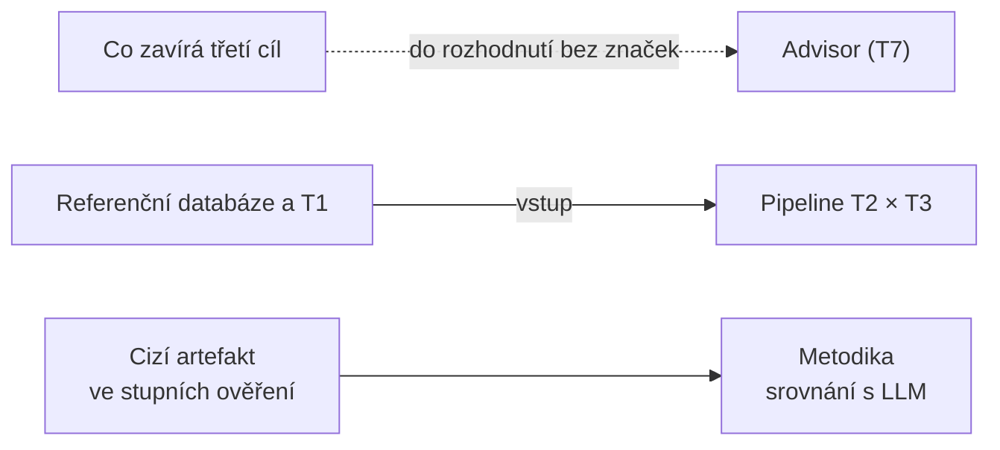

# Otevřené položky

Jediný seznam toho, co zbývá. Jak nástroj funguje dnes, říká [`architecture.md`](./architecture.md), proč je takový, [`decisions/`](./decisions/README.md), a co verze nárokuje, §9 a sekce *Guarantees* kořenového [`README.md`](../README.md).

| Druh položky | Čím končí |
|---|---|
| **Rozhodnutí** | novým souborem v `decisions/` a řádkem v jeho rejstříku |
| **Práce** (už rozhodnutá) | kódem a aktualizací `architecture.md`, podle potřeby i `subset.md` a `traceability.md` |

Hotová položka odsud mizí; kdy a proč, říká git a rozhodnutí. **Pořadí nesou jen značky** (rozh. [018](./decisions/018-work-order-as-item-marker.md)): **Na řadě** nese nejvýš jedna položka, **Potom** nejvýš dvě, obě na začátku kurzívového řádku vazeb. Ostatní položky pořadí nemají a berou se podle priorit z požadavků; kategorie říkají, k čemu položka patří. Cíle zadání: cíl 1 = vydání `1.2.0`, cíl 2 = `2.0.0`, cíl 3 = příští MAJOR `3.0.0` (rozh. [098](./decisions/098-the-number-is-decided-once-per-release.md)).

## Kde jsme vůči specifikaci

Schválená [specifikace](./specifikace.tex) (kap. *Milníky* a *Harmonogram*) a [záměr](./zamer.tex) s koncem projektu **2026-12-01**:

| Milník | Obsah | Termín | Stav |
|---|---|---|---|
| 1 — .NET část | klíče, vztahy, katalog, diagnostika, dotazová matice, čtyři stupně ověření | červenec–srpen | hotovo, `1.2.0` |
| 2 — specifikace a analýza | specifikace, rozhodnutí o javové straně, analýza běhového prostředí pro Javu | září | hotovo |
| 3 — Java a cross-language | Hibernate, MyBatis, EclipseLink, překlad .NET ↔ Java | září–říjen | hotovo, `2.0.0`; dotazy dokončené v `2.1.0`; katalog LDBC se dotahuje ([níž](#dotazy-katalog-ldbc-co-nejdál)) |
| 4 — testy a experimenty | javová sada s diferenčním ověřením (F12–F13) | říjen–listopad | hotovo |
| | zobrazení mezireprezentace (F14) | | **chybí** |
| | cross-language matice T2 s metrikami T3 | | **chybí** pipeline a metriky; matice existuje v testech |
| | příprava infrastruktury pro navazující LLM experimenty (T4–T6) | | **chybí** |
| | základní srovnání Advisoru (T7), *podle časových možností* | | sekundární |
| 5 — odevzdání | experimenty (T2, T3, T7), dokumentace, odevzdání a příprava obhajoby | listopad | — |

T1 (případová studie nebo testovací sada) žádá kapitola *Experimentální požadavky*; žádný milník ji nejmenuje.

## Přehled

Rejstřík položek, ne pořadí; kategorie jdou od nejbližší práce po zbytky.

| Položka | Kategorie | Druh | Pož. |
|---|---|---|---|
| [Verdikt soudce LDBC nad SF 1](#verdikt-soudce-ldbc-nad-celou-sadou-sf-1) | Dotazy | práce | F13, T2, T3 |
| [Seznamový parametr v nativním dotazu EclipseLinku](#seznamový-parametr-v-nativním-dotazu-eclipselinku) | Dotazy | rozhodnutí | F9, T2 |
| [Přepis textu katalogu kvůli vadě jednoho cíle](#přepis-textu-katalogu-kvůli-vadě-jednoho-cíle) | Dotazy | rozhodnutí | T2 |
| [Definice hran uvnitř rekurze nad SF 1](#definice-hran-uvnitř-rekurze-bi-15-a-bi-19-nad-sf-1) | Dotazy | rozhodnutí | T2, T3 |
| [Co zavírá třetí cíl](#co-zavírá-třetí-cíl-schválený-záměr-advisor-nejmenuje) | Třetí cíl | rozhodnutí | F15, T1–T7 |
| [Experimentální pipeline T2 × T3](#experimentální-pipeline-kterou-záměr-žádá-neexistuje) | Třetí cíl | rozhodnutí | S5, T1–T3 |
| [Referenční databáze experimentů a případová studie T1](#referenční-databáze-experimentů-a-případová-studie-t1) | Třetí cíl | rozhodnutí | T1, T2, T7, F4 |
| [Zobrazení mezireprezentace](#mezireprezentace-se-nezobrazuje-ačkoli-f14-ji-jmenuje) | Třetí cíl | rozhodnutí | F11, F14 |
| [Artefakt, který nevyrobil nástroj, ve stupních ověření](#ověřovací-stupně-nad-artefaktem-který-nevyrobil-nástroj) | Třetí cíl | rozhodnutí | T3–T6 |
| [Metodika srovnání s LLM](#metodika-srovnání-s-llm-a-vymezení-proti-souběžným-pracím) | Třetí cíl | rozhodnutí | T4–T6 |
| [Izolace spouštění cizího kódu](#izolace-spouštění-cizího-kódu-advisorem) | Advisor | rozhodnutí | S4, F15, T7 |
| [Parametrizovaný dotaz](#parametrizovaný-dotaz-advisor-nezměří) | Advisor | rozhodnutí | F15, T4, T7 |
| [Nedoplněný překlad](#advisor-měří-nedoplněný-překlad) | Advisor | rozhodnutí | F15, T7 |
| [Jednotka s víc dotazy](#jednotka-s-víc-dotazy-vstupuje-do-advisoru-jako-jeden-dotaz) | Advisor | rozhodnutí | F15, T7 |
| [Iterační politika benchmarku](#iterační-politika-benchmarku-je-konstanta-v-kódu) | Advisor | rozhodnutí | T7 |
| [ADO.NET provider v benchmarcích](#sjednocení-adonet-provideru-v-benchmarcích) | Advisor | rozhodnutí | T7 |
| [Testy Advisoru a benchmarkingu](#advisor-a-benchmarking-nemají-žádné-testy) | Advisor | práce | T7, S6 |
| [Nedostupnost nativní knihovny](#advisor-hlásí-nedostupnost-nativní-knihovny-až-po-odeslání-běhu) | Advisor | práce | F15, S7 |
| [Směr překladu a vstup vedle výstupu](#směr-překladu-jako-jedna-věc-a-vstup-vedle-výstupu) | Rozhraní | rozhodnutí | F14, S7 |
| [Čísla řádků v editoru jednotky](#editor-jednotky-nemá-čísla-řádků-na-která-se-odvolává-chybová-hláška) | Rozhraní | práce | S7 |
| [Mapovací fakta mimo `hbm.xml`, která se zahodí beze slova](#mapovací-fakta-mimo-hbmxml-která-čtení-zahodí-beze-slova) | Užitečné | práce | F5, F11 |
| [Atributy ostatních prvků NHibernate mapování](#atributy-ostatních-prvků-nhibernate-mapování-mizí-beze-slova) | Užitečné | práce | F11 |
| [Druhý databázový dialekt](#druhý-databázový-dialekt) | Užitečné | rozhodnutí | F5, F7–F10, S2 |
| [Reprodukovatelnost sestavení](#vynucení-stylu-a-reprodukovatelnost-sestavení) | Užitečné | rozhodnutí | S2, S5 |
| [Sdílená entitní báze](#sdílená-entitní-báze-roste-a-rozšiřovací-plocha-ne) | Užitečné | rozhodnutí | S1 |
| [Trvalý identifikátor vydání](#trvalý-identifikátor-vydání) | Užitečné | rozhodnutí | — |
| [Syntaktická chyba v C# bez pozice](#syntaktickou-chybu-v-c-nehlásí-nikdo-s-pozicí) | Zbytky | rozhodnutí | F11, S7 |
| [Alias v SQL jako mapování Dapperu](#alias-v-sql-jako-zdroj-mapování-dapperu) | Zbytky | rozhodnutí | F6 |
| [Fluent konfigurace EF Core](#fluent-konfigurace-ef-core-jako-vstupní-jednotka) | Zbytky | rozhodnutí | F1, F5 |
| [Dapper.Contrib](#dappercontrib-v-rozsahu-nebo-mimo-něj) | Zbytky | rozhodnutí | F6 |

Co na čem stojí (vazby, které položky samy vyslovují):

---

## Vady

Vstup, na který se nárok vztahuje, dá artefakt, který cílový framework odmítne nebo který tiše znamená něco jiného. Opravují se jako práce (rozhodnutí o správném výstupu existuje). Nárok, který vada vyvrací, do opravy platí jen s výhradou; kdyby se opravovat neměla, musí se zúžení vyslovit v §9 i v *Guarantees*.

Dnes tu žádná položka není.

## Dotazy: katalog LDBC co nejdál

Cíl: co nejvíc ze 41 dotazů katalogu (rozh. [110](./decisions/110-ldbc-snb-as-a-second-reference-domain.md)) *podle specifikace* a *jazykem cíle*; úniková cesta nativním SQL (rozh. [113](./decisions/113-native-sql-as-the-escape-path-and-the-vocabulary-ldbc-needs.md)) jen tam, kde jazyk cíle konstrukci opravdu nemá. Stav katalogu drží `Combined/LdbcCatalogTest` a popisuje [`architecture.md`](./architecture.md) §6.2; meze konstrukcí vede [`subset.md`](./subset.md) 2.6–2.11.

Co položky níž změní (dotazy katalogu, které cíl dnes píše nativním SQL):

| Cíl | Dnes | Zruší | Čím | Zůstane | Proč zůstane |
|---|---|---|---|---|---|
| EF Core 10 | 8 | — | — | 8: rekurze (6), okenní funkce (BI 14), agregát bez seskupení (BI 11) | LINQ je nemá; seskupení podle konstanty by nad prázdným vstupem vrátilo nula řádků místo jednoho (113) |
| NHibernate 5.7 | 14 | — | — | 14: mezivýsledek (5), rekurze (6), datumová aritmetika (2), seznam (1) | HQL 5.7 je nemá, změřeno (113, deskriptor) |
| Hibernate 7.4 | 1 | — | — | 1: převod textu na text (IC 12) | `cast` do textu píše 7.4.5 jako `varchar(max)`, a stejně s typem `nstring` i pod `hibernate.use_nationalized_character_data` — změřeno (javová `hibernate/HibernateClaimsTest`); zbývá jen úniková cesta (113) |
| EclipseLink 5.0 | 18 | — | — | 18: rekurze (6), mezivýsledek (4), datumová aritmetika (2), seznam (1), převod typu (BI 1), pořadí joinů (IS 7, IC 5, BI 2, BI 5) | JPQL je nemá; `cast` pošle EclipseLink 5.0 SQL Serveru s javovým jménem typu (113); pořadí joinů píše EclipseLink sám — zbývá jen [přepis textu](#přepis-textu-katalogu-kvůli-vadě-jednoho-cíle) |
| odmítnutí | EclipseLink BI 12 | BI 12 | seznamový parametr v nativním dotazu ([rozhodnutí](#seznamový-parametr-v-nativním-dotazu-eclipselinku)) | 0 | — |
| `Simplified` | 5 | — | — | 5: cesty s mezí hloubky (IC 13, BI 15, BI 19, BI 20 do čtyř kroků z obou konců; IC 14 do tří) | rekurzivní člen SQL Serveru řádky neslučuje (113); IC 14 z obou konců jen ukáže-li [verdikt](#verdikt-soudce-ldbc-nad-celou-sadou-sf-1) čtení, které mez mine |

Úniková cesta po kouscích (`FUNCTION('DATEDIFF', …)`, `SQL(…)` EclipseLinku) a rekurze rozepsaná do pevného počtu joinů zůstávají zamítnuté — varianta 3 rozh. 113 a jeho odstavec o rekurzi; co by je otevřelo, je nové rozhodnutí, ne položka tady.

### Práce

#### Verdikt soudce LDBC nad celou sadou SF 1
*Práce podle rozh. [117](./decisions/117-the-interactive-v1-validation-set-judges-the-ldbc-catalog-at-the-fourth-level.md); stojí na [110](./decisions/110-ldbc-snb-as-a-second-reference-domain.md) a [095](./decisions/095-a-dated-run-record-names-its-commit.md). Požadavky F13, T2, T3.*

Soudce běží, ale jen nad prefixem: compose profil `test` přehrává 1000 řádků sady SF 0,1. Verdikt, který rozhodnutí bere za doklad stavu „podle specifikace", je celá sada nad SF 1 v obou sadách na MIS3 (`docker compose up --build` dá `mssql_db` se sadou SF 1; `ORMCONVERTOR_LDBC_VALIDATION_ROWS` prázdná) — přes 130 tisíc čtení, při desítkách až stovkách milisekund na čtení hodiny na sadu, proto zatím neproběhl. Výsledek se zapíše do záznamu běhů v [`ORMConvertor/README.md`](../ORMConvertor/README.md) a do [`traceability.md`](./traceability.md) (F13); podíl shodných čtení IC 13 a IC 14 do metrik T3 a do poznámek katalogu. IC 13 a IC 14 souhlasily nad prefixem 800 řádků SF 0,1 ve všech šesti frameworcích ze 100 %, obě tehdy s mezí tří kroků; IC 13 dnes hledá z obou konců do čtyř. Potvrdí-li to celá sada, mez tří kroků IC 14 žádné čtení nemine; ukáže-li čtení, které ji mine, skládá se IC 14 z obou polovin — dvě procházky po dvou krocích, setkání jako join, `DISTINCT` nad cestou — jako IC 13.

### Rozhodnutí

#### Seznamový parametr v nativním dotazu EclipseLinku
*Rozh. [113](./decisions/113-native-sql-as-the-escape-path-and-the-vocabulary-ldbc-needs.md) („u EclipseLinku je to třeba ověřit" — změřeno: nerozvine); profil `NativeQueryExpandsCollection`, odmítnutí `EclipseLinkNativeList` (BI 12), [`subset.md`](./subset.md) 2.11; kolekční parametr rozh. [106](./decisions/106-a-bare-parameter-after-in-is-dappers-collection-parameter.md). Požadavky F9, T2.*

Nativní dotaz EclipseLinku 5.0.0 předá `List` vázaný na `?1` ovladači jako jednu hodnotu, takže BI 12 — mezivýsledek, tedy nativní SQL, a k tomu seznam jazyků v `IN` — je jediné odmítnutí katalogu. Rozhodnout, jak nativní dotaz EclipseLinku seznam přijme: **rozvinutím zástupných symbolů za běhu** v generované metodě (text `IN (?3, ?4, …)` složený podle délky seznamu a každý prvek vázaný zvlášť; totéž, co dělá Dapper uvnitř, SQL se od textu cíle Dapper liší jen počtem symbolů, takže `AFallbackEmitsTheStatementTheDapperTargetWrites` musí srovnávat s touto výjimkou); `STRING_SPLIT`/`OPENJSON` nad jedním spojeným řetězcem (mění SQL i typ parametru a oddělovač může být v hodnotě); nebo odmítat dál. Totéž pravidlo pak platí pro každý nativní dotaz EclipseLinku se seznamem, ne jen pro katalog.

#### Přepis textu katalogu kvůli vadě jednoho cíle
*Rozh. [110](./decisions/110-ldbc-snb-as-a-second-reference-domain.md) (text vedle referenční implementace LDBC), [113](./decisions/113-native-sql-as-the-escape-path-and-the-vocabulary-ldbc-needs.md) (odstavec *Proč obecně, a ne jen nejlepší řádek přes `NOT EXISTS`*); profil `InnerJoinsFollowOuterJoins`, `EclipseLinkOuterJoinOrder` u IS 7, IC 5, BI 2 a BI 5. Požadavek T2.*

Čtyři dotazy jdou do EclipseLinku nativním SQL kvůli vnějšímu joinu, jehož podmínka jmenuje alias vnitřního joinu: EclipseLink 5.0.0 píše vnitřní joiny za vnější a SQL Server podmínku odmítne. Nástroj to neobejde — pořadí píše EclipseLink a proměnná rozsahu nepomůže, protože `ON` přes čárku v SQL Serveru nesahá. Obejde to jen text: příznak IS 7 jako `CASE WHEN EXISTS (…)`, počet příspěvků IC 5 jako korelovaný skalární poddotaz, u BI 2 a BI 5 podobně. Rozhodnout, zda text katalogu smí dostat tvar diktovaný vadou jednoho cíle — proti tomu stojí 110 (text je přirozené T-SQL, které jde položit vedle referenční implementace) a to, že matice by pak měřila dotaz, který by takto nikdo nenapsal; pro to mluví čtyři dotazy méně v nativním SQL. Padne-li *ne*, položka zaniká a čtyři únikové cesty zůstávají vyslovené v §6.2.

#### Definice hran uvnitř rekurze: BI 15 a BI 19 nad SF 1
*Obsah katalogu (rozh. [110](./decisions/110-ldbc-snb-as-a-second-reference-domain.md)); rekurze rozh. [113](./decisions/113-native-sql-as-the-escape-path-and-the-vocabulary-ldbc-needs.md); změřeno 2026-10-10 nad `mssql_db` (SF 1) na MIS3. Požadavky T2, T3.*

BI 15 a BI 19 procházejí v rekurzivním členu definici hran postavenou nad seskupením odpovědí (969 tisíc dvojic autorů ze 3 milionů zpráv). SQL Server definici nematerializuje: plán ji přepočítává pro každý klíč procházky (vnořené cykly a seek do `Message` podle autora), takže BI 19 nedoběhne do 500 s ani z obou konců, ani z jednoho — a stejně dopadl tvar s hranami jako vnějším joinem až za rekurzí, se seskupením podle neuspořádané dvojice i s odpověďmi počítanými korelovaným poddotazem na krok. BI 15 z obou konců doběhne za 49 s, z jednoho konce nedoběhne do 500 s. Nad hranami uloženými do dočasných tabulek dá BI 19 z obou konců týž výsledek za 6 s a z jednoho konce za 101 s. Rozhodnout, zda text katalogu smí dostat tvar, kterým plánovač SQL Serveru spočítá hrany jednou (proti stojí 110 jako u [přepisu textu](#přepis-textu-katalogu-kvůli-vadě-jednoho-cíle)), nebo zda katalog u obou dotazů vysloví, že nad SF 1 je neměří; soudce BI dotazy nesoudí a nárok T2/T3 je o překladu, ne o běhu.

## Třetí cíl: experimenty

Experimentální infrastruktura podle specifikace — matice T2 s metrikami T3 a příprava T4–T6 — a zobrazení mezireprezentace (F14) jsou milník 4; experimenty samy (T2, T3, T7) klade harmonogram do milníku 5 a T1 žádá kapitola *Experimentální požadavky*. Advisor je sekundární větev ([níž](#advisor)). Celá oblast je dnes ze záruk vyňatá ([`architecture.md`](./architecture.md), §9) a je látkou na `3.0.0`. Značky pořadí položky nenesou, dokud se nedotáhne [katalog LDBC](#dotazy-katalog-ldbc-co-nejdál).

### Rozhodnutí

#### Co zavírá třetí cíl: schválený záměr Advisor nejmenuje
*Ke kontrole: rozh. [098](./decisions/098-the-number-is-decided-once-per-release.md) („příští MAJOR je `3.0.0` za Advisor nad všemi frameworky a za experimentální část"); stojí na něm věta §9 o příštím MAJOR a sekce *Beyond this version* kořenového [`README.md`](../README.md). Požadavky F15, T1–T7.*

Zadání vedoucího ([`requirements.md`](./requirements.md), F15, T7) a původní prototyp vedly k Advisoru jako třetímu cíli. Schválený [záměr](./zamer.tex) ale Advisor mezi pěti úkoly řešitele nemá — pátým úkolem je experimentální prostředí a výzkumným využitím srovnání s metodami založenými na LLM. Schválená [specifikace](./specifikace.tex) to seřadila jen zčásti: matice T2 s metrikami T3, příprava T4–T6 a zobrazení mezireprezentace jsou milník 4, experimenty T2, T3 a T7 milník 5 a Advisor (F15, T7) je *sekundární cíl podle časových možností*, který nesmí omezit hlavní cross-language cíl; kapitola *Zbývající práce a postup* ale cíl 3 dál jmenuje „Advisor, benchmarking a experimenty" včetně izolace S4. Rozhodnout, co `3.0.0` zavírá. Padne-li volba pro experimenty bez Advisoru, znamená to 098 **nahradit** (podle něj se už vydávalo) a přepsat větu v §9, v README i úvod kategorie [Advisor](#advisor); padne-li pro Advisor, musí nové rozhodnutí odůvodnit odchylku od úkolů záměru a pátý úkol i výzkumné využití zůstanou otevřené jako vyslovená odchylka.

#### Experimentální pipeline, kterou záměr žádá, neexistuje
*Platí, ať třetí cíl zavře cokoli: tabulku T2 × T3 žádá milník 4 specifikace. Ke kontrole: rozh. [039](./decisions/039-container-configuration-of-the-environment.md) (co pokrývá kontejnerová konfigurace) a [089](./decisions/089-differential-verification-as-the-fourth-level-over-a-query.md) (co z diferenčního ověření jde použít). Souvisí s [078](./decisions/078-java-suite-as-a-client-of-a-running-instance.md). Zúžení S5 v §9 a vyňatá oblast 6; UC5 v [`use-cases.md`](./use-cases.md). Požadavky S5, T1, T2, T3.*

Ověřovací polovina pátého úkolu záměru hotová je: obě sady staví, spouštějí a diferenčně ověřují generovaný kód v zafixovaném prostředí. Chybí experimentální polovina — nic nevolá `/convert` přes všechny dvojice frameworků a kategorie dotazů a nepočítá podíly parsovatelných, kompilovatelných, spustitelných a funkčně ekvivalentních výstupů ani úplnost přenesených mapovacích vlastností (T3). Záměr i S5 chtějí prostředí jako součást výsledku, spustitelné z kontejnerové konfigurace; pipeline, kterou popisuje UC5, v repozitáři není. Rozhodnout:

- kde pipeline bydlí — třetí profil compose, nebo profil `test` rozšířený o běh, který vydá tabulku měření s identifikátorem běhu a verzemi (S6);
- co je vstupem — dnes `CrossFrameworkInputs`, `QueryShapeInputs`, diferenční matice a vstupy javové sady; žádný není případovou studií T1 (položka níž);
- kam se ukládá výstup, když rozh. [042](./decisions/042-measured-benchmark-output-out-of-git.md) vyloučilo naměřený výstup z gitu;
- jak se počítají podíly T3 nad čtyřmi stupni rozh. [016](./decisions/016-generated-artifact-verification-levels.md); podíl funkční ekvivalence dává diferenční ověření.

#### Referenční databáze experimentů a případová studie T1
*Ke kontrole proti záměru: rozh. [016](./decisions/016-generated-artifact-verification-levels.md) (testy nad vlastním schématem, WideWorldImporters zamítnutá). Kandidát: `LdbcSnb`, rozh. [110](./decisions/110-ldbc-snb-as-a-second-reference-domain.md). Požadavky T1, T2, T7, F4.*

Záměr i specifikace jmenují jedinou referenční databázi, SQL Server s WideWorldImporters. Ta slouží compose stacku, Advisoru a ukázkám `/samples`; obě sady, 4. stupeň i diferenční matice běží nad vlastním schématem (`Tests/Database/TestSchema.sql`, `Differential/FixtureData.sql`), což rozh. 016 odůvodňuje pro *ověřování*. Pro *experimenty* odpověď chybí: T2 běží nad fixture, T7 nad WideWorldImporters a T1 nad ničím. Specifikace čte T1 jako „alespoň jednu reprezentativní případovou studii **nebo testovací sadu** s netriviálními entitami, vztahy a read-only dotazy"; katalog LDBC SNB (41 čtecích dotazů nad SF 1) tomu odpovídá, rozh. 110 ho ale zavedlo pro překlad a 1. stupeň ověření a rozh. 117 soudí na 4. stupni jen jeho dotazy Interactive, proti validační sadě LDBC. Zmražené zadání ([`requirements.md`](./requirements.md), T1) přitom žádá open-source aplikaci a [`traceability.md`](./traceability.md) u T1 říká, že LDBC aplikací není. Rozhodnout, které čtení T1 platí, nad čím který experiment běží, zda je LDBC případovou studií T1, a kde se to vysloví.

#### Mezireprezentace se nezobrazuje, ačkoli F14 ji jmenuje
*Milník 4 specifikace. Zúžení F14 v §9. Souvisí s rozh. [010](./decisions/010-diagnostics-as-returned-data.md), [033](./decisions/033-shape-of-the-static-frontend-screens.md) a [098](./decisions/098-the-number-is-decided-once-per-release.md). Požadavky F11, F14.*

F14 žádá zobrazit vstup, mezireprezentaci, výstup a diagnostiku; `/convert` mezireprezentaci nevrací, takže ji obrazovka nemá odkud vzít. Cena není ve vykreslení: serializovaný tvar `EntityMap`, klíčů, vztahů a dotazových instrukcí se stane součástí REST kontraktu i s verzováním podle rozh. 098. Rozhodnout, zda mezireprezentace bude plnohodnotnou částí odpovědi, nebo výslovně nestabilním náhledem — i ten je ovšem součástí kontraktu.

#### Ověřovací stupně nad artefaktem, který nevyrobil nástroj
*Příprava T4 podle milníku 4. Blokuje to rozh. [078](./decisions/078-java-suite-as-a-client-of-a-running-instance.md) („klient, ne čtenář souborů") — ke kontrole proti záměru. Souvisí s [016](./decisions/016-generated-artifact-verification-levels.md), [027](./decisions/027-query-artifact-verification.md), [089](./decisions/089-differential-verification-as-the-fourth-level-over-a-query.md). Požadavky T3–T6.*

Všechny čtyři stupně posoudí jen výstup nástroje: javová sada si artefakty bere z `/convert`, .NET ověření volá `ConversionHandler.Convert` a diferenční porovnání běží nad jejich výsledkem. Artefakt od LLM nebo lidský překlad nemá kudy vstoupit, takže srovnání nemá čím měřit druhou stranu, ačkoli metriky T3 jsou definované nad artefaktem, ne nad nástrojem. Rozh. 078 zamítlo čtení artefaktů ze souborů dvěma argumenty. Otisk v gitu zestárne a dokazuje sám sebe — artefakt LLM je ale měřenou věcí, datovanou a přiřazenou k modelu, promptu a pokusu. A soukromý kontrakt dvou sad — ten platí zčásti: rozvržení adresáře a pojmenování se stane kontraktem mezi pipeline experimentu a sadou. Rozhodnout: 078 nahradit, nebo doplnit vstupní cestu vedle klienta; jak sada artefakt pojmenuje (pravidlo JLS §7.6 platí dál) a jak záznam běhu řekne, čí artefakt to byl.

#### Metodika srovnání s LLM a vymezení proti souběžným pracím
*Stojí na položce výš. Rozhodnutí k tomu neexistuje; záměr jmenuje souběžné práce M. Čorovčáka (univerzální objektový model, LLM) a I. Oboňové (migrace dotazů s LLM). Řádky T4–T6 v [`traceability.md`](./traceability.md) jsou prázdné. Požadavky T4, T5, T6.*

Podle specifikace projekt jen *připraví* data, rozhraní a měřicí infrastrukturu; plné zero-shot, few-shot, RAG, agentní a ablační experimenty nese navazující diplomová práce. Zadání předepisuje, co uvést (model a verze, prompt, teplota, počet pokusů, tokeny, čas, náklady), ne vstup, pravdu a míru shody. Vstupem je táž množina jednotek jako u matic, pravdou kanonický výsledek (rozh. 089) a čtyři stupně (016), shodou metriky T3. Rozhodnout: rozsah (kolik z 36 směrů, které kategorie, zda i entity a mapování), počet pokusů a zacházení s nedeterminismem vůči bajtově shodnému výstupu nástroje (S2), co dostane varianta RAG (dokumentaci cílového frameworku, schéma, příklady — T5) a co vypíná ablace T6, a vymezení proti oběma souběžným pracím.

## Advisor

Advisor, benchmarking a T7 — podle specifikace **sekundární cíl podle časových možností**, který nesmí omezit hlavní cross-language cíl. Ze záruk je vyňatý vcelku (§9, vyňatá oblast 1); popis je v [`architecture.md`](./architecture.md) §8. Značky pořadí položky nenesou, dokud nepadne [Co zavírá třetí cíl](#co-zavírá-třetí-cíl-schválený-záměr-advisor-nejmenuje).

### Rozhodnutí

#### Izolace spouštění cizího kódu Advisorem
*[`threat-model.md`](./threat-model.md), hrozba 1; hranici pro javovou větev vyslovilo rozh. [076](./decisions/076-java-wrappers-in-csharp-jvm-in-containers.md). Požadavky S4, F15, T7.*

`/advisor/run` je jediné místo, kde nástroj cizí kód kompiluje a spouští: `RoslynBenchmarkCompiler` ho zavede do kolektibilního `AssemblyLoadContext` a `BenchmarkExecutor` ho volá v procesu aplikace, s jejími právy a připojením k Advisor databázi, bez limitu CPU, paměti i času. Rozhodnout, kudy povede hranice — samostatný proces s limity OS, kontejner na běh, nebo zúžení vstupu. Volba mění měřená čísla (startovní režie, JIT, paměť) a rozhoduje se spolu s metodologií javové větve, která podle 076 běží mimo proces. Do té doby platí jen předpoklad důvěryhodné sítě.

#### Parametrizovaný dotaz Advisor nezměří
*Plyne z rozh. [083](./decisions/083-parameter-as-the-fifth-operand-shape.md). Požadavky F15, T4, T7.*

`EFCoreBenchmarkHarnessBuilder` hledá veřejnou metodu s právě jedním parametrem `DbContext`; metodu s parametry dotazu přeskočí a běh skončí „EF Core query method not found". Rozšířit hledání je snadné; rozhodnout je třeba, **čím se parametr naplní** — výchozí hodnotou typu (měří prázdný výsledek), hodnotou od volajícího (nové pole požadavku), nebo hodnotou z katalogu (váže měření na data) — a co s dotazem, jehož parametr naplnit nejde: vypadne se záznamem, nebo se běh odmítne.

#### Advisor měří nedoplněný překlad
*Rozh. [059](./decisions/059-advisor-response-carries-the-measured-translations.md) svou variantu 3 zamítlo jen pro teď; souvisí s [015](./decisions/015-mapping-fact-completion-from-the-catalog.md). Požadavky F15, T7.*

Překladová fáze `/advisor/run` volá `ConversionHandler.Convert` bez připojení, takže měří překlad bez doplnění z katalogu, kdežto `/convert` tentýž vstup doplní. Odpověď to přiznává stavem měřených artefaktů. Rozhodnout, zda překladová fáze dostane tutéž `CachingCatalogReader` jako benchmarková: je to levné, ale mění kompilovaný harness, takže se musí přeměřit, ne jen zapnout. K tomu patří agregace `CatalogReadTime` přes převody běhu, která je dnes u všech null.

#### Jednotka s víc dotazy vstupuje do Advisoru jako jeden dotaz
*Plyne z rozh. [108](./decisions/108-a-sql-unit-carries-a-query-per-select-numbered-by-position.md) a [109](./decisions/109-a-code-unit-carries-every-query-it-hands-over.md). Požadavky F15, T7.*

`AdvisorRunCoordinator` převede každou jednotku workloadu a změří ji jedním během; ILP dostane za identifikátor jednu cenu. Jednotka ale může nést víc dotazů: `DapperBenchmarkHarnessBuilder` změří první `SqlQuery`, `EFCoreBenchmarkHarnessBuilder` první metodu, na kterou narazí reflexe, ostatní vypadnou beze slova. Rozhodnout: takovou jednotku odmítnout, nebo ji rozložit na víc dotazů workloadu (`Query01`, …) — to mění počet proměnných ILP, a tedy co je dotaz workloadu.

#### Iterační politika benchmarku je konstanta v kódu
*Specifikace (kap. *Rizika*) slibuje politiku vyslovit a odůvodnit jako součást metodologie. Požadavek T7.*

`BenchmarkExecutor` měří každý pár dotaz × framework pevně: dvě zahřívací iterace, pilotní běh a z něj 3–20 měřených iterací s cílem ~500 ms. Konstanty nejsou odůvodněné ani nastavitelné, a přitom určují rozptyl a délku běhu. Rozhodnout, jaké hodnoty metodologie vysloví a čím je podloží, a zda budou zároveň parametrem požadavku; změna bez rozhodnutí mění význam dosavadních čísel.

#### Sjednocení ADO.NET provideru v benchmarcích
*Podklad: audit [2026-08-02](./audits/2026-08-02-post-step-4-audit.md), kap. 3.4.2; [srovnání frameworků](./analysis/orm-frameworks-comparison.md) a `benchmarks/README.md`. Požadavek T7.*

Dapper, EF Core, linq2db a RepoDB běží na `Microsoft.Data.SqlClient`, NHibernate, EF6 a PetaPoco na `System.Data.SqlClient` (přes `benchmarks/Common`) — metodologický confound. Rozsah je dohledaný; zbývá volba: přepnout NHibernate na `MicrosoftDataSqlClientDriver`, najít pro PetaPoco provider nad `Microsoft.Data.SqlClient` a přeměřit, nebo confound popsat v textu práce.

### Práce

#### Advisor a benchmarking nemají žádné testy
*§8. Požadavky T7, S6.*

Testy nepokrývají `Advisor` ani `AdvisorBenchmarking`: P/Invoke do ILP solveru, stavbu harnessů ani `HarnessGenerationUtilities`, které z generovaného textu tahá názvy typů, jmenné prostory a `[Table]` regulárními výrazy a nullabilitu přepisuje textovou náhradou — právě to se nejsnáz rozejde s generátorem. Oblast je ze záruk vyňatá vcelku právě proto; testy přijdou, až Advisor z vyňaté oblasti vystoupí.

#### Advisor hlásí nedostupnost nativní knihovny až po odeslání běhu
*Podle rozh. [076](./decisions/076-java-wrappers-in-csharp-jvm-in-containers.md) je Advisor kontejnerový a build pro Windows nevzniká. Požadavky F15, S7.*

Mimo Linux a Docker chybí `libadvisor.so`; `AdvisorRunHandler` vrátí text `DllNotFoundException` až po vyplnění a odeslání formuláře (úvod obrazovky na kontejner upozorňuje předem). Aby obrazovka nedostupnost řekla místo běhu, potřebuje koncový bod „je Advisor na tomhle hostiteli k dispozici?". Je malý, ale sahá do vyňaté oblasti.

## Rozhraní

Zásahy do frontendu mimo milník 4. Z F14 je hotový vícesouborový vstup a výstup po souborech; vstupní archiv projektu se nenárokuje (§9) a položku nemá; zobrazení mezireprezentace je v [třetím cíli](#mezireprezentace-se-nezobrazuje-ačkoli-f14-ji-jmenuje).

### Rozhodnutí

#### Směr překladu jako jedna věc a vstup vedle výstupu
*Navazuje na rozh. [100](./decisions/100-interactive-comparison-as-a-frozen-mockup.md), [099](./decisions/099-examples-are-content-not-a-choice.md) a [033](./decisions/033-shape-of-the-static-frontend-screens.md) (pětikrokový tvar obrazovky; podle něj je kód, takže změna znamená nové rozhodnutí). Souvisí s [032](./decisions/032-frontend-as-static-pages-without-a-build.md) a [066](./decisions/066-records-attributed-to-the-input-unit.md). Podklad: maketa `comparison.html`. Požadavky F14, S7.*

Směr překladu nestojí na obrazovce jako jedna věc: zdroj a cíl jsou dvě sekce a prohodit je jde jen ručně. Řádek směru s tlačítkem prohození by z pěti sekcí udělal čtyři (S7 dovoluje „nejvýš pět"). Druhá otázka do téhož rozhodnutí: **vstup vedle výstupu**. Server dnes neříká, ze které jednotky artefakt vznikl (jednotky nesou jméno a záznamy na ně ukazují, rozh. 066). Bez toho se sloupce buď spárují toutéž jmennou heuristikou, jakou se artefakty pojmenovávají, a jako heuristika se i označí (odkaz *Artifact* obrazovky už je takovou shodou jmen, [`architecture.md`](./architecture.md) §6.3), nebo párování netvrdí a nesou jen nadpisy „co jste poslali" a „co přišlo zpět". Maketa ukazuje párování po slovech; rozhodnout i jemnost — po artefaktech (levné), nebo po tvrzeních (dotkne se každého builderu). Po naplnění se maketa maže.

### Práce

#### Editor jednotky nemá čísla řádků, na která se odvolává chybová hláška
*Souvisí s rozh. [033](./decisions/033-shape-of-the-static-frontend-screens.md) (validace XML s číslem řádku) a [032](./decisions/032-frontend-as-static-pages-without-a-build.md), bod f (žádná další vendorovaná knihovna bez rozhodnutí). Požadavek S7.*

S7 doslova žádá zvýraznění chyb na úrovni souboru a řádku; chyba přiřazená jednotce hotová je, chybí řádek. Hlášky ho nesou (XML z validace, SQL řádek a sloupec z `TSql160Parser`), editor je ale holý `<textarea>`. Práce: postranní sloupec čísel řádků posouvaný s textovým polem, vlastním kódem o několika desítkách řádků. Hotový editor (CodeMirror) by byl třetí vendorovaná knihovna, a tedy samostatné rozhodnutí.

## Užitečné, ne nutné

Prospělo by to, ale žádná věta záruk na tom nestojí a nic tím není blokované. Značky pořadí položky nedostávají.

### Rozhodnutí

#### Druhý databázový dialekt
*Plyne z rozh. [086](./decisions/086-target-database-dialect-declared-by-the-descriptor.md); jednu ze tří otázek odbavilo [088](./decisions/088-a-declared-foreign-source-dialect-is-not-read.md). Souvisí s [082](./decisions/082-t-sql-read-and-written-by-a-shared-project.md) a [113](./decisions/113-native-sql-as-the-escape-path-and-the-vocabulary-ldbc-needs.md). Vyňatá oblast 5 (§9). Požadavky F5, F7–F10, S2.*

Nástroj píše pro SQL Server 2022 a deklarace cizího dialektu zdroje čtení zastaví (rozh. 088). Zbývá rozhodnout: **čím se dialekt volí** — dnes jediná hodnota v deskriptoru bez volby z rozhraní, pravděpodobně spolu s volbou verze frameworku, kterou nechalo otevřenou rozh. [013](./decisions/013-target-framework-versions.md); **zda platí zamítnutí multidialektové knihovny** — rozh. 082 argumentovalo tichým překladem, který deklarace odstranila, cena (gramatika a tabulka jmen navíc) ale trvá a bez druhého systému k ověření je užitek nulový; a **co dělat, když se dialekt zdroje a cíle rozejdou** — vznikne to až se dvěma čitelnými dialekty, kdy se zábrana z 088 stane přepínačem. Druhý dialekt by potřeboval i vlastní zapisovač únikové cesty.

#### Vynucení stylu a reprodukovatelnost sestavení
*Podklad: audit [2026-08-23](./audits/2026-08-23-post-release-1-1-0-audit.md), kap. 8.4. Souvisí s rozh. [034](./decisions/034-central-version-management.md) a [039](./decisions/039-container-configuration-of-the-environment.md). Požadavky S2, S5.*

„Reprodukovatelné prostředí" dnes znamená „jedním příkazem", ne „bajtově stejně": chybí zámek závislostí, základní obrazy i akce CI (`actions/checkout@v5` a spol.) visí na pohyblivých značkách a pravidla stylu build nevynucuje. Rozhodnout, zda se S2 rozšíří z výstupu překladu i na sestavení (zámek, digesty, styl v CI), nebo jde o údržbu, která počká.

#### Sdílená entitní báze roste a rozšiřovací plocha ne
*Podklad: revize [2026-09-21](./audits/2026-09-21-pre-release-2-0-0-audit.md), nález 5.4. Invariant S1; souvisí s rozh. [076](./decisions/076-java-wrappers-in-csharp-jvm-in-containers.md).*

Invariant „nový framework je nový wrapper" platí: jméno frameworku neprosakuje do `AbstractWrappers`, `Common` ani `Model` a jmenují ho jen továrny v `OrmConvertor/Factories/`. Podle revize ale `AbstractEntityBuilder` od `1.2.0` vyrostl z 2 137 na 2 728 řádků při stejných devíti `virtual`/`abstract` členech, z nichž sedm jsou kroky šablonové metody — volné háčky jsou dva; `AbstractQueryBuilder` vyrostl víc (651 → 1 475), ale jeho plocha s ním (12 → 16). Rozmyslet, zda poměr měřit u každého vydání, zda entitní bázi rozdělit jako vrstvu JPA, a co je prahem.

#### Trvalý identifikátor vydání
*Podklad: audit [2026-08-23](./audits/2026-08-23-post-release-1-1-0-audit.md), kap. 8.1, a [fair-software.eu](https://fair-software.eu/). Souvisí s rozh. [098](./decisions/098-the-number-is-decided-once-per-release.md). Až úplně na konci vývoje.*

Citaci nesou jen značka v gitu a `CITATION.cff`; z pěti doporučení fair-software.eu chybí záznam v registru. Rozhodnout, zda se fork cizího prototypu archivuje pod vlastním identifikátorem (kde a s jakým autorstvím — `LICENSE` nese dva držitele) a zda tím je nástroj „publikovaný" ve smyslu předpokladu rozh. 098; pak se 098 nahrazuje.

### Práce

#### Mapovací fakta mimo `hbm.xml`, která čtení zahodí beze slova
*Zdroj: [`subset.md`](./subset.md), 2.13. Práce podle rozh. [048](./decisions/048-a-fact-with-no-place-in-the-model-is-a-loss.md) a [004](./decisions/004-unexpressible-facts-as-warnings.md). Požadavky F5, F11.*

Fakta, která zdroj tvrdí, model je nenese a čtení o nich mlčí:

| Zdroj | Fakt |
|---|---|
| EF Core | `[ForeignKey("Navigace")]` na skalární vlastnosti cizího klíče |
| Dapper, NHibernate | atributy tříd a vlastností a pole C# třídy (sdílené čtení C# bere jen vlastnosti a atributy předává jen háčku EF Core) |
| JPA | `@Column(table, insertable, updatable)`, `@Table(indexes, catalog)`, `<index>` v `orm.xml`; `referencedColumnName` v `@JoinColumn` se přečte, ale nepoužije |
| MyBatis | `<cache>`, `<cache-ref>`, `<parameterMap>`, `typeHandler` na `<result>` |
| C#, Java | bázový typ, který jmenuje třídu mimo převod (co by z ní entita zdědila, převod nevidí); bázový typ jiné entity převodu hlásí `Loss` |
| cíl JPA | kolekční vlastnost bez vztahu zapíše jako `@Column` — sloupec, který zdroj netvrdil; Hibernate 7.4.5 ho přijme jako `xml`, EclipseLink 5.0.0 jako serializovaný `IMAGE` (NHibernate a MyBatis vlastnost vynechají s `Incompleteness`) |

Většině stačí `Loss` se jménem (kanál podle 048 existuje). U `referencedColumnName` je třeba rozhodnout, zda stačí ztráta, nebo model vztah na neklíčový sloupec odmítne.

#### Atributy ostatních prvků NHibernate mapování mizí beze slova
*Práce podle rozh. [048](./decisions/048-a-fact-with-no-place-in-the-model-is-a-loss.md) a [004](./decisions/004-unexpressible-facts-as-warnings.md); hranice je vyslovená v §5. Požadavek F11.*

Hlášené atributy mají jen `<class>` a `<property>`. Beze slova se přeskakují: na `<id>` `access` a `unsaved-value`; na `<version>` `generated`, `insert` a `source`; na `<many-to-one>` a `<one-to-one>` `cascade`, `fetch`, `lazy`, `not-found` a `formula` (záznam má jen `property-ref`); ostatní atributy `<class>` (`catalog`, `proxy`, `persister`, `entity-name`, `subselect`, `abstract`, `rowid`, `polymorphism`, `select-before-update`, `check`). Mechanické to není: `generated` na `<version>` builder odvodí sám a `insert="false" update="false"` na `<many-to-one>` píše náš vlastní builder (rozh. [005](./decisions/005-many-to-many-as-explicit-junction-entity.md), [006](./decisions/006-flat-composite-key-rendering.md)) — tvrzený atribut je třeba oddělit od odvozeného (kritérium rozh. [067](./decisions/067-a-derived-convention-is-a-statement-a-default-is-not.md)).

## Zbytky

Zdokumentované mezery a nezodpovězené otázky, na které se nesahá. Jsou tu, aby nález nezůstal jen v konverzaci a aby text práce věděl, co nástroj o svých frameworcích netvrdí.

### Rozhodnutí

#### Syntaktickou chybu v C# nehlásí nikdo s pozicí
*Vyšlo z rozh. [093](./decisions/093-unreadable-input-is-a-unit-failure.md), které případ nechalo stranou. Souvisí s [045](./decisions/045-a-conversion-that-produced-nothing-says-so.md). Požadavky F11, S7.*

Parser bere z `CSharpSyntaxTree.ParseText` deklarace tříd a diagnostiky Roslynu nečte, takže rozbitá třída skončí obecným `Failure` orchestrace bez pozice; ostatní čtyři jazyky řádek a sloupec hlásí. Věta §9, že syntaktickou chybu C# hlásí server, platí jen v tom smyslu, že z jednotky nic nevzešlo. Roslyn ale zotavuje: odmítnout jednotku se syntaktickou chybou sjednotí jazyky, vezme však překlad vstupům, které dnes projdou; hlásit a přeložit, co se zotavilo, odporuje významu `Failure` (§5.1).

#### Alias v SQL jako zdroj mapování Dapperu
*Souvisí s rozh. [015](./decisions/015-mapping-fact-completion-from-the-catalog.md), [017](./decisions/017-source-precedence-for-mapping-facts.md) a [067](./decisions/067-a-derived-convention-is-a-statement-a-default-is-not.md). Podklad: [srovnání frameworků](./analysis/orm-frameworks-comparison.md), §4, a [tutoriál k Dapperu](./analysis/tutorials/dapper-getting-started.md), krok 4. Požadavek F6.*

Jedinou formou mapování v Dapperu je alias `AS` v dotazu a nástroj ji nečte: aliasy nese jen projekce a entitní mapa Dapperu dostává sloupce z katalogu, který páruje podle jména. Doménu z tutoriálu (vlastnost `Id` nad sloupcem `AuthorId`) tak katalog nespáruje. Rozhodnout, zda alias z dotazové jednotky téhož převodu propíše název sloupce do entitní mapy jako tvrzení prvního stupně — a co je konflikt, když dva dotazy aliasují týž sloupec různě.

#### Fluent konfigurace EF Core jako vstupní jednotka
*Počítají s ní rozh. [067](./decisions/067-a-derived-convention-is-a-statement-a-default-is-not.md) a [068](./decisions/068-source-framework-precedence-orders-the-reading.md); co s třídou kontextu ve vstupu, rozhodlo [111](./decisions/111-a-unit-is-a-whole-source-file-that-declares-only-its-language.md). Podklad: [srovnání frameworků](./analysis/orm-frameworks-comparison.md), §4. Požadavky F1, F5.*

Fluent API v `OnModelCreating` je primární formou mapování EF Core; nástroj čte jen anotace a konvence. Třída kontextu není entitou a dostane záznam `Loss`, že se jména `DbSet` vlastností a `OnModelCreating` nečtou (`Combined/WholeSourceFileTest`). Rozhodnout, zda se fluent konfigurace čte, v pořadí podle rozh. 068 — jako část souboru, který je jednotkou.

#### Dapper.Contrib v rozsahu, nebo mimo něj
*Podklad: [srovnání frameworků](./analysis/orm-frameworks-comparison.md), §2. Souvisí s rozh. [067](./decisions/067-a-derived-convention-is-a-statement-a-default-is-not.md). Požadavek F6.*

Dapper.Contrib přidává atributy `[Table]`, `[Key]` a `[ExplicitKey]` — tři mapovací fakty, které holý Dapper nemá kde vyslovit. Nástroj čte jen holý Dapper. Rozhodnout, zda je Contrib výslovně mimo rozsah, nebo ho Dapper parser čte jako anotace po vzoru EF Core a s kritériem rozh. 067.
