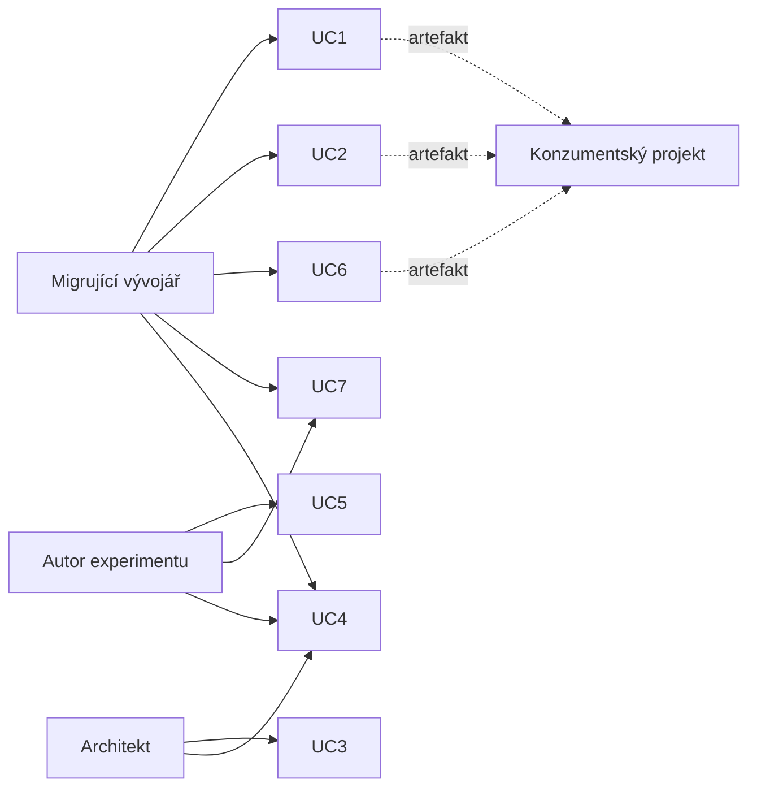

# Případy užití

Vrstva *nad* požadavky: kdo nástroj používá a proč. F1–F15 jsou ze scénářů odvozené; požadavek bez scénáře je zjištění. Chování: [`architecture.md`](./architecture.md); plnění: [`traceability.md`](./traceability.md); hranice záruk: §9 a *Guarantees* v [`README.md`](../README.md).

## Aktéři

| Aktér | Situace | Potřebuje |
|---|---|---|
| **Migrující vývojář** | převádí běžící projekt na jiný framework | věrný překlad a **jmenovitý seznam toho, co neprošlo** |
| **Architekt před volbou** | vybírá framework pro svou zátěž | srovnání z měření s vlastními omezeními |
| **Autor experimentu** | matice překladů, metriky, srovnání s LLM | dávku přes API, opakovatelnost, záznam běhu |
| **Konzumentský projekt** | příjemce artefaktu | aby artefakt netvrdil nic o něm (rozh. [040](./decisions/040-boundary-of-the-handed-over-artifact.md)) |

## Co je ve skutečnosti vstupem

Uživatel má projekt, nástroj ho nevidí. Jednotka = **obsah jednoho souboru v jednom jazyce** (entity, třída s dotazy, mapování, skript SQL); převod = množina jednotek najednou (rozh. [111](./decisions/111-a-unit-is-a-whole-source-file-that-declares-only-its-language.md)). Jednotka deklaruje jen jazyk; entitu a předání dotazu rozpozná zdrojový framework. Nepovinné jméno jednotky nesou záznamy ze čtení (rozh. [066](./decisions/066-records-attributed-to-the-input-unit.md)); záznamy doplnění a generování se vážou k entitě a vlastnosti a artefakty se jednotkám nepřipisují (§9).

- **Uživatel** vybírá soubory; dotaz se najde i v repozitáři či službě, pokud ho zdroj předává způsobem, který wrapper čte (rozh. [109](./decisions/109-a-code-unit-carries-every-query-it-hands-over.md)); kód, který dotaz sám nepředává (služba volající repozitář, DTO projekce), se přečte jako entita.
- **Uživateli zůstává** aplikační kód: volající metoda, transakce, DI, `DbContext` (jeho `DbSet` a `OnModelCreating` se nečtou, převod to hlásí); připojení do mezireprezentace nevstupuje (rozh. [029](./decisions/029-database-connection-is-the-consumer-projects-fact.md)).
- **Katalog** doplní chybějící mapovací fakta (rozh. [015](./decisions/015-mapping-fact-completion-from-the-catalog.md)); bez něj konvence a záznam. **Konzument** sestaví projekt.

## Přehled scénářů

| UC | Situace | Vstup | Výstup | Požadavky |
|---|---|---|---|---|
| UC1 | Dapper → EF Core | entity bez atributů, SQL; databáze | entity s anotacemi, LINQ | F4, F5, F6, F11, F14, S7 |
| UC2 | NHibernate + EF Core → jeden | entity a `.hbm.xml` | entity cíle, složené klíče | F1, F2, F3, F5, F11, F14, S2 |
| UC3 | výběr podle výkonu | entity, dotazy, kandidáti, omezení | přiřazení dotazů frameworkům | F15, T7 |
| UC4 | sonda jednoho dotazu | entita a dotaz | dotaz v syntaxi cíle | F11, S7, S3 |
| UC5 | dávka pro experiment | skript nad `/convert` | tabulka měření | F14, S2, S6, T1, T2, T3 |
| UC6 | přes hranici ekosystémů | entity, mapování, dotazy | artefakty druhého ekosystému | F7, F8, F9, F10, F11, F14 |
| UC7 | kód běží a vrací totéž | artefakty z běžící instance | citovatelné číslo, vady | F12, F13, F11, S5 |

Každý výstup nese záznamy o převodu, identifikátor běhu a verze (S6).

## UC1 — Migrace projektu z Dapperu na EF Core

*Migrující vývojář; nejvíc namáhaný scénář.*
- Katalog doplní klíče, názvy tabulek a sloupců, typy, nullabilitu a unikátní omezení. Konzument doplní soubor projektu, `DbContext` s registrací a připojovací řetězec.
- Bez katalogu nedoběhne: entita bez klíče se u cíle, který klíč vyžaduje, odmítne záznamem (rozh. [010](./decisions/010-diagnostics-as-returned-data.md)).

## UC2 — Sjednocení dvou frameworků v jednom řešení

*Migrující vývojář.*
- Pořadí zdrojů: text frameworku → pomocné artefakty → katalog → konvence cíle; konflikty se hlásí (rozh. [017](./decisions/017-source-precedence-for-mapping-facts.md)). Výstup nese složené klíče i vícesloupcové cizí klíče, N:M → spojovací entita (rozh. [005](./decisions/005-many-to-many-as-explicit-junction-entity.md)); opakovaný běh nad týmž vstupem je bajtově shodný (S2).
- Do NHibernate doplní konzument název sestavení a `hibernate.cfg.xml` (rozh. [028](./decisions/028-assembly-name-is-not-ours-to-invent.md)).
- Dědičnost, komponenty a `<join>` se nečtou, hlásí se ztrátou (§9). LINQ vyjde jako HQL (rozh. [022](./decisions/022-native-query-syntax-in-builders.md)), holé HQL jako týž text (rozh. [062](./decisions/062-hql-read-by-a-hand-written-parser.md)).

## UC3 — Výběr cílového frameworku podle naměřeného výkonu

*Architekt. **Celá cesta je vyňatá ze záruk** (§9, oblast 1).*
- Dotazy se přeloží do každého kandidáta, **zkompilují, spustí** a změří proti reálným datům; ILP vybere přiřazení podle omezení (počet frameworků, paměť, váhy).
- Jen Dapper a EF Core, bez testu, `libadvisor.so` jen v Dockeru, cizí kód bez izolace a limitů ([`threat-model.md`](./threat-model.md), hrozba 1).

## UC4 — Překlad jediného dotazu jako sonda

*Kdokoli; stačí prohlížeč, bez databáze a projektu.*
- Výstup: LINQ (EF Core), HQL (NHibernate), JPQL (Hibernate, EclipseLink), SQL (Dapper, MyBatis) (rozh. 022). Co se nepřeloží, říká záznam a předem [`subset.md`](./subset.md) (tab. 1.2, část 2).
- **Měřítko S7:** „nahrát vstup → zvolit cíl → přeložit → zobrazit chyby" na nejvýš pět kroků; UC4 je ta cesta.

## UC5 — Dávka pro experiment

*Autor experimentu; případová studie (T1), matice kategorií (T2).*
- Skript volá `/convert` přes všechny dvojice a kategorie dotazů a počítá podíly parsovatelných, kompilovatelných a spustitelných výstupů (T3).
- Rozhraní je připravené (víc souborů, výstup po souborech, `/archive`); pipeline, která by dávku spouštěla, v repozitáři není (zúžení S5, §9), T1–T7 se nenárokují.

## UC6 — Migrace přes hranici ekosystémů

*Migrující vývojář; důvod javového ekosystému (rozh. [076](./decisions/076-java-wrappers-in-csharp-jvm-in-containers.md)).*
- Mění se jazyk; obě strany čte i píše překladový proces, **bez JVM**. SQL Dapperu vyjde jako doménová třída, mapper MyBatisu a rozhraní metody.
- Profil cíle: nullabilita v Javě jednou osou; `AUTO` = sekvence (Hibernate) / tabulka čítače (EclipseLink); nationalizace = anotace / doslovný typ sloupce.
- Nárokované jsou Hibernate, EclipseLink a MyBatis **samy za sebe**; hranici (dědičnost, dynamický příkaz MyBatisu, líné načtení v EclipseLinku…) vede `subset.md` 1.5, 1.6 a část 2.

## UC7 — Doklad, že přeložený kód opravdu běží a vrací totéž

*Autor experimentu i vývojář; rozh. [087](./decisions/087-an-integration-test-is-a-run-against-the-database.md), [089](./decisions/089-differential-verification-as-the-fourth-level-over-a-query.md).*
- Javová sada vezme artefakty z běžící instance (rozh. [078](./decisions/078-java-suite-as-a-client-of-a-running-instance.md)), přeloží `javac`em, předloží Hibernate, EclipseLinku a MyBatisu a spustí proti SQL Serveru; výsledky obou variant dotazu porovná s kanonickým výsledkem v repozitáři. Zmutovaný artefakt **musí** skončit rozdílem.
- Pořadí se porovnává jen tam, kde ho dotaz určuje; měřítko desetinných čísel volí matice u dotazu, null je vždy holé `NULL` (§9). Sada běží jedním příkazem nad Dockerem a sama tvrdí svou velikost (087).

## Co nástroj nedělá

- **Nepřevádí schéma** ani negeneruje migrace; katalog jen čte.
- **Nevydává spustitelný projekt** — volba, ne mezera (rozh. 040).
- **Nepíše dotazy** — co mezireprezentace neunese, hlásí, nenahrazuje.
- **Nenahrazuje běhovou vrstvu** — překlad je jednorázový.
- **Nezkoumá repozitář** — soubory vybírá uživatel.
